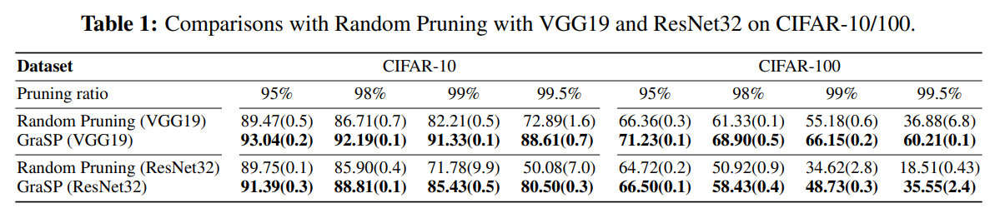

# Picking Winning Tickets Before Training by Preserving Gradient Flow \[KOR\]

##  1. Problem definition

이미지 모델의 빠른 학습과 별개로, 많은 연산량과 증가하는 모델 크기, 그리고 증가하는 데이터셋의 크기는 모델 학습(Training)과 추론(inference)에 많은 제한점을 줍니다. 

이를 해결하기 위해 모델에 사용되는 parameter를 최소화하는 경량화 기법이 다양한 방향으로 연구되어 왔습니다.
* (Han et al.)은 실제로 학습된 모델의 weight이 굉장히 희소하다(sparse)하다는 점을 이용해서 비활성화된 뉴런과 이들의 연결점을 제거하는 가지치기(Model Pruning) 기반의 연구를 진행하였습니다.
* (Hinton et al.)은 경량화된 모델이 실제 학습된 모델과 합의를 하도록 하여, 큰 모델의 지식을 작은 모델로 옮기는 지식 증류(Knowledge Distillation) 기반의 연구를 진행하였습니다.
* (Polino et al.)은 모델 parameter를 더 적은 비트의 형태로 바꾸는 모델 양자화(Quantization)기반의 연구를 진행하였습니다.
이런 모델 경량화 기법을 통하여 추론 시 자원 활용량(test-time resource requirement)를 최소화하는 방법이 꾸준히 연구되고 있습니다.

## 2. Motivation

### Related work
1. Lottery ticket hypothesis
하지만 위 방법론들은 학습된 모델의 parameter를 기준으로 모델의 사이즈를 줄여나가는 방법으로, 여전히 학습 시 자원 활용량(training-time resource requirement)은 큰 상태로 유지됩니다. 이에 연구자들은 위에서 경량화된 모델의 구조만을 활용하여 다시 학습해본다면 training-time resource를 크게 줄일 수 있을것이라 추측하였습니다. 하지만 경량화된 모델의 구조로 학습한 경우 심각한 성능 저하가 뒤따랐습니다. 이런 상황에서, ICLR 2019년에 발표된 [The Lottery Ticket Hypothesis: Finding Sparse, Trainable Neural Networks](https://arxiv.org/abs/1803.03635)라는 연구에서 Iterative Manitude Pruning이라는 방법과 Re-Init이라는 방법 두가지를 사용해서, 경량화된 모델 구조로 원본의 성능을 거의 따라잡는 방법을 제안하였습니다. 하지만 큰 모델에서부터 시작하여 점진적으로 줄여나가는 방법이기에, 조금 더 효율적인 방법이 필요하였습니다.
* (Morcos et al.)은 제안한 방법이 단순히 CIFAR-10과 MNIST에서만 작동하는 것이 아닌, 다양한 데이터셋과 모델, 옵티마이저에서도 작동함을 실험적으로 report하였습니다.
* (Haoran et al.)은 큰 learning rate로 빠르게 학습하고 경량화할 구조(Mask)를 가져와서 더 빠른 학습시 압축 방법을 제안하였습니다.

### Idea

본 논문은, 단순히 모델 parameter의 크기(magnitude)나 활성도(activation) 기반으로 연결점을 끊어내는 것이 아닌, gradient기반 방법론을 제안합니다. 뉴런의 output의 크기가 작아도, 해당 뉴런에 연결된 하위 뉴런들에게 정보 전달(information flow)을 해주는 중요한 node일수 있다는 아이디어가 그 기반입니다. 따라서 이 논문에서 제안한 알고리즘인 GraSP는, gradient의 norm을 계산하고, 그 norm에 가장 변화를 덜 주는 connection을 제거하는 경량화된 모델 구조를 제공합니다.

## 3. Method
먼저, gradient norm을 수식화 하면 다음과 같습니다. 

여기서, (LeCun et al.)등이 밝혀낸, parameter의 변화(perturbation)이 있을때 gradient norm 변화량은 다음과 같습니다.

$$\delta$$만큼의 변화를 주었을때 gradient norm의 변화량 $$S(\delta)$$는 $$2{\delta}^{T}Hg+\mathcal{O}({\| \delta \|}^{2})$$라는 것이죠. H는 parameter의 hessian matrix이고, g는 gradient값입니다. 해당 수식을 pruning task에 맞게 변화시킨다면 변화량 자체는 원래 parameter 크기의 음수로 고정이기 때문에, 뒤쪽 $$\mathcal{O}({\| \delta \|}^{2})$$ term은 사라지게 됩니다. 따라서 이 논문에서는, 각 parameter의 중요도를 다음 수식과 같이 계산하고, 가장 큰 중요도를 가진 parameter를 제외한 나머지 parameter를 제거하는 방법을 사용합니다.

즉, 한번의 forward pass와 gradient 계산을 통해 경량화된 구조를 발견해낼수 있는 알고리즘입니다.
## 4. Experiment & Result
본 논문은 비슷한 시기에 나온 [SNIP](https://arxiv.org/abs/1810.02340)이라는 알고리즘과 성능 비교를 하였습니다. 두 알고리즘 모두 한번의 학습을 통해서 경량화된 구조를 찾아내는 방법이고, 그렇기에 최적의 성능보다는, 얼마나 기존 알고리즘(Lottery ticket, Deep Compression)들의 성능을 유지하는지가 중요한 지표입니다. 결과는 다음과 같습니다.

### Result

다양한 데이터셋과, 모델에서 경량화 성능이 stable하게 좋게 나옴을 확인할 수 있습니다. 또한, Lottery Ticket Hypothesis나(LT), OBD, MLPrune와 같이 iterative하고, training-time resource가 많이 필요한 알고리즘의 성능과 큰 차이가 없음을 확인할 수 있습니다.

단순히 실험 결과 뿐만 아니라, 학습 커브와, 논문에서 강조하였던 gradient norm이 어떻게 변화하는지 또한 저자는 실험 결과로 제공하였습니다. 아래 figure의 우측 그래프를 보시면, GraSP 방법으로 모델 경량화를 진행하였을때 gradient norm이 다른 방법론에 비해 크게 유지가 됨을 저자는 실험적으로 입증하였습니다.

또한 각 layer마다 얼마나 많은 parameter가 가지치기 당했는지 확인하였습니다. 보통 가지치기 기반 방법론은, convolution 연산의 상위 단계 (Layer 10~)의 뉴런을 많이 가지치기 한다고 알려져 있습니다. 상위 단계로 올라갈수록 뉴런 아웃풋이 sparse해지기 때문입니다. 하지만 GraSP 알고리즘은 경쟁 알고리즘인 SNIP 대비 많은 채널을 남긴다는 결과를 아래 figure에서 볼 수 있습니다.

## 5. Conclusion

한번의 학습만으로 효율적인 네트워크 구조를 발견할수 있다는 GraSP 알고리즘은, 단순히 뉴런이 활성화 된것만 중요한 것이 아니라, 뉴런과 뉴런 사이에 얼마나 많은 정보를 유지하느냐가 중요하다는 gradient flow 기반 경량화 방법을 제안하였습니다. 또한 이 연구는 후속 연구에 영향을 주어, 한번도 학습하지 않고도 경량화된 구조를 발견하는 방법 또한 제안하였습니다. 

### Take home message \(오늘의 교훈\)

> 활성화되지 않은 뉴런이라도 하위 뉴런에게 더 많은 정보를 줄 수 있으며, 특히 단 한번으로 경량화된 구조를 찾아야 하는 상황에서는 뉴런 활성도만이 답이 아니다.

## Author / Reviewer information


You don't need to provide the reviewer information at the draft submission stage.


### Author

**이승우(Seungwoo Lee)** 

* Affiliation \(KAIST EE\)
* Research interest in Graph Neural Network

### Reviewer

1. Korean name \(English name\): Affiliation / Contact information
2. Korean name \(English name\): Affiliation / Contact information
3. ...

## Reference & Additional materials

1. Chaoqi Wang, Guodong Zhang, Roger Grosse, Picking Winning Tickets Before Training by Preserving Gradient Flow, In ICLR 2020
2. [Official GitHub repository](https://github.com/alecwangcq/GraSP)
3. Jonathan Frankle, Michael Carbin, The Lottery Ticket Hypothesis: Finding Sparse, Trainable Neural Networks, In ICLR 2019
4. Namhoon Lee, Thalaiyasingam Ajanthan, Philip H. S. Torr, SNIP: Single-shot Network Pruning based on Connection Sensitivity, In ICLR 2019
5. Hidenori Tanaka, Daniel Kunin, Daniel L. K. Yamins, Surya Ganguli, Pruning neural networks without any data by iteratively conserving synaptic flow, In NeurIPS 2021

