# Visual-Linguistic BERT (VL-BERT) \[Eng\]

>> [**Korean version**](https://awesome-davian.gitbook.io/awesome-reviews/paper-review/2021-fall-paper-review/iclr-2020-vlbert-kor) of this article is available.

## 1. Problem Definition

In the deep learning field, the method of learning generic feature representations through pre-training to increase the performance of downstream tasks has now become a hallmark. A method of using of pretrained model on ImageNet data as a backbone network in the Vision area or BERT using "Masked Language Modeling(MLM)" method in the NLP field are typical examples.

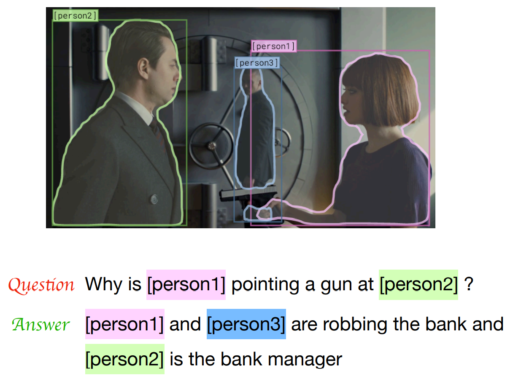

However, pre-training methods for the problems such as the Visual Question Answering (VQA) task that require generic feature representations encompassing image and text have not been covered in depth(Note that this paper was written in 2019). This is because it is not easy to learn meaningful features by aggregating and aligning visual and linguistic information.

Therefore, in this paper, they propose a pre-training method to learn visual-lingustic information jointly that is useful and efficient for multi-modal downstream tasks.

## 2. Motivation

This paper is inspired by the powerful attention module of Transformer (Vswani et al.) released in 2017 and BERT's pre-training method (Devlin et al.) in 2018 in solving the problem presented above. Before looking at Main Idea, if we look at related work,

### Related works

* **Pre-training for Computer Vision** : With the success of AlexNet in ImageNet classification, we see the renaissance of convolutional neural networks (CNNs) in the vision community. Soon after that, researchers found that ImageNet **pre-trained CNNs can serve well as generic feature representation** for various downstream tasks, such as object detection, semantic segmentation, instance segmentation. The improvement in backbone networks for ImageNet classification further improves the downstream tasks.

* **Pre-training for Natural Language Processing** : It is interesting to note that the development of pre-training techniques in NLP lags quite behind computer vision. Since 2014, there have been various studies on word embedding, but this is a study on low-level features, mainly researches on stacking various architectures on top of these word embeddings. After emergence of Transformer architecture, a serious of approaches are proposed for pre-training the generic representation. Among them, **BERT is perhaps the most popular one due to its simplicity and superior performance.**

* **Pre-training for Visual-Lingustic**: Concurrent to our work, multiple works released on Arxiv very recently also seek to derive a pretrainable generic representation for visual-linguistic tasks.
    - 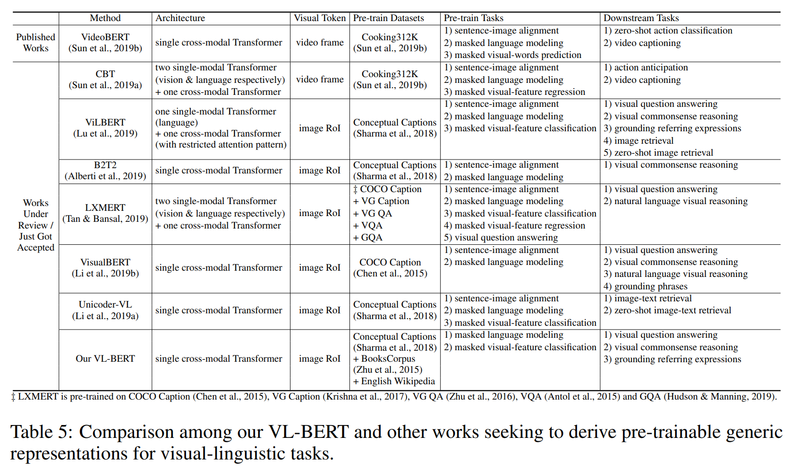
    - There are three noticeable differences between ours and other concurrent works, 1) No use of Sentence-Image Relationship Prediction Task in VL-BERT 2) We pre-train VL-BERT on both visual-linguistic and text-only datasets. 3)  In VL-BERT, the parameters of Fast R-CNN, deriving the visual features, are also updated.

Anyway, if you see similar studies pouring out within 3 weeks, you can see that research on Visual-Linguistic is becoming very active area.

### Idea

As mentioned above, the main idea of ​​this paper is to use the unified and powerful architecture of Transformer to propose an architecture that can process image and text features as single-stream, and new MLM-like pre-training method as in BERT in order to improve the performance in several Visual-Linguistic tasks.

To summarize,

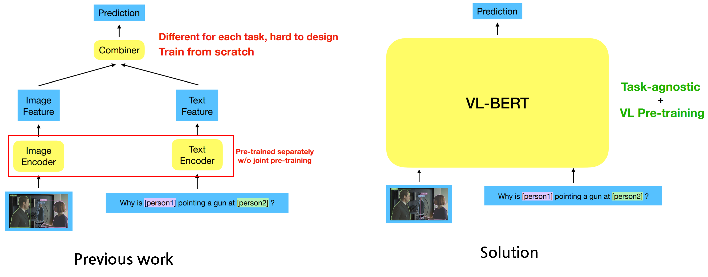

## 3. Method

### BERT(Bidirectional Encoder Representation from Transformer)

Before deep diving into main-methods, let's briefly explain methods in BERT firstly.

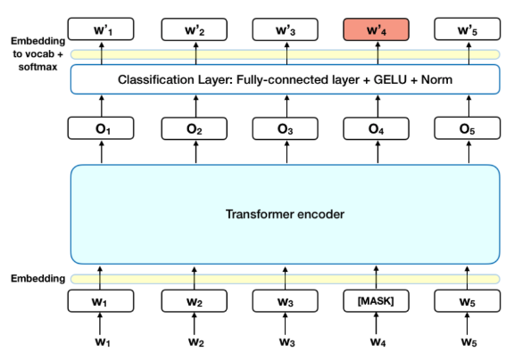

As shown in the figure above, the architecture of BERT is a Transformer Encoder and a Classification Layer stacked on it. BERT's pre-training method, called MLM(Masked Language Model), replaces a some of the input tokens with a special token called [MASK], and then predicts the original token from the output passed through the Transformer encoder and the Classification Layer. Through the process of inferring the original token corresponding to [MASK] as an attention mechanism with surrounding tokens, BERT naturally acquires the ability to understand the context of the input text. The acquired Contextualized Representation has been proven to be useful in various NLP tasks.

And also, there are some tokens with special purpose in BERT.

* **[MASK]** : Token used to mask the original Token. Model sholud predict which token was originally in this [MASK] token location.
* **[CLS]** : Token appended to the beginning of the input token. In BERT, the Next Sentence Prediction Task (NSP, Binary classification task) is performed using the output vector of this token to learn whether the two input sequences are consecutive sequences or not. As this task progresses, the representation of this token is trained to contain the context of all input tokens.
* **[SEP]** : For NSP Task, inputs are two text sequences. By appending [SEP] token at the end of each sequence(totally 2), it gives little help to model for understanding the input sequence structure.

That is, the input of BERT will have the following structure:

* [CLS] tok1  ... [MASK] ... tok-n [SEP] tok'1 ... [MASK] ... tok'-m [SEP]

Also, BERT has 3 embedding layers before encoder.

* **Token Embedding**: A lookup table vectorizing each token in hidden dimension.
* **Segment Embedding**: An embedding layer to give different values ​​to two sequences of BERT.
* **Positional Embedding**: In BERT, unlike RNN and LSTM, all tokens are input at once, so the embedding value that allows the same token to have different values ​​depending on the position.

### VL-BERT Architecture

Finally, the structure of VL-BERT.

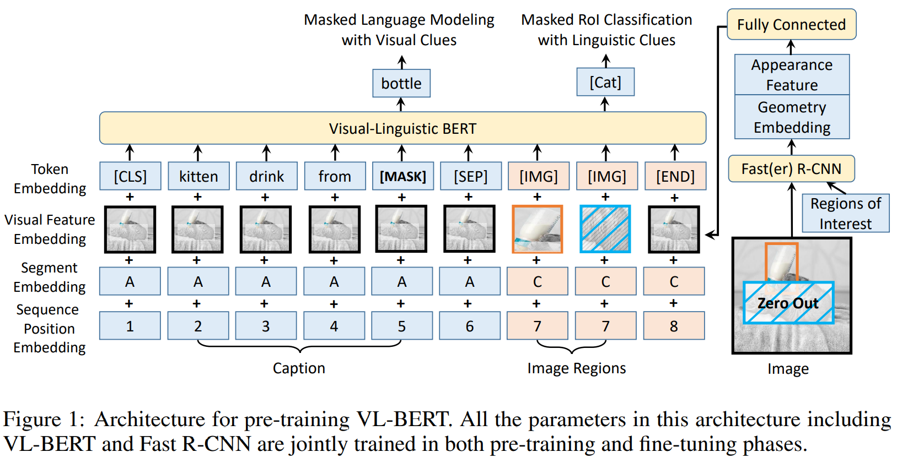

It looks similar to Transformer or BERT except the area to handle a region of interest (ROI) has been added to process image features.
The input sequence always starts with a special classification element ([CLS]), then goes on with linguistic elements, then follows up with visual elements, and ends with a special ending element ([END]). A special separation element ([SEP]) is inserted in between different sentences in the linguistic elements, and between the linguistic and visual elements. 

And there are four types of embedding,

* Token Embedding : Similar to BERT, using WordPiece Embedding with 30,000 vocabs. Since image region is not a word, it is replaced with a special token called [IMG].

* Visual Feature Embedding : It consists of Visual Appearance + Visual Geometry Feature.
  * **Visual Appearance Feature** : Visual features corresponding to each RoI are extracted using Fast R-CNN Detector using the feature vector prior to output layer(2048-d). For the non-visual elements, the corresponding visual appearance features are of features extracted on the whole input image with Fast R-CNN.
  * **Visual geometry Embedding** : The visual geometry embedding is designed to inform VL-BERT the geometry location of each input visual element in image. Each RoI is characterized by a 4-d vector, as $$x_{LT}/W$$, $$y_{LT}/H$$, $$x_{RB}/W$$, $$y_{RB}/H$$, where each element denotes the corresponding coordinate of thop-left and bottom-right.
  * After the above two elements are concated, they pass through the Fully Connected layer and are attached to each input element.

* Segment Embedding : Embedding for corresponding three types of input types(A,B,C). A and B for the words from the first and second input sentence respectively, and C for the RoIs from the input image. For example, for input format of \<Question, Answer, Image\>, A denotes Question, B denotes Answer, and C denotes Image. For input format of \<Caption, Image\>, A denotes Caption, and C denotes Image. A learned segment embedding is added to every input element for indicating which segment it belongs to.

* Sequence Positional Embedding : Positional Embedding as in BERT is added only for Text Element (Learnable).

### Pre-training VL-BERT

This part seems to be the most important part of this paper.
There are two pre-training tasks of VL-BERT.

* **Task #1 Masked Language Modeling with Visual Clues** : This task is similar to BERT's MLM, except that the [MASK] token (15% randomly masked) is inferred using visual clues. . For example, in Figure 1 “kitten drinking from [MASK]”, without the input image, the masked word could be any containers, such as “bowl”, “spoon” and “bottle”. The representation should capture the correspondence of the word “bottle” and the corresponding RoIs in the image to make the right guess. During pre-training, the final output feature corresponding to the masked word is fed into a classifier over the whole vocabulary, driven by Softmax cross-entropy loss.

* **Task #2 Masked RoI Classification with Linguistic Clues** : Conversely, in this task, 15% of the RoI is masked (all pixels set as zero). In Figure 1, Kitten's image is input to Fast R-CNN with masking. When only Visual Clue is considered, the model cannot know whether the image is Kitten, so it infers that the masked image is Kitten using the linguistic clue "Kitten drinking from [MASK]". The input RoI is trained with Softmax cross-entropy loss to perform the Object Category Classification Task.

To perform the above tasks, VL-BERT utilizes Conceptual Caption Corpus. This dataset contains 3.3M images and captions, but there is an issue that **the caption is too short**, so BookCorpus and English Wikipedia are additionally used. However, since the sample drawn from 
BookCorpus and Wikipedia does not have visual information, only task1 is performed in that case.

In summary, the pre-training on visual-linguistic corpus improves the detailed alignment between visual and linguistic contents. While the pre-training on text-only corpus facilitates downstream tasks involving understanding of long and complex sentences.

### Fine-tuning VL-BERT

Fine-tuning of VL-BERT is very simple. For each task, input format is defined corresponding to each task such as \<Caption, Image\>, \<Question, Answer, Image\>, and use the final output of [CLS] token to perform Sentence-Image-Relation Level prediction. On the other hand, word-level or RoI-level prediction utilizes the final output of each word and RoI token.

## 4. Experiment & Result

### Pre-training

For pre-training, the weights of the BERT-Base and BERT-Large models are used. Newly added parameters are initialized to Gaussian (0, 0.02), and Fast R-CNN + ResNet-101 trained on the Visual Genome (Krishna et at., 2017) dataset is used for visual content embedding.

Fast R-CNN is used to extract RoI from conceptual caption data. 10 to 100 RoIs for each image with a detection score of greater than 0.5 are selected.

### Visual Commensence Reasoning

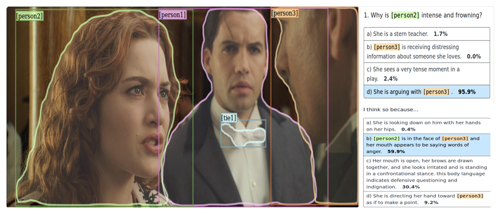

As shown in the figure above, in this task, the model should pick the right answer to the question and provide the rationale explanation too.

* Q → A : find the answer for the given question.
* QA → R : fint the rationale explanation for answer and question.

The dataset used in this paper is proposed by Zeller et al.,(2019), and consists of a total of 265K pairs of \<question, answer, reason\> and 100K movie images.

To perform this task, VL-BERT uses the following structure.

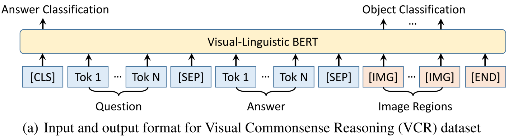

For the sub-task of Q→A task, reason is not required for Task. So,  ‘Q’ and ‘A’ are filled to the Question section and Answer section respectively.
For the sub-task of QA → R , the concatenation of ‘Q’ and ‘A’ is filled to the Question section, and ‘R’ is filled to the Answer section.
The final output feature of [CLS] element is fed to a Softmax classifier for predicting whether the given Answer/Reason is the correct choice.

In addition, during fine-tuning, we adopt two losses, the classification over the correctness of the answers and the RoI
classification with linguistic clues.

Below are the results for that experiment.

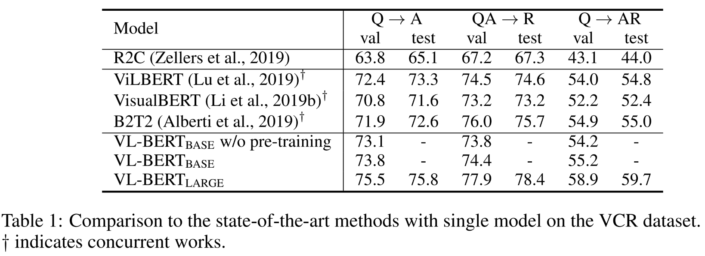

As you can see, it shows superior performance compared to the recently appeared multi-modal module.

### Visual Question Answering

For this task, the most widely used VQA v2.0 (Goyal et al., 2017) was used. To perform this task, the following structure is used.

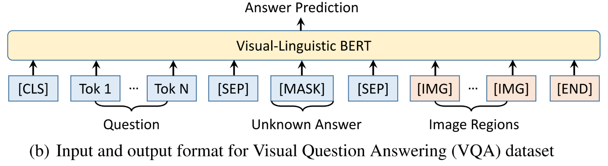

As shown in the figure above, VQA is performed by predicting the words that will be in the [MASK] token as in MLM.
The input RoI is extracted using the Fast R-CNN detector trained on the Visual Genome Dataset.

The table below shows the results for the VQA Task. Compared to the BUTD model tested with the same experimental settings, the performance was improved by more than 5%. But compared to the LXMERT, the performance was relatively lower. This is presumably because LXMERT was pre-trained using a large amount of VQA dataset, but **VL-BERT was pre-trained only with Image Captioning/Text-Only dataset.**

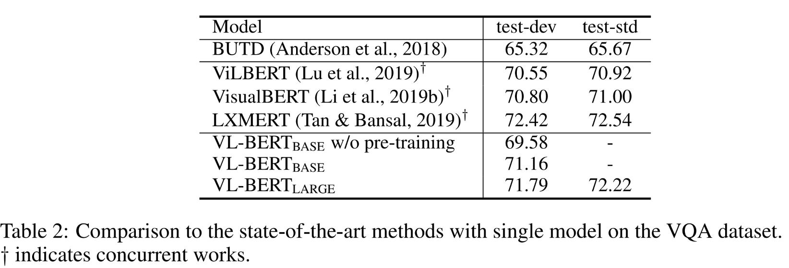

### Referring Expression Comprehension

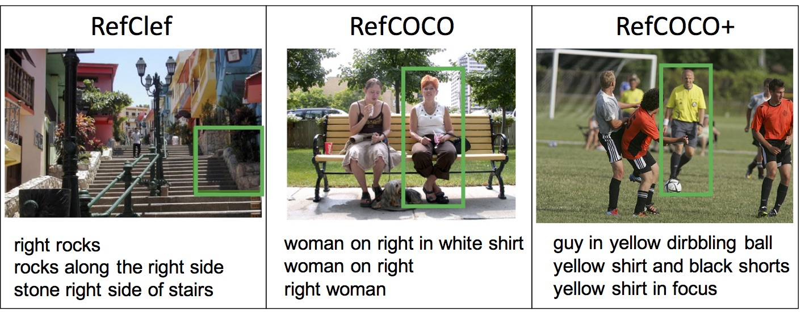

This task is a task that localizes the ojbect that matches the given referring expression in the image. In this paper, the RefCOCO+ dataset (141K Expression, 50K ojbects in 20K images) was used. This dataset consists of 4 datasets: Train/Valid/Test-A/Test-B. Test-A contains multiple people, whereas Test-B contains multiple objects.

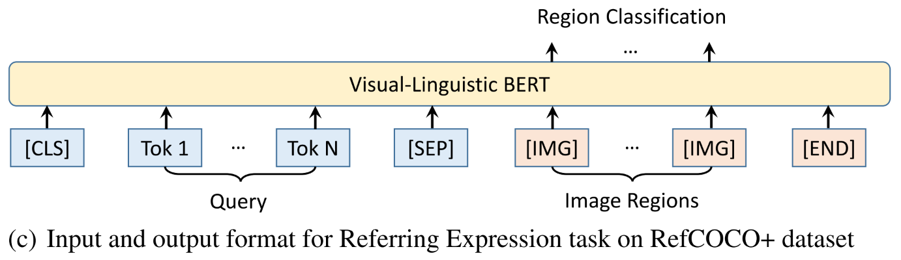

In the task, as shown in the figure above, input Query and Image (RoI) as inputs, learn each RoI as Binary Classification Loss, and then select the object with the highest classification score as the correct answer in the inference step. Here, RoI utilized Ground Truth or a detection box of MAttNet (Yu et. al, 2018). Each result is shown in the table below. Compared to MAttNet, it showed superior results, but compared to VilBERT, it can be seen that it shows similar performance.

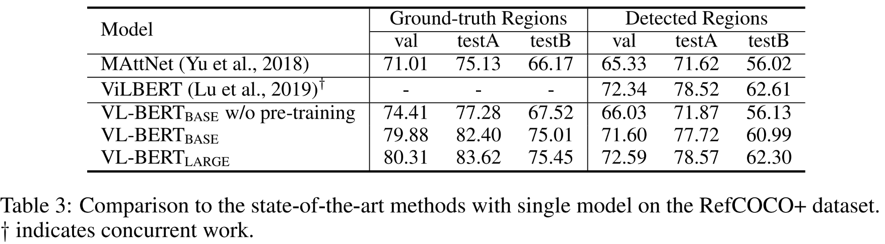

### Ablation Study

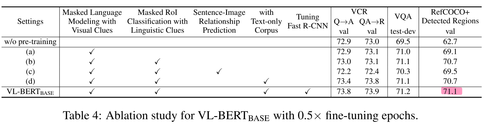

In this paper, ablation studies on various pre-training setups are also conducted.

**Masking technique was very helpful for the RefCOCO+ dataset**, but there is no big gain for the VCR, VQA Task. The author said this might be because only RefCOCO+ utilizes the final output feature corresponding to [IMG] tokens for prediction. Thus the pre-training of such features is beneficial. However, Sentence-Image Relationship Prediction as in ViLBERT and LXMERT seemes hurting accuracy on all the three tasks. They guess the reason is because this task would introduce **unmatched image and caption pairs as negative examples**. Such unmatched samples would hamper the training of other tasks. Lastly, a text-only corpus training as in (d) was very helpful for the VCR task because longer and more complex sentences were included as input in the VCR task.

## 5. Conclusion

In this paper, they proposed a pre-learning method for learning generic representations that is helpful for visual-linguistic tasks. And also they introduce **VL-BERT** trained by proposed methods with Transformer architecture, and its effectiveness was proven in three downstream tasks.

### Take home message

* Research on how to learn Visual and Lingustic Information together is emerging.
* BERT's MLM can also be applied to Visual-Linguistic Tasks.
* Transformer Architecture can be also useful for learning Multi-Modal Information. 

## Author / Reviewer information

### Author

**이현제 \(Hyunjae Lee\)** 

* KAIST Software Development
* oglee815@gmail.com
* https://oglee815.github.io/

### Reviewer

1. Korean name \(English name\): Affiliation / Contact information
2. Korean name \(English name\): Affiliation / Contact information
3. ...

## Reference & Additional materials

1. Su, Weijie & Zhu, Xizhou & Cao, Yue & Li, Bin & Lu, Lewei & Wei, Furu & Dai, Jifeng. (2019). VL-BERT: Pre-training of Generic Visual-Linguistic Representations. 
2. Github : https://github.com/jackroos/VL-BERT
3. https://www.weijiesu.com/research/VL-BERT/VL-BERT-ICLR-present-final.pdf
4. BERT Explanation : https://medium.com/analytics-vidhya/explainability-of-bert-through-attention-7dbbab8a7062
5. VCR dataset : https://visualcommonsense.com/
