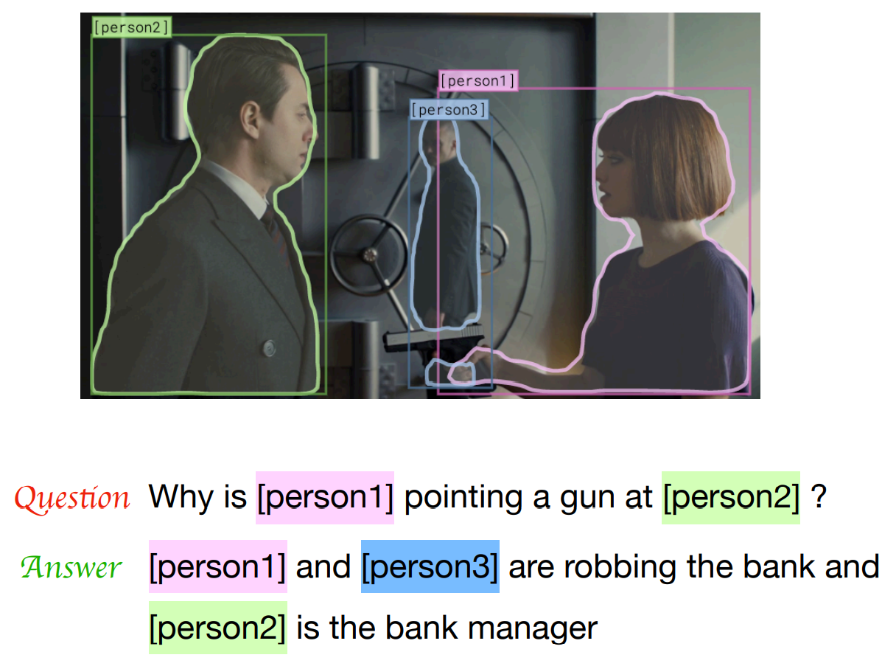
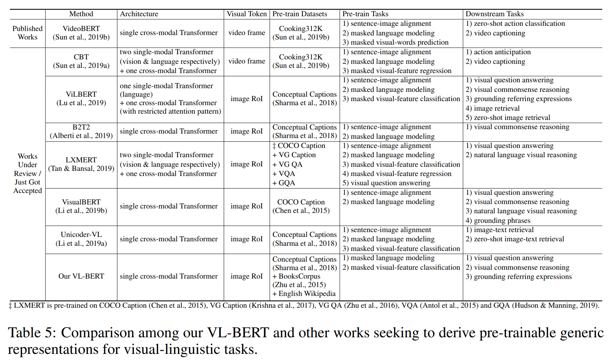
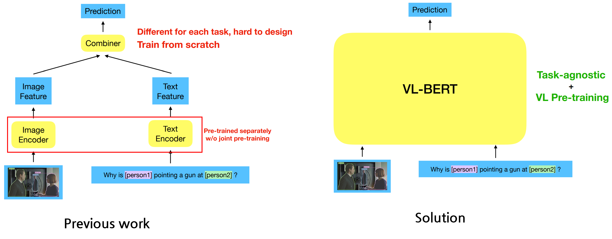
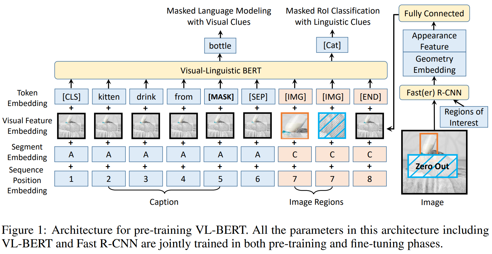
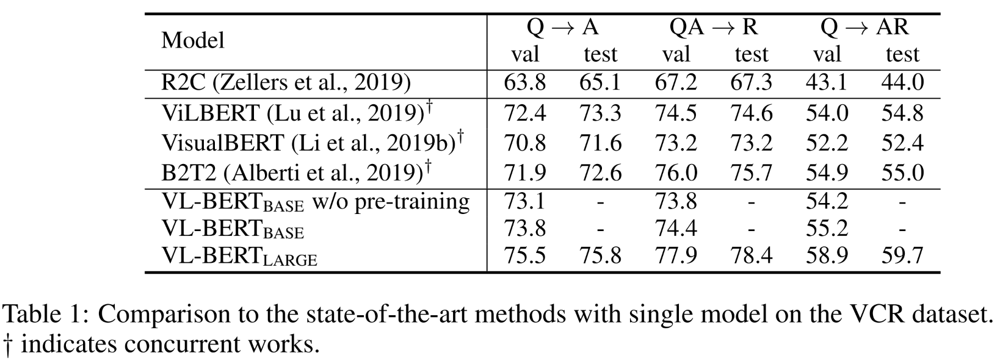
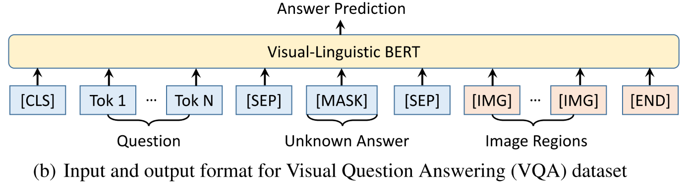
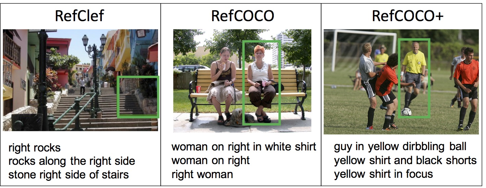
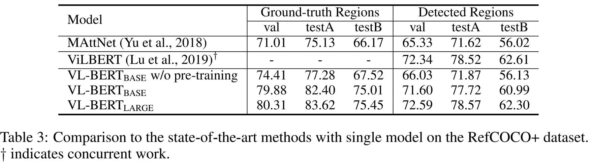

# Visual-Linguistic BERT (VL-BERT) \[Kor\]

>> [**English version**](https://awesome-davian.gitbook.io/awesome-reviews/paper-review/2021-fall-paper-review/iclr-2020-vlbert-eng) of this article is available.

## 1. Problem Definition

딥러닝 분야에서 사전 학습(Pre-training)을 통해 Generic feature representation을 학습하여 Downstream 테스크의 성능을 높이는 방식은 이제는 전형적인 방식(Hallmark)이 되었습니다. ImageNet 데이터에 사전 학습 된 모델을 Backbone으로 사용하는 Vision 영역에서의 방식이라든가, 조금 더 최근에 등장한 NLP 분야에서 "Masked Language Model" 방식을 활용한 BERT와 같은 모델이 대표적인 예입니다.

하지만 Visual Question Answering(VQA) 테스크처럼 이미지와 텍스트를 아우르는 generic feature representation이 필요한 영역에 대한 사전 학습 방법은 그동안 깊이 다루어지지 않았습니다. Visual Information과 Text Information을 종합(aggregate)하고 조정(Align)하여 유의미한 특징을 학습하는 것이 쉽지 않기 때문입니다.

따라서 본 논문에서는 **Multi-Modal(Vision+Linguistic) information을 효율적으로 학습하여 Multi-modal Downstream 테스크에 도움이 되는 사전 학습 방식**을 제안하고자 합니다.

## 2. Motivation

본 논문에서는 위에서 제시한 문제를 해결하는데 있어서 2017년에 나온 **Transformer**(Vaswani et al.)와 2018년 **BERT**(Devlin et al.)의 강력한 Attention Module에서 영감을 얻었습니다. Main Idea를 살펴보기 전에 Related Work을 살펴 보면,

### Related works

* **Computer vision** 영역에 있어서 사전학습에 대한 연구는 AlexNet과 CNN의 성공과 함께 가속화 되었습니다. ImageNet과 같은 Image Classification Task에서 사전 학습된 모델은 다른 Image 관련 Task, 예를 들면 Object Detection, Semantic Segmentation, Instance Segmenation과 같은 Task에서도 좋은 성능을 보였습니다.

* **Natural Language Processing** 영역에서의 사전학습에 대한 연구는 CV영역에 비해서는 굉장히 늦게 시작되었습니다. 2014년 이후에 Word Embedding에 대한 다양한 연구(Mikolov et al., Pennington et al., Kiros et al.)가 있었지만 이는 low-level feature에 대한 연구로서 이러한 word embedding 위에 다양한 아키텍처를 쌓아 올리는 연구가 주로 진행되었습니다. 이후 2017년에 등장한 Transformer에서는 여러 NLP Task에서 공통적으로 잘 동작하는 Generic building block(attention module)이 제안되었고, 이 아키텍처를 활용한 다양한 사전 학습 방법이 제안되었는데요, Radford의 GPT 시리즈를 비롯하여 XLNet (Yang et al., 2019), XLM (Lample & Conneau, 2019) and RoBERTa (Liu et al., 2019) 등이 등장하였고, 그 중 심플하면서도 강력한 성능을 보여주었던 **BERT는 NLP 사전학습 모델 중 가장 유명한 모델**이 되었습니다.

* **Visual-Lingustic** task에 관한 사전학습 연구는 본 논문이 publish 되는 시점과 동시에 여러 방식이 제안되었습니다(하단 테이블 참조).
    - 
    - 다른 연구와 VL-BERT의 세가지 차이점을 들자면, 1) Sentence-Image Relationship Prediction Task를 VL-BERT에서는 사용하지 않음. 2) VL-BERT는 image-text dataset 뿐 아니라, Text-Only dataset에서도 사전학습을 진행. 3) VL-BERT에서는 Image Feature를 위해 사용되는 Fast R-CNN도 update 대상임.

어쨌든 비슷한 연구가 3주 안에 쏟아져나온 것을 보면, **Visual-Linguistic에 관한 연구가 매우 중요하게 다루어지고 있음**을 알 수 있습니다.

### Idea

위에서 언급한 것과 같이 본 논문의 Main Idea는 Transformer의 unified and powerful 한 아키텍처를 활용해서 **Image와 Text Feature를 Single-stream** 으로 처리 할 수 있는 아키텍처를 제안하고, BERT에서와 같이 **MLM(Masked Language Modeling) Based의 Pre-training 방식**을 제안하여 여러 Visual-Linguistic task에서 성능을 향상시키고자 합니다.
정리하면 아래와 같습니다.

## 3. Method

### BERT(Bidirectional Encoder Representation from Transformer)

본격적으로 Method를 살펴보기에 앞서, BERT를 간략히 설명하겠습니다.

위 그림에서와 같이 BERT의 아키텍처는 Transformer의 Encoder와 그 위에 Classification Layer를 쌓은 모습입니다. MLM이라 불리우는 BERT의 Pre-training 방식은 입력되는 토큰의 일부를 [MASK]라는 특수 토큰으로 대체한 뒤, 이를 Transformer encoder와 Classification Layer를 통과시킨 output에서 원래 Token을 예측하는 방식입니다. [MASK]에 해당하는 원래 Token을 주변 Token들과의 Attention Mechanisim으로 유추하는 과정을 통해서 BERT는 자연스럽게 입력 Text의 Context를 이해하는 능력을 습득하게 됩니다. 이렇게 습득한 Contextualized Representation은 다양한 NLP Task에서 도움이 되는 것이 증명되었습니다.

VL-BERT의 이해를 돕기 위해 몇가지 추가 설명을 하자면, BERT에서 사용되는 Token들에는 특수 목적을 가진 Token들이 존재합니다.

* **[MASK]** : 원래 Token을 가리기 위해 사용하는 Token. 이 [MASK] 토큰 위치에 원래 어떤 토큰이 있었는지를 유추해야함.
* **[CLS]** : 입력 토큰의 맨 앞에 붙이는 Token. BERT에서는 이 토큰의 output vector를 가지고 입력된 2개의 Sequence가 이어지는 sequence인지 아닌지를 학습하는 Next Sentence Prediction Task(NSP, Binary classification task)를 수행함. 이 Task가 진행됨에 따라 이 Token의 Representation은 입력되는 모든 token들의 Context를 담을 수 있도록 훈련됨.
* **[SEP]** : NSP Task를 위해서는 2개의 Sequence(Sentence로 이해해도 무리는 없으나 실제로 문장 단위는 아님)를 입력시키는데 각 Sequence의 끝에 [SEP] 토큰을 입력시킴으로써, 입력 Sequence 구조를 모델에게 알려주게 됨.

즉, BERT의 입력은 다음과 같은 구조가 됩니다. 

* [CLS] tok1  ... [MASK] ... tok-n [SEP] tok'1 ... [MASK] ... tok'-m [SEP]

또한 BERT에는 Encoder에 입력되기전 3가지 Embedding Layer가 존재합니다.

* **Token Embedding**: 각 토큰을 hidden dimmension 차원으로 확장하기 위한 lookup table
* **Segment Embedding**: BERT의 2개의 sequence에 각각 다른 값을 주기 위한 embedding layer
* **Positional Embedding**: BERT에서는 RNN, LSTM 등과 달리 모든 토큰이 한번에 입력이 되므로, 같은 토큰이라도 위치에 따라서 다른 값을 가질 수 있도록 해주는 Embedding 값. Transformer의 Positional Encoding 과는 다름.

### VL-BERT Architecture

드디어 VL-BERT의 구조입니다.

기본적으로 BERT에서와 같은 Text input과 Image Feature를 처리하기 위한 Region of Interest(ROI)가 추가된 모습입니다. BERT에서와 같이 [CLS] 토큰이 가장 먼저 입력이 되고 그 뒤, Linguistic elements가 입력이 됩니다. 이 때, [SEP] 토큰은 서로 다른 문장 사이에 입력이 되고, Linguistic 과 Visual Elements 사이에도 입력이 됩니다. 모든 입력의 끝에는 [END] 라는 특수 토큰이 입력이 됩니다.

Embedding Layer에는 4가지 타입이 존재합니다.

* Token Embedding : BERT와 유사하게, WordPiece Embedding(Wu et al., 2016)를 사용, Vocabulary는 30,000. Image Region은 단어가 아니므로 [IMG]라는 특수한 토큰으로 대체하여 입력함.
* Visual Feature Embedding : Visual Appearance + Visual Geometry Feature 로 나누어 짐.
  * **Visual Appearance Feature** : 각 RoI에 해당하는 visual feature는 Fast R-CNN(Girshich 2015) Detector를 활용하여 최종 output layer 이전의 feature를 추출함(2048-d). Text와 같은 non-visual 요소의 경우, 전체 이미지에 대한 feature를 마찬가지로 Fast R-CNN을 통해 추출하여 입력함.
  * **Visual geometry Embedding** : 각 RoI의 geometry 정보를 추출하기 위한 Embedding. RoI의 왼쪽 위(LT), 오른쪽 아래(RB)의 좌표를 나타내는 $$x_{LT}$$, $$y_{LT}$$, $$x_{RB}$$, $$y_{RB}$$의 4가지 값과, 이미지의 높이(H)와 너비(W)값을 활용하여, $$x_{LT}/W$$, $$y_{LT}/H$$, $$x_{RB}/W$$, $$y_{RB}/H$$의 4-D Vector로 표현됨(2048-d).
  * 위 두가지 요소는 concat 된 뒤, Fully Conntected 레이어를 통과하여 각 Input 요소에 attach 됨.

* Segment Embedding : A,B,C 세가지 Input Type에 맞는 Embedding. A와 B는 Text, C는 RoI. Text가 A와 B로 나눠지는 이유는 Visual Question Answering의 경우, Answer와 Question이 각 A, B로 나누어져 들어가기 때문임. Image Caption과 같이 두 가지 타입의 Text가 필요 없는 경우에는 B는 입력되지 않음.

* Sequence Positional Embedding : BERT에서와 같은 Positional Embedding이 추가되며, Text Element에만 추가됨(Learnable).

### Pre-training VL-BERT

이 부분이 이 논문에서 가장 중요한 부분 일 것 같습니다.
VL-BERT의 Pre-training Task는 2가지 입니다.

* **Task #1 Masked Language Modeling with Visual Clues** : 이 Task는 BERT의 MLM과 유사하지만, visual clues를 활용하여 [MASK] 토큰(15% randomly masked)을 유추하는 것이 차이점 입니다. 예를 들어, Figure1의 예시에서 "Kitten drinking from [MASK]" 라는 입력 문장에서 [MASK]를 유추할 때, Text information만 고려했을 경우 "bottle", "spoon", "bowl" 등 어떤 종류의 container도 가능하지만 Visual Information인 RoI를 고려하게 된다면 "bottle"이 정답이라는 것을 구별 할 수 있게 됩니다.

* **Task #2 Masked RoI Classification with Linguistic Clues** : 이 Task에서는 반대로 RoI의 15%가 Masking 됩니다(all pixels set as zero). Figure 1에서는 Kitten의 이미지가 masking 된 채로 Fast R-CNN에 입력이 됩니다. 모델은 Visual Clue만 고려했을 경우, 해당 이미지가 Kitten인지 알 수가 없기 때문에 "Kitten drinking from [MASK]"라는 Linguistic clue를 이용하여 Masking 된 이미지가 Kitten임을 유추하게 됩니다. 입력이 된 RoI는 Object Category Classification Task를 수행하기 위해 Softmax cross-entropy loss로 학습이 되게 됩니다.

위와 같은 Task를 수행하기 위해 VL-BERT에서는 Conceptual Caption Corpus(Sharma et al., 2018)을 활용합니다. 이 dataset은 3.3M의 이미지와 Caption이 달려있는 데이터셋으로서, **caption이 너무 짧은 이슈**가 있기 때문에, BookCorpus(Zhu et al., 2015)와 English Wikipedia를 추가로 활용합니다. 다만 BookCorpus와 Wikipedia는 <이미지, Caption> 으로 이루어진 데이터셋이 아니기 때문에 해당 데이터셋에서 뽑혀진 Sample은 Visual Information을 넣어주지 않고 오로지 Task1만을 수행하게 됩니다.

### Fine-tuning VL-BERT

VL-BERT의 Fine-tuning은 매우 간단합니다. 각 Task에 맞게 <Caption, Image>, <Question, Answer, Image>와 같은 포맷으로 입력을 넣고 [CLS] 토큰의 final output을 활용하여 Sentence-Image-Relation Level의 prediction을 수행하고, word-level이나 RoI-level의 prediction은 각 word와 RoI 토큰의 final output을 활용합니다.

## 4. Experiment & Result

### Pre-training

Pre-training을 위해서는 BERT-Base 와 BERT-Large 모델의 weight를 그대로 intiailized 하여 사용합니다. 새롭게 추가되는 파라미터들은 Gaussian(0, 0.02)로 초기화 되며, Visual content embedding을 위해서는 Visual Genome(Krishna et at., 2017) 데이터 셋에 훈련된 Fast R-CNN + ResNet-101을 사용합니다.

Conceptual Caption 데이터에서 RoI를 뽑아내기 위해서는 Fast R-CNN을 활용합니다. detection score가 0.5 이상인 10-100개의 RoI가 각 이미지당 선택됩니다.

### Visual Commensence Reasoning

위 그림에서처럼 VCR Task에서는 질문에 대한 정답과 함께 해당 정답에 대한 이유까지 찾아야하는 Task 입니다. 따라서 해당 Task는 2개의 sub-task로 나누어집니다.

* Q → A : 주어진 Question 에 맞는 Answer 찾아 내는가?
* QA → R : 주어진 Question과 Answer 에 맞는 Reason을 찾아 내는가?

해당 논문에서 사용한 데이터 셋은 Zeller et al., (2019)에서 제안된 데이터셋으로서, 총 265K의 <질문, 정답, 이유> 쌍과 100K의 영화 이미지로 이루어져 있습니다.

이 Task를 수행하기 위해 VL-BERT에서는 아래와 같은 구조를 사용합니다.

Q → A Task를 위해서는 Reason이 필요 없으므로 Question과 Answer에 각각 입력이 들어가고, [CLS] 토큰을 활용하여 입력으로 들어간 Answer이 맞는지 예측합니다.

QA → R Task를 위해서는 Quesiton 영역에 Q와 A가 Concat되어 들어가고, Answer 영역에 Reason이 들어가서 마찬가지로 [CLS] 토큰으로 알맞은 Reason인지 예측합니다.

또한 Fine-tuning과정에서 입력으로 들어가는 RoI(Ground Truth)를 활용하여 Linguistic Clue를 활용한 RoI classification Task를 동시에 학습합니다.

아래는 해당 실험에 대한 결과입니다.

보시다시피 최근에 동시에 등장한 Multi-modal 모듈에 비해서도 우수한 성능을 보임을 알 수 있습니다.

### Visual Question Answering

해당 Task를 위해서는 가장 많이 쓰이는 VQA v2.0(Goyal et al., 2017)을 사용했습니다. 이 task를 수행하기 위해서는 아래와 같은 구조를 사용합니다.

위 그림에서와 같이, MLM에서 처럼 [MASK] 토큰에 들어갈 단어를 예측하는 방식으로 VQA를 수행합니다. 입력되는 RoI는 Visual Genome Dataset에 훈련된 Fast R-CNN detector를 활용하여 extract 합니다.

아래 표에는 VQA Task에 대한 결과가 나와 있습니다. 동일한 실험 셋팅으로 실험된 BUTD 모델에 비해서 5% 이상 성능 향상을 보였으나 LXMERT 대비로는 낮은 성능을 보였습니다. 이는 LXMERT는 대량의 VQA dataset을 활용하여 사전학습 되었으나 VL-BERT는 Image Captioning/Text-Only 데이터셋으로만 사전학습 되었기 때문으로 추측합니다.

### Referring Expression Comprehension

이 Task는 이미지에서 주어진 설명(refering expression)에 맞는 ojbect를 localize하는 Task 입니다. 이 논문에서는 RefCOCO+ 데이터셋(141K Expression, 50K ojbects in 20K images)을 사용하였습니다. 이 dataset은 Train/Valid/Test-A/Test-B의 4개의 데이터셋으로 이루어져 있습니다. Test-A에는 여러명의 사람이 등장하지만 Test-B에는 여러개의 물체가 등장하는 것이 특징입니다.

해당 Task에서는 위 그림에서와 같이 Query와 Image(RoI)를 입력으로 넣고 각 RoI를 Binary Classification Loss로 학습을 한 뒤, inference 단계에서는 가장 classification Score가 높은 Object를 정답으로 선택합니다. 여기서 RoI는 Ground Truth를 활용하거나 MAttNet(Yu et. al,2018)의 detected box를 활용하였습니다. 각 결과는 아래 표에 있습니다. MAttNet 대비해서는 월등한 결과를 보였으나, VilBERT와 비교했을 경우, 유사한 성능을 보임을 알 수 있습니다.

### Ablation Study

본 논문에서는 다양한 Pre-training Setup에 관한 Ablation Study 또한 진행합니다.

(a), (b)의 경우, W/O Pre-training 대비하여 RefCOCO Task에는 많은 도움이 되었으나 **VCR, VQA Task에는 큰 이득은 없습니다.** 이는 RefCOCO Task에서만 [IMG] token을 prediction에 사용하기 때문으로 유추합니다.(c)에서 사용된 Sentence-Image Relationship Predicton Task는 LXMERT와 VilBERT에서 사용된 Task로서, 이미지와 매치되지 않는 text를 negative sample로 사용하는데 이 때문에 **VCR, VQA, RefCOCO Task에 안좋은 영향**을 끼친 것으로 유추합니다. 마지막으로 (d)에서와 같이 Text-only corpus를 활용한 방식은 **유독 VCR Task에 도움이 많이 되었는데** 이는 VCR Task에서 좀 더 길고 복잡한 문장들이 입력으로 사용되었기 때문입니다.

## 5. Conclusion

본 논문에서는 visual-linguistic task에 도움이 되는 generic representation 학습을 위한 사전 학습 방법을 제안하였습니다. 해당 방식과 Transformer Backbone을 활용한 **VL-BERT**를 소개하고, 3가지 Downstream Task에서 그 효과를 증명하였습니다.

### Take home message \(오늘의 교훈\)

* Visual과 Lingustic Information을 함께 학습하는 방식에 대한 연구가 활발해지고 있다.
* BERT의 MLM을 Visual-Linguistic Task에도 적용할 수 있다.
* Multi-Modal Information을 학습하는데에는 Transformer Architecture가 유용 할 수 있다.

## Author / Reviewer information

### Author

**이현제 \(Hyunjae Lee\)** 

* KAIST Software Development
* oglee815@gmail.com
* https://oglee815.github.io/

### Reviewer

1. Korean name \(English name\): Affiliation / Contact information
2. Korean name \(English name\): Affiliation / Contact information
3. ...

## Reference & Additional materials

1. Su, Weijie & Zhu, Xizhou & Cao, Yue & Li, Bin & Lu, Lewei & Wei, Furu & Dai, Jifeng. (2019). VL-BERT: Pre-training of Generic Visual-Linguistic Representations.
2. Github : https://github.com/jackroos/VL-BERT
3. https://www.weijiesu.com/research/VL-BERT/VL-BERT-ICLR-present-final.pdf
4. BERT Explanation : https://medium.com/analytics-vidhya/explainability-of-bert-through-attention-7dbbab8a7062
5. VCR dataset : https://visualcommonsense.com/
