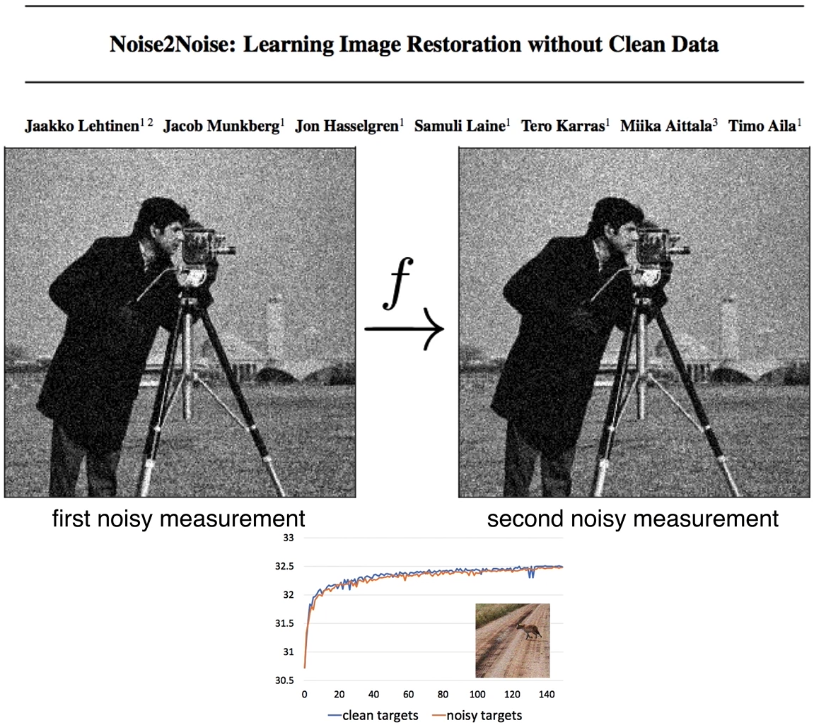
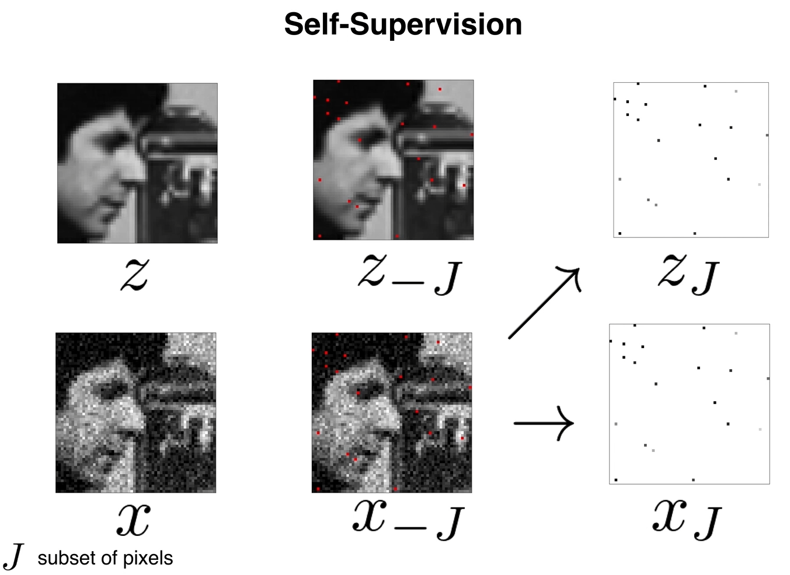
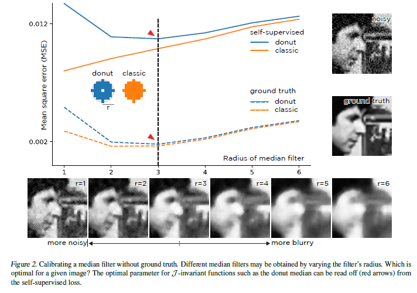
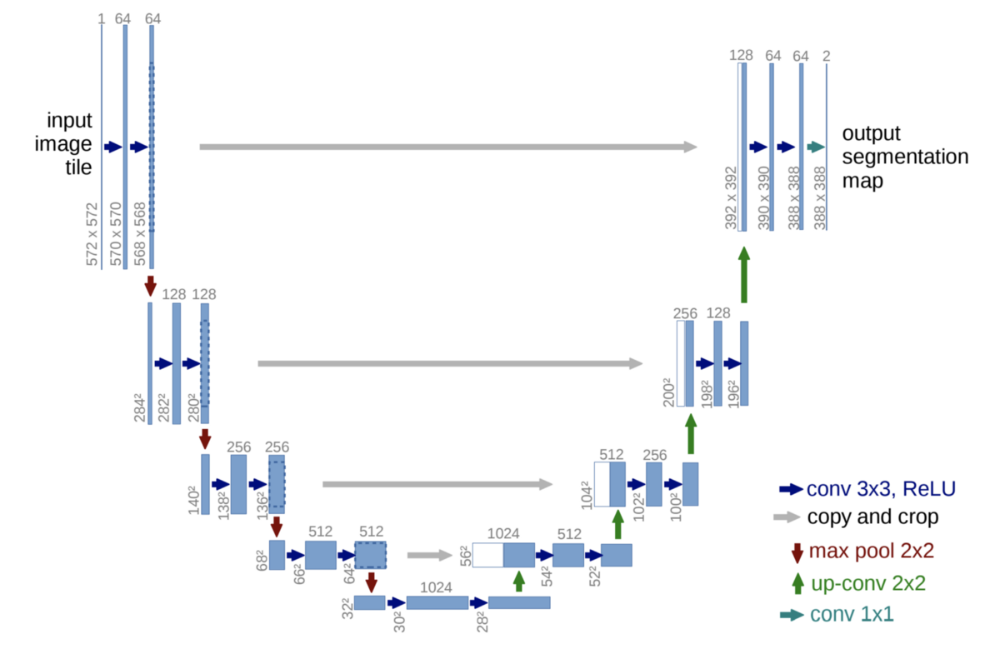
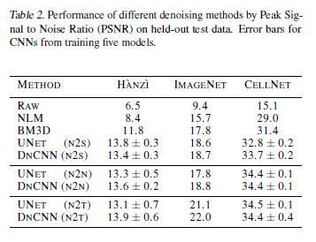
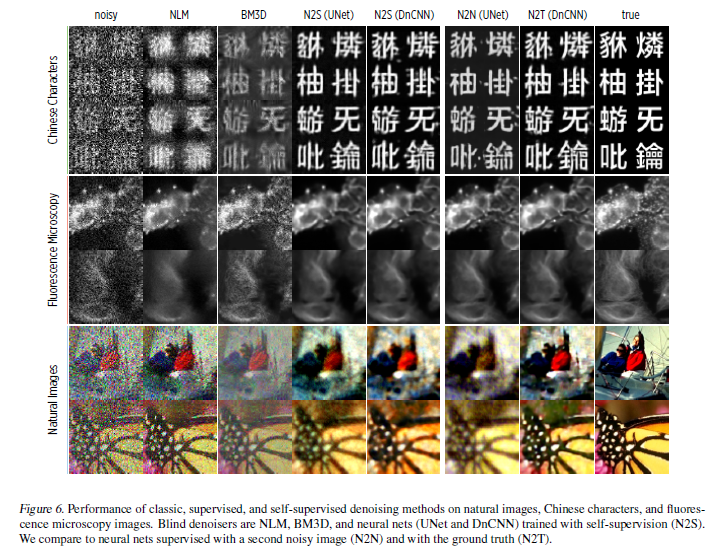

# Noise2Self: Blind Denoising by Self-Supervision \[Kor\]
[Batson Joshua, and Loic Royer, "Noise2self: Blind denoising by self-supervision.", International Conference on Machine Learning. PMLR, 2019.
](https://arxiv.org/abs/1901.11365)

---&gt; [**English version**](icml-2019-Noise2Self-eng.md) of this article is available.

해당 논문에서는 노이즈 특성에 대한 사전 학습 그리고 clean 이미지 라벨 값 없이, 노이즈 데이터만 사용하여 노이즈를 없애는 self-supervision 방식의 디노이즈 방법을 제안했습니다.

##  1. Problem definition
### - 전통적인 디노이즈 방법과 Supervised-learning 방법 :          
*1)* 노이즈 특성 학습을 통한 denoise           
그 동안 디노이즈하기 위해서는 노이즈 특성을 사전학습시켜야 했습니다. 하지만 이 경우, 내가 학습시키지 않은 새로운 노이즈가 인풋으로 들어오면 제대로된 성능을 보이지 않는다는 단점이 있습니다. 또한, smoothness의 정도 혹은 어느 정도 유사하게 만들 것인지에 대한 정도, matrix의 rank 등 다양한 하이퍼파라미터의 조정이 필요하고 하이퍼파라미터에 따라 성능이 많이 달라집니다.      

*2)* 지도학습 (노이즈 이미지 & clean 이미지)                  
노이즈 자체에 대한 학습으로 denoise하는 것이 아닌, 같은 target의 노이즈 이미지와 clean 이미지를 각각 x와 y 값으로 넣어 훈련시키는 지도 학습 방법도 있습니다. (data-driven prior)       

$$||f_{Θ}(x)-y||^2$$                 
이 경우 위와 같은 loss 함수식을 통해서 노이즈 데이터 x를 디노이즈 함수 $$f_{Θ}$$ 에 통과시킨 결과와 ground truth인 y의 차이를 최소화시키는 것을 목표로 합니다. Convolution neural network에도 사용할 수 있어 다양한 영역에서 좋은 성능을 보이고 있지만 오랜 시간 훈련이 필요합니다. 또한, 만약 생체 데이터를 사용하는 경우 clean 이미지를 얻는 것이 어렵기 때문에 해당 방법으로 훈련시키는 데 어려움이 있습니다.               

*3)* 지도학습 (only 노이즈 이미지)        

</img>
                   
Noise2noise 논문에서는 라벨 y 값에 clean 이미지가 아닌, 노이즈 이미지를 넣어 훈련시키는 방법을 제안했습니다. clean 이미지 라벨이 없더라도 기존의 denoise 모델만큼의 성능을 보였습니다.      

*4)* **Propsed : 자기지도 학습 (라벨 값도 없음)**        

</img>
  
해당 논문에서는 전통적인 디노이즈 방법보다 성능이 더 좋으면서, clean 이미지 라벨이 없이도 디노이즈를 수행할 수 있는 자기지도 학습 방식의 디노이즈 방법을 제안했습니다. 라벨 값 없이 오로지 노이즈 이미지만 인풋시켜 노이즈를 제거했습니다.                 

- self-supervised loss :           
$$L(f) = E||f(x)-x||^2$$      
자기지도 학습은 위의 식 처럼 라벨 y값 대신, x값 자기 자신이 들어갑니다. 이 식을 간단하게 증명하면 아래와 같습니다.        

$$E||f(x)-x||^2 = E||f(x)-y+y-x||^2 = E||f(x)-y||^2 + E||x-y||^2$$            
이때, x는 노이즈 이미지이며 f(x)는 J-invariant 함수를 통과한 결과 값입니다. y는 clean 이미지를 나타냅니다.    
그리고 $$E||f(x)-y||^{2}$$는 Ground truth loss 결과를 의미하고 $$||x-y||^{2}$$는 loss variance를 의미합니다. 즉, self-supervised loss는 Ground truth loss와 loss variance의 합을 나타냅니다. 위 증명에 따라 self-supervised loss는 라벨 y값 없이 loss를 구할 수 있습니다. self-supervised loss를 최소화시키는 방향으로 학습함으로써 최적의 denoiser 함수를 찾을 수 있습니다.

## 2. Motivation
### Related work
노이즈를 제거하는 다양한 방법들을 소개합니다.

#### 1) 전통적인 방법
- Smoothness : 중앙 픽셀이 주변 픽셀과 유사한 값을 갖도록 주변 픽셀들과의 평균값을 구해서 노이즈를 제거하는 방법입니다. Gaussian, median 등 노이즈를 제거하는 필터를 사용합니다. 
- Self-Similarity : 이미지 내에 비슷한 부분(patch)들이 있는데, 중앙 픽셀값을 서로 비슷한 patch들 간의 가중 평균값으로 대체하는 방법입니다. 하지만 하이퍼파라미터 조작이 성능에 큰 영향을 미치고 노이즈 분포를 모르는 새로운 데이터셋은 동일한 성능을 보기 어렵다는 단점이 있습니다.

#### 2) Convolutional neural networks을 사용한 방법
- Generative : 미분 가능한 생성 모델를 통해 노이즈를 제거할 수 있습니다. 
- Gaussianity : 노이즈가 indepentent identically distributied (i.i.d)한 가우시안 분포를 따르고 있는 경우 신경망을 훈련시키기 위해서 stein's unbiased risk estimator를 사용합니다.
- Sparsity : 이미지가 sparse 한 경우 압축 알고리즘을 사용하여 디노이즈를 수행합니다. 하지만 이 경우 이미지에 불순물이 남는 경우가 많았고, sparse한 특성을 찾기 위한 많은 사전 학습이 필요하다는 단점이 있습니다. 
- Compressibility : 노이즈가 있는 데이터를 압축했다가 다시 압축을 푸는 과정으로 노이즈를 제거합니다.
- Statistical Independence : 동일한 인풋 데이터로부터 독립적인 노이즈를 측정해서 실제 노이즈를 예측하도록 UNet을 훈련시켰을 때, 훈련된 UNet이 실제 신호를 예측한다는 것을 제안했습니다 (Noise2Noise).

### Idea
위처럼 노이즈가 있는 이미지를 복원하는 방법은 그동안 많이 발표되어 왔습니다. 노이즈를 제거하는 Smoothness 같은 전통적인 방법부터 최근에는 UNet과 같은 Convolutional neural network를 활용한 방법까지 다양합니다.        
하지만 이 방법들은 사전에 노이즈의 특성을 학습해야 하거나 clean한 이미지가 있어야 가능한 방법들이었습니다. 해당 논문에서는 그동안 나왔던 supervised learning 방법이 아닌, `self-supervision` 기반한 노이즈 제거 방법을 아래와 같이 제시했습니다. 

## 3. Method
### - Example : classic denoiser vs donut denoiser              
</img> 
> - Median filter (classic denoiser) : 각 픽셀을 반지름 r인 disk의 중앙값으로 대체하는 median filer를 사용함 → $$g_{r}$$       
> - Donut median filter (donut denoiser) : center 부분을 제거했다는 것 외에 classic denoiser와 동일함, 논문에서 말하는 J-invariant 함수에 해당함  → $$f_{r}$$                   

위 그래프에서 각 denoiser에 따른 차이를 볼 수 있습니다. r은 각 filter의 반지름 길이를 의미합니다.       
donut denoiser (파란색)의 경우 self-supervised의 최소값(빨간색 화살표)은 ground truth의 최소값과 동일선(r=3) 상에 위치하고 있습니다. 이때 self-supervised와 ground truth의 수직적인 차이가 variance of the noise에 해당합니다. 이는 위에서 봤던 self-supervised loss 수식과 일치하는 결과입니다.     
이에 반해 classic denoiser (주황색)의 경우 self-supervised MSE는 계속 증가하고 있고 ground truth 결과와 연관지을 수 있는 부분이 없습니다.        
즉, donut denoiser는 self-supervise로 loss 값을 조정할 수 있지만, classic denoiser에서는 ground truth가 있어야만 loss값을 조정할 수 있다는 걸 알 수 있습니다.

### - J-invariant function : $$f_{Θ}$$            
$$f_{Θ}(x)_{J} := g_{Θ}(1_{J}ㆍs(x) + 1_{J^c}ㆍx)_{J}$$   

J-invariant $$f_{Θ}$$ 함수는 위와 같이 정의할 수 있습니다. $$g_{Θ}$$ 는 classical denoiser를 의미하며, J(J ∈ _J_)는 mask처럼 인접한 픽셀과 구분짓도록 파티션의 역할을 합니다. s(x)는 각 픽셀들을 인접한 픽셀들의 평균값으로 바꾸는 함수(interpolation, 보간법)입니다. 즉, $$f_{Θ}$$ 함수는 J에 해당하는 영역에만 s(x)로 interpolation을 시키고 그 이외의 지역은 원본 이미지 x를 그대로 적용한 다음에 classical denoiser를 적용합니다. classical denoiser인 $$g_{Θ}$$를 J-invariant function 적용시킨 결과가 $$f_{Θ}$$인 것입니다.       
J공간에 있는 x를 interpolation 한 후 $$g_{Θ}$$를 했기 때문에 $$f_{Θ(x)J}$$는 $$x_{J}$$와는 독립적인 결과가 나옵니다. 결과적으로 이미지 x를 classical denoiser g~Θ~에 바로 적용했을 때보다 interpolation을 적용한 후 $$g_{Θ}$$ 적용했을 때 성능이 더 좋았습니다.

## 4. Experiment & Result
### Experimental setup
|   Dataset  | Hanzi | CellNet |   ImageNet   |
|:----------:|:-----:|:-------:|:------------:|
| Image size | 64x64 | 128x128 | 128x128(RGB) |
| batch size |   64  |    64   |      32      |
|    epoch   |   30  |    50   |       1      |                           

J-invariant function를 적용시켜 Self-supervised 했을 때의 디노이즈 성능을 비교했습니다. 데이터 셋은 총 3가지로, 한자 데이터 셋인 Hanzi와 현미경 데이터 셋인 CellNet 그리고 ImageNet 데이터 셋을 사용했습니다.       

</img>
    
신경망 기본구조로는 Unet과 DnCNN을 사용해 각각의 성능을 비교했습니다. 특히, Unet은 contracting path에서의 이미지 사이즈와 expanding path에서의 이미지 사이즈가 동일하다는 특징을 갖고 있습니다. 이런 특징을 활용하여 skip connection에서 두 이미지를 같이 연산할 수 있습니다. 이는 self-supervised learning 의 원리처럼 동일한 target 데이터를 가지고 x와 f(x)를 연산하는 방법과 유사합니다.   
J-invariant는 총 25개 subsets을 사용했고, 평가지표로는 최대 신호 대 잡음비(Peak-Signal-to-Noise Raio, PSNR)을 사용했습니다. PSNR의 단위는 db이며 값이 클수록 화질 손실이 적다는 것을 의미합니다.

### Result
</img>   
위 표에서 각 데이터와 denoise에 따른 PSNR결과를 보여주고 있습니다. 논문에서 제시한 Noise2Self(N2S)는 전통적인 denoiser 방법인 NLM과 BM3D보다 성능이 좋게 나왔고 clean target으로 훈련시킨 Noise2Truth(N2T)와 독립적인 노이즈로 함께 훈련시킨 Noise2Noise(N2N)와도 유사한 성능을 보이고 있습니다.

</img>           
디노이즈 한 결과를 이미지로 봤을 때, N2S가 NLM, BM3D보다 더 노이즈 제거가 잘 되었으며 N2N, N2T와 유사한 결과를 보였습니다.

## 5. Conclusion
Noise2Self는 기존의 디노이즈 방법과는 다르게 self-supervision 방식으로 노이즈를 제거했습니다. 노이즈에 대한 사전 학습 혹은 clean 이미지 라벨이 없이 오로지 노이즈 데이터만 가지고 훈련할 수 있다는 것이 이 모델의 가장 큰 장점입니다.       
하지만 J의 크기를 어떻게 설정하느냐에 따라서 bias과 variance간의 trade-off가 있다는 한계점이 있습니다.            

### Take home message \(오늘의 교훈\)
> self-supervised learning을 활용하면 라벨 데이터가 없어도 학습할 수 있다.
>
> noise 데이터와 이 데이터를 J-invariant funtion f(x)에 넣어서 나온 결과 값은 서로 독립적인 관계이다.
>
>  self-supervised learning으로 noise 데이터와 J-invariant funtion 결과값 만으로도 디노이즈 기능을 수행할 수 있다.

## Author / Reviewer information
### Author

**Hyunmin Hwang / 황현민** 
* KAIST AI
* [GitHub Link](https://github.com/HYUNMIN-HWANG)
* hyunmin_hwang@kaist.ac.kr

### Reviewer
1. Korean name (English name): Affiliation / Contact information
2. Korean name (English name): Affiliation / Contact information
3. ...

## Reference & Additional materials

1. Batson, J.D., & Royer, L.A. (2019). Noise2Self: Blind Denoising by Self-Supervision. ArXiv, abs/1901.11365. ([link](https://arxiv.org/abs/1901.11365))
2. Lehtinen, J., Munkberg, J., Hasselgren, J., Laine, S., Karras, T., Aittala, M., & Aila, T. (2018). Noise2noise: Learning image restoration without clean data. arXiv preprint arXiv:1803.04189. ([link](https://arxiv.org/abs/1803.04189))
3. Local averaging ([link](https://swprog.tistory.com/entry/OpenCV-%EC%9E%A1%EC%9D%8Cnoise-%EC%A0%9C%EA%B1%B0%ED%95%98%EA%B8%B0-Local-Averaging-Gaussian-smoothing)) 
4. Noise2Self github ([link](https://github.com/czbiohub/noise2self)) 
5. MIA: Josh Batson, Noise2Self: Blind denoising by self-supervision YouTube video ([link](https://www.youtube.com/watch?v=jwp1MsSXOZ4))
6. PSNR ([link](https://ko.wikipedia.org/wiki/%EC%B5%9C%EB%8C%80_%EC%8B%A0%ED%98%B8_%EB%8C%80_%EC%9E%A1%EC%9D%8C%EB%B9%84))  
7. Ronneberger, O., Fischer, P., & Brox, T. (2015, October). U-net: Convolutional networks for biomedical image segmentation. In International Conference on Medical image computing and computer-assisted intervention (pp. 234-241). Springer, Cham. ([link](https://arxiv.org/abs/1505.04597))  
