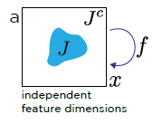

# Noise2Self: Blind Denoising by Self-Supervision \[Kor]
Batson, Joshua, and Loic Royer / "Noise2self: Blind denoising by self-supervision." / International Conference on Machine Learning. PMLR, 2019._

---&gt; **English version** of this article is available.

##  1. Problem definition
</img>
Ｊ는 1부터 m까지의 partition of the dimensions을 의미하며 J는 Ｊ 공간에 속해있습니다(J∈Ｊ). `Ｊ-invariant`는 f(x)J와 xJ가 독립적이면서 인풋 차원과 아웃풋 차원이 동일할 때를 의미합니다.

- Ground truth 데이터가 있는 경우,     
</img>
denoiser fΘ를 통해서 노이즈 데이터 x를 디조이즈 시킨 결과와 ground truth인 y의 차이를 최소화시키는 것이 목표였습니다.  

- Ground truth 데이터가 없는 경우,        
</img>
해당 논문에서는 이와 같은 식으로 self-supervised loss를 최소화시키는 것이 목표입니다.      
</img>
이때 fΘ가 Ｊ-invariant라면, self-supervised loss는 Grount truth loss와 variance of the noise의 합과 동일합니다. 따라서 supervised loss와 마찬가지로 self-supervised loss를 최소화시킴으로써 가장 최적의 denoiser를 찾을 수 있습니다. 이처럼 Ground truth 데이터 없이 loss를 최소화시킬수 있는 최적의 denoiser를 논문에서 제안하고자 합니다.

## 2. Motivation
### Related work
노이즈를 제거하는 다양한 방법들을 소개합니다.

#### 1) 전통적인 방법
- Smoothness : 중앙 픽셀이 주변 픽셀과 유사한 값을 갖도록 주변 픽셀들과의 평균값을 구해서 노이즈를 제거하는 방법입니다. Gaussian, median 등 노이즈를 제거하는 필터를 사용합니다. 
- Self-Similarity : 이미지 내에 비슷한 부분(patch)들이 있는데, 중앙 픽셀값을 서로 비슷한 patch들 간의 가중 평균값으로 대체하는 방법입니다. 하지만 하이퍼파라미터 조작이 성능에 큰 영향을 미치고 노이즈 분포를 모르는 새로운 데이터셋은 동일한 효과를 보기 어렵다는 단점이 있습니다.

#### 2) Convolutional neural nets
- Generative : 미분 가능한 생성 모델를 통해 노이즈를 제거할 수 있습니다. 
- Gaussianity : 노이즈가 indepentent identically distributied (i.i.d)한 가우시안 분포를 따르고 있는 경우 신경망을 훈련시키기 위해서 stein's unbiased risk estimator를 사용합니다.
- Sparsity : 이미지가 sparse 한 경우 압축 알고리즘을 사용하여 디노이즈를 수행합니다. 하지만 이 경우 이미지에 불순물이 남는 경우가 많았고, sparse한 특성을 찾기 위한 많은 사전 학습이 필요한 단점이 있습니다. 
- Compressibility : 노이즈가 있는 데이터를 압축했다가 다시 압축을 푸는 과정으로 노이즈를 제거합니다.
- Statistical Independence : 신호는 같지만 독립적인 노이즈를 측정해서 실제 노이즈를 예측하도록 훈련된 UNet이 실제 신호를 예측한다는 것을 제안했습니다 (Noise2Noise).

### Idea
위처럼 노이즈가 있는 이미지를 복원하는 방법은 그동안 많이 발표되었습니다. 노이즈를 제거하는 Smoothness 같은 전통적인 방법부터 최근에는 Convolutional neural net를 활용한 방법까지 다양합니다. 하지만 이 방법들은 사전에 노이즈의 특성을 알아야 하거나 clean한 이미지가 있어야 가능한 방법들이었습니다. 해당 논문에서는 그동안 나왔던 supervised learning 방법이 아닌, `self-supervision` 기반한 노이즈 제거 방법을 제안합니다. 

## 3. Method
- classic denoiser vs donut denoiser
</img> 
> - classic denoiser : 각 픽셀을 반지름 r인 disk의 중앙값으로 대체하는 median filer를 사용함 → gr
> - donut denoiser : center 부분만 제외하고 classic denoiser와 동일함 → fr

위 그래프에서 각 denoiser에 따른 차이를 볼 수 있습니다. donut denoiser (파란색)의 경우 self-supervised의 최소값(빨간색 화살표)은 ground truth와 동일선 상에 위치하고 있습니다. 이때 self-supervised와 ground truth의 수직적인 차이가 variance of the noise입니다. 이에 반해 classic denoiser (주황색)의 경우 self-supervised MSE는 계속 증가하고 있고 ground truth 결과와 연관지을 수 있는 부분이 없습니다. 이에 따라 donut denoiser는 self-supervise로 loss 값을 조정할 수 있지만,  classic denoiser에서는 ground truth가 있어야만 loss값을 조정할 수 있다는 걸 알 수 있습니다.

- Ｊ-invariant function : fΘ         
</img>        
일반적으로 fΘ 함수는 위와 같이 정의할 수 있습니다. gΘ는 classical denoiser를 의미하며, J는 mask처럼 인접한 픽셀과 구분짓도록 파티션의 역할을 합니다. s(x)는 각 픽셀들을 인접한 픽셀들의 평균값으로 바꾸는 함수(interpolation, 보간법)입니다. 즉, J에 해당하는 영역에만 s(x)로 interpolation을 시키고 그 이외의 지역은 원본 이미지 x를 그대로 적용한 다음에 classical denoiser를 수행합니다. 이미지 x를 classical denoiser gΘ에 바로 적용했을 때보다 interpolation을 적용한 후 classical denoiser을 했을 때 성능이 더 좋았습니다.

## 4. Experiment & Result
### Experimental setup
|   Dataset  | Hanzi | CellNet |   ImageNet   |
|:----------:|:-----:|:-------:|:------------:|
| Image size | 64x64 | 128x128 | 128x128(RGB) |
| batch size |   64  |    64   |      32      |
|    epoch   |   30  |    50   |       1      |                           

Ｊ-invariant function를 적용시켜 Self-supervised 했을 때의 디노이즈 성능을 비교했습니다. 데이터 셋은 총 3가지로 한자 데이터 셋인 Hanzi와 현미경 데이터 셋인 CellNet 그리고 ImageNet 데이터 셋을 사용했습니다. 신경망 기본구조로는 Unet과 DnCNN을 사용해 성능을 비교했습니다. Ｊ-invariant는 총 25개 subsets을 사용했고, 평가지표로는 최대 신호 대 잡음비(Peak-Signal-to-Noise Raio, PSNR)을 사용했습니다. PSNR의 단위는 db이며 값이 클수록 화질 손실이 적다는 것을 의미합니다.

### Result
</img>   
위 표의 결과는 각 데이터와 denoise에 따른 PSNR결과를 보여주고 있습니다. 논문에서 제시한 Noise2Self는 전통적인 denoiser인 NLM과 BM3D보다 성능이 좋게 나왔고 clean target으로 훈련시킨 Noise2Truth와 독립적인 노이즈도 함께 훈련시킨 Noise2Noise와도 유사한 성능을 보이고 있습니다.

</img>           
디노이즈 한 결과, N2S가 NLM, BM3D보다 더 노이즈 제거가 잘 되었으며 N2N, N2T와 유사한 결과를 보였습니다.

## 5. Conclusion

다른 디노이즈 방법과는 다르게 self-supervised 할 수 있는 방법을 제안했습니다. 노이즈에 대한 사전 학습없이도 노이즈를 제거할 수 있으며 노이즈가 없는 깨끗한 이미지가 없어도 훈련할 수 있다는 것이 이 모델의 가장 큰 장점입니다. 하지만 J의 크기를 어떻게 설정하느냐에 따라서 bias과 variance간의 trade-off가 있다는 단점이 있습니다. 향후 연구를 통해 Noise2Noise가 농업, 지질, 뇌신경 활동 등 다양한 영역에 적용시킬 수 있을 것 입니다.

### Take home message \(오늘의 교훈\)

Please provide one-line \(or 2~3 lines\) message, which we can learn from this paper.

> All men are mortal.
>
> Socrates is a man.
>
> Therefore, Socrates is mortal.

## Author / Reviewer information


You don't need to provide the reviewer information at the draft submission stage.


### Author

**황현민** 
* KAIST AI
* [GitHub Link](https://github.com/HYUNMIN-HWANG)
* hyunmin_hwang@kaist.ac.kr

### Reviewer

1. Korean name \(English name\): Affiliation / Contact information
2. Korean name \(English name\): Affiliation / Contact information

## Reference & Additional materials

1. Batson, J.D., & Royer, L.A. (2019). Noise2Self: Blind Denoising by Self-Supervision. ArXiv, abs/1901.11365.
2. noise2self github : https://github.com/czbiohub/noise2self
3. Local averaging https://swprog.tistory.com/entry/OpenCV-%EC%9E%A1%EC%9D%8Cnoise-%EC%A0%9C%EA%B1%B0%ED%95%98%EA%B8%B0-Local-Averaging-Gaussian-smoothing
4. Lehtinen, J., Munkberg, J., Hasselgren, J., Laine, S., Karras, T., Aittala, M., & Aila, T. (2018). Noise2noise: Learning image restoration without clean data. arXiv preprint arXiv:1803.04189.
5. PSNR : https://ko.wikipedia.org/wiki/%EC%B5%9C%EB%8C%80_%EC%8B%A0%ED%98%B8_%EB%8C%80_%EC%9E%A1%EC%9D%8C%EB%B9%84
