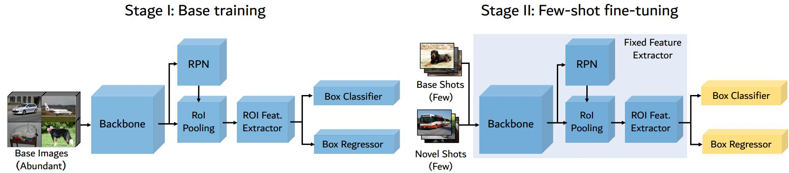
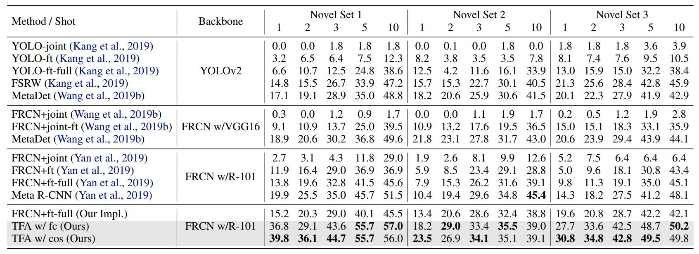
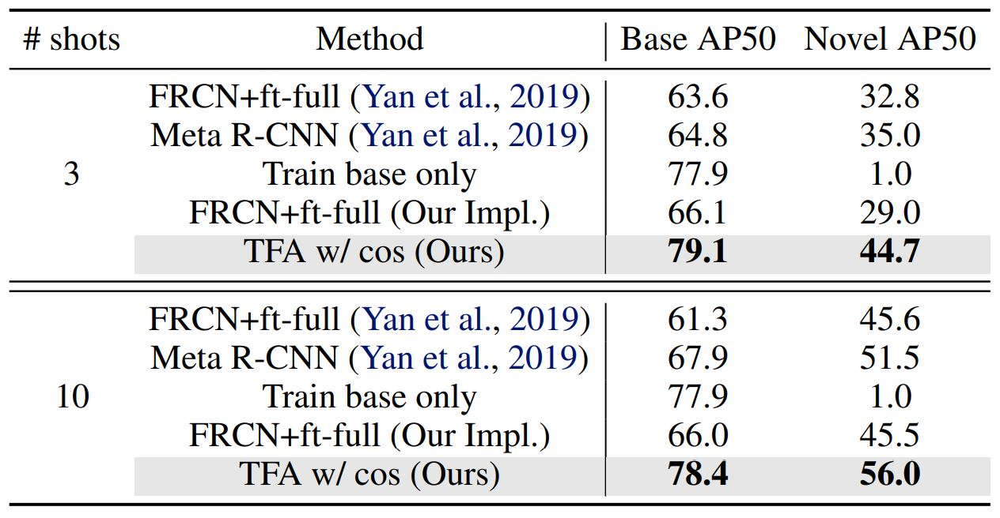
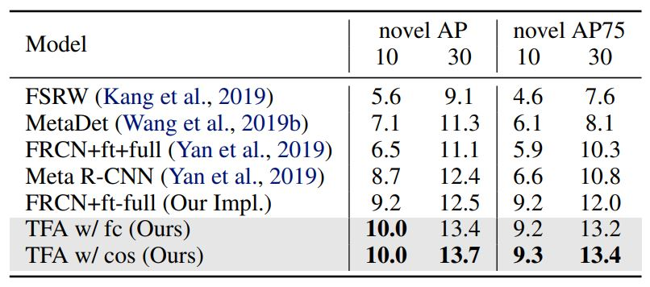
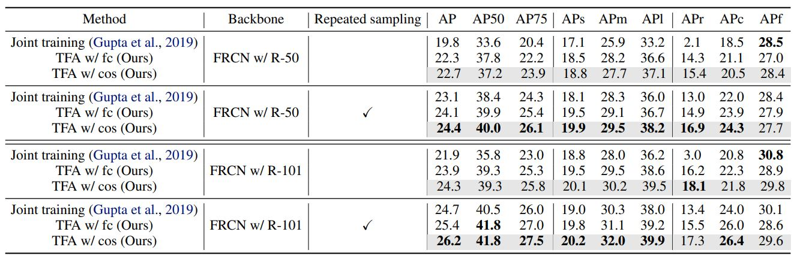
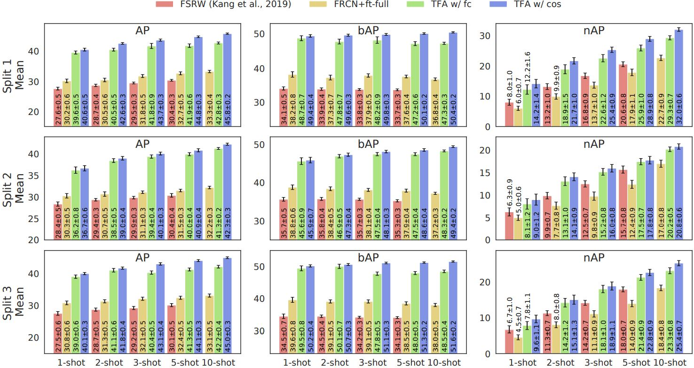
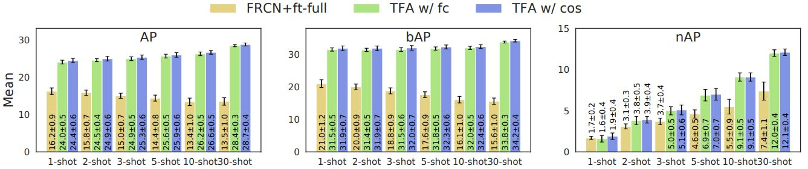
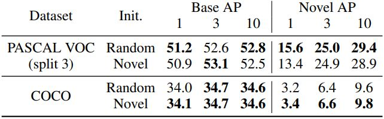
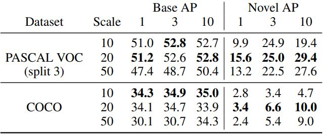
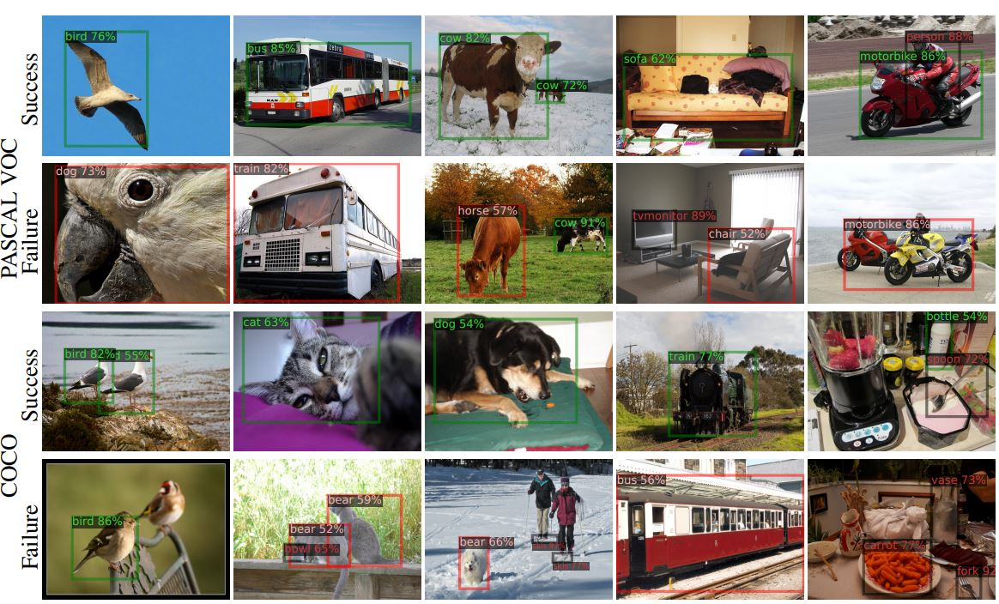

# Frustratingly Simple Few-Shot Object Detection \[Eng\]

##  1. Problem definition

The main problem of this paper is few-shot object detection (FSOD). In FSOD, a model is trained with many example from base classes or objects, and is then used to detect or localize novel classes given few examples of these new classes. Formally, the problem can be define as follows.     
There are a set of base classes $$C_b$$ that
have many instances and a set of novel classes $$C_n$$ that have
only $$K$$ (usually less than 10) instances per category. For
an object detection dataset $$D = \{ (x, y) , x ∈ X , y ∈ Y \}$$,
where $$x$$ is the input image and $$y = \{ (c_i, l_i), i = 1, ..., N \}$$
denotes the categories $$c ∈ C_b ∪ C_n$$ and bounding box
coordinates $$\bf{l}$$ of the $$N$$ object instances in the image $$x$$.    
For concrete example, assume we have object detection models that have learned from many images of some animals; cats, dogs, and birds. Then, we want to use this model to be able to detect cows using few (1 to 10 shots) example of cow images. On this example, cow will be a novel class.
   
This paper propose a method for FSOD using simple fine-tuning, in place of more complex method such as meta-learning.
## 2. Motivation

### Related work

There are several early attempts at few-shot object detection using meta-learning. Kang et al.[3] and Yan et al[4] apply feature re-weighting schemes to a single-stage object detector (YOLOv2) and a two-stage object detector (Faster R-CNN), with the help of a meta learner that takes the support images (i.e., a small number of labeled images of the novel/base classes) as well as the bounding box annotations as inputs. Wang et al. (2019b) propose a weight prediction meta-model to predict parameters of category-specific components from the few examples while learning the category-agnostic components from base class examples. 
  
In all these works, fine-tuning based approaches are considered as baselines with worse performance than meta-learning based approaches. They consider jointly fine-tuning, where base classes and novel classes are trained together, and fine-tuning the entire model. The detector is first trained on the base classes only and then fine-tuned on a balanced set with both base and novel classes. 
  
In contrast, this paper proposed method do fine-tuning on only the last layers of the object detector on the balanced subset and keeping the rest of model fixed can substantially improve the detection accuracy. This indicates that feature representations learned from the base classes might be able to transfer to the novel classes and simple adjustments to the box predictor can provide strong performance gain.

### Idea

The main idea is to effectively detect new classes by only fine tuning the box classifier and box regressor. It is translated into a two-stage fine tuning approach (TFA) as illustrated in Figure 1.
<figure>

  
  <figcaption style="text-align: center">Fig.1 - Two-stage Fine Tuning Approach.</figcaption>

</figure>

In the base training stage, the entire object detector, including both the feature extractor $$\mathit{F}$$ and the box predictor, are jointly trained on the base classes. In the few-shot fine-tuning stage, the feature extractor components are fixed and only the box predictor is fine-tuned on a balanced subset consisting of both the base and novel classes. 

## 3. Method

#### Base model training
In the first stage, we train the feature extractor and the box predictor only on the base classes Cb, with the same loss function used in Faster R-CNN[5]. The joint loss is,
$$L = L_{rpn} + L_{cls} + L_{loc}$$
where $$L_{rpn}$$ is applied to the output of the RPN to distinguish
foreground from backgrounds and refine the anchors, $$L_{cls}$$ is a cross-entropy loss for the box classifier $$C$$, and $$L_{loc}$$ is a smoothed $$L_1$$ loss for the box regressor $$R$$.

#### Few-shot fine-tuning. 
In the second stage, model is fine-tuned to accomodate novel classes. The novel classes is added by creating a small balanced training set with $$K$$ shots per class, containing both base and novel classes. Then, assign randomly initialized weights to the box prediction networks for the novel classes and fine-tune only the box classification and regression networks, namely the last layers of the detection model, while keeping the entire feature extractor $$F$$ fixed. The loss function is the same as in base model training with smaller learning rate. The learning rate is reduced by 20 from the first stage in all the experiments. As mentioned previously, this fine-tuning method can effectively work as feature representation learned from base classes can be transferred well to novel classes with adjustments on the classifier part.

#### Cosine Similarity
Inspired by [6,7,8], this paper use cosine similarity for the classifier in the detection stage. Fixed scaling factor (α) of 20 is set in the experiments. Empirical results show that the instance-level feature normalization used in the cosine similarity based classifier helps reduce the intra-class variance (variance of data between the same classes) and improves the detection accuracy of novel classes with less decrease in detection accuracy of base classes when compared to a FC-based classifier, especially when the number of training examples issmall.

## 4. Experiment & Result

### Experimental setup
Faster R-CNN[5] is used as base detector utilizing Resnet-101 with a Feature Pyramid Network as the backbone. All models are trained using SGD with a minibatch size of 16, momentum of 0.9, and weight decay of 0.0001. A learning rate of 0.02 is used during base training and 0.001 during few-shot fine-tuning. For more details, the code is available at https://github.com/ucbdrive/few-shot-object-detection.

To benchmark the performance of the model three different datasets are used, namely: PASCAL VOC 2007+2012, COCO, and recently introduced LVIS dataset[9]. The number of images in each category in LVIS has a natural long-tail distribution. Frequent and common classes are treated as base classes, and the rare classes as novel classes. During few-shot fine-tuning, a balanced subset of the entire dataset is created by sampling up to 10 instances for each class and fine-tune on this subset.  For evaluation metrics, AP50 (matching threshold is 0.5) of the novel classes is used on PASCAL VOC and the COCO-style AP of the novel classes is used on COCO.

### Result on Existing Few-Shot Object Detection Dataset

Few-shot detection performance (mAP50) on the PASCAL VOC dataset can be seen on Table 1. Proposed approach consistently outperforms baseline methods by about 2∼20 points, especially when the number of shots is low. TFA w/ cos is proposed TFA with a cosine similarity based box classifier. 

<figure>

  
  <figcaption style="text-align: center">Table 1. Performance on PASCAL VOC</figcaption>

</figure>

For more detailed comparisons, we cite the numbers
from Yan et al.[4] of their model performance on the base classes of Pascal VOC and COCO in the following tables. TFA model has a much higher average AP on the base classes than Meta R-CNN with a gap of about 10 to 15 points on Pascal VOC. Similarly, consistent improvement on average AP and AP75 of the 20 novel classes on COCO can also be seen. AP75 means matching threshold is 0.75, a more strict metric than AP50.

<figure>

  
     

<figcaption align = "center"> Table 2. Performance for base and novel classes on PASCAL VOC (left) and novel classes on COCO (right)</figcaption>
</figure>

### Result on Generalized Benchmark
This paper also propose new evaluation protocol for few-shot object detection. First reason why this new protocol needed is because previous protocols focus only on the performance on novel classes. This ignores the potential performance drop in base classes and thus the overall performance of the network. Second, the sample variance is large due to the few samples that are used for training. This makes it difficult to draw conclusions from comparisons against other methods, as differences in performance could be insignificant.

In the new evaluation protocol, benchmarking include report AP on base classes (bAP) and is added to the the overall AP in addition to AP on the novel classes (nAP). This allows us to observe trends in performance on both base and novel classes, and the overall performance of the network.

Results of new proposed generalized benchmark on LVIS is in Table 3. Compared to the methods in Gupta et al.[9], TFA is able to achieve better performance of ∼1-1.5 points in overall AP and ∼2-4 points in AP for rare and common classes. TFA can also handle imbalance without repeated sampling. Previously, in LVIS weighted sampling scheme[9] is used to address data imbalances. In this setting, the baseline methods can only achieve ∼2-3 points in AP for rare classes. On the other hand, TFA increase the AP on rare classes by around 13 points and on common classes by around 1 point. This result show how fine-tuning scheme is able to address the severe data imbalance issue without needing repeated sampling.

<figure>

  
  <figcaption style="text-align: center">Table 3. Generalized object detection benchmarks on LVIS.</figcaption>

</figure>

Generalized benchmark on PASCAL VOC is in Figure 4 and COCO in Figure 5. On both datasets, AP values are evaluated on base classes and the novel classes. On PASCAL VOC, we evaluate our models over 30 repeated runs and report the average and the 95% confidence interval. On COCO, we provide results on 1, 2, 3, and 5 shots in addition to the 10 and 30 shots used by the existing benchmark for a better picture of performance trends in the low-shot regime. 

<figure>

  
  <figcaption style="text-align: center">Fig. 2. Generalized benchmarks on PASCAL VOC</figcaption>

</figure>

<figure>

  
  <figcaption style="text-align: center">Fig. 3. Result in COCO dataset</figcaption>

</figure>

### Ablation Study and Visualization

#### Ablation Studies
Two ablation studies were done in the paper, one regarding box classifier weight initialization and another one related to scaling factor of cosine similarity. These studies are useful to find appropriate method to be used in the experiments.

Two different ways of initializing the weights of the novel classifier before few-shot fine-tuning are explored, which are: (1) random initialization and (2) fine-tuning a predictor on the novel set only and use the learned classifier weights as initialization. Both methods are compared on K = 1, 3, 10 on split 3 of PASCAL VOC and COCO. On PASCAL VOC, simple random initialization can outperform initialization using fine-tuned novel weights. On COCO, using the novel weights can improve the performance over random initialization. This is probably due to the increased complexity and number of classes of COCO compared to PASCAL VOC. Based on this result, random initialization is selected for all PASCAL VOC experiments and novel initialization is for all COCO and LVIS experiments.

Three different cosine similarity scaling factors are observed, α = 10, 20, 50. On PASCAL VOC, α = 20 outperforms the other scale factors in both base AP and novel AP. On COCO, α = 20 achieves better novel AP at the cost of worse base AP. Since it has the best performance on novel classes across both datasets,  α = 20 is used in all experiments with cosine similarity.

  
     

<figcaption align = "center">Table 4. Performance for base and novel classes on PASCAL VOC (left) and novel classes on COCO (right)</figcaption>

#### Qualitative Visualization
Visualization that shows resulting bounding box can be seen on the figure below, showing success (green boxes) and failure cases (red boxes). The failure cases include misclassifying novel objects as similar base objects, e.g., row 2 columns 1, 2, 3, and 4, mislocalizing the objects, e.g., row 2 column 5, and missing detections, e.g., row 4 columns 1 and 5.

<figure>

  
  <figcaption style="text-align: center">Fig. 4. Qualitative visualizations of the detected novel objects on PASCAL VOC and COCO</figcaption>

</figure>

## 5. Conclusion & Discussion

### Conclusion
Proposed two-stage fine tuning approach can effectively work for FSOD. Not only it is less costly, it also outperformed previous meta learning methods on current bechmarks. To make the fine-tuning works, the feature extractor need to be frozen and only the box classifiers weight are fine-tuned.  In addition, more reliable benchmarks with revised evaluation protocols are also proposed. On the new benchmarks, TFA achieved new states of the arts, and on the LVIS dataset it improved the AP of rare classes by 4 points with negligible reduction of the AP of frequent classes. Proof how TFA can also handle imbalanced classes.

### Discussion
The proposed method needs to build balanced subset every fine-tuning which will need the base classes when fine tuning. This may be unfavorable in cases where the base classes data is unavailable when the model need to work with novel classes.

### Take home message \(오늘의 교훈\)

> We can use fine-tuning on last layers for few-shot object detection as alternative to meta-learning.

## Author / Reviewer information

### Author

**Muhammad Adi Nugroho** 

* KAIST
* Computational Intelligence Lab. - EE
* https://github.com/madin162

## Reference & Additional materials

1. X. Wang, T. Huang, J. Gonzalez, T. Darrell, and F. Yu, “Frustratingly Simple Few-Shot Object Detection,” in Proceedings of the 37th International Conference on Machine Learning, Nov. 2020, pp. 9919–9928. Accessed: Oct. 18, 2021. [Online]. Available: https://proceedings.mlr.press/v119/wang20j.html
2. https://github.com/ucbdrive/few-shot-object-detection
3. Kang, B., Liu, Z., Wang, X., Yu, F., Feng, J., and Darrell, T. Few-shot object detection via feature reweighting. In ICCV, 2019.
4. Yan, X., Chen, Z., Xu, A., Wang, X., Liang, X., and Lin, L. Meta r-cnn: Towards general solver for instance-level lowshot learning. In Proceedings of the IEEE International Conference on Computer Vision, pp. 9577–9586, 2019
5. Ren, S., He, K., Girshick, R., and Sun, J. Faster r-cnn: Towards real-time object detection with region proposal networks. In Advances in neural information processing systems, pp. 91–99, 2015.
6. Gidaris, S. and Komodakis, N. Dynamic few-shot visual learning without forgetting. In Proceedings of the IEEE Conference on Computer Vision and Pattern Recognition, pp. 4367–4375, 2018.
7. Qi, H., Brown, M., and Lowe, D. G. Low-shot learning with imprinted weights. In Proceedings of the IEEE conference on computer vision and pattern recognition, pp. 5822–5830, 2018.
8. Chen, W.-Y., Liu, Y.-C., Kira, Z., Wang, Y.-C. F., and Huang, J.-B. A closer look at few-shot classification. arXiv preprint arXiv:1904.04232, 2019.
9. Gupta, A., Dollar, P., and Girshick, R. Lvis: A dataset for large vocabulary instance segmentation. In Proceedings of the IEEE Conference on Computer Vision and Pattern Recognition, pp. 5356–5364, 2019.