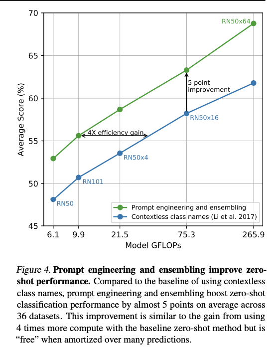
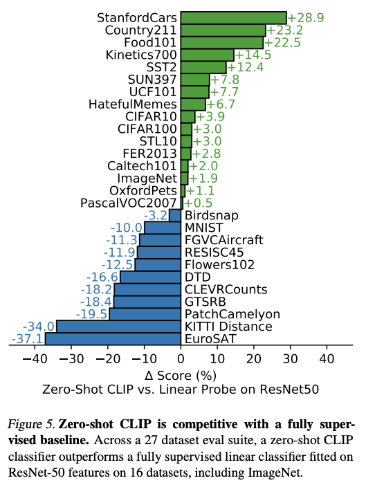
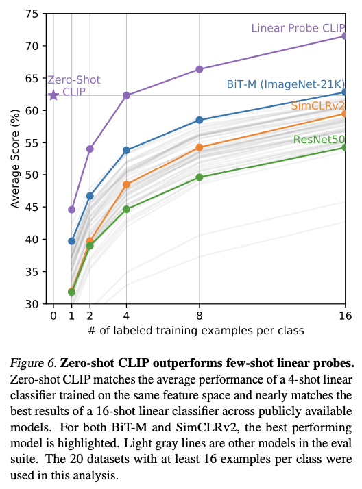
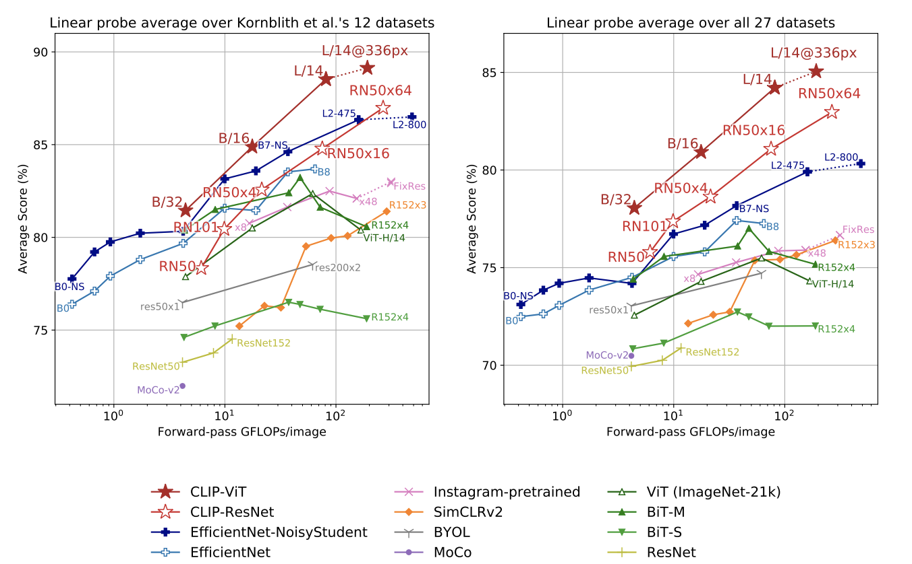
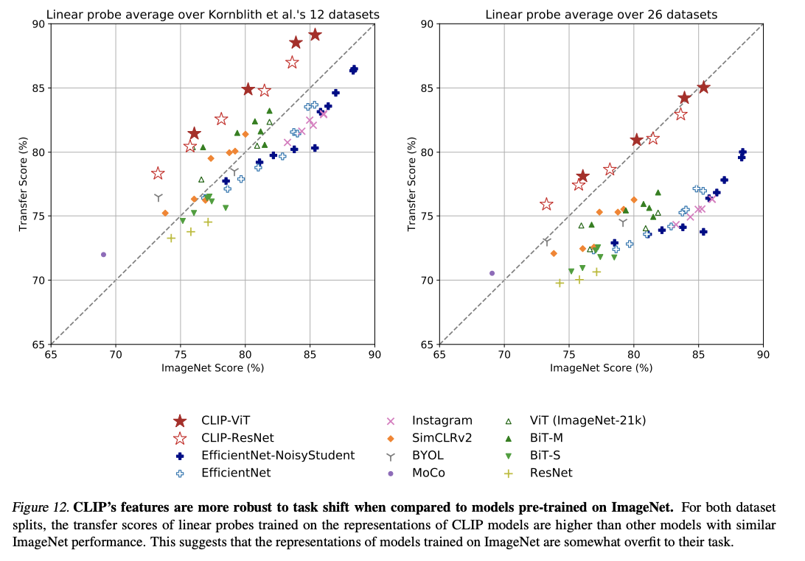
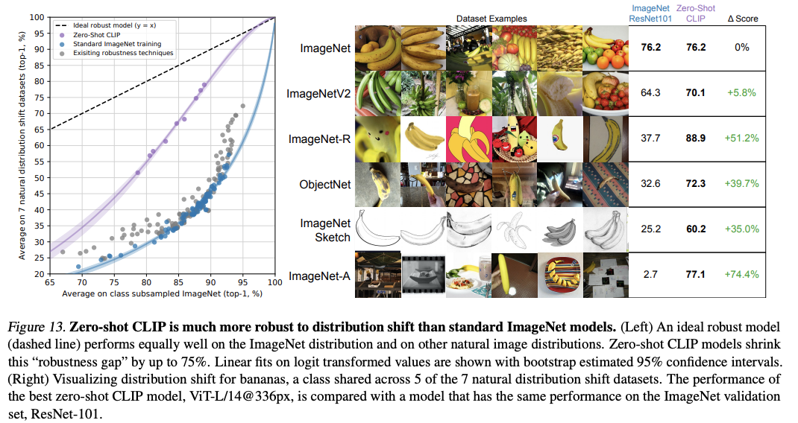

# \(Template\) Learning Transferable Visual Models From Natural Language Supervision \[ENG\]

### Learning Transferable Visual Models From Natural Language Supervision \[ENG\]
Radford and Kim et al. / Learning Transferable Visual Models From Natural Language Supervision / ICML 2021

\(In English article\) ---&gt; 한국어로 쓰인 리뷰를 읽으려면 **여기**를 누르세요.

##  1. Problem definition

NLP의 최근 연구는 데이터에 특화되지 않는 아키텍처를 통해 제로샷으로  데이터에 특수화된 헤드 혹은 이를 이용한 학습 없이 다운스트림 데이터 셋에 충분한 성능을 뽑을 수 있는 모습들을 보여주었다. 그러나 컴퓨터 비전에서는 ImageNet과 같은 사람을 거친 레이블 데이터 세트에서 모델을 사전 교육하는 것이 여전히 널리 사용되고 있다. 저자들은 '확장 가능한 웹 텍스트에서 직접 학습하는 사전 훈련 방법이 컴퓨터 비전에 비슷한 돌파구를 가져올 수 있을까'라는 질문부터 시작해 이미지에 대한 텍스트에서 직접 학습할 수 있는 모델을 구축하려 했다. 이렇게 하면 훨씬 더 광범위한 감독을 활용하고 웹에서 데이터 세트를 사용할 수 있다는 장점이 존재한다. 이 논문은 대비 학습-이미지 사전 훈련의 줄임말인 CLIP이라는 간단한 사전 훈련 작업으로 훈련된 모델을 시연하고, 모델이 제로샷으로 다운스트림에서 작업이 가능하며 완전한 감독 기준선에 대해 경쟁력 있는 결과를 보여준다.

## 2. Motivation


### Related work
이미지-텍스트 쌍을 교육하여 내용 기반 이미지를 검색하는 방법에 대한 오랜 연구가 있어 왔다.

- (Mori et al.) 는 이미지와 짝을 이룬 텍스트 문서의 명사와 형용사를 예측하는 모델을 훈련했습니다.
- (Quattoni et al.) 이미지와 관련된 캡션의 단어를 예측하도록 훈련된 분류기의 체중 공간에서 매니폴드 학습을 사용했다.
- (Srivastava & Salakhutdinov) 심층 표현 학습을 탐구하기 위해 낮은 수준의 이미지 및 텍스트 태그 기능 위에 멀티 모델 Deep Boltzmann Machines를 훈련시켰다.
- (Joulin et al.) 이미지 캡션의 단어를 예측하도록 훈련된 CNN이 유용한 이미지 표현을 학습한다는 것을 입증한다.
- (Li et al.) 개별 단어 외에도 구 단위의 n-gram 예측에 대한 접근방식을 확장하고 제로샷 전송에 대한 모델의 능력을 입증했다.
- (Desai & Johnson), (Bulent Sariyidiz et al.), (Zhang et al.) 은 텍스트에서 이미지 표현을 배우기 위한 Transformer 기반 언어 모델링, 마스크 언어 모델링(Masked language modeling) 및 대조 목표 (constrastive objectives)의 가능성을 보여주었다.

주제에 대한 오랜 연구와 다양한 논문이 있었지만, 정확도가 낮았기 때문에 이미지 표현 학습에 자연어 자체가 지도를 하는데 사용되는 경우는 드물었다. 또한, 제로샷 전송으로 일반화하는 것은 컴퓨터 비전에서 크게 연구되지 않았다. 이 연구는 자연어를 감독에 사용했다는 점에서 의미가 있으며, 이로 인해 강력한 감독 모델과 비슷한 제로샷 점수를 얻을 수 있다.

### Idea

이 논문의 핵심 아이디어는 자연어에 담긴 감독 및 얻은 특성으로부터 인식을 배우는 것이다. 다시 말해, 인간으로부터 강하게 감독되는 라벨보다는 자연어 그 자체를 라벨로 사용하여 이를 감독으로 배우는 것입니다. 그렇게 함으로써, 자연어 감독은 gold 라벨에 주석을 달 필요가 없기 때문에 표준 크라우드 소스 라벨에 비해 스케일 업이 훨씬 쉬워진다. 또한 단순히 표현만 학습하는 것이 아니라 텍스트와 이미지의 표현을 연결하여 유연한 제로샷이 가능합니다.
일반적으로 이미지 분류에서 의미되었던 제로샷인 보이지 않는 객체 범주로 일반화하는 연구와 달리, 본 논문은 이 용어를 더 넓은 정의인 머신러닝 시스템의 작업 학습 능력을 측정하는 방법으로 사용했다. 해당 정의에 따라, 저자들은 제로샷의 높은 점수가 모델이 특정 테스크에 일반화를 잘하는 것이 아닌 분포 이동과 도메인 일반화에도 강하다는 것을 나타낸다고 제안한다. 이 논문은 제로샷에서 CLIP의 결과와 완전 감독 기준선과 비교하며 해당 모델의 견고성을 보여준다.

## 3. Method

### Dataset
저자들은 대규모로 자연어로 훈련된 이미지 분류기의 행동을 연구하기 위해 WebImageText의 줄임말인 WIT라는 새로운 데이터 세트를 구축한다. WIP은 인터넷에서 공개적으로 사용 가능한 다양한 출처의 텍스트를 통해 4억 개의 영상과 텍스트 쌍으로 구성되어 있습니다. 해당ㅇ 데이터 세트는 CLIP 사전 교육에 사용됩니다.

### Pre-train Method

이 모델은 대조적인 목표(constrastive objective)를 가지고 다른 사전 교육 체크포인트부터 시작하지 않고 ㅊ처음부터 사전 교육을 받는다. 이미지 왼쪽에 표시된 것처럼, N개의 텍스트-이미지 쌍의 배치가 주어지면 CLIP은 해당 인코더에서 텍스트 임베딩 및 이미지 임베딩을 추출하고 NxN 조합에서 가장 가능성이 높은 N 쌍을 찾도록 훈련된다. 맞는 쌍을 이룬 N개의 텍스트 이미지 쌍의 코사인 유사성을 최소화하고 잘못된 NxN - N 쌍에 대한 점수를 최대화하고 유사성 점수에 대한 대칭 교차 엔트로피 손실을 최적화하려고 한다. 해당 목표에 따라 CLIP은 이미지 및 텍스트 인코더를 동시에 교육하여 다중 모드 내장 공간을 학습한다.

### Zero-shot transfer
텍스트 및 이미지 인코더가 학습된 경우 CLIP은 이미지 오른쪽에 표시된 대로 테스트할 때 제로샷으로 성능을 평가합니다. 먼저 훈련된 인코더에서 이미지의 피쳐 임베딩과 가능한 텍스트들의 피쳐 임베딩을 계산한다. 온도 매개 변수로 임베딩의 코사인 유사도를 계산하고 소프트맥스에 의한 확률 분포로 정규화함으로써 이미지의 정확한 레이블을 예측할 수 있다.

### Image Encoder Model: ResNet & ViT
저자는 이미지 인코더에 ResNet-50와 ViT인 두 가지 다른 아키텍처를 사용했습니다. 널리 사용되는 ResNet-50에서 ResNet-D 개선 및 안티앨리어스 rect-2 블러 풀링을 사용하여 몇 가지 수정 작업을 수행했으며 글로벌 평균 풀링 계층을 attention 풀링 메커니즘으로 교체했다. 비전 트랜스포머의 줄임말인 두 번째 아키텍처 ViT는 트랜스포머 이전에 결합된 패치와 위치 임베딩에 추가적인 레이어 정규화를 추가하는 아키텍쳐의 수정과 약간 다른 초기화 방식을 사용했다.

### Text Encoder Model: Transformer
텍스트 인코더 모델의 경우 저자들은 GPT2와 동일한 약간 수정된 트랜스포머를 사용했습니다. 모델의 기본 크기는 63M 파라미터, 12단, 512폭 모델이며 8개의 어텐션 헤드가 있습니다. 49,152개의 어휘 크기를 가진 단어 모음집의 BPE를 사용했다. 최대 시퀀스 길이는 76으로 제한했고, 특수 토큰인 [SOS]와 [EOS]를 각각 시퀀스의 앞과 뒤에 추가된다. 저자들은 [EOS] 토큰에서 변압기의 가장 높은 계층의 활성화를 레이어 정규화하고 다중 모드 임베딩 공간에 활성화를 선형으로 투영한 후 이를 텍스트의 특징 표현으로 사용했다.

### Prompt Engineering and Ensembling



그림 4에서 볼 수 있듯이, 저자들은 프롬프트 엔지니어링 및 앙상블링을 사용할 때 36개 데이터셋에서 제로샷 분류 성능을 평균 거의 5포인트 향상할 수 있었다. 저자들은 데이터셋의 몇 가지 문제에 의해 해당 아이디어가 나오게 되었다. 첫째, 대다수의 데이터 세트는 이미지에 레이블의 숫자 ID만으로 주석을 달고 이러한 ID를 영어로 자신의 이름에 매핑하는 파일을 포함하는 방식을 사용하였고 일부 데이터셋에는 매핑도 없고 숫자 ID만을 레이블로 사용했습니다. 이는 라벨의 자연 언어가 필요한 CLIP의 경우에는 적합하지 않은 문제가 있었다. 두 번째 이슈는 같은 데이터셋에서 같은 작업이 다른 의미를 갖는 경우도 있을 수 있는 점입니다. 예를 들어 ImageNet에서 'cranes'라는 단어는 건설용 크레인과 비행하는 크레인을 모두 의미할 수 있다. 마지막으로, 하나의 단어가 이미지와 짝을 이루는 경우의 수가 상대적으로 적다는 문제가 있었다. 데이터의 대부분은 전체 문장을 활용하여 이미지를 설명했다. 하나의 단어를 사용하는 경우와 문장을 사용하는 경우의 격차를 해소하기 위해 프롬프트 템플릿을 "A photo of a {label}"으로 사용하여 GPT3의 프롬프트 엔지니어링과 유사하게 각 작업에 프롬프트 텍스트를 사용자가 정의함으로써 제로샷 성능을 크게 향상시킬 수 있음을 관찰할 수 있었다. 저자들은 또한 성능 향상을 위한 또 다른 방법으로 여러 제로샷 분류기를 통해 앙상블을 실험했다. 그들은 평균 텍스트 임베딩의 단일 세트를 캐시하고 계산 비용을 줄일 수 있는 확률 공간 대신 임베딩 공간에 앙상블을 구성했다.

## 4. Experiment & Result

### Experimental Setup
The authors trained a series of 5 ResNet (ResNet-50, ResNet-101, 3 more which follow EfficientNet-Style model scaling of 4x, 16x, and 64x which is noted as RN50x4, RN50x16, and RN50x64 in the paper) and 3 Vision transformers (ViT-B/32, ViT-B/16, and ViT-L/14). The models are trained for 32 epochs with Adam optimizer with decoupled weight decay regularization applied to all weights that are not gains or biases, and decay the learning rate using a cosine schedule. Initial hyperparameters were set using a combination of grid searches, random search, and manual tuning on the baseline ResNett-50 model when trained for 1 epoch. The learnable temperature parameter for computing cosine similarity was initialized to 0.07 and clipped to prevent scaling the logits by more than 100. The size of the minibatch is 32,768 and used mixed-precision. 
The largest ResNet model, RN50x64 took 18 days to train on 592 V100 GPUs and the largest Vision Transformer model took 12 days on 256 V100 GPUs. The model that was used for the results in the paper is ***ViT-L/14@336px*** which the authors also pre-trained ViT-L/14 at a higher 336-pixel resolution for one additional epoch to boost performance.


### Result
The paper consists of a study of various properties of CLIP's zero-shot classifiers. First, they simply looked at how well zero-shot classifiers perform. To compare the performance, they made a baseline by fitting a fully supervised, regularized, logistic regression classifier on the features of the canonical ResNet-50 which they named *liner probe on ResNet50* in the paper. 



As in Figure 5, we can see that across 27 datasets, Zero-shot CLIP outperforms linear probe on ResNet50 on 16 datasets which is over half the number. The authors analyzed that zero-shot CLIP underperforms on several specialized, complex, or abstract tasks such as satellite image classification (EuroSAT, RESISC45), lymph node tumor detection (PatchCamelyon), etc. This result shows the poor capability of zero-shot CLIP on more complex tasks. 



The authors also compared the score of zero-shot and few-shot in Figure 6. We can find that zero-shot CLIP matches the performance of 4-shot logistic regression on the same feature space. This is because CLIP's zero-shot classifier is generated via natural language where visual concepts can be directly specified. Where few-shot linear probes have to infer concepts indirectly from the examples. The authors suggest initializing the model with a zero-shot checkpoint as one way of decreasing the discrepancy between the zero-shot and few-shot. 



When they compare the score of linear probe performance of CLIP models with the SOTA models in computer vision, we can see that CLIP-ViT outperforms the previous works. 




Also, they compared how robust CLIP is to task shift (figure 12) and distribution shift (figure 13). We can easily see from the two figures that CLIP is much more robust to both task and distribution shifts. These results suggest that the recent shift towards the large-scale task and dataset agnostic pre-training combined with a reorientation towards zero- and few-shot promotes the development of more robust systems and provides a more accurate assessment of performance. 
The authors also compared the CLIP with human performance and human learning. The results show that the hardest problems for CLIP are also hard for humans. They assume two reasons for such correlation: noise in the dataset and out of distribution.
They further analyzed CLIP on its limitation, dataset issues, and the broader impacts it could give.


## 5. Conclusion
From the question, "Could scalable pre-training methods which learn directly from web text result in a similar breakthrough in computer vision as it was done in NLP?", the authors tried to pre-train the model without strong annotation and directly from the natural text features. This allowed the model to learn a much broader source of supervision and become robust on different distributions. After pretraining CLIP in contrastive objective from scratch, the model was able to be used as zero-shot transfer in a downstream task. It showed competitive results with a fully supervised baseline without the need for any dataset-specific training which is a surprising result. There are an extensive analysis of the result and the model from the authors. 

### Take home message \(오늘의 교훈\)

* Recent shift towards the large-scale task and dataset agnostic pre-training combined with a reorientation towards zero- and few-shot promotes the development of more robust systems and provides a more accurate assessment of performance. 
* Task Agnostic models of computer vision are also able to show sufficient results without task-specific training as was done in NLP. 
* Natural language supervision gives much broader information than simple labels.

## Author / Reviewer information

### Author

**이현지 \(Hyunji Lee\)** 

* KAIST AI
* https://github.com/amy-hyunji
* hyunji.amy.lee@kaist.ac.kr

### Reviewer

1. Korean name \(English name\): Affiliation / Contact information
2. Korean name \(English name\): Affiliation / Contact information
3. ...

## Reference & Additional materials

* Citation of CLIP
   ```
   @inproceedings{Radford2021LearningTV,
    title={Learning Transferable Visual Models From Natural Language Supervision},
    author={Alec Radford and Jong Wook Kim and Chris Hallacy and Aditya Ramesh and Gabriel Goh and Sandhini Agarwal and Girish Sastry and Amanda Askell and Pamela Mishkin and Jack Clark and Gretchen Krueger and Ilya Sutskever},
    booktitle={ICML},
    year={2021}
   }
   ```
* [CLIP github link](https://github.com/OpenAI/CLIP)
* Citation of ViT
  ```
  @article{Dosovitskiy2021AnII,
  title={An Image is Worth 16x16 Words: Transformers for Image Recognition at Scale},
  author={Alexey Dosovitskiy and Lucas Beyer and Alexander Kolesnikov and Dirk Weissenborn and Xiaohua Zhai and Thomas Unterthiner and Mostafa Dehghani and Matthias Minderer and Georg Heigold and Sylvain Gelly and Jakob Uszkoreit and Neil Houlsby},
  journal={ArXiv},
  year={2021},
  volume={abs/2010.11929}
  }
  ```
* Citation of ResNet
  ```
  @article{He2016DeepRL,
  title={Deep Residual Learning for Image Recognition},
  author={Kaiming He and X. Zhang and Shaoqing Ren and Jian Sun},
  journal={2016 IEEE Conference on Computer Vision and Pattern Recognition (CVPR)},
  year={2016},
  pages={770-778}
  }
  ```
* Citation of Transformers
  ```
  @article{Vaswani2017AttentionIA,
  title={Attention is All you Need},
  author={Ashish Vaswani and Noam M. Shazeer and Niki Parmar and Jakob Uszkoreit and Llion Jones and Aidan N. Gomez and Lukasz Kaiser and Illia Polosukhin},
  journal={ArXiv},
  year={2017},
  volume={abs/1706.03762}
  }
  ```
* Citation of GPT2
  ```
  @inproceedings{Radford2019LanguageMA,
  title={Language Models are Unsupervised Multitask Learners},
  author={Alec Radford and Jeff Wu and Rewon Child and David Luan and Dario Amodei and Ilya Sutskever},
  year={2019}
  } 
  ```
* Citation of papers in Related Works
  ```
  @inproceedings{Mori1999ImagetowordTB,
  title={Image-to-word transformation based on dividing},
  author={Yasuhide Mori and Hironobu Takahashi and Ryu-ichi Oka},
  year={1999}
  }
  ```
  ```
  @article{Quattoni2007LearningVR,
  title={Learning Visual Representations using Images with Captions},
  author={Ariadna Quattoni and Michael Collins and Trevor Darrell},
  journal={2007 IEEE Conference on Computer Vision and Pattern Recognition},
  year={2007},
  pages={1-8}
  }
  ```
  ```
  @inproceedings{Srivastava2012MultimodalLW,
  title={Multimodal learning with deep Boltzmann machines},
  author={Nitish Srivastava and Ruslan Salakhutdinov},
  booktitle={J. Mach. Learn. Res.},
  year={2012}
  }
  ```
  ```
  @inproceedings{Joulin2016LearningVF,
  title={Learning Visual Features from Large Weakly Supervised Data},
  author={Armand Joulin and Laurens van der Maaten and A. Jabri and Nicolas Vasilache},
  booktitle={ECCV},
  year={2016}
  }
  ```
  ```
  @article{Li2017LearningVN,
  title={Learning Visual N-Grams from Web Data},
  author={Ang Li and A. Jabri and Armand Joulin and Laurens van der Maaten},
  journal={2017 IEEE International Conference on Computer Vision (ICCV)},
  year={2017},
  pages={4193-4202}
  }
  ```
  ```
  @inproceedings{Desai2021VirTexLV,
  title={VirTex: Learning Visual Representations from Textual Annotations},
  author={Karan Desai and Justin Johnson},
  booktitle={CVPR},
  year={2021}
  }
  ```
  ```
  @inproceedings{Sariyildiz2020LearningVR,
  title={Learning Visual Representations with Caption Annotations},
  author={Mert Bulent Sariyildiz and Julien Perez and Diane Larlus},
  booktitle={ECCV},
  year={2020}
  }
  ```
  ```
  @article{Zhang2020ContrastiveLO,
  title={Contrastive Learning of Medical Visual Representations from Paired Images and Text},
  author={Yuhao Zhang and Hang Jiang and Yasuhide Miura and Christopher D. Manning and C. Langlotz},
  journal={ArXiv},
  year={2020},
  volume={abs/2010.00747}
  }
  ```
