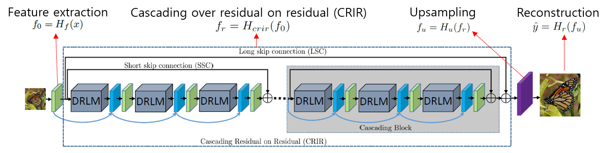
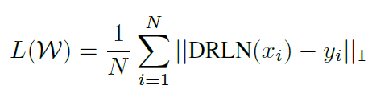
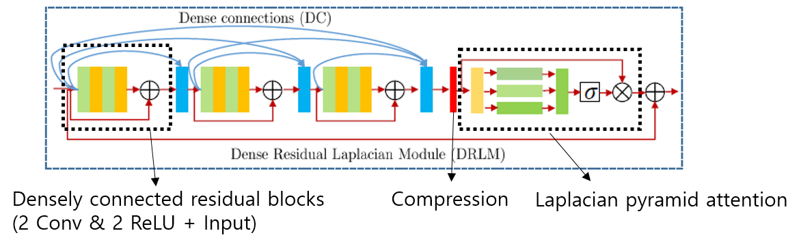
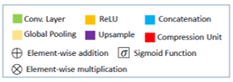
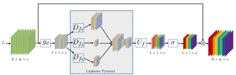
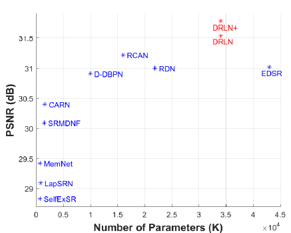
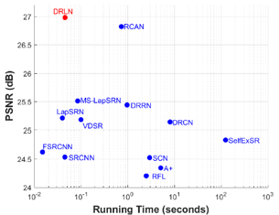

# Densely Residual Laplacian Super-Resolution \[Kor]

##  1. Problem definition

상대적으로 낮은 해상도의 이미지를 보다 높은 해상도로 복원하는 작업을 초해상화(Super-Resolution)라고 한다.
최근 수년간, 초해상화 작업은 고해상도 이미지를 요하는 작업들에 의해 연구 수요가 증가하였다.
이 논문에서는 단일 저해상도 이미지를 초해상화하는 작업인 Single Image Super-Resolution (SISR)을 목표로 한다.
이미지 초해상화는 입력되는 저해상도 이미지에 대응하는 고해상도 이미지 출력의 크기가 달라서 1개의 유일한 해가 존재하는 것이 아닌 여러 해가 존재하게 되는 불량조건문제(ill-posed problem)가 발생한다. 이러한 문제를 해결하기 위해 심층 컨볼루션 신경망(Deep Convolutional Neural Network,Deep CNN)이 적용되었고 현재까지 많은 종류의 알고리즘이 연구되어 왔다. 
이 논문에서는 현존하는 초해상화 딥러닝 알고리즘보다 더 정확하고 실행 시간이 빠른 모델을 연구하였다.

## 2. Motivation

### Related work
현존하는 초해상화를 위한 Deep CNN 알고리즘(SRCNN, RCAN 등)은 매우 복잡한 구조를 가지고 있으며, 복잡한(Deep) 네트워크일 수록 긴 실행시간의 비효율적인 결과를 보여준다. 
이에 따라 네트워크의 깊이를 줄여 효율성을 높인 모델들(DRCN, DRRN 등)이 연구되었다. 하지만 이런 모델들은 총 parameter수는 감소하더라도 총 연산량은 증가하게되는 문제를 갖고있다.
뒤이어 컨볼루션 계층 간의 dense한 연결을 이용한 SRDenseNet과 RDN, parameter 수와 연산속도를 모두 최적화하기 위해 group 컨볼루션을 사용한 CARN이 등장했으나, 대부분의 CNN 모델은 하나의 스케일을 사용하거나 여러 스케일을 사용하더라도 각 스케일의 가중치를 동일하게 부여하기에 다양한 해상도에 따른 적응력이 떨어진다.

### Idea
1. 초해상화의 정확도 향상을 위해 저해상도의 정보를 충분히 이용하는 방법을 적용하였다.
2. Densely connected residual block에서는 여러번 shortcut을 사용하여 원래 이미지의 정보를 포함한 feature를 동시에 학습한다.
3. Laplacian attention network를 통해 여러 스케일의 feature 정보를 학습하며, 모델과 feature 사이의 의존도를 학습한다.

## 3. Method
### 네트워크 구조
사용된 네트워크는 크게 4개의 구조(Feature 추출, Residual 구조 연쇄 진행, Upsampling, 이미지 재구성)로 이루어져 있다.

전체 손실 함수는 N개의 batch에서 출력 이미지 행렬과 라벨 이미지 행렬의 차이를 L1 norm을 통해 계산하는데, 이는 L1-손실 함수를 사용하는 다른 SOTA 방법들과 알고리즘 성능 비교를 용이하게 하기 위함이다. 

Residual 블록 연쇄 진행 부분은 여러개의 연쇄 블록으로 이루어져 있다.
각 연쇄블록은 이전 정보를 가져오는 여러 skip-connection들과 feature concatenation, 그리고 dense residual Laplacian module(DRLM)로 이루어져 있다.
그리고 각 DRLM 블록들은 residual 유닛들을 촘촘히 연결하는 부분과 압축하는 부분, 그리고 Laplacian pyramid attention 유닛으로 구성되어 있다.

### Laplacian attention

Laplacian attention을 사용하면 이미지 초해상화에 필수적인 feature들 사이의 관계를 더 잘 정의하여 학습 효과를 증가시킨다.

전체 이미지에서의 통계를 

입력된 저해상도 이미지 행렬을 x, 학습할때의 입력 이미지에 해당하는 고해상도 라벨 이미지 행렬을 y, 출력되는 초해상화된 이미지 행렬을 \y^hat, convolution 계층을 f, 비선형 활성화함수(ReLU)를 τ라고 했을때, feature 추출에서의 convolution layer는 f_0=H_f(x)

이 논문에서는 각 연쇄 블록에 3개의 DRLM을 사용하였고, 각 DRLM 안에 3개의 Residual 블록을 
3x3 

## 4. Experiment & Result

### Experimental setup

학습 데이터셋: DIV2K, Flicker2K + 데이터 augmentation(랜덤 회전)
테스트 데이터셋: SET5, SET14, URBAN100, B100, MANGA109 + 이미지 degradation(Bicubic, blur) 
평가 방법: YCbCr 색공간에서 밝기 채널에 PSNR과, SSIM 비교
비교군: SOTA CNN 알고리즘 - SRCNN, FSRCNN, VDSR, SCN, SPMSR, LapSRN, MSLapSRN, MemNet, EDSR, SRMDNF, D-DBPN, IRCNN, RDN, RCAN, CARN

batch: 16
저해상도 입력 이미지 크기: 48 X 48
최적화함수: ADAM(β1=0.9, β2=0.999, ε=10e-08)
Learning rate: 처음에 10e-04, 매 2x10e05 반복마다 절반으로 감소
프레임워크: PyTorch
GPU: Tesla P100

### Result

## 5. Conclusion

본 논문에서는 높은 정확도의 이미지 초해상화 작업을 위한 모듈화된 CNN을 제안하였다. 
초해상화의 성능을 강화하기 위해 여러 요소를 적용하였다.

1. Long skip connection, short skip connection, local connection을 이용해 residual 구조를 만들고 그 구조를 연쇄적으로 진행하는 방법을 채용함으로써, 저해상도의 정보의 흐름을 이용해 네트워크가 고해상도, 중간 해상도의 정보를 학습할 수 있도록 하였다.

2. Feature를 계산하는데 사용한 residual 블록을 밀접하게 연결하여 암묵적인 "deep supervision"과 높은 단계의 복잡한 feature들로부터의 학습 등의 장점을 갖게 되었다.

3. Laplacian attention을 이용하여 여러 스케일에서의 주요 feature를 생성하고 각 feature map 사이의 의존도를 학습할 수 있게 하였다.

설계된 네트워크에 대해 종합적인 평가를 분석하여 성능을 입증하였다.
노이즈를 갖는 저해상도 이미지들과 unknown blur downsampling을 거친 실제 이미지를 포함한 초해상화 데이터셋을 이용하여 모델 성능을 평가하였다.
Bicubic 데이터셋과 blur-down kernel에 대한 결과를 통해 모델 효율성을 입증할 수 있었고, 각기 다른 방법으로 초해상화한 이미지들에 대해 객체인식 성능을 분석하였다.
이 논문에서는 초해상화에 대한 DRLN 모델 성능을 분석했지만, 사용된 방법이 일반적이기에 이미지 복원, 합성, 변환 등의 다른 low-level 비전 작업에도 적용할 수 있을 것이라 기대한다.
적용된 손실 함수는 L1 norm을 이용한 방법이었는데, 이는 Residual 블록 연쇄 진행과 Laplacian attention 알고리즘의 성능 변화를 보기 위함이었다. 다른 손실 함수를 적용했을때의 결과가 기대가 된다. 또한 입력 이미지를 나누어서 모델을 통과시키고 다시 합치는 작업을 하면 실행속도와 정확도의 향상이 더 클 것으로 보인다.

### Take home message \(오늘의 교훈\)

> All men are mortal.
>
> Socrates is a man.
>
> Therefore, Socrates is mortal.

## Author / Reviewer information

### Author

**오상윤 \(Sangyoon Oh\)** 

* Affiliation \(KAIST Mechanical Engineering\)
* E-mail: bulsajyo@kaist.ac.kr

### Reviewer

## Reference & Additional materials

1. S. Anwar and N. Barnes, "Densely Residual Laplacian Super-Resolution" in IEEE Transactions on Pattern Analysis & Machine Intelligence, vol. , no. 01, pp. 1-1, 5555.
2. https://github.com/saeed-anwar/DRLN
3. Citation of related work
4. Other useful materials
5. ...

