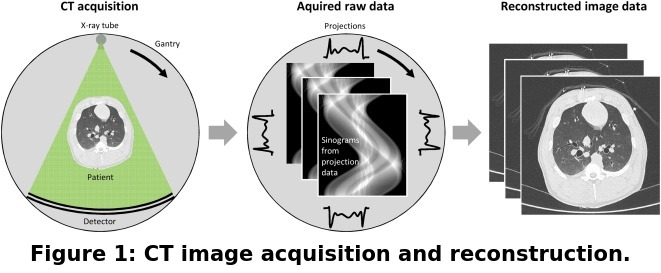
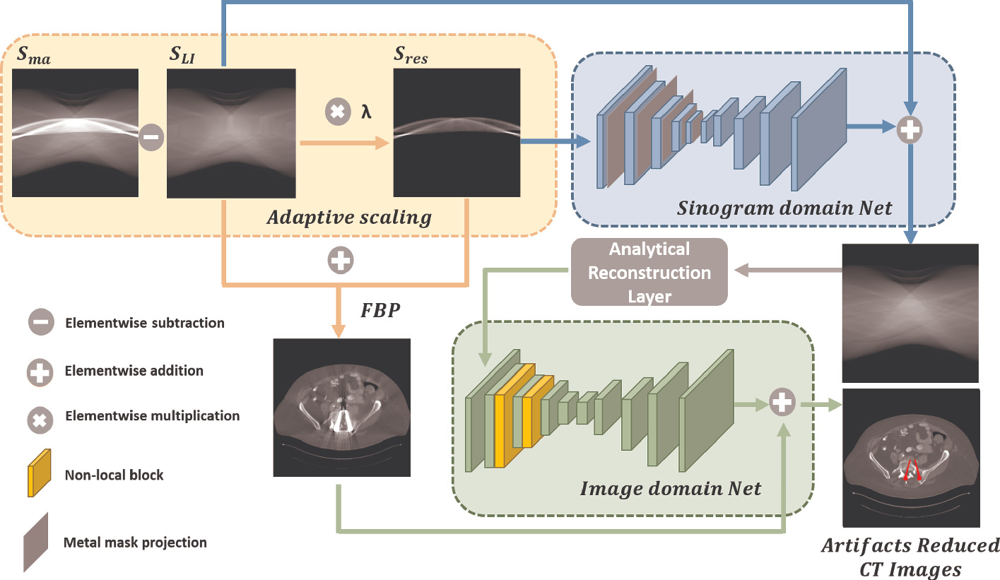
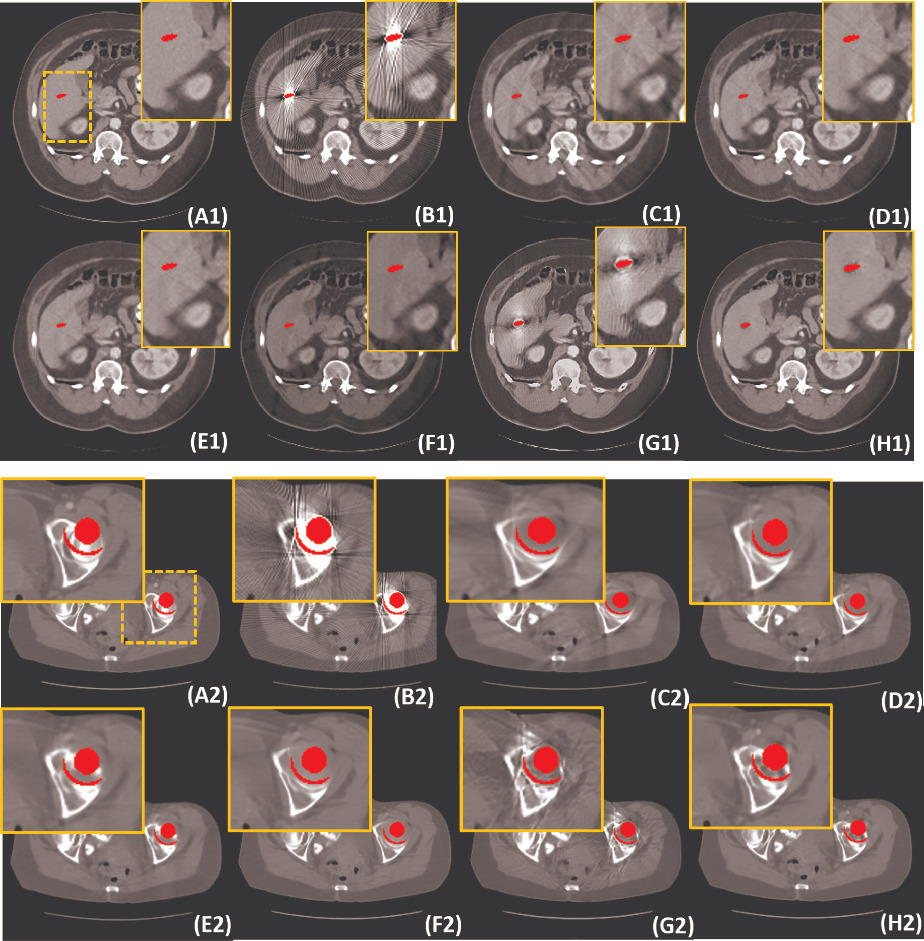

# DAN-Net \[Eng\]

##  1. Problem definition

First, let's see, how computed tomography (CT) images are created. The X-ray simply rotates around the body of a patient. The images are reconstructed from projection data which are the measured attenuation of X-ray intensity after passing through the body at multiple angles (Fig. 1, left). By sorting projection data, so-called sinograms can be derived (Fig. 1, middle). Sinograms represent the raw data necessary for the reconstruction of transverse images by means of an image reconstruction algorithm suited for CT, e.g. filtered back-projection (FBP) (Fig. 1, right).

</img>

Due to metallic implants, the reconstructed CT images can be contaminated by heavy artifacts which degrade the imaging quality and severely compromise doctors’ diagnoses. In particular, some artifacts and certain lesions can appear similarly, leading to misdiagnosis, and subsequent medical image analysis can be difficult.

The attenuation of X-ray intensity after passing through an object can be described with a constant called linear attenuation coefficient. Assuming that the attenuation distribution is 2D, the linear attenuation coefficients with metallic implants can be expressed as follows:
$$\mu(E)=\mu_t(E) \odot (1-M) + \mu_m(E) \odot M$$
where $$\mu_t(E)$$ and $$\mu_m(E)$$ represent attenuation images of tissue and metal parts respectively; $$M$$ denote the metal mask; and $$\odot$$ is the elementwise multiplication. Then, the projection data $$S_{ma}$$ can be calculated as follows
$$ S_{ma} =  -ln \int \eta(E)exp(-\mathcal{P}(\mu(E)))dE = -ln \int \eta(E)exp(-\mathcal{P}(\mu_t(E)\odot (1-M)))dE  -ln \int \eta(E)exp(-\mathcal{P}(\mu_m(E) \odot M)dE = S_{tissue} + S_{metal}$$
where $$\mathcal{P}$$  is the forward projection operation and $$\eta(E)$$ denotes the intensity distribution with spectral energy at $$E$$. Thus, $$S_{ma}$$ are contributed by the attenuation of tissues and metal objects denoted as $$S_{tissue}$$ and $$S_{metal}$$, respectively. $$S_{LI}$$ is regarded as linear interpolation corrected sinogram which is a rough estimation and attempt to restore the valuable residual information from $$S_{sub}=S_{ma}−S_{LI}$$.

In this paper, they proposed DAN-Net consisting of three components: adaptive scaling, sinogram-domain network and image-domain network.

## 2. Motivation

### Related work

During the past several decades, numerous metal artifact reduction (MAR) methods have been proposed.
1. Conventional MAR methods can be grouped into three categories:
    * projection completion methods - treat projection data in the metal trace region as missing and fill in lost data with estimated values by different image inpainting methods or interpolation strategies. However, the metal trace boundaries may not be smooth.
    * iterative reconstruction methods - constrained optimization is used, but these methods are usually time-consuming and require manually well-designed regularizers.
    * image postprocessing methods - reduce metal artifacts in the image domain but usually cannot suppress the artifacts well and are apt to distort the anatomic structure.
2. Deep-learning (DL)-based MAR methods include:
    * recovering the missing data in the metal trace.
    * reducing metal artifacts in the image domain.
    * end-to-end dual-domain networks - the mainstream for MAR.
There are a few problems in these methods which need to be addressed. Firstly, the data in the metal trace have a much higher amplitude than the data outside the metal trace and they can be regarded as following two different data distributions. It is difficult for neural networks to transform two different data distributions into a uniform distribution. We prefer to have a uniform distribution of the data because then the related grayscale images have better contrast. Also, uniform distributions of the data usually result in domain invariant performance. In addition, the change in the metal trace boundaries will cause weak continuity of the first derivative of projection data in a certain section, which will be further expanded by filtering and will generate extra artifacts. Finally, metal artifacts are non-local in the image domain, which may fail to be reduced well by a convolution operation.

### Idea

Therefore, a dual-domain Adaptive-scaling Non-local Network (DAN-Net) for MAR was proposed. There are three distinct contributions:
1. The original sinogram is preprocessed using adaptive scaling. Then the scaled metal projections and corresponding preprocessed CT images which were reconstructed by filtered back-projection, are taken as the inputs for dual-domain networks. This new approach can preliminarily suppress metal artifacts and maintain tissue details.
2. A novel residual sinogram learning strategy is proposed to avoid transforming two different data distributions into a uniform one and to improve the smoothness of the corrected projection.
3. A non-local U-Net architecture is designed for image-domain enhancement, which can capture long-range dependencies of metal artifacts and further improve the image quality.

## 3. Method
In Fig. 2, we can see the overview of the proposed DAN-Net which consists of the following three components.

</img>

### Adaptive scaling
Linear attenuation operation was used to restore the data in the metal trace as $$S_{pre} = S_{LI}+ \lambda S_{sub}$$, where $$\lambda$$ is the scaling parameter to control the trade-off between artifact reduction and detail preservation. $$S_{pre}$$ represents the corrected projection after adaptive scaling. Parameter $$\lambda = 0.4$$ was chosen experimentally. The corresponding adaptively scaled CT image is obtained as $$X_{pre} = \mathcal{P^{-1}}(S_{pre})$$ where $$\mathcal{P^{-1}}$$ denotes FBP operation.

### Sinogram Domain Network 
$$S_{res}$$ is taken as input to neural network $$G_{sino}$$ which used U-Net as the backbone and the mask pyramid network (MPN) to retain sufficient information of metal projection. Since the main goal is to retrieve information within the metal trace, the adaptively scaled residual sinogram is refined only in the metal trace. The corrected sinogram can be written as $$S_{sino} = G_{sino}(S_{res}, M_p) \odot M_t + S_{LI}$$. Also, $$\mathcal{L_{sino}}$$ is adopted to measure the differences between $$S_{sino}$$ and the ground truth $$S_{gt}$$ as $$ \mathcal{L_{sino}} = \| (S_{sino} - S_{gt}) \odot M_t\|_1 $$. Then, $$X_{sino} = \mathcal{P^{-1}}(S_{sino})$$ can be obtained using an analytical reconstruction layer. To alleviate the secondary artifacts in the reconstructed CT image, the reconstruction loss $$\mathcal{L_{FBP}}$$ between $$X_{sino}$$ and the ground truth image $$X_{gt}$$ is utilized as $$ \mathcal{L_{FBP}} = \| (X_{sino} - X_{gt}) \odot (1-M) \|_1$$.

### Image Domain Net 
To enhance the reconstructed CT images another U-Net was used. For computational efficiency, we halve the channel numbers because convolution is a local operator whose receptive field is limited by the size of filters, but metal artifacts are non-local therefore, convolution-based postprocessing methods may fail to remove the artifacts well. For this problem, the non-local layer is added to the network $$G_{im}$$ after the second and third down-sampling steps, as seen in the image above. To focus on the artifact-impacted regions, $$X_{sino}$$ and $$X_{pre}$$ are concatenated as inputs of $$G_{im}$$. Additionally a residual learning strategy is adopted: $$X_{im} = X_{pre} + G_{im}(X_{sino},X_{pre})$$. $$G_{im}$$ is also optimized with L1 norm in the image domain $$\mathcal{L_{im}} = \| (X_{im} - X_{gt}) \odot (1-M) \|_1$$. 
  
In summary, the total objective function is $$\mathcal{L} = \mathcal{L_{sino} + \alpha \mathcal{L_{FBP}} + \beta \mathcal{L_{im}}}$$, where $$\alpha$$ and $$\beta$$ are the weighting parameters of different components which were empirically set $$\alpha = \beta = 1$$.

## 4. Experiment & Result

### Experimental setup

In this paper, they used the DeepLesion dataset for which they generated metal masks from [3]. They randomly selected 1000 CT images from the DeepLesion dataset and 90 metal masks to synthesize 90,000 combinations for the training set. For evaluation remaining 200 CT images and 10 masks were used. The original CT images were resized to 256×256 for computational efficiency. To simulate Poisson noise, a polychromatic X-ray source was employed, and the incident beam X-ray was set to 2×107 photons [4]. The partial volume effects and scatter were also taken into consideration. Without loss of generality, the experiments were restricted to 2D parallel-beam geometry. For the sampling condition, 367 detector bins and 361 sampling views were assumed to be uniformly distributed from $$0^{\circ}$$ to $$180^{\circ}$$. The CT values were truncated to [0, 4095] for a better approach to the real situation.

The results were compared for the newly proposed DAN-Net and other state-of-art-methods (LI, NMAR, CNNMAR, DuDoNet and ADN) quantitatively with structural similarity (SSIM) and peak signal-to-noise ratio (PSNR) and qualitatively using two representative metallic implants with different sizes.

### Result

In the following table, we can see that DAN-Net raises the scores in comparison to the other methods by suppressing the metal artifacts.

| Methods  | Uncorrected | LI     | NMAR   | CNNMAR | DuDoNet | ADN    | DAN-Net |
|--------- |-------------|--------|--------|--------|---------|--------|---------|
| PSNR     | 15.33       | 30.74  | 30.83  | 32.15  | 36.82   | 33.60  | 40.61   |
| SSIM     | 0.6673      | 0.9224 | 0.9270 | 0.9508 | 0.9777  | 0.9275 | 0.9872  |

For qualitative comparison, we can look at Fig. 3. (A1)&(A2)- (H1)&(H2) denote: Reference images, Uncorrected, LI, NMAR, CNNMAR, DuDoNet, ADN and DAN-Net.

</img>

LI and NMAR contain some radial artifacts, while DL-based methods perform better. When metal objects get larger, LI and NMAR introduce obvious new artifacts (marked as C2 and D2). In the second case, other methods fail to preserve the details around metallic implants, while DAN-Net maintains these structural details more completely.
In this paper they have also tested the proposed method on clinical data and the same trend could be observed: DAN-Net suppresses most of the metal artifacts and preserves the fine-grained anatomical structures around the metals, which supplies coherent results to the simulated data and demonstrates the potential for real clinical application.

The following table shows the effect of using sinogram-domain residual learning, image-domain non-local module and adaptive scaling and as we can see from the results, the final module of the proposed DAN-Net achieves the best results.

| Methods   | Sino-Net | Res-Sino-Net | IM-Net | Non-local-IM-Net | Ma-Dual-Net | DAN-Net |
|-----------|----------|--------------|--------|------------------|-------------|---------|
| PSNR      | 31.43    | 31.71        | 33.79  | 34.75            | 34.15       | 40.61   |
| SSIM      | 0.9232   | 0.9494       | 0.9520 | 0.9720           | 0.9597      | 0.9872  |

## 5. Conclusion

DAN-Net was proposed for MAR in CT images. Thanks to adaptive scaling, artifacts can be reduced first with better preservation of tissue details. A residual sinogram learning strategy and non-local module are used additionally to enhance the CT image quality. Various experiments were done to prove the better performance of DAN-Net in comparison with several state-of-the-art MAR methods in both qualitative and quantitative aspects. However, the method is shown for 256×256 images, but instead, 512×512 images are mostly used in clinical practice, so I would like to see how this method performs on larger images.

### Take home message

> Metal artifacts are non-local therefore, convolution-based postprocessing methods may fail to remove the artifacts well.
>
> Adaptive scaling is used to retrieve more structural details around the metallic implants.
>
> It is difficult to convert two different data distributions to a unified distribution for normal networks which in this case is caused to the higher attenuation coefficient of metal.

## Author / Reviewer information

### Author

**Povolna Anna** 

* KAIST Bio and Brain Engineering
* [LinkedIn](https://www.linkedin.com/in/anna-povolná-97364973/)
* [GitHub](https://github.com/povolann)

### Reviewer

1. ...
2. ...
3. ...

## Reference & Additional materials

1. [Dual-Domain Adaptive-Scaling Non-local Network for CT Metal Artifact Reduction](https://doi.org/10.1007/978-3-030-87231-1_24)
2. [DAN-Net GitHub](https://github.com/zjk1988/DAN-Net)
3. Zhang, Y., Yu, H.: Convolutional neural network based metal artifact reduction in x-ray computed tomography. IEEE Trans. Med. Imaging 37(6), 1370–1381 (2018)
4. Tang, S., et al.: Application of projection simulation based on physical imaging model to the evaluation of beam hardening corrections in X-ray transmission tomography. J. X-ray Sci. Technol. 16(2), 95–117 (2008)
5. W. Stiller, “Basics of iterative Reconstruction Methods in Computed Tomography: A vendor-independent overview,” European Journal of Radiology, vol. 109, pp. 147–154, 2018.
