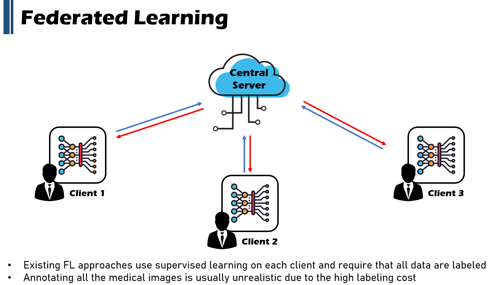
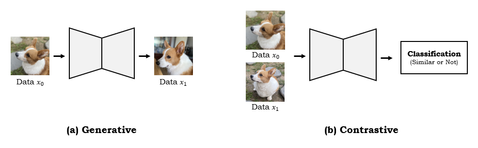
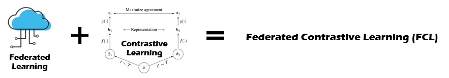
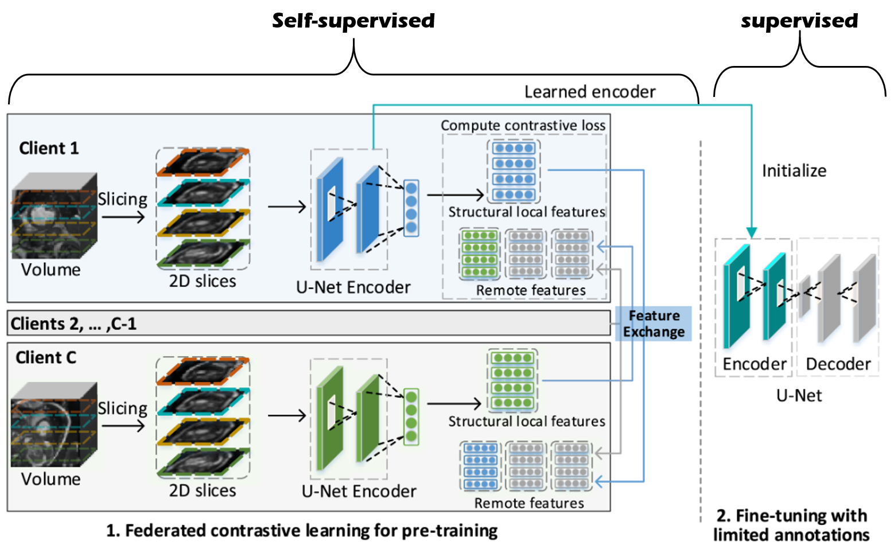
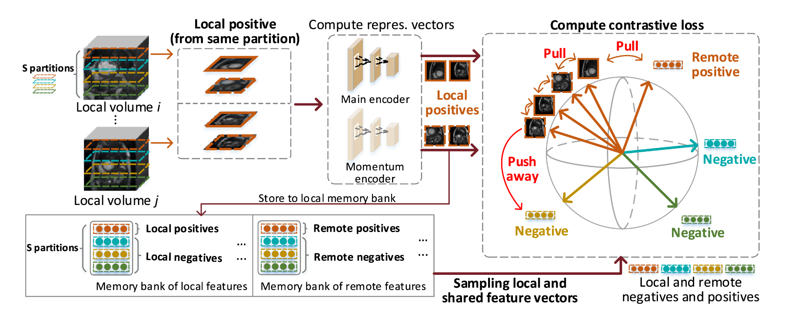
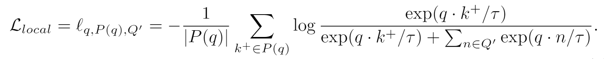
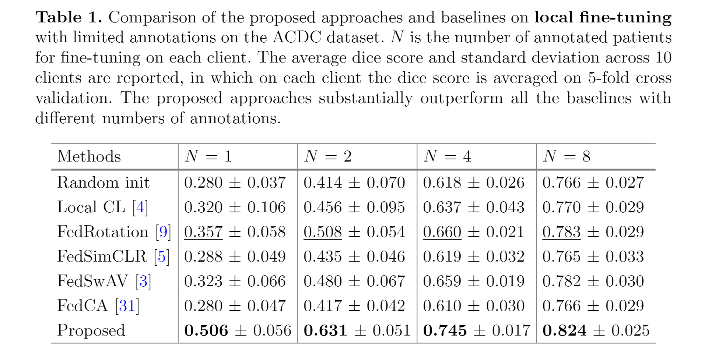
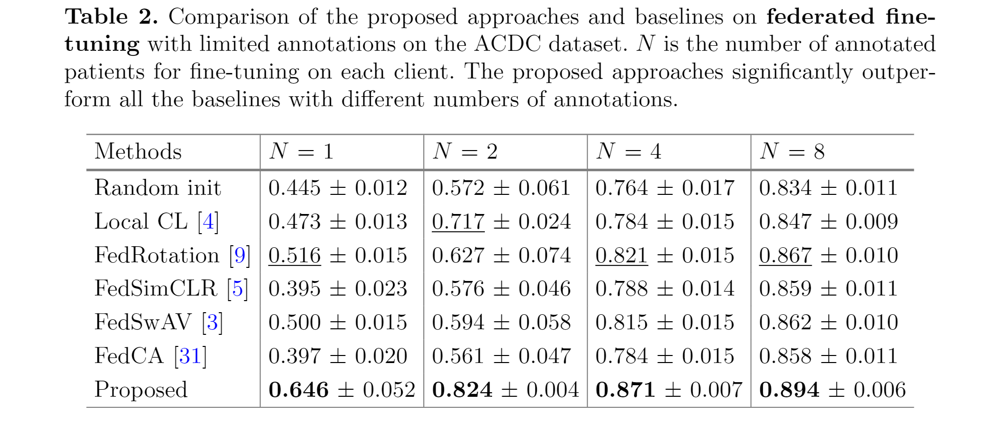
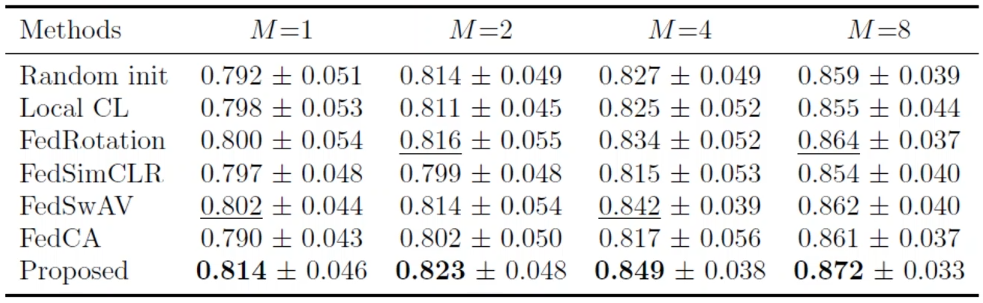
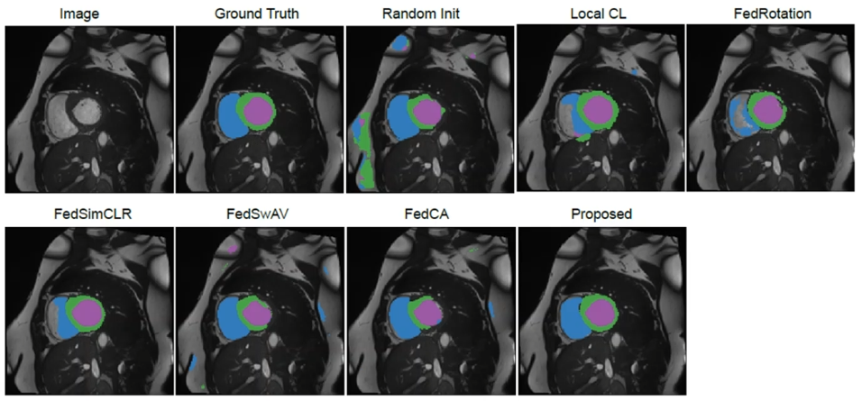

# Federated Contrastive Learning for Volumetric Medical Image Segmentation [Eng]

한국어로 쓰인 리뷰를 읽으려면 [**여기**](https://github.com/2na-97/awesome-reviews-kaist/blob/master/paper-review/2021-fall-paper-review/miccai-2021-federated-contrastive-learning-kor.md)를 누르세요.

## 1. Problem Definition
  In this paper, we presented two major problems of deep learning models with medical images.
  1. Supervised learning, which trains with labeled data, has shown good results in many fields, but medical experts are required to obtain labels of medical data and it takes a considerable amount of time. In this reason, it is hard to find a large amount of high-quality medical datasets.
  2. Since the privacy problems are important to protect patient information, it is difficult to exchange medical data held by hospitals or doctors.

  In general, a method called self-supervised learning is being actively studied to learn from data lacking labels.  
  
  `Contrastive Learning`, one of self-supervised learning methods, is a method of pre-training by comparing a large amount of unlabeled data with each other, and then performing fine tuning on a labeled dataset.  
  In order to do Contrastive Learning with insufficient medical data, the author proposed a method of introducing `Federative Learning`, which allows learning with the data that individuals have in one common model.  
  
  Inspired by the fact that Federative Learning does not share data directly, the concept of 'Federative Contrastive Learning' that combines Contrastive Learning after learning a common model using each individual's data while protecting personal information has been introduced.  
  
## 2. Motivation
### 2.1. Related Work
#### 2.1.1. Federated Learning

  `Federated Learning(FL)` is to learn a single model with data that `client` has for a common model as shown in the figure above.  
  If the number of clients increases, a model that has been learned about all the data the clients have can be obtained even if the amount of data that an individual has is not large.  
  Since it is possible to learn about the entire data without sharing the data directly, it can be usefully used in the case of medical data that requires the protection of patient's personal information.  
  
  However, the existing FL is achieved through _Supervised Learning_ that requires labels for all data.  
  Therefore, in the case of medical data which need high labeling cost, there is a problem in that it is difficult to use FL in practice.  
  

#### 2.1.2. Contrastive Learning
* **Self-Supervised Learning: Generative Learning vs Contrastive Learning**

  Two representative methods of Self-Supervised Learning are `Generative Learning` and `Contrastive Learning`.  
  
  `Generative Learning` is a method of comparing the loss of the generated output image after inserting the input image as shown in the figure above.  
  
  On the other hand, `Contrastive Learning` goes through the process of comparing the similarity of the input images.  
  It learns "representations" through the process of classifying similar images as `positive samples` and different images as `negative samples`.  
  
  
  
  * **Contrastive Learning: SimCLR**

  

  

  Cite: https://github.com/google-research/simclr

  
  The most famous paper of contrastive learning that performs self-supervised learning by _comparing representations_ between images is `SimCLR`.  
  First, `SimCLR` applys different augmentation to the same image as shown in the figure above.  
  Then it tries to increase the similarity of augmented images from the same image, while it tends to decrease the similarity with other images.  
  A function that learns a meaningful representation from an image trains to ignore changes caused by augmentation for the same image, and increases the distance between representations for different images.  
  In this way, it is possible to obtain a pre-trained encoder that extracts meaningful features of an image even without labels.  
  
  After obtaining the pre-trained encoder weights learned with a lot of data through `Contrastive Learning (CL)`, it be trained on the target dataset through the process of fine-tuning.  
  Briefly saying, we can think of it as similar to training a model based on pre-trained weights from massive data such as ImageNet, rather than training a model from scratch.  
  CL learns how to extract _meaningful features_ from a lot of data without labels, so that it can be used as a pre-training weight for various datasets.  
  As a result, it can show better performance than training a model from scratch.  (It is the same reason why we usally use ImageNet pre-trained weight!)  
  Various CL methods such as SimCLR, MoCo, and BYOL are being actively studied, and they show similar levels of accuracy to supervised learning.  
  

### 2.2. Idea

  In this paper, after supplementing the shortcomings of Federated Learning and Contrastive Learning, they propose a method called **Federated Contrastive Learning (FCL)** that combines only the strengths of the two learning methods.  
  The problems of FL and CL that the author claims are as follows.
  
  + When performing CL with a small amount of data that an individual has, it is not effective for CL because the amount of positive and negative samples is insufficient and the diversity between data is low.  
  + If the models learned by an individual are simply combined with the existing FL method, a feature space is created with only the individual's data. Therefore, in the process of merging the models, discrepancies between the feature spaces often occur which makes it difficult to improve real performance.
 
  FCL presented an idea to compensate for these shortcomings, enabling data exchange between clients while maintaining data security, so that self-supervised learning based on a large amount of data can be achieved.  
  The author expected that this method would become a medical image deep learning model that could be applied in practice.  
  
  
  
## 3. Method

  Cite: Figure 1. of the FCL paper

  As shown in the figure above, training with FCL is performed with FCL for a large amount of unlabeled data,  
  and then fine-tuning the encoder trained with FCL for a small amount of labeled data.  
  Since the process of fine tuning is easily done with labeled data, let's focus on the FCL method that learns to be a good encoder for fine tuning.  
  
  In FCL, the space where the client learn is called `local`, and the space where other clients learn is called `remote`.  
  
  As in `FL`, after learning from local, features of local are shared with remote.  
  As in `CL`, for the entire data of local and remote, the model train as similarity between similar data goes high and similarity between other data goes low.  
  
  In each local, the volume is first divided into several partitions (in the figure above, it was divided into 4 partitions: _orange_, _turquoise_, _yellow_, and _green_.),  
  while maintaining the order of the zones, and then a random 2D sample is taken from each region while maintaining the order of the partitions.  
  The U-Net encoder trained with these 2D slices as input can extract the structural features of the volume.  
  
  If all clients go through the same process for individual volume data, as many encoders as the number of clients are created.  
  At this time, we thought of a method of exchanging the features extracted from the local encoder in order to reflect the data possessed by other clients during learning without direct data exchange to protect the patient's personal information.  
  By exchanging features extracted with individual encoders, clients can use all features of other clients for training.  
  In this case, the effect of increasing the consistency of the feature space between clients can be seen rather than simply merging the models learned from each data.  
  
  
  

  Cite: Figure 2. of the paper

  Through the exchange, each client has local and remote features.  
  Each client's features are stored in `memory bank`, which store the local and remote features both.  
  All clients perform CL as shown in the figure above.  
  
  For CL, _positive_ and _negative_ samples are required.  
  In this paper, 2D slices in the same partition become positive samples and 2D slices in other areas become negative samples.  
  In the case of medical images, the author said that positive and negative are divided in this way because other images in the same partition have similar anatomical features.  
  (Take abdominal CT as an example, it will be easier to understand if you consider the position of the spine and the position of each organ is simailr even if people's body shape are slightly different.)  
  
  
  In the example, since the slices of the _orange_ partition are called positive samples, the loss function is calculated so that the features of the 2D slices drawn from the _orange_ area are close to each other and the features drawn from the areas of different colors are farther away from each other.  
  Through this, a unique representation for each partition can be learned.  
  
  There are two types of encoders for extracting features:
  * `Main Encoder`: An encoder that is actually trained and finally used as initialization for fine tuning. Used to calculate contrastive loss.
  * `Momentum Encoder`: Slow-growing version of the main encoder. It exists to avoid abrupt changes caused by outliers. It is stored in the _memory bank_ and used when sharing features to other clients.

  When all remote features are combined, too many negative samples are generated, which can actually lower CL.  
  So the number of negative samples and the number of positive samples are constantly adjusted.  
  And the features stored in the _memory bank_ are updated with new features by removing old ones after each round of FCL.  
  

  
:mag: **Overall Summary of the FCL Process**
  1. Each client divides unlabeled volumes into S partitions and extracts 2D samples from each partition.
  2. For the extracted 2D samples, the features are extracted with the Main Encoder and Momentum Encoder, respectively.  
     At this time, a feature vector is selected for each partition to learn the unique features of each partition.
  3. The feature vectors (local features) extracted by the Momentum Encoder are stored in the memory bank, and all the feature vectors (remote features) stored in the memory banks of other clients' trained feature vectors.
  4. The contrastive loss is calculated by sampling some of the feature vectors extracted from the main encoder and local and shared feature vectors obtained from the memory bank.
  5. Contrastive loss is trained as vectors in the same region are close to each other and vectors in different regions are far away for local and remote features.  
     A new feature vector is updated for each training.
  6. When the learning of the Main Encoder is completed by going through the processes from 1 to 5 several times, it is used as a pre-training weight to learn about labeled volumes and fine-tune it.

:mag: **Loss Function**
  : The loss function used in the above process consists of a local loss and a remote loss.  
  
  * `Local loss`: It is necessary to include both local positives and local negatives when extracting and using only a few feature vectors from the memory bank.  
                  (For example, to avoid the case where all positive samples are pulled from client 1 and only negative samples are pulled from client 2)  
  

  + $$Q^{'}$$: Sampled memory bank consisting of both local negatives and remote negatives
  + $$P(q)$$: local positives
  + $$\tau$$ : temperature
  + $$\cdot$$ : dot product between two vectors  

  * `Remote loss`: To make the feature space does not differ much between clients by comparing the features of local and remote.  
                   In this way, a refined representation can be learned.  
                   

    
  + $$\Lambda(q)$$: features in the sampled memory bank which are in the same partition as q

  * `Final loss`
  

## 4. Experiment & Result
### :ledger: Experimental setup
* **Dataset**: ACDC(Automated Cardiac Diagnosis Challenge, MICCAI 2017 Challenge Dataset) MRI dataset
* **Baselines**: 3D U-Net
* **Training setup**: Split 100 patients in ACDC dataset into 10 partitions
* **Fine-tuning with limited annotations**
  - 1,2,4, or 8 annotated patients per client
  - `Local fine-tuning`: Without exchanging feature vectors of other clients (remote), CL is performed only with the data of each client (local) and then the combined model is used as a pre-trained weight.  
  - `Federated fine-tuning`: After exchanging feature vectors with other clients (remote), the model that has undergone CL is used as a pre-trained weight.
* **Evaluation Metric**: Dice Score
* **Evaluation**: Evaluate the generalization of the learned representation through transfer learning

### :chart_with_upwards_trend: Result
  ### :heavy_check_mark: Results of Local Fine-tuning

  
* N = the number of annotated patients  
* It shows better performance than other models in all areas regardless of the number of annotations.  
* The higher the number of annotations, the higher the accuracy.  

  ### :heavy_check_mark: Results of Federated Fine-tuning

  
* Higher accuracy than local fine-tuning method
* The accuracy of _FedRotation_, which showed the second highest performance when N = 4, and that of _FCL_, when N = 2, are almost the same.  
    This can be said to show high efficiency in small annotations despite the 2-fold difference in labeling-efficiency.  

### :heavy_check_mark: Results of Transfer Learning

  * Although not in the paper, the table and figure shown during oral presentation are captured...  
  * Results of pre-training on ACDC data and fine-tuning on HVSMR (MICCAI 2016 challenge dataset)  
  * M indicates the number of patients with annotation during fine-tuning  
  * \[Results\]

## 5. Conclusion
The contribution of this paper is summarized as follows.
  1. Proposal of a new framework called Federated Contrastive Learning.  
    - Through this, it was possible to learn a meaningful representation for unlabeled data.  
    
  2. Presenting ideas for feature exchange to learn about various negative samples.  
    - It was possible to share features between clients while protecting the privacy of raw data.  
    - It showed improved results because it is possible to see various samples when doing local training and to avoid focusing only on the data that an individual has.  
  
  3. It is possible to learn about the global structure through the process of collecting remote positive samples and local positive samples.  
    - It is possible to learn a unique structure for each location in 3D medical images, and to adjust the feature space between clients so that they do not differ too much.  

### Take home message
  - Normally, when contrastive learning is performed, negative samples are defined for other classes, but it was refreshing to define negative samples within the same volume by taking advantage of the characteristics of medical images.  
  - The idea of sharing a feature vector rather than sharing the image itself made up for the disadvantages of FL, which is less realistic.  
  - I realized that self-supervised learning research is being actively conducted in the medical image field, which is classified as a hard case than other fields (especially for volume datasets)...  

Finally, except for the result table and the drawings with the source indicated, I would like to say that I made all of them myself :smile:

## Author / Reviewer information
### Author
**강인하\(Inha Kang\)**
  - School of Computing, KAIST  
  - Computer Graphics and Visualization Lab  
  - Contact: rkswlsj13@kaist.ac.kr  

### Reviewer
None.  

## Reference & Additional materials
* [FCL paper link](https://rdcu.be/cyl4i)
* [SimCLR github](https://github.com/google-research/simclr)
