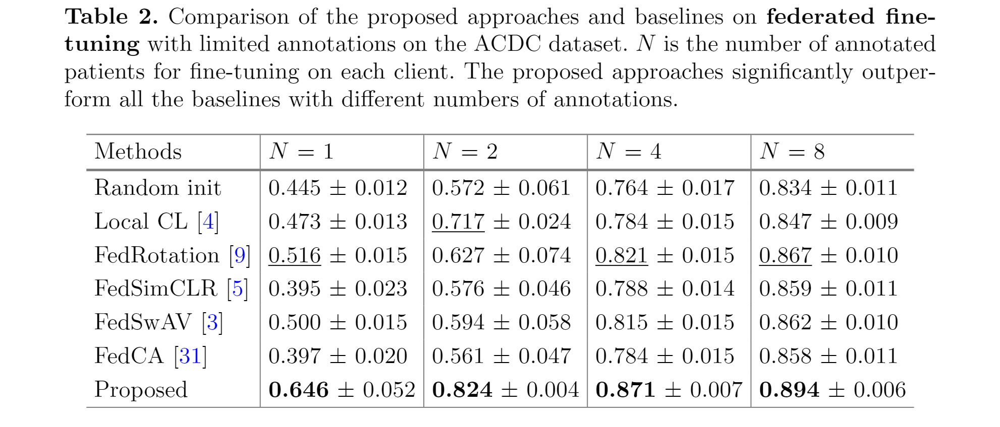
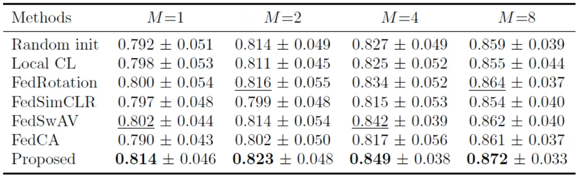
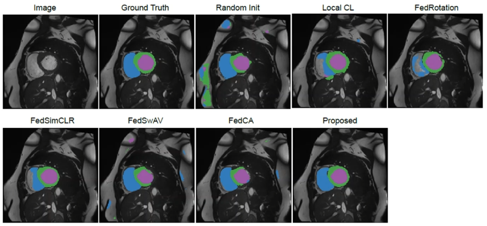

# **Federated Contrastive Learning for Volumetric Medical Image Segmentation \[Kor\]**

[**English version**](https://github.com/2na-97/awesome-reviews-kaist/blob/master/paper-review/2021-fall-paper-review/miccai-2021-federated-contrastive-learning-eng.md) of this article is available.

## 1. Problem Definition
  해당 논문에서는 의료 영상으로 인공지능 모델을 학습할 때 겪는 대표적인 두 가지 문제를 제시했다.  
  1. 레이블(label)이 있는 데이터로 학습을 시키는 지도 학습(Supervised Learning)은 많은 분야에서 좋은 결과를 보이고 있으나, 의료 데이터의 레이블을 구하기 위해서는 의료 전문가들이 필요하며 상당한 시간을 요구하기 때문에 레이블이 있는 방대한 양의 의료 데이터셋을 찾는 것이 쉽지 않다.
  2. 환자들의 개인 정보 보호가 중요시 되기 때문에 병원 혹은 의사들 간에 의료 데이터를 서로 교환해서 보는 것이 어렵다.

  일반적으로 레이블이 부족한 데이터들로 학습을 시키기 위해 자기 지도 학습(Self-Supervised Learning)이라는 방법이 활발하게 연구되고 있다.  
  자기 지도 학습 방법 중 하나인 `Contrastive Learning`은 레이블이 없는 방대한 양의 데이터를 서로 비교하는 방법을 통해 pre-training을 한 후 레이블이 있는 데이터셋에 대해서 fine tuning을 하며 학습시키는 방법이다.  
  의료 데이터로 Contrastive Learning을 하기 위해서는 데이터가 부족하기 때문에 하나의 공통된 모델에 개인이 가지고 있는 데이터들로 학습을 시키는 `Federative Learning`을 도입하는 방법을 제시했다.  
  Federative Learning은 데이터를 직접적으로 공유하지 않기 때문에, 개인 정보는 보호하면서도 각각의 개개인들이 가지고 있는 데이터를 활용하여 하나의 공통된 모델을 학습한 후 Contrastive Learning을 접목시킨 `Federative Contrastive Learning`이라는 개념을 도입했다.

## 2. Motivation
### 2.1. Related Work
#### 2.1.1. Federated Learning

  `Federated Learning(FL)`이란 위의 그림에서처럼 공통의 모델에 대해서 `개인(client)`이 가지고 있는 데이터로 하나의 모델을 학습시키게 된다.  
  이런 client들이 많아지게 되면 한 개인이 가지고 있는 데이터의 양은 많지 않더라도, client들이 가지고 있는 데이터 전체에 대해서 학습한 모델을 얻을 수 있다.  
  데이터의 직접적인 공유를 하지 않고도 전체 데이터에 대한 학습이 가능하다는 특성때문에, 환자의 개인 정보 보호가 필요한 의료 데이터의 경우 유용하게 사용될 수 있는 방법이다.  
  하지만 현존하는 FL은 모든 데이터에 대해서 레이블을 필요로 하는 supervised learning을 통해서 이뤄진다.  
  그렇기 때문에 labeling cost가 높은 의료 데이터의 경우 FL을 실전에서 사용하는 것은 현실적인 어려움이 있다는 문제점이 있다.

#### 2.1.2. Contrastive Learning
* **Self-Supervised Learning: Generative Learning vs Contrastive Learning**

Self-Supervised Learning의 대표적인 두 가지 방법에는 `Generative Learning`과 `Contrastive Learning`이 있다.  
`Generative Learning`은 위 그림에서와 같이 입력 이미지를 넣은 후 생성된 출력 이미지에 대한 loss를 비교하는 방법이다.  
반면에 `Contrastive Learning`은 입력받은 이미지들의 비슷함 정도를 비교하는 과정을 거친다. 이는 비슷한 이미지끼리는 `positive sample`으로 분류하고 다른 이미지끼리는 `negative sample`으로 분류하여 대조하는 과정을 통해서 representation을 학습한다.

* **Contrastive Learning: SimCLR**

  

  출처: SimCLR github page  

이미지 간의 representation 비교를 통해 자기 지도 학습을 하는 contrastive Learning의 대표적인 논문에는 `SimCLR`가 있다.  
`SimCLR`는 위 그림에서 같이 같은 이미지에 대해서 서로 다른 augmentation을 적용한 후, 같은 이미지에서 augmentation된 이미지들의 similarity는 높게 하되 다른 이미지와의 similarity는 낮추는 방향으로 학습을 할 수 있도록 한다.  
이미지에서 유의미한 representation을 학습하는 함수와 같은 이미지에 대해서는 augmentation으로 인한 변화를 무시하는 방향으로 학습하고 다른 이미지에 대해서는 representation간의 간격을 크게 하여 label이 없더라도 이미지의 유의미한 feature를 뽑아내는 pre-train된 인코더를 얻을 수 있게 된다.

`Contrastive Learning(CL)`을 통해 많은 데이터로 학습한 pre-trained 인코더 weight을 얻게 된 후에는, 실제로 우리가 학습시키고자 하는 데이터에 대해서 학습을 시키며 fine tuning을 하는 과정을 거친다. 간단하게 말하자면, 우리가 모델을 처음부터 학습시키기 보다는 ImageNet과 같은 방대한 데이터로 학습한 weight를 기반으로 학습을 하는 것과 비슷하다고 생각하면 된다. CL은 레이블이 존재하지 않는 많은 데이터로부터 유의미한 feature를 추출하는 방법을 학습시켜 다양한 데이터셋에 pre-training weight으로 활용할 수 있도록 하여 모델을 처음부터 학습시키는 것보다 나은 성능을 보일 수 있도록 하는 것을 목표로 한다. SimCLR, MoCo, 그리고 BYOL과 같이 다양한 CL 방법들이 활발하게 연구되고 있는데, 이들은 supervised learning과 비슷한 수준의 정확도를 보이고 있다.

### 2.2. Idea

본 논문에서는 Federated Learning의 단점과 Contrastive Learning의 단점을 보완한 후 두 학습 방법의 장점만 활용하여 합친 **Federated Contrastive Learning(FCL)** 이라는 방법을 제안한다. 저자가 주장하는 FL과 CL의 문제점은 다음과 같다.

* 개인이 가지고 있는 적은 양의 데이터로 CL을 할 경우, positive sample과 negative sample의 양도 부족하고 데이터 간의 다양성이 떨어지기 때문에 CL을 하는 데에 효과적이지 않다.
* 기존의 FL 방법으로 단순히 개인이 학습한 모델을 합치게 되면, 개인이 가지고 있는 데이터에 치중된 feature space가 만들어져 모델을 합치는 과정에서 feature space 간의 불일치가 일어나 실질적인 성능 향상 효과를 보기 어려울 수도 있다.

FCL에서는 이러한 단점들을 보완하기 위한 아이디어를 제시했는데, 데이터의 보안을 유지하면서도 client간의 데이터 교류를 할 수 있도록 하여 많은 양의 데이터를 기반으로 자기 지도 학습을 하는 효과를 볼 수 있도록 했다. 저자는 이러한 방법이 실전에서도 차용할 수 있는 의료 영상 딥러닝 모델이 될 것이라 기대했다.

## 3. Method

  출처: FCL 논문 Figure 1. Overview of the FCL

FCL을 활용한 학습은 위 그림에서와 같이 레이블이 없는 많은 양의 데이터에 대해서는 FCL로 학습한 후, 레이블이 있는 소량의 데이터에 대해서 FCL로 학습한 인코더를 fine tuning하게 된다. Fine tuning을 하는 과정은 레이블이 있는 데이터로 쉽게 이루어지기 때문에 fine tuning을 위한 좋은 인코더가 될 수 있도록 학습하는 FCL 방법에 집중해서 살펴보도록 하자.

FCL에서는 본인이 학습하는 공간을 `local`, 다른 client가 학습하는 공간을 `remote` 라고 부른다.  
FL에서와 같이 local에서 학습한 후 이를 remote와 공유하게 되며, local과 remote의 데이터에 전체에 대해서 CL에서와 같이 비슷한 데이터끼리는 similarity가 높고 다른 데이터끼리는 similarity가 낮아지도록 학습이 진행된다.  
각각의 local에서는 먼저 볼륨을 몇 개의 구역으로 나눈 후\(위 그림에서는 `주황색`, `청록색`, `노란색`, `초록색`의 4가지 영역으로 나누었다.\), 구역의 순서는 유지하면서 각 구역에서 랜덤한 2D 샘플을 뽑아낸다.  
이 2D 슬라이스들을 입력 이미지로 받아 학습된 U-Net의 인코더는 볼륨의 구조적 특징들을 뽑아낼 수 있게 된다.  
모든 client가 개인이 가지고 있는 볼륨 데이터에 대해서 같은 과정을 거치면 client의 수만큼의 인코더가 만들어지게 된다.  
이 때, 환자의 개인 정보 보호를 위해 직접적인 데이터 교환은 하지 않으면서도 다른 client가 가지고 있는 데이터도 학습시에 반영할 수 있도록 하기 위해서 local의 인코더에서 추출한 feature를 교환하는 방법을 생각했다.  
개인의 encoder로 추출한 feature를 교환하는 방식을 통해서 client들이 가지고 있는 모든 데이터에 대해서 학습하는 효과를 누릴 수 있도록 한다.  
이 경우 각각의 데이터로 학습한 모델을 단순히 합치는 것보다 client간 feature space의 일관성을 높이는 효과도 보일 수 있다.

  출처: FCL 논문 Figure 2. Contrastive learning on one client with exchanged features.

교환을 통해서 각각의 client들은 local과 remote의 feature들을 가지게 된다.  
각 client들의 feature들은 `memory bank`에 저장되는데, `memory bank`에 저장된 local과 remote feature들을 가지고 각각의 client들은 위 그림과 같이 CL을 하게 된다.  
CL을 위해서는 positive와 negative sample이 필요한데, 본 논문에서는 같은 구역(partition)에 있는 2D 슬라이스들은 positive sample이 되고 다른 구역에 있는 2D 슬라이스들은 negative sample이 되도록 설정했다.  
메디컬 이미지의 경우 다른 이미지라 하더라도 해부학적으로 비슷한 특징을 가지고 있기 때문에 이와 같이 positive와 negative를 나누었다고 한다. (복부 CT를 예로 들면, 사람들의 체형은 조금씩 다 다르더라도 척추의 위치나 각 장기들의 위치는 비슷한 것을 생각해보면 이해하기가 편할 것 같다.)  
예시에서는 주황색 partition의 슬라이스들을 positive sample이라고 두었기 때문에, 주황색 구역에서 뽑은 2D 슬라이스의 feature끼리는 가까워지고 다른 색깔의 구역에서 뽑은 feature끼리는 서로 멀어지게 손실 함수가 계산된다.  
이를 통해 각 구역마다의 고유한 representation을 학습하게 되는 것이다.

feature들을 뽑아내는 인코더는 두 가지 종류의 인코더가 있는데, contrastive loss를 계산할 때 사용되는 `Main Encoder`와 memory bank에 저장할 때 사용되는 `Momentum Encoder`가 있다.
* `Main Encoder`: 실질적으로 학습되고 최종적으로 fine tuning을 위한 initialization으로 사용되는 인코더.
* `Momentum Encoder`: 느리게 성장하는 main encoder 버전. outlier에 의한 급격한 변화를 피하기 위해 존재한다. memory bank에 저장되어 다른 client에게 feature를 공유할 때 사용된다.

remote feature들까지 합쳐지게 되면 너무 많은 negative sample들이 생겨 오히려 CL을 저하시킬 수 있기 때문에, negative sample의 수와 positive sample 수를 일정하게 맞추는 작업을 해주었다고 한다.  
그리고 memory bank에 저장된 feature들은 FCL의 한 라운드가 끝날 때마다 오래된 것들은 제거하고 새로운 feature로 업데이트 시켰다고 한다.  
  
###

:mag: **전체적인 FCL 과정 총 정리**
1. 각 client들은 label이 없는 볼륨들을 S개의 구역으로 나눈 후 각 구역 내에서 2D sample들을 추출한다.
2. 뽑아낸 2D sample들에 대해서 Main Encoder와 Momentum Encoder로 feature를 각각 추출해 낸다. 이 때, 각 구역별로 feature vector를 뽑아 각 구역마다의 고유한 특징을 학습하도록 한다.
3. Momentum Encoder로 추출된 feature vector들(local feature)은 memory bank에 저장되며, 다른 client들의 memory bank에 저장된 feature vector들(remote feature)을 모두 가져온다.
4. Main Encoder에서 추출한 feature vector들과, memory bank에서 가져온 local과 shared feature vector들 중 일부를 sampling하여 contrastive loss를 계산한다.
5. contrastive loss는 local과 remote feature들에 대해서 같은 구역의 vector끼리는 가깝고 다른 구역의 vector끼리는 멀리 있도록 학습되며, 매 학습마다 새로운 feature vector로 업데이트 된다.
6. 1~5까지의 과정을 여러번 거쳐서 Main Encoder의 학습이 완료되면, 이를 pre-training weight으로 사용하여 label이 있는 볼륨들에 대해서 학습시키며 fine tuning 한다.

:mag: **손실 함수 (Loss Function)**
: 위 과정에서 사용되는 loss function은 크게 local loss와 remote loss로 이루어져 있다.
* `Local loss`: memory bank에서 몇 개의 feature vector만을 추출해서 사용할 때 local positive와 local negative가 모두 포함될 수 있도록 하기 위해서 필요하다. (예를 들어서, client 1에서는 모두 positive sample만 뽑아오고 client 2에서는 모두 negative sample만 뽑아오는 경우를 피하기 위해서)

  + $$Q^{'}$$: Sampled memory bank consisting of both local negatives and remote negatives
  + $$P(q)$$: local positives
  + $$\tau$$ : temperature
  + $$\cdot$$ : dot product between two vectors 
    
* `Remote loss`: 다른 client로부터 얻어온 feature들과 비교하여 client끼리 feature space가 많이 차이나지 않도록 하며 정제된 representation을 학습할 수 있도록 한다.

    
  + $$\Lambda(q)$$: features in the sampled memory bank which are in the same partition as q

* `Final loss`

## 4. Experiment & Result
### :ledger: Experimental setup
* **Dataset**: ACDC(Automated Cardiac Diagnosis Challenge, MICCAI 2017 Challenge Dataset) MRI dataset
* **Baselines**: 2D U-Net (최종적으로는 Segmentation Task를 통해 성능 평가)
* **Training setup**: Split 100 patients in ACDC dataset into 10 partitions
* **Fine-tuning with limited annotations**
  + 1,2,4, or 8 annotated patients per client
  + Local fine-tuning: 다른 client의 feature vector 교환 없이 각각의 client가 가진 데이터로 CL을 한 후 합친 모델을 pre-trained weight으로 사용
  + Federated fine-tuning: 다른 client와의 feature vector 교환한 후 CL을 진행한 모델을 pre-trained weight으로 사용
* **Evaluation Metric**: Dice Score
* **Evaluation**: Transfer learning을 통해 학습한 representation의 generalization을 평가함

### :chart_with_upwards_trend: Result
  ### :heavy_check_mark: Results of Local Fine-tuning
  

  
+ N = annotated patient의 수
+ annotation의 수와 관계 없이 모든 부분에서 다른 모델보다 좋은 성능을 보임
+ annotation의 수가 많아질수록 정확도가 더 올라감

  ### :heavy_check_mark: Results of Federated Fine-tuning

  
+ local fine-tuning 방식보다 정확도가 더 상승함
+ N = 4일 때 두 번째로 높은 성능을 보인 _FedRotation_ 의 정확도와 N = 2일 때의 _FCL_ 의 정확도가 거의 비슷함. 이는 labeling-efficiency가 2배 차이남에도 불구하고 적은 annotation에서 높은 효율을 보인다고 할 수 있음

### :heavy_check_mark: Results of Transfer Learning

  
+ 논문에서는 없지만 oral 발표시에 보여준 표와 그림을 캡쳐...
+ ACDC 데이터에 대해서 pre-training을 시키고 HVSMR(MICCAI 2016 challenge dataset)에 대해서 fine-tuning을 시킨 결과
+ M은 fine-tuning 시에 annotatation이 있는 환자의 수를 나타냄
+ \[결과 사진\]
        

  
  - 결과사진을 보면 ACDC 데이터를 가지고 FCL로 학습한 인코더로 HVSMR 데이터셋을 학습시키며 fine-tuning을 했을 때 (위 사진에서 'Proposed') 가장 Ground Truth랑 근접한 결과를 보인 것을 알 수 있다.  
  - 많은 선행 연구들에 따르면, 의료 영상의 경우 ImageNet과 같은 일반적인 사진에 대해서 Pre-trained된 weight을 사용할 때 성능이 오히려 저하되는 점들이 있었다. (의료영상의 경우 흑백 사진으로 채널도 1개이고, 각 픽셀의 값도 일반 사진과는 다르기 때문에 일반적으로 사용하는 대중적인 Pre-training weight을 사용하는 것이 쉽지 않았다.)  
  - 하지만 FCL 방법론을 통해서 어떤 의료영상에 대해서든 General한 Pre-training weight을 얻을 수 있음을 Transfer Learning 결과를 통해서 입증했다고 볼 수 있을 것 같다.  
    
    

## 5. Conclusion
본 논문의 contribution을 정리하면 다음과 같다.
  1. Federated Contrastive Learning이라는 새로운 프레임워크 제안.  
    - 이를 통해서 레이블이 없는 데이터에 대해서 유의미한 representation을 학습할 수 있었음  
  2. 다양한 negative sample들에 대해서 학습할 수 있도록 feature exchange를 하는 아이디어 제시.  
    - raw data의 개인 정보 보호는 하면서도 client들 간의 feature는 공유할 수 있었음  
    - local learning을 할 때에 다양한 샘플들을 볼 수 있도록 하여 개인이 가지고 있는 데이터에만 치중되는 것을 방지하기 때문에 정확한 결과를 얻을 수 있음
  3. Remote positive 샘플과 local positive 샘플끼리 모으는 과정을 통해 global structure에 대한 학습이 가능하도록 함.  
    - 3D 의료 영상에서 위치별로 고유한 structure를 배울 수 있으며, client간의 feature space가 너무 상이해지지 않도록 조절할 수 있게 됨

### Take home message
> - 보통 contrastive learning을 할 때는 다른 class에 대해서 negative sample로 정의하는데, medical image의 특징을 살려서 같은 볼륨 내에서 negative sample을 정의한 점이 신선했음.
> - 이미지 자체를 공유하는 것이 아니라 feature vector를 공유한다는 생각이 현실성이 낮은 FL의 단점을 잘 보완했다고 생각함.
> - 다른 분야들보다 hard case로 분류되는 medical image 분야에서도 (특히 볼륨 데이터셋에 대해서) self-supervised learning 연구가 활발하게 진행되고 있다는 것을 깨달음...  
> - 하지만 3D volume을 2D slice로 나누어서 한 방법이라는 것이 아쉬움. 3D context를 잃지 않으면서도 contrastive learning을 할 수 있는 방법론이 연구된다면 아주 좋은 주제가 되지 않을까? 라는 생각을 하게 되었음.  

끝으로 결과표와 출처가 표시된 그림 외에는 모두 직접 제작한 것임을 밝힙니다 :smile:

## Author / Reviewer information
### Author
**강인하\(Inha Kang\)**
  - School of Computing, KAIST  
  - Computer Graphics and Visualization Lab  
  - Contact: rkswlsj13@kaist.ac.kr  

### Reviewer
None.  

## Reference & Additional materials
* [FCL paper link](https://rdcu.be/cyl4i)
* [SimCLR github](https://github.com/google-research/simclr)
