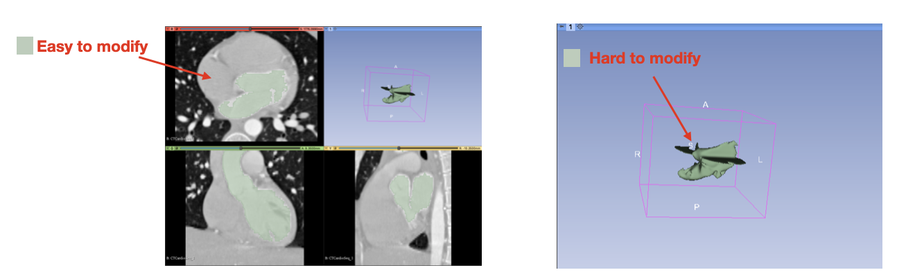
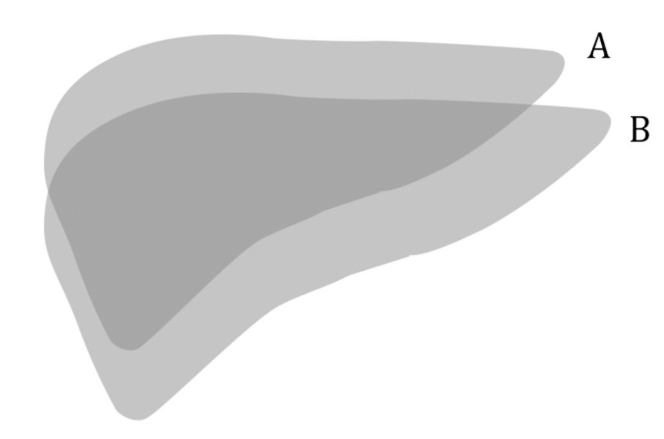
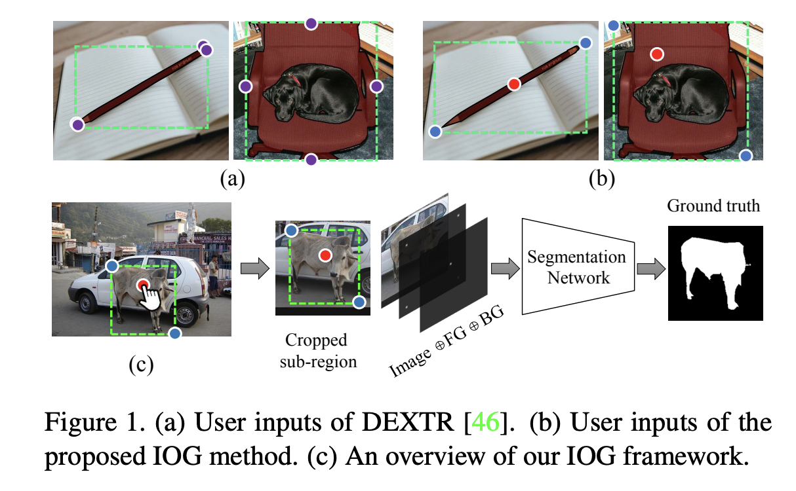
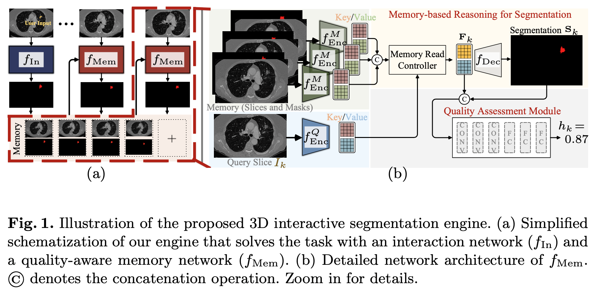
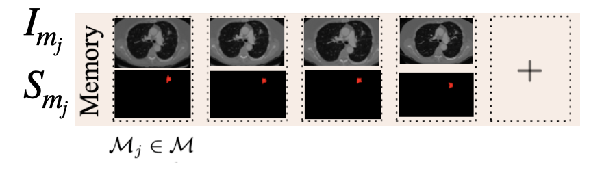
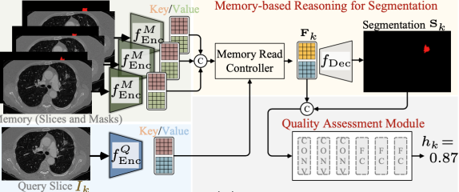
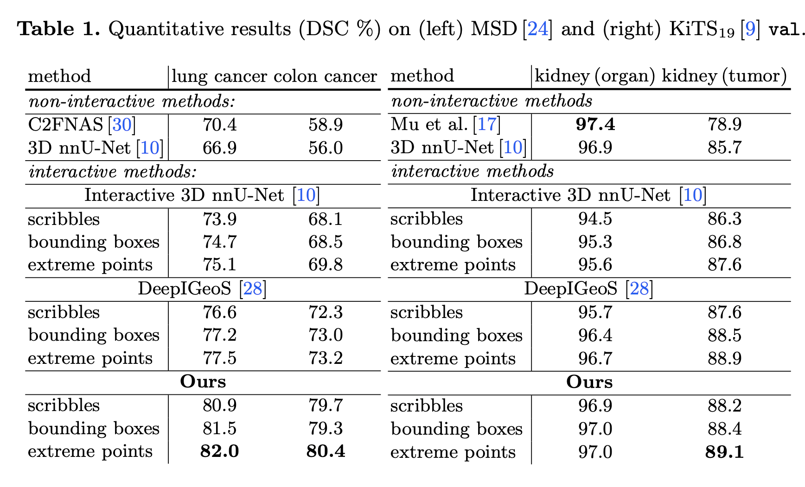
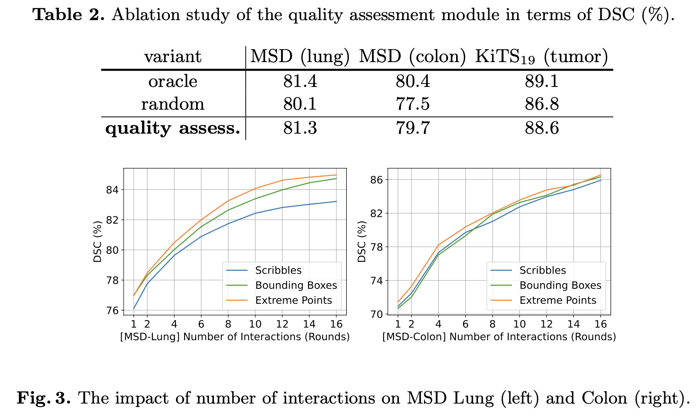

# Quality-Aware Memory Network for Interactive Volumetric Image Segmentation \[Kor\]

##  1. Problem definition

사용자 상호작용 기반의 이미지 분할(Interactive Segmentation)은 마우스 클릭 혹은 드래그 같은 다양한 사용자 입력을 기반으로 높은 정확도의 이미지 분할을 얻는 문제이다.
이미지 분할의 높은 정확도를 요구하는 의료 이미징 분야나, 이미지 분할을 위한 데이터 구축을 위해 주로 사용되고 있다.
2D 이미지에서의 Interactive Segmentation은 컴퓨터 비전 분야에서 오래 연구되어 온 분야로 Graph Cuts, Random Walker, Geos와 같은 전통적인 방법들이 존재하며,
딥러닝 기반의 방법의 등장으로 더 적은 상호작용 횟수로 높은 정확도를 얻을 수 있게 되었다.
하지만, 의료분야에서 흔히 사용되는 3D 이미지에서 사용자 상호작용을 통해 높은 정확도의 이미지 분할 결과를 얻기 위해서는 사용자가 모든 슬라이스를 검토하며 분할 결과를 수정해야 한다.
Figure 1과 같이 렌더딩된 3D 인스턴스는 수정할 부분을 찾기 어려워 직접 수정하기 어렵기 때문에 왼쪽 그림과 같이 슬라이스를 일일이 확인해가며 수정해야 한다. 
따라서, 128x256x256 이미지가 있다면 사용자는 128장의 2D 이미지를 수정해야 한다. 
**3D Interactive Segmentation은 이러한 3D 이미지에서 적은 사용자 상호작용으로 높은 정확도를 얻는 방법이다.**

이 논문에서는 사용자가 인스턴스에 Bounding Box(BB)를 치거나 인스턴스의 가장 위, 아래, 왼쪽, 오른쪽을 클릭하는 Extreme Points(EP), 동일한 드래그에 대하여 얼마나 정확한 분할 결과를 예측하는지 평가한다.
평가 척도는 Dice Similarity Coefficient를 사용하며 분할 예측 결과 A와, 정답 B의 $$ D S C=\frac{2|A \cap B|}{|A|+|B|} $$으로 정의된다.

## 2. Motivation
MRI, CT와 같은 3D 의료이미지에서 고품질의 이미지 분할 결과를 얻기 위해서는 모든 Slice를 사용자가 Interactive Segmentation 기법을 이용하여 결과를 얻어야 한다.
이러한 문제를 해결하기 위해 Figure 2와 같은 DeepIGeoS[1] 등의 3D 네트워크를 기반으로한 방법들이 제안되었지만, 2D 네트워크에 비해 더 많은 파라미터와 계산량을 필요로 한다.
저자는 이러한 문제를 해결하기 위해 메모리 네트워크를 이용한 3D Interactive Segmentation 방법을 제안한다.

(Reviewer) 물론 저자가 시간적인 측면에서도 효율적이다 라는 정보를 결과 섹션에서 언급하긴했지만, 측정 방법에서 unfair하다고 느껴졌습니다. 이 부분은 뒤에서 다루도록 하겠습니다.

![Figure 3: 3D Convolutional Neural Network를 사용하는 DeepIGeoS[1]](../../.gitbook/assets/47/3D_DeepIGeoS.png)

### Related work

**DeepIGeoS[1]** 는 딥러닝 기반의 Interactive Segmentation 중 3D 의료이미지를 대상으로 한 첫 논문이다. 
저자가 3D Interactive Segmentation의 SOTA라고 언급하였으며 가장 중요한 베이스라인이다.
Figure 3와 같이 3D 의료이미지의 분할 결과를 예측하기 위해 2개의 3D 네트워크를 사용하며 첫번째 네트워크(PNet)는 사용자 상호작용을 사용하지 않고 자동으로 분할 결과를 예측한다.
두번째 네트워크(RNet)은 사용자가 자동으로 분할된 결과를 보고 클릭등을 시행하면, 해당 사용자 상호작용을 이용하여 자동으로 분할된 결과를 수정한다.
원래 논문에서는 사용자가 드래그한 양에 대한 Dice Similarity Coefficient를 측정하지만, 이 논문에서는 Extreme points 혹은 Bounding box를 사용자 상호작용으로 활용했을때 성능도 같이 보고한다.

![Figure 4: DeepIGeoS의 Overview Figure[1]](../../.gitbook/assets/47/DeepIGeoS_overview.png)

**End to End Memory Networks[2]** 는 자연어 처리 문제를 External Memory 네트워크를 활용하여 해결한 논문이다.
이전에 얻은 정보들과 해당 정보들의 Feature를 External Memory에 저장하고, 현재 얻은 정보의 Query Feature과 External Memory에 존재하는 정보의 Feature간 유사도를 계산하여
현재 정보의 Feature를 구성하는 방법을 사용한다. 이러한 방법은 Transformer[3]의 연산으로 사용되고 있어서, Transformer의 Attention Module의 연산으로 잘 알려져있다.
해당 논문에 대한 자세한 리뷰는 [End to End Memory Networks 한국어 리뷰](http://solarisailab.com/archives/690) 를 참고하길 바란다.     

**Interactive Segmentation with Inside and Outside Guidance (IoG)[4]** 는 2D Interactive Segmentation 방법이지만, 저자가 2D 이미지 분할 결과를 Interactive Segmentation방법을 통해 얻기 때문에 대표적으로 설명한다.
Figure 5의 (a)와 같이 사용자는 BB를 치는 것뿐만 아니라, (b)의 빨간 점과 같이 분할 하고 싶은 영역을 클릭해야 한다.
BB대로 이미지를 크롭하고, 사용자 클릭을 크롭된 2D 이미지와 동일한 사이즈의 Tensor로 인코딩하고 Concatenate하여 네트워크에 입력으로 넣어준다.
인코딩 방법으로 클릭된 좌표를 중심으로 가우시안 분포를 그리거나, 크기가 10~20인 원 모양의 구역을 1로 표시하는 방법이 주로 쓰인다.  

### Idea
앞서 언급한 3D Interactive Segmentaiton 문제를 효율적으로 해결하기 위해서 저자는 1) 2D 네트워크를 이용하여 사용자 입력을 기반으로 2D 슬라이스에 대한 분할 결과를 얻고, 2) 얻어진 2D 분할 결과를 
나머지 슬라이스에 전파하여 3D 이미지 분할 결과를 얻는 방법을 제안한다. 기존의 논문들은 3D 네트워크를 이용하여 한번에 3D 이미지에 대한 분할 결과를 예측하지만,
메모리 네트워크를 이용하여 부분적인 슬라이스의 분할결과를 3D 공간으로 전파한다는게 가장 큰 차이점이다. 
그리고 슬라이스의 분할 결과를 전파했을때 사용자가 어떤 슬라이스를 추가로 수정해야 하는지 추천하는 방법도 제안한다.

(Reviewer) 3D Network를 쓰지 않기 위해서 2D Network만을 활용했습니다.

## 3. Method
### Notation
1. 사이즈가 h x w인 슬라이스가 c개로 이루어진 입력 3D 이미지 $$ V \in \mathbb{R}^{h \times w \times c} $$

2. 3D 이미지에서 i번째 슬라이스 $$ I_{i} \in \mathbb{R}^{h \times w} $$

3. 3D 이미지에 대한 분할 마스크 (Segmentation Mask) $$ \mathbf{S} \in\{0,1\}^{h \times w \times c} $$

4. 사용자 상호작용을 통해 얻은 i번째 슬라이스에 대한 분할 예측 결과 $$ \mathbf{S}_{i} \in[0,1]^{h \times w} $$ 

### Interactive Segmentation Engine
3D 이미지에 대한 분할 결과를 얻기 위해 세가지 과정을 반복하는데, 저자는 이를 Interactive Segmentation Engine이라 언급한다.

1. **Initialization** 은 $$ I_{i} \in \mathbb{R}^{h \times w} $$에 대한 $$ \mathbf{S}_{i} \in[0,1]^{h \times w} $$를 얻는 과정이다.
여기서 사용자 상호작용은 사용자 클릭, BB, EP 등 다양한 방식이 될 수 있다. 논문에서는 사용자 드래그, BB, EP를 후보 사용자 상호작용으로 사용한다.
Figure 6의 (a)에서 $$ f_{\operatorname{In}}$$ 을 통해 특정 슬라이스에 대한 분할 결과를 얻는 과정이다. 이때 BB, EP의 경우 이미지를 미리 크롭하는 방법을 사용한다.

 

2. **Propagation** 은 External Memory에 존재하는 정보를 이용하여 아직 사용자가 얻지 못한 슬라이스에 대한 분할 결과를 얻는 과정이다.
Initialization 과정에서 얻은 이미지와 분할 결과를 Memory에 쌍으로 저장하고, 각 요소를 $$M_{j}$$ 라고 표기한다.

 

그리고 3D 이미지에서 분할 결과를 얻지 못한 슬라이스 $$I_{k}$$를 Resnet 인코더 $$f_{\text {Enc }}^{Q}$$에 넣어서 Key, Value Feature를 얻는다.
그리고 메모리에 존재하는 각 요소들의 이미지와 분할결과를 concatenate하여 Resnet 인코더 $$f_{\text {Enc }}^{M}$$에 넣어서 Key, Value Feature를 얻는다.
*Memory Read Controller* 는 $$I_{k}$$ 각 픽셀의 Key Feature과 메모리에 저장된 픽셀들의 Key Feature과 코사인 유사도를 계산한 후, 코사인 유사도를 weight로 메모리에 저장된 픽셀의 Value Feature를 더하여 Query Image $$I_{k}$$에 대한 Feature Map을 구성한다.
이 Feature Map은 $$f_{\text {Enc }}^{M}$$에서 나온 Value Feature와 concatenate되어 디코더에 입력으로 들어가서 Query Image $$I_{k}$$에 대한 분할 결과 $$\mathbf{S}_{k}$$를 예측할 수 있다.
예측된 결과는 마지막으로 3-Layer CNN과 Fully Connected Network에 입력으로 들어가서 
해당 분할 결과의 Dice Coefficient를 예측하는데 사용된다. 이런 방식으로 반복문을 통해 분할되지 않은 슬라이스에 대한 분할 결과를 얻을 수 있다.  

(Reviewer) Github에서 코드를 직접 열어보면 반복문을 통해 모든 슬라이스에 대한 분할 결과를 예측합니다(병렬적으로 가능할것 같긴한데 Memory entry의 Feature가 전부 GPU Memory로 로드 되어야 하는 상황이라 미지수입니다.). RNN의 단점으로 지적되는 Sequential Property가 이 방법에도 똑같이 적용된다고 생각합니다.
이러한 문제는 메모리가 큰 경우에 치명적인 단점으로 다가옵니다. 이 저자는 실험에 NVIDIA 2080 Ti를 사용했는데, 메모리가 작기때문에 3D Network를 사용했을때 보다 더 빠르게 결과를 얻을 수 있었습니다.
3D Network를 사용하게 되면 메모리 초과로 하위 메모리에 데이터를 저장하며 최종 결과를 예측하기때문에 불필요한 시간이 많이 걸리지만, V100과 같이 20~30GB 메모리를 제공하는 GPU를 사용한다면 3D Network를 사용했을때 여기서 제안된 방법보다 빠르게 결과를 얻을 수 있을 것이라 생각합니다.
 > 실제로 UNet 기반 모델을 3090 GPU로 실행시켜서, Response time를 측정해봤는데 Generic UNet의 경우 1초 내외, UResNet의 경우 1.5초 정도 걸립니다. 

 3. **Refinement** 는 예측된 Dice Coefficient가 낮은 슬라이스를 사용자에게 상호작용을 제공해달라고 요청하는 과정이다. 그리고 해당 슬라이스에 대해 분할 결과를 얻는 Initialization으로 돌아가 이 세 과정을 반복하게 된다. 
 
## 4. Experiment & Result
### Dataset
1. Medical Segmentation Decathlon (MSD)
    1. Lung Cancer (64/32 for train/valid)
    2. Colon Cancer(126/64 for train/valid)
2. KiTS 2019
    1. Kidney Organ (168/42 for train/valid)
    2. Kidney Tumor (168/42 for train/valid)

### Baseline Models
1. Non-interactive segmentation methods
    1. C2FNAS (CVPR 2020) [5]
    2. 3D nnU-Net (Nature Methods) [6]
2. Interactive segmentation methods
    1. Interactive 3D nnU-Net (Nature Methods) [6]:
저자가 Input에 사용자 상호작용 채널을 추가하여 사용했다. 
    2. DeepIGeoS (TIPAMI 2018) [1]

Interaction 종류를 세 개로 지정했다. 1) Scribbles (데이터 마다 미리 지정되어 있습니다.), 2) BB, 3) EP. 그리고 Initialization, Propagation,Refinement 세 과정을 총 6번 반복하여 나온 Dice Coefficient를 보고했다.
베이스라인 방법들 대비 Lung Cancer에서는 5점, Colon Cancer에서는 5~10점 정도 차이가 난다. 그리고 두 데이터셋에서는 사용자 상호작용을 사용하지 않는 네트워크보다 높은 정확도를 보여준다.
하지만, Kidney Organ에서는 Non-interactive Methods에서 정확도가 높은 것을 확인할 수 있는데, 보통 95% 정도면 거의 수정할 부분이 보이지 않습니다. 정답에 가까운 상태에서 수정하려는 시도가 악영향을 끼쳤음을 알 수 있다.
하지만, Organ보다 더 어려운 데이터셋인 Tumor에서는 사용자 상호작용을 활용했을때 더 성능이 높은것을 확인할 수 있다. 하지만, 베이스라인 방법들과 차이가 Lung, Colon에 비해 나지 않는다.

Table 2는 예측한 Dice Coefficient를 기반으로한 추천 방법이 랜덤으로 슬라이스를 추천했을때보다 더 좋고,
 정답과 Dice Coefficient를 측정하여 가장 질이 좋지 않은 슬라이스를 추천했을때와 거의 유사한 성능을 보여줌을 볼 수 있다.
 
Table3는 더 많은 슬라이스를 메모리에 저장할 수록 성능이 올라가는 것을 보여준다. External Memory를 이용하여 Propagation을 시행할때 더 많은 정보를 사용자가 메모리에 저장할 수록 좋은 성능을 냄을 알 수 있다. 

### Runtime Analysis
512x512x100 이미지를 대상으로 NVIDIA 2080Ti GPU를 사용하여 예측을 진행했다. 한번의 라운드를 거치는데 5.13초 걸렸다. 하지만, Interactive 3D nn-UNet을 사용했을때 200초가 걸렸다고 한다.

(Reviewer) 메모리가 적은 네트워크를 써서 하위 메모리에 IO를 반복하여 Interactive 3D nn-UNet의 소요시간이 높게 측정된것 같습니다. 
V100과 같이 메모리가 큰 GPU를 사용할때에는 이렇게 오랜 시간이 걸리지 않을 것으로 예상합니다. 저자가 문제를 파라미터 개수 등 공간적인 비효율을 지적했기때문에 2080Ti를 사용하여 실험을 한 것이 정당하다고 생각하지만, 200초로 적시하는게 좋은 방법인지는 모르겠습니다. 
그리고 DeepIGeoS에 대한 실행시간또한 적지않은것도 찝찝합니다.

## 5. Conclusion

3D Interactive Segmentation 방법에서 3D Network의 파라미터나 연산횟수의 비효율을 해결하기 위해 2D Network와 메모리 네트워크를 사용한다.
3D Interactive Segmentation의 SOTA 및 Non-interactive Segmentation 방법 대비 높은 성능을 보여준다. 그리고 Dice Coefficient를 예측하여
결과가 좋지않은 슬라이스를 추천하는 방법을 제안했는데, 정답과 Dice Coefficient를 측정하여 슬라이스를 추천하는 방법과 거의 유사한 정확도를 가진다.
NVIDIA 2080Ti GPU를 사용했을때 기존의 방법보다 빠른 실행시간을 가짐을 보여준다.

### Take home message \(오늘의 교훈\)
> 3D 이미지의 분할 결과를 얻기 위해 2D Network를 사용했을때 높은 정확도를 얻을 수도 있음.
>
> Dice Coefficient를 예측하는 것이 가능함.
>
> 정확한 분할 결과를 얻었을때 사용자 상호작용을 추가로 제공하는게 악영향을 끼칠 수 있음.

## Author / Reviewer information
### Author
**심규현 \(Gyuhyeon Sim\)** 

* KAIST AI, Letsur Inc.
* 연구실을 나온 대학원생
* ghsim @ {kaist.ac.kr, letsur.ai}

### Reviewer

1. Korean name \(English name\): Affiliation / Contact information
2. Korean name \(English name\): Affiliation / Contact information
3. ...

## Reference & Additional materials

[1] Wang, Guotai, et al. "DeepIGeoS: a deep interactive geodesic framework for medical image segmentation." IEEE transactions on pattern analysis and machine intelligence 41.7 (2018): 1559-1572.

[2] Sukhbaatar, Sainbayar, et al. "End-to-end memory networks." arXiv preprint arXiv:1503.08895 (2015).

[3] Vaswani, Ashish, et al. "Attention is all you need." Advances in neural information processing systems. 2017.

[4] Zhang, Shiyin, et al. "Interactive object segmentation with inside-outside guidance." Proceedings of the IEEE/CVF Conference on Computer Vision and Pattern Recognition. 2020.

[5] Yu, Qihang, et al. "C2fnas: Coarse-to-fine neural architecture search for 3d medical image segmentation." Proceedings of the IEEE/CVF Conference on Computer Vision and Pattern Recognition. 2020.

[6] Isensee, Fabian, et al. "nnU-Net: a self-configuring method for deep learning-based biomedical image segmentation." Nature methods 18.2 (2021): 203-211.