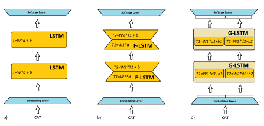
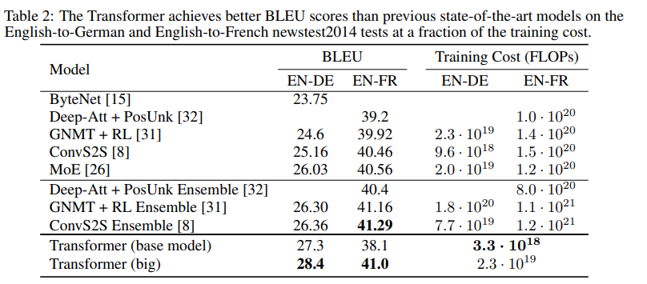
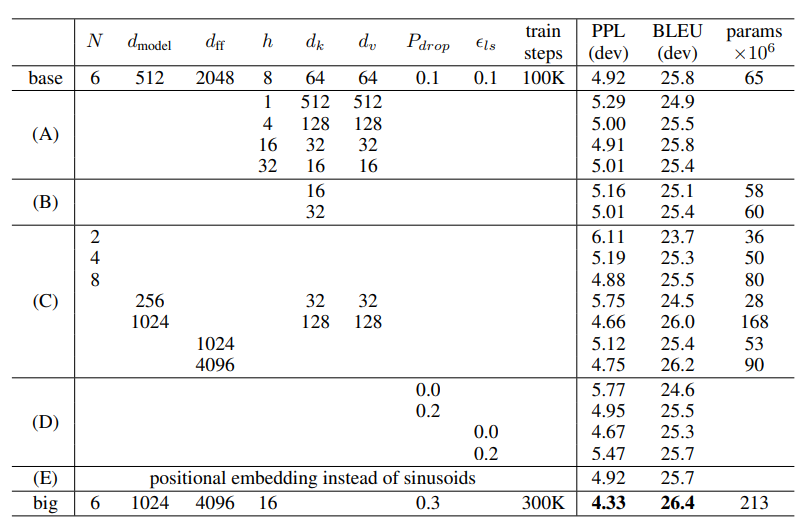
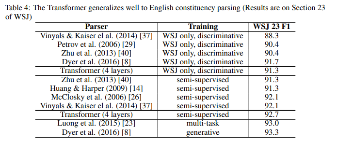

# Attention Is all You Need [KOR\]

##  1. Problem definition

* Long-term dependency

이전까지 Sequence data를 처리하기 위해서는 Recurrent Model을 이용해 **outputt** 을 위해 **inputt** 와 **hiddent-1** 를 사용한다. 

이런 특징 때문에 Sequence의 거리가 멀게 되면 그 정보를 이용하지 못하게 되는 long-term dependency 문제가 존재한다. (vanishing gradient)

## 2. Motivation

Recurrent Model에서 factorization trick과 conditinoal computation은 성능 향상을 이루었으나 여전히 순서대로 학습해야 한다는 한계점을 지닌다.

### Related work

#### 1) Attention Mechanism

**x1, ... , xn** 을 input sequence, **y1, ... , yn** 을 output sequence, **(h1, h2, ... , hn)** 을 입력 시퀀스 hidden vector라고 합시다. Decoder의 i 번째 hidden state를 **si** 라 하면, 다음과 같이 계산 된다.

   
  si-1 : i-1번째 hidden state. 
  yi-1 : i-1번째 output word. 
  ci : decoder의 time step i와 연관된 문맥 벡터. 
  ci 는 i 번째 decoding time step과 관련된 정보를 갖고 있다. 

 각 hidden vector **hj** 에 대해서 **j** th input과 **i** th output의 관계를 **ei,j** 라 하면,

 
 a : 실수상의 함수

모든 **hj** 에 대해 계산해 얻은 **ei,1, ... , ei,n** 에 대해 softmax 레이어를 통해 정규화 해주면  가 되고 이를 attention vector라 부른다.
 이를 이용해 **ci** 를 다음 수식으로 계산할 수 있다.
 

  

#### 2) Factorization Trick

기존에 LSTM의 연산 시간을 단축 시키기 위해서 첫 번째 방법인 인수 분해 LSTM(F-LSTM)은 두 개의 작은 행렬의 곱을 사용하여 큰 LSTM 행렬을 근사화한다. 두 번째 방법인 그룹 LSTM(G-LSTM)은 LSTM 셀을 독립적인 그룹으로 분할한다.

  

* Oleksii Kuchaiev and Boris Ginsburg. Factorization tricks for LSTM networks. arXiv preprint arXiv:1703.10722, 2017.

#### 3) Conditional Computation

연산을 증가시키지 않고 모델 용량을 크게 늘리는 방법. 

* Noam Shazeer, Azalia Mirhoseini, Krzysztof Maziarz, Andy Davis, Quoc Le, Geoffrey Hinton, and Jeff Dean. Outrageously large neural networks: The sparsely-gated mixture-of-experts layer. arXiv preprint arXiv:1701.06538, 2017.

### Idea

Recurrence 대신 Transformer는 Attention mechansim을 사용해 input과 output의 dependency를 찾아낸다.

순서대로 학습해야 하는 Recurrent Model 대신 Transfomer에서는 Encoder에서는 각각의 Position에 대해 Attention을 해주기만 하고, Decoder에서는 Masking을 이용해 Parallel로 처리 가능하게 된다.

## 3. Method

### 3.1 Encoder and Decoder Stacks

Encoder : 인코더는 **N=6**개의 레이어로 이루어지고, 각 레이어는 2개의 Sub-layer를 가진다. 첫 번째 sub-layer는 **multi-head self-attention 매커니즘**, 두 번째는 **position-wise fully connected feed-forward network**이다. 각 두개의 서브레이어 뒤에는 residual connection과 layer normalization을 추가한다.

  

Decoder : 디코더도 마찬가지로 **N=6** 개의 레이어로 이루어져있다. 인코더와 동일한 2개의 Sub-layer와 추가로 세 번째 Sub-layer를 갖는다. 인코더와 마찬가지로 각 Sub-layer의 output에 *residual connection*과 *layer normalizeation*이 추가 된다. self-attention Sub-layer에는 position **i** 에 대한 예측이 **i** 이전에 이미 계산된 출력값에 만 의존하도록 마스킹을 통해 변형했다.

### 3.2 Attention

어텐션은 input을 쿼리, Key-Value 쌍으로 부터 output을 내는 함수다. 각 input과 output은 vector들이고,  출력값은 value의 weight-sum인데, weight는 쿼리와 키의 compatibility로 계산된다.

#### 3.2.1 Scaled Dot-Product Attention

  

**Q** :  쿼리 , **K** : 키 , **V** :밸류 , **dk** : key와 쿼리의 dimension

쿼리와 모든 키의 내적값에 각각을 로 나눈 후 softmax를 적용한 것이 Scaled Dot-Product Attention이다. 가장 보편적으로 쓰이는 어텐션 함수로는 additive attention과 dot-product(multiplicative) attention이 있다. dot-products의 값이 커질수록 softmax 함수에서의 기울기의 변화가 거의 없는 부분으로 가기 때문에 Scaled Dot-Product Attention은 dot-product에 를 곱해 Scaling을 해준다. 

softmax이후의 값을 value에 곱해준다면, 쿼리와 유사한 값일 수록 더 높은 값을 가지게 된다. 중요한 정보에 더 관심을 둔다는 말에 맞게 된다.

#### 3.2.2 Multi-Head Attention

Multi-head attentino은 서로 다른 위치에서 정보를 얻을 수 있으며, 하나의 Attention head를 가졌을 때는, 마지막에 평균을 취해주어 해결한다.

   
   
   

#### 3.2.3. Applications of Attention in out Model

Transformer는 multi-head attention을 3가지 방법으로 사용한다.

* **encoder**
  - encoder는 self-attetion 레이어를 포함한다.
  - self-attention 레이어에서 key, value, query는 모두 encoder의 이전 레이어에서 온다.
  - encoder의 각 지점은 이전 레이어의 모든 정보를 참고할 수 있게 된다.
* **decoder**
  * decoder는 self-attetion 레이어를 포함한다.
  * decoder의 auto-regressive한 성질을 유지하기 위해, **i** th postion의 attention을 얻을 때 **i** th 이후의 모든 position은 softmax의 input 값을 로 마스킹해 제한하였다.
* **encoder-decoder-attention**
  * query는 decoder에서의 값을 보고 output을 추측하는 역할이기에 decoder에서 온다.
  * key, value는 encoder의 output에서 온다.
  * 이러한 구조로 decoder의 모든 position에서 encoder ouptut의 모든position에 attention을 줄 수 있게 된다.

### 3.3 Position-wise Feed-Forward Networks

Sub-layer에서 존재했던 layer는 **attention Sub-layer** 말고도 **position-wise fully connected feed-forward network**가 존재한다.

  

position마다 적용되기 때문에 position-wise이고, **x** 에 Linear Trasformation을 적용하고 **ReLU(max(0, z))** 를 적용한 후에 한번더 Linear Transformation을 적용한다. Kernel size가 1이고 channel이 layer인 두 개의 conv으로도 생각 할 수 있다.

### 3.4 Positional Encoding

현재의 Model은 Recurrence이나 Convolution을 포함 하고 있지 않기 때문에 Sequence임을 이용하기 위해서는 position 정보가 추가로 필요하다. 이를 위해서 encoder와 decoder의 input embedding에 *positional encoding*을 추가해 준다. *positional encoding*은 embedding vector와 같은 **dmodel** dimension을 가지고, 이 논문에서는 frequency를 가지는 **sin**, **cos**함수를 활용했다.

   
   

**pos** 는 Sequnece에서 토큰의 위치, **i**는 차원이다.

**k=2i+1** 일때는 **cosine** 함수를 **k=2i**일때는 **sine**함수를 이용해 같은 column이여도 **pos**가 다르면 다른 값을 가지게 된다.

라 하면, **PE**는 다음과 같이 정리 할 수 있다.

   
  

   
   

이러한 성질 때문에 model이 relative position에 의해 attention을 하는 것을 더 쉽게 training할 수 있다.

## 4. Experiment & Result

### 4.1 Experimental setup

#### 4.1.1 Training Data and Batching

* WMT 2014 English-German dataset
  * 450만개의 문장 pair
  * byte-pair 인코딩
  * 37000 토큰
* WMT 2014 English-French dataset
  * 3600만개의 문장 pair
  * word-piece
  * 32000 토큰

문장 pair은 대략적인 sequence 길이로 배치화했다. 각 training batch에는 25000개의 source token과 25000 target token을 포함하는 문장 pair을 갖고있다.

#### 4.1.2 Hardware and Schedule

* 8개의 NVIDIA P100 GPU
* base model = (step time) 0.4sec * 100,000 steps = 12hours
* big model = (step time) 1.0sec * 300,000 steps = 3.5 days

#### 4.1.3 Optimizer
Adam optimizer을 사용했다. ()

   
  

#### 4.1.4 Regulariztion

* **Residual Dropout** **Pdrop** =0.3
  * Sub-layer의 output이 더해지고 Normalization 이전에 dropout 적용.
  * encoder, decoder stack에서 임베딩과 positional encoding이 더해진 결과에 dropout 적용.
* Label smoothing $$

### 4.2 Result

#### 4.2.1 Machine Translation

*WMT 2014 English-to-German* 번역 Task에서 Transformer(Big) Model은 이전에 가장 높은 점수를 낸 ConvS2S Ensemble 보다 2.0 더 높게 28.4 BLEU를 받았다. Base 몬델에서도 더 적은 cost로 모든 모델보다 향상되었다.

*WMT 2014 English-to-Franch* 번역 Task에서는 다른 모델보다 더 적은 Training Cost로 상위의 BLEU를 받았다.

10분단위로 checkpoint를 저장하여 Base 모델은 5개의 checkpoint을 평균내 사용하고, Big 모델은 20개의 checkpoint의 평균을 사용했다.

#### 4.2.2 Model Variations

Trnasformer Model에서 가지는 요소들의 중요성을 평가하기 위해 Base 모델을 바꿔가며 성능을 측정했다. 

(A)는 연산 수는 그대로 두고 어텐션 헤드의 개수와 어텐션 Key, Value의 Dimesion을 바꾸어 가며 실험한 결과이다. single head attention의 성능은 최대 점수보다 떨어지고 head의 수가 너무 많아져도 performance가 떨어진다.

(B)는 Attention Key의 Dimension이 감소할 때 모델의 성능이 낮아진다. 이로부터 적합성을 판단하는데 내적보다 더 좋은 방법이 있을 수 있다는 추측을 했다.

(C), (D)에서 더 큰 모델이 나으며 drop out이 overfitting을 잘 막아주었다.

(E)에서는 Positional Encoding의 **sin, cos** 함수를 학습된 Positional embedding으로 바꾸어 주어도 성능 차이가 없었다.

#### 4.2.3 English Constituency Parsing

Transformer를 일반화해 다른 Task에도 적용할 수 있는지 보기 위해 Englsh Constituency Parsing을 진행했다. Output은 강한 구조적 제약을 따라야하고 input보다 길어야해 어렵다. RNN sequence-tosequence Modle은 small data에서 SOTA의 결과를 못 냈다.

Penn Treebank에서 Wall Street Journal (WSJ)에 해당하는 40K의 문장을 가지고 **dmodel=1024**, 4-layer transformer를 학습시켰다(16K token). 17M개의 high-confidnece dataset과 BerkleyParser을 가지고 semi-supervised 학습도 진행했다(32K token). 튜닝하는 과정이 부족했어도 Model의 performance가 높음을 확인 할 수 있었다.

## 5. Conclusion

Attention만을 이용한 첫 번째 sequence transduction model인 Transformer를 소개했다. 기존에 흔히 쓰이던 Recurrent Layer를 활용한 Encoder-Decoder 구조를 대체 가능 할 것으로 보인다.

번역 Task에서 Recurrent나 Convolution 구조보다 더 빠르게 학습 할 수 있었고, SOTA또한 달성했다.

### Take home message \(오늘의 교훈\)

> 구조적인 문제 때문에 생기는 단점을 보완하는 것 보다 구조적인 문제를 없애는 방법이 나을 수 있다.

## Author / Reviewer information

### Author

**김현 \(Kim Hyun\)** 

* KAIST ISysE
* hyun970408@kaist.ac.kr

### Reviewer

1. Korean name \(English name\): Affiliation / Contact information
2. Korean name \(English name\): Affiliation / Contact information
3. ...

## Reference & Additional materials

1. https://arxiv.org/pdf/1706.03762.pdf
2. Sepp Hochreiter and Jürgen Schmidhuber. Long short-term memory. Neural computation, 9(8):1735–1780, 1997.
3. Oleksii Kuchaiev and Boris Ginsburg. Factorization tricks for LSTM networks. arXiv preprint arXiv:1703.10722, 2017.
4. Noam Shazeer, Azalia Mirhoseini, Krzysztof Maziarz, Andy Davis, Quoc Le, Geoffrey Hinton, and Jeff Dean. Outrageously large neural networks: The sparsely-gated mixture-of-experts layer. arXiv preprint arXiv:1701.06538, 2017.
