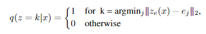

# Neural Discrete Representation Learning [ENG]

한국어로 쓰인 리뷰를 읽으려면 [**여기**](./nips-2017-vq-vae-kor.md)를 누르세요.

## **1. Problem definition**

The Gerative Model is making impressive achievements in many domains such as image, audio, and video. One of the popular models of the Generative model is the Variological Auto Encoder (VAE)[1], which is a model that maps data to a latent space and generates new data from the mapped latent vector. Standard VAEs use latent vectors that follow a Gaussian distribution to predict the latency space, approximating the mean and variance of the distribution. From the latent space trained in this way, new data is able to be generated, which was not exist before.

## **2. Motivation**

Latent vectors of standard VAEs have continuous values. In other words, there is an infinite case of latent vectors can be sampled, which means that it is hard to train such an infinite size of late space. Why is it hard? This is because predicting how data should be mapped in infinite space, especially the mean and variance of the latent space's distribution, is impossible to expect , in a word, non-controllable. 

The motivation of the VQ-VAE starts here. Wouldn't it be easier and more efficient to learn data if the model is trained with a limited size of latent space, rather than an infinite space? If we can limit the number of cases of latent vectors, why don't we construct a discrete latent space?

### **Related works**

There was several trials to train VAE with a discrete latent space before. 

*e.g. NVIL estimator[2], VIMCO[3]* 

However, these approaches could not reach to the performance of original continuous latent VAEs. Also, they were experimented and evaluated with simple datasets such as MNIST, and the depth of the models were shallow as well.

### **Idea**

The idea of VQ-VAE is to construct a discrete space by adding a process of training a finite number of vectors that can be replaced from the result values calculated by the encoder.

1. First, create a random discrete space. 
2. Train the space to map output values of encoder.

This can be said as adding a non-linear layer, which maps the distribution of infinite space to the finite number of vectors, between the encoder and decoder of the VAE.

## **3. Method**

### **Discrete Latent Space**

Then, how should the discrete latency space be constructed? The paper first constructed the discrete late space by randomly generating the embedding space with the dimension (K, D), which inculding the number of K latent vectors that have the embedding dimension size of D. After that, the space is trained to reflect the output of the encoder in proper way. The output of the encoder is now replaced by the vector of the closest one with the output in the embedding space. The posterior distribution, which is followed by encoder's output, is defined as follows.

In this definition, *z_e(x)* means the encoder output and *e* means the embedding space.

Notice that, by adding this process, the posterior distribution from encoder becomes deterministic(Because uniform prior is definited for latent z).

Finally, The input of decoder *z_e(x)* is replaced as follows.

### **Model Architecture**

#### Forward

1. The continuous latent vector is obtained from input data through the encoder.

2. Replace the vector that is most similar to the obtained continuous latent vector from the codebook(discrete embedding space) including K latent embedding vectors of D dimension.

   Why do we do this? (Reminder)

   - The results that could come out from the standard continuous VAEs were infinite, but, by adding this step, the number of latent vectors becomes discrete, finite. Therefore, the author's hypothesis is that training will be more controllable.
   - As this step is added, the training parameters become encoder, decoder, and embedding space E.

3. Data is generated from the selected discrete latent vector through Decoder.

#### Backward

- Loss = reconstruction loss + Vector Quantisation(VQ) +commitment loss
  - reconstruction loss: same as the reconstruction loss of the standard VAE. It used for encoder and decoder.
  - VQ loss (=codebook loss): loss value for embedding space(discrete latent space). It is L2 error between embedding space and encoder output, so that the embedding space is trained to approximate the encoder output's space.
  - commiment loss: the embedding space is, not like encoder and decoder, 2 dimension(dimensionless). Therefore, the training speed is significantly different from the encoder/decoder. To prevent encoder output from increasing rapidly under the influence of embedding space loss, the author added commiment loss as the third term.
  
- Because the backpropagating in the forward step 2, 'Choose the vector closest to the obtained late vector from the embedding space', is not differentiable, the author just copies the gradient value of the decoder to the encoder as a simple trick.

  > We approximate the gradient similar to the straight-through estimator and just copy gradients from decoder input zq(x) to encoder output ze(x).
  
  

## **4. Experiment & Result**

### **Experimental setup**

The paper uses the architecture of standard VAEs, but with only changing of the latent space capacity, in order to compare the models of previous models such as VAE, VIMCO and VQ-VAE.

- Encoder consists of 2 Conv2d(kerner_size=(4, 4), stride=2) layers and 2 residual connections. Each layers has 256 dimension.
- Decoder as same as encoder except for using transposed CNN.

### **Result**

- Through the experiments, the author obtained the results of 4.51 bits/dim for the standard VAE, 4.67 bits/dim for the VQ-VAE, and 5.14 bits/dim for the VIMCO(bits per dimension is a NLL loss value divided by a dimension).

    > Compute the negative log likelihood in base e, apply change of base for converting log base e to log base 2, then divide by the number of pixels (e.g. 3072 pixels for a 32x32 rgb image).

- Although it could not meet the performance of the VIMCO model, it is still the first **discrete VAE model which achieves same performance to the standard continuous VAE model.**

- The experiments are performed in three domains of Images, Audio, and Video as well. Among the results of each, the result from the audio domain is interesting. Regarding Audio input, it is expected that the reconstruction process would be difficult because the dimension of the latent vector is 64 times reduced. However, as a result, it was confirmed that the model reconstructs the audio's content (e.g. saying words or semantics like 'hello'), instead reconstruct the audio's features (voice, tone, high sound and low sound). For this reason, the author argues that VQ-VAE not only separates the high-dimensional and low-dimensional features of sound well, but also encodes the high-dimensional features among them.
  
    > The VQ-VAE has learned a high-level abstract space that is invariant to low-level features and only encodes the content of the speech.
    
    

## **5. Conclusion**

VQ-VAE becomes one of the popular models that applied discrete latent space to VAE. It is worth that it has achieved almost the same performance as the standard continuous VAE, and above all, in my personal opinion, it will be useful for practical tasks in terms of efficiency and stability.

**Summary**

- Discrete Latent Space was implemented through discrete Codebook (=Embedding Space).
- For the first time as a Discrete VAE model, the result close to continuous VAEs performance are obtained.
- Actual application of VQ-VAE to various domains and confirmation of clear achievement. In particular, results obtained in encoding only high-level audio features for the audio data.

### **Take home message (오늘의 교훈)**

> If the discrete latent Space of the VAE model can be trained appropriately, the performance is similar to the standard VAEs, while at the same time benefiting from the aspect of training efficiency.

## **Author / Reviewer information**

### **Author**

**정윤진 (Yoonjin Chung)**

- Master Student, Graduate School of AI, KAIST
- yoonjin.chung@kaist.ac.kr

### **Reviewer**

- 윤강훈 
- 장태영 
- 이현지 

## **Reference & Additional materials**

[1] Kingma, Diederik P and Welling, Max. Auto-Encoding Variational Bayes. In The 2nd International Conference on Learning Representations (ICLR), 2013.

[2] Andriy Mnih and Karol Gregor. Neural variational inference and learning in belief networks. arXiv preprint arXiv:1402.0030, 2014

[3] Andriy Mnih and Danilo Jimenez Rezende. Variational inference for monte carlo objectives. CoRR, abs/1602.06725, 2016.

