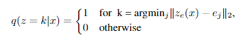
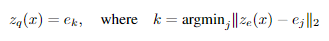
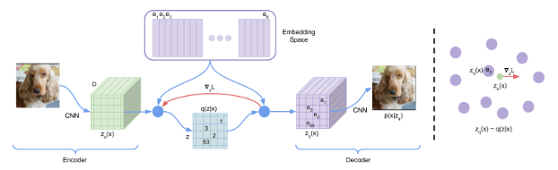
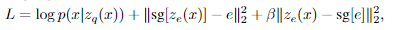
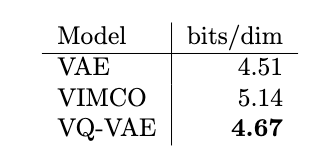

---

description: Aaron van den Oord et al. / Neural Discrete Representation Learning / NIPS 2017

---

# Neural Discrete Representation Learning [KOR]

[**English version**](./nips-2017-vq-vae-eng.md) of this article is available.

## **1. Problem definition**

오늘날 Generative Model은 image, audio, video 등 많은 분야에서 인상적인 성과를 내고 있다. Generative model의 대표 모델 중 하나라고 할 수 있는 것이 바로 Variational Auto Encoder(VAE)[1]이다. VAE는 data를 어떠한 latent space에 매핑하고, 매핑된 latent vector를 통해 새로운 데이터를 생성하는 모델이다. 기존 VAE는 latent vector가 Gaussian distribution을 따르도록 하고, 해당 distribution의 평균과 분산을 예측함으로써 laten space를 예측하게된다. 이렇게 구성된 latent space로부터, 우리는 존재하지 않았던 새로운 데이터를 생성할 수 있었다.

## **2. Motivation**

VAE의 latent vector들은 continous한 값을 가진다. 다시 말해 샘플링 할 수 있는 latent 벡터의 경우의 수가 무한하다는 것이다. 이렇게 무한한 크기의 latent space에 대해 모델을 학습하는것은 매우 어렵고 비효율적이다. 데이터가 무한한 space의 어떻게 매핑될 지 예측하기 어려울 뿐더러 특히 매핑된 vector들의 평균과 분산을 제어하기 어렵기 때문이다. VQ-VAE의 모티베이션은 바로 여기에서 출발한다. 만약 모델을 무한한 공간의 latent space가 아닌, 제한된 크기의(discrete) latent space에 대해 학습시킨다면, 데이터를 더 쉽고 효율적으로 학습할 수 있지 않을까? latent vector가 가질 수 있는 경우의 수와 그 값을 제한하면, 즉, 다시말해 discrete latent space를 학습시키고 그로부터 데이터를 생성해보면 어떨까?

### **Related works**

이전에도 Discrete latent VAE 를 학습하고자 하는 시도는 몇 있었다.

 *e.g. NVIL estimator[2], VIMCO[3]* 

하지만 위 방법들은 모두 기존 Gaussian 분포를 따르는 continuous latent VAE 모델의 성능을 따라잡지 못했다. 게다가 위 방법들은 MNIST와 같은 매우 작은 데이터셋으로 실험되거나 평가되었으며, 그 모델의 깊이 역시 매우 작았다.

### **Idea**

VQ-VAE의 아이디어는 encoder에서 계산한 latent vector를 치환될 수 있는 유한한 개수의 벡터들을 학습 시킴으로써 discrete latent space를 구성하겠다는 것이다. 좀 더 쉽게 말하자면 1. 우선 랜덤한 discrete latent space를 생성한다. 2. 그리고 이것을 encoder output 과 잘 맵핑되게끔 학습시킨다.

한마디로, **무한한 공간의 distribution을 유한한 공간의 distribution으로 맵핑하는 non-linear layer를 VAE의 encoder와 decoder 사이에 추가**하겠다는 것이 VQ-VAE의 아이디어이다.

## **3. Method**

### **Discrete Latent Space**

그렇다면 discrete latent space는 어떻게 구성해야 할까? 논문은 (K, D) 차원의 embedding space를 랜덤으로 생성하고 이 space가 encoder의 output을 잘 반영하게끔 학습시킴으로써 discrete latent space를 구성했다. 이제 encoder의 output 은 embedding space 중 자신과 가장 가까운 벡터로 대체되어 decoder에 전달된다. encoder 아웃풋인 posterior distribution은 다음과 같이 정의된다.

위 식에서 z_e(x) 는 encoder output을, e는 embedding space를 의미한다.

여기서 한가지 알아둘 것은, 이로 인해 posterior 분포가 deterministic 해진다는 것이다(latent z에 대해 uniform prior를 정의했으므로).

decoder에 전달될 z_e(x) 는 최종적으로 다음과 같이 대체된다.

### **Model Architecture**

#### Forward

1. Encoder 를 통해 input data 로부터 latent vector를 얻는다.

2. D 차원을 가진 K개의 latent embedding vector 중 얻은 latent vector와 가장 유사한 벡터를 고른다.
  
    이렇게 하는 이유는?(Reminder)
    
    - 기존 continuous 하던 latent vector는 나올 수 있는 결과가 무한했지만, 위와 같이 설계하면 가질 수 있는 latent vector의 경우의 수가 discrete, 유한해진다. 따라서 학습이 보다 controllable 해질 것이라는 게 저자의 가설이다.
    - 이 스텝이 추가됨에 따라 학습되어야 하는 파라미터들은 encoder, decoder, 그리고 embedding space E 가 된다 .
    
3. Decoder를 통해 고른 discrete latent vector로부터 data를 생성한다.

***

#### Backward

- Loss = reconstruction loss + Vector Quantisation(VQ) +commitment loss
    - reconstruction loss: 기존 vae의 그 reconstruction loss와 같다. encoder와 decoder 학습에 영향을 준다.
    - VQ loss(=codebook loss): discrete latent space, 즉 embedding space 학습을 위한 loss 값. embedding space와 encoder output 간의 L2에러로, 이를 통해 embedding은 encoder output과 가까워지도록 학습된다.
    - commiment loss: embedding space는 encoder/decoder와 달리 2차원이다(dimensionless). 따라서 encoder/decoder 파라미터와 학습 속도가 현저히 차이날 수 밖에 없다. encoder output이 embedding space 학습에 영향을 받아 빠르게 증가/발산 하는 것을 방지하기 위해, 저자는 commitment loss를 세번째 항으로 추가했다.
- 위 Loss 값을 backpropagation 할 때, Forward step 2번 '얻은 latent vector와 가장 가까운 vector를 embedding space로 부터 고른다' 라는 연산에 대해서는 gradient 값을 흘릴 수 없기 때문에(미분 불가능), 저자는 decoder input의 gradient의 값을 encoder output 값으로 단순 복사하는 트릭을 사용했다.
  
    > we approximate the gradient similar to the straight-through estimator and just copy gradients from decoder input zq(x) to encoder output ze(x).

## **4. Experiment & Result**

### **Experimental setup**

논문은 가장 먼저 기존 continuous VAE 모델, VIMCO 모델, 그리고 논문의 VQ-VAE 모델을 비교하기 위해, architecture는 기존 standard VAE 모델의 구조를 그대로 가져가되, latent capacity 만을 변경하여 학습을 진행했다.

- encoder는 2개의 Conv2d(kerner_size=(4, 4), stride=2) 로 이루어져 있으며 두개의 residual connection을 가진다. 모든 레이어는 256 차원을 가진다.
- decoder는 transposed CNN을 사용한다는 것 제외 encoder와 모두 동일한 구조이다.

### **Result**

- 앞선 실험을 통해 저자는 VAE, VQ-VAE 및 VIMCO 모델은 각각 4.51bits/dim, 4.67bits/dim 그리고 5.14 bits/dim 의 결과를 얻었다. (bits per dimension, 이는 NLL loss를 dimension으로 나누어준 값이다.)

    > Compute the negative log likelihood in base e, apply change of base for converting log base e to log base 2, then divide by the number of pixels (e.g. 3072 pixels for a 32x32 rgb image).

- 비록 VIMCO 모델의 성능에 까지는 미치지 못했지만, 그래도 **discrete latent VAE 모델로서는 처음으로 continuous VAE 모델과 유사한 성능을 얻어냈다**는 점에서 이 논문에 novelty가 있다.

- 논문은 Images, Audio, Video 3가지의 도메인에 대해 모델을 실험하고 결과를 보였다. 모두 기존 VAE만큼 좋은 성과를 보였으나, 그 중 Audio 도메인에 대한 결과가 흥미롭다. 저자는 Audio input에 대해서 latent vector의 차원이 64배나 줄어드므로 reconstruction 과정이 상대적으로 힘들 것이라 예상하였다. 그러나 결과적으로는 모델이 audio의 content(발성한 단어나 그 의미 등 e.g. '테스트', '안녕')들을 아주 잘 reconstruction 하는 대신, audio의 feature(발성, 음색, 음역대 등 e.g. 목소리 톤, 소리 높낮이)들만 조금씩 변형시키는 것을 확인할 수 있었다. 이로 인해 저자는 VQ-VAE 가 소리의 고차원적 특징과 저차원적 특징을 잘 분리하여 학습할 뿐 아니라 그 중 고차원적 특징을 주로 encoding 하고 있다고 주장한다.
  
    > The VQ-VAE has learned a high-level abstract space that is invariant to low-level features and only encodes the content of the speech.

## **5. Conclusion**

VQ-VAE 는 VAE에 discrete latent space를 적용한 대표적인 모델 중 하나다. 기존 VAE와 거의 동일한 성능을 얻었다는 점에서 주목할 만하기도 하고, 무엇보다 개인적인 의견으로는 학습 효율이나 안정성 측면에서 실제 테스크에 사용될 때 메리트가 있을 것이라 생각한다.

**요약**

- Discrete latent space 를 Codebook(=Embedding space) 을 통해 구현하였고 VAE에 적용.
- Discrete latent VAE model 로서는 처음으로 continuous VAEs 성능에 가까운 결과를 얻어냄.
- VQ-VAE를 다양한 도메인에 실제 적용해보고 뚜렷한 성취를 확인. 특히 오디오 도메인에서 high-level audio feature들만 인코딩되는 결과를 얻어냄.

### **Take home message (오늘의 교훈)**

> VAE 모델의 Latent Space를 discrete 한 뒤 그것을 잘 학습한다면 충분한 성능을 얻을 수 있으며, 동시에 학습 효율적 측면에서 이점을 얻을 수 있다.

## **Author / Reviewer information**

### **Author**

**정윤진 (Yoonjin Chung)**

- Master Student, Graduate School of AI, KAIST

### **Reviewer**

- 윤강훈
- 장태영
- 이현지

## **Reference & Additional materials**

[1] Kingma, Diederik P and Welling, Max. Auto-Encoding Variational Bayes. In The 2nd International Conference on Learning Representations (ICLR), 2013.

[2] Andriy Mnih and Karol Gregor. Neural variational inference and learning in belief networks. arXiv preprint arXiv:1402.0030, 2014

[3] Andriy Mnih and Danilo Jimenez Rezende. Variational inference for monte carlo objectives. CoRR, abs/1602.06725, 2016.
