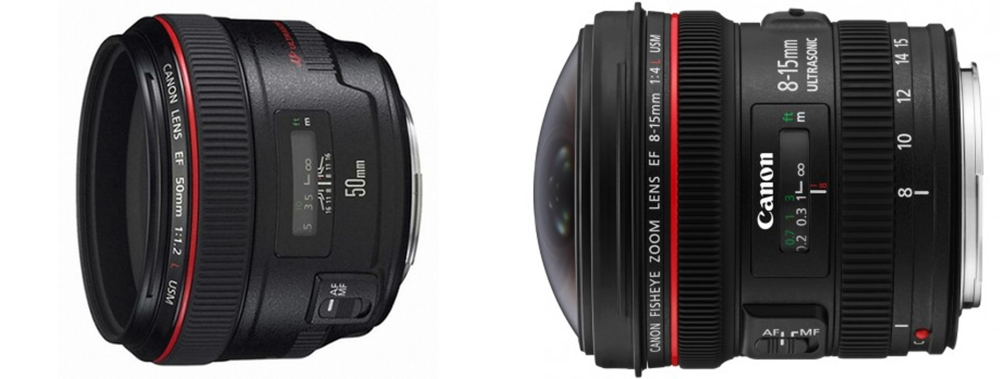

---
Yang et al. / Progressively Complementary Network for Fisheye Image Rectification Using Appearance Flow / 2021 CVPR Oral
---

# Progressively Complementary Network for Fisheye Image Rectification Using Appearance Flow [Kor]

##  1. Problem definition

여러분은 어안 렌즈(fisheye lens)에 대해 들어보셨나요? 어안 렌즈는 카메라에 들어가는 렌즈의 종류중 하나인데요. 일반 카메라와 달리 렌즈가 뭉툭하게 튀어나온 것을 볼 수 있어요. 다른 말로 초광각 렌즈라고도 알려져 있습니다.

왜 어안 렌즈라고 부를까요?

일반적으로 물고기의 눈은 사람에 비해 넓은 시야각을 가지고 있다고 합니다. 인간의 두 눈의 시야각은 약 140도 정도인 반면, 물고기의 눈은 180도 정도의 시야각을 가진다고 하는데요.

마찬가지로 어안 렌즈 또한 일반 광각 렌즈에 비해 더 넓은 시야각을 가지고 이미지를 촬영할 수 있습니다. 이러한 이유로 어안(fisheye)란 이름이 붙었다고 해요. 표준 렌즈가 약 110도의 화각을 가지는데 비해, 어안 렌즈는 180도의 화각을 가지는데, 이를 위해 직선 보정을 포기하고, 렌즈의 곡면형태를 그대로 유지하는 특성을 가지고 있습니다.

위의 이미지는 어안 렌즈로 촬영된 이미지입니다. 이미지의 중심축을 기준으로 물체들이 미묘하게 휘어져있는게 보이시나요?

어안 렌즈는 그 특성 덕분에 넓은 화각을 가질 수 있지만, 이로 인해 이미지의 가장자리에 존재하는 물체들이 곡선의 형태로 휘어지는 왜곡이 발생하게 됩니다. 이러한 왜곡을 어안 왜곡(fisheye distortion)이라고 부르는데요. 이러한 왜곡은 볼록

## 2. Motivation

In this section, you need to cover the motivation of the paper including _related work_ and _main idea_ of the paper.

### Related work

Please introduce related work of this paper. Here, you need to list up or summarize strength and weakness of each work.

### Idea

After you introduce related work, please illustrate the main idea of the paper. It would be great if you describe the idea by comparing or analyzing the drawbacks of the previous work.

## 3. Method


If you are writing **Author's note**, please share your know-how \(e.g., implementation details\)


The proposed method of the paper will be depicted in this section.

Please note that you can attach image files \(see Figure 1\).  
When you upload image files, please read [How to contribute?](../../how-to-contribute.md#image-file-upload) section.

## 4. Experiment & Result


If you are writing **Author's note**, please share your know-how \(e.g., implementation details\)


This section should cover experimental setup and results.  
Please focus on how the authors of paper demonstrated the superiority / effectiveness of the proposed method.

Note that you can attach tables and images, but you don't need to deliver all materials included in the original paper.

### Experimental setup

This section should contain:

* Dataset
* Baselines
* Training setup
* Evaluation metric
* ...

### Result

Please summarize and interpret the experimental result in this subsection.

## 5. Conclusion

In conclusion, please sum up this article.  
You can summarize the contribution of the paper, list-up strength and limitation, or freely tell your opinion about the paper.

### Take home message \(오늘의 교훈\)

Please provide one-line \(or 2~3 lines\) message, which we can learn from this paper.

> All men are mortal.
>
> Socrates is a man.
>
> Therefore, Socrates is mortal.

## Author / Reviewer information


You don't need to provide the reviewer information at the draft submission stage.


### Author

**Korean Name \(English name\)** 

* Affiliation \(KAIST AI / NAVER\)
* \(optional\) 1~2 line self-introduction
* Contact information \(Personal webpage, GitHub, LinkedIn, ...\)
* **...**

### Reviewer

1. Korean name \(English name\): Affiliation / Contact information
2. Korean name \(English name\): Affiliation / Contact information
3. ...

## Reference & Additional materials

1. Citation of this paper
2. Official \(unofficial\) GitHub repository
3. Citation of related work
4. Other useful materials
5. https://m.blog.naver.com/PostView.naver?isHttpsRedirect=true&blogId=sinachoco&logNo=221103182738
6. https://blog.daum.net/kim1951a/1155
7. https://darkpgmr.tistory.com/31
