# PlaNet and image geolocation \[English\]

##  1. Problem definition

You probably have heard of the widely known game « Geoguessr ». If not the idea is simple, the player has to find the exact location of a scene (taken from street view), just by looking at visual cues in the image. Players can get really good at the exercise, looking for architecture style, plant species or written clues, and some are able to pin point the exact location, close to the meter, of some specific images.

For anyone interested a little bit in computer science, and most specifically computer vision, a question come directly in mind: «How good a computer can be at « Gueoguesser » ? We will talk about different methods that have been used to solve this task, we will then explain and discuss the PlaNet model, which serve as «benchmark» in the field and has been one of the first paper reasearching deep neural network to solve this problem and then we will see different ideas that have been used to improve the accuracy.

## 2. Motivation

### Related work

#### IM2GPS/Data driven method

Before the use of convolutional neural networks (CNN) for image processing and analysis, researchers used data driven model. One of the famous model used to solve this task in this way was (1) « IM2GPS ».

IM2GPS extract features from the image and then used a KNN model to match the prediction with some of the 6 million images stores in the model. Some of the features extracted are: Tiny Images (color image space) , Color histograms, Texton Histograms (texture features) , Line Features, Gist Descriptor + Color and Geometric Context.

Then they used a KNN approached and matched the GPS coordinates of the first nearest neighbor.

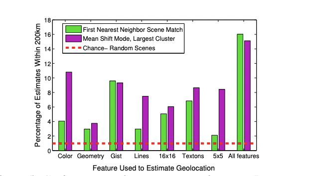

IM2GPS is able to give the localization of 16% of the test images in a range of 200km, which is 18 times better than random guesses. At the times, these results show that computer could be somehow accurate for this kind of task.

IM2GPS is highly dependent on the number of images available and could get some better results with more datas, even close to perfect if composed of photos from every streetw and angles on the planet. At the moment, most of the developed technics are using large amount of datas to train deep learning models, but by focusing on image gathering and big data optimisation, there are good chances that some variant of this approach could nowadays be more competitive.

### Idea

#### Planet/ Deep learning and Convolutional network: a Classification problem

One of the main advantages of classification over classical regression on longitude/latitude is the possibility to output a probability distribution over the whole world.

By using Google’s open source S2 geometry library, the authors can produce a none overlapping partitioning of the planet. By projecting the sphere into a cube and then subdivided the six sides hierarchically by quad-trees where each node in the tree corresponds to a cell. But each parts of the world aren’t represented in the same manner in the photo dataset, and to prevent having important imbalance classes, they perform what they called « Adaptive Partitioning», based on distribution of localisation in the dataset: starting at the roots, they recursively descend the tree till each cells contained no more than a threshold number of photos and discard the regions where the number of photos is below another threshold. In the end, the size of each cell is correlated to the likelihood of a photo being taken in this area.

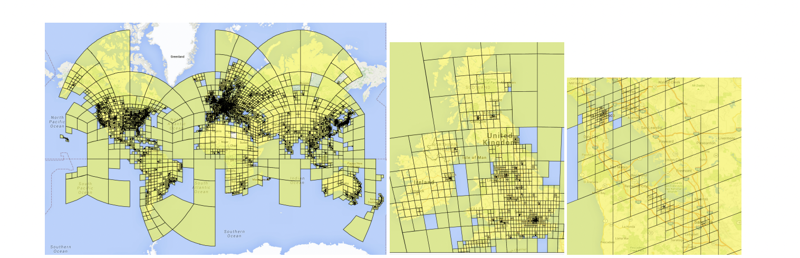

## 3. Method

The architecture used is based on the Inception architecture. Developed by Google in 2014, Inception v3 is build on a succession of inception module.

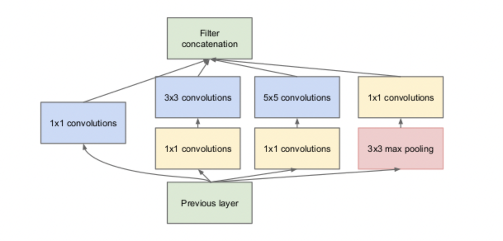

The Inception architecture has been designed by Google researchers to permit the training of deeper models. The two mains characteristics of this model are the used of multiple convolution operations with different kernel size operating in a parallel manner at each layer, and the used of 1x1 convolution. The used of different kernel sizes give to the model the opportunity to choose at each layer the importance of each kernel size. The model can "learn" its own architected dynamically. The 1x1 convolution are used to reduce the number of channels before each larger convolution. Nowadays, this kind of architecture is still widely used and continue to be improved.

The Inception model is just a superposition of different inception module.

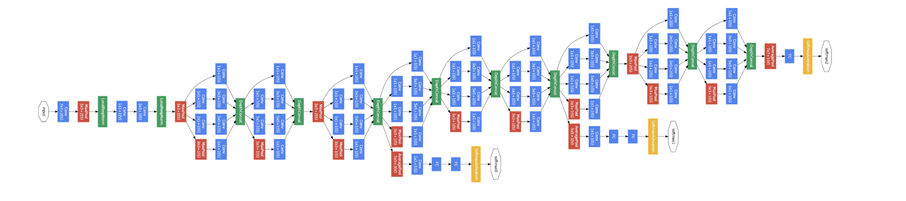

### Dataset

There is no widely used dataset to perform geolocalization task. Most of them are really small and so unfitting for this kind of problem. Two solutions often came out, scarp images on social media where the localization is shown or used Google StreetView to get images. Both have their strength and weakness, but in this paper the authors decided to scrap the internet for images, which given them a broader set photos.

Also, data augmentation isn't really an option here, because we want the model to be able to differentiate between subtle changes in the environment. Also, it needs to see during training a sample from different places inside the same class. Indeed, the extreme image variations inside a class wouldn't be fixed just by tweaking existing photos.

Composed of 125 million of picture with GPS coordinate label taken from all over the web with close to no prior selection. The dataset is composed of portrait, landscape, interior photography but his also extremely noisy with image of product, pet, cars, etc.

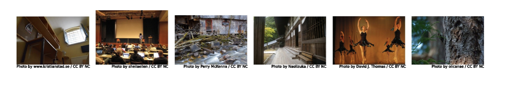

## 4. Experiment & Result

The model consists of 74.7M parameters, which found empirically to be the optimal number. Upscaling this number wasn’t giving any improvement and reducing was affecting the accuracy. They used Cross Entropy loss function and trained the model for 2.5 months on FlickR Dataset until the convergence of the validation set accuracy.

### Result

The accuracy for the model has been tested on a set of 2 million pictures taken from the social media platform FlickR. PlaNet is able to localize 3.6% of the images at street-level accuracy and 10.1% at city-level accuracy. 28.4% of the photos are correctly localized at country level and 48.0% at continent level.

The author also made heatmaps for different images. An heatmap is a way to understand what part of this image is the most important for the model to make its decision. It works by occulting pixels and analysing the confidence of the model on these new images.

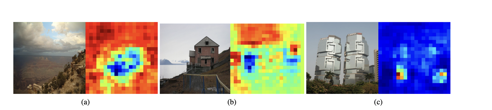

These heatmaps give interesting informations on the way the model is performing its classification. It seems, even if the number of images where heatmap has been produces are really small, that the model tends to focus on the overall environment and not directly on the main subject of the picture. For example, the (a) and (b) images are using more the background than the subject in the first plan. In the third picture, you can see that the tree in the foreground, that are usually not present in Shanghai, have a huge impact on the classification result.

PlaNet vs IM2GPS:

PlaNet localizes 236% more images accurately at street level and 51% more images accurately at country level. Another advantage of using a deep learning approach compared to a data driven one, is the size of storage need to operate. IMG2PS needs to 8.4TB of memory (having to store vector representation of each photo in the training data set), compared to 350MB for Planet, making in it more easily usable on different platform. The inference time is also reduce significanltly. Computing KNN search with milions of images can be really long compared to the forward pass of an Inception model.

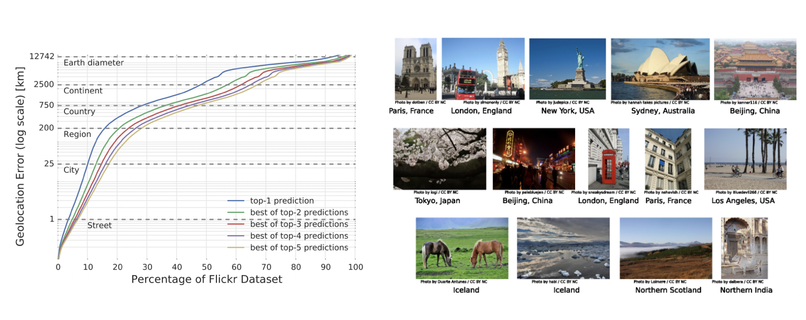

PlaNet vs Human:

The author tests the model against 10 human subjects with some pretty good knowledge of overall world geography. The model won 28 of the 50 rounds, and was in general way more accurate, with a median localization error of 1131.7 km compared to 2320.75 km for the humans

## 5. Improvement methods

### Use of LSTM network to classify a set of pictures.

To improve the accuracy, the authors try to use different pictures from the same location and use a LSTM Network to extract informations from multiple images. First they created for each images an embedding vector by taking the final layer before the SoftMax layer of the previously trained model. Then they fed theses vectors into an LSTM layer. They finally took the output of the last photos and fed into a SoftMax layer to performs the classification. During training they froze the 'embedding layer', and only trained the LSTM and classification layer.

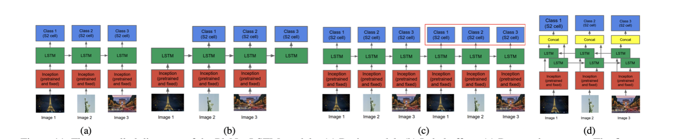

Using a group of photos with an LSTM model help to classify some images that normally have an important uncertainty. This method outperformed a simple average on the single prediction of all the photos in the album.

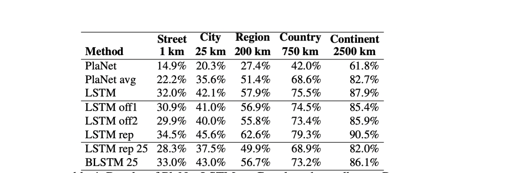

### Scene recognition as a pre-processing method
In the paper (2) «Geolocation Estimation of Photos using a Hierarchical Model and Scene Classification» the authors decided to use scene recognition in pair with the classification step. The idea is to limit the complexity of the task by dividing it into two main parts. Indeed, it can be quite hard for the model to memorize the visual appearance of the entire earth for different type of scene. Depending on the environment, indoor, outdoor, city, etc.  the model require to focus on different features of the image. According to the author, photo classification in urban environment tend to focus more on architecture, people or street signs. However, in more natural environment, plants and roads seems to have bigger impact on the model decision.

One of the idea proposes by the author is to first used a model to classify in which environment the photo has been taken and then used different models trained to geolocalise particular environment. (ISN)

The second idea was to consider this task as multi classification task. By training simultaneously on 2 classification tasks (one for scene recognition and the other for the geolocalization task). Doing that, the model can learn to adapt between environment and has been shown to help increase the accuracy of the primary task (MTN).

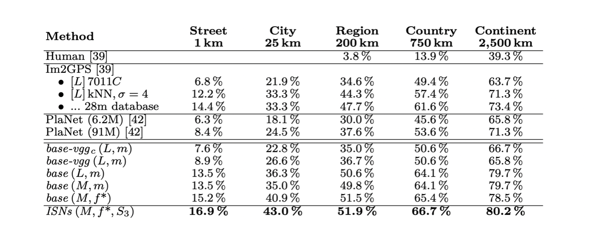

Both this technic shows significant improvement on the accuracy.

### Novel class definition and loss function

In the paper, (3) «Exploiting the Earth’s Spherical Geometry to Geolocate Images», the authors used earth geometry to create a new way to partition the world and promote a new kind of loss function. By using the Mixture of von-Mises Fisher, considered the spherical analogue of the Gaussian distribution, they get better result than PlaNet and prove than the training was more efficient than the previous related works. They also point out, that the output distribution for "hard to classify images" would give more interpretable informations.

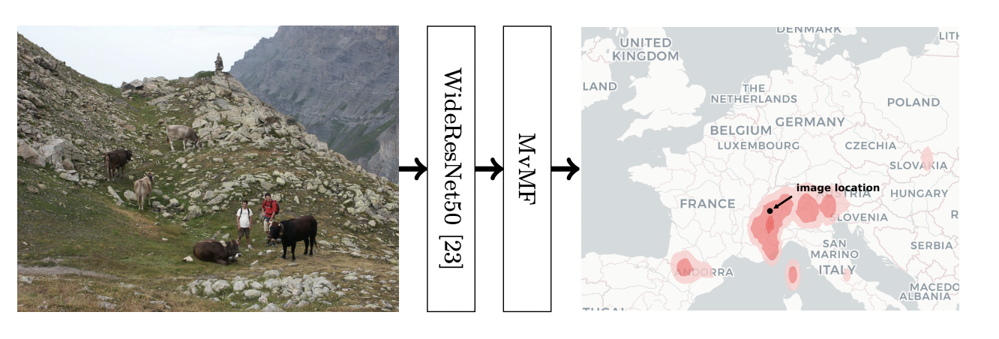

### How could we improve current framework ?

#### Cross-view image localisation:

Cross-view image localisation is referring in the field as being able to match a street view level images with a satellite image within a predefined set.

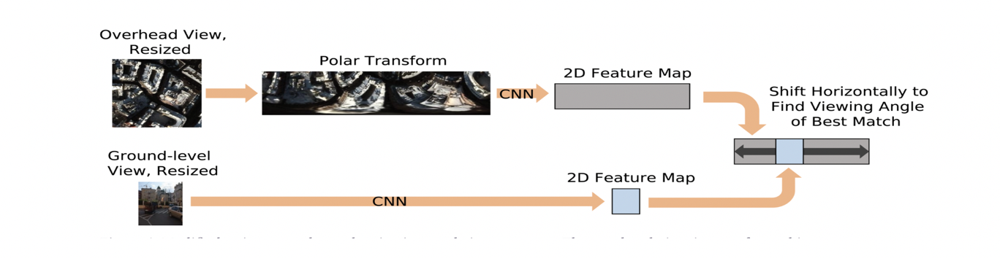

                                                                                                                                  
This task has been researched for a long time, and different methods have emerged. The main idea is to use polar transformation to try to approximate the satellite images, and then use some comparison metrics to find the closest satellite image.

No paper or researcher have been published about using this kind of principle to improve the current image localization model. But by directly try to extract features or using it as pre-processing or post-processing technic, it could be a good direction for improvement.

#### Divided the task even more:

In most images, there are different clues that can give important informations on the localization of the image. For example some store or building names, some street signs or even the numberplate of a vehicle. By training various model to try to detect more precise clues, and by using some web search API, we could get for a huge sample of images some close to perfect localization match.

Detecting and analysing numberplate is a task that has been widely done in computer vision, and now it's possible to find very accurate detection model. By then extracting some of the text in the number plate or by matching it with a dataset of all kind of numberplate, it would be possible to narrow the localization possibilities.

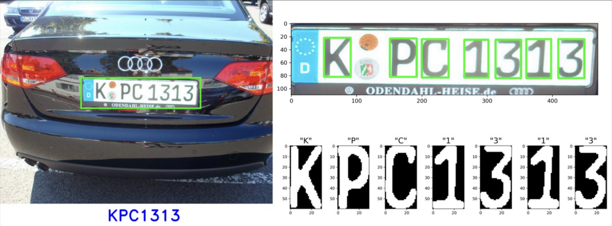

There exist also some dataset and model that have been designed to detect and analyse front store, this paper for example «Detecting, Classifying, and Mapping Retail Storefronts Using Street-level Imagery» used YOLOV3 architecture. By detection the name of potential store or building in the image and automatically scarps the internet for information could also be a great solution for a number of images.

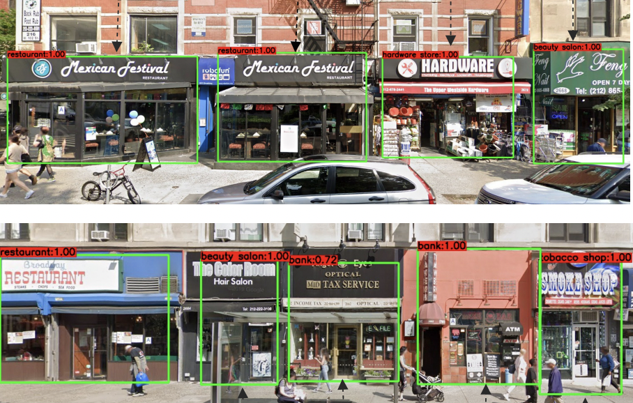

If using the internet is not an option, this kind of informations could be used as a feature extraction technics and then provide to some classification layers.

## 5. Conclusion

So can computer be competitive at GeoGuessr ? Yes, and they are already better than most human ! However, there are not as good as some people can get, mostly because of the complexity of task and the amount of, very specific, knowledge that is needed to perform near perfect localization. But, it could get better, by training more complex model with fewer noisy images, or as we saw by sub dividing the task into multiple different problems, the accuracy could improve significantly. Also, by training different models to detect specific images and then used internet scrapping to balance the lack of cultural knowledge of the model, it would be possible to delevoped solution that are more accurate.
    
### Take home message \(오늘의 교훈\)

Big deep learning models can learn to localize images, better than previous data driven techniques. The accuracy, which is already better than most human, could improved by sub dividing the task and/or try to extract more specific features.
    
## Author / Reviewer information

### Author

**Alexandre Constantin** 

* Exchange student / KAIST AI

### Reviewer

1. MAHE ZABIN: KAIST / MaheZ20Kaist
2. Artyom Olegovich Stitsyuke:  KAIST / stitsyuk
3. BELLA GODIVA: KAIST / bellagodiva

## Reference & Additional materials

(1) James Hays et al./ IM2GPS: estimating geographic information from a single image / Proceedings of the IEEE Conf. on Computer Vision and Pattern Recognition (CVPR), 2008.
    
(2)Eric Muller-Budack et al./ Geolocation Estimation of Photos using a Hierarchical Model and Scene Classification  
    
(3) Mike Izbicki et al./ Exploiting the Earth’s Spherical Geometry to Geolocate Images

    
