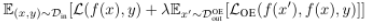
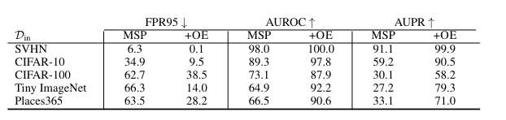
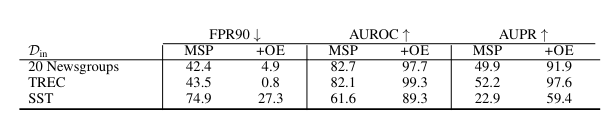
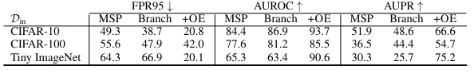
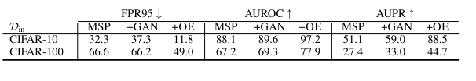
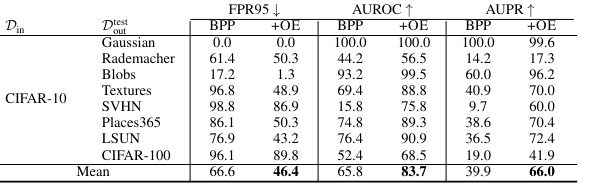

##  1. Problem definition

Detection of Out-Of-Distribution data is of paramount importance. Despite numerous researches in the domain, it is not possible to make outlier detectors learn representations or gain knowledge of out-of-distribution data beforehand. Anomaly detection problems have previously been explored with the usage of Deep Learning classifiers which assigns anomaly scores to inputs. They do so by using knowledge from in-distribution data. However, in the real world outlier distributions are imperceptible by the detector and this necessitates a reciprocal method that could potentially handle it. 

## 2. Motivation
### Related work
Hendrycks et al. proposed the usage of Maximum Softmax Probability of prediction to evaluate whether the example is out-of-distribution[1]. The MSP will have a lower softmax probability on samples that are out of distribution. It is also possible to use a supplementary branch on the pre-trained classifier and produce a OOD score[2]. By using adversarial perturbations on the input data [3], Goodfellow et al. successfully made the maximum softmax probability between in-distribution data and OOD more distinctive. In object detection tasks, models often classify OOD samples with high confidence therefore Lee et al. trains GAN concurrently with a classifier [4] and this results in the classifier having lower confidence for the GAN samples. 
 Salakhutdinov et al. pre trained deep learning classifier on web images to learn feature representations[5], Zeiler & Fergus et al. pre-trained on ImageNet and deems it useful for fine tuning applications[6]. Similarly, Radford et al. pretrained unsupervised networks on Amazon reviews to acquire customer sentiment representations which could further be fine-tuned on sentiment analysis tasks[7]. 
### Idea

The authors make use of Outlier Exposure which uses supplementary datasets because in reality, OOD data that can potentially be encountered remains unknown. Therefore the procedure makes use of an auxiliary dataset or Outlier Exposure dataset that is  different from the OOD test data to be used and an in-distribution dataset. Therefore, the objective is to minimize the following loss function:

L denotes the cross-entropy loss function for the classification task and   LOE   represents the loss for OOD samples. To minimize this loss,   is the hyperparameter to be tuned. The contributions of this paper include:
* The comparison of results between baseline Out of distribution Detectors such as Maximum Softmax Probability and PixelCNN++ * coupled with proposed Outlier Exposure method. These are for Computer Vision tasks.
* The authors demonstrate the benefits of OE on NLP tasks as well. 
* Compares the proposed OE approach with synthetic data exposure.

## 3. Methodology
The following were the in-distribution datasets:
* SVHN dataset
* CIFAR
* Tiny ImageNet
* Places365
* 20 Newsgroups
* TREC
* SST
The authors had used three datasets for the Outlier Exposure task and they included:
* 80 Million Tiny Images: to prevent any overlaps, all examples of 80 million Tiny images from the CIFAR dataset were removed. 
* ImageNet-22K: This dataset was used as the OOD dataset for Tiny ImageNet and Places365. Images from the ImageNet were removed to ensure disjointedness between test OOD and Outlier exposure dataset. 
* WikiText-2: Each of the texts in WikiText-2 were treated as a sample. 
## 4. Experiment & Results
The authors set the value of  to be 0.5 for the image classification experiments and 1.0 for the Natural Language Processing experiments. The hyperparameter was not fine-tuned deliberately to keep any influence on accuracy trivial. 
Wide Residual Neural Networks were fine tuned on the Outlier Exposure datasets and were trained for 100 epochs with a dropout rate of 0.3, in both the training and fine tuning phase, cosine learning rate scheduler was used. The learning rate was initially set to 0.001 in the fine tuning phase along with some customary augmentation techniques such as cropping and flipping. On the other hand, Places365 dataset was trained with a narrower Resnet-18, that had already been pretrained on the dataset and it was fine tuned for 5 epochs. 
   
The table above shows comparison of results between baseline MSP and MSP fine tuned with Outlier Exposure. 
   
For the NLP tasks, the table shows the results of baseline MSP juxtaposed with results of the proposed approach.
The authors built on the OOD detection methodology proposed by DeVries et al. which incorporates a complementary OOD scoring branch. The authors added  Ex∼DOE
out [log b(x)]  to the loss function to fine tune on OE datasets, where   was set to 0.5. Similarly to other Vision tasks, they have used Wide Residual Neural Network. The table below shows the results of fine tuning the confidence branch with Outlier Exposure.

 

A further experiment with synthetic outliers demonstrated that any noise signal applied to the images and used as OE caused the network to memorize the patterns too quickly. The following table of results confirmed this phenomena, it shows that concurrent training with GAN generated samples produced a high error rate. Outlier exposure with a more diverse set of natural images showed better results.
 
In the last part of their experiments, the authors shift to PixelCNN++ as their baseline OOD detector since it is able to produce a probability density function. As a sub-task for NLP, the authors used the QRNN language model as baseline for Outlier Exposure Detection. 
 
 One of the primary findings of the research showed that when a network was trained from scratch and then concurrently trained with Outlier Exposure data it produced state of the art results for OE. The choice of Outlier Exposure train dataset is a crucial step, and it must be close to the out of distribution test data. There is a level of flexibility in choosing OE dataset. 

## 5. Conclusion
Outlier exposure, when combined with baseline state of the art Out of distribution detection techniques can produce very reliable results both in the field of Computer Vision and Natural Language Processing. The proposed technique has also proven to be computationally efficient. 

## References:
[1]Dan Hendrycks and Kevin Gimpel. A baseline for detecting misclassified and out-of-distribution examples in neural networks. International Conference on Learning Representations, 2017.
[2] Terrance DeVries and Graham W Taylor. Learning confidence for out-of-distribution detection in neural networks. arXiv preprint arXiv:1802.04865, 2018.
[3]Goodfellow, Ian & Shlens, Jonathon & Szegedy, Christian. (2014). Explaining and Harnessing Adversarial Examples. arXiv 1412.6572.
[4]Kimin Lee, Honglak Lee, and Jinwoo Shing. Training confidence calibrated classifiers for detecting out of distribution samples. International Conference on Learning Representations, 2018
[5]Ruslan Salakhutdinov, Joshua Tenenbaum, and Antonio Torralba. Learning to learn with compound hd models. In Neural Information Processing Systems, 2011.
[6]Matthew D Zeiler and Rob Fergus. Visualizing and understanding convolutional networks. In European Conference on Computer Vision. Springer, 2014

[7]Alec Radford, Rafal Jozefowicz, and Ilya Sutskever. Learning to generate reviews and discovering sentiment. arXiv preprint, 2017.
