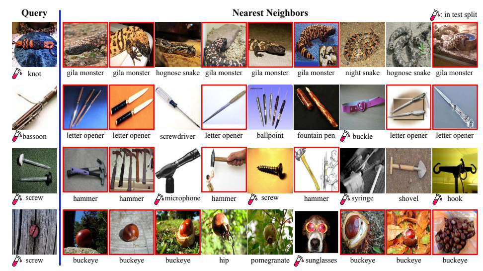
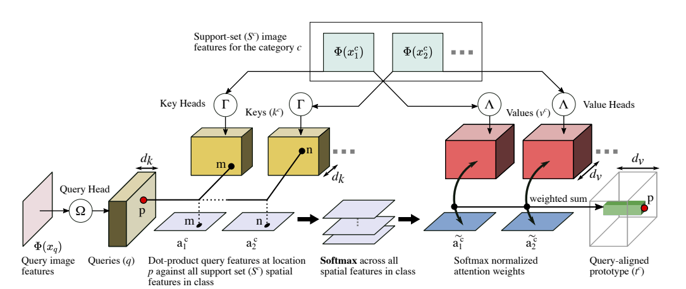
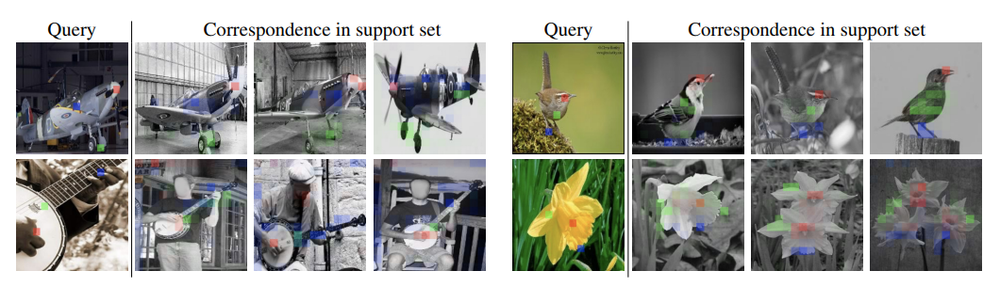
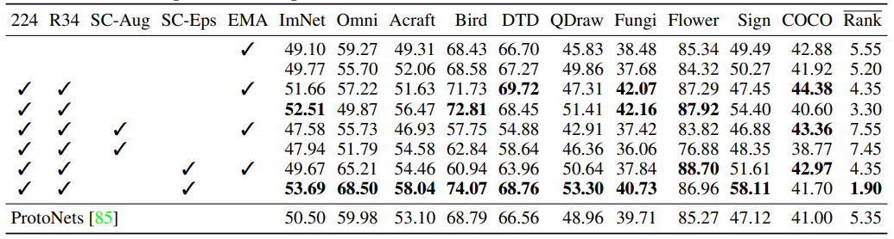
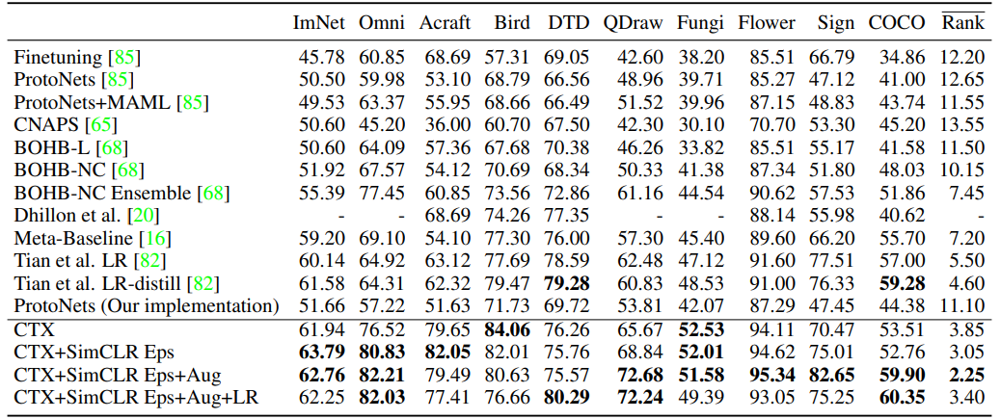

# CrossTransformer \[Kor\]

##  1. Problem definition

본 논문은 Transformer에 PrototypeNet을 결합한 few-shot learning을 다룹니다.

(본 논문을 이해하는데는 few-shot 및 meta learning에 대한 이해가 필요합니다. 혹 배경지식에 대한 설명이 필요하신 분은 [여기](https://zzaebok.github.io/machine_learning/FSL/)를 참고해 )

현재의 vision system은 소수의 이미지 데이터만 학습하고 전혀 새로운 이미지를 부여하면 성능이 현저히 저하됩니다. 
즉, 방대한 양의 데이터 속에서 학습한 경우의 이미지가 있을 때만 새로운 이미지를 활용한 task(예를 들면 분류)를 성공적으로 수행할 수 있습니다. 
(강이지/고양이 분류 문제의 경우, 방대한 양의 강아지와 고양이 이미지를 학습해야만 새로운 '강아지' 혹은 '고양이' 데이터를 성공적으로 분류할 수 있습니다.
이 때 학습 데이터의 양이 불충분하거나, 전혀 새로운 이미지인 '토끼' 이미지를 분류하라는 task를 준다면 모델의 성능은 급격히 저하됩니다.)
하지만 현실 세계에서 매번 방대한 양의 데이터를 학습하기는 어렵고, 특히 라벨링된 데이터를 구하기는 더더욱 어렵습니다.

예를 들어 보겠습니다.
Home Robot이 집에 새로운 물건이 들어왔는데, 이를 전혀 인식하지 못한다면 어떻게 될까요?
공장에서 assurance system이 새로운 제품에 대해 결함을 바로 인식하지 못한다면 또 어떨까요?
Home Robot과 assurance system을 다시 학습시켜야 하는데, 새로운 데이터라 데이터 부족으로 학습이 어려울 것입니다. 

Vision System의 궁극적 목표는 새로운 환경, 즉 새로운 데이터에 곧바로 적용하는 것입니다. 
이것이 바로 few-shot learning이 탄생하게 된 배경입니다.

그리고 이에 저자들은 적은 양의 데이터로 model의 빠른 학습을 통해, 곧바로 새로운 data를 처리할 수 있도록 하는 것을 목표로 Transformer를 발전시켰습니다. 
즉, 기존 Transformer가 방대한 양의 데이터를 필요로 했던 것과 달리 few-shot learning이 가능하도록 한 것입니다.
  

먼저, 저자들이 생각한 기존 few-shot learning의 문제점을 살펴보겠습니다. 

지금까지 few-shot learning은 meta-learning과 함께 연구되어 왔습니다. 
그리고 Prototypical Nets는 Meta-Dataset의 SOTA model 입니다. 
하지만 이 Prototypical Nets는 training-set의 image class만 represent하고 out-of-distribution classes, 즉 새로운 image class를 classify하는데 필요할 수 있는 정보는 버려버린다는 문제를 가지고 있습니다. 

아래의 그림을 보겠습니다.

이는 Prototypical Nets로 embedding(벡터화)시킨 후, Query 데이터 이미지에 따른 9개의 nearest neighbors(유사 이미지)를 도출한 결과입니다.
Nearest neighbor와 같이 간단한 classifier(분류기)가 잘 작동하기 위해서는, 의미적으로 유사한 이미지 데이터들끼리 유사한 representation(표현성)을 가지고 있어야 합니다.
하지만 위의 결과를 보면, 실제 이미지는 그렇지 않다는 것을 직관적으로 보여줍니다.
오직 유사한 representation을 가진 특징만으로 분류를 시도하면 5%만 Query의 class(label)와 일치하는 결과가 이를 말합니다.
특히 representation에만 의존하여 training class(학습 데이터)에서 잘못 학습한 데이터들(붉은 박스)이 꽤 많다는 것입니다.

그렇다면 왜 이렇게 잘못 학습된 것일까요?

한 가지 유추할 수 있는 점은, network(분류기 모델)가 학습 도중 이미지 pattern(표현성)을 각 class마다 feature space(특징 공간)를 너무 강하게 grouping(결합)해 버린다는 것입니다.
즉, 이미지가 다른 class의 이미지와도 유사할 수 있다는 점을 간과한 채 학습을 하는 것입니다. 
쉽게 말해 Figure 1에서 screw의 feature space와 buckeye의 feature space가 분명 다른 class지만 유사할 수 있다는 점을 무시한채 학습을 하여, 결국 test단계에서 유사한 feature space인 buckeye가 들어오면 screw로 분류해 버리는 classification(분류) 오류를 낳는다는 것입니다. 

특히 이는 out-of-domain samples(학습 데이터에 없는 이미지 데이터 샘플)에서 network가 착각하기 더 쉽습니다.
저자들은 이를 "overemphasize a spurious image pattern"이라고 표현합니다. 즉, 지나친 일반화의 오류입니다.
Network가 오직 자신이 training한 데이터에 대한 유사 feature가 test data로 들어오면, 이를 학습한 데이터에서만 유사성을 찾다보니 과도하게 해석하여 training class 중 가장 유사한 것을 뱉어버린다는 것입니다.

결국 training class 안에서만 유사 feature space를 유추하여 잘못된 분류를 하는 문제가 발생합니다.
저자들은 이를 "Supervision Collapse(학습에 의한 붕괴)"라고 하며, 정확한 class 분류를 위한 이미지 pattern학습을 하지 못했다는 것입니다.

## 2. Motivation

본 논문의 저자들은 supervision collapse문제를 해결하고자, SimCLR과 Prototypical Nets를 기반으로하는 CrossTransformer를 제안합니다. 

### Related work

1. Few-shot image classification
    - Few-shot learning은 주로 meta-learning framework로 다뤄집니다. 
    - Meta-learner는 새로운 데이터로부터 바로 학습 후 parameter(변수) 및 rule을 update할 수 있습니다. 
    - CrossTransformer는 이에 착안하여, Prototypical Nets를 기반으로 설계되었습니다.

2. Attention for few-shot learning
    - CrossTransformer는 local correspondences(일치)를 통해 각 class에 집중합니다.
    - Temporally dilated convolution을 사용하여, long-term experience의 attention을 memory에 기억하면 traditional learning보다 더 증대학습을 할 수 있습니다. 
(즉, 시간차를 둔 convolution을 사용하여 긴 시간 동안의 attention을 기억하면서 학습하겠다는 뜻입니다.)

3. Correspondences for visual recognition
    - CrossTransformer는 local part를 보다 matching함으로써 classification을 수행합니다. (즉, 전체가 아닌 부분에 집중합니다.)
    - Part-based correspondence는 얼굴인식에서 좋은 성능을 보여준 선행연구가 있습니다.
    - 따라서, CrossTransformer는 query와 support-set 이미지의 픽셀 사이 soft correspondence 계산합니다. 

4. Self-supervised learning for few-shot
    - SimCLR episode는 self-supervised learning으로, pretext task(이전 학습, 혹은 사전 학습)를 유의미한 것으로 transfer(전이)할 수 있으며, 이는 training data를 학습했을 때 model이 더 많은 representation이 가능하도록 합니다. 

### Idea

1. SimCLR
    - self-supervsision은 supervision collapse문제를 해결할 수 있습니다. 
    - self-supervised learning 모델인 SimCLR은 transform invariance를 유지하면서 데이터 셋의 모든 이미지를 식별하여 embedding합니다. 
    - 다만, SimCLR을 auxiliary(보조적) loss로만 취급하는 것이 아니라 "episode"로 재구성 training episode와 같이 분류되도록 합니다. 

2. CrossTransformer
    - 본 모델은 Transformer를 few-shot fine-grained(더욱 세밀히) classification을 위해 발전시킨 것입니다.
    - 객체와 그 배경은, 학습했던 것과 유사한 local appearance를 가진 아주 작은 부분으로 구성되기 때문에 아래와 같이 모델을 구성합니다.
        - local part-based comparison
        - accounting for spatial alignment
    - 다시 말해,
        - 먼저, query와 support-set image 사이의 geometric 혹은 functinal한 거시적 관계는 Transformer의 attention을 통해 계산됩니다.
        - 그 후, 상응하는 local feature들 사이의 거리를 계산하여 classification을 진행합니다. 

## 3. Method

이제 본 논문에서 제시한 모델 및 방법에 대해서 자세히 살펴보겠습니다.

본 저자들은 크게 두 가지로 접근하여 supervision collapse 문제를 해결합니다. 

기존 few-shot learning은 episode의 support set으로부터 정보를 학습하여, episode의 query를 잘 classify하기 위해 각 image의 embedding을 학습했습니다.
그래서 이 embedding을 학습할 때, self-supervised learning을 사용하여 학습에 사용되는 class 및 이미지 데이터를 넘어 일반화된(generalized) 정보를 표현할 수 있도록 하였습니다. 

그 후, 이렇게 얻어진 embedding를 classifier인 CrossTransformer를 통해서 이미지 분류를 수행합니다. 
이 때, CrossTransformer는 Prototypical Nets를 청사진으로 사용하였으며, 이에 추가적으로 spatially(공간적) aware한 방법으로 정보를 얻어 classification task를 수행할 수 있도록 devleop하였습니다.

> Protototypical Net이란?
> 
> Prototypical Net은 episodic learner로서, test time에도 똑같이 수행되는 episode가 training에서도 마찬가지로 수행되며 학습이 이루어지는 모델입니다.
> Query set Q와 Support set S 이미지 데이터는 각 c클래스로 $$c \in \{1,2,...C\}$$ 분류되고, Support set S의 각 클래스는 $$S^c=\{(x_i)^c\}_{i=1}^{S}$$ 즉 N개의 example 이미지 $$x_i^{C}$$로 구성됩니다.
> 
> Prototypical Net은 query와 subset $$S^c$$ 사이의 거리를 학습합니다.
> 1. 먼저, query-, support-set은 D-dimensional representation $$\phi(x)$$로 encoding합니다. 이 때, shared ConvNet $$\phi: \mathbb{R}^{H \times W \times 3} \mapsto \mathbb{R}^D$$를 사용합니다. 
> 
> 2. 다음으로 c클래스의 "prototype" $$t^c \in \mathbb{R}^D$$는 support set $$S^C$$의 average representation $$t^C=1/|S^C|\sum_{x \in S^C}\phi(x)$$로부터 얻어집니다.
> 
> 3. 마지막으로 각 class의 분포는, query와 class prototype 사이 거리의 softmax를 취한 값 $$p(y=c|x_q)=\frac{exp(-d(\phi(x_q),t^C))}{\sum_{c'=1}^{C}exp(-d(\phi(x_q),t^{c'}))}$$로부터 얻어집니다. 이 때, distance function d는 squred Euclidean distance $$d(x_q, S^C)=||\phi(x_q)-t^C||_2^2$$ 입니다.
> 
> 이를 통해, 각 query의 class를 맞추는 확률을 maximize하는 방향으로 embedding network $$\phi$$를 학습하게 됩니다.

그럼 이제 본격적으로 모델의 구조를 세세하게 살펴보겠습니다.

### Self-supervised training with SimCLR
가진 supervision 데이터가 라벨링된 이미지일 때, 어떻게 하면 train feature가 학습된 label 이상의 representation을 가질 수 있을까요?

저자들은 그 방법으로 neural network embedding $$\phi$$를 improve하는 방법을 제시합니다. 
일단 feature가 학습에 사용된 class 이상의 정보를 거의 표현하지 못하고 붕괴된다면, 그 다음 이 feature를 사용하여 classification을 수행하는 classifier도 그 손실을 제대로 만회하지 못하기 때문입니다. 

그래서 저자들은 self-supervised learning을 제안합니다. 
주어진 label 없이도 representation을 학습하는 "pretext tasks"를 차용하는데, 특히 본 논문에서 차용한 SimCLR은 "instance discrimination"을 pretext task로 사용합니다. 
"instance discrimination"은 radom image transformation(cropping, color shift, etc...)를 같은 이미지에 두 번 적용하여, 한 이미지에 두 가지 차이가 있는 "view"를 생성합니다. 
그 후, network는 두 가지 view의 같은 이미지에 대해서 다른 이미지보다 더 similar한 representation을 갖도록 학습합니다. 
이렇게 학습을 하게 되면 network는 semantic 정보에 더욱 민감하게 되고, 같은 class의 다른 이미지에 대해서는 discriminate(차별화된) 한 feature를 학습하게 됩니다.
이를 통해 supervision collapse를 막을 수 있습니다.
  

본 논문에서 SimCLR을 embedding을 할 때 보조적 loss function으로 사용할 수도 있겠지만, 저자는 SimCLR을 episodic learning으로 재구성하여 사용하는 것을 제안합니다. 
이를 통해 적은 hyper-parameter(사용자 지정 변수)로 모두 episodic learner로서 적용할 수 있기 때문입니다. 
이를 위해 training episode 중 랜덤하게 50%를 SimCLR episode로 바꾸고, SimCLR episode로 바꾸지 않은 original episode에 대해서는 MD(Meta-Dataset)-categorization episode라고 명명하였습니다. 

$$\rho$$를 SimCLR의 image transformation function이라 하고, $$S=\{x_i\}_{i=1}^{|S|}$$를 training support set이라 해보겠습니다.
그렇다면 우리는 SimCLR episode를 $$S'=\{\rho(x_i)\}_{i=1}^{|S|}$$로 구할 수 있고, query는 $$Q'=\{\rho(random_{sample(S)})\}_{i=1}^{|Q|}$$로 구할 수 있습니다. 
그 후 original query set Q는 없어집니다. 
SimCLR episode에 있는 이미지 label은 original support set에 있는 index이며, 각 query에 |S|-way classification을 합니다. 

SimCLR episode에 대해, Prototypical Net의 loss는 다시 $$\frac{exp(-d(\phi(\rho(x_q)), \phi(\rho(x_q)))}{\sum_{i=1}^{n} exp(-d(\phi(\rho(x_q)), \phi(\rho(x_i)))}$$입니다.
d를 Euclidean 대신 cosine distance로 하면, SimCLR 기존 loss와 같음을 볼 수 있습니다. 
  

### CrossTransformers
Query image $$x_q$$와 c에 대한 support set $$S^C=\{x_i^C\}_{i=1}^{N}$$가 주어졌을 때, CrossTransformers는 local part-based comparison을 통해 representation을 생성합니다. 

CrossTransformers는 spatial tensor로서 image representation을 생성하며, query-aligned class prototype과 support-set image $$S^C$$의 correspondence를 계산합니다. 
Query image와 query-aligned prototype간 거리는 Prototypical Nets와 유사한 방법으로 계산되고, 실제 soft correspondence를 Transformer의 attention을 통해 계산하였습니다. 
이에 Prototypical Nets의 단점인 flat vector representation을 사용함으로써 야기되는 image feature의 location에 대한 손실과 query image와 독립적으로 고정되어버리는 class prototype문제를 해결합니다.

CrossTransformers는 Prototypical Nets의 embedding network $$\phi(\cdot)$$에 있는 마지막 spatial pooling을 제거함으로써, H'와 W'의 spatial dimension을 보존합니다. 
그 후, Transformers 기작에 따라 key-value pair가 support set의 각 이미지에 대해서 두 개의 독립적 linear map에 따라 생성됩니다. 이는 아래와 같습니다.
- key-head $$\gamma : \mathbb{R}^D\mapsto\mathbb{R}^{d_k}$$
- value-head $$\Lambda : \mathbb{R}^D\mapsto\mathbb{R}^{d_v}$$

또한, query image feature $$\phi(x_q)$$는 아래와 같이 embedding됩니다.
- query-head $$\Omega : \mathbb{R}^D\mapsto\mathbb{R}^{d_k}$$

이제 key-value-query가 구해졌으니, dot-product를 통해 attention score를 구할 차례입니다.
Attention score는 대략적 correspondence를 나타내며, support-set feature를 query에 맞게 총정렬하도록 합니다. 

이를 수식으로 자세히 풀어보겠습니다.
- key for the $$j^{th}$$ image in support set for class c $$k_{jm}^{c}=\gamma\cdot\phi(x_j^c)_m$$
- query vector at spatial position p in the query image $$x_q$$ $$q_p=\Omega\cdot\phi(x_q)_p$$
- 그러면, attention score $$\tilde{a}_{jmp}^c \in \mathbb{R}$$, $$\tilde{a}_{jmp}^c=\frac{exp(a_{jmp}^{c}/\gamma)}{\sum_{i,n}exp(a_{inp}^c/\gamma)}, \ where \  a_{jmp}^c=k_{jm}^c\cdot q_p , and \ \gamma=\sqrt{d_k} $$

위와 같이 attention score를 구하면, 이제 query의 spatial location p에 대한 ptototype vector $$t_p^c$$를 구할 수 있습니다.
- query image value $$w_p=\Lambda\cdot\phi(x_j^c)_m$$
- prototype vector $$t_p^c$$, $$t_p^c=\sum_{jm}\tilde{a}_{jmp}^c v_{jm}^c$$

이제 마지막으로, prototype의 local feature와 그에 대응하는 query image value를 squared Euclidean distance로 계산합니다. 이때 구해지는 scalar distance는 Prototypical Nets에서 class의 distribution에 대한 negative logit역할을 합니다. 
- query image values, $$w_p=\Lambda \cdot \phi(x^q)_p$$
- squared Euclidean distance, $$d(x_q, S^c) = \frac{1}{H'W'} \sum_p ||t_p^c-w_p||_2^2$$

설계한 모델에서는, query와 support set image에 같은 value-head $$\Lambda$$를 사용했으며 이를 통해 CrossTransformers가 distance에 집중할 수 있도록 하였습니다. 

예를 들어 보겠습니다. 아주 극단적인 경우가 있을 수 있습니다. 학습된 데이터의 distance가 모두 0이고, 우리의 목표는 untrain된 데이터 셋이든, 아주 dissimilar한 데이터 셋이든 잘 분류하고 싶습니다. 그렇다면, $$\Lambda$$를 공유함으로써, p=m에서 $$\tilde(a)_{jmp}^c=1$$이고 나머지 경우에 대해 모두 0이라면, distance는 0이 됩니다. Network의 weight가 어떻게 학습되었든 상관이 없도록 하기 위해서입니다. 

그리고 이를 위해, $$\gamma=\Omega$$ 즉 key와 query의 head도 같게 해주었습니다. 이를 통해 관계 있는 spatial location을 maximal할 수 있습니다. 

## 4. Experiment & Result

저자들은 크게 두 가지의 실험을 하였습니다.

1. SimCLR episode와 new architecture를 Prototypical Nets에 적용하였을 때, 어떤 요소가 성능에 얼마나 영향을 미치는가?(Figure 4)
2. 본 논문에서 제시하는 모델과 few-shot learning 및 meta learning의 baseline 및 SOTA 모델과의 성능 비교(Figure 5)

### Experimental setup

* Dataset: 아래 표(Figure 4, 5)의 x축을 참고해 주세요.
* Baselines: 아래 표(Figure 5)의 y축을 참고해 주세요. (meta-learning model의 baseline 및 SOTA인 모델들과 본 논문에서 제안한 모델을 비교하였습니다)
* Evaluation metric: Accuracy
* Training setup: 기존의 ProtoNets와 변수를 유사하게 설정하였습니다.

### Result

위 실험은 ablation study로,
1. image resolution: 224 vs 126
2. Resnet: 34 vs 18
3. SimCLR style augmentation: 단순히 SimClR transformation을 사용하는 것으로 instance discrimination 기능이 없다
4. SimCLR Episode: 위 (3)과 대비되는 방향이다
5. EMA Batch Norm: test time에 BatchNorm에 Exponential Moving Average를 적용한다

의 5가지 경우에 대한 적용 여부에 따른 성능 평가를 하고 있습니다.

특히 주목해서 볼 결과는, 단순 SimCLR augmentation만 적용했을 때는 baseline인 ProtoNets에 비해 성능이 급격히 저하된 반면, SimCLR Episode를 적용하면 성능이 급격히 향상된다는 점입니다.

여기서 SimCLR Episode는 MD-categorization episode를 SimCLR에 적용한 것으로,
1. data augmentation
2.  classification 문제를 "instance discrimination"문제로 치환

이라는 두 가지의 큰 변화를 주어 새롭게 탄생한 알고리즘입니다. 

이 때, 1만 적용할 경우 오히려 성능이 저하될 수 있음을 위 실험 결과는 보이고 있습니다. 

그 외에도 resolution과 Resnet-34를 적용하여 model의 capacity를 높인 것도 성능 향상에 긍정적 영향을 미치고 있음을 볼 수 있습니다. 
  

위 실험은 CrossTransformers와 meta-learning SOTA 모델을 baseline으로 설정하여 비교하고 있습니다. 

표에서 보이다 싶이, 대부분의 데이터셋에서 본 논문이 제시하는 모델이 SOTA임을 성능으로 증명하고 있습니다. 
CTX 그 자체로도 이미 다른 baseline SOTA 모델에 비해 성능이 높은데, 본 논문에서 제시하는 SimCLR Eps와 augmentation을 적용할 경우 성능이 월등히 개선됨을 확인할 수 있습니다.

## 5. Conclusion

본 연구의 요약 및 성과를 정리해 보겠습니다.

1. SOTA인 SimCLR 알고리즘을 발전시켜 self-supervised techinique을 통해 local feature를 더욱 robust(강건)하게 하였습니다.
2. CrossTransformer를 제안함으로써, 더 local(부분적인)한 feature를 사용한 few-shot classification 및 spatially aware한 network architecture를 통해 transfer(전이학습)가 더욱 강화되었습니다.
3. Meta-Dataset에 대한 본 모델의 성능 평가를 통해, 대부분의 데이터에 SOTA임을 증명하였습니다. 

### Take home message \(오늘의 교훈\)

본 논문은 평소 관심 있었던 few-shot learning에 대한 공부와 2022 AI604 수업의 final project를 위해 선정하였습니다.

> Transformer를 few-shot learning에 적용할 수 있는 방법을 제시했고, 성능도 SOTA임을 증명했다.
>
> 절대적으로 방대한 양의 데이터가 필요한 Transformer를 few-shot learning을 적용한 시도와 아이디어가 참신하다.

## Author / Reviewer information

### Author

**성지현 \(Jihyeon Seong\)** 

* M.S. student in KAIST AI
* [Github](https://github.com/monouns)
* [Blog](https://aibroker.tistory.com/)
* E-mail: tjdwltnsfP1@gmail.com / jihyeon.seong@kaist.ac.kr

## Reference & Additional materials

1. Carl Doersch, Ankush Gupta, Andrew Zisserman, "CrossTransformers: spatially-aware few-shot transfer", 2020 NeurIPS
2. [Official GitHub repository](https://github.com/google-research/meta-dataset)
3. [Unofficial Github repository with Pytorch](https://github.com/lucidrains/cross-transformers-pytorch)
4. [basic for few-shot and meta learning](https://zzaebok.github.io/machine_learning/FSL/)
