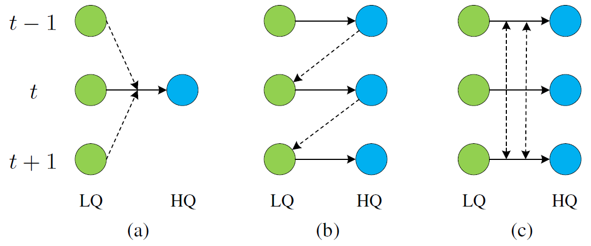
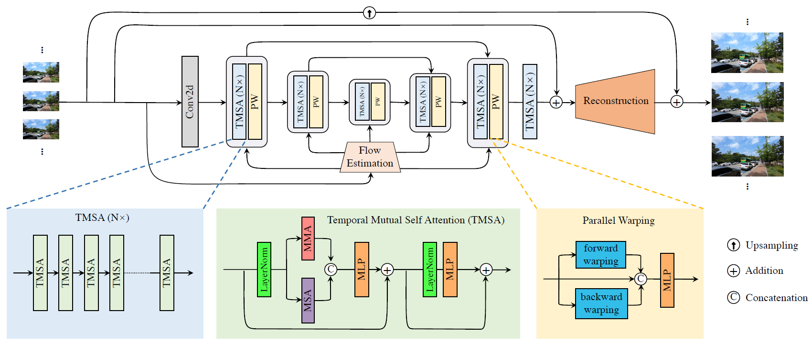
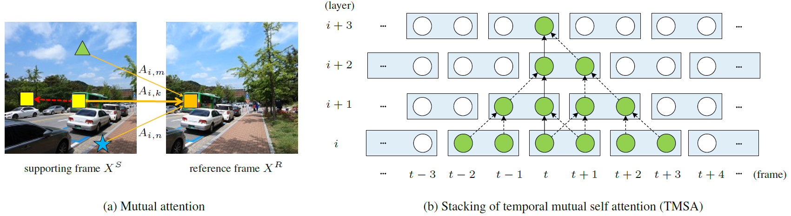
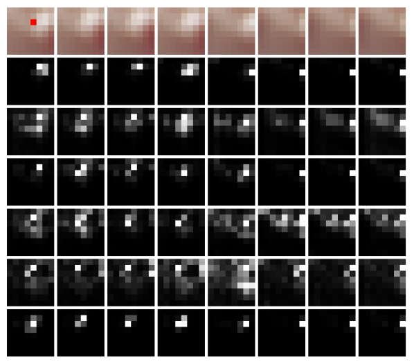
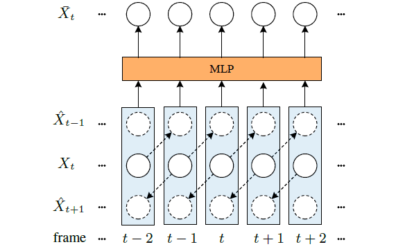
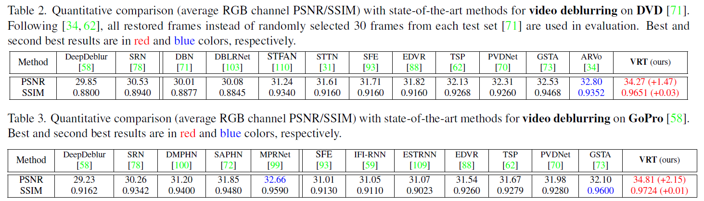
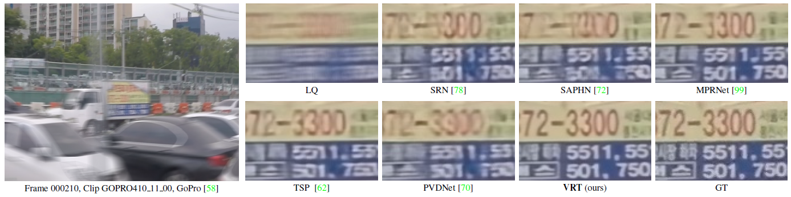
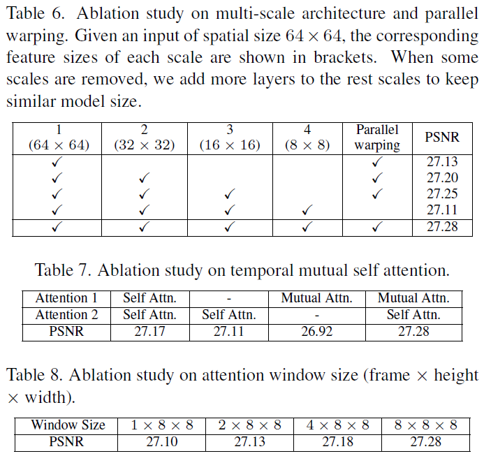

# VRT: A Video Restoration Transformer \[Kor\]

## 1. Problem definition

본 논문에서 해결하고자 하는 문제는 **video restoration**, 즉 여러 프레임 이미지를 input으로 받아 target 프레임의 **deblurring, super resolution** 등을 수행하는 것입니다.

이는 수식으로 표현하면 $I_{LQ}\in\mathbb{R}{^{T\times H\times W\times C_{in}}}$를 input으로 하고, restoration된 $I_{HQ}\in\mathbb{R}{^{T\times sH\times sW\times C_{out}}}$를 output으로 하는 모델입니다. $T,H,W,C_{in},C_{out}$은 각각 프레임 수, height, width, input channel, output channel을 뜻하고, $s$는 video super-resolution을 진행할 때 resolution이 몇 배 늘어나는지에 따른 계수입니다.

해당 논문은 2022년 2월에 arxiv에 공개된 논문으로, Video deblurring, video super resolution, denoising 등의 여러 task에서 SOTA를 기록하여 주목을 받고 있습니다: [Paperswithcode](https://paperswithcode.com/paper/vrt-a-video-restoration-transformer)

## 2. Motivation

### Related work

#### a. Video restoration

지금까지의 video restoration method들은 크게 sliding window-based methods, recurrent methods의 두 가지 방법으로 분류됩니다.

- **Sliding window-based methods**: **figure 1(a)** 와 같이 여러 프레임을 input으로 하여 하나의 high quality 프레임을 내놓는 과정을 반복하여 video를 만드는 방법입니다. 
  이 방법은 Parallelization이 가능하지만, inference 과정에서 같은 프레임이 feature extraction과 같은 비슷한 과정을 여러 번 거치기 때문에 비효율적인 feature utilization이 발생하고 높은 computational cost를 가집니다.

- **Recurrent methods**: **figure 1(b)**와 같이 이전에 모델에서 reconstruct한 프레임을 사용하여 다음 프레임을 예상하는 방법입니다. 
  이는 세 가지 단점이 있는데, 첫째로 이전 프레임의 결과를 활용하므로 효율적인 학습과 inference를 위한 parallelization이 힘들고, 둘째로 temporal하게 멀리 떨어진 프레임들과의 dependency를 학습하기 힘들고, 마지막으로 frame의 수가 적은 video에서는 성능이 확연히 떨어진다는 것입니다.

<figcaption align = "center"><b>Figure 1. Illustrative comparison of sliding window (a), recurrent (b), and proposed methods (c).</b></figcaption>

#### b. Transformer

**Transformer**는 Vaswani의 논문 [Attention is all you need][Transformer]에서 처음으로 제안하였으며, NLP task에서 global dependencies를 효과적으로 얻어내는 방법입니다. 이후 image classification, segmentation 등의 high-level vision task에서 적극적으로 transformer를 도입하여 좋은 결과를 얻었습니다.

하지만 **Transformer의 computational complexity가 element 개수의 제곱에 비례하는 특성** 때문에 한동안 image restoration 등의 spatial resolution이 비교적 큰  low-level vision task에 사용되지 않고 있다가, 최근 [Swin Transformer][Swin]와 같이 이미지를 recursive하게 나누거나, spatial한 interaction이 아닌 channel 간의 interaction을 활용한 [Restormer][Restormer]와 같은 방법들이 점점 나오고 있습니다.

### Idea

저자는 VRT가 기존의 video restoration 방법에 비해 세 가지의 장점이 있다고 서술합니다.

1. 한번에 하나의 프레임만 inference할 수 있었던 기존 방법들과 다르게, 새로운 pipeline을 도입해 위 **figure 1(c)**처럼 긴 sequence의 video에 대해 parallel하게 train, test를 진행
2. Recurrent methods는 temporal하게 멀리 떨어진 프레임의 정보가 잊힐 수 있지만, VRT는 **optical flow**와 **deformable convolution**을 활용하여 효과적으로 수행
3. 이웃한 frame의 feature를 최대로 활용하기 위해 transformer를 적절히 변형하여 사용

## 3. Method

<figcaption align = "center"><b>Figure 2. The framework of the proposed VRT.</b></figcaption>

우선, VRT는 **Figure 2**와 같이 **Multiscale framework**를 가져(feature의 spatial size를 줄여가면서 feature extraction을 진행하는 방식) 다양한 scale의 feature로부터 좋은 정보를 얻을 수 있도록 합니다. 또한 Conv2d layer 이후로 이어지는 5개의 stage는 N개의 **TMSA module**과 **parallel warping**으로 구성되어 있고, reconstruction 전의 마지막 stage는 TMSA module로만 구성되어 있어 총 6개의 stage를 가지고 있습니다. 

먼저 TMSA의 핵심 operation인 **mutual attention**을 살펴보겠습니다.

### Mutual attention

<figcaption align = "center"><b>Figure 3. Illustrations for mutual attention and temporal mutual self attention (TMSA).</b></figcaption>

설명에 앞서, original transformer의 attention layer가 어떠한 역할을 하는지 되짚어 봅시다.

Query $Q$, key $K$, value $V$는 각각 서로 다른 feature vector로서, attention layer는 아래의 식과 같이 query와 key의 유사도 벡터를 구해 value에 곱해주는 연산입니다.

$$
\textrm{att}(Q,K,V)=\textrm{SoftMax}(Q(K)^\intercal/\sqrt{D})V
$$
여기서 저자는 **mutual attention (MA)** 을 수행할 때 **query ($Q^R$)를 참고해야 할 reference frame** $X^R$ 으로부터, **key ($K^S$)와 value ($V^S$)를 feature alignment해주어야 할 support frame **$X^S$로부터 각각 learnable linear projection $P$을 통해 얻도록 하였습니다:
$$
Q^R=X^RP^Q, K^S=X^SP^K, V^S=X^SP^V\\
\textrm{att}(Q^R,K^S,V^S)=\textrm{SoftMax}(Q^R(K^S)^\intercal/\sqrt{D})V^S
$$
이렇게 정의했을 때, 유사도 $Q^R(K^S)^\intercal$는 reference frame과 support frame에 의해 정해지고, 유사도와 support frame으로부터의 value가 곱해지는 것이기 때문에, MA는 reference frame으로의 support frame의 feature alignment로 해석할 수 있습니다.

*실제 이미지를 예시로 들면, 위 **figure 3(a)**의 $X^S$에서 주황 화살표가 달려있는 세모, 네모, 별이 **key**이고 reference frame의 주황 네모가 **query**, 주황 화살표의 굵기가 key와 value의 유사도 입니다. (Query와 가장 비슷한 patch인 노란색 사각형의 화살표가 가장 두꺼운 것을 볼 수 있습니다.) 그리고 노란 사각형이 빨간 화살표를 통해 위치를 옮겨가는 과정이 **feature alignment**로서 이 과정을 모든 patch에 대해 반복하면 결론적으로 $X^S$이 $X^R$로 feature align 됩니다.*

이러한 mutual attention의 장점은 크게 세 가지가 있습니다.

1. 하나의 reference pixel에 대해 하나의 결과 pixel을 내놓는 image warping 에 비해서 MA는 여러 후보 픽셀과 그 wieght을 내놓기 때문에 더 유연함.
2. CNN-based method는 인접한 픽셀이 같은 방향으로 향하는 경향(locality에 대한 inductive bias)이 있는 데 반해 attention method는 그런 bias가 없음.
3. Mutual attention은 image feature에 motion estimation과 warping을 joint하게 수행하는 것과 같으므로 성능 향상을 기대할 수 있음.

### Temporal mutual self attention (TMSA)

위와 같이 mutual attention은 두 frame간의 feature alignment를 잘 수행하지만, video에서 더 많은 정보를 얻기 위해서는 주변의 다른 여러 프레임에서도 도움을 얻어야 합니다.

한편, 앞서 언급했듯이 computational complexity 의 한계로 image feature vector 전부에 대해 transformer를 적용하기 힘들기 때문에, 해당 논문에서는 **feature vector를 (D, H, W) 크기의 겹치지 않는 window로 나누어 transformer에 전달**했습니다. (D=계산할 frame의 개수, H=window의 height,W=window의 width)

**Figure 2**의 **TMSA (N$\times$)**를 보면 N개의 TMSA가 직렬로 연결되어 있는데, parallel warping이 없는 맨 마지막 stage를 제외한 처음 5개의 stage에서는 **N=8**을 선택하여 **처음 6개의 TMSA에는 (2, 8, 8) 크기**의 window size를, **마지막 2개의 TMSA에는 (6, 8, 8) 크기**의 window size를 도입하였습니다. 그리고 TMSA 연산의 과정은 이 두 가지 window size의 경우에 따라 달라집니다.

실제 코드에서 TMSA의 **input feature X의 shape 는 (B, D=6, H, W, C) 입니다. **(B: batch size, D: # of neighbor frame, C: channel number) 

이제 TMSA가 window size에 따라 어떻게 달라지는지 보겠습니다.

1. **Window size = (2, 8, 8)**: 2개의 프레임, 8\*8의 spatial size

   먼저 X로부터 (2, 8, 8) 크기의 window를 추출합니다.
   X가 (B, D//2, 2, H//8, 8, W//8, 8, C)의 partition을 거쳐 **(B*nW, 2\*8\*8, C)**로 reshape됩니다. *(nW: # of window)* 그리고 window가 아래 TMSA 수식의 X로 들어가 연산이 진행됩니다. 
   **Figure 3(*b*)**의 layer $i$가 첫 TMSA 블럭을 나타내는데, 파란색 직사각형이 하나의 window size를 나타냅니다. Window size의 크기에 맞게 두 프레임이 한 직사각형 안에 들어가 있는 것을 볼 수 있습니다. 
   **다음 두 번째 TMSA 블럭에서는 X에 [roll](https://pytorch.org/docs/stable/generated/torch.roll.html) 연산하여 layer $i+1$과 같이 window를 한 칸씩 밀어내어** layer $i$때와는 다른 frame과 TMSA 연산을 하게 됩니다. (Stacking TMSA)

   (e.g. frame t는 첫 TMSA 블럭에서는 frame t+1과 연산되었지만 두 번째 TMSA 블럭에서는 frame t-1과 연산되는 것을 확인할 수 있습니다.)
   이 과정을 반복하면 layer $i+3$의 $t$ frame에서는 총 6 frame의 feature를 활용하게 됩니다.(초록색 원 참조)

2. **Window size = (6, 8, 8)**: 6개의 프레임, 8\*8의 spatial size

   마찬가지로 (6, 8, 8) 크기의 window를 추출합니다.
   X가 위와 비슷하게 partition을 거쳐 **(B\*nW, 6\*8\*8, C)**로 reshape되어 아래 TMSA 식의 3번 과정에서 시작하여 ( $X_1,X_2$대신 $X$로 들어감) self attention만 진행합니다. (input으로 6개의 frame이 들어왔기 때문에 MMA는 연산 불가하므로)
   Stacking TMSA는 이 과정에서 수행하지 않습니다.

아래 식은 하나의 TMSA 블럭의 전체 과정입니다. (**Figure 2**의 TMSA 구조 참조)

$$X\in \mathbb{R}^{2\times N\times C};X_1,X_2\in\mathbb{R}^{1\times N\times C}$$($X$: two frames, $N$: 2\*8\*8 or 6*8\*8)

1. $$X_1,X_2=\textrm{Split}_0(\textrm{LN}(X))$$: 두 프레임으로 이루어진 $X$를 나눠줌

2. $$Y_1,Y_2=\textrm{MMA}(X_1,X_2),\textrm{MMA}(X_2,X_1)$$: MMA는 교환법칙이 성립하지 않음

3. $$Y_3=\textrm{MSA}([X_1,X_2])$$

4. $$X=\textrm{MLP}(\textrm{Concat}_2(\textrm{Concat}_0(Y_1,Y_2),Y_3))+X$$

5. $$X=\textrm{MLP}(\textrm{LN}(X))+X$$: input X와 같은 dimension 가짐

**LN: LayerNorm; MMA: multi-head mutual attention; MSA: multi-head self attention**

추가적으로, 논문에서는 multi-head self attention과 비슷하게, mutual attention과 self attention 모두 $h$번 attention 연산을 진행하고 concatenate 하였습니다.

요약하면, 마지막 stage를 제외한 모든 stage의 TSMA(N$\times$) 모듈은 총 8개의 TMSA 모듈로 구성되어 있고, 첫 6개의 TMSA에는 MMA와 MSA 모두를 연산하고, 마지막 2개는 MSA만을 연산합니다.

또한 네트워크의 마지막 stage에서는 24개의 TMSA module이 모두 MSA만을 수행하도록 하였습니다.

***Window size를 같은 stage 안에서도 다르게 설정한 이유:** 모든 블럭에 대해 Figure 3(b)와 같이 MMA를 적용해도 멀리 떨어진 frame간의 dependency를 파악할 수는 있지만, frame간의 self attention을 통해 직접적으로 dependency를 구하는 것이 더 효과적이라고 합니다. 따라서 한 stage에서 처음 6개 블럭에서는 각 frame간의 feature alignment를 점진적으로 학습하고, 나중의 2개 블럭에서는 temporal하게 떨어진 frame간의 직접적인 dependency를 구합니다.*

***Stacking TMSA를 고안한 이유:** 저자는 만약 모든 neighboring frame 간에 mutual attention을 진행한다면 computational complexity가 neighbor frame 개수의 제곱이 될 것이므로 linear complexity의 **figure 3(b)** 구조를 가진 Stacking TMSA를 제안하였다고 언급했습니다.*

<figcaption align = "center"><b>Figure 4. Visualization of attention maps.</b></figcaption>

지금까지 설명했던 Attention layer가 실제로 어떻게 작동하였는지 **Figure 4**에서 확인할 수 있습니다. 좌상단의 빨간 픽셀이 query, 1열 color 이미지들이 프레임, 아래의 grayscale 이미지들이 모두 attention map 입니다. 각각의 열은 서로 다른 attention head를 의미합니다. (앞서 언급했던 대로, 각각 8*8 size grayscale 입니다) 1열에서 query pixel을 포함한 흰색 object가 오른쪽으로 이동하는데, 2~7열 모두 같은 경향을 보이는 것을 관찰 가능합니다. 

이는 네트워크가 의도한 대로 frame간의 long-range dependency를 잘 학습했다고 볼 수 있습니다. 

### Parrallel warping

<figcaption align = "center"><b>Figure 5. Illustration of parallel warping.</b></figcaption>

한편, TMSA는 작은 window size 안의 dependency만 구할 수 있어 video에서 **object의 큰 움직임은 분석하기 힘들다**는 단점이 존재합니다.

이를 극복하기 위한 Parallel warping의 main idea는 **주변 frame들을 optical flow, deformable convolution을 통해 target frame으로의 feature warping을 진행**하고 MLP를 거치면서 **feature fusion**을 수행하는 것입니다. 이는 feature vector전체에 spatial하게 연산하므로 TMSA와 달리 video안에서의 large motion을 활용할 수 있습니다.

Parallel warping은 optical flow, [deformable convolution][Deformable Convolution]을 이용합니다.

만약 우리가 양옆의 두 프레임만 고려한다고 했을 때, parallel warping 과정은 다음과 같습니다.

1. Target frame $X_t$의 주변 frame $X_{t-1},X_{t+1}$에 대한 optical flow ${O_{t - 1,t},O_{t+1,t}}$를 이용해 warping: $X'_{t-1},X'_{t+1}$
   $$
   \left\{ \begin{array}{l}
   {{X'}_{t - 1}} = {\cal W}({X_{t - 1}},{O_{t - 1,t}})\\
   {{X'}_{t + 1}} = {\cal W}({X_{t + 1}},{O_{t + 1,t}})
   \end{array} \right.
   $$

2. Warping된 frame $X'_{t-1},X'_{t+1}$을 convolution하여 deformable convolution을 위한 offset residuals ${o_{t - 1,t}},{o_{t + 1,t}}$와 masks ${m_{t - 1,t}},{m_{t + 1,t}}$를 얻습니다.
   $$
   {o_{t - 1,t}},{o_{t + 1,t}},{m_{t - 1,t}},{m_{t + 1,t}} = {\cal C}\left( {{\mathop{\rm Concat}\nolimits} \left( {{O_{t - 1,t}}} \right.} \right.,\left. {\left. {{O_{t + 1,t}},X_{t - 1}^\prime ,X_{t + 1}^\prime } \right)} \right)
   $$

3. Offset과 mask를 이용해 deformable convolution 연산하여 feature warping된 두 frame을 얻어냅니다.
   $$
   \left\{ \begin{array}{l}
   {{\hat X}_{t - 1}} = {\cal D}({X_{t - 1}},{O_{t - 1,t}} + {o_{t - 1,t}},{m_{t - 1,t}})\\
   {{\hat X}_{t + 1}} = {\cal D}({X_{t + 1}},{O_{t + 1,t}} + {o_{t + 1,t}},{m_{t + 1,t}})
   \end{array} \right.
   $$

4. Target frame과 warping된 두 frame을 concatenate 후 MLP 수행하여 parallel warping 결과 $\bar X_t$를 얻습니다.
   $$
   \bar X_t=\textrm{MLP}(\textrm{Concat}({\hat X}_{t - 1},X_t,{\hat X}_{t + 1}))
   $$

**$\mathcal W$: image warping function (by optical flow); $\mathcal C$: several conv layers for deformable conv parameters; $\mathcal D$: deformable convolution**

본 논문에서는 image warping function으로 [SpyNet][Spynet]을 사용하였습니다.

이 parallel warping 과정은 양옆 두 frame 뿐만 아니라 4, 6 frame까지도 위와 같은 방식으로 확장 가능합니다.

## 4. Experiment & Result

### Experimental setup

* Dataset
  Video deblurring: GoPro, DVD dataset
  Video Super resolution ($\times$4): Vimeo-90K, Vid4 dataset, REDS4, UDM10
  Video denoising: DAVIS, Set8
  각 데이터셋에 대해 train / test 를 각각 수행

* Training setup
  Attention head size $h$= 6, channel size $C=120$, training batch size = 8, training patch size = 192$\times$​192, iterations = 300K, data augmentation 은 random flipping, rotation and croping으로 진행하였습니다.
  Optimizer는 $\beta_1=0.9,\beta_2=0.99$​의 Adam optimizer, learning rate 는 4$e$​-4를 초기값으로 한Cosine Annealing을 사용하였습니다.

* Evaluation metric
  PSNR: Ground-truth와의 픽셀 별 차이를 나타내는 값, 높을수록 좋음
  SSIM: image의 전체 구조가 ground-truth와 얼마나 비슷한지 나타내는 값, 1.0이 최대값

  

### Comparison

해당 논문은 video deblurring에서 **Table 1**과 같이 SOTA를 기록했습니다. **Figure 6**에서도 가장 성능이 좋음을 확인할 수 있습니다. 결과를 첨부하지는 않았지만, video super resolution, denoising에서도 VRT는 가장 우수한 성능을 보였습니다.

<figcaption align = "center"><b>Table 1. Quantitative comparison of video deblurring.</b></figcaption>

<figcaption align = "center"><b>Figure 6. Qualitative comparison of video deblurring.</b></figcaption>

### Ablation study

저자들은 자신들이 제안한 방법들이 모델의 성능을 높이는 데 기여한다는 것을 주장하기 위해 여러 실험을 진행했습니다. 모든 실험은 video super resolution을 위해 Vimeo-4K dataset으로 train되었고, Vid4 dataset으로 test 하였습니다.

**Table 2**의 첫 번째 table은 parallel warping의 유무와 multi-scale framework의 level의 개수가 결과에 어떠한 영향을 미치는지 실험한 것입니다. 물론 parallel warping을 적용했을 때가 PSNR이 더 높았고, multi-scale의 level이 커질수록 PSNR이 커지는 경향을 보였습니다.

두 번째 table은 TMSA에서 self attention과 mutual attention의 유무를 바꿔가면서 실험한 결과입니다. Attention을 한 번만 수행한 결과보다 두 번 수행한 결과가 더 좋았고, self attention만을 사용하는 것 보다 논문에서 새롭게 제안한 mutual attention을 섞는 것이 결과가 우수했습니다.

마지막 table은 앞서 한 stage의 첫 6개의 TMSA block는 그대로 두고, 마지막 두 TMSA block의 attention window size를 바꿔가면서 실험한 결과입니다. 논문에서 제안한 대로, attention window size를 키워 temporal하게 먼 frame끼리 직접적으로 attention을 뽑아내는 것이 가장 좋은 결과를 보였습니다.

<figcaption align = "center"><b>Table 2. Ablation studies of VRT.</b></figcaption>

## 5. Conclusion

본 논문에서는 video restoration을 위한 **multi-scale framework** 기반의 네트워크 VRT를 제안했습니다. 
이를 위해 **TMSA**와 **parallel warping**의 두 가지의 모듈을 제안하였습니다.
TMSA 모듈에서는 neighbor frame과의 **feature warping과 feature extraction**을, parallel warping에서는 **더 큰** **region에서의 feature alignment와 feature fusion**을 수행하게 하였습니다. 
그 결과 video restoration의 대부분의 task에서 SOTA를 기록하였습니다.

### Take home message \(오늘의 교훈\)

> Transformer는 spatial feature의 dependency를 얻는 데 아주 좋은 성능을 보이지만, computation complexity를 잘 고려해야 한다.
>
> 일반적인 상황에서 skip connection을 결합한 multiscale framework는 성능을 높이는데 도움을 준다.
>
>  Transformer에서 query, key, value를 어떻게 구성하느냐에 따라 성능이 바뀔 수 있다.

## Author / Reviewer information

### Author

**김정우 \(Jungwoo Kim\)** 

* KAIST CS 
* kimjw0623@kaist.ac.kr

### Reviewer

1. Korean name \(English name\): Affiliation / Contact information
2. Korean name \(English name\): Affiliation / Contact information
3. ...

## Reference & Additional materials

1. J. Liang, J. Cao, Y. Fan, K. Zhang, R. Ranjan, Y. Li, R. Timofte, L. Van Gool. (2022). VRT: A Video Restoration Transformer.

2. [Official GitHub repository](https://github.com/JingyunLiang/VRT)

3. [Supplementary of this paper](https://github.com/JingyunLiang/VRT/releases)

4. [Transformer]: https://awesome-davian.gitbook.io/awesome-reviews/paper-review/2021-fall-paper-review/neurips-2017-transformer-kor

5. [Swin]: https://arxiv.org/abs/2103.14030

6. [Restormer]: https://arxiv.org/abs/2111.09881

7. [Deformable Convolution]:https://arxiv.org/abs/1811.11168

8. [Spynet]: https://arxiv.org/abs/1611.00850

