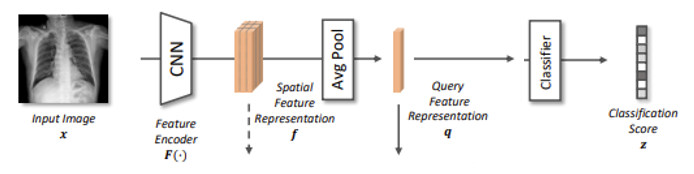
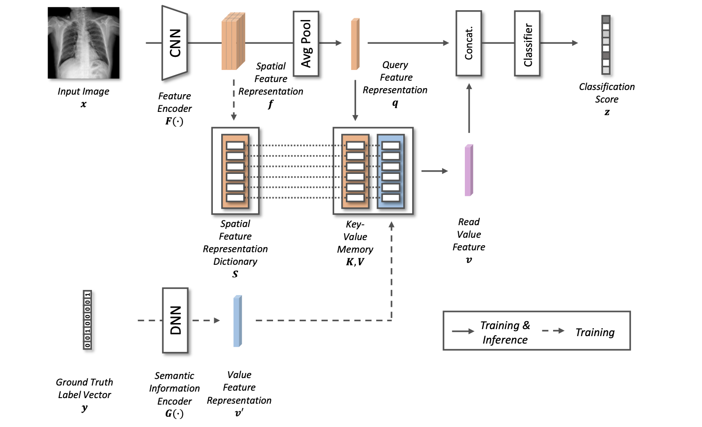
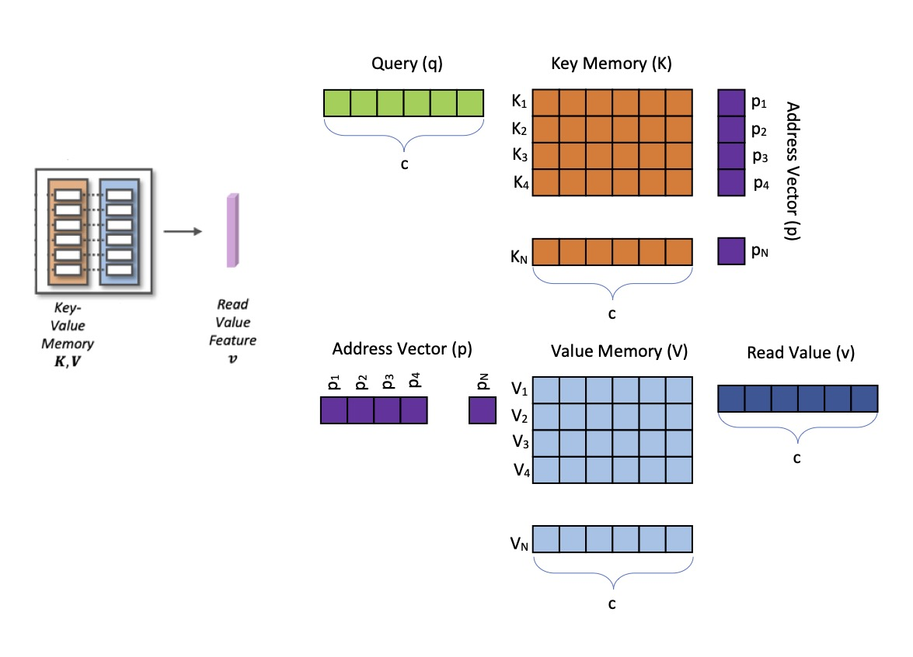

# M-CAM \[Eng\]

##  1. Problem definition

### Class activation map for visual explanation

Given a pre-trained feature encoder F of the target network, the spatial feature representation $$f_x$$ of an input image is extracted where $$f_x \in \mathbb{R}^{w \times h \times c}$$ and $$f_{x_i} \in \mathbb{R}^{w \times h}$$ is the activation at the $$i$$ th channel. Importance weight $$w_i$$ is assigned to each spatial feature representation map $$f_{x_i}$$ with respect to their relevance in target network's decision making for target class $$\hat{c}$$. Different methods are used in this weight assignment. By taking weighted sum of $$f_{x_i}$$ with the set of importance weight $$w = {w_1,w_2,...,w_c}$$ over $$c$$ channels, class activation map is generated for visual explanation.

  

## 2. Motivation

A class activation map(CAM) for a specific class shows the discriminative image regions used by CNN to make decision to classify images into that class.  Challenging conditioned dataset such as dataset with imbalanced distribution of class and frequent co-occurrence of multiple objects in multi-label classification training dataset might give rise to unwanted bias on internal components of the target deep network. CAM utilizes these internal components of deep networks such as gradients and feature maps to generate visual explanations. This means when it comes to challenging conditioned dataset, there is no guarantee on the reliability of internal components of deep networks which leads to degradation of credibility on generated visual explanations. 
To tackle such problems, they propose Bias-reducing memory module that provides quality visual explanations even with datasets of challenging conditions.

### Related work

#### Class Activation Map (CAM)

CAM is first introduced in [[2]](#2) where they compute weighted sum of the features at the last convolutional layer using the weights from the output layer that comes after applying global average pooling to the last convolutional layer. Afterward, Grad-CAM [[3]](#3) generalizes the concept of CAM, verifying that generation of activation map does not require specific structure (global average pool layer at the end of the network) of CNN anymore. Grad-CAM++ [[4]](#4) further generalizes Grad-CAM, enhancing its visual explanation by taking advantage of higher order derivatives for importance weight assignment. The mentioned CAM methods are the most popular ones but several other variations of CAM have been published as well, with each having specialized advantages. 

#### Key-Value Structure Memory Network

In [[5]](#5), in order to open up possibilities for open domain Question Answering task, a new dynamic neural network architecture called key-value structure memory network is introduced for storing diverse patterns of feature representation of trained images in the key memory and use it to make inference for the class-related semantic information which is stored in the value memory. This trained correlation between key and value memory will then be used to classify the input image. 

### Idea

To complement biases of the target network caused by the inherent challenging conditions of the training dataset, the proposed key-value structure memory module learns the distribution of spatial feature representation from the target deep network and discretely organizes the distributions into separate memory slots. To further boost the memory network to its fullest extent, they use the sparse dictionary learning concept from [[6]](#6), where diverse information can be stored sparsely over different memory slots.

## 3. Method
### Architecture 

  

The figure above describes an overall flow on how the proposed Bias-reducing memory module learns desired information from the target network. Given a pre-trained feature encoder F of the target network, the memory module takes the spatial feature representation $$f \in \mathbb{R}^{w \times h \times c}$$, query feature representation $$q \in \mathbb{R}^{c}$$ and a value feature representation $$v'\in \mathbb{R}^{c}$$ as input for training. They design the semantic information encoder G to map the hot encoded ground truth label vector y into the same number of dimensionality as $$q$$. $$f$$ and $$v'$$ are not used in inference step. In both training and inference step, the memory module outputs read value feature $$v'\in \mathbb{R}^{c}$$ and the classifier takes a concatenated vector of $$q$$ and $$v$$ as an input and output classification score $$z$$. 

### Memory value reading

Before going into training part, it would be useful to discuss how to get a value reading from the memory. This method will be used in the training steps . Application of key-value memory involves two major steps, which are key addressing and value reading. Given an embedded query value $$q \in \mathbb{R}^{c}$$ with c as number of channels of the resulted spatial features , similarity between q and each slot of key memory $$K_i \in \mathbb{R}^{c}$$ is measured. An address vector $$p \in \mathbb{R}^{1 \times N}$$ is obtained for a key memory $$K$$ with $$N$$ slots, where each scalar value of $$p$$ represents similarity between the query and each memory slot:\

  $$p_i = Softmax(\frac{q \cdot K_i}{\|q\| \|K_i\|})                             (1)$$

where i=1,2,...,N and $$Softmax(z_i) = {e_i}^{z} / \sum_{j=1}^{N} {e_j}^{z}$$

In value reading step, the value memory is accessed by the key address vector p as a set of relative weights of importance for each slot. The read value $$v \in \mathbb{R}^{c}$$ is obtained such that $$v = pV$$, where $$V \in \mathbb{R}^{N \times c}$$  is a trained value memory with $$N$$ slots. By doing so, key-value memory structure allows it to flexibly access to desired information stored in the value memory corresponding to different query values.

  

### Training
Memory module is trained to store corresponding information at the same sequential location of slot. In other words, if the second slot of V turns out to contain semantic information related to dog class, we guide the second slot of S to learn corresponding distribution of spatial feature representation of dog class. To effectively guide Bias-reducing memory module to learn the distribution of spatial feature representation with the corresponding semantic information distilled from the target network, we design three objective functions $$L_{classifier}, L_{sparse}, L_{address}$$.

As in the architecture figure, a new classifier has to be trained from the scratch in order to train the memory module. $$L_{classifier}$$ is devised as:
  $$L_classifier = BCE(fc(cat(v_t, f)),Y) \sum BCE(fc(cat(v, f)),Y)$$ where BCE is a Binary Cross Entropy loss function, $$fc()$$ is a fully connected layer classifier and $$cat()$$ represents concatenation between two vectors. $$v$$ is a value reading obtained by using formula (1) rom the memory reading section above. $$v_t$$ is also a value reading obtained by using formula (1) with Value memory replacing the Key memory and value feature representation v' replacing query feature representation q. The first term uses vt which is influenced by ground truth labels and this term is used to train value memory to contain ground truth values. The second term contain v which is influenced by query features and this term is used to train key memory. 
  
We want the value memory V to store semantic information encoded by G, and expect the memory module to output the read value feature v as similar as encoded value feature v′ even in the inference phase. While $$L_{sparse}$$ being applied for training the memory module, sparse representations of semantic information are learned over the memory slots and the memory module forms a linear combination of each slot to output the read value feature v. We devise $$L_sparse$$ as L2 norm between the two read value features vt and v:
  $$L_{sparse} = \frac{1}{N}\sum_{i=1}^N {(v_i - v_{t_i})^2}$$
 
To jointly store corresponding information at the same sequential location of the memory slots at S, K, and V, we devise an address matching objective function $$L_{address}$$. To effectively trace back the spatial feature representation distribution of specific class from the corresponding semantic information, $$L_{address}$$ guides the spatial feature representation dictionary and key memory to output similar address vectors $$p_s$$ and $$p$$ to the value address vector $$p′$$. $$L_{address}$$ is as follows:
  $$L_{address} = KL(p' \parallel p_s) + KL(p' \parallel p)$$
where $$KL(p' \parallel p_s) = \sum_{i=1}^N {p_i \cdot log(q_i/p_i)}$$ is Kullback-Leibler divergence. We sum the three of the introduced objective functions to train the memory module (S, K, and V ), a classifier, and the semantic information encoder G while the feature encoder F remains fixed. Hence the final objective function is $$L = L_{classifier} +L_{sparse} +L_{address}$$
  
### Generating Visual Explanation

  
  

  
  

## 4. Experiment & Result

This section should cover experimental setup and results.  
Please focus on how the authors of paper demonstrated the superiority / effectiveness of the proposed method.

Note that you can attach tables and images, but you don't need to deliver all materials included in the original paper.

### Experimental setup

This section should contain:

* Dataset
* Baselines
* Training setup
* Evaluation metric
* ...

### Result

Please summarize and interpret the experimental result in this subsection.

## 5. Conclusion

In conclusion, please sum up this article.  
You can summarize the contribution of the paper, list-up strength and limitation, or freely tell your opinion about the paper.

### Take home message \(오늘의 교훈\)

Please provide one-line \(or 2~3 lines\) message, which we can learn from this paper.

> All men are mortal.
>
> Socrates is a man.
>
> Therefore, Socrates is mortal.

## Author / Reviewer information

### Author

**김성엽 \(Kim Seongyeop\)** 

* Affiliation \KAIST EE
* Contact information \seongyeop@kaist.ac.kr

### Reviewer

## Reference & Additional materials

[1] Seongyeop Kim, Yong Man Ro. M-CAM: Visual Explanation of Challenging Conditioned Dataset. In British Machine Vision Conference (BMVC), 2021. 
<a id="2">[2]</a> 
Bolei Zhou, Aditya Khosla, Agata Lapedriza, Aude Oliva, and Antonio Torralba. Learning deep features for discriminative localization. In Conference on Computer Vision and Pattern Recognition (CVPR), pages 2921–2929, 2016.  
<a id="3">[3]</a>
Ramprasaath R Selvaraju, Michael Cogswell, Abhishek Das, Ramakrishna Vedantam, Devi Parikh, and Dhruv Batra. Grad-cam: Visual explanations from deep networks via gradient-based localization. In International Conference on Computer Vision (ICCV), pages 618–626, 2017.  
<a id="4">[4]</a>
Aditya Chattopadhay, Anirban Sarkar, Prantik Howlader, and Vineeth N Balasubrama- nian. Grad-cam++: Generalized gradient-based visual explanations for deep convolu- tional networks. In Winter Conference on Applications of Computer Vision (WACV), pages 839–847. IEEE, 2018.  
<a id="5">[5]</a>
Alexander Miller, Adam Fisch, Jesse Dodge, Amir-Hossein Karimi, Antoine Bordes, and Jason Weston. Key-value memory networks for directly reading documents. In Proceedings of the 2016 Conference on Empirical Methods in Natural Language Pro- cessing, pages 1400–1409, Austin, Texas, November 2016. Association for Computa- tional Linguistics. doi: 10.18653/v1/D16-1147.  
<a id="6">[6]</a>
Kenneth Kreutz-Delgado, Joseph F Murray, Bhaskar D Rao, Kjersti Engan, Te-Won Lee, and Terrence J Sejnowski. Dictionary learning algorithms for sparse representa- tion. Neural computation, 15(2):349–396, 2003.  

