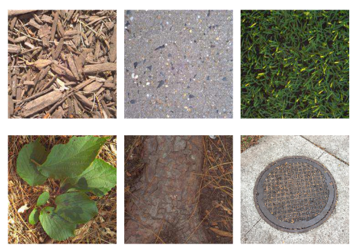
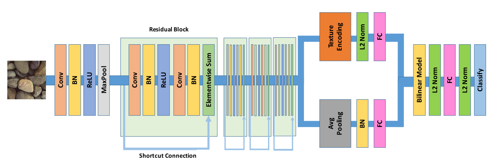
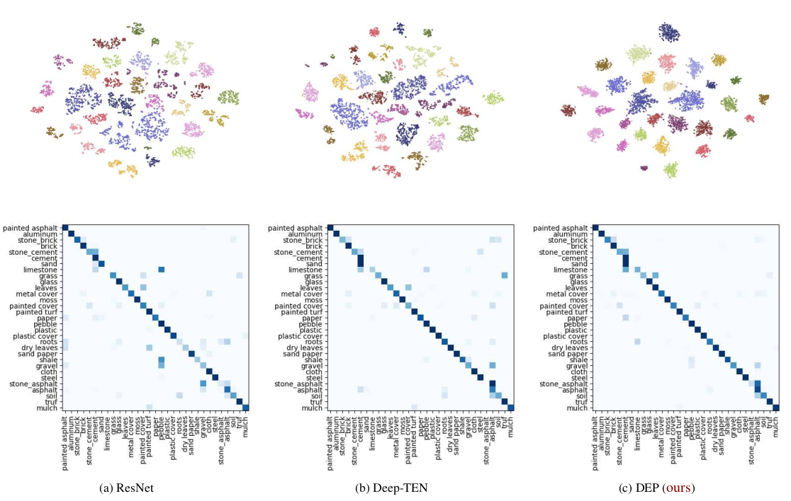

---
description- Xue et al. / Deep Texture Manifold for Ground Terrain Recognition / Venue
---

# Deep texture manifold \[Kor\]

##  1. Problem definition

본 논문에서 해결하고자 하는 문제는 ground terrain recognition입니다. ground terrain recognition은 야외 환경에서 주행하는 로봇 및 차량을 제어할 때 자신의 위치를 파악하거나 ground property를 이용하여 제어하는데에 도움이 됩니다. 

texture recognition은 일반적인 object recognition과 달리 shape-invariant한 정보를 추출하는데 목적을 둡니다. 일반적인 object recognition의 경우 ResNet과 같은 CNN구조로부터 shape, spatial arrangement와 같은 정보를 추출해 object의 외형을 인식하는데 사용합니다. 하지만 texture recognition의 경우 object의 외형에 dependent한 feature를 뽑아내는 것이 아닌 texture를 특정지을 수 있는 spatial-invariant하고 order-less한 feature를 뽑아내기 위한 network구조가 필요합니다.

하지만 위 그림을 보았을 때 위 3개 texture는 일정한 패턴을 가져 order-less한 feature를 뽑아내는 것만으로도 classification하기 충분합니다. 하지만 아래 3개 texture는 야외 환경에서도 흔히 볼 수 있는 ground terrain으로 보다 일정한 shape을 가집니다. 이러한 ground terrain을 classification하는 것에는 local spatial information을 고려하는 것이 도움이 됩니다. 따라서 본 논문에서는 두 information을 모두 고려한 network 구조를 제안하고 hand-held mobile phone으로 촬영한 dataset인 GTOS-mobile dataset을 제공하였습니다. 또한 ground terrain class간의 distance를 잘 나타낼 texture-manifold를 제안하였습니다.

## 2. Motivation

### Related work

아래는 본 논문 이전에 texture recognition에 대한 연구 논문입니다.

1. Deep TEN[1]

   본 논문은 Bag of Words 기법과 같이 이미지로부터 feature를 추출하고 추출된 feature들을 clustering하여 cluster의 center에 있는 대표 feature들로 구성된 code book을 사용합니다. 이미지 input의 한 feature와 code book set간의 residual을 soft-weight sum한 encoding vector로부터 fully connected layer를 더해 classification합니다. 즉 residual vector는 특정 feature와 code word간의 차이 vector인데 이를 embedding하기 위한 weight인 assigning weight를 학습합니다. code word 개수만큼의 spatial-invariant한 code word distribution의 mixture를 통해 image의 order-less한 feature를 뽑아내어 ground terrain dataset인 GTOS로부터 state-of-the-art 성능을 보였습니다.

### Idea

order-less texture detail과 local spatial information 사이의 balancing을 위한 bilinear model을 도입한 Deep Encoding Pooling (DEP) network를 제안하였습니다. convolution layer에서 나온 출력은 encoding layer와 global average pooling layer의 입력이 됩니다. encoding layer는 texture 모양의 세부 정보를 포착하고, global average pooling layer는 spatial information을 축적합니다. 그리고 이 둘을 balancing하는 bilinear model을 통해 order-less texture image에서는 encoding vector에 weight를 더 주고, local spatial information이 풍부한 image에서는 pooling layer에 weight를 더 주어 보다 좋은 성능을 내었습니다.

## 3. Method

TBD

## 4. Experiment & Result

### Experimental setup

* TBD

### Result

t-SNE를 통해 classification 이전 layer의 feature를 2D에 mapping한 것과 confusion matrix 결과입니다. 이전 논문들과 비교하여 각각의 class의 cluster들이 더욱 명확하게 분류되는 것을 확인할 수 있습니다.

## 5. Conclusion

TBD

### Take home message \(오늘의 교훈\)

> TBD

## Author / Reviewer information

### Author

**염동훈 \(Donghoon Youm\)** 

* PhD student in Mechanical Engineering at KAIST (Advisor: [Jemin Hwangbo](https://www.railab.kaist.ac.kr/members))

### Reviewer

1. Korean name \(English name\): Affiliation / Contact information
2. Korean name \(English name\): Affiliation / Contact information

## Reference & Additional materials

1. Zhang, Hang, Jia Xue, and Kristin Dana. "Deep ten: Texture encoding network." *Proceedings of the IEEE conference on computer vision and pattern recognition*. 2017.
