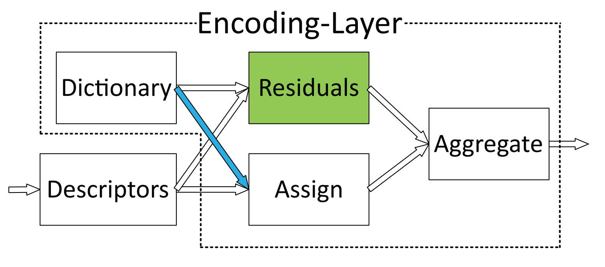
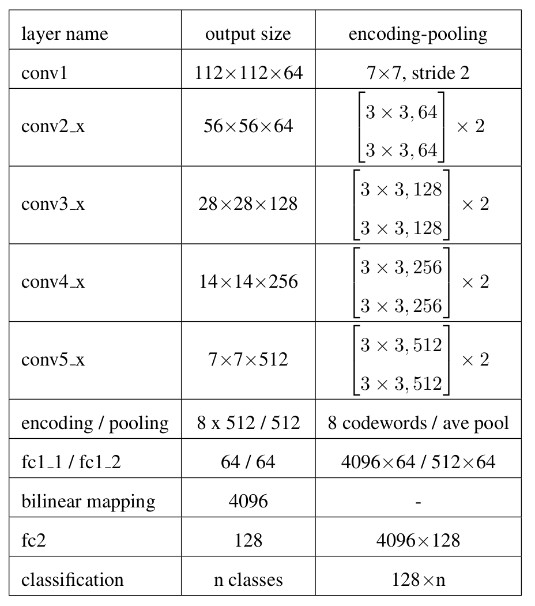
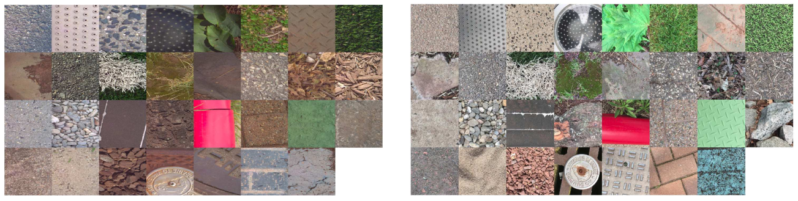
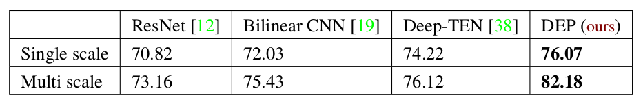
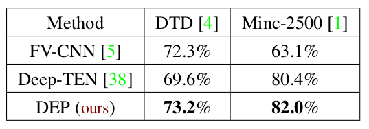
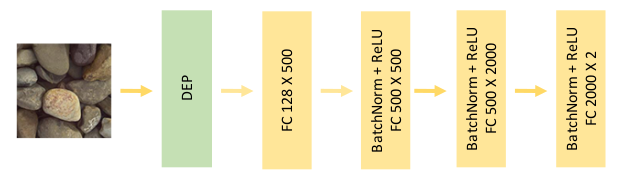
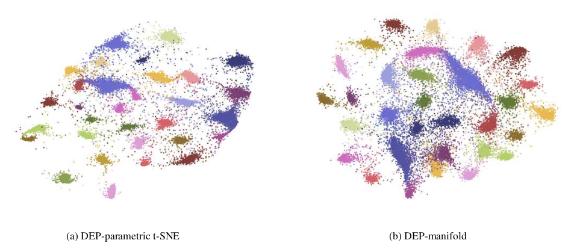

# Deep texture manifold \[Kor\]

##  1. Problem definition

본 논문에서 해결하고자 하는 문제는 ground terrain recognition입니다. ground terrain recognition은 야외 환경에서 주행하는 로봇 및 차량을 제어할 때 자신의 위치를 파악하거나 ground property를 이용하여 제어하는데에 도움이 됩니다. 

texture recognition은 일반적인 object recognition과 달리 shape-invariant한 정보를 추출하는데 목적을 둡니다. 일반적인 object recognition의 경우 ResNet과 같은 CNN구조로부터 shape, spatial arrangement와 같은 정보를 추출해 object의 외형을 인식하는데 사용합니다. 하지만 texture recognition의 경우 object의 외형에 dependent한 feature를 뽑아내는 것이 아닌 texture를 특정지을 수 있는 spatial-invariant하고 order-less한 feature를 뽑아내기 위한 network구조가 필요합니다.

하지만 위 그림을 보았을 때 위 3개 texture는 일정한 패턴을 가져 order-less한 feature를 뽑아내는 것만으로도 classification하기 충분합니다. 하지만 아래 3개 texture는 야외 환경에서도 흔히 볼 수 있는 ground terrain으로 보다 일정한 shape을 가집니다. 이러한 ground terrain을 classification하는 것에는 local spatial information을 고려하는 것이 도움이 됩니다. 따라서 본 논문에서는 두 information을 모두 고려한 network 구조를 제안하고 hand-held mobile phone으로 촬영한 dataset인 GTOS-mobile dataset을 제공하였습니다. 또한 ground terrain class간의 distance를 잘 나타낼 texture-manifold를 제안하였습니다.

## 2. Motivation

### Related work

아래는 본 논문 이전에 texture recognition에 대한 연구 논문입니다.

1. Deep TEN[1]

   본 논문은 Bag of Words 기법과 같이 이미지로부터 feature를 추출하고 추출된 feature들을 clustering하여 cluster의 center에 있는 대표 feature들로 구성된 code book을 사용합니다. 이미지 input의 한 feature와 code book set간의 residual을 soft-weight sum한 encoding vector로부터 fully connected layer를 더해 classification합니다. 즉 residual vector는 특정 feature와 code word간의 차이 vector인데 이를 embedding하기 위한 weight인 assigning weight를 학습합니다. code word 개수만큼의 spatial-invariant한 code word distribution의 mixture를 통해 image의 order-less한 feature를 뽑아내어 ground terrain dataset인 GTOS로부터 state-of-the-art 성능을 보였습니다.

### Idea

order-less texture detail과 local spatial information 사이의 balancing을 위한 bilinear model을 도입한 Deep Encoding Pooling (DEP) network를 제안하였습니다. convolution layer에서 나온 출력은 encoding layer와 global average pooling layer의 입력이 됩니다. encoding layer는 texture 모양의 세부 정보를 포착하고, global average pooling layer는 spatial information을 축적합니다. 그리고 이 둘을 balancing하는 bilinear model을 통해 order-less texture image에서는 encoding vector에 weight를 더 주고, local spatial information이 풍부한 image에서는 pooling layer에 weight를 더 주어 보다 좋은 성능을 내었습니다.

## 3. Method

### Residual Encoding Layer

Deep TEN 논문에서 설명한 것과 같은 dictionary learning 기반 방식을 재질 인식에 적용하려는 시도는 기존에도 있었습니다. 기존의 경우 SIFT와 같은 feature extraction방식과 VLAD, Fisher vector와 같은 encoder를 혼합하여 재질 데이터셋 분류 문제를 푸는 시도를 하였습니다. 하지만 기존의 이와 같은 방식은 feature extraction과 encoder가 별도의 알고리즘으로 각각 구현된 후 합쳐지는 형식을 갖고 있어 end-to-end 방식이 아닙니다. 또한 feature와 encoder는 학습시 사용된 데이터에 의해 고정된 후 사용되기 때문에 labeled data가 주는 이점을 반영하지 못합니다. 따라서 Deep TEN 논문에서는 이러한 문제점들을 residual encoding layer를 통해 해결하였습니다.

N개의 descriptor(feature)로 구성된 visual descriptor set $$X={x_1, x_2,\cdots, x_N}$$ 와 K개의 codeword로 구성된 codebook set $$C={c_1,c_2,\cdots,c_K}$$ 를 가정하겠습니다. 이 때, 각 codeword에 대해 descriptor $x_i$는 연관관계를 정의하는 weight $a_{ik}$ (i번째 descriptor와 k번째 codeword 간의 weight)와 residual vector $r_{ik}=x_i-c_k$ 로 표현할 수 있습니다. residual encoding layer가 하는 일은 k개의 codeword에 대해 다음과 같은 aggregation operation을 수행하는 것입니다. 
$$
e_k = \sum_{i=1}^N e_{ik} = \sum_{i=1}^Na_{ik}r_{ik}
$$
즉, 특정 codeword에 대해 이번 input에서 얻어낸 N개의 모든 descriptor와의 weight와 residual vector를 곱해 더함으로써 고정된 길이(code word의 길이 k)의 encoding representation을 얻어내는 것입니다. 그 결과, 이 encoding layer는 input의 갯수와 무관하면서 order-less한 일종의 pooling을 수행할 수 있습니다.

예를들어 어떤 이미지에서 descriptor $x_i$가 많이 관찰되었다고 가정하겠습니다. 이는 곧, descriptor $x_i$가 center에 분포하고 있는 특정 cluster center $c_k$에 가깝다는 뜻이 됩니다. 이는 descriptor $x_i$와 codeword $c_k$사이를 정의하는 residual vector $r_{ik}=x_i-c_k$가 작다는 것을 의미합니다. weight $a_{ik}$의 정의는 다음과 같습니다.
$$
a_{ik}= {{exp(-s_k||r_{ik}||^2)}\over{\sum_{j=1}^Kexp(-s_j||r_{ij}||^2)}}
$$
이는 각 descriptor에 대해 codeword를 soft assign하는 수식입니다. Soft-weight assignment는 서로 다른 cluster들이 대략적으로 비슷한 크기를 가진다고 가정한 뒤 scaling factor $s_k$가 학습될 수 있도록 네트워크를 디자인하여 좀 더 정확한 modeling이 가능하도록 하였습니다. 따라서 예시에서 descriptor $x_i$의 $c_k$가 아닌 codeword에 대한 residual vector에는 상대적으로 작은 weight가 되도록 학습됩니다.

### DEP network

DEP network는 convolution layer의 뒷 단에 두 개의 branch를 만들었습니다. 첫 번째는 texture encoding layer로 위에서 설명드린 residual encoding layer입니다. 두 번째는 local spatial information을 추출하는 global average pooling(GAP) layer입니다. GAP는 convolution layer의 output으로 나온 activation map을 activation map-wise averaging을 통해 $1\times1\times C$의 vector로 바꿔주는 pooling을 수행합니다. 결과적으로 각  convolution filter를 통과한 local region들의 spatial information을 추출해준다고 할 수 있습니다.

이렇게 각 branch의 중심 기능을 담당하는 layer는 기존에 연구에서 차용한 것으로 novelty가 따로 없습니다. 하지만 이 논문은 이러한 order-less texture detail과 local spatial information 두 가지 정보가 classification에 미치는 contribution을 조절할 수 있는 differentiable한 bilinear model을 구성하여 더욱 효율적인 classifier를 만들었습니다.
$$
Y^{ts} = \sum_{i=1}^I\sum_{j=1}^Jw_{ij}a_i^tb_j^s
$$
위 수식은 bilinear function $Y^{ts}$의 정의입니다. 수식의 $a^t$와 $b^s$는 각각 $I\times J$ dimension에서의 texture information과 spatial information을 의미합니다. 이 bilinear model은 learnable weight $w_{ij}$를 통해 더 좋은 classifier를 만들기 위한 두 정보의 적정비율을 학습합니다.

## 4. Experiment & Result

### Experimental setup

#### Architecture

실험에 사용된 DEP network의 architecture는 위와 같습니다. ImageNet을 통해 pre-train된 18-layer ResNet기반으로 texture encoding layer의 codeword는 8로 설정하였습니다. 

#### Dataset

GTOS database[2]를 확장하여 모바일 폰(아이폰 SE)으로 얻은 81개의 비디오로 구성된 GTOS-mobile을 수집하고 6066개의 프레임을 테스트 세트로 추출하였습니다. 위 그림에서 왼쪽은 GTOS dataset이고 오른쪽은 GTOS-mobile입니다. GTOS의 경우 모두 지면과 일정한 거리에서 촬영한 이미지이지만 GTOS-mobile의 경우 지면과의 거리가 멀리 또는 가까이 이동하여 스케일을 임의로 변경하고 시야각 또한 임의로 변경됩니다. 이를 통해 31개의 class가 있는 dataset을 만들었습니다.

### Result

DEP network를 ResNet, Bilinear CNN[3] 그리고 이전 SOTA 결과인 Deep TEN과 비교하였습니다. ResNet은 GAP를 사용한 pre-train된 18-layer ResNet을 texture classification을 위하여 fine-tuning한 것입니다. Bilinear CNN의 경우 18-layer pre-trained ResNet으로부터 feature extraction을 하고 난 후 bilinear model을 통해 pooling합니다. Multi scale의 경우 GTOS-mobile에서 데이터셋을 만든 것과 같이 지면까지의 거리와 시야각이 다양한 이미지가 재질인식에 도움을 줄 것이라는 가정하에 GTOS dataset을 서로 다른 배율로 조정하고 256 by 256 센터 패치를 추출한 것을 training dataset으로 사용한 것입니다.

위 표는 각 방법의 GTOS-mobile dataset에 대한 classification 정확도를 나타낸 것입니다. 그 결과 multi scale로 학습한 경우가 모든 방법에서 single scale에서 학습한 경우보다 좋은 성능을 보였습니다. 또한 본 논문에서 제시한 DEP network를 사용한 경우가 가장 높은 성능을 보였습니다. 

위 표는 일반화 성능을 확인하기 위한 실험으로 DTD와 Minc-2500 dataset에서 테스트한 결과입니다. single scale training을 통해 학습한 결과 각 dataset의 SOTA 방법과 비교하여 더욱 좋은 성능을 나타내었습니다.

재료 인식에서 DEP가 ResNet 및 Deep-TEN보다 우수한 이유에 대한 통찰력을 얻기 위해 Barnes-Hut t-SNE[4]를 사용하여 ResNet, Deep-TEN 및 DEP의 classification layer이전의 feature를 시각화한 것입니다. 실험을 위해 training set에서 10000개의 이미지를 무작위로 선택하였습니다. 결과는 위 그림과 같습니다. DEP는 클래스를 더 멀리 분리하고 각 클래스는 더 조밀하게 클러스터링됩니다. 

### Deep Texture Manifold

이 논문에서 또다른 novelty를 제시한 것이 바로 deep texture manifold입니다. 이는 DNN을 이용해 texture image로부터 2d manifold coordinate / embedded distribution 을 바로 얻을 수 있는 parametric texture manifold입니다. 

위 그림은 texture manifold를 위한 network architecture입니다. 이 네트워크는 DEP의 막단 feature들을 input으로 받습니다. 이전의 supervised t-SNE와 달리 batch normalization과 ReLU가 추가되었고 신경망을 pre-train하지 않습니다. Barnes-Hut t-SNE를 non-parametric embedding으로 사용하여 embedded distribution을 구현하였습니다.

위 그림은 texture manifold의 결과입니다. DEP-파라메트릭 t-SNE의 임베디드 분포의 경우 클래스는 일부 영역에서는 밀집되어 있고 다른 영역에서는 희소성이 있는 불균일하게 분포되어 있습니다. DEP 매니폴드는 2D 임베딩 내에서 클래스 분포가 더 우수합니다. 임베디드 분포를 얻기 위해 training set에서 2000개의 이미지를 무작위로 선택해 사용하였습니다. 그런 다음 test set의 이미지를 DEP 매니폴드에 포함합니다. 

재질 인식에 있어서 클래스의 정의와 구분은 사람이 임의로 정한 것이기 때문에 해석하기 모호한 경우가 많습니다. 예를 들어, 동일한 색상을 가지는 돌바닥과 시멘트, 벽돌 을 서로 잘 구분하지 못한다고 해서, 이 classifier가 재질을 잘 구분하지 못한다고 할 수 있느냐 하면 애매합니다. 세 클래스는 가공과정에서 목적에 따라 형태가 달라졌을 뿐, 표면 재질에는 큰 차이가 없을 수 있기 때문입니다. 실제 위 그림의 confusion matrix를 보면, 완벽히 분류되지 않더라도 서로간의 유사성 때문에 판단이 모호해지는 몇 가지 클래스 그룹을 발견할 수 있습니다. 즉, 제시한 DEP 네트워크는 모든 재질을 정확히 해당 클래스로 분류하지는 못했어도 최소한 비슷한 - closely related classes 로 구분하는데에 성공했음을 확인할 수 있습니다. 이는 다른 방법과 비교하여 confusion matrix을 보았을 때 비대각 성분이 가장 적은 것을 통해 알 수 있습니다.

## 5. Conclusion

이 논문의 contribution을 정리하자면 크게 세 가지입니다.

- orderless texture detail 과 local spatial information 의 contribution을 조절한 DEP material recognition network
- Texture image로부터 texture manifold를 바로 추출가능한 Deep Texture Manifold
- Hand-held mobile camera로 GTOS와 유사한 ground terrain을 수집한 GTOS-mobile dataset

### Take home message \(오늘의 교훈\)

> 두 information을 통합할 때 각각의 기여도를 조절하는 bilinear model을 사용한 것에 감명을 받았다. 이 network 구조에서 ResNet대신 가벼운 mobileNet을 사용하여 사족보행로봇의 rough terrain locomotion controller를 학습할 때 ground properties까지 포함해 학습하면 어떨까 하는 연구주제가 생각났다.

## Author / Reviewer information

### Author

**염동훈 \(Donghoon Youm\)** 

* PhD student in Mechanical Engineering at KAIST (Advisor: [Jemin Hwangbo](https://www.railab.kaist.ac.kr/members))

### Reviewer

1. Korean name \(English name\): Affiliation / Contact information
2. Korean name \(English name\): Affiliation / Contact information

## Reference & Additional materials

1. Zhang, Hang, Jia Xue, and Kristin Dana. Deep ten: Texture encoding network. *Proceedings of the IEEE conference on computer vision and pattern recognition*. 2017.
2. J. Xue, H. Zhang, K. Dana, and K. Nishino. Differential angular imaging for material recognition. *Proceedings of the IEEE conference on computer vision and pattern recognition*. 2017.
3. T.-Y. Lin, A. RoyChowdhury, and S. Maji. Bilinear cnn models for fine-grained visual recognition. *Proceedings of the IEEE International Conference on Computer Vision*, 2015.
4. L. Van Der Maaten. Accelerating t-sne using tree-based algorithms. *Journal of machine learning research*, 2014.
