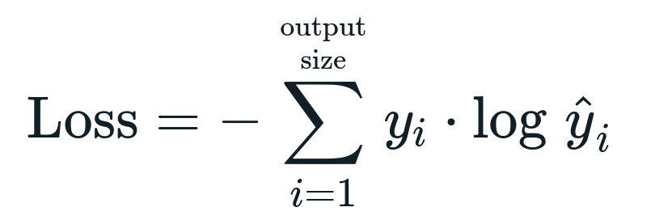

# DatasetGAN \[Eng\]

##  1. Problem definition

Current deep networks are extremely data hungry, and often require tens of thousands of labeled data to train (sometimes even more). This process of labeling is often a very expensive and time consuming one. It is especially complex in segmentation tasks, where for certain types of images, it takes a human annotator a couple hours to annotate a few images. The authors propose DatasetGAN, a network able to generate synthetic images and its corresponding segmentation labels at a fairly high precision. All you need is a few labeled examples (10~20) for the network to learn from this, and generate by itself an indefinite amount of synthetic data.

## 2. Motivation

### Related work

Recently, GANs have shown a great capacity for synthesizing high-quality images. The authors take inspiration especially from the StyleGAN’s network architecture, which has the particularity of having an additional mapping layer in the generator: this provides a disentanglement between the object identity and its underlying visual features (viewpoint, texture, color …).

Similar works of semi-supervised learning have been employed to amortize the need for large annotated datasets by employing a large set of unlabeled images and a small set of annotated images. [1] and [2] use this kind of learning to perform image segmentation by treating the segmentation network as a generator and training it adversarially with the small set of real annotations. Pseudo-labels and consistency regularization have also been studied in [3] and [4] to train semantic segmentation networks. 

### Idea

The key insight of DatasetGAN is that, in order to produce highly realistic images, generative models such as StyleGAN must learn very accurate and rich semantic knowledge in their high dimensional latent space. The authors try to exploit and interpolate the disentangled dimensions in StyleGAN in order to teach the network proper labeling, the intuition being that if the network sees a human annotation for one latent code, it will be able to propagate this knowledge across its latent space.

To recall, StyleGAN [5] brings a novelty to the traditional GAN architecture, which is that it disentangles the latent space allowing us to control the attributes at a different level. The disentanglement is done by introducing an additional mapping network that maps the input z (noise/random vector sampled from a normal distribution) to separate vector w and feed it into different levels of the layers. Hence, each part of the z input controls a different level of features.

## 3. Method

Using a StyleGAN backbone for the generator, the architecture of DatasetGAN adds a Style Interpreter block which will take as input the feature maps coming from the AdaIN (adaptive instance normalization) layers of the StyleGAN and output the segmentations and labels corresponding to the image-annotation pair.

### Style Interpreter

The style interpreter is the main component in the DatasetGAN architecture, and can be seen as the label-generating branch. As the feature maps {$S^{0}$, $S^{1}$,...$S^{k}$} are extracted from the AdaIN layers of StyleGAN, they are first upsampled to the highest resolution (resolution of $S^{k}$) and then concatenated into a 3D feature tensor. A three-layer MLP classifier is then trained on top of each feature vector to predict labels.

The way the training process works is that we first obtain a small number of synthesized images from StyleGAN. Afterwards, a human annotator annotates these images with a desired set of labels. A simple ensemble of MLP classifiers is trained on top of the preprocessed pixel-wise feature vectors to match the target human-provided labeling. A few annotated examples is sufficient for achieving good performance.

### Loss functions

During training, cross-entropy loss is used for the ensemble of MLP classifiers. The formula is shown below.

### Evaluation Metrics

The authors use Jansen-Shannon divergence as a metric to determine the uncertainty of the predicted labels. Top 10% of uncertain labels are filtered during the experiments to obtain optimal results during evaluation of the generated dataset. JS divergence is shown below.

$D_{KL}$ refers to Kullback-Leibler divergence, and the formula is as follows:

## 4. Experiment & Result

### Experimental setup

For training the style-interpreter block, images of bedrooms (40), cars (16), heads (16), birds (30) and cats (30) generated by the StyleGAN were used. All of these images were labeled by a single experienced annotator. Furthermore, random sampling of feature vectors from each vector was done to facilitate training of the classifier. An ensemble of N=10 classifiers and majority voting in each pixel at test time were used.

After obtaining the generated results (see below for examples of generated images), the authors evaluated the performance of the dataset by using it to train a segmentation network. The network trained on the generated images and its corresponding labels was then compared to two types of baselines: transfer-learning (TL) and semi-supervised baseline. For the TL baseline, the last layer of a pre-trained segmentation network (MS-COCO) was fine tuned on the same human-annotated dataset used for the style-interpreter block in a supervised way. For the semi-supervised baseline, the learning method described in [6] was leveraged by utilizing the same human-labeled images plus the unlabeled real images that the StyleGAN is trained on. The authors further compared the results to a fully supervised baseline trained on a large number of labeled real images.

Finally, the authors used Stanford Cars, Celeb-A mask, CUB, and Kaggle Cat as the test datasets. The metric used for evaluation of performance was mIOU (mean intersection over average).

### Result

Here are some examples of synthesized images from the DatasetGAN model:

As for the dataset performance results, a comparison of the number of training examples (human annotated) vs mIOU is given, and we can clearly see that among the different learning methods, the one leveraging DatasetGAN yields the best results.

## 5. Conclusion

In conclusion, the authors successfully designed, built, and trained a network that can easily generate an infinite dataset of high quality synthetic images along with their corresponding detailed annotations and labels, particularly fit for segmentation tasks. Seeing how it compares competitively with fully supervised methods, and also given how it does not require a lot of human effort for annotation, DatasetGAN presents a lot of potential for future researchers and engineers to quickly train high quality segmentation networks. It should be noted however that a lot of time may also be required to train the StyleGAN component of the network if there is no existing pre-trained network for the given image type.

### Take home message 

> DatasetGAN can facilitate training with minimal human effort by leveraging synthetic data and label generation.

## Author / Reviewer information
### Author

**안성우 \(Seong Woo AHN\)** 

* KAIST 
* Email: chrisahn99@kaist.ac.kr
* Linkedin: https://www.linkedin.com/in/seongwooa/

## Reference & Additional materials

1. Pauline Luc, Camille Couprie, Soumith Chintala, and Jakob
Verbeek. Semantic segmentation using adversarial networks.
In NIPS Workshop on Adversarial Training, 2016.
2. Nasim Souly, Concetto Spampinato, and Mubarak Shah.
Semi supervised semantic segmentation using generative adversarial network. In Proceedings of the IEEE International
Conference on Computer Vision, pages 5688–5696, 2017.
3. David Berthelot, Nicholas Carlini, Ian Goodfellow, Nicolas
Papernot, Avital Oliver, and Colin Raffel. Mixmatch: A
holistic approach to semi-supervised learning. In NeurIPS,
2019.
4. Kihyuk Sohn, David Berthelot, Chun-Liang Li, Zizhao
Zhang, Nicholas Carlini, Ekin D. Cubuk, Alex Kurakin,
Han Zhang, and Colin Raffel. Fixmatch: Simplifying semisupervised learning with consistency and confidence. In
NeurIPS, 2020.
5. Tero Karras, Samuli Laine, and Timo Aila. A style-based
generator architecture for generative adversarial networks. In
CVPR, 2019.
6. Sudhanshu Mittal, Maxim Tatarchenko, and Thomas Brox.
Semi-supervised semantic segmentation with high-and lowlevel consistency. IEEE Transactions on Pattern Analysis
and Machine Intelligence, 2019.
