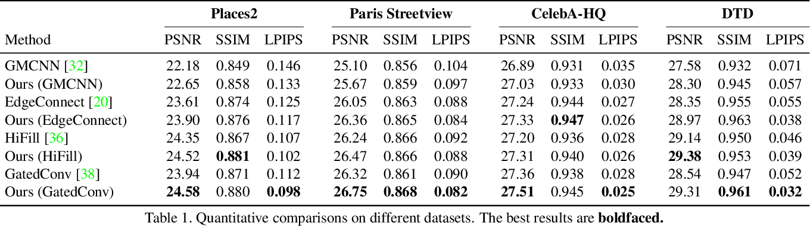

# Image Inpainting with External-internal Learning and Monochromic Bottleneck \[Eng\]

This article will analyze the idea and the results of the paper “Image Inpainting with External-internal Learning and Monochromic Bottleneck” written by Tengfei Wang, Hao Ouyang, and Qifeng Chen from The Hong Kong University of Science and Technology.

# 1. Problem Definition:

Using Deep Neural Networks, most of the recent inpainting approaches show significant improvements. Nevertheless, while filling the missing regions, they still have troubles with structure preservation and color distribution. For example, the problems of color bleeding and blunt structures might occur while performing the task. To tackle these issues, the authors of this paper introduced an external-internal inpainting approach with a monochromic bottleneck. In the following sections, we will discuss this method in details.

# 2. Motivation & Idea:

### 2.1 Why Image Inpainting?

Image inpainting is a task that aims to complete the missing regions of an image with visually realistic and semantically consistent content. In other words, the task is to replace the missing regions preserving the color and environment features. There is a plethora of practical applications of Image inpainting: image editing, recoloring, unwanted object removal. For example, while reconstruction of some area, the pictures of the area from different perspectives might be reconstructed so that some buildings would be removed. This will allow to visualize the final condition of the area and ease the process of planning the reconstruction.

Another simple example is an updated version of photoshop for famous actors and their media activity. To be more precise, such people could use the approach so as to remove some face defects or just chose brighter colors for their photo. Moreover, an ordinary person could also use it for visualization that will help to take some decisions; to illustrate, when a person wants to change the color of his hair, or buy color contact lenses and cannot decide on color, this approach will naturally reconstruct the image and visualize the final condition.

Finally, since image inpainting produces visually realistic and semantically consistent content, I believe that it could also be used in Virtual Reality (VR) and Augmentum Reality (AR), where the virtually created environment should look natural and realistic for humans.

### 2.2. Related Work:

A number of papers tried to solve the problem of image inpainting. Traditional learning-free image inpainting methods can be roughly divided into two categories:

1. **Diffusion-based:**
    
    Diffusion-based methods propagate neighboring information using such techniques as isophote direction field. However, this approach is focused on reconstructing small areas without significant objects, and thus, performs well only on texture data with narrow holes. On the other hand, it fails when the masked region is large and contains meaningful structure.

2. **Patch-based:**
    
    Patch-based methods complete the missing region by searching the patches in the whole image outside the hole using fast nearest neighbor algorithm. In other words, the approach finds similar patterns in the same image and tries to mimic the same environment basing on the alike patch. However, in many cases there are no patches that contain the same pattern as in the missing region, which results in repetitive motifs and unnatural reconstruction.

To illustrate, the authors' approach would be compared with other existing state-of-the-art inpainting methods. PatchMatch is a learning-free patch-based technique that utilizes only internal data of the provided image. Looking at the Figure 1, it is clearly seen that it generated realistic pattern with smooth color, which looks naturally; however, it failed to fill environment-aware content. On the first picture, the wires that were behind the cow just disappeared, while on the second one the road under the removed machine merged with off-road. The merit of such technique is the achieved color consistency, while the huge demerit is failing to fill semantic-aware content.

GMCNN, PartialConv, EdgeConnect, and GatedConv are the depp learning based inpainting methods that learn semantic-aware content being trained on large-scale datasets. Thus, having been trained on huge data, such approaches are able to "understand" the environment of the missing area and reconstruct it completing with logically missing objects and features. Nevertheless, their results suffer from color matching and texture smoothness. Looking at the Figure 1, it is clearly seen that color bleeding occurred. Although the wires behind the cow and the road under the car were reconstructed, their color and texture are not natural and obviously look artificial.

Figure 1.

### 2.3. Idea:

Based on the previously mentioned observations and related works, the following conclusion might be drawn: while color bleeding and texture issues seldom appeared in the internal methods, semantic-unaware content is rare in the externally-trained approaches. It was therefore proposed by the authors to combine the best of both methods by setting an intermediate bottleneck as a bridge between the external and internal learning. The approach works with monochromic images first, completes external learning from the provided large-scale datasets for predicting semantic-aware content in the missing parts, and only then performs colorizing the reconstructed image using internal learning. By focusing on the internal color distribution of a single image, the issue of abrupt colors is tackled and a visually pleasing image is obtained.

Furthermore, there is another advantage of reconstruction network from polychromatic to monochromic images, which is reducing the output dimension of the optimization space from $$R^{3}$$ to R. Thus, having been trained in this way, the complexity of training is alleviated and models show better results in generalization tasks and cross-dataset evaluations.

Finally, the authors were the first who introduced such a creative approach of the external-internal learning to deep image inpainting.

# 3. Method:

The overview architecture is depicted in the Figure 2.

Figure 2.

As it was mentioned previously, the proposed method is divided into two stages:

* External Monochromic Reconstruction
* Internal Color Restoration

The proposed method concatenates the monochromic input to the original RGB input channel-wisely, and modifies the output from polychromic to monochromic images. Then, it restores colors distribution of non-missing regions using multiple accurate one-to-one mappings from monochrome to RGB. Since non-missing regions usually consist of sufficient number of pixels, the correspondence covers most of the patterns. Nevertheless, similar monochromic inputs can map to different polychromic outputs even in a single image. Therefore, the authors designed a Progressive Color Restoration network so as to combine the local and global color context.

### Progressive Color Restoration

The network consists of a conditional generator pyramid {$$G_0, G_1, ..., G_N$$}. Then, the corresponding grayscale image pyramid {$$I^{G}_{0}, I^{G}_{1}, ..., I^{G}_{N}$$}, color distribution pyramid {$$I^{C}_{0}, I^{C}_{1}, ..., I^{C}_{N}$$}, and mask pyramid {$$M_0, M_1, ..., M_N$$} are constructed. The colorization starts from the coarsest scale and moves sequentially towards the finest scale. In the coarsest scale, the generator takes only the downsampled grayscale image:

$$I_0 = G_0(I^{G}_{0})$$

In the finest scale, the model takes both the grayscale image and upsampled color output from the previous level:

$$I_n = G_n(I^{G}_{n}⊕I^{G}_{n-1}↑)$$ , n = 1, ..., N

where ⊕ indicates concatenation in channel dimension, while ↑ indicates bilinear upsampling.

Since the ground-truth pixels are only available in the non-missing regions, the authors created a masked reconstruction loss for each generator:

$$L_n = ||(I_n-I^{c}_{n})⊙(1-M_n)||$$

where ⊙ indicates the Hadamard product. 

Finally, the authors used max-pooling for downsampling while building the mask pyramid so as to be ensured that pixels from the missing regions will not be included.

# 4. Experiments & Results:

### 4.1 Datasets

The authors evaluated the model on four public datasets:

* Places2 Standard. Contains more than 18 million
natural images from 365 scene categories. The original split was used for training and testing. All images were resized to 512 × 640 when testing.
* Paris StreetView. Contains 15,000 outdoor building
images. The original split was used for training and testing. All images were resized to 256 × 256 when testing.
* CelebA-HQ. Contains 30,000 face images. The authors randomly selected 3,000 images for testing, and others for training. All images were resized to 256 × 256 when testing.
* DTD. Contains 5,640 texture images. The authors randomly selected 840 images for testing, and others for training. All images were resized to 512 × 512 when testing.

For the evaluation, dense irregular masks were generated using the algorithm proposed in [1]. In real use-cases, there is a software that allows users to use eraser or brush to mask out the desired parts for inpainting. Thus, the proposed in [1] algorithm simulates this behavior by randomly drawing lines and rotating angles.

### 4.2 Quantative Results

Inpainting baselines:

* GMCNN [2]. A generative multi-column model, which synthesizes different image components in a parallel manner.
* EdgeConnect [3]. A two-stage adversarial method, which hallucinates missing edges first as guidance for image completion.
* HiFill [4]. A coarse-to-fine network for high resolution images with light-weight gated convolution.
* GatedConv [5]. A coarse-to-fine network based on gated convolution, which achieves state-of-the-art inpainting performance with free-form masks.

Looking at the Table 1, it is clearly seen that for different backbone networks, the proposed external-internal architecture model consistently improves the quantative results on different datasets.

### 4.2 Qualitative Results

The Figure 3 demonstrates the visual comparisons of different methods. Masked regions are visualized in red. The proposed method reconstructs the missing parts with better color distribution.

Figure 3.

Some guided colorization methods:

* Zhang et al. [6]. A deep-learning based guided colorization method that learns semantic similarities from large datasets.
* Levin et al. [7]. A quadratic optimization method that restores colors according to similar intensities.
* Gastal et al. [8]. A learning-free image processing method that is based on the edge-preserving filtering.

Looking at the Figure 4 it is clearly seen that the proposed approach tends to produce color-consistent results, while three other methods have color bleeding artifacts both on the inpainted monochromic bottleneck at the top, and natural monochrome picture at the bottom.

Figure 4.

The Figure 5 demonstrates the Users preference. The blue indicates the preference rate of the authors' solution against the corresponding baselines.

Figure 5.

The Figure 6 and the Figure 7 demonstrate the results of reconstruction quality on DTD dataset of texture images. It is clearly seen that the GatedConv and HiFill approaches have many blurred regions and lines with distortion, while the proposed model produces very natural result.

Figure 6.

Figure 7.

Another key factor that might affect the performance of internal colorization method is the number of known pixels, in other words, the size of the missing region. Thus, the Figure 8 shows the difference between the mask ratio increasing from 22.5% to 73.4%. As it could be seen, even in the case where 73.4 color pixels are missing, the model still colorizes the whole picture naturally in a harmonized style.

Figure 8.

The Figure 9 and the Figure 10 demonstrate more examples on increasing the mask ratio from 22.5% to 73.4%.

Figure 9.

Figure 10.

The authors did not hesitate to show some failure cases. The Figure 11 demonstrates both reconstruction and colorization cases. The first experiment failed to reconstruct the masked region since the mask was too large and covered a lot of features in comparison to the size of the bus. The second experiment failed to colorize the mouth because of the lack of colorization hints since the method uses internal learning for the colorization. The issue was tackled by providing one extra color point as a hint to facilitate the color restoration.

Figure 11.

Then, the authors introduced some extensions and user-guided inpainting experiments. The Figure 12 and the Figure 13 demonstrate the image editing, where a user provides an extra color hint and recolors the eyes of the person from the image.

Figure 12.

Figure 13.

The final experiment was on removing some unwanted objects or watermarks from the image. The Figure 14 shows how such objects as microphone, words, beard, and glasses can be removed.

Figure 14.

# 5. Conclusion:

The paper introduced the external-internal learning inpainting scheme with monochromic bottleneck. The key contribution of the paper is that it performs image inpainting tasks with visually better harmonized colors compared to previous approaches. The model is first trained externally from the huge datasets, reconstructs the monochromic image, and then recovers colors internally. Furthermore, the authors conducted several experiments and proved that the method leads to stable improvement both qualitatively and quantitatively on a number of backbone models. However, since the architecture requires an extra stage for colorization, it is slower than other state-of-the-art approaches. Thus, the only limitation of the introduced algorithm is the inference speed. 

I do believe that the introduced External-internal learning Image Inpainting is an awesome approach because not only does it reconstruct the images preserving the environment features and predicting the background, but also the technique colors the image naturally, which makes the output almost indistinguishable from a real image. In my opinion, should the model be accelerated, this approach will outperform all other cutting-edge techniques in all respects and become ubiquitous and standard for performing Image Inpainting.

# Take Home Message:

> Train the model Externally on large-scale datasets for predicting the environment
>
> Perform color restoration Internally on a single image
>
> Get the visually realistic and semantically consistent reconstructed image

# Reference & Additional materials

[1] Jiahui Yu, Zhe Lin, Jimei Yang, Xiaohui Shen, Xin Lu, and Thomas S Huang. Free-form image inpainting with gated convolution. In Proceedings of the IEEE International Conference on Computer Vision (ICCV), 2019.

[2] Yi Wang, Xin Tao, Xiaojuan Qi, Xiaoyong Shen, and Jiaya Jia. Image inpainting via generative multi-column convolutional neural networks. In Advances in Neural Information Processing Systems (NeurIPS), 2018.

[3] Kamyar Nazeri, Eric Ng, Tony Joseph, Faisal Qureshi, and Mehran Ebrahimi. Edgeconnect: Generative image inpainting with adversarial edge learning. In Workshop on the IEEE International Conference on Computer Vision (ICCVW), 2019.

[4] Zili Yi, Qiang Tang, Shekoofeh Azizi, Daesik Jang, and Zhan Xu. Contextual residual aggregation for ultra high-resolution image inpainting. In IEEE Conference on Computer Vision and Pattern Recognition (CVPR), pages 7508–7517, 2020.

[5] Jiahui Yu, Zhe Lin, Jimei Yang, Xiaohui Shen, Xin Lu, and Thomas S Huang. Free-form image inpainting with gated convolution. In Proceedings of the IEEE International Conference on Computer Vision (ICCV), 2019.

[6] Richard Zhang, Jun-Yan Zhu, Phillip Isola, Xinyang Geng, Angela S Lin, Tianhe Yu, and Alexei A Efros. Real-time user-guided image colorization with learned deep priors. ACM Transactions on Graphics (TOG), 9(4), 2017.

[7] Anat Levin, Dani Lischinski, and Yair Weiss. Colorization using optimization. In ACM SIGGRAPH. 2004.

[8] Eduardo SL Gastal and Manuel M Oliveira. Domain transform for edge-aware image and video processing. In ACMSIGGRAPH 2011 papers, pages 1–12. 2011.
