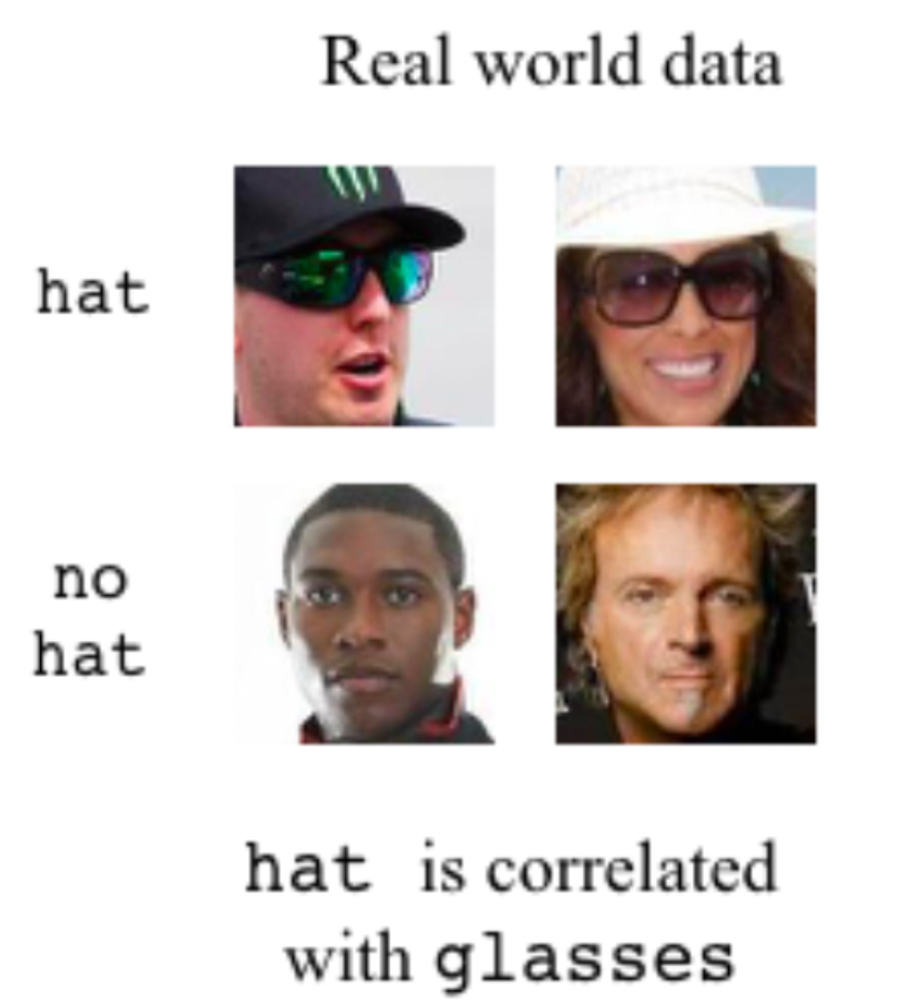
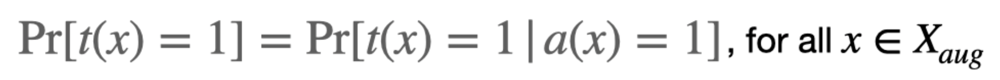
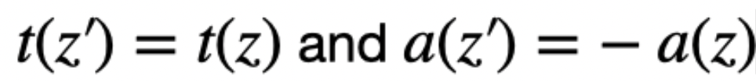
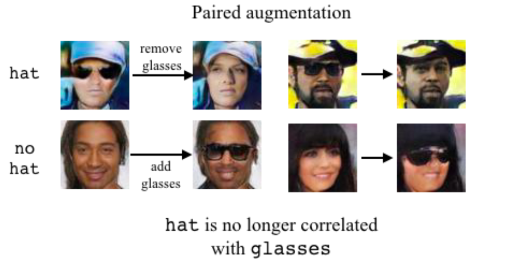
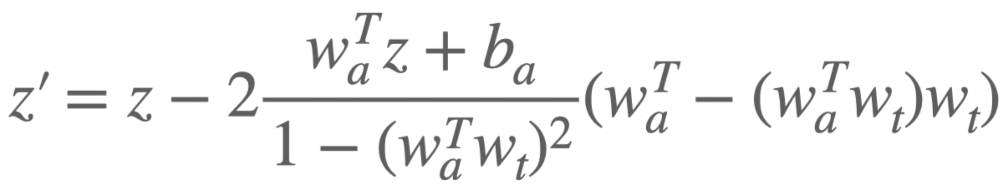
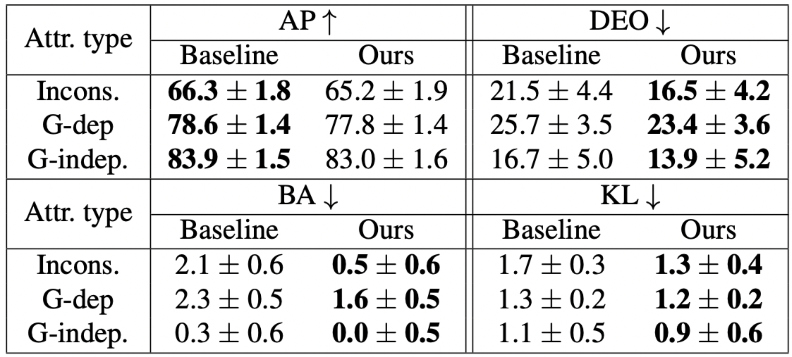

# Fair Attribute Classification through Latent Space De-biasing \[Eng\]

한국어로 쓰인 리뷰를 읽으려면 [여기](./cvpr-2021-latentspacedebiasing-kor.md)를 누르세요.

##  1. Problem definition

Until now, the performance of AI has significantly improved with the invention of various deep learning models. However, deep learning model may give a wrong judgement to a specific group in the dataset in exchange of improving the overall prediction accuracy. For example, human face recognition models developed in Western countries are likely to give poor results for Asian people. We call this phenomenon the problem of “Fairness in AI.” If the fairness of AI is not handled with care, then the AI models may behave adversely to socially or historically vulnerable group of people, which can be a serious social problem. Therefore, it is crucial to improve the fairness of AI algorithms. Nowadays, many people in AI industry are trying to find ways to strengthen the fairness of AI models while not sacrificing the overall performance significantly.

Among many ways to improve fairness, the author of the paper tries Data Augmentation via Generative Adversarial Network (GAN). During augmentation, the bias toward a specific group is removed by the manipulation of GAN’s latent space. Also, the author introduces an effective method that uses only a single GAN to overcome the problem of high algorithmic/computational complexities.

## 2. Motivation

### Related work

(1) De-biasing methods

In many cases, the unfairness of deep learning model comes from the bias in the training dataset. The commonly used approaches for this problem are either to de-bias the training data or to modify the training process. In the former case, methods such as oversampling the vulnerable groups or applying adversarial learning are introduced. In the latter case, methods such as adding a fairness-related regularization term to the model’s loss function are applied. The method presented in this paper corresponds to the former case.

(2) Generative Adversarial Network

Generative Adversarial Network (GAN) is a network composed of generator and discriminator, which have opposite roles. Generator learns to deceive discriminator with fake data, while discriminator learns to filter out the fake data from generator. As a result, well-trained GAN models can generate fake but realistic data. After a lot of modifications and improvements, GAN models are now capable of generating images that are extremely hard to distinguish from the real images. 

(3) Data augmentation through latent-space manipulation

For data augmentation, we can make use of GAN’s latent space to deform the generated images. Because latent space compresses diverse attributes of images, the image attributes such as hair color can be adjusted by manipulating the latent space. We can also create images that have difference only in a specific attribute, measure the model fairness with respect to that attribute, and figure out which attributes should be most protected in terms of fairness. With careful manipulation of latent space with respect to the protected attributes, the data augmentation process results in a de-biased training dataset.

### Idea

Latent space manipulation is an efficient way of data augmentation. GAN makes it possible to obtain additional images automatically from the original dataset, which makes the data augmentation process cost-effective. Previously, however, the training algorithm of GAN had a high computational/architectural complexity. Because new GAN model was created and trained for each protected attribute, the computation time was long when there were many protected attributes. Also, some complex GAN architectures such as image-to-image translation GAN were introduced, which made the implementation and interpretation of data augmentation more difficult. The author solves these problems by using only a single GAN trained over the entire training dataset to de-bias the dataset with repect to all protected attributes.

## 3. Method

### 3-1. De-correlation definition

The paper considers the cases where protected attribute has correlation with image label. In United States, for instance, people wearing sunglasses outdoors are likely to be also wearing hats. Thus, as shown in the figure below, there exists correlation between wearing sunglasses (protected attribute) and wearing hats (label). Consequently, if outdoor images are used directly as training data without data augmentation, then the deep learning model which determines whether a person is wearing a hat may give poor results to the people not wearing sunglasses. Therefore, it is important to perform data augmentation to training data so that the correlation between attribute and label is removed.

Let us denote “Xaug” as the de-biased dataset after data augmentation, and “a” as a protected attribute. For arbitrary x &in Xaug, let t(x) be the estimated label and a(x) the estimated attribute value. Assume the label is either -1 and 1, and the same applies to the attribute. For perfect de-biasing, the probability of t(x) = 1 should be independent of the value of a(x), as expressed below. 

### 3-2. De-correlation key idea

To obtain de-biased dataset, the author introduces a scheme that generates image pair having the same estimated label but different values of the estimated attribute. If we choose a point z in the trained GAN’s latent space, then it will convert z to a corresponding image. Let t(z) denote the label estimated for the image by the classifier, and let a(z) be the estimated attribute. The author suggests creating new point z’ in the latent space that forms a pair with z.

If the pairs (z, z’) are generated repeatedly, the set of images having a given estimated label will have a uniform attribute distribution. As a result, the generated dataset Xaug will have little correlation between the protected attribute and the label. The figure below describes how wearing glasses (protected attribute) and wearing a hat (label) are de-correlated after performing data augmentation in this way.

### 3-3. How to calculate z’

The author introduces the linear-separability assumption of latent space with respect to attributes to find an analytic expression of z’. Then it is possible to regard the functions t(z) and a(z) as hyperplanes wt and wa, respectively. Denoting the intercept of the hyperplane a(z) is as ba, the paper shows that z’ is expressed as shown below.

## 4. Experiment & Result

### Experimental setup

#### Dataset
In the experiment, the fairness of deep learning model with respect to “gender” is measured. During training, the author uses CelebA dataset that is composed of the face images of celebrities. Approximately 2M images are included in the dataset, and each image contains the information of 40 binary attributes. Among 40 attributes, the author considers the Male attribute as “gender” and regards it as the protected attribute; the other 39 attributes are used as labels during the fairness-measurement step. The 39 attributes are classified into the following three categories based on the consistency of data and the relationship with “gender”.

(1) Inconsistently Labeled : Lacks consistency when attribute values and actual images are compared.

(2) Gender-dependent : The relationship between attribute value and actual image is affected by the Male value.

(3) Geneder-independent : The others.

#### Baseline model
The baseline model is derived from a ResNet-50 model trained on ImageNet. The fully-connected layer is replaced by two linear layers with a 2,048-size hidden layer between them, and Dropout and ReLU layers are introduced. Then it is trained for 20 epochs using CelebA training dataset. The learning rate is 1e-4, and the batch size is 32. Binary cross-entropy is used as the loss function, and Adam is used as the optimization algorithm.

#### Data Augmentation
Progressive GAN is used during the de-biasing data augmentation. The latent space is set 512 dimensional, and the hyperplanes t(z) and a(z) are derived using linear SVM.

CelebA training dataset is used to train the progressive GAN. Then data augmentation is done using the trained GAN, in which 10k image are produced.

#### Evaluated model & Training setup
The model under evaluation is basically the same as the baseline model. However, it is trained using both the datasets X and Xaug, while the baseline model is trained using only the biased dataset X. The training conditions are the same as the baseline model.

#### Evaluation Metrics 
The author uses four evaluation metrics described below. The metrics except AP represent fairness, and each of them is better when it is closer to zero.

(1) AP (Average Precision) : The overall precision accuracy.

(2) DEO (Difference in Equality of Opportunity) : The difference in false negative rates for different attribute values.

(3) BA (Bias Amplification) : A measure of how more frequently the model estimates a label compared to the actual label frequency. 

(4) KL : The KL divergence between the classifier output score distributions for different attribute values. To overcome the unsymmetry of KL divergence, it is added to the KL divergence obtained by switching the two distributions.

### Result

The table below shows the evaluation results of the baseline model and the new model, on the four evaluation metrics (AP, DEO, BA, KL). Each metric is derived for each attribute group (Inconsistently Labeled, Gender-dependent, Gender-independent); each figure indicates the average of metrics calculated for the attributes in the group.

Observing the table, all of the fairness metrics (DEO, BA, KL) are improved after data augmentation. For gender-dependent attribute groups, the improvement is relatively small; the author suggests extending the data augmentation method to solve this problem, as described in Section 5 of the paper. On the other hand, the overall prediction accuracy (AP) is decreased, which can be interpreted as a trade-off between fairness and accuracy. However, the decrease of accuracy is not significant, which makes it reasonable to apply the data augmentation scheme when the model fairness is important.

## 5. Conclusion

As a way to address the fairness problem of deep learning models, the paper suggests manipulating GAN's latent space for de-biased augmentation of training dataset. The experimental results show that the method improves the model fairness while not significantly reducing the overall accuracy. Personally, I like the use of GAN for data augmentation. Because new training data is created automatically, the cost of augmentation is very low compared to manual augmentation. Also, the images from GAN are very similar to real images, which makes it possible to generate more realistic images than using traditional image processing techniques. Furthermore, only a single GAN is used during data augmentation, which makes the actual implementation easier.

### Take home message \(오늘의 교훈\)

> Un-biased dataset can be generated by manipulating GAN's latent space, thus improving the model fairness.
>
> Data augmentation with GAN is advantageous in terms of efficiency and data quality.
>
> Using only a single GAN is attractive in terms of actual implementation.

## Author / Reviewer information

### Author

김대혁 \(Kim Daehyeok\) 

* KAIST EE, U-AIM Lab.
* Research Interest : Speech Recognition, Fairness
* Contact Email : kimshine@kaist.ac.kr

### Reviewer

1. Korean name \(English name\): Affiliation / Contact information
2. Korean name \(English name\): Affiliation / Contact information
3. ...

## Reference & Additional materials

1. Ramaswamy, Vikram V., Sunnie SY Kim, and Olga Russakovsky. "Fair attribute classification through latent space de-biasing." Proceedings of the IEEE/CVF Conference on Computer Vision and Pattern Recognition. 2021.
2. https://github.com/princetonvisualai/gan-debiasing
3. Rameen Abdal, Yipeng Qin, and Peter Wonka. Im- age2StyleGAN: How to embed images into the StyleGAN latent space? In Proceedings of the IEEE/CVF International Conference on Computer Vision (ICCV), 2019.
4. Mohsan Alvi, Andrew Zisserman, and Christoffer Nella ̊ker. Turning a blind eye: Explicit removal of biases and variation from deep neural network embeddings. In Proceedings of the European Conference on Computer Vision (ECCV), 2018.
5. Sina Baharlouei, Maher Nouiehed, Ahmad Beirami, and Meisam Razaviyayn. Re ́nyi fair inference. In Proceedings of the International Conference on Learning Representations (ICLR), 2020.
6. GuhaBalakrishnan,YuanjunXiong,WeiXia,andPietroPer- ona. Towards causal benchmarking of bias in face analysis algorithms. In Proceedings of European Conference on Com- puter Vision (ECCV), 2020.
7. DavidBau,Jun-YanZhu,JonasWulff,WilliamPeebles,Hen- drik Strobelt, Bolei Zhou, and Antonio Torralba. Seeing what a GAN cannot generate. In Proceedings of the IEEE/CVF International Conference on Computer Vision (ICCV), 2019.
8. RachelK.E.Bellamy,KuntalDey,MichaelHind,SamuelC. Hoffman, Stephanie Houde, Kalapriya Kannan, Pranay Lo- hia, Jacquelyn Martino, Sameep Mehta, Aleksandra Mo- jsilovic, Seema Nagar, Karthikeyan Natesan Ramamurthy, John Richards, Diptikalyan Saha, Prasanna Sattigeri, Monin- der Singh, Kush R. Varshney, and Yunfeng Zhang. AI Fairness 360: An extensible toolkit for detecting, understanding, and mitigating unwanted algorithmic bias, Oct. 2018.
9. Steffen Bickel, Michael Bru ̈ckner, and Tobias Scheffer. Dis- criminative learning under covariate shift. Journal of Machine Learning Research, 10(Sep):2137–2155, 2009.
10. Tolga Bolukbasi, Kai-Wei Chang, James Y Zou, Venkatesh Saligrama, and Adam T Kalai. Man is to computer program- mer as woman is to homemaker? debiasing word embeddings. In Advances in Neural Information Processing Systems, pages 4349–4357, 2016.
11. Joy Buolamwini and Timnit Gebru. Gender shades: Intersec- tional accuracy disparities in commercial gender classification. In Proceedings of the Conference on Fairness, Accountability, and Transparency, pages 77–91, 2018.
12. Toon Calders, Faisal Kamiran, and Mykola Pechenizkiy. Building classifiers with independency constraints. In 2009 IEEE International Conference on Data Mining Workshops, pages 13–18. IEEE, 2009.
13. Mingliang Chen and Min Wu. Towards threshold invariant fair classification. In Proceedings of the Conference on Un- certainty in Artificial Intelligence (UAI), 2020. 
14. Kristy Choi, Aditya Grover, Rui Shu, and Stefano Ermon. Fair generative modeling via weak supervision. In Proceedings of the International Conference on Machine Learning (ICML), 2020. 
15. Yunjey Choi, Minje Choi, Munyoung Kim, Jung-Woo Ha, Sunghun Kim, and Jaegul Choo. StarGAN: Unified genera- tive adversarial networks for multi-domain image-to-image translation. In Proceedings of the IEEE Conference on Computer Vision and Pattern Recognition, 2018.
16. Emily Denton, Ben Hutchinson, Margaret Mitchell, and Timnit Gebru. Image counterfactual sensitivity analysis for detecting unintended bias. In CVPR 2019 Workshop on Fair- ness Accountability Transparency and Ethics in Computer Vision, 2019.
17. Charles Elkan. The foundations of cost-sensitive learning. In Proceedings of the International Joint Conferences on Artificial Intelligence (IJCAI), volume 17, pages 973–978. Lawrence Erlbaum Associates Ltd, 2001.
18. FAIR HDGAN. Pytorch GAN Zoo.
19. Ian Goodfellow, Jean Pouget-Abadie, Mehdi Mirza, Bing Xu, David Warde-Farley, Sherjil Ozair, Aaron Courville, and Yoshua Bengio. Generative adversarial nets. In Advances in Neural Information Processing Systems, pages 2672–2680, 2014.
20. Ishaan Gulrajani, Faruk Ahmed, Martin Arjovsky, Vincent Dumoulin, and Aaron C Courville. Improved training of Wasserstein GANs. In Advances in Neural Information Pro- cessing Systems, pages 5767–5777, 2017.
21. Moritz Hardt, Eric Price, and Nati Srebro. Equality of oppor- tunity in supervised learning. In Advances in Neural Informa- tion Processing Systems, pages 3315–3323, 2016.
22. Bharath Hariharan and Ross Girshick. Low-shot visual recog- nition by shrinking and hallucinating features. In Proceedings of the IEEE/CVF International Conference on Computer Vi- sion (ICCV), pages 3018–3027, 2017.
23. Kaiming He, Xiangyu Zhang, Shaoqing Ren, and Jian Sun. Deep residual learning for image recognition. In Proceedings of the IEEE/CVF Conference on Computer Vision and Pattern Recognition (CVPR), pages 770–778, 2016.
24. Lisa Anne Hendricks, Kaylee Burns, Kate Saenko, Trevor Darrell, and Anna Rohrbach. Women also snowboard: Over- coming bias in captioning models. In Proceedings of Euro- pean Conference on Computer Vision (ECCV), pages 793– 811. Springer, 2018.
25. Khari Johnson. Google Cloud AI removes gender labels from Cloud Vision API to avoid bias, 02 2020.
26. Tero Karras, Timo Aila, Samuli Laine, and Jaakko Lehtinen. Progressive growing of GANs for improved quality, stability, and variation. In Proceedings of the International Conference on Learning Representations (ICLR), 2018.
27. Tero Karras, Samuli Laine, and Timo Aila. A style-based generator architecture for generative adversarial networks. In Proceedings of the IEEE/CVF Conference on Computer Vision and Pattern Recognition (CVPR), pages 4401–4410, 2019.
28. Diederik P Kingma and Jimmy Ba. Adam: A method for stochastic optimization. In Proceedings of the International Conference on Learning Representations (ICLR), 2015.
29. Steven Liu, Tongzhou Wang, David Bau, Jun-Yan Zhu, and Antonio Torralba. Diverse image generation via self- conditioned GANs. In Proceedings of the IEEE/CVF Confer- ence on Computer Vision and Pattern Recognition (CVPR), 2020.
30. Ziwei Liu, Ping Luo, Xiaogang Wang, and Xiaoou Tang. Deep learning face attributes in the wild. In Proceedings of the IEEE/CVF International Conference on Computer Vision (ICCV), pages 3730–3738, 2015.
31. Vishnu Suresh Lokhande, Aditya Kumar Akash, Sathya N. Ravi, and Vikas Singh. FairALM: Augmented lagrangian method for training fair models with little regret. In Proceed- ings of European Conference on Computer Vision (ECCV), 2020.
32. Junhyun Nam, Hyuntak Cha, Sungsoo Ahn, Jaeho Lee, and Jinwoo Shin. Learning from failure: Training debiased classi- fier from biased classifier. In Advances in Neural Information Processing Systems, 2020.
33. F. Pedregosa, G. Varoquaux, A. Gramfort, V. Michel, B. Thirion, O. Grisel, M. Blondel, P. Prettenhofer, R. Weiss, V. Dubourg, J. Vanderplas, A. Passos, D. Cournapeau, M. Brucher, M. Perrot, and E. Duchesnay. Scikit-learn: Machine learning in Python. Journal of Machine Learning Research, 12:2825–2830, 2011.
34. Olga Russakovsky, Jia Deng, Hao Su, Jonathan Krause, San- jeev Satheesh, Sean Ma, Zhiheng Huang, Andrej Karpathy, Aditya Khosla, Michael Bernstein, et al. Imagenet large scale visual recognition challenge. International Journal of Com- puter Vision, 115(3):211–252, 2015.
35. Hee Jung Ryu, Hartwig Adam, and Margaret Mitchell. Inclu- siveFaceNet: Improving face attribute detection with race and gender diversity. In International Conference on Machine Learning (ICML) FATML Workshop, 2018.
36. Tim Salimans, Ian Goodfellow, Wojciech Zaremba, Vicki Cheung, Alec Radford, and Xi Chen. Improved techniques for training GANs. In Advances in Neural Information Pro- cessing Systems, pages 2234–2242, 2016.
37. PrasannaSattigeri,SamuelCHoffman,VijilChenthamarak- shan, and Kush R Varshney. Fairness GAN: Generating datasets with fairness properties using a generative adver- sarial network. IBM Journal of Research and Development, 63(4/5):3–1, 2019.
38. ViktoriiaSharmanska,LisaAnneHendricks,TrevorDarrell, and Novi Quadrianto. Contrastive examples for addressing the tyranny of the majority, 2020.
39. Yujun Shen, Jinjin Gu, Xiaoou Tang, and Bolei Zhou. Inter- preting the latent space of GANs for semantic face editing. In Proceedings of the IEEE/CVF Conference on Computer Vision and Pattern Recognition, pages 9243–9252, 2020.
40. AngelinaWang,ArvindNarayanan,andOlgaRussakovsky. REVISE: A tool for measuring and mitigating bias in visual datasets. In Proceedings of the European Conference on Computer Vision (ECCV), 2020.
41. Angelina Wang and Olga Russakovsky. Directional bias amplification. arXiv preprint arXiv:2102.12594, 2021.
42. TianluWang,JieyuZhao,MarkYatskar,Kai-WeiChang,and Vicente Ordonez. Balanced datasets are not enough: Estimat- ing and mitigating gender bias in deep image representations. In Proceedings of the IEEE/CVF International Conference on Computer Vision (ICCV), pages 5310–5319, 2019.
43. ZeyuWang,KlintQinami,IoannisKarakozis,KyleGenova, Prem Nair, Kenji Hata, and Olga Russakovsky. Towards fairness in visual recognition: Effective strategies for bias mitigation. In Proceedings of the IEEE/CVF Conference on Computer Vision and Pattern Recognition (CVPR), 2020.
44. Depeng Xu, Shuhan Yuan, Lu Zhang, and Xintao Wu. Fair- GAN: Fairness-aware generative adversarial networks. In 2018 IEEE International Conference on Big Data (Big Data), pages 570–575. IEEE, 2018.
45. Kaiyu Yang, Klint Qinami, Li Fei-Fei, Jia Deng, and Olga Russakovsky. Towards fairer datasets: Filtering and balancing the distribution of the people subtree in the imagenet hierarchy. In Proceedings of the Conference on Fairness, Accountability, and Transparency, pages 547–558, 2020.
46. Muhammad Bilal Zafar, Isabel Valera, Manuel Gomez Ro- driguez, and Krishna P Gummadi. Fairness beyond disparate treatment & disparate impact: Learning classification without disparate mistreatment. In Proceedings of the International Conference on World Wide Web (WWW), pages 1171–1180, 2017.
47. Brian Hu Zhang, Blake Lemoine, and Margaret Mitchell. Mitigating unwanted biases with adversarial learning. In Proceedings of the AAAI/ACM Conference on AI, Ethics, and Society (AIES), pages 335–340, 2018.
48. Jieyu Zhao, Tianlu Wang, Mark Yatskar, Vicente Ordonez, and Kai-Wei Chang. Men also like shopping: Reducing gen- der bias amplification using corpus-level constraints. In Pro- ceedings of the Conference on Empirical Methods in Natural Language Processing (EMNLP), 2017.
49. Jiapeng Zhu, Yujun Shen, Deli Zhao, and Bolei Zhou. In- domain GAN inversion for real image editing. In Proceedings of European Conference on Computer Vision (ECCV), 2020.
50. XinyueZhu,YifanLiu,JiahongLi,TaoWan,andZengchang Qin. Emotion classification with data augmentation using generative adversarial networks. In Dinh Phung, Vincent S. Tseng, Geoffrey I. Webb, Bao Ho, Mohadeseh Ganji, and Lida Rashidi, editors, Advances in Knowledge Discovery and Data Mining (KDD), pages 349–360, Cham, 2018. Springer International Publishing.

