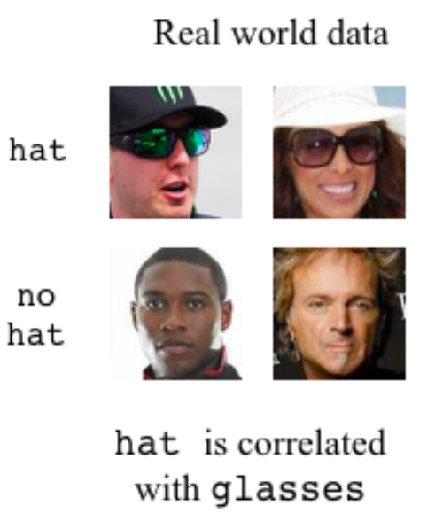
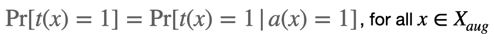
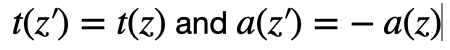
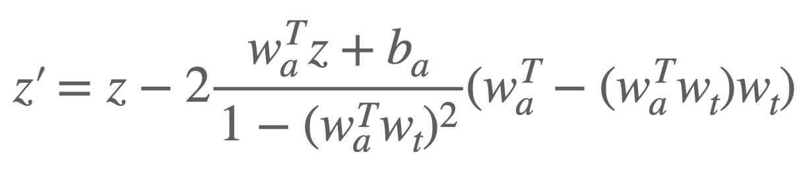

# Fair Attribute Classification through Latent Space De-biasing \[Kor\]

[English version](./cvpr-2021-latentspacedebiasing-eng.md) of this article is available.

##  1. Problem definition

지금까지 수많은 딥러닝 모델이 개발되면서 인공지능의 성능은 크게 향상되었다. 그러나 모델들 대부분은 데이터셋의 전반적인 예측 정확도에 초점을 두고 개발되었기 때문에, 모델이 데이터셋 내의 특정 집단에 대해 불리한 판단을 내릴 여지가 존재한다. 예를 들어, 서구권 국가에서 개발된 얼굴 인식 AI의 경우 아시아인의 얼굴을 백인의 얼굴보다 더 부정확하게 판별할 가능성이 높다. 우리는 이와 같은 현상을 가리켜 '인공지능의 공정성 문제'라 부른다. 아무리 인공지능의 성능이 좋아진다고 해도, 인공지능의 공정성 문제가 해결되지 않는다면 인공지능 모델은 장애인이나 노인과 같이 사회적으로 소외받는 집단에 대해 잘못된 판단을 쉽게 내릴 수 있을 것이고, 이는 심각한 사회 문제를 초래할 것이다. 그러므로 인공지능을 더욱 공정하게 만드는 것은 매우 중요한 일인데, 최근 인공지능 학계에서는 인공지능의 성능을 크게 희생하지 않으면서도 공정성을 향상시킬 수 있는 방법에 대해 활발하게 연구가 이루어지고 있다.

딥러닝 모델의 공정성을 향상시키는 방법은 다양한데, 논문의 저자는 적대적 생성 신경망(GAN)을 통한 데이터 증강(Data Augmentation)을 시도한다. 즉 GAN을 이용해 그럴듯한 이미지들을 생성한 뒤 이들의 잠재 공간(latent space)을 수정함으로써, 특정 집단에 대한 편향성이 제거되도록 훈련 데이터셋을 늘리는 방식이다. 지금까지 이와 비슷한 연구는 이전에도 있었으나, 알고리즘이 더욱 복잡해지고 연산량이 늘어난다는 단점이 있었다. 반면에 논문 저자는 단 하나의 GAN을 사용하는, 간단하고 효과적인 데이터 증강 방법을 제시한다.

## 2. Motivation

### Related work

(1) De-biasing methods

많은 경우에 딥러닝 모델의 불공정성은 훈련 데이터에 내재된 편향성에 의해 생겨난다. 이를 해결하기 위해 훈련데이터의 편향성을 줄이는 방법을 쓰기도 하고, 모델의 학습 과정을 보완하는 방법을 쓰기도 한다. 훈련 데이터의 편향성을 줄이는 방법으로는 취약 집단을 대상으로 오버샘플링을 적용하는 방법, 적대적 학습을 이용하는 방법 등이 있다. 모델의 학습 과정을 보완하는 방법으로는 모델의 손실함수(loss function)에 공정성과 관련된 규제(regularization) 항을 추가하는 방법 등이 있다. 이 논문에서는 공정성 향상을 위해 훈련데이터의 편향성을 줄이는 방법을 이용한다.

(2) Generative Adversarial Network (GAN)

적대적 생성 신경망(GAN)은 생성자와 판별자로 이루어진 신경망인데, 여기서 생성자의 학습 방식과 판별자의 학습 방식은 적대적인 관계에 있다. 즉 생성자는 자기가 거짓으로 만들어 낸 데이터를 판별자가 가짜로 인식하지 못하도록 학습하고, 판별자는 생성자가 자기를 속이지 못하도록 학습한다. 이와 같이 적대적인 학습을 시킴으로써 진짜처럼 보이는 가짜 데이터를 만들어 내는 신경망이 바로 적대적 생성 신경망이다. 그동안 적대적 생성 신경망은 많은 개선을 거쳤고, 이제는 현실과 구분하기 매우 어려운 이미지를 생성할 수 있을 정도가 되었다.  

(3) Data augmentation through latent-space manipulation

생성된 이미지를 변형시키기 위해 GAN의 잠재 공간을 조작해 볼 수 있다. 여기서 잠재 공간이란 생성자가 랜덤하게 이미지를 생성하는 데 이용하는 특성들의 공간으로, 잠재 공간에는 이미지의 다양한 속성이 압축되어 있다. 잠재 공간을 잘 조작한다면 이미지에 특정 속성(머리 색, 안경 착용 여부 등)을 부여하거나 이를 조절하는 것이 가능하다. 또한 특정 속성에 대해서만 각기 다른 속성값을 가진 이미지들을 생성함으로써 딥러닝 모델이 해당 속성에 대해 얼마나 불공정성을 지니고 있는 지 측정해 볼 수 있으며, 딥러닝 모델의 불공정성과 가장 크게 연관되어 있는 속성을 찾아낼 수도 있다. 이와 같이 GAN의 잠재 공간을 적잘히 이용한다면, 속성 편향성이 해소되는 방향으로 훈련 데이터를 증강하는 것이 가능하다.

### Idea

GAN의 잠재 공간을 조작하여 훈련 데이터의 편향성을 조절하는 것은 효율적인 데이터 증강 방법이라 할 수 있다. GAN을 이용하면 이미 가진 훈련 데이터만을 이용해서 새로운 이미지를 만들어 낼 수 있고, 따라서 훈련 데이터를 추가적으로 수집하기 위해 돈과 시간을 낭비할 필요가 줄어들기 때문이다. 그러나 이러한 데이터 증강 방식을 위해 기존에 사용되었던 훈련 방법들은 연산량이나 GAN 모델의 구조적 복잡성의 측면에서 분명히 단점을 지녔다. 편향성을 제거하고자 하는 속성이 있을 때마다 새로운 GAN 모델을 만들어 훈련시켰으므로, 고려되는 속성이 여러 개일 경우에는 연산 시간이 길어진다는 문제가 있었다. 그리고 image-to-image translation GAN과 같은 복잡한 구조의 GAN을 이용하므로, 알고리즘의 복잡도가 증가한다는 문제도 있었다. 이러한 문제점들을 해결하기 위해 논문 저자는 데이터셋 전체에서 훈련된 단 하나의 GAN을 이용해 모든 속성의 편향을 개선하는 방법을 이용한다. 

## 3. Method

### 3-1. De-correlation definition

이 논문에서는 이미지의 속성과 레이블 간에 상관관계가 있는 경우를 다룬다. 예를 들어, 미국에서는 야외에서 선글라스를 쓰고 다니는 사람이 모자도 같이 착용하고 있는 경우가 많다. 그러므로, 아래의 사진에서와 같이, 선글라스를 쓰는 것(속성)과 모자의 착용 여부(레이블) 사이에 상관관계가 존재한다고 할 수 있다. 이러한 상황에서 야외 이미지들을 데이터 증강을 거치지 않고 바로 훈련 데이터로 사용한다면, 모자의 착용 여부를 판단하는 딥러닝 모델은 선글라스를 쓴 사람들보다 선글라스를 쓰지 않은 사람들에 대해 더 부정확한 예측을 내 놓을 수 있다. 그러므로 사전에 속성과 레이블 간의 상관관계가 제거되도록 훈련 데이터에 대해 데이터 증강 작업을 거치는 것은 중요하다. 

데이터 증강을 거쳐 편향성이 제거된 데이터셋을 Xaug 이라 하고, 공정성과 관련해서 고려하는 속성을 a 라고 하자. 딥러닝 모델이 임의의 x &in; Xaug 에 대하여 예측하는 레이블 값을 t(x)라 정의하고 x의 예측 속성값을 a(x)라 하자. 가능한 레이블은 -1 또는 1 뿐이라고 가정하고, 속성값에 대해서도 똑같이 가정하자. 그렇다면 t(x)=1일 확률은 a(x)의 값과 무관해야 하며, 수식으로 표현하면 아래와 같다. 

### 3-2. De-correlation key idea

이 논문에서는 편향성이 제거된 데이터셋을 만들기 위해 예측 레이블은 동일하면서 예측 속성값은 서로 반대인 이미지 쌍을 생성하는 방법을 이용한다. GAN 모델이 기존 데이터셋에 대해 훈련을 마쳤다고 가정하자. 잠재 공간 내에서 임의로 z라는 점을 선택하면, GAN 모델은 점 z을 특정한 이미지로 변환할 것이다. 그 이미지에 대해 분류기 모델이 예측하는 레이블을 t(z)라 하고 예측 속성값을 a(z)라고 하자. 논문에서는 이때 아래의 조건을 만족하는 잠재 공간 내의 점 z’ 생성하여 z와 쌍을 이루게 한다.

이런 식으로 모든 z에 대해 쌍을 만든다면, 에측 레이블이 주어졌을 때 그에 해당하는 이미지들이 균등한 예측 속성 분포를 가질 것이다. 그러므로 최종적으로 얻어지는 데이터셋 Xaug은 속성과 레이블 간의 상관 관계가 해소되었다고 할 수 있다. 아래의 사진은 (z, z') 쌍을 생성하는 식으로 데이터 증강을 함으로써 속성(안경 착용 여부)과 레이블(모자 착용 여부) 사이의 상관 관계를 제거한 결과를 보여준다.

### 3-3. How to calculate z’

논문 저자는 z'을 해석적으로 구하기 위하여, 잠재 공간이 속성에 대해 선형 분리가 가능하다(linearly separable)는 가정을 도입한다. 그러면 두 함수 t(z)와 a(z)를 각각 초평면 wt와 wa 라 간주하는 것이 가능하다. 여기서 a(z)의 절편을 ba이라 할 때, z'의 식은 논문에 의하면 아래와 같다.

## 4. Experiment & Result

### Experimental setup

#### Dataset
해당 논문에서는 딥러닝 모델의 '성별'에 따른 공정성을 측정하는 실험을 한다. 즉 성별을 제외한 속성들의 값을 예측할 때, 예측 결과가 성별에 따라 얼마나 차이를 보이는 지 측정한다. 저자는 실험을 위해, 유명인의 얼굴 사진으로 이루어진 데이터셋인 CelebA를 이용한다. 여기에는 약 200만 개의 이미지가 들어 있고. 각 이미지에는 40개의 이진 속성(binary attributes)에 대한 정보가 담겨 있다. 저자는 40개의 속성 중 Male 속성을 '성별'로 간주하고 모델의 훈련에 이용하며, Male을 제외한 나머지 39개의 속성은 공정성 측정 단계에서 레이블로 이용한다. 논문에서는 39개의 속성을 데이터의 일관성 및 성별과의 연관성에 따라 아래의 세 가지 범주로 분류한다.

(1) Inconsistently Labeled : 속성값과 실제 이미지를 비교했을 때 일관성이 부족한 경우

(2) Gender-dependent : 속성값과 실제 이미지 간의 관계가 Male 여부에 영향을 받는 경우

(3) Geneder-independent : 그 외의 경우

#### Baseline model
실험에서 사용되는 기준 모델(baseline model)로서 사전에 ImageNet에서 훈련된 ResNet-50 모델을 이용한다. 해당 모델에서 완전연결 계층(fully-connected layer)은 크기 2,048의 은닉층을 사이에 둔 이중 선형 레이어로 교체되며, 드롭아웃 및 ReLU가 도입된다. 그런 다음 CelebA 훈련 데이터셋을 이용하여 이 모델을 20 에포크(epoch)동안 학습시킨다. 학습률은 1e-4이고, 배치 사이즈는 32이다. 손실함수로 이진 크로스 엔트로피(binary cross entropy)가 사용되며, 최적화 알고리즘으로는 Adam을 이용한다.

#### Data Augmentation
편향성 제거를 위한 데이터 증강 과정에서 점진적 GAN (Progressive GAN)을 이용한다. 내재 공간은 512차원으로 설정하며, 초평면 t(z)와 a(z)는 선형 서포트 벡터 머신(linear SVM)을 통해 학습시킨다. 

점진적 GAN을 학습시킬 때 사용하는 데이터셋은 CelebA 훈련 데이터셋이다. 학습이 끝나면 이미지 데이터셋 Xaug을 얻어 데이터 증강을 하는데, 여기에는 1만 개의 이미지가 포함된다. 

#### Evaluated model & Training setup
평가의 대상이 되는 모델은 기준 모델과 동일한 것이다. 그러나 기준 모델이 원래의 편향된 데이터셋 X 상에서 훈련되는 것과는 달리, 평가 모델은 데이터셋 X와 Xaug을 함께 이용하여 훈련된다. 평가 모델의 훈련은 기준 모델의 훈련과 동일하게 이루어진다.

#### Evaluation Metrics 
논문에서는 분류 모델의 평가를 위해 다음의 네 지표를 사용한다. 공정성을 평가할 때는 AP을 제외한 나머지 세 지표를 이용하며, 셋 모두 0에 가까울수록 좋은 것으로 간주한다.

(1) AP (Average Precision) : 전반적인 예측 정확도이다.

(2) DEO (Difference in Equality of Opportunity) : 속성값에 따른 거짓 음성률의 차이이다.

(3) BA (Bias Amplification) : 속성값이 주어졌을 때 레이블값을 실제 데이터에 비해 얼마나 더 자주 예측하는 지 측정하는 지표이다. 음수값은 편향성이 훈련 데이터와 다른 방향으로 형성되어 있음을 암시한다.

(4) KL : 속성값에 따른 분류기 출력 점수 분포 간의 KL 발산이다. KL 발산의 비대칭성을 보완하기 위해 두 분포의 순서를 바꾸어서 얻은 KL 발산값을 더해 준다.

### Result

아래 표는 기존 모델과 논문의 모델을 네 가지 지표(AP, DEO, BA, KL)를 통해 평가한 결과이다. 각각의 지표는 세 속성 그룹 (Inconsistently Labeled, Gender-dependent, Gender-independent)에 대해 평가되는데, 표에 적힌 값들은 그룹 내 속성 각각에 대한 지표를 평균한 것이다.

표를 보면 데이터 증강 후 세 공정성 지표(DEO, BA, KL)가 모두 이전보다 개선된 것을 알 수 있다. 성별 의존적(Gender-dependent) 속성 집단의 경우 다른 집단에 비해 공정성의 향상이 약하게 이루어진 것을 볼 수 있는데, 저자에 따르면 논문의 Section 5에 설명된 것처럼 데이터 증강 방법을 확장함으로써 이 문제를 개선하는 것이 가능하다. 한편 전반적인 예측 정확도(AP)는 감소한 것을 볼 수 있는데, 이는 공정성을 향상시키기 위해 정확도를 약간 희생한 것으로 생각할 수 있다. 정확도의 감소 폭이 크지 않기 때문에, 모델의 공정성이 중요한 경우 이 논문의 데이터 증강 방법을 이용하는 것은 괜찮은 시도라고 할 수 있다. 

## 5. Conclusion

이 논문에서는 딥러닝 모델의 공정성 문제를 해결하기 위해 GAN 모델의 잠재 공간을 이용하여 편향성이 제거된 데이터셋을 생성하고 이를 이용해 원래의 훈련 데이터셋을 증강하는 방법을 이용하였다. 그리고 실험을 통해, 이 방법이 모델의 정확도를 크게 희생하지 않으면서 공정성을 높일 수 있는 방법이라는 것을 확인할 수 있었다. 개인적으로, 데이터 증강을 위해 GAN을 이용하는 것은 매력적인 방법이라 생각한다. 새로운 훈련 데이터를 GAN을 통해 자동으로 생성할 수 있으므로, 수작업으로 하는 것에 비하면 데이터 증강에 드는 시간 및 비용이 매우 적다. 또한 GAN에서 생성되는 이미지가 실제 이미지와 매우 비슷하므로, 고전적인 영상 처리 방법을 이용하는 것에 비해 더욱 자연스러운 이미지를 만들어낼 수 있을 것이다. 또한, 이 논문의 데이터 증강 방법에서 오직 한 개의 GAN 모델이 이용되므로, 논문에서 제시한 방법은 실제 구현 난이도 측면에서 이점이 있다고 생각한다.

### Take home message \(오늘의 교훈\)

> GAN의 내재 공간을 이용해 속성과 레이블 간의 상관관계가 제거된 훈련 데이터셋을 만들 수 있고, 이를 통해 딥러닝 모델의 공정성을 향상시킬 수 있다.
>
> GAN을 이용해 데이터 증강을 하는 것은 효율성 및 데이터 품질 면에서 장점이 있다.
>
> 단 하나의 GAN 모델을 이용한다는 점은 실제 구현의 측면에서 매력적이다.

## Author / Reviewer information

### Author

김대혁 \(Kim Daehyeok\) 

* KAIST 전기및전자공학부, U-AIM 연구실
* 관심 분야 : 음성인식 및 공정성
* 연락 이메일 : kimshine@kaist.ac.kr

### Reviewer

1. Korean name \(English name\): Affiliation / Contact information
2. Korean name \(English name\): Affiliation / Contact information
3. ...

## Reference & Additional materials

1. Ramaswamy, Vikram V., Sunnie SY Kim, and Olga Russakovsky. "Fair attribute classification through latent space de-biasing." Proceedings of the IEEE/CVF Conference on Computer Vision and Pattern Recognition. 2021.
2. https://github.com/princetonvisualai/gan-debiasing
3. Rameen Abdal, Yipeng Qin, and Peter Wonka. Im- age2StyleGAN: How to embed images into the StyleGAN latent space? In Proceedings of the IEEE/CVF International Conference on Computer Vision (ICCV), 2019.
4. Mohsan Alvi, Andrew Zisserman, and Christoffer Nella ̊ker. Turning a blind eye: Explicit removal of biases and variation from deep neural network embeddings. In Proceedings of the European Conference on Computer Vision (ECCV), 2018.
5. Sina Baharlouei, Maher Nouiehed, Ahmad Beirami, and Meisam Razaviyayn. Re ́nyi fair inference. In Proceedings of the International Conference on Learning Representations (ICLR), 2020.
6. GuhaBalakrishnan,YuanjunXiong,WeiXia,andPietroPer- ona. Towards causal benchmarking of bias in face analysis algorithms. In Proceedings of European Conference on Com- puter Vision (ECCV), 2020.
7. DavidBau,Jun-YanZhu,JonasWulff,WilliamPeebles,Hen- drik Strobelt, Bolei Zhou, and Antonio Torralba. Seeing what a GAN cannot generate. In Proceedings of the IEEE/CVF International Conference on Computer Vision (ICCV), 2019.
8. RachelK.E.Bellamy,KuntalDey,MichaelHind,SamuelC. Hoffman, Stephanie Houde, Kalapriya Kannan, Pranay Lo- hia, Jacquelyn Martino, Sameep Mehta, Aleksandra Mo- jsilovic, Seema Nagar, Karthikeyan Natesan Ramamurthy, John Richards, Diptikalyan Saha, Prasanna Sattigeri, Monin- der Singh, Kush R. Varshney, and Yunfeng Zhang. AI Fairness 360: An extensible toolkit for detecting, understanding, and mitigating unwanted algorithmic bias, Oct. 2018.
9. Steffen Bickel, Michael Bru ̈ckner, and Tobias Scheffer. Dis- criminative learning under covariate shift. Journal of Machine Learning Research, 10(Sep):2137–2155, 2009.
10. Tolga Bolukbasi, Kai-Wei Chang, James Y Zou, Venkatesh Saligrama, and Adam T Kalai. Man is to computer program- mer as woman is to homemaker? debiasing word embeddings. In Advances in Neural Information Processing Systems, pages 4349–4357, 2016.
11. Joy Buolamwini and Timnit Gebru. Gender shades: Intersec- tional accuracy disparities in commercial gender classification. In Proceedings of the Conference on Fairness, Accountability, and Transparency, pages 77–91, 2018.
12. Toon Calders, Faisal Kamiran, and Mykola Pechenizkiy. Building classifiers with independency constraints. In 2009 IEEE International Conference on Data Mining Workshops, pages 13–18. IEEE, 2009.
13. Mingliang Chen and Min Wu. Towards threshold invariant fair classification. In Proceedings of the Conference on Un- certainty in Artificial Intelligence (UAI), 2020. 
14. Kristy Choi, Aditya Grover, Rui Shu, and Stefano Ermon. Fair generative modeling via weak supervision. In Proceedings of the International Conference on Machine Learning (ICML), 2020. 
15. Yunjey Choi, Minje Choi, Munyoung Kim, Jung-Woo Ha, Sunghun Kim, and Jaegul Choo. StarGAN: Unified genera- tive adversarial networks for multi-domain image-to-image translation. In Proceedings of the IEEE Conference on Computer Vision and Pattern Recognition, 2018.
16. Emily Denton, Ben Hutchinson, Margaret Mitchell, and Timnit Gebru. Image counterfactual sensitivity analysis for detecting unintended bias. In CVPR 2019 Workshop on Fair- ness Accountability Transparency and Ethics in Computer Vision, 2019.
17. Charles Elkan. The foundations of cost-sensitive learning. In Proceedings of the International Joint Conferences on Artificial Intelligence (IJCAI), volume 17, pages 973–978. Lawrence Erlbaum Associates Ltd, 2001.
18. FAIR HDGAN. Pytorch GAN Zoo.
19. Ian Goodfellow, Jean Pouget-Abadie, Mehdi Mirza, Bing Xu, David Warde-Farley, Sherjil Ozair, Aaron Courville, and Yoshua Bengio. Generative adversarial nets. In Advances in Neural Information Processing Systems, pages 2672–2680, 2014.
20. Ishaan Gulrajani, Faruk Ahmed, Martin Arjovsky, Vincent Dumoulin, and Aaron C Courville. Improved training of Wasserstein GANs. In Advances in Neural Information Pro- cessing Systems, pages 5767–5777, 2017.
21. Moritz Hardt, Eric Price, and Nati Srebro. Equality of oppor- tunity in supervised learning. In Advances in Neural Informa- tion Processing Systems, pages 3315–3323, 2016.
22. Bharath Hariharan and Ross Girshick. Low-shot visual recog- nition by shrinking and hallucinating features. In Proceedings of the IEEE/CVF International Conference on Computer Vi- sion (ICCV), pages 3018–3027, 2017.
23. Kaiming He, Xiangyu Zhang, Shaoqing Ren, and Jian Sun. Deep residual learning for image recognition. In Proceedings of the IEEE/CVF Conference on Computer Vision and Pattern Recognition (CVPR), pages 770–778, 2016.
24. Lisa Anne Hendricks, Kaylee Burns, Kate Saenko, Trevor Darrell, and Anna Rohrbach. Women also snowboard: Over- coming bias in captioning models. In Proceedings of Euro- pean Conference on Computer Vision (ECCV), pages 793– 811. Springer, 2018.
25. Khari Johnson. Google Cloud AI removes gender labels from Cloud Vision API to avoid bias, 02 2020.
26. Tero Karras, Timo Aila, Samuli Laine, and Jaakko Lehtinen. Progressive growing of GANs for improved quality, stability, and variation. In Proceedings of the International Conference on Learning Representations (ICLR), 2018.
27. Tero Karras, Samuli Laine, and Timo Aila. A style-based generator architecture for generative adversarial networks. In Proceedings of the IEEE/CVF Conference on Computer Vision and Pattern Recognition (CVPR), pages 4401–4410, 2019.
28. Diederik P Kingma and Jimmy Ba. Adam: A method for stochastic optimization. In Proceedings of the International Conference on Learning Representations (ICLR), 2015.
29. Steven Liu, Tongzhou Wang, David Bau, Jun-Yan Zhu, and Antonio Torralba. Diverse image generation via self- conditioned GANs. In Proceedings of the IEEE/CVF Confer- ence on Computer Vision and Pattern Recognition (CVPR), 2020.
30. Ziwei Liu, Ping Luo, Xiaogang Wang, and Xiaoou Tang. Deep learning face attributes in the wild. In Proceedings of the IEEE/CVF International Conference on Computer Vision (ICCV), pages 3730–3738, 2015.
31. Vishnu Suresh Lokhande, Aditya Kumar Akash, Sathya N. Ravi, and Vikas Singh. FairALM: Augmented lagrangian method for training fair models with little regret. In Proceed- ings of European Conference on Computer Vision (ECCV), 2020.
32. Junhyun Nam, Hyuntak Cha, Sungsoo Ahn, Jaeho Lee, and Jinwoo Shin. Learning from failure: Training debiased classi- fier from biased classifier. In Advances in Neural Information Processing Systems, 2020.
33. F. Pedregosa, G. Varoquaux, A. Gramfort, V. Michel, B. Thirion, O. Grisel, M. Blondel, P. Prettenhofer, R. Weiss, V. Dubourg, J. Vanderplas, A. Passos, D. Cournapeau, M. Brucher, M. Perrot, and E. Duchesnay. Scikit-learn: Machine learning in Python. Journal of Machine Learning Research, 12:2825–2830, 2011.
34. Olga Russakovsky, Jia Deng, Hao Su, Jonathan Krause, San- jeev Satheesh, Sean Ma, Zhiheng Huang, Andrej Karpathy, Aditya Khosla, Michael Bernstein, et al. Imagenet large scale visual recognition challenge. International Journal of Com- puter Vision, 115(3):211–252, 2015.
35. Hee Jung Ryu, Hartwig Adam, and Margaret Mitchell. Inclu- siveFaceNet: Improving face attribute detection with race and gender diversity. In International Conference on Machine Learning (ICML) FATML Workshop, 2018.
36. Tim Salimans, Ian Goodfellow, Wojciech Zaremba, Vicki Cheung, Alec Radford, and Xi Chen. Improved techniques for training GANs. In Advances in Neural Information Pro- cessing Systems, pages 2234–2242, 2016.
37. PrasannaSattigeri,SamuelCHoffman,VijilChenthamarak- shan, and Kush R Varshney. Fairness GAN: Generating datasets with fairness properties using a generative adver- sarial network. IBM Journal of Research and Development, 63(4/5):3–1, 2019.
38. ViktoriiaSharmanska,LisaAnneHendricks,TrevorDarrell, and Novi Quadrianto. Contrastive examples for addressing the tyranny of the majority, 2020.
39. Yujun Shen, Jinjin Gu, Xiaoou Tang, and Bolei Zhou. Inter- preting the latent space of GANs for semantic face editing. In Proceedings of the IEEE/CVF Conference on Computer Vision and Pattern Recognition, pages 9243–9252, 2020.
40. AngelinaWang,ArvindNarayanan,andOlgaRussakovsky. REVISE: A tool for measuring and mitigating bias in visual datasets. In Proceedings of the European Conference on Computer Vision (ECCV), 2020.
41. Angelina Wang and Olga Russakovsky. Directional bias amplification. arXiv preprint arXiv:2102.12594, 2021.
42. TianluWang,JieyuZhao,MarkYatskar,Kai-WeiChang,and Vicente Ordonez. Balanced datasets are not enough: Estimat- ing and mitigating gender bias in deep image representations. In Proceedings of the IEEE/CVF International Conference on Computer Vision (ICCV), pages 5310–5319, 2019.
43. ZeyuWang,KlintQinami,IoannisKarakozis,KyleGenova, Prem Nair, Kenji Hata, and Olga Russakovsky. Towards fairness in visual recognition: Effective strategies for bias mitigation. In Proceedings of the IEEE/CVF Conference on Computer Vision and Pattern Recognition (CVPR), 2020.
44. Depeng Xu, Shuhan Yuan, Lu Zhang, and Xintao Wu. Fair- GAN: Fairness-aware generative adversarial networks. In 2018 IEEE International Conference on Big Data (Big Data), pages 570–575. IEEE, 2018.
45. Kaiyu Yang, Klint Qinami, Li Fei-Fei, Jia Deng, and Olga Russakovsky. Towards fairer datasets: Filtering and balancing the distribution of the people subtree in the imagenet hierarchy. In Proceedings of the Conference on Fairness, Accountability, and Transparency, pages 547–558, 2020.
46. Muhammad Bilal Zafar, Isabel Valera, Manuel Gomez Ro- driguez, and Krishna P Gummadi. Fairness beyond disparate treatment & disparate impact: Learning classification without disparate mistreatment. In Proceedings of the International Conference on World Wide Web (WWW), pages 1171–1180, 2017.
47. Brian Hu Zhang, Blake Lemoine, and Margaret Mitchell. Mitigating unwanted biases with adversarial learning. In Proceedings of the AAAI/ACM Conference on AI, Ethics, and Society (AIES), pages 335–340, 2018.
48. Jieyu Zhao, Tianlu Wang, Mark Yatskar, Vicente Ordonez, and Kai-Wei Chang. Men also like shopping: Reducing gen- der bias amplification using corpus-level constraints. In Pro- ceedings of the Conference on Empirical Methods in Natural Language Processing (EMNLP), 2017.
49. Jiapeng Zhu, Yujun Shen, Deli Zhao, and Bolei Zhou. In- domain GAN inversion for real image editing. In Proceedings of European Conference on Computer Vision (ECCV), 2020.
50. XinyueZhu,YifanLiu,JiahongLi,TaoWan,andZengchang Qin. Emotion classification with data augmentation using generative adversarial networks. In Dinh Phung, Vincent S. Tseng, Geoffrey I. Webb, Bao Ho, Mohadeseh Ganji, and Lida Rashidi, editors, Advances in Knowledge Discovery and Data Mining (KDD), pages 349–360, Cham, 2018. Springer International Publishing.

