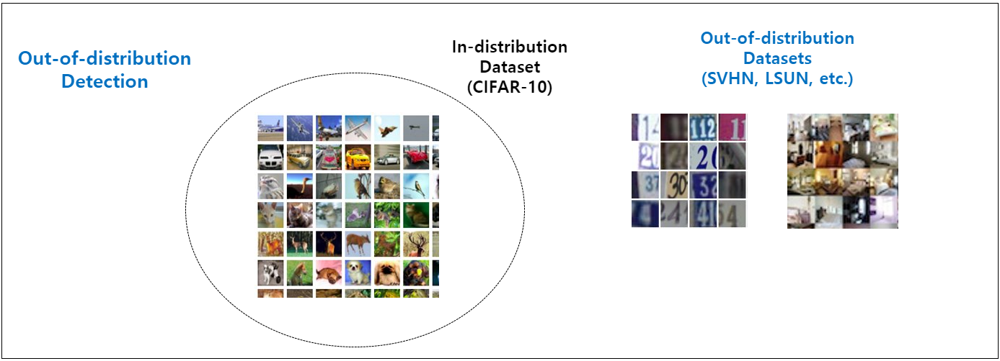
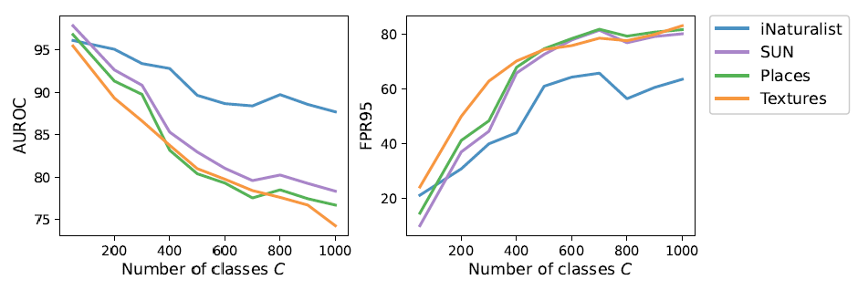
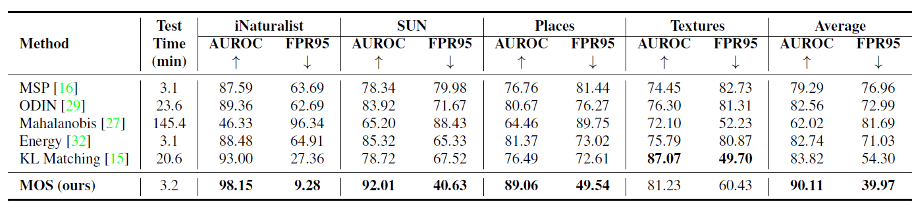
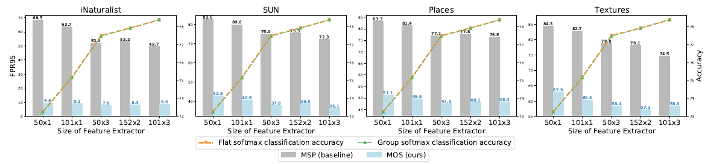
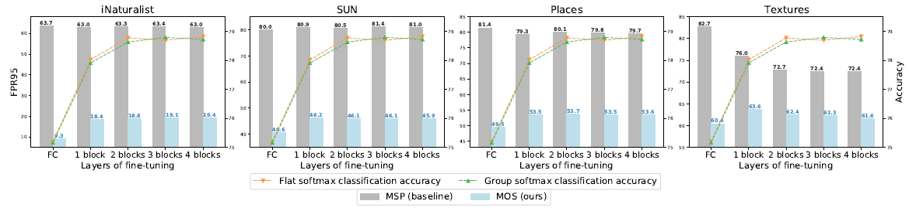

# MOS: Towards Scaling Out-of-distribution Detection for Large Semantic Space \[Kor\]

[**English version**](cvpr-2021-mos-eng.md) of this article is available.

##  1. Problem definition

Out-of-distribution detection (이하 OOD detection)이란 machine learning기반의 모델을 안전하게 배포하기 위한 중요한 도전 과제이다. 학습 시에 보지 못한 class, outlier 샘플 등 학습 기반 모델이 성능을 보장할 수 없는 상황을 감지하고 알리는 기술이며, 모델을 실세계에 특히 산업계에 적용할 때 좋은 성능 지표와 함께 필수적으로 제공되어야 하는 기술 중 하나이다. 이러한 입력에 대한 distribution shift를 감지하고 알릴 수 있어야 성능이 보장되는 deep model 솔루션이 될 수 있다. 그 동안의 deep neural network 기반의 모델은 주어진 학습 데이터와 많이 다른 domain shift 상황에서도 아주 자신있게 틀린 답을 제시하는 문제가 있다. (highly over-confident predictions)

아래 그림은 OOD detection을 binary classification으로 정의하고 이를 평가하기 위한 기본적인 in-distribution과 out-of-distribution 데이터 셋 구성을 나타낸다.

[그림출처](https://hoya012.github.io/blog/anomaly-detection-overview-1/)

## 2. Motivation

그 동안의 OOD detection 관련 연구는 제한적인 class 개수와 MNIST, CIFAR1-10 등의 저해상도 영상으로만 평가되었다. 반면 본 논문에서는 이러한 제한적인 상황을 실세계와 유사하게 scale-up하여 고해상도 영상을 포함한 다양한 dataset들로 더 다양한 class 상황에서 OOD detection의 성능 변화를 보고 개선하고자 하였다.

**"Only tested with small and low-resolution datasets"**

### Related work

본 논문에서 소개하고 비교하고 있는 기존 주요 관련연구는 아래와 같다.

- MSP, A baseline for detecting misclasified an out-of-distribution examples in neural networks, ICLR 2017

  - OOD detection을 최초로 다룬 논문이며, 간단히 softmax probabilities를 활용하여 OOD sample을 구분하는 방법으로 후속 연구의 baseline 성능을 제시하였다.

- ODIN, Enhancing the reliability of out-of-distribution image detection in neural networks, ICLR 2018

  - Pre-trained model을 사용하고 기존 다른 연구의 skill인 temperature scaling으로 logit값을 calibration하고 fast gradient sign method를 input preprocessing에 적용하여 OOD detection 성능을 개선하였다. 

- Mahalanobis, A simple unified framework for detecting out-of-distribution samples and adversarial attacks, NeurIPS 2018

  - Pre-trained model의 중간 hidden feature들로 feature ensemble하고 정상 sample들에 대해 parameters of Gaussian distribution으로 모델링을 한 후
  - 동일한 과정을 거쳐 얻은 feature vector로 closest class를 찾고 perturbation 후, 위에서 모델링한 정상 sample들의 분포와 Mahalanobis distance 기반으로 거리를 측정하여 OOD detection을 수행하는 generative classifier기반의 framework을 제안하였다.

  

  위 관련연구에 대해서는 [여기 한글 블로그](https://hoya012.github.io/blog/anomaly-detection-overview-2/)에서 상세히 설명되어 있다.

  

### Idea

Task의 전체 class 개수를 늘려가면, 기존 연구인 MSP baseline 알고리즘의 성능 변화를 살펴보면 아래 그래프와 같다.

OOD detection에 대한 AUROC, FPR95 성능은 전체 class 개수가 늘어남에 따라 급격히 저하된다. FPR95 성능 17.34% to 76.94%으로 저하. 여기서 FPR95는 False Positive Rate at True Positive Rate 95%의 성능을 의미하며 positive는 in-distribution을 의미한다.

저자는 class가 늘어남에 따라 발생하는 이러한 현상을 2D상에 toy example을 가지고 설명하고 있다. 아래 그림을 보면 class가 늘어남에 따라 in-distribution data와 out-of-distribution 간에 decision boundary가 복잡해져 구분하는 task의 난이도가 올라가는 것을 볼 수 있다. 따라서 저자는 이를 해결하기 위해 in-distribution class끼리 서로 grouping을 하는 것을 접근 방법을 제안한다.

## 3. Method

본 논문에서는 OOD detection task를 real world scale로 확장하기 위해 ImageNet-1k, iNaturalist, SUN, Places, Textures 등의 대규모 dataset을 사용하였고, 이렇게 넓어진 semantic space를 작은 group으로 분해하여 문제의 복잡도를 줄이고 "Others"라는 새로운 개념의 class를 추가 한 후 Minimum Other Score (MOS)라는 새로운 OOD scoring 방법을 제안하였다. 입력 영상에 대한 feature vector를 추출하기 위한 용도로 pre-trained BiT-S를 사용하였다. Big transfer (bit): General visual representation learning, ECCV 2020 (Google)

* Semantic space를 그룹으로 나누기 위한 전략으로 아래 4가지를 비교하였다.
  * Taxonomy
    * ImageNet을 WordNet 계층 체계로 구성하는 전략
    * 8개의 super-classes를 도입: animal, artifact, geological formation, fungus, misc, natural object, person, and plant
  * Feature Clustering
    * Pre-trained 모델로 추출한 embeddings를 K-means clustering으로 그룹핑
  * Random grouping
    * Semantic 정보없이 무작위로 그룹핑하여 다른 전략을 비교하기 위한 base로 사용 
  * Baseline MSP
    * 그룹으로 나누지 않은 base 성능

AUROC, FPR95 성능으로 보아 dataset 공통적으로 semantic 정보를 활용하는 전략이 가장 좋은 검출 성능을 내었고, K-means clustering 방법이 그 뒤를 이었다.

위와 같은 전략으로 각 그룹으로 나눈뒤, 각 그룹에 얼마나 OOD 같은지에 대한 유용한 정보를 담을 수 있는 "others"라는 category를 추가한다. 각 그룹별로 others category에 대한 확률을 따져 그 중 가장 작은 값이 특정 threshold 보다 높다면 OOD로 규정하는 것이 핵심로직이다. 여기에는 만일 in-distribution sample이라면 최소한 어느 한 그룹, 즉 그것이 속한 그룹에서는 others에 대한 확률이 매우 적을 것이라는 가정이 깔려 있다. 

* MOS (Minimum Others Score)

    $$S_{MOS}(x) = - \underset{1 \leq k \leq K}{\min} p^k_{others} (x) $$

아래 그림 왼쪽을 보면 Animal Group의 in-distribution 샘플인 경우, 각 그룹 별 others scores를 비교해보면 다른 그룹에서는 높은 점수를 받은 반면, 본인이 속한 Animal 그룹에서는 작은 점수가 나오는 것을 알 수 있다. 하지만 이와 다르게 OOD sample인 경우 모든 그룹에서 others score가 높게 나오는 것을 알 수 있다. (오른쪽 그림)

## 4. Experiment & Result

### Experimental setup

우선, 제안한 방법에 대한 실험은 학습과 추론으로 나눠 설명하면,

학습의 경우 semantic 정보로 나눈 그룹기반에 학습을 하며, group $$k$$ 를 위한 group-wise softmax는 아래와 같다.

  $$ \hat{p}^k=\underset{c \in \mathcal{g'_k}}\max p^k_c({x}) $$

여기서  $$g_k$$ 는 Category $$C$$의 전체 개수를 $$K$$개의 그룹으로 나눈 후, $$k$$번째 그룹을 의미하며, others 가 아닌 $$k$$번째 그룹의 class들의 set을 $$g'_k$$ 라고 한다.

  $$g'_k = g_k \setminus\{others\}$$

목적함수는 각 그룹의 cross-entropy loss들의 합으로 아래와 같이 나타낼 수 있다.

  $$L_{GS} = -\frac{1}{N}\sum_{n=1}^{N}\sum_{k=1}^K\sum_{c \in \mathcal{g_k}}y_c^k\log(p_c^k(x))$$

"others" 라는 가상의 category를 group-level에서 생성하지만 이 class 학습을 위한 다른 외부의 데이터를 필요로 하지는 않는다. **현재 그룹에 속하지 않는 모든 category의 data**를 현재 그룹에서 others class 학습 시 ground-truth로 사용한다.

Category를 맞추는 classification 추론의 경우, 각 그룹별 group-wise class 예측을 진행 한후, 가장 큰 확률값을 갖는 $$k$$그룹의 category $$c$$ 를 $$\hat p^k$$라 하며, 그 때에 확률이 가장 큰 값을 갖는 category를 $$\hat c^k$$라 한다. 가장 큰 확률값을 갖는 그룹을 $$k_*$$라 하여, $$k_*$$ 그룹에서 $$\hat c^k$$가 최종 prediction 결과가 되며 추가로 MOS를 계산하여 OOD detection을 수행한다.

  $$ \hat{p}^k=\underset{c \in \mathcal{g'_k}}\max p^k_c({x}) , $$

  $$\hat{c}^k=\underset{c \in \mathcal{g'_k}}{\arg \max} p^k_c({x})$$

  $$k_*=\underset{1 \leq k \leq K}{\arg \max} \hat{p}^k$$

평가에 사용한 datasets은 아래와 같으며, 기존 OOD detection 연구와 달리 대규모의 dataset을 구성하고 성능을 평가하였다.

* ImageNet-1K
  * In-distribution 학습을 위해 사용했다
  * CIFAR dataset보다 10배 이상 labeld dataset 사용이 가능하며 CIFAR와 MNIST 보다 고해상도의 영상을 기반으로 한다.
* iNaturalist
  * ImageNet-1K dataset과 겹치지 않기 위해 수작업으로 ImageNet-1K에 존재하지 않는 110개의 식물 class들을 선택했다.
  * 선택한 110 classes개 대해서는 각 class별 10,000개의 data를 random sampling 하였다.
* SUN
  * SUN은 ImageNet-1K과 겹치는 부분이 있어, 주의하여 50개 SUN에서만 unique한 50개의 nature-related concepts를 조심스럽게 골랐다.
  * 선택한 50개 class에 대해 각각 10,000개의 샘플씩 random sampling 하였다.
* Places
  * ImageNet-1K에 존재하지 않는 50개의 카테고리 선택 후 10,000개씩 random sampling 하였다.
* Textures
  * 전체 데이터 셋인 5,640 장의 이미지 모두 사용하였다.

### Result

OOD detection 실험 결과이다. same pre-trained
모든 방법들은 ImageNet-1k을 in-distribution dataset으로 기학습한 pre-trained BiT-S-R101x1 backbone을 사용하여 평가하였다.

AUROC는 높을 수록, FPR95는 낮을 수록 OOD detection 성능 우수한 것이며, Textures dataset 이외에는 모두 우수한 성능과 짧은 test time을 달성하였다.

평가에 사용한 다양한 dataset별 class 개수가 증가함에 따른 AUROC, FPR95 성능을 살펴보았다. 제안한 MOS (blue line)방식이 task 복잡도가 올라감에도 강인한 성능을 유지하는 것을 보여주고 있다. 

저자는 Ablation Study로는 아래 2가지에 대해 다루었다.
첫 번째, 사용한 feature extractor의 capacity 증가에 따른 성능은 예상과 다르지 않게 classification 성능(dash line)과 OOD detection 성능 (bar) 모두 개선됨을 볼 수 있다.

두 번째는 fine-tuning시에 residual block 어디까지 weight 업데이트를 할 것인가에 대한 실험이다.

어느 경우든 baseline 성능보다 MOS 성능이 우세한 것을 볼 수 있으며, fine-tune 범위를 넓힐 수록 classification 성능을 올라갔으나, OOD detection 성능은 그렇지 않았다. 오히려 fully-connected layer만 tuning하는 경우가 더 좋은데, 이는 많은 block들을 재학습 할수록 label 데이터에 더욱 highly confident 해지기 때문으로 생각된다.

## 5. Conclusion

본 논문에서는 지난 연구에서 제한 데이터셋에 국한하여 OOD detection을 실험하고 평가한 것을 넘어서, 다양하고 고해상도 데이터셋으로 범위를 넓혀 보다 real-world setting으로 OOD detection 문제를 재정의하고 이슈가 무었인지 고민하고 새로운 방법을 제안하였다.

특히 기존 알고리즘들이 class가 많은 task에서 OOD detection 성능이 급격히 저하되는 것을 극복하기 위해 그룹 기반의 OOD detection framework을 제안하였고, others라는 가상의 class 개념과 기존 데이터셋으로 학습하는 구체적인 방법을 제안하였다. minimum others score라는 OOD 정도를 scoring하는 새로운 방법을 제안하여 크게 성능이 향상됨을 비교 실험을 통해 보여주었다.

### Take home message \(오늘의 교훈\)

Please provide one-line \(or 2~3 lines\) message, which we can learn from this paper.

> 실세계의 문제는 기존 데이터셋 세팅보다 훨씬 복잡도가 높으며, 이러한 경우 클러스터링, semantic 정보별 그룹핑 등을 통해 전체 큰 문제를 작게 줄여서 접근하는 것이 도움이 된다.
>
> 필요에 따라 (여기서는 OOD 정보를 담을) 특정 개념을 이용한 virtual class를 정의하고 학습하는 방법을 고안하면, 문제 해결에 도움이 된다.

## Author / Reviewer information


You don't need to provide the reviewer information at the draft submission stage.


### Author

**Korean Name \(English name\)** 

* KAIST AI
* \(optional\) 1~2 line self-introduction
* Contact information \(Personal webpage, GitHub, LinkedIn, ...\)
* **...**

### Reviewer

1. Korean name \(English name\): Affiliation / Contact information
2. Korean name \(English name\): Affiliation / Contact information
3. ...

## Reference & Additional materials

1. Citation of this paper
2. [official github](https://github.com/deeplearning-wisc/large_scale_ood)
3. Citation of related work
4. Other useful materials
5. ...

