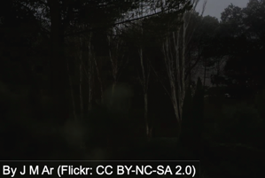
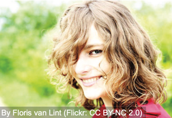
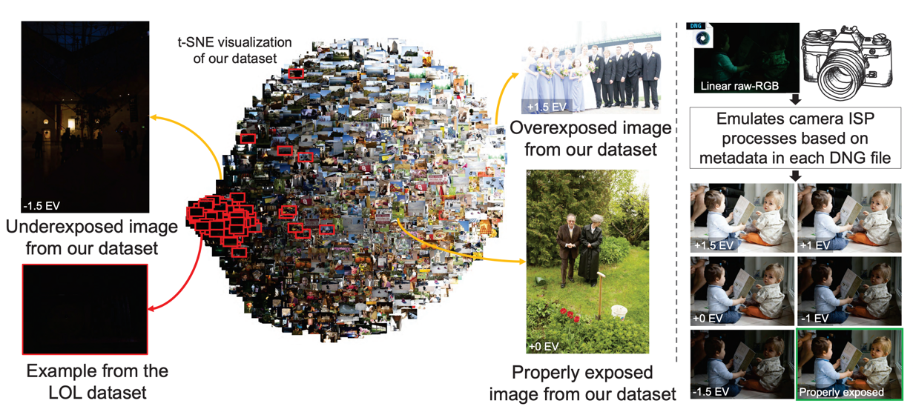
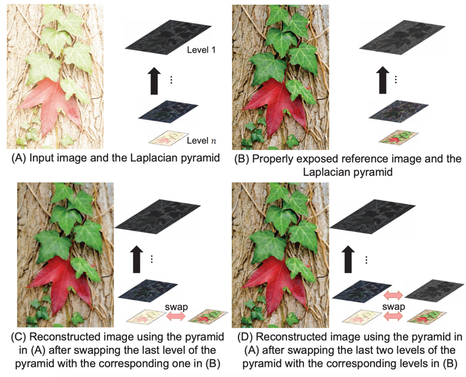
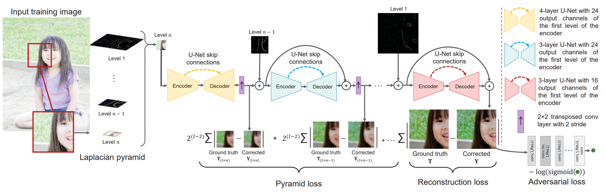
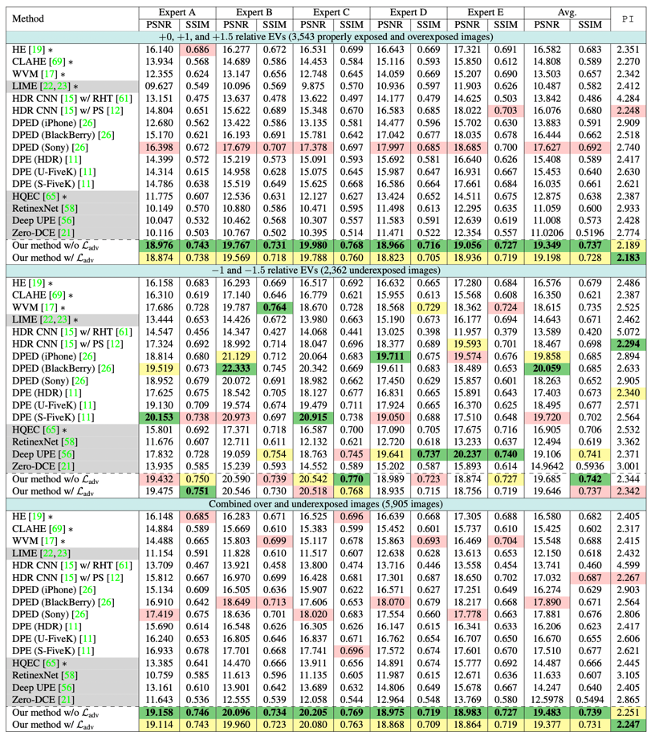
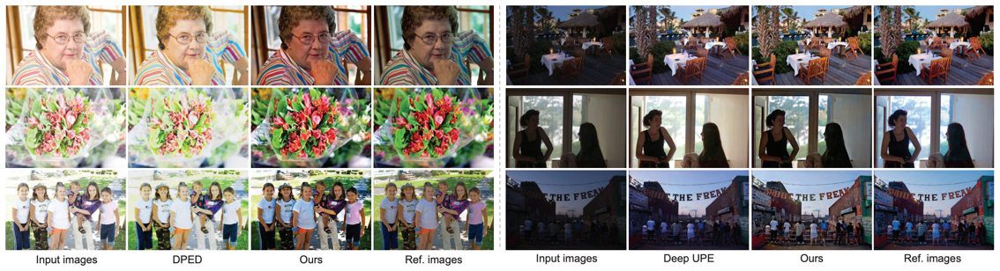
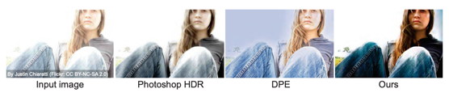
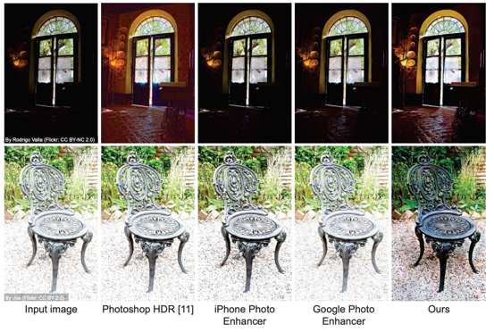
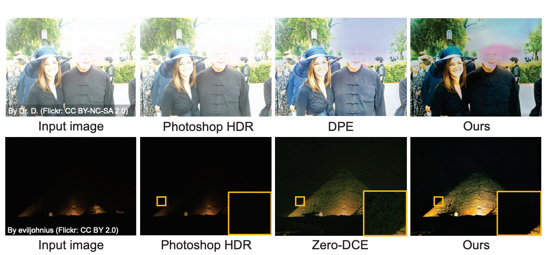

# Learning Multi-Scale Photo Exposure Correction \[Eng\]

##  1. Problem definition

If you have ever been interested in photography, you might be familiar with 
color and brightness problems, also known as exposure errors. Wrongly exposed 
photographs significantly affect the contrast of an image and remain the major 
source of issues in camera-based imaging. Generally, exposure problems 
can be categorized into:
* Underexposed - image is **dark**, so the exposure time was _short_
* Overexposed - image is **bright** with washed-out regions, so the exposure time was _long_

 

The main factors that impact on image exposure are: (i) shutter speed, 
(ii) $f$-number, the ratio of the focal length of a camera lens to the diameter of the aperture, 
and (iii) ISO value that controls amplification factor of received pixel signals.
Once a photograph is captured and the final 8-bit standard RGB (sRGB) image is rendered, it is hard 
to correct exposure errors due to highly nonlinear operations applied early in 
capture process by the camera image signal processor (ISP). Correcting images
with exposure errors is a challenging task even for many photo enhancement
software applications.

Therefore, the exposure correction problem has been formulated as two
main sub-problems: **(i)** _color enhancement_, and 
**(ii)** _detail enhancement_.

## 2. Motivation

### Related work

Traditional exposure correction and contrast enhancement methods are based
on adjusting image intensity values from image histograms [3,4,5,6,7]. Meanwhile, the majority of prior
work adopts Retinex theory [12], by formulating improperly exposed images as pixel-wise
multiplication of target images, captured with correct exposure settings, by illumination maps. 
However, most of the prior methods are restricted to correcting _underexpose_ errors [13,14], and some cannot to perform well on _overexposed_ images.

For training deep neural networks within image enhancement tasks, it is crucially important
to have large and valid paired datasets that sometimes might not be publicly available. Existing
paired datasets for exposure correction focus solely on low-light underexposed images,
such as Wang et. _al._'s dataset[13] and the low-light (LOL) paired dataset[15].

### Idea

Since most of the previous works are mainly focused on underexposed error correction and 
image quality enhancement, the proposed approach is the first deep learning method that explicitly
correct **both** overexposed and underexposed sRGB images withing a single model. Particularly,
a coarse-to-fine deep neural network (DNN) model has been introduced. The network is fully
differentiable that makes it trainable in an end-to-end manner. It starts with global color information
correction, and subsequently refines image details. This approach neither reconstructs 
HDR images nor enhances general quality of image, it is only focused on explicitly
addressing exposure errors.

Along with the coarse-to-fine DNN model, a new dataset with over 24,000 images has been introduced.
The dataset images have been rendered from raw-RGB to sRGB using various exposure value (EV) settings,
and broader exposure ranges compared to all previously available datasets.

In figure 3, from t-SNE visualization[16] it is clearly seen that the LOL[15]
dataset which is outlined in red, has relatively small number of images and
covers considerably small fraction of the possible exposure levels 
compared to the newly proposed dataset. This new dataset being based on the MIT-Adobe
FiveK[17], it has generated images by adjusting the high tonal values
from raw-RGB images, with a goal of realistic exposure errors emulation. 

## 3. Method

The proposed approach is divided into two parts. First, data generation process
covers all details to produce a new dataset that will be used further for
training, validation and testing phases. Second part describes the proposed
method of fully differentiable a coarse-to-fine deep neural network model. 

### Data generation
The MIT-Adobe FiveK[17] dataset contains 5,000 raw-RGB images and
corresponding sRGB images that have been rendered manually by five expert
photographers.

In order to emulate real exposure errors, each raw-RGB image is rendered
with different exposure values (EVs). Generally, five various EV settings
are used, namely $-1.5$, $-1$, $+0$, $+1$ and $+1.5$ to mimic underexposure
errors, a zero-gain of original EV, and overexposure errors respectively.
Zero-gain EV means original exposure settings are preserved from camera's
capture time. However, note that zero-gain relative EV will be not be used
as a ground truth image. Specifically, images that have been rendered with
corrected exposure settings by an expert photographer out of five experts[17],
are being used as a target correctly exposed images. This expert photographer
is referred to an Expert C in MIT-Adobe FiveK[17].

In total, the dataset contains 24,330 8-bit sRGB images with various digital
exposure settings. It is divided into three sets:
* training set of 17,675 images
* validation set of 750 images
* testing set of 5,905 images

None of the sets shares any scene in common. Images that had misalignment with their corresponding
ground truth images had been excluded from the final dataset. 
The Figure 3 (right) illustrates generated images that mimic real exposure errors,
and its corresponding properly exposed reference image.

### Proposed method
Assume $I$ is a given 8-bit sRGB input image with incorrect exposure settings.
The goal is to produce output image $Y$ with fewer exposure errors and noise
artifacts. Since the model is expected to correct both over- and underexposed
errors simultaneously, a sequential color and detail errors correction of $I$
is proposed. Particularly, rather than processing original input image $I$,
the model will be focused on a multi-resolution representation of $I$.
Hence, for multi-resolution decomposition Laplacian pyramid[18] is used, which
is derived from the Gaussian pyramid[19].

Let assume that $X$ is the Laplacian pyramid of image $I$ with $n$ levels,
such that the last level captures low-frequency information, while the first
layer depicts the high-frequency information. In this manner, one can categorize
frequency levels as follows: (i) low-frequency level contains global
color information; (ii) mid- and high-frequency levels stores image
coarse-to-fine details.

The Figure 4 illustrates the general idea of coarse-to-fine approach using
Laplacian pyramid. It is clearly seen that a considerable exposure correction
can be achieved solely by low-level frequency layer (Fig. 4C) of the
target image (Fig. 4B). In this manner, we can enhance an entire image
sequentially by correcting each Laplacian pyramid layer (Fig. 4D). However,
at the inference phase, we do not have a ground truth target image for
swapping the Laplacian pyramid layers. Therefore, the main goal is to **predict**
the missing color and detail information of each Laplacian pyramid layer.
Referring to these assumptions, a new coarse-to-fine deep neural network is
proposed to correct global color and detail information of input image $I$ 
using Laplacian pyramid decomposition in a sequential manner.

Assuming that Laplacian pyramid $X$ of image $I$ is decomposed into $n$ levels,
the proposed neural network model consists of $n$ sub-networks, each being
based on a U-Net-like architecture [20]. The network capacity is allocated
in the form of weights depending on significance of each sub-problem that
might affect the final result. The Figure 5 demonstrates the overall network
model architecture.

From the figure 5, we can notice that the largest U-net sub-network (yellow),
is used to process the global color information of input image $I$, in other words
the last $n$th Laplacian pyramid layer. This sub-network processes the
low-frequency layer and generates an upscaled image $Y_{(n)}$. The upscaling
process is done by $2 \times 2$ transposed convolutional layer with stride 2.
Next, the mid-frequency layer $X_{(n-1)}$ is added to $Y_{(n)}$ and fed into
the second sub-network. This network in turn, enhances the detail information
on current layer and produces a residual layer which is added to
$Y_{(n)} + X_{(n-1)}$ with a goal of $Y_{(n-1)}$ image layer reconstruction.
Generally, this entire process of refinement-upsampling is being performed
until the final output image $Y$ is produced. Since the model is fully differentiable,
it can be trained in an end-to-end manner.

#### Loss Function.
End-to-end model training has been achieved by minimizing the following loss
function: 
$$L = L_{rec} + L_{pyr} + L_{adv}$$
where $L_{rec}$ denotes reconstruction loss, $L_{pyr}$ the pyramid loss, and
$L_{adv}$ the adversarial loss.

**Reconstruction loss.** $L_1$ loss function is used between reconstructed
and target reference exposed images.
$$L_{rec} = \sum_{p=1}^{3hw} |Y(p) - T(p)|$$
$h$ and $w$ denote height and width of image, respectively, and $p$ is the index
of each pixel in corrected image.

**Pyramid loss.** By using a simple interpolation process for upsampling
operation[21], the pyramid loss is computed as follows:
$$L_{pyr} = \sum_{l=2}^{n} {2^{(l-2)}} \sum_{p=1}^{3 h_l w_l} |Y_{l}(p) - T_{l}(p)|$$
$h_l$ and $w_l$ denote twice the height and width of $l^{th} level image.
The pyramid loss gives a principled interpretation of the task of each
sub-networks. Comparing to the training only with reconstruction loss,
the pyramid loss results in less noise artifacts.

**Adversarial loss.** It is used as a regularizer to enhance reconstruction
output of the corrected image in terms of realism.
$$L_{adv} = -3hwnlog(S(D(Y)))$$
where $S$ is the sigmoid function, and $D$ discriminator DNN which is trained
together with the main network model.

## 4. Experiment & Result

### Experimental setup
It is important to note that processing high-resolution images (eg., 16-magepixel)
compared to resolutions used in training phase can affect model's robustness.
Therefore, bilateral guided upsampling method[22] is used to process high-res images.

During the training, the Laplacian pyramid with four levels, $n=4$ is used,
to have only four sub-network modules. The model is trained on randomly extracted
patches from training images with different dimensions. First on $128 \ times 128$,
next $256 \times 256$ and finally $512 \times 512$ patches. Generally, the 
following setup was used:
* A new proposed dataset is used (section 3)
* Adam optimizer
* Training on random patches with different dimensions
* Initially train without $L_{adv}$ to speed up convergence, then add $L_{adv}$ and fine-tune the network.

Experiment results evaluation method:
* Evaluation done on test set
  * 5,905 images rendered with various EVs
* Three standard metrics for pixel-wise accuracy evaluation
  * Peak signal-to-noise ratio (PSNR) - **larger** value is _better_
  * Structural similarity index measure (SSIM) - **larger** value is _better_
  * Perceptual index ($PI$) - **smaller** value is _better_
    * $PI = 0.5(10-Ma+NIQE)$
      * $Ma$[23] and $NIQE$[24] are no-reference image quality metrics
* Baselines:
  * Histogram equalization (HE)[4]
  * Contrast-limited adaptive histogram equalization (CLAHE)[7]
  * The weighted variational model (WVM)[25] 
  * The low-light image enhancement method (LIME)[14] 
  * HDR CNN[26] 
  * DPED models[27] 
  * Deep photo enhancer (DPE) models[28] 
  * The high-quality exposure correction method (HQEC)[29] 
  * RetinexNet[15] 
  * Deep underexposed photo enhancer (UPE)[13]
  * Zero-reference deep curve estimation method (Zero-DCE)[30] 

It is worth to mention that for pixel-wise error metrics (PSNR and SSIM), during
the testing stage corrected images are not compared solely to Expert C,
but rather to **all** five expert photographers in the MIT-Adobe FiveK[17].

### Result
#### Quantative results
The Figure 6 demonstrates the quantative results obtained by each method on
a new introduced test set. It is clearly seen that the new proposed method
achieves the best results for **overexposed** images, and par with set-of-the-art
methods on **underexposed** images. The best results are colored with green and bold.
The second- and third-best results are in yellow and red, respectively.

#### Qualitative results
The Figure 7 and 8 demonstrates the qualitative results of correcting images with
exposure errors, using test set images as inputs.

The model also generalizes well for other input images, out of the dataset.
The Figure 8 shows the qualitative results of the model on public input image taken
from Flickr.

However, the main problem the model can face is the insufficient semantic information
of input image. The Figure 10 shows when the input image has regions with complete
saturation, the model cannot constrain the color inside the face due to the lack of
semantic information. Additionally, when the image is completely dark, the model
starts to produce remarkable noise and artifacts on the image.

## 5. Conclusion

The paper proposed a single coarse-to-fine deep learning model that is able to
deal with both over- and underexposed images simultaneously. The main achievement of the
paper is the ability to perform good on both exposure types, setting state-of-the-art
results on underexposed images and par with the best methods on underexposed images.
 

Additionally, the key contribution of the paper is the newly proposed dataset,
that contains over 24,000 images which are rendered from raw-RGB to sRGB images with
various exposure settings. This dataset might be considerably useful for future
work in sphere of exposure correction problems.
### Take home message

> Absence of light, is often overlooked.
>
> Abundance of light, is disgusting.
>
> Capture correcct exposure is key to the visually pleasant photographs. 

## Reference & Additional materials

1. Citation of this paper
2. [Official GitHub repository](https://github.com/mahmoudnafifi/Exposure_Correction)
3. Turgay Celik and Tardi Tjahjadi. Contextual and variational contrast enhancement. _IEEE Transactions on Image Processing_
4. Rafael C. Gonzalez and Richard E. Woods. _Digital Image Processing_.
5. Chulwoo Lee, Chul Lee, and ChangSu Kim. _Contrast enhancement based on layered difference representation of 2D histograms._.
6. Stephen M Pizer, E Philip Amburn, John D Austin, Robert Cromartie, Ari Geselowitz, Trey Greer, Bart ter Haar Romeny, John B Zimmerman, and Karel Zuiderveld. _Adaptive histogram equalization and its variations. Com- puter Vision, Graphics, and Image Processing_.
7. Karel Zuiderveld.Contrast limited adaptive histogram equalization. _In Graphics Gems IV_ (p.474).
8. Chunle Guo, Chongyi Li, Jichang Guo, Chen Change Loy, Junhui Hou, Sam Kwong, and Runmin Cong. _Zero-reference deep curve estimation for low-light image enhancement._
9. Sean Moran, Pierre Marza, Steven McDonagh, Sarah Parisot, and Gregory Slabaugh. _DeepLPF: Deep local parametric filters for image enhancement._
10. Jongchan Park, Joon-Young Lee, Donggeun Yoo, and In So Kweon. _Distort-and-recover: Color enhancement using deep reinforcement learning._ 
11. Runsheng Yu,Wenyu Liu,Yasen Zhang,Zhi Qu,Deli Zhao, and Bo Zhang. _DeepExposure: Learning to expose photos with asynchronously reinforced adversarial learning._
12. Edwin H Land. _The Retinex theory of color vision_. Scientific American.
13. Ruixing Wang, Qing Zhang, Chi-Wing Fu, Xiaoyong Shen, Wei-Shi Zheng, and Jiaya Jia. _Underexposed photo enhancement using deep illumination estimation_.
14. Xiaojie Guo, Yu Li, and Haibin Ling. _LIME: Low-light image enhancement via illumination map estimation_.
15. Chen Wei, Wenjing Wang, Wenhan Yang, and Jiaying Liu. _Deep Retinex decomposition for low-light enhancement_.
16. Laurens van der Maaten and Geoffrey Hinton. _Visualizing data using t-SNE._
17. Vladimir Bychkovsky, Sylvain Paris, Eric Chan, and Fre ́do Durand. _Learning photographic global tonal adjustment with a database of input/output image pairs_.
18. Peter Burt and Edward Adelson. _The Laplacian pyramid as a compact image code_.
19. Peter Burt. Fast filter transform for image processing. _Computer Graphics and Image Processing_.
20. Olaf Ronneberger, Philipp Fischer, and Thomas Brox. _U- Net: Convolutional networks for biomedical image segmentation_.
21. Tom Mertens, Jan Kautz, and Frank Van Reeth. Exposure fusion: _A simple and practical alternative to high dynamic range photography_.
22. Jiawen Chen, Andrew Adams, Neal Wadhwa, and Samuel W Hasinoff. _Bilateral guided upsampling_.
23. Chao Ma, Chih-Yuan Yang, Xiaokang Yang, and Ming- Hsuan Yang. _Learning a no-reference quality metric for single-image super-resolution_.
24. Anish Mittal, Rajiv Soundararajan, and Alan C Bovik. _Making a “completely blind” image quality analyzer_.
25. Xueyang Fu, Delu Zeng, Yue Huang, Xiao-Ping Zhang, and Xinghao Ding. _A weighted variational model for simultaneous reflectance and illumination estimation_.
26. Gabriel Eilertsen,Joel Kronander,Gyorgy Denes,Rafa Mantiuk, and Jonas Unger. _HDR image reconstruction from a single exposure using deep CNNs_.
27. Andrey Ignatov, Nikolay Kobyshev, Radu Timofte, Kenneth Vanhoey, and Luc Van Gool. _DSLR-quality photos on mobile devices with deep convolutional networks_.
28. Yu-Sheng Chen,Yu-Ching Wang,Man-Hsin Kao,and Yung-Yu Chuang. _Deep photo enhancer: Unpaired learning for image enhancement from photographs with GANs_.
29. Qing Zhang, Ganzhao Yuan, Chunxia Xiao, Lei Zhu, and Wei-Shi Zheng. _High-quality exposure correction of underexposed photos_.
30. Chunle Guo, Chongyi Li, Jichang Guo, Chen Change Loy, Junhui Hou, Sam Kwong, and Runmin Cong. _Zero-reference deep curve estimation for low-light image enhancement_.

