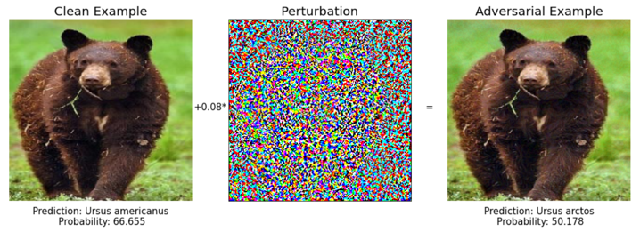

# Improving the Transferability of Adversarial Samples with Adversarial Transformations \[Kor\]

##  1. Problem definition

### 적대적 예제 (Adversarial Samples)
적대적 예제는 사람의 눈으로는 인식할 수 없는 미세한 잡음\(perturbation\)을 의도적으로 원래의 입력에 더해 생성한 예제이다.
이렇게 생성된 예제는 신경망을 높은 확률로 오분류하도록 한다.

구체적으로 아래 그림과 같이 원본 이미지 $x$에 미세한 잡은 $\delta$를 더해 적대적 예제 $x_{adv}$를 생성할 수 있다.  

$$ x_{adv} = x + \delta $$
    

### 적대적 공격 (Adversarial Attacks)
적대적 공격은 의도적으로 생성된 적대적 예제를 이용하여 네트워크가 오작동하도록 하는 공격이다.
적대적 공격은 공격자가 가지고 있는 네트워크의 정보에 따라 크게 두가지로 나눌 수 있다.  
- white box 공격: 공격자가 타겟 모델의 구조나 파라미터를 아는 환경에서 하는 적대적 공격.  
-  black box 공격: 공격자가 타겟 모델의 내부 정보를 알 수 없는 환경에서 하는 적대적 공격.
    

### 적대적 예제 생성
원본 이미지 $x$, 원본 클래스 $y$, 적대적 예제 $x_{adv}$, 이미지 분류기 (image classifier) $f(x)$ 라고 하자.
적대적 예제는 다음 두 조건을 만족해야 한다.

$$ arg max f(x_{adv}) \neq y,$$  

$$||x_{adv} - x ||_p \leq \epsilon $$

이미지 분류기 $f$의 손실 함수 (loss function)을 $J(f(x),y)$ 라고 할 때, 적대적 예제의 생성 과정 (공격 과정) 을 다음과 같이 나타낼 수 있다. 

$$max_{x_{adv}} J(f(x_{adv}),y),$$

$$s.t. ||x_{adv} - x ||_p \leq \epsilon$$

이와 같이, 손실 함수를 증가시켜 적대적 예제를 생성한다.

## 2. Motivation

### Related work

#### 전이성 기반 적대적 공격 (Transfer-based Attack)
소스 모델을 이용해 생성한 적대적 예제로 타겟 모데을 교란하는 공격이다.
black box 공격에서 학습 데이터에 접근할 수 있지만 타겟 모델에는 접근 할 수 없는 경우, 전이성을 기반으로 공격할 수 있다.
전이성이 높은 적대적 예제는 전이성 기반 적대적 공격의 성공률을 증가시킨다.
그러나 적대적 예제가 소스 모델에 과적합(overfitting)된 경우, 낮은 전이성을 가지게 된다.  
- **전이성** : 어떤 모델 _A_ (소스모델)를 이용행 생성한 적대적 예제가 구조가 다른 여러 모델 _B, C, D, E, ..._(타겟 모델)에 대해서도 적대적으로 작용하는 특성.

#### 입력의 다변화 (Input Transformation)
적대적 예제의 전이성을 향상시키는 방법 중 하나로, 적대적 예제의 생성과정에서 소스 모델의 입력을 변환하여 소스 모델에 과적합되는 것을 방지하는 방법이다.  
- Translate-Invariant Method [(TIM)](http://openaccess.thecvf.com/content_CVPR_2019/papers/Dong_Evading_Defenses_to_Transferable_Adversarial_Examples_by_Translation-Invariant_Attacks_CVPR_2019_paper.pdf)  
 입력 이미지를  $x$축, $y$축으로 몇 픽셀씩 평행 이동 시킨 여러 이미지를 생성한 후, 그 이미지들을 이용하여 적대적 예제를 생성하는 방법이다. 
 
- Scale-Invariant Method [(SIM)](https://arxiv.org/pdf/1908.06281.pdf)  
 입력 이미지값의 픽셀 값의 크기를 조절하여 생성한 여러 장의 이미지를 생성한 후, 그 이미지 세트를 사용하여 적대적 예제를 생성하는 방법이다.
 
- Diversity Input Method [(DIM)](https://openaccess.thecvf.com/content_CVPR_2019/papers/Xie_Improving_Transferability_of_Adversarial_Examples_With_Input_Diversity_CVPR_2019_paper.pdf)  
 입력 이미지를 무작위 리사이징 (resizing) 한 후, 0 값으로 패딩 (padding) 한 이미지를 생성하여 그 이미지로 적대적 예제를 생성하는 방법이다.
 

### Idea

소개하는 논문에서는 입력 이미지가 소스 모델에 과적합되는 것을 방지하기 위한 적대적 변환 네트워크 (Adversarial Transformation Network)를 제안한다.
모든 입력 이미지에 같은 변환을 적용하거나, 변환의 정도만 바꿔서 적용하는 것은 그 변환 자체에 과적합되어, 전이성을 향상시키는 데 한계가 있을 수 있다.
각 입력 이미지에 대해 적합한 변환을 적용하여 효과적으로 소스 모델에 대한 과적합을 피하고 적대적 예제의 전이성을 높이고자 한다.

## 3. Method

### 적대적 변환 네트워크 (Adversarial Transformation Network)

적대적 변환 네트워크는 2개 층의 CNN으로 이루어져 blur, sharpening 등의 변환 효과를 나타낼 수 있다.

적대적 변환 네트워크는 적대적 예제가 소개하는 논문에서는 적대적 예제의 생성과정을 다음과 같이 나타낸다.
H는 적대적 변환 네트워크를 나타낸다.

$$min_{\theta_H} max_{x_{adv}} J(f(H(x_{adv})),y), (1)$$

$$s.t. ||x_{adv} - x ||_p \leq \epsilon,$$

$$ arg max f(H(x)) = y .$$

소스 모델의 손실 함수를 증가시켜 적대적 예제를 업데이트한 후, 반대로 손실 함수를 감소시켜 적대적 변환 네트워크의 파리미터를 업데이트한다.
이렇게 학습된 적대적 변환 네트워크는 적대적인 예제가 올바르게 분류될 수 있도록 하는 변환을 표현한다.

각 입력 이미지에 대해 학습된 변환 네트워크는 적대적 예제를 업데이트하는 과정에서 적대적 예제가 적대적이지 않도록 하는 변환을 적용한다.
이는 적대적 예제 생성과정에서 도움이 되지 않는 (harmful)한 변환을 적용시켜, 생성된 적대적 예제가 어떠한 이미지 왜곡에도 강하도록 (robust) 하기 위함이다.

> Since only adopting a fixed transformation may lead to poor generalization to unknown ones, we endeavor to address the issue of explicitly modeling the applied image transformations by figuring out the most harmful image transformations to each adversarial image.
> We expect that if the generated adversarial samples can resist the toughest image deformations, they can also survive under other weaker distortions.

위의 식(1)에서 적대적 예제를 업데이트하는 _inner loop_ 에서 사용되는 loss는 다음과 같다.

$$L_{fool} = - J(f(T(x_{adv})),y) - \beta J(f(x_{adv}),y).$$

$T$는 변환을 나타내며, 적대적 예제과 변환을 적용한 적대적 예제에 대한 손실 함수를 증가하는 방향으로 적대적 예제 $x_{adv}$를 업데이트한다.

식 (1)의 _outer loop_ 에서 사용되는 loss는 다음과 같다.

$$ L_{T} = J(f(T(x_{adv})),y) + \alpha_1 J(f(T(x)),y) +\alpha_2 ||x_{adv}-T(x_{adv})||^2.$$

이미지의 정보를 유지하면서 적대적 예제 $x_{adv}$의 적대적인 효과를 없애도록 하는 $T$를 찾는다.
이러한 변환은 입력 이미지 하나 하나에 적용되어 adaptive한 변환을 만들 수 있다.

적대적 변환 네트워크 학습 알고리즘은 다음과 같다.

### 적대적 예제 생성 ( Syntehsizing Adversarial Samples)

적대적 예제의 생성과정은 다른 입력 다변화 방법과 유사하다.
차이점으로, 생성과정에서 사용되는 loss에 두번째 term을 추가했다.

$$ L_{attack} = J(f(x_{adv}),y) + \gamma J(f(T(x_{adv})),y) $$

적대적 예제를 생성하는 알고리즘은 다음과 같다.

## 4. Experiment & Result


If you are writing **Author's note**, please share your know-how \(e.g., implementation details\)


This section should cover experimental setup and results.  
Please focus on how the authors of paper demonstrated the superiority / effectiveness of the proposed method.

Note that you can attach tables and images, but you don't need to deliver all materials included in the original paper.

### Experimental setup

* Dataset : ImageNet dataset
 - 적대적 변환 네트워크 학습에는 ILSVRC 2012 training set을 사용.
 - 적대적 예제 생성에는 ILSVRC 2012 validation set 중 각 다른 카테고리에서 랜덤하게 고른 1000장의 이미지 사용. 이는 [2]{}에서 사용된 이미지와 같음.
 
* Baselines : FGSM, I-FGSM, MI-FGSM, NI-FGSM, TIM, SIM, DIM

* Source Model 
 - ResNet v2 (Res-v2)
 - Inception v3 (Incv3)
 - Inception v4 (Inc-v4)
 - Inception-ResNetv2 (IncRes-v2)
 
* Training setup 
 - 적대적 변환 네트워크 구조 : $Conv_{3\times 3} \bullet LeakyReLu \bullet Conv_{3\times 3}$
 - 적대적 변환 네트워크 학습 iteration: $K_{inner} = 10$, $ K_{outer} =10$
 - $\epsilon = 16$
 - 적대적 예제 생성 iteration : $ K = 10$
 - $\alpha_1 =1.0, \alpha_2 =10.0, \beta = 1.0, \gamma = 1.0$
 
* Evaluation metric  
 **공격 성공률 (Attack Success Rate)**는 타겟 모델이 적대적 예제를 오분류한 비율을 나타낸다.
 적대적 예제에 대한 타겟 모델의 정확도가 낮을 수록 공격 성공률이 높다.
 공격 성공률이 높을 수록, 적대적 예제의 전이성이 높다는 것을 의미한다.

### Result

위의 결과에서 대부분의 경우에서 **ATTA(Ours)**의 공격 성공률이 높다는 것을 확인할 수 있다.
두번째 테이블에서 방어(defense) method에 대해서도 좋은 결과를 보인다.

## 5. Conclusion

실험 결과를 통해 적대적 변환 네트워크가 나타내는 변환으로 적대적 예제를 생성했을 때, 전이성을 높힐 수 있다는 것을 알 수 있다.
처음으로 각 입력 이미지에 대해 adaptive 한 변환을 나타내기 위해 CNN을 사용했다.
그러나 CNN이 나타낼 수 있는 변환에 한계가 있다는 점이 아쉽다.

### Take home message \(오늘의 교훈\)

> Adaptive method는 성능을 향상시키는 방법 중 하나로 효과적이다.

## Author / Reviewer information


You don't need to provide the reviewer information at the draft submission stage.


### Author

**손민지 \(Son Minji\)** 

* KAIST Electrical Engineering

### Reviewer

1. Korean name \(English name\): Affiliation / Contact information
2. Korean name \(English name\): Affiliation / Contact information
3. ...

## Reference & Additional materials

1. Wu, Weibin, et al. "Improving the transferability of adversarial samples with adversarial transformations." Proceedings of the IEEE/CVF Conference on Computer Vision and Pattern Recognition. 2021.
2. Dong, Yinpeng, et al. "Evading defenses to transferable adversarial examples by translation-invariant attacks." Proceedings of the IEEE/CVF Conference on Computer Vision and Pattern Recognition. 2019.
3. Lin, Jiadong, et al. "Nesterov accelerated gradient and scale invariance for adversarial attacks." arXiv preprint arXiv:1908.06281 (2019).
4. Xie, Cihang, et al. "Improving transferability of adversarial examples with input diversity." Proceedings of the IEEE/CVF Conference on Computer Vision and Pattern Recognition. 2019.
