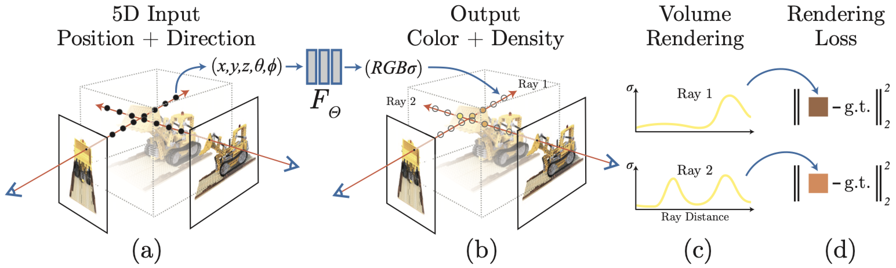
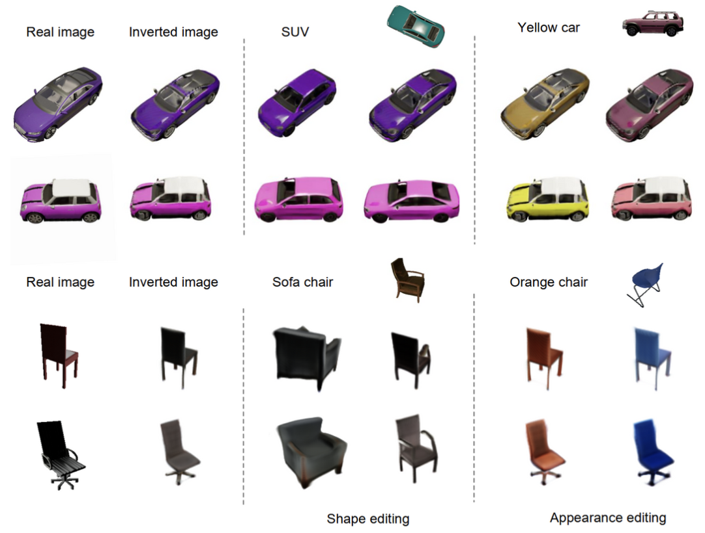
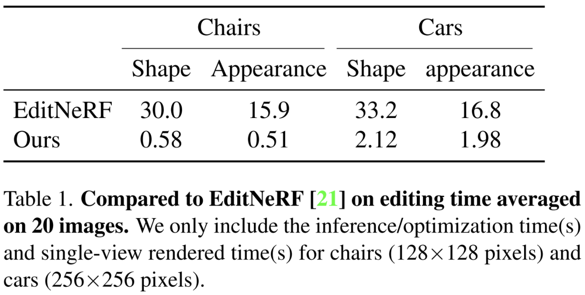
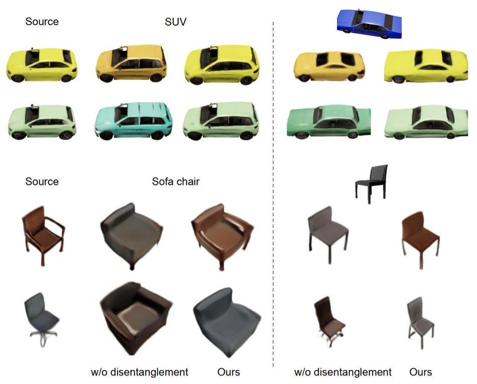
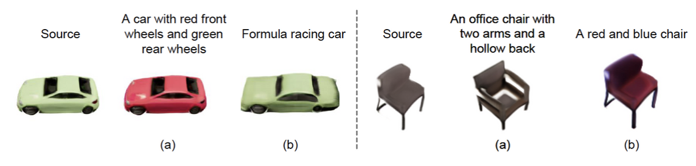

# CLIP-NeRF \[Eng\]
한국어로 쓰인 리뷰를 읽으려면 [**여기**](./cvpr-2022-clipnerf-kor.md)를 누르세요.

##  1. Introduction
In this article, I'm going to review a paper [CLIP-NeRF: Text-and-Image Driven Manipulation of Neural Radiance Fields(CVPR'22)](https://arxiv.org/abs/2112.05139), which suggests a way to manipulate synthesized views of NeRF with only prompt texts or exemplar images. This paper combines the methodology of [NeRF(ECCV'20)](https://arxiv.org/abs/2003.08934), which has recently received great attention in the field of view synthesis and [CLIP(ICML'21)](https://arxiv.org/abs/2103.00020), which learns the correlation between text and image using a large-capacity (text, image) pair.

### Problem Definition
The problem to solve in this paper is **implementing how to manipulate NeRF with a text prompt or a single exemplar image**. Specifically, the authors has changed the shape of the NeRF output by applying conditional shape deformation to the positional encoding of NeRF, and the color of the NeRF output by appling deferred appearance conditioning to the volumetric rendering stage of NeRF. Also they combined the NeRF model with pre-trained CLIP model and proposed an overall architecture that can manipulate the shape or color of NeRF output by just manipulating the shape code and appearance code with prompt text or exemplar image.

## 2. Motivation
Since CLIP-NeRF introduces a method of manipulating the NeRF output by combining NeRF and CLIP methodologies, I will introduce NeRF and CLIP in detail, introduce related works, and then let you know the idea of CLIP-NeRF.

### Related work
#### NeRF

View synthesis is a way to train how to take pictures of 3D objects or scenes from different view points and generate pictures of the objects from any new view point. NeRF, which uses volume rendering to carry out neural implicit presentation, enables high-quality view synthesis. NeRF is a deep neural network which takes the specific position $$(x, y, z)$$ of the 3D scene and view point $$(\theta, \phi)$$ and returns the color $$c=(r, g, b)$$, and the volume density $$\sigma$$, which represents the degree of light reflection at that position. Since volume density is a unique characteristic that is determined by the type of substance present in a particular position, it should have a view point-independent value. However, the color emitted from each position may vary depending on the view point. The phenomenon that the color of an object changes according to the view point is called the non-Lambertian effect.

If we train NeRF properly, we can obtain the color and the volume density for all points in a 3D scene at specific view point. After achieving this, 2D rendering can be created using the classical volume rendering method.

##### classical volume rendering
If we shoot the camera ray to the direction $$\mathbf{d}$$ at a particular point $$\mathbf{o}$$, then the trajectory of this ray can be represented by the equation of straight line $$\mathbf{r}(t) = \mathbf{o} + t \mathbf{d}$$. If the range of $$t$$ where the trajectory of this camera ray meets the 3D scene is $$[t_n, t_f]$$, then the color $C(\mathbf{r})$ of the 3D scene observed at $\mathbf{o}$ is expressed as follows:

$$
C(\mathbf{r}) = \int_{t_n}^{t_f}{T(t)\sigma(\mathbf{r}(t))\mathbf{c}(\mathbf{r}(t),\mathbf{d})}dt,

\\~\text{where}~ T(t) = \exp\Big(-\int_{t_n}^{t}\sigma(\mathbf{r}(s))ds\Big).
$$

An intuitive interpretation of this is that we can get colors from $$\mathbf{r}(t_n)$$ to $$\mathbf{r}(t_n)$$ of the 3D scene at view point $$\mathbf{d}$$ from NeRF, and can obtain the final color by integrating them. At this point, $$T(t)\sigma(\mathbf{r}(t),\mathbf{d})$$ multiplied before $$\mathbf{r}(t)$$ acts as weight. If there are many opaque objects in front of the object in the current location, the amount of the object in the current location contributes to the final color will be reduced. $$T(t)$$ is a reflection of this and represents the volume density accumulated to date. If the volume density accumulated to date is large, then $$\int_{t_n}^{t}\sigma(\mathbf{r}(s))ds$$ will be smaller, and thus $$T(t)$$ will be smaller. Eventually the amount of contribution the current location will make to the final color will be reduced.

The amount contributed to the final color will also be proportional to the volume density $$\sigma(\mathbf{r}(t))$$, which is the volume density at a particular point. Multiplied by these two elements, $$T(t)\sigma(\mathbf{r}(t))$$ becomes the weight at a particular point. The principle of NeRF view synthesis is that an accumulated color of specific pixel of 2D view images can be calculated by shooting a camera ray in a specific direction, and the whole 2D image can be calculated by shooting camera rays repeatedly in multiple directions.

##### hierarchical volume sampling
NeRF calculates the above integral in a numerical way through sampling method. Specifically, $$[t_n, t_f]$$ is divided into $$N$$ uniform intervals and sampling is done from the uniform distribution in each interval to estimate the color and volume density $$\hat{C}_c(\mathbf{r})$$ of coarse network. The fine network $$\hat{C}_f(\mathbf{r})$$, which estimates the color and volume density, is learned by performing inverse transform sampling proportional to the volume density of each interval calculated from the coarse network. This hierarchical volume sampling enables importance sampling where there are many samples in areas that are heavily involved in final color calculation.

##### architecture
The specific architecture of NeRF is as follows. NeRF $$F_{\theta}$$ is a MLP based deep neural network. W pass the 3D coordinate through the 8 fully-connected layer(ReLU activation, 256 channels per layer) to obtain the volume density and 256-dimensional feature vector. Then we concatenate the returned feature vector and view point, and pass them through the two layers behind to obtain the final color. To make the volume density independent of view point, we can see that the view point $$\mathbf{d}$$ was added after obtaining the volume density $$\sigma$$ value from the network architecture.

##### positional encoding
The authors of NeRF confirmed that giving location information and view points directly into NeRF is not suitable for expressing the fast-changing part of an object in a 3D scene. To solve this problem, they introduced a method of mapping location information and view point to higher dimensional space using high frequency function. The authors used a positional encoding method similar in transformer. This means that $$F_{\Theta}$$ is represented by $$F_{\theta}' \circ \gamma$$ where $$\gamma(p) = (\sin(2^0 \pi p), \cos(2^0 \pi p), \cdots, \sin(2^{L-1} \pi p), \cos(2^{L-1} \pi p))$$ and they independently applied $$\gamma$$ to normalized position $$\mathbf{x} = (x, y, z)$$ and normalized viewing director unit vector $$\mathbf{d} = (\sin\theta \cos\phi, \sin\theta\sin\phi, \cos\theta)$$. They achieved the improvement of performance by this way.

##### loss function
Training is done using photographs taken from various view points in a single 3D scene. The loss function is as follows.

$$
\mathcal{L} = \sum\limits_{\mathbf{r} \in \mathcal{R}} \Big[ ||\hat{C}_c(\mathbf{r}) - C(\mathbf{r}) ||_2^2 + ||\hat{C}_f(\mathbf{r}) - C(\mathbf{r}) ||_2^2 \Big]
$$

This is pixel-wise $$L_2$$ loss, which allows the coarse network and fine network to generate scenes that are close to the actual scene taken at each view point.

#### CLIP

Contrastive Language-Image Pretraining(CLIP) is a proposed model to overcome the limitations of traditional image classification models: 1) large amounts of labeled data are required for training and 2) individual training is required for specific task. CLIP first collects many (text, image) pairs that exist on web pages like Wekipedia, without requiring separate labeling process. Then, pre-training is performed to predict which text is attached to which image using 400 million (text, image) pairs collected. Pre-trained CLIP can predict the correlation between text and images as cosine similarity.

Givne $$\{(T_n, I_n) \}_{n=1}^{N}$$ of (text, image) pairs collected within mini-batch, text $$T_n$$ and image $$I_n$$ are passed through text encoder $$f_t$$(in transformer format) and image encoder $$f_i$$(in ResNet or vision transformer format), and then embedded to feature space $$f_t(T_n) \in \mathbb{R}^{d_t}$$, $$f_i(I_n) \in \mathbb{R}^{d_i}$$, respectively.

The embedding vectors are multiplied by linear projection matrix $$W_t \in \mathbb{R}^{d_e \times d_t}$$, $$W_i \in \mathbb{R}^{d_e \times d_i}$$, respectively and we get final embedding vectors of text and image in same embedding space. The pairwise cosine similarity matrix $S_{nm}(1 \le n, m \le N)$ between text and images within the mini-batch is as follows:

$$
S_{nm} = \frac{\langle W_t f_t(T_n), W_i f_i(I_m) \rangle}{|| W_t f_t(T_n) ||_2 \cdot || W_i f_i(I_m) ||_2} \times \exp(t)
$$

Here, $$t$$ is a learnable temperature parameter. After that, we proceed with training using the following symmetric cross-entropy loss.

$$
\mathcal{L} = \frac{1}{2} \Big[ \sum_{n=1}^{N} \frac{\exp(S_{nn})}{\sum_{k=1}^{N} \exp(S_{nk})} + \sum_{n=1}^{N} \frac{\exp(S_{nn})}{\sum_{k=1}^{N} \exp(S_{kn})} \Big]
$$

This is the loss for the pairwise cosine similarity matrix $$S_{nm}$$ to maximize the cosine similarity of already correlated (text, image) pairs, $$S_{nn}(1 \le n \le N)$$. In the figure above, (1) Contrastive Pre-training corresponds to this process. CLIP trained in this way allows us to calculate the correlation between text and image as cosine similarity, so we can perform zero-shot image classification. For example, given a particular image, each category label can be given as an input text to determine which category has the highest correlation, and the category with the highest cosine similarity can be predicted as the category of the image category. No matter what category label comes in, cosine similarity can be calculated, so there is no need to train CLIP by task. In the figure above, part (2) Create dataset classifier from label text, (3) Use for zero-shot prediction corresponds to this process.

#### NeRF Editing
NeRF, which can generate high-quality views from 3D scenes received great attention and led to many subsequent studies. Subsequent studies included DietNeRF, GRAF, which extend NeRF, such as applying NeRF to dynamic scenes rather than one fixed scene, or applying it to relighting and generative models. These follow-up studies have led to advances, but there is a problem that it is difficult to intuitively manipulate the NeRF output because it still consists of millions of network parameters.

In order to address this problem, EditNeRF defined conditional NeRF, a structure that separates the 3D objects encoded with NeRF into shape code and color appearance code. By adjusting two latent codes, the user can be able to control the shape and color of the object. However, EditNeRF was only able to manipulate or erase certain parts of the object, and the speed was very slow. Compared to EditNeRF, CLIP-NeRF has the advantage of 1) being able to manipulate the overall shape of an object, 2) training two latent mappers to improve the reference speed, and 3) being able to easily manipulate the results of the NeRF using short prompt texts or exemplar images.

#### CLIP-Driven Iamge Generation and Manipulation
CLIP, as described above, calculates the cosine similarity score of similar text and image in the shared latent space. With the help of the CLIP model, several methods like Perez, StyleCLIP, and DiffusionCLIP have been proposed which can manipulate images using text. These methods can manipulate images only using text, while in this study, the results of NeRF can be manipulated by both text and image.

### Idea
In this paper, the authors introduced an intuitive way to manipulate NeRF with simple text prompt or single reference image. This study was conducted in a disentangled conditional NeRF structure that separated the latent space by shape codes that can manipulate the shape of objects and appearance codes that can control the color of objects.

In addition, they trained two code mappers using the CLIP model, which was a way to map CLIP features into a latent space to manipulate shape code and appearance code. In other words, when a prompt text or an exemplar image is given, it is used to change the shape or color of an object! After receiving the text prompt or exemplar image as condition, the feature vector was extracted using the pre-trained CLIP model, and it was put into the code mappers to create a local displacement on the late space of NeRF and therefore manipulate the shape code and appearance code. For training, CLIP-based loss was designed to improve the consistency between input text(or image) and output rendering, and to enable high-resolution NeRF management. In addition, they also proposed a method of extracting shape code, appearance code, and view point from real image.

The main contributions of this paper include:
- For the first time, text-and-image driven manipulation for NeRF has been proposed so that the users can adjust 3D content with text or image.
- They proposed a disentangled conditional NeRF architecture that adjusts the shape of the object with shape code and the color with appearance code.
- They proposed a feedforward code mapper that performs faster than the optimization-based deformation method.
- They propose an inverse optimization method, which is a method of extracting shape code, appearance code, and view point from the image.

## 3. Method

The authors in paper introduce the method part in following order: the general definition of conditional NeRF $$\rightarrow$$ disentangled conditional NeRF $$\rightarrow$$ CLIP-Driven Manipulation $$\rightarrow$$ Training Strategy $$\rightarrow$$ Disentangled Conditional NeRF. I think this is a reasonable way, so I will explain the method part in the same order.

### General
Based on original NeRF, Conditional NeRF can create objects by changing shapes and colors within a particular category by manipulating latent vectors that control shapes and colors, rather than creating just one 3D view. This is similar to conditional GAN, which can generate the desired number within MNIST dataset by giving digit label as condition. Conditional NeRF is a continuous volumetric function $$\mathcal{F}_{\Theta}:(x,y,z, \phi, \theta, z_s, z_a) \rightarrow (r, g, b, \sigma)$$, which not only receives a specific point $$(x, y, z)$$ and a view point $$(\theta, \phi)$$ of a 3D scene, but also receives a shape code $$z_s$$ and an appearance code $$z_a$$ to specify the shape and the color of the scene, and returns the emitted color $$c = (r, g, b)$$ and volume density $$\sigma$$ at that point. Trivial formulation $$\mathcal{F}_{\theta}'(\cdot)$$ of conditional NeRF, which simply connects shape code to an existing view point and appearance code to an existing view point, is shown below.
$$
\mathcal{F}_{\theta}'(x, v, z_s, z_a) : (\Gamma(x) \oplus z_s, \Gamma(v) \oplus z_a) \rightarrow (c, \sigma)
$$

In this case, $$\oplus$$ is the concatenation operator, $$\Gamma(\bold{p}) = \{ \gamma(p) | p \in \bold{p} \}$$ is the sinusoidal positional encoding which maps $$x$$, $$y$$, $$z$$ in $$\bold{p}$$ to high dimensional space. $$\gamma(\cdot): \mathbb{R} \rightarrow \mathbb{R}^{2m}$$ is defined as follows:
$$
\gamma(p)_k = \begin{cases}
\sin(2^k \pi p) & \text{if k is even}\\
\cos(2^k \pi p) & \text{if k is odd}\\
\end{cases}
$$
where $$k \in \{ 0, \cdots, 2m-1 \}$$, and $$m$$ is a hyperparameter.

### Disentangled Conditional NeRF
Conditional NeRF improves the architecture of NeRF, allowing to create a scene by manipulating its shape and color. Aforementioned trivial conditional NeRF $$\mathcal{F}_{\theta}'(\cdot)$$ has a problem of interference between shapes and colors. For example, manipulating shape codes to change shape also leads to the change of color. This is because the shape code and the appearance code are not completely separated. To address this problem, this work proposes a disentangled conditional NeRF structure. This allows individual adjustments of shape and color. In order to implement the disentangled conditional NeRF, conditional shape deformation and different appearance conditioning were proposed. This corresponds to the Discrete Conditional NeRF portion of the CLIP-NeRF figure above.

#### Conditional Shape Deformation
In trivial conditional NeRF, latent shape codes are directly concatenated into positional encoding. However, in disentangled conditional NeRF, the input position was slightly changed using shape code. In this way, the shape code and color code are completely separated. To do this, we introduce the shape deformation network $$\mathcal{T} : (\mathbf{x}, z_s) \rightarrow \Delta \mathbf{x}$$, which maps $$\mathbf{x}$$ and $$z_s$$ to a displacement vector $$\Delta \mathbf{x} \in \mathbb{R}^{3 \times 2m}$$ in the positional encoding $$\Gamma(\mathbf{x})$$. This is a method that slightly changes each element of positional encoding as much as a displacement vector by mapping it to. The deformed positional encoding is $$\Gamma^*(\mathbf{p}, z_s) = \{ \gamma(p)_k + \tanh(\Delta p_k) | p \in \mathbf{p}, \Delta p \in \mathcal{T}(p, z_s) \}$$. At this time, $p$ is scalar, $$\Delta p \in \mathbb{R}^{2m}$$, and $\tanh$ limits the displacement range to $$[-1, 1]$$ in order to prevent the encoding from changing too much. In summary, the shape code is not simply concatenated to the positional encoding, but the positional encoding is transformed through $$\mathcal{T}$$, which tells how the positional encoding should change when a position and a shape code are given.

#### Deferred Appearance Conditioning
In order to make the volume density have a value independent of the view point, the view point $$\mathbf{d}$$ was given into the neural network after the volume density was calculated in NeRF. Likewise, if the appearance code is given into the neural network after obtaining the volume density, the appearance code cannot affect the volume density. In this way, the appearance code can manipulate the color without affecting the appearance at all.

Overall, the disentangled conditional NeRF $$\mathcal{F}_{\theta}(\cdot)$$ is defined as
$$
\mathcal{F}_{\theta}(\bold{x}, v, z_s, z_a) : (\Gamma^*(\bold{x}, z_s), \Gamma(v) \oplus z_a) \rightarrow (c, \sigma)
$$
For convenience, let $$\mathcal{F}_\theta (v, z_s, z_a) = \{ \mathcal{F}_\theta(\bold{x}, v, z_s, z_a) | \bold{x} \in \mathbf{R} \}$$ be a 2D rendered image of whole 3D view from a view point $$v$$.

### CLIP-Driven Manipulation
Using the above disentangled conditional NeRF as a baseline generator and linking it with the CLIP model, we can manipulate the output of NeRF based on the text. For example, if we train shape mapper $\mathcal{M}_s$ and appearance mapper $\mathcal{M}_a$ which maps the input text prompt $$\mathbf{t}$$ to the displacement of shape code and appearance code $$z_s' / z_a'$$, two codes can be appropriately adjusted, and the shape and the color of the disentangled conditional NeRF output can also be adjusted appropriately.
$$
z_s = \mathcal{M}_s(\hat{\mathcal{E}}_{t}(\mathbf{t})) + z_s'\\
z_a = \mathcal{M}_a(\hat{\mathcal{E}}_{t}(\mathbf{t})) + z_a'
$$

In this case, $$\hat{\mathcal{E}}_t(\cdot)$$ is the pre-trained CLIP text encoder, and the shape mapper and appearance mapper map CLIP embeddings to displacement vectors of shape code and appearance code, respectively. Same method can be applied to pre-trained CLIP image encoder. Through this, we can change the existing shape code and appearance code as above through a text prompt or exemplar image.

To learn the shape mapper and appearance mapper, we need to change the shape code and appearance code and then calculate the embedding similarity between the rendered image patch and the input text to maximize it. For this, the cross-modal CLIP distance function $$D_{\text{CLIP}}(\cdot, \cdot) = 1 - \langle \hat{\mathcal{E}}_i(\mathbf{I}), \hat{\mathcal{E}}_t(\mathbf{t}) \rangle$$ is defined. where $$\hat{\mathcal{E}}_i$$ and $$\hat{\mathcal{E}}_t$$ are pre-trained CLIP image and text encoders, $$\mathbf{I}$$ and $$\mathbf{t}$$ are the image and text to compute similarity, and $$\langle \cdot, \cdot \rangle$$ is the cosine similarity operator. This corresponds to the CLIP-Driven Manipulation part of the CLIP-NeRF figure above.

### Training Strategy
CLIP-NeRF is trained in two stages for stability. First, conditional NeRF is trained to work well without considering about interoperability with CLIP. Next, the shape mapper and appearance mapper are trained so that the given text or image in CLIP can transform the shape code and appearance code well to obtain a natural NeRF result with high cosine silimarity with the given text or image.

#### Disentangled Conditional NeRF
The conditional NeRF generator $$\mathcal{F}_{\theta}$$ uses a non-saturating GAN loss $$f(x) = -\log(1 + \exp(-x))$$, and it trained with a discriminator $$\mathcal{D}$$. The generator and the discriminator are trained while competing with each other through the adversarial training process.

Assuming that real images $$\mathbf{I}$$ constitutes training data distribution $$d$$, we sample a shape code $$z_s$$, an appearance code $$z_a$$, and a camera pose from $$\mathcal{Z}_s$$, $$\mathcal{Z}_a$$, $$\mathcal{Z}_v$$, respectively. $$\mathcal{Z}_s$$, $$\mathcal{Z}_a$$ are normal distribution, and $$\mathcal{Z}_v$$ is the uniform distribution in the northern hemisphere of the camera coordinate system. The training loss is as follows

$$
\mathcal{L}_{\text{GAN}} = \mathbb{E}_{z_s \sim \mathcal{Z}_s, z_a \sim \mathcal{Z}_a, v \sim \mathcal{Z}_v}[f(\mathcal{D(\mathcal{F}_{\theta}(v, z_s, z_a)))}] + \\ \mathbb{E}_{\mathbf{I} \sim d}[f(-\mathcal{D}(\mathbf{I}) + \lambda_r || \nabla \mathcal{D}(\mathbf{I}) ||^2].
$$

The conditional NeRF generator is trained to fool the discriminator to produce a 2D rendering similar to the training data distribution as much as possible by maximizing the loss above, and the discriminator is trained to determine the generated 2D rendering is fake, and the actual 2D images in the training data distribution are real by minimizing the loss above. $$\lambda_r$$ is the weight of the regularization term for the stability of the discriminator. This corresponds to the Training Strategy part of the CLIP-NeRF figure above.

#### CLIP Manipulation Mappers
NeRF generator $$\mathcal{F}_{\theta}$$, CLIP text encoder and image encoder $$\{\hat{\mathcal{E}}_t, \hat{\mathcal{E}}_i \}$$, and discriminator $$\mathcal{D}$$, which are pre-traiend and fixed are used to train shape mapper $$\mathcal{M}_s$$ and appearance mapper $$\mathcal{M}_a$$. As in training disentangled conditional NeRF, shape code $$z_s$$, appearance code $$z_a$$, camera pose  are randomly sampled from $$\mathcal{Z}_s$$, $$\mathcal{Z}_a$$, $$\mathcal{Z}_v$$, respectively. In addition, text prompt $$\mathbf{t}$$ is randomly sampled from the pre-defined text library $$\mathbf{T}$$. The following losses using the CLIP distance function $$D_{\text{CLIP}}(\cdot, \cdot)$$ are used during training.

$$
\mathcal{L}_{\text{shape}} = f(\hat{\mathcal{D}}(\hat{\mathcal{F}}_{\theta}(v, \mathcal{M_s(\hat{\mathcal{E}}_t(\mathbf{t})) + z_s, z_a}))) + \\ \lambda_c D_{\text{CLIP}}(\hat{\mathcal{F}}_{\theta}(v, \mathcal{M}_s(\hat{\mathcal{E}}_t(\mathbf{t})) + z_s, z_a), \mathbf{t})
$$

$$
\mathcal{L}_{\text{appear}} = f(\hat{\mathcal{D}}(\hat{\mathcal{F}}_{\theta}(v, z_s, \mathcal{M_a(\hat{\mathcal{E}}_t(\mathbf{t})) + z_a}))) + \\ \lambda_c D_{\text{CLIP}}(\hat{\mathcal{F}}_{\theta}(v, z_s,  \mathcal{M}_s(\hat{\mathcal{E}}_t(\mathbf{t}))+ z_a), \mathbf{t})
$$

The first term in each loss function is for deceiving the discriminator so that the image generated after manipulation is similar to the actual image belonging to the training data distribution, and the second term is for maximizing cosine similarity of the generated image with the text prompt given in the CLIP embedding space.

### Inverse Manipulation
The above manipulation pipeline can only be performed using given shape code and appearance code. It is because disentangled conditional NeRF can output a 3D view when it receives shape code, appearance code, and view point as input only. When there is only an input image $$\mathbf{I}_r$$, shape code, appearance code, and view point must be inversely estimated to directly manipulate the input image with prompt text or exemplar image. An iterative method using the EM(Expectation-Maximization) algorithm is used for this. EM algorithm optimizes the shape code $$z_s$$, the appearance code $$z_a$$, and the view point $$v$$ for the input image $$\mathbf{I}_r$$.

First, $$z_s$$ and $$z_a$$ are fixed at each step of the algorithm, and $$v$$ is optimized using the loss below. This is the process of finding the optimal view point $$v$$ for a given input image.

$$
\mathcal{L}_v = || \hat{\mathcal{F}}_{\theta}(v, \hat{z}_s, \hat{z}_a) - \mathbf{I}_r ||_2 + \lambda_v D_{\text{CLIP}}(\hat{\mathcal{F}}_{\theta}(v, \hat{z}_s, \hat{z}_a), \mathbf{I}_r)
$$

Next, we fix $$v$$ and $$z_a$$ and optimize the shape code using the loss below. This is the process of finding the shape code $$z_s$$ for a given input image.

$$
\mathcal{L}_s = || \hat{\mathcal{F}}_{\theta}(\hat{v}, z_s + \lambda_n z_n, \hat{z}_a) - \mathbf{I}_r ||_2 + \lambda_s D_{\text{CLIP}}(\hat{\mathcal{F}}_\theta(\hat{v}, z_s + \lambda_n z_n, \hat{z}_a), \mathbf{I}_r)
$$

Finally, we fix $$v$$ and $$z_s$$ and optimize the appearance code using the loss below. This is the process of finding the optimal appearance code $$z_a$$ for a given input image.

$$
\mathcal{L}_{\text{appear}} = f(\hat{\mathcal{D}}(\hat{\mathcal{F}}_{\theta}(v, z_s, \mathcal{M_a(\hat{\mathcal{E}}_t(\mathbf{t})) + z_a}))) + \\ \lambda_c D_{\text{CLIP}}(\hat{\mathcal{F}}_{\theta}(v, z_s,  \mathcal{M}_s(\hat{\mathcal{E}}_t(\mathbf{t}))+ z_a), \mathbf{t})
$$

At this time, $$z_n$$ was introduced to find the starting point of optimization as a random standard Gaussian noise vector extracted from each iteration step. During optimization, the size of $$z_n$$ gradually decreases from 1 to 0.

## 4. Experiment & Result
### Experimental setup
#### Dataset
- Photographs: composed of 150,000 chair photos with a resolution of $128 \times 128$.
- Carla: composed of 10,000 car photos at $256 \times 256$ resolution.
- The view point information was not used in training because the training was performed adversarially.

#### Baselines
- The baseline model directly compared to CLIP-NeRF was EditNeRF.

#### Implementation Details
- Disentangled conditional NeRF is an 8-layer MLP with ReLU activation with input dimension of 64 and hidden unit of 256.
- The shape deformation network is a 4-layer MLP with ReLU activation with a hidden unit of 256. Both shape code $z_s$ and appearance code $z_a$ are 128-dimensional vectors.
- Both shape mapper and appearance mapper are 2-layer MLP with ReLU activation. The channel size is 128 (input), $\rightarrow$ 256 (hidden), $\rightarrow$ 128 (output) for both mapers.
- They used PatchGAN as a discriminator.
- Tthey used adam optimizer with an initial learning rate of $10^{-4}$ and halved the learning rate for every 50K steps.
- The weight of the loss term is $\lambda_{r} = 0.5$, $\lambda_v = 0.1$, and $\lambda_s = \lambda_a = 0.2$.

#### Evaluation metric
- Several quantitative metrics such as FID score, editing time, and user study results were provided to evaluate the performance of CLIP-NeRF.
- In addition, various images actually generated by CLIP-NeRF, such as clip-driven management, real image management, and ablation study result, were given to provide qualitative evaluation.

### Result

#### CLIP-Driven Manipulation
As shown in the two results below, they have confirmed that the results of NeRF can be manipulated with the desired shape or color when prompt text(ex: long car, red car) or exemplar image(ex : sports car image, table chair image) is given.

#### Real Image Manipulation
They conducted an experiment to see if disentangled conditional NeRF is generalized to unseen real image. Using the inversion method, they mapped a single real image to shape code and appearance code and used them to create an inverted image. Although the inverted image does not perfectly match the real image, the performance of the manipulation through text and image does not deteriorate.

#### Comparison with EditNeRF
First, CLIP-NeRF requires fewer views than EditNeRF. Also, EditNeRF requires view point, while CLIP-NeRF does not require view point information. For EditNeRF, the user should choose a color or draw a coarse scribble in the local region. However, for CLIP-NeRF, the user only need to provide a text prompt which makes it much easier.

They also compared the FID scores of EditNeRF and CLIP-NeRF. EditNeRF showed a lower FID score before manipulating the chair dataset because it sees 40 views per chair instance, but after the deformation, the FID was become larger. In the case of car dataset, EditNeRF also sees only one view by car instance, so the FID was clearly large for EditNeRF.

Only certain parts of an object can be manipulated by EditNeRF and few layers in EditNeRF need to be fine-tuned to manipulate the result. Also, EditNeRF does not perform properly for unseen view. On the other hand, CLIP-NeRF can make a big difference in overall shape and also performs well on unseen view. the reference speed of CLIP-NeRF is also faster than EditNeRF.

#### Ablation Study
When training without using the disentangled conditional NeRF structure and conditional shape deformation network, the color changed together by changing the shape. This is because the vectors representing shape and color are not completely disentangled.

#### User Study
Each user was asked 20 questions. Each question has a common source image, five randomly extracted prompt text(or exemplar image), and a manipulated image, and the correct answer rate was reported by matching which prompt text(or exemplar image) generated which manipulated image.

## 5. Conclusion
In this study, they proposed a text-and-image driven management method for NeRF, which allows users to flexibly manipulate 3D content, by providing text prompts or exemplar images. To this end, they designed the disentangled conditional NeRF and introduced the CLIP-based shape and appearance code mapper. Finally, they deduced the shape and appearance code from the real image and proposed an inversion method that can manipulate the real image.

However, there is a problem that fine-granted, and out-of-domain shapes cannot be adjusted as shown in the example below. This is because they are out of the training data of pre-trained CLIP model.

In my opinion, there is no guarantee that conditional shape deformation does not change the color, and manipulation will be difficult for complex 3D images, and we cannot decide which part of the complex 3D image to change. Also, it can be a problem that the number of people who participated in the user study is too small.

It was a fancy paper that suggested a new method by combining the results of NeRF and CLIP. Rather than having original methods, it seems that the existing methods were properly mixed. In particular, disentangled conditional NeRF and CLIP-driven image generation and manipulation were key methods of this paper, but there have been existing studies using these methods.

My personal guess is that since the problem they want to solve is similar to that of EditNeRF, the reviewers required comparison between CLIP-NeRF and EditNeRF. Therefore, they reported FID, conference time, and the scope of each method thoroughly. It would have been very difficult to achieve high performance only with adversarial training by utilizing the GAN method, which is really difficult to train. CLIP-NeRF is actually trained without information about view point, and this fact is also a great success. Extensive experiments of CLIP-NeRF is also a key point for the acceptance. If you have any questions, please contact me using the contact information below. Thank you :)

### Take home message \(오늘의 교훈\)
> CLIP-NeRF, NeRF, and CLIP are all great papers. I want to write an influential paper, too.
>
> Let's study the existing studies steadily and use them well in the right place.
>
> Extensive experiments increase the probability of acceptance of papers.

## Author / Reviewer information

### Author

**김창훈 (Changhun Kim)**

* Master's student of [MLILAB](https://mli.kaist.ac.kr) at [KAIST Graduate School of AI](https://gsai.kaist.ac.kr)
* Contact information : <ssohot1@kaist.ac.kr>, [GitHub](https://github.com/drumpt), [Blog](https://drumpt.github.io)
* Research interests : Speech Processing, Generative Models, Graph Neural Networks, Bayesian Deep Learning

### Reviewer

1. Korean name \(English name\): Affiliation / Contact information
1. Korean name \(English name\): Affiliation / Contact information
1. ...

## Reference & Additional materials

1. [CLIP-NeRF](https://arxiv.org/abs/2112.05139)
1. [CLIP-NeRF Implementation Examples](https://cassiepython.github.io/clipnerf/)
1. [CLIP-NeRF GitHub Repository](https://github.com/cassiePython/CLIPNeRF)
1. [NeRF](https://arxiv.org/abs/2003.08934)
1. [CLIP](https://arxiv.org/abs/2103.00020)
1. [PatchGAN](https://arxiv.org/abs/1611.07004v3)
1. [Transformer](https://arxiv.org/abs/1706.03762)