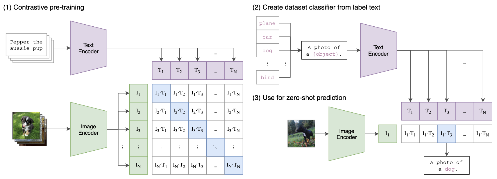
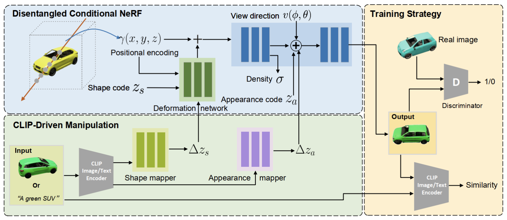
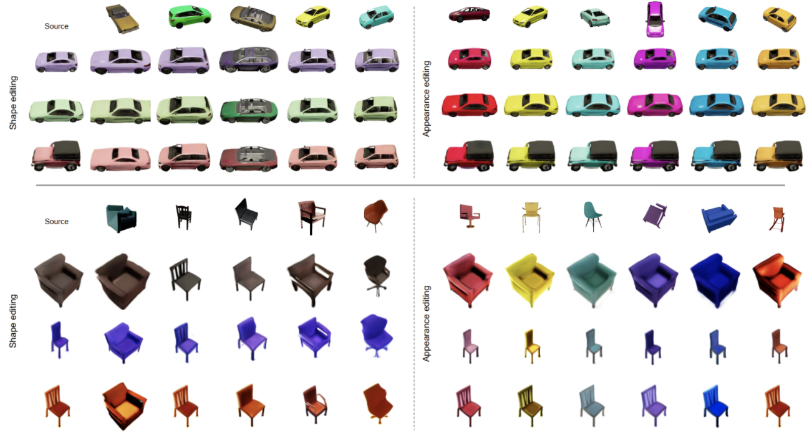

# CLIP-NeRF \[Eng\]
한국어로 쓰인 리뷰를 읽으려면 [**여기**](./cvpr-2022-clipnerf-kor.md)를 누르세요.

##  1. Introduction
In this article, I'm going to review the paper [CLIP-NeRF: Text-and-Image Driven Manipulation of Neural Radiance Fields(CVPR'22)](https://arxiv.org/abs/2112.05139), which suggests a way to manipulate synthesized views of NeRF with only prompt texts or exemplar images. This paper combines the methodology of [NeRF(ECCV'20)](https://arxiv.org/abs/2003.08934), which has recently received great attentin in the field of view synthesis and [CLIP(ICML'21)](https://arxiv.org/abs/2103.00020), which learns the correlation between text and image using a large-capacity (text, image) pair.

### Problem Definition
The problem in this paper is **implementing how to manipulate NeRF with a text prompt or a single reference image**. Specifically, the authors has changed the shape of the NeRF result by applying deformation field to the positional encoding of NeRF, and the color of the NeRF result by appling deferring color conditioning to the volumetric rendering stage of NeRF. Also they combined the NeRF model with pre-trained CLIP model and proposed a structure that could manipulate the shape or color of NeRF output by just manipulating the shape code and appearance code with prompt text or exemplar image.

## 2. Motivation
Since CLIP-NeRF introduces a method of manipulating NeRF's results by combining NeRF and CLIP methodologies, I will first introduce NeRF and CLIP in detail, introduce related works, and then let you know the idea of CLIP-NeRF.

### Related work
#### NeRF

View synthesis is a way to learn how to take pictures of 3D objects or scenes from different view points and create pictures of the objects from any new view point. NeRF, which uses volume rendering to carry out neural implicit presentation, enables high-quality view synthesis. NeRF is a deep neural network which takes the specific position $$(x, y, z)$$ of the 3D scene and view point $$(\theta, \phi)$$ and returns the color $$c = (r, g, b)$$, and the volume density $$\sigma$$, which represents the degree of light reflection at that position. The volume density is a unique characteristic that is determined by the type of substance present in a particular location and must have a value independent of the view point, but the color emitted may vary depending on the view point. The phenomenon that the color of an object changes according to the view point is called the non-Lambertian effect.

If we train NeRF properly, we can obtain the color and the volume density for all points in a 3D scene at a specific view point. After achieving this, 2D rendering can be created using the classical volume rendering method.

##### classical volume rendering
If you shoot light in the $$\mathbf{o}$$ direction at a particular point $$\mathbf{d}$$, then the trajectory of the camera ray can be represented by the equation of straight line $$\mathbf{r}(t) = \mathbf{o} + t \mathbf{d}$$. If the range of $$t$$ where the trajectory of this camera ray meets the 3D scene is up to $$[t_n, t_f]$$, then the color $C(\mathbf{r})$ of the 3D scene observed at $\mathbf{o}$ is expressed as follows:

$$
C(\mathbf{r}) = \int_{t_n}^{t_f}{T(t)\sigma(\mathbf{r}(t))\mathbf{c}(\mathbf{r}(t),\mathbf{d})}dt,

\\~\text{where}~ T(t) = \exp\Big(-\int_{t_n}^{t}\sigma(\mathbf{r}(s))ds\Big).
$$

An intuitive interpretation of this is that we can get colors from $$\mathbf{r}(t_n)$$ to $$\mathbf{r}(t_n)$$ of the 3D scene by NeRF, and can obtain the final color by integrating them. At this point, $$T(t)\sigma(\mathbf{r}(t),\mathbf{d})$$ multiplied before $$\mathbf{r}(t)$$ acts as weight. If there are many opaque objects in front of the object in the current location, the amount of the object in the current location contributes to the final color will be reduced. $$T(t)$$ is a reflection of this and represents the volume density accumulated to date. If the volume density accumulated to date is large, then $$\int_{t_n}^{t}\sigma(\mathbf{r}(s))ds$$ will be smaller, $$T(t)$$ will be smaller, and eventually the amount of contribution the current location will make to the final color will be reduced.

The amount contributed to the final color will also be proportional to the volume density $$\sigma(\mathbf{r}(t))$$, which is the opacity at a particular point. Multiplied by these two elements, $$T(t)\sigma(\mathbf{r}(t))$$ becomes the weight at a particular point. The principle of NeRF view synthesis is that RGB values of specific pixels of 2D view images can be calculated by a camera ray which is shot in a specific direction through classical volume rendering, and the final 2D image can be calculated by shooting camera rays repeatedly in multiple directions.

##### hierarchical volume sampling
NeRF calculates the above integral in a numerical way through sampling. Specifically, $$[t_n, t_f]$$ is divided into $$N$$ uniform intervals and sampling proceeds from the uniform distribution in each interval to estimate the color and volume density $$\hat{C}_c(\mathbf{r})$$ of coarse network. The fine network $$\hat{C}_f(\mathbf{r})$$, which estimates the color and volume density, is learned by performing inverse transform sampling proportional to the volume density of each interval calculated from the coarse network. This hierarchical volume sampling enables importance sampling, where there are many samples in areas that are heavily involved in final color calculation.

##### architecture
NeRF의 구체적인 architecture는 다음과 같습니다. NeRF $$F_{\Theta}$$는 MLP 기반의 deep neural network로 이루어져 있습니다. 먼저 3D coordinate를 8 fully-connected layer(ReLU activation, 256 channels per layer)에 통과시켜 volume density 와 256-dimensional feature vector를 얻습니다. 반환된 feature vector와 view point를 concat하여 뒤의 두 layer를 통과시켜 최종적인 RGB를 얻습니다. volume density를 view point에 무관하게 만들기 위해 neural network에서 volume density $$\sigma$$ 값을 얻은 후에 view point $\mathbf{d}$를 넣어준 것을 확인할 수 있습니다.

The specific architecture of NeRF is as follows. NeRF $$F_{\theta}$$ is a MLP based deep neural network. First, we pass the 3D coordinate through the 8 fully-connected layer(ReLU activation, 256 channels per layer) to obtain the volume density and 256-dimensional feature vector. Then we concatenate the returned feature vector and view point and pass through the two layers behind to obtain the final RGB. To make the volume density independent of view point, you can see that the view point $$\mathbf{d}$$ was added after obtaining the volume density $$\sigma$$ value from the network architecture.

##### positional encoding
The authors of NeRF confirmed that putting location information and view points directly into NeRF is not suitable for expressing the fast-changing part of an object in a 3D scene. To solve this problem, they introduced a method of mapping location information and view point to higher dimensional space using high frequency function. The authors used a positional encoding method similar to that in transformer. This means that $$F_{\Theta}$$ is represented by $$F_{\theta}' \circ \gamma$$ where $$\gamma(p) = (\sin(2^0 \pi p), \cos(2^0 \pi p), \cdots, \sin(2^{L-1} \pi p), \cos(2^{L-1} \pi p))$$ and  they independently applied $$\gamma$$ to normalized position $$\mathbf{x} = (x, y, z)$$ and normalized viewing director unit vector $$\mathbf{d} = (\sin\theta \cos\phi, \sin\theta\sin\phi, \cos\theta)$$ and achieved performance improvements.

##### loss function
Training takes place using photographs taken from various view points in a single 3D scene. The loss function is as follows.

$$
\mathcal{L} = \sum\limits_{\mathbf{r} \in \mathcal{R}} \Big[ ||\hat{C}_c(\mathbf{r}) - C(\mathbf{r}) ||_2^2 + ||\hat{C}_f(\mathbf{r}) - C(\mathbf{r}) ||_2^2 \Big]
$$

This is pixel-wise $$L_2$$ loss, which allows the coarse network and fine network to generate pictures that are close to the actual picture taken at each view point.

#### CLIP

Contrastive Language-Image Pretraining(CLIP) is a proposed model to overcome the limitations of traditional image classification models: 1) large amounts of labeled data are required for training and 2) individual training per task. CLIP first collects many (text, image) pairs that exist on the Internet. This process collects (text, image) pairs that exist on web pages such as Wikipedia, so no separate labeling process is required. Pre-training is performed to predict which text is attached to which image using 400 million (text, image) pairs collected. Pre-trained CLIP can predict the correlation between text and images as cosine similarity.

Givne $$\{(T_n, I_n) \}_{n=1}^{N}$$ of (text, image) pairs collected within mini-batch, text $$T_n$$ and image $$I_n$$ are passed through text encoder $$f_t$$ in transformer format and image encoder $$f_i$$ in ResNet or vision transformer format, and then embedded to feature space $$f_t(T_n) \in \mathbb{R}^{d_t}$$, $$f_i(I_n) \in \mathbb{R}^{d_i}$$, respectively.

The embedding vectors are multiplied by linear projection matrix $$W_t \in \mathbb{R}^{d_e \times d_t}$$, $$W_i \in \mathbb{R}^{d_e \times d_i}$$, respectively and we finally get embedding vectors of text and image in same output space. The pairwise cosine similarity matrix $S_{nm}(1 \le n, m \le N)$ between text and images within the mini-batch will be calculated as follows:

$$
S_{nm} = \frac{\langle W_t f_t(T_n), W_i f_i(I_m) \rangle}{|| W_t f_t(T_n) ||_2 \cdot || W_i f_i(I_m) ||_2} \times \exp(t)
$$

Here, $$t$$ is the learnable temperature parameter. After that, we proceed with training using the following symmetric cross-entropy loss.

$$
\mathcal{L} = \frac{1}{2} \Big[ \sum_{n=1}^{N} \frac{\exp(S_{nn})}{\sum_{k=1}^{N} \exp(S_{nk})} + \sum_{n=1}^{N} \frac{\exp(S_{nn})}{\sum_{k=1}^{N} \exp(S_{kn})} \Big]
$$

This is the loss of the pairwise cosine similarity matrix $$S_{nm}$$ to maximize the cosine similarity of the already correlated (text, image) pairs, $$S_{nn}(1 \le n \le N)$$. In the figure above, (1) Contrastive Pre-training corresponds to this process. CLIP trained in this way allows us to calculate the correlation between text and images as cosine similarity, so we can perform zero-shot image classification. For example, given a particular image, each category label can be given as an input to determine which category has the highest correlation, and the category with the highest cosine similarity can be predicted as the category of the image category. At this time, no matter what category label comes in, cosine similarity can be calculated, so there is no need to train by task. In the figure above, part (2) Create dataset classifier from label text, (3) Use for zero-shot prediction corresponds to this process.

#### NeRF Editing
NeRF, which can generate high-definition views from 3D scenes, received great attention, which led to many subsequent studies. Subsequent studies included DietNeRF, GRAF, which extend NeRF, such as applying NeRF to dynamic scenes rather than one fixed scene, or applying it to relighting and generative models. These follow-up studies have led to advances in NeRF, but there is a problem that it is difficult to intuitively manipulate the results because it still consists of millions of network parameters.

In order to address this problem, EditNeRF defined conditional NeRF, a structure that separates the 3D objects encoded with NeRF into shape code and color appearance code. By adjusting the two latent codes, the user can be able to control the shape and color of the object. However, EditNeRF only performed tasks that manipulating or erasing certain parts of the object, and there was a problem that the speed was very slow. Compared to EditNeRF, this study has the advantage of 1) being able to manipulate the overall shape of an object, 2) training two latent mappers to improve the reference speed, and 3) being able to easily manipulate the results of the NeRF using short prompt texts or exemplar images.

#### CLIP-Driven Iamge Generation and Manipulation
CLIP, as described above, allows the cosine similarity score of similar text and images to be increased in the shared latent space. With the help of the CLIP model, several methods have been proposed, such as Perez, StyleCLIP, and DiffusionCLIP, which generate manipulated images using text. These methods can manipulate images only using text, while in this study, the results of NeRF can be manipulated by both text and image.

### Idea
In this paper, they introduced an intuitive way to manipulate NeRF with a text prompt or a single reference image. This study was conducted in a discrete conditional NeRF structure that separated the latent space by shape codes that can transform the shape of objects and appearance codes that can control the color of objects.

In addition, they trained two code mappers using the CLIP model, which was a way to map CLIP features into a latent space to manipulate shape code and appearance code. In other words, when a prompt text or an exemplar image is given, it is used to change the shape or color of an object! After receiving the text prompt or exemplar image as condition, the feature vector was extracted using the pre-trained CLIP model, and it was put into the code mappers to create a local disposition on the late space of NeRF and manipulate the shape code and application code. For training, CLIP-based loss was designed to implement CLIP space consistency between input construction and output rendering, and to enable high-resolution NeRF management. In addition, they also proposed a method of extracting shape code, appearance code, and view point from the image.

The main contributions of this paper include:
- For the first time, text-and-image driven manipulation for NeRF has been proposed so that users can adjust 3D content with text or image.
- They proposed a discrete conditional NeRF architecture that adjusts the shape of the object with shape code and the color with appearance code.
- They proposed a feedforward code mapper that performs faster than the optimization-based deformation method.
- They propose an inverse optimization method, which is a method of extracting shape code, appearance code, and view point from the image.

## 3. Method

The authors are introducing the method part in following order: the general definition of conditional NeRF $$\rightarrow$$ disentangled conditional NeRF $$\rightarrow$$ CLIP-Driven Manipulation $$\rightarrow$$ Training Strategy $$\rightarrow$$ Disentangled Conditional NeRF. I think this is a probable order, so I will explain the research method in the same order in the paper.

### General
NeRF를 기반으로 하는 conditional NeRF는 모양과 색을 조절하는 latent vector들을 조작해서 하나의 3D object만 생성하는 것이 아니라, 특정 카테고리 내에서 모양과 색을 바꾸어가며 물체들을 생성할 수 있습니다. 이는 digit label을 condition으로 주어 MNIST dataset 내에서 원하는 숫자를 생성할 수 있는 conditional GAN과 유사한 방식이라고 생각하시면 될 것 같습니다. conditional NeRF는 3D scene의 특정 위치 $$(x, y, z)$$와 3D scene을 보는 view point $$(\theta, \phi)$$뿐만 아니라 생성할 scene의 모양을 지정하는 shape code $$z_s$$와 생성할 scene의 색을 지정하는 appearance code $$z_a$$를 입력받아 특정 위치 $$(x, y, z)$$에서의 방출되는 색 $$c = (r, g, b)$$과 불투명도인 volume density $$\sigma$$를 반환하는 continuous volumetric function $$\mathcal{F}_{\Theta}:(x,y,z, \phi, \theta, z_s, z_a) \rightarrow (r, g, b, \sigma)$$입니다. shape code, appearance code를 기존의 위지, view point와 단순하게 연결시킨 conditional NeRF의 trivial formulation $$\mathcal{F}_{\theta}'(\cdot)$$은 아래와 같습니다.
$$
\mathcal{F}_{\theta}'(x, v, z_s, z_a) : (\Gamma(x) \oplus z_s, \Gamma(v) \oplus z_a) \rightarrow (c, \sigma)
$$
이때, $$\oplus$$는 concatenation operator, $$\Gamma(\bold{p}) = \{ \gamma(p) | p \in \bold{p} \}$$는 NeRF에서 소개드렸던 sinusoidal positional encoding으로, $$\bold{p}$$ 내부의 좌표들인 $$x$$, $$y$$, $$z$$를 각각 high dimensional space로 mapping한 결과입니다. $\gamma(\cdot): \mathbb{R} \rightarrow \mathbb{R}^{2m}$은 아래와 같이 정의됩니다.

$$
\gamma(p)_k = \begin{cases}
\sin(2^k \pi p) & \text{if k is even}\\
\cos(2^k \pi p) & \text{if k is odd}\\
\end{cases}
$$
이때 $$k \in \{ 0, \cdots, 2m -1 \}$$이고, $$m$$는 hyperparameter입니다.

### Disentangled Conditional NeRF

conditional NeRF는 NeRF architecture를 개선해 모양과 색을 변형해가며 scene을 생성할 수 있게 만들었습니다. 위의 trivial conditional NeRF $$\mathcal{F}_{\theta}'(\cdot)$$은 모양을 바꾸기 위해 shape code를 조작하는데 색이 같이 변하는 등 모양과 색이 서로 간섭되는 문제가 있습니다. shape code와 appearance code가 완전히 분리되지 않은 것이죠. 이러한 문제를 해결하기 위해 이 연구에서는 disentangled conditional NeRF 구조를 제안합니다. 이를 통해 모양과 색을 개별적으로 조절할 수 있게 되었습니다. disentangled conditional NeRF를 구현하기 위해 실질적으로 conditional shape deformation과 deferred appearance conditioning을 제안했습니다. 이는 위의 CLIP-NeRF 그림의 Disentangled Conditional NeRF 부분에 해당합니다.

#### Conditional Shape Deformation

trivial conditional NeRF에서는 latent shape code를 positional encoding에 직접 concate했습니다. disentangled conditional NeRF에서는 이러한 방식을 이용하지 않고 shape code를 이용해 input position을 살짝씩 변경해주었습니다. 이러한 방식으로 shape code와 색을 완전히 분리시킬 수 있었습니다. 이를 위해 shape deformation network $$\mathcal{T} : (\mathbf{x}, z_s) \rightarrow \Delta \mathbf{x}$$을 도입했는데, 이는 $$\mathbf{x}$$와 $$z_s$$를 positional encoding $$\Gamma(\mathbf{x})$$에 해당하는 displacement vector인 $$\Delta \mathbf{x} \in \mathbb{R}^{3 \times 2m}$$으로 mapping하여 positional encoding의 각각의 element를 displacement vector만큼 살짝 변경해주는 방식입니다. deformed positional encoding은 $$\Gamma^*(\mathbf{p}, z_s) = \{ \gamma(p)_k + \tanh(\Delta p_k) | p \in \mathbf{p}, \Delta p \in \mathcal{T}(p, z_s) \}$$가 됩니다. 이때 $p$는 scalar, $$\Delta p \in \mathbb{R}^{2m}$$이고, $\tanh$는 displacement의 범위를 $$[-1, 1]$$로 제한시켜 positional encoding이 너무 많이 변하는 것을 막기 위해 이용되었습니다. 정리하면, shape code를 단순히 positional encoding에 concate하는 것이 아니라, position과 shape code가 주어졌을 때 positional encoding이 어떻게 변해야 하는지를 알려주는 $$\mathcal{T}$$를 통해 positional encoding을 변형시켜 준 것이죠.

#### Deferred Appearance Conditioning
NeRF에서 volume density가 view point에 무관한 값을 가지게 하기 위해 neural network에서 volume density를 얻은 후에 view point $$\mathbf{d}$$를 넣어준 것을 확인할 수 있었듯이, 색을 결정하는 appearance code를 volume density를 얻은 후에 view point와 concate해서 neural network에 넣어주게 되면 neural network의 구조상 appearance code는 volume density에 영향을 줄 수 없게 됩니다. 이러한 방식으로 appearance code는 모양에는 전혀 영향을 미치지 않으면서 색을 조작할 수 있습니다. 결과적으로 disentangled conditional NeRF $$\mathcal{F}_{\theta}(\cdot)$$은 아래와 같이 정의됩니다.
    
$$
\mathcal{F}_{\theta}(\bold{x}, v, z_s, z_a) : (\Gamma^*(\bold{x}, z_s), \Gamma(v) \oplus z_a) \rightarrow (c, \sigma)
$$

편의상 $$\mathcal{F}_\theta (v, z_s, z_a) = \{ \mathcal{F}_\theta(\bold{x}, v, z_s, z_a) | \bold{x} \in \mathbf{R} \}$$를 viewpoint $$v$$에서의 2D rendering image로 나타내도록 하겠습니다.

### CLIP-Driven Manipulation
위의 disentangled conditional NeRF를 baseline generator로 한 뒤 CLIP 모델과 연동하면 결과물을 view를 텍스트 기반으로 조작할 수 있습니다. 예를 들어, input text prompt $\mathbf{t}$와 initial shape/appearance code $z_s' / z_a'$이 있을 때 shape mapper $\mathcal{M}_s$와 appearance mapper $\mathcal{M}_a$를 아래와 같이 학습시킨다면 텍스트를 기반으로 하여 shape code와 appearance code를 적절히 조절할 수 있고, 결과적으로 disentangled conditional NeRF의 결과물의 모양과 색을 적절히 조절할 수 있게 됩니다.

$$
z_s = \mathcal{M}_s(\hat{\mathcal{E}}(\mathbf{t})) + z_s'\\
z_a = \mathcal{M}_a(\hat{\mathcal{E}}(\mathbf{t})) + z_a'
$$

이때 $$\hat{\mathcal{E}}_t(\cdot)$$는 사전에 학습된 CLIP text encoder이고 shape mapper와 appearance mapper는 CLIP embedding을 각각 shape code와 appearance code의 displacement vector로 mapping합니다. 이를 통해 text prompt 혹은 exemplar image를 통해 기존의 shape code와 appearance code를 위의 식처럼 변경할 수 있습니다.

shape mapper와 appearance mapper를 학습하기 위해서는 shape code와 appearance code를 변경한 뒤 렌더링 된 이미지 패치와 input text 사이의 embedding similarity를 계산해 이를 최대화해야 할 것입니다. 이를 위해 cross-modal CLIP 거리 함수 $$D_{\text{CLIP}}(\cdot, \cdot) = 1 - \langle \hat{\mathcal{E}}_i(\mathbf{I}), \hat{\mathcal{E}}_i(\mathbf{t}) \rangle$$를 정의합니다. $$\hat{\mathcal{E}}_i$$와 $$\hat{\mathcal{E}}_t$$는 사전에 학습된 CLIP image encoder와 text encoder이고, $$\mathbf{I}$$와 $$\mathbf{t}$$는 similarity를 계산할 이미지와 텍스트, $$\langle \cdot, \cdot \rangle$$은 cosine similarity operator입니다. 이는 위의 CLIP-NeRF 그림의 CLIP-Driven Manipulation 부분에 해당합니다.

### Training Strategy
CLIP-NeRF는 안정성을 위해 두 단계로 나누어 학습을 진행합니다. 먼저 CLIP과의 연동성을 생각하지 않고 conditional NeRF가 잘 동작하게 학습시키고 학습시킵니다. 그 다음으로 CLIP에서 주어진 text 혹은 image가 shape code와 appearance code를 잘 변형시켜 주어진 text 혹은 image와 cosine silimarity가 높은 NeRF 결과를 얻을 수 있도록 shape mapper와 appearance mapper를 학습시킵니다.

#### Disentangled Conditional NeRF
conditional NeRF generator $$\mathcal{F}_{\theta}$$는 non-saturating GAN loss function인 $$f(x) = -\log(1 + \exp(-x))$$를 이용해 discriminator $$\mathcal{D}$$와 함께 adversarial training 과정을 통해 서로 경쟁하면서 학습됩니다.

real images $$\mathbf{I}$$가 training data distribution $$d$$를 구성한다고 가정했을 때 shape code $$z_s$$와 appearance code $$z_a$$, camera pose를 $$\mathcal{Z}_s$$, $$\mathcal{Z}_a$$, $$\mathcal{Z}_v$$에서 뽑습니다. $$\mathcal{Z}_s$$, $$\mathcal{Z}_a$$는 normal distribution이고, $$\mathcal{Z}_v$$는 camera coordinate system의 북반구에서의 uniform distribution 입니다. 이때 training loss는 아래와 같습니다.
    
$$
\mathcal{L}_{\text{GAN}} = \mathbb{E}_{z_s \sim \mathcal{Z}_s, z_a \sim \mathcal{Z}_a, v \sim \mathcal{Z}_v}[f(\mathcal{D(\mathcal{F}_{\theta}(v, z_s, z_a)))}] + \\ \mathbb{E}_{\mathbf{I} \sim d}[f(-\mathcal{D}(\mathbf{I}) + \lambda_r || \nabla \mathcal{D}(\mathbf{I}) ||^2].
$$

conditional NeRF generator는 training data distribution과 최대한 유사한 2D rendering을 낼 수 있게 discriminator를 속여 위의 loss를 최대화하도록 학습되고, discriminator는 generator가 생성해낸 2D rendering을 가짜, training data distribution에 존재하는 실제 2D 이미지들은 진짜라고 판별할 수 있게 위의 loss를 최소화하도록 학습됩니다. $$\lambda_r$$는 discriminator의 안정성을 위한 regularization term의 weight입니다. 이는 위의 CLIP-NeRF 그림의 Training Strategy 부분에 해당합니다.

#### CLIP Manipulation Mappers
pre-trained NeRF generator $$\mathcal{F}_{\theta}$$와 pre-trained CLIP text, image encoder $$\{\hat{\mathcal{E}}_t, \hat{\mathcal{E}}_i \}$$, pre-trained discriminator $$\mathcal{D}$$를 CLIP shape mapper $$\mathcal{M}_s$$와 appearance mapper $$\mathcal{M}_a$$를 학습시키기 위해 활용합니다. disentangled conditional NeRF를 학습시킬 때와 마찬가지로 shape code $$z_s$$, appearance code $$z_a$$, camera pose를 $$\mathcal{Z}_s$$, $$\mathcal{Z}_a$$, $$\mathcal{Z}_v$$에서 무작위로 뽑습니다. 더불어 text prompt $$\mathbf{t}$$를 pre-defined text library $$\mathbf{T}$$에서 무작위로 뽑습니다. CLIP Manipulation Mapper를 학습시킬 때는 위에서 정의한 CLIP distance function $$D_{\text{CLIP}}(\cdot, \cdot)$$을 이용한 아래의 loss들을 활용합니다.

$$
\mathcal{L}_{\text{shape}} = f(\hat{\mathcal{D}}(\hat{\mathcal{F}}_{\theta}(v, \mathcal{M_s(\hat{\mathcal{E}}_t(\mathbf{t})) + z_s, z_a}))) + \\ \lambda_c D_{\text{CLIP}}(\hat{\mathcal{F}}_{\theta}(v, \mathcal{M}_s(\hat{\mathcal{E}}_t(\mathbf{t})) + z_s, z_a), \mathbf{t})
$$

$$
\mathcal{L}_{\text{appear}} = f(\hat{\mathcal{D}}(\hat{\mathcal{F}}_{\theta}(v, z_s, \mathcal{M_a(\hat{\mathcal{E}}_t(\mathbf{t})) + z_a}))) + \\ \lambda_c D_{\text{CLIP}}(\hat{\mathcal{F}}_{\theta}(v, z_s,  \mathcal{M}_s(\hat{\mathcal{E}}_t(\mathbf{t}))+ z_a), \mathbf{t})
$$

shape loss와 appearance loss를 각각 해석해보면 manipulation 후 생성된 이미지가 training data distribution에 속한 실제 이미지와 유사하도록 discriminator를 속이는 loss와 생성된 이미지가 CLIP embedding space 상에서 주어진 text prompt와의 cosine similarity가 커질 수 있도록 만들어주는 loss입니다.

### Inverse Manipulation
위의 manipulation pipeline은 shape code와 appearance code가 주어졌을 때만 수행할 수 있습니다. 그 이유는 disentangled conditional NeRF가 shape code, appearance code, view point를 입력으로 받아야 3D object를 출력할 수 있기 때문이죠. input image $$\mathbf{I}_r$$ 한 장만이 존재할 때 prompt text 혹은 exemplar image로 input image를 직접적으로 조작하기 위해서는 input image로부터 shape code, appearance code, view point를 역으로 추정할 수 있어야 합니다. 이를 위해 EM(Expectation-Maximization) 알고리즘을 이용한 반복적인 방법을 이용합니다. 이는 input image $$\mathbf{I}_r$$에 대한 shape code $$z_s$$, appearance code $$z_a$$, camera $$v$$를 최적화합니다. 구체적으로 알고리즘의 각 단계에서 $$z_s$$와 $$z_a$$를 고정시키고 아래의 loss를 이용해 $$v$$를 먼저 학습합니다. 이는 주어진 input image에 맞는 최적의 view point $$v$$를 찾는 과정입니다.

$$
\mathcal{L}_v = || \hat{\mathcal{F}}_{\theta}(v, \hat{z}_s, \hat{z}_a) - \mathbf{I}_r ||_2 + \lambda_v D_{\text{CLIP}}(\hat{\mathcal{F}}_{\theta}(v, \hat{z}_s, \hat{z}_a), \mathbf{I}_r)
$$

다음으로 $$v$$와 $$z_a$$를 고정시키고 아래의 loss를 이용해 shape code를 학습합니다. 이는 주어진 input image에 맞는 shape code $$z_s$$를 찾는 과정입니다.

$$
\mathcal{L}_s = || \hat{\mathcal{F}}_{\theta}(\hat{v}, z_s + \lambda_n z_n, \hat{z}_a) - \mathbf{I}_r ||_2 + \lambda_s D_{\text{CLIP}}(\hat{\mathcal{F}}_\theta(\hat{v}, z_s + \lambda_n z_n, \hat{z}_a), \mathbf{I}_r)
$$

마지막으로 $$v$$와 $$z_s$$를 고정시키고 아래의 loss를 이용해 appearance code를 학습합니다. 이는 주어진 input image에 맞는 최적의 appearance code $$z_a$$를 찾는 과정입니다.

$$
\mathcal{L}_{\text{appear}} = f(\hat{\mathcal{D}}(\hat{\mathcal{F}}_{\theta}(v, z_s, \mathcal{M_a(\hat{\mathcal{E}}_t(\mathbf{t})) + z_a}))) + \\ \lambda_c D_{\text{CLIP}}(\hat{\mathcal{F}}_{\theta}(v, z_s,  \mathcal{M}_s(\hat{\mathcal{E}}_t(\mathbf{t}))+ z_a), \mathbf{t})
$$

이때 $$z_n$$은 각각의 iteration step에서 추출된 random standard Gaussian noise vecetor로 최적화의 시작점을 찾기 위해 도입되었습니다. 최적화 과정에서 $$z_n$$의 크기는 1에서 0으로 점점 줄어듭니다.

## 4. Experiment & Result
### Experimental setup
#### Dataset
- Photographs: Composed of 150,000 chair photos with a resolution of $128 \times 128$.
- Carla: Composed of ten thousand car photos at $256 \times 256$ resolution.
- The view point information is not included in the dataset because adversarial training was performed.

#### Baselines
- The baseline model compared directly to CLIP-NeRF is EditNeRF.

#### Implementation Details
- designated conditional NeRF is an 8-layer MLP with ReLU activation with input dimension of 64 and hidden unit of 256.
- The shape deformation network is a 4-layer MLP with ReLU activation with a hidden unit of 256. Both shape code $z_s$ and appearance code $z_a$ are 128-dimensional vectors.
- Both shape mapper and appearance mapper are 2-layer MLP with ReLU activation. The channel size is 128 (input), $\rightarrow$ 256 (hidden), $\rightarrow$ 128 (output) for both mapers.
- They used PatchGAN as a discriminator.
- As an optimizer, they used adam optimizer with an initial learning rate of $10^{-4}$ and halved the learning rate for every 50K steps.
- The weight of the loss term is $\lambda_{r} = 0.5$, $\lambda_v = 0.1$, and $\lambda_s = \lambda_a = 0.2$.

#### Evaluation metric
- Several quantitative metrics were provided to evaluate the performance of CLIP-NeRF, such as FID score, editing time, and user study results.
- In addition, various images actually generated by CLIP-NeRF, such as clip-driven management, real image management, and ablation study result, were shown to provide qualitative evaluation.

### Result

#### CLIP-Driven Manipulation
As shown in the two results below, they have confirmed that the results of NeRF can be manipulated with the desired shape or color when prompt text (ex: long car, red car, etc.) is given and when exemplar image (sports car, table chair, etc.) is given.

#### Real Image Manipulation
They conducted an experiment to see if it is generalized to single real images that do not exist in the training set. Using the Inversion method, they mapped the single real image to shape code and appearance code and used it to create an image. Although the inverted image does not exactly match the real image, it can be seen that the performance of the manipulation result through text and image does not deteriorate.

#### Comparison with EditNeRF
First, CLIP-NeRF requires fewer views than EditNeRF. In the case of EditNeRF, view point is required, while CLIP-NeRF uses advertising training, so view point information is not required. For EditNeRF, the user should choose a color or draw a coarse scribble in the local region as shown below. However, for CLIP-NeRF, the user only need to provide a text prompt, which makes it much easier.

They also compared the FID scores of EditNeRF and CLIP-NeRF, which showed a lower FID score before manipulating the chair dataset because EditNeRF sees 40 views per chair instance, but after the deformation, the FID was significantly larger. In the case of car dataset, EditNeRF also only sees one view by car instance, so it was confirmed that the FID was clearly large.

In the case of EditNeRF, only certain parts of an object can be deformed when manipulating its shape, and even a few layers need to be optimized for this purpose. Furthermore, EditNeRF does not perform properly for unseen view. CLIP-NeRF, on the other hand, can make a big difference in overall shape and also performs well on unseen view. Compared to EditNeRF, the reference speed is also faster as shown below.

#### Ablation Study
When training without using the disentangled conditional NeRF structure and without conditional shape deformation network, the color changed together just by changing the shape. This is because the vectors representing shapes and colors are not completely separated.

#### User Study
Each user was asked a total of 20 questions. Each question has a common source image, five randomly extracted prompt text (or exemplar image), and a manipulated image, and the correct answer rate was reported by matching which prompt text(or exemplar image) generated which manipulated image.

## 5. Conclusion
In this study, they proposed a text-and-image driven management method for NeRF, which allows users to flexibly manipulate 3D content, which is the result of NeRF, by providing text prompts or exemplar images. To this end, they designed the disentangled conditional NeRF and introduced the CLIP-based shape and appearance code mapper. Additionally, they deduced the shape and appearance code from the real image and proposed an inversion method that can manipulate the real image.

However, there were limitations in this work, and there is a problem that fine-granted, and out-of-domain shapes cannot be adjusted as shown in the example below. This is because when we train pre-trained CLIP, we don't have enough information about detailed colors, and in the case of images or text outside the training set, we can't calculate the similarity properly.

In my opinion, there is no guarantee that conditional shape deformation does not change the color, manipulation will be difficult for complex 3D images, and there is a problem that we cannot decide which part of the complex 3D image to change. Also, it can be a problem that the number of people who participated in the user study is too small.

I think it was a great paper that suggested a new method by combining the results of NeRF and CLIP. Rather than having original and outstanding methods, it seems that the existing methods were properly utilized. In particular, disentangled conditional NeRF and CLIP-Driven Image Generation and Manipulation were key methods of this paper, and I think that there have been existing studies using these methods.

My personal guess is that since the problem they want to solve with EditNeRF is similar to that of EditNeRF, the reviewer pointed out that there is a lack of explanation about what is different from EditNeRF. Therefore, they reported FID, conference time, and the scope of each method thoroughly. I think it would have been very difficult to achieve high performance only with adversarial training by utilizing the GAN method, which is difficult to learn without information about view point, and it is also great that they succeeded. And I think extensive experiments of CLIP-NeRF is also a key point for the acceptance. If you have any questions, please contact us comfortably using the contact information below. :)

### Take home message \(오늘의 교훈\)
> CLIP-NeRF, NeRF, and CLIP are all great papers. I want to write an influential paper, too.
>
> Let's study the existing studies steadily and use them well in the right place.
>
> Extensive experiments increase the probability of acceptance of papers.

## Author / Reviewer information

### Author

**김창훈 (Changhun Kim)**

* Master's student of [MLILAB](https://mli.kaist.ac.kr) at [KAIST Graduate School of AI](https://gsai.kaist.ac.kr)
* Contact information : <ssohot1@kaist.ac.kr>, [GitHub](https://github.com/drumpt), [Blog](https://drumpt.github.io)
* Research interests : Speech Processing, Generative Models, Graph Neural Networks, Bayesian Deep Learning

### Reviewer

1. Korean name \(English name\): Affiliation / Contact information
1. Korean name \(English name\): Affiliation / Contact information
1. ...

## Reference & Additional materials

1. [CLIP-NeRF](https://arxiv.org/abs/2112.05139)
1. [CLIP-NeRF Implementation Examples](https://cassiepython.github.io/clipnerf/)
1. [CLIP-NeRF GitHub Repository](https://github.com/cassiePython/CLIPNeRF)
1. [NeRF](https://arxiv.org/abs/2003.08934)
1. [CLIP](https://arxiv.org/abs/2103.00020)
1. [PatchGAN](https://arxiv.org/abs/1611.07004v3)
1. [Transformer](https://arxiv.org/abs/1706.03762)