# CLIP-NeRF \[Kor\]
[**English version**](./cvpr-2022-clipnerf-eng.md) of this article is available.

##  1. Introduction
이 글에서 제가 소개드릴 논문은 [CLIP-NeRF: Text-and-Image Driven Manipulation of Neural Radiance Fields(CVPR'22)](https://arxiv.org/abs/2112.05139)로, view synthesis 분야에서 뛰어난 성과를 보여 최근 큰 주목을 받은 [NeRF(ECCV'20)](https://arxiv.org/abs/2003.08934)와 대용량의 (텍스트, 이미지) 쌍을 활용해 텍스트와 이미지 사이의 상관관계를 학습시킨 [CLIP(ICML'21)](https://arxiv.org/abs/2103.00020)의 방법론을 합쳐 prompt text 혹은 exemplar image만을 가지고 NeRF가 생성해낸 view를 변형할 수 있는 방법을 제안하는 논문입니다.

### Problem Definition
이 논문에서 풀고자 하는 문제는 **text prompt나 single reference image를 가지고 NeRF를 조작하는 방법을 구현하는 것**입니다. 구체적으로, deformation field를 NeRF의 positional encoding에 적용해 NeRF 결과물의 모양을 변경하고, deferring color conditioning을 NeRF의 volumetric rendering stage에 적용해 NeRF 결과물의 색을 바꿀 수 있는 disentangled conditional NeRF와 pre-trained CLIP 모델을 연동해 prompt text 혹은 exemplar image로 shape code와 appearance code를 조작하여 물체의 색을 변형시킬 수 있는 구조를 제안했습니다.

## 2. Motivation
CLIP-NeRF는 NeRF와 CLIP의 방법론을 합쳐 NeRF의 결과물을 변형하는 방법을 소개하고 있기 때문에 먼저 NeRF와 CLIP을 자세히 소개하고, 관련 연구들을 소개한 뒤 CLIP-NeRF의 아이디어를 말씀드리겠습니다.

### Related work
#### NeRF

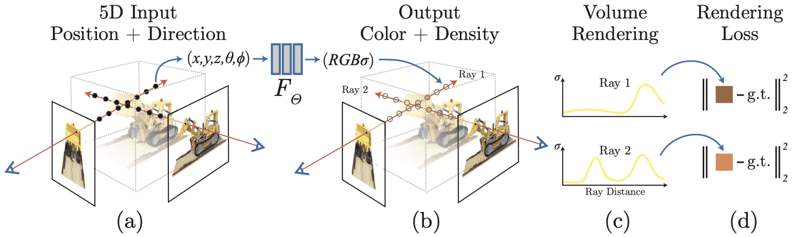

view synthesis는 3D 물체나 장면을 여러 각도에서 찍은 사진들을 학습해 임의의 새로운 각도에서 물체를 찍은 사진을 생성하는 방법입니다. volume rendering을 이용해 neural implicit representation을 진행하는 NeRF는 고품질의 view synthesis를 가능하게 합니다. NeRF는 3D scene의 특정 위치 $$(x, y, z)$$와 3D scene을 보는 view point $$(\theta, \phi)$$가 주어졌을 때 특정 위치 $$(x, y, z)$$에서의 방출되는 색 $$c = (r, g, b)$$과 빛이 반사되는 정도인 불투명도 나타내는 volume density $$\sigma$$를 반환하는 deep neural network입니다. 이때 volume density는 특정 위치에 존재하는 물질의 종류에 의해서 결정되는 고유한 특성이기에 view point에 무관한 값을 가져야 하지만, 방출되는 색은 아래의 그림처럼 어느 각도에서 보는지에 따라 달라질 수 있습니다. 물체의 색이 바라보는 각도에 따라 바뀌는 현상을 non-Lambertian effect라고 합니다.

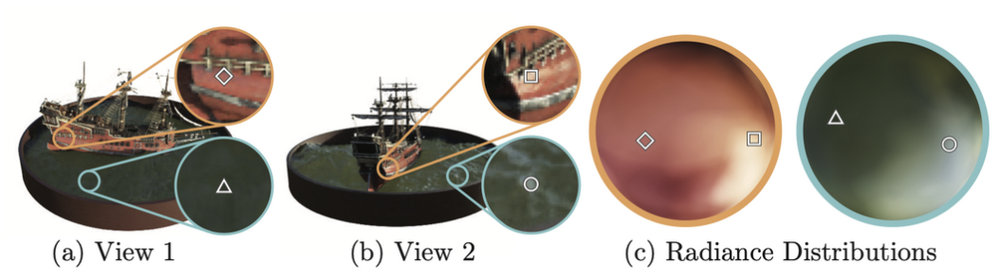

NeRF를 잘 학습시키면 특정 view point에서 3D scene의 모든 지점에 대한 색과 volume density를 얻을 수 있습니다. 이를 얻은 뒤에는 classical volume rendering 방법을 이용해 2D rendering을 생성할 수 있습니다.

##### classical volume rendering
특정 지점 $$\mathbf{o}$$에서 $$\mathbf{d}$$ 방향으로 빛을 쏜다고 하면 camera ray의 궤적은 직선의 방정식 $$\mathbf{r}(t) = \mathbf{o} + t \mathbf{d}$$로 나타낼 수 있고, 이 camera ray의 궤적이 3D scene과 만나는 $$t$$의 범위가 $$[t_n, t_f]$$까지라고 한다면 $\mathbf{o}$에서 관측된 3D scene의 색 $C(\mathbf{r})$은 아래와 같이 표현됩니다.

$$
C(\mathbf{r}) = \int_{t_n}^{t_f}{T(t)\sigma(\mathbf{r}(t))\mathbf{c}(\mathbf{r}(t),\mathbf{d})}dt,

\\~\text{where}~ T(t) = \exp\Big(-\int_{t_n}^{t}\sigma(\mathbf{r}(s))ds\Big).
$$

이를 직관적으로 해석하면 $$\mathbf{d}$$ view point에서 본 3D scene의 $$\mathbf{r}(t_n)$$에서 $$\mathbf{r}(t_f)$$까지의 색들을 NeRF를 통해 얻고, 이를 적분하여 최종적인 색을 얻을 수 있다는 것입니다. 이때, $$\mathbf{c}(\mathbf{r}(t),\mathbf{d})$$ 앞에 곱해지는 $$T(t)\sigma(\mathbf{r}(t))$$는 weight 역할을 합니다. 만약 현재 위치의 물체 앞에 불투명한 물체가 많다면 현재 위치의 물체가 최종적인 색에 기여하는 양이 줄어들게 될 것입니다. $$T(t)$$는 이를 반영한 값으로, 현재까지 누적된 volume density를 나타냅니다. 만약 현재까지 누적된 volume density가 크다면 $$\int_{t_n}^{t}\sigma(\mathbf{r}(s))ds$$의 값이 커져 $$T(t)$$는 작아지게 되고, 결국 현재 위치가 최종적인 색에 기여하는 양이 줄어들게 되는 것이죠. 또한, 최종적인 색에 기여하는 양은 특정 지점에서의 불투명도인 volume density $$\sigma(\mathbf{r}(t))$$에도 비례하게 될 것입니다. 이 두 요소를 곱한 $$T(t)\sigma(\mathbf{r}(t))$$가 특정 지점에서의 weight가 됩니다. classical volume rendering을 통해서 camera ray를 특정 방향으로 한 번 쏠 때마다 2D view image의 특정 pixel의 RGB값을 계산할 수 있게 되고, camera ray를 여러 방향으로 반복해서 쏘아 최종적인 2D image를 생성하는 것이 NeRF view synthesis의 원리입니다.

##### hierarchical volume sampling
이때 NeRF에서는 위의 적분을 샘플링을 통한 수치해석적인 방법으로 계산하게 됩니다. 구체적으로, $$[t_n, t_f]$$를 $N$개의 균일한 구간으로 나누고 각각의 구간에서의 uniform distribution에서 sampling을 진행하여 색과 volume density를 추정하는 coarse network $$\hat{C}_c(\mathbf{r})$$와 coarse network로부터 계산된 각각의 구간의 volume density에 비례하게 inverse transform sampling을 진행하여 색과 volume density를 추정하는 fine network $$\hat{C}_f(\mathbf{r})$$가 학습됩니다. 이러한 hierarchical volume sampling을 통해 최종적인 색 계산에 많이 관여하는 부분에 샘플이 많이 존재하게 되는 importance sampling을 구현할 수 있게 됩니다.

##### architecture
NeRF의 구체적인 architecture는 다음과 같습니다. NeRF $$F_{\Theta}$$는 MLP 기반의 deep neural network로 이루어져 있습니다. 먼저 3D coordinate $$\mathbf{x}$$를 8 fully-connected layer(ReLU activation, 256 channels per layer)에 통과시켜 volume density $$\sigma$$와 256-dimensional feature vector를 얻습니다. 반환된 feature vector와 view point를 concat하여 뒤의 두 layer를 통과시켜 최종적인 RGB를 얻습니다. volume density를 view point에 무관하게 만들기 위해 neural network에서 volume density $$\sigma$$ 값을 얻은 후에 view point $\mathbf{d}$를 넣어준 것을 확인할 수 있습니다.

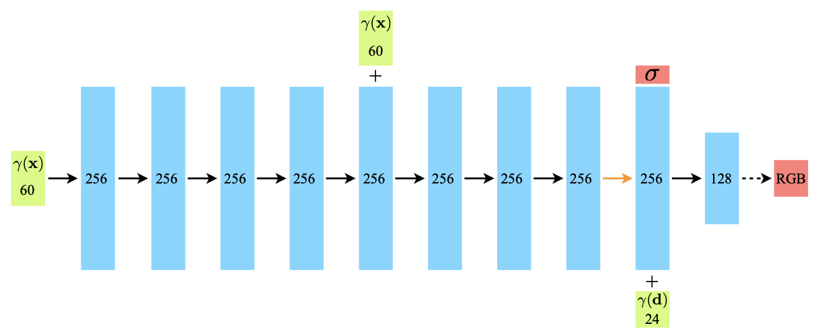

##### positional encoding
NeRF의 저자들은 위치 정보 $$(x, y, z)$$와 view point $$(\theta, \phi)$$를 NeRF $$\mathcal{F}_{\Theta}$$에 직접 넣는 것이 3D scene에서 물체의 모양, 색 등이 빠르게 변하는 부분을 표현할 때 적합하지 않음을 확인했습니다. 이를 해결하기 위해 high frequency function을 이용해 위치 정보와 view point를 higher dimensional space로 mapping한 뒤 NeRF 넣는 방법을 도입했습니다. 저자들은 transformer에서와 유사한 positional encoding 방법을 이용했습니다. 즉, $$F_{\Theta}$$를 $$F_{\theta}' \circ \gamma$$로 나타내고 $$\gamma(p) = (\sin(2^0 \pi p), \cos(2^0 \pi p), \cdots, \sin(2^{L-1} \pi p), \cos(2^{L-1} \pi p))$$를 normalized position $$\mathbf{x} = (x, y, z)$$와 normalized viewing director unit vector $$\mathbf{d} = (\sin\theta \cos\phi, \sin\theta\sin\phi, \cos\theta)$$의 각각의 element에 독립적으로 적용한 결과물을 $$F_{\theta}'$$에 넣는 방식을 통해 성능 개선을 이루었습니다.

##### loss function
학습은 하나의 3D scene을 다양한 view point에서 찍은 사진들을 활용해 이루어집니다. 이때 loss function은 다음과 같습니다.

$$
\mathcal{L} = \sum\limits_{\mathbf{r} \in \mathcal{R}} \Big[ ||\hat{C}_c(\mathbf{r}) - C(\mathbf{r}) ||_2^2 + ||\hat{C}_f(\mathbf{r}) - C(\mathbf{r}) ||_2^2 \Big]
$$

이는 각각의 view point에서 coarse network와 fine network가 실제로 찍은 사진과 가까운 사진을 생성할 수 있도록 만드는 pixel-wise $$L_2$$ loss입니다.

#### CLIP

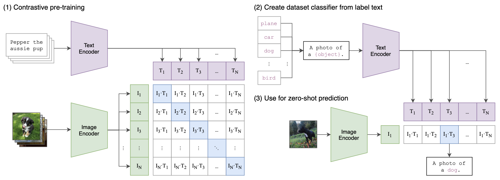

CLIP(Contrastive Language-Image Pretraining)은 기존의 이미지 분류 모델들이 가지는 한계점인 1) 학습을 위해 많은 양의 labeled data가 필요하고 2) task별로 학습을 새로 하야 된다는 것을 극복하기 위해 제안된 모델입니다. CLIP은 먼저 인터넷에 존재하는 수많은 (텍스트, 이미지) 쌍을 수집합니다. 이 과정에서는 Wikipedia 등 기존의 웹페이지에 존재하는 (텍스트, 이미지) 쌍을 수집하기 때문에 별도의 라벨링 과정이 필요 없습니다. 수집한 4억개의 (텍스트, 이미지) 쌍을 이용해 어떠한 텍스트가 어떠한 이미지에 붙혀지는지를 예측하는 사전 학습을 수행합니다. 사전 학습된 CLIP은 텍스트와 이미지 사이의 상관관계를 cosine similarity로써 예측할 수 있게 됩니다.

mini-batch 내에서 수집된 (텍스트, 이미지) 쌍 $$\{(T_n , I_n) \}_{n=1}^{N}$$에서 텍스트 $$T_n$$과 이미지 $$I_n$$은 각각 transformer 형식의 text encoder $$f_t$$와 ResNet 혹은 vision transformer 형식의 image encoder $$f_i$$를 통과한 뒤 feature space에 각각 $$f_t(T_n) \in \mathbb{R}^{d_t}$$, $$f_i(I_n) \in \mathbb{R}^{d_i}$$로 embeddng됩니다. embedding vector들은 linear projection matrix $$W_t \in \mathbb{R}^{d_e \times d_t}$$, $$W_i \in \mathbb{R}^{d_e \times d_i}$$와 각각 곱해져서 $$W_t f_t(T_n) \in \mathbb{R}^{d_e}$$, $$W_i f_i(I_n) \in \mathbb{R}^{d_e}$$가 됩니다. 텍스트와 이미지를 같은 차원을 가지는 output space에 embedding하게 되는 것이지요. 이후 mini-batch 내에서 텍스트와 이미지 사이의 pairwise cosine similarity matrix $S_{nm}(1 \le n,m \le N)$를 다음과 같이 계산하게 됩니다.

$$
S_{nm} = \frac{\langle W_t f_t(T_n), W_i f_i(I_m) \rangle}{|| W_t f_t(T_n) ||_2 \cdot || W_i f_i(I_m) ||_2} \times \exp(t)
$$

이때 $$t$$는 learnable temperature parameter입니다. 그 뒤에 다음과 같은 symmetric cross-entropy loss를 이용해 학습을 진행합니다.

$$
\mathcal{L} = \frac{1}{2} \Big[ \sum_{n=1}^{N} \frac{\exp(S_{nn})}{\sum_{k=1}^{N} \exp(S_{nk})} + \sum_{n=1}^{N} \frac{\exp(S_{nn})}{\sum_{k=1}^{N} \exp(S_{kn})} \Big]
$$

이는 pairwise cosine similarity matrix $$S_{nm}$$에서 이미 상관이 있던 (텍스트, 이미지) 쌍의 cosine similarity인 $$S_{nn}(1 \le n \le N)$$을 최대로 만드는 loss입니다. 위의 그림에서 (1) Contrastive Pre-training 부분이 이 과정에 해당합니다. 이러한 방식으로 학습된 CLIP은 텍스트와 이미지 사이의 상관관계를 cosine similarity로써 계산할 수 있게 되어 zero-shot image classification을 수행할 수 있습니다. 예를 들어 특정 이미지가 주어졌을 때, 각각의 카테고리 label을 입력으로 주면 어느 카테고리와의 상관관계가 가장 높은지를 cosine similarity 계산을 통해 알 수 있고, 가장 높은 cosine similarity를 가지는 카테고리를 이미지의 카테고로 예측할 수 있게 되는 것입니다. 이 때 어떠한 카테고리 label이 들어와도 cosine similarity를 계산할 수 있기 때문에 task별로 학습을 새로 할 필요 없게 됩니다. 위의 그림에서 (2) Create dataset classifier from label text, (3) Use for zero-shot prediction 부분이 이 과정에 해당합니다.

#### NeRF Editing
3D scene으로부터 고화질의 view를 생성할 수 있는 NeRF는 큰 관심을 받게 되었고 이는 많은 후속 연구들을 낳게 되었습니다. 후속 연구들은 NeRF를 고정된 하나의 장면이 아닌 동적인 장면에 적용하거나 relighting, generative models에 적용하는 등 NeRF를 확장하는 DietNeRF, GRAF 등의 연구였습니다. 이러한 후속 연구들을 통해 NeRF는 발전을 이루었지만, 여전히 수백만개의 network parameter로 이루어져 있기 때문에 직관적으로 결과물을 변형하기 어렵다는 문제가 있습니다.

이러한 문제를 해결하기 위해 EditNeRF는 conditional NeRF를 정의했는데, 이는 NeRF로 encoding된 3D object를 모양을 나타내는 shape code와 색을 나타내는 appearance code로 분리하는 구조였습니다. 두 latent code를 조절해서 사용자는 물체의 모양과 색을 조절할 수 있었습니다. 하지만 EditNeRF는 물체의 특정 부분을 변형하거나 지우는 정도의 task밖에 수행하지 못했고, 속도가 매우 느리다는 문제가 있었습니다. EditNeRF와 비교했을 때 이 연구는 1) 물체의 전체적인 모양을 자유롭게 변형할 수 있고 2) 두 개의 latent mapper를 학습시켜 inference 속도를 향상시킬 수 있고 3) 사용자가 짧은 text prompt나 exemplar image를 이용해 NeRF의 결과물을 쉽게 변형시킬 수 있다는 장점이 있습니다.

#### CLIP-Driven Iamge Generation and Manipulation
CLIP은 위에서 설명했듯이 shared latent space에서 유사한 텍스트와 이미지의 cosine similarity score를 커지게 해줍니다. CLIP 모델의 도움을 받아 텍스트를 이용해 이미지를 생성하고 변형하는 Perez, StyleCLIP, DiffusionCLIP 등의 여러 방법들이 제안되었습다. 이러한 방법들은 텍스트로만 이미지를 변형할 수 있는 반면, 이 연구에서는 텍스트와 이미지 모두로 NeRF의 결과물을 변형할 수 있습니다.

### Idea
이 논문에서는 text prompt나 single reference image를 가지고 NeRF를 조작하는 직관적인 방법을 소개했습니다. 이 연구는 물체의 모양을 변형할 수 있는 shape code와 물체의 색을 조절할 수 있는 appearance code로 latent space를 분리한 disentangled conditional NeRF 구조에서 이루어졌습니다.

또, CLIP 모델을 이용해 두 개의 code mapper를 학습시켰는데, 이는 CLIP feature를 latent space로 mapping해 shape code와 appearance code를 조작할 수 있게 만드는 방법이었습니다. 즉, prompt text나 exemplar image가 주어졌을때 이를 활용해 물체의 모양이나 색을 변경하는 것이지요! text prompt나 exemplar image를 condition으로 입력받아 pre-trained CLIP model을 이용해 feature를 뽑고, 이를 code mapper에 넣어줘 NeRF의 latent space 상에서 local displacement를 만들어 shape code와 appearance code를 변형시켰습니다. 학습을 위해 CLIP-based loss를 디자인해 input constraint와 output rendering 사이의 CLIP space consistency를 구현하고, 높은 해상도의 NeRF manipulation을 가능하게 했습니다. 또, 이미지로부터 shape code와 appearance code, view point를 추출해내는 방법도 제안했습니다.

이 논문의 주요 기여점은 다음과 같습니다.
- 유저가 텍스트나 이미지로 3D content를 조절할 수 있도록 text-and-image driven manipulation for NeRF를 최초로 제안했습니다.
- shape code로 물체의 모양을 조절하고, appearance code로 색을 조절하는 disentangled conditional NeRF architecture를 제안했습니다.
- optimization-based 변형 방법보다 빠른 성능을 보이는 feedforward code mapper를 제안했습니다.
- inverse optimization method를 제안하는데, 이는 이미지로부터 shape code와 appearance code, view point를 추출해내는 방법입니다.

## 3. Method

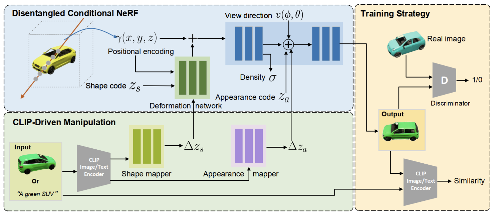

저자들은 conditional NeRF의 일반적인 정의 $$\rightarrow$$ disentangled conditional NeRF $$\rightarrow$$ CLIP을 이용한 NeRF 조작 $$\rightarrow$$ 학습 과정 $$\rightarrow$$ $$\rightarrow$$ Inversion Method 순서로 연구 방법을 소개하고 있는데, 이것이 개연성 있는 순서라고 생각해 이 글에서도 동일한 순서로 연구 방법을 설명하겠습니다.

### Conditional NeRF의 일반적인 정의
NeRF를 기반으로 하는 conditional NeRF는 모양과 색을 조절하는 latent vector들을 조작해서 하나의 3D object만 생성하는 것이 아니라, 특정 카테고리 내에서 모양과 색을 바꾸어가며 물체들을 생성할 수 있습니다. 이는 digit label을 condition으로 주어 MNIST dataset 내에서 원하는 숫자를 생성할 수 있는 conditional GAN과 유사한 방식이라고 생각하시면 될 것 같습니다. conditional NeRF는 3D scene의 특정 위치 $$(x, y, z)$$와 3D scene을 보는 view point $$(\theta, \phi)$$뿐만 아니라 생성할 scene의 모양을 지정하는 shape code $$z_s$$와 생성할 scene의 색을 지정하는 appearance code $$z_a$$를 입력받아 특정 위치 $$(x, y, z)$$에서의 방출되는 색 $$c = (r, g, b)$$과 불투명도인 volume density $$\sigma$$를 반환하는 continuous volumetric function $$\mathcal{F}_{\Theta}:(x,y,z, \phi, \theta, z_s, z_a) \rightarrow (r, g, b, \sigma)$$입니다. shape code, appearance code를 기존의 위치, view point와 단순하게 연결시킨 conditional NeRF의 trivial formulation $$\mathcal{F}_{\theta}'(\cdot)$$은 아래와 같습니다.
$$
\mathcal{F}_{\theta}'(x, v, z_s, z_a) : (\Gamma(x) \oplus z_s, \Gamma(v) \oplus z_a) \rightarrow (c, \sigma)
$$
이때, $$\oplus$$는 concatenation operator, $$\Gamma(\bold{p}) = \{ \gamma(p) | p \in \bold{p} \}$$는 NeRF에서 소개드렸던 sinusoidal positional encoding으로, $$\bold{p}$$ 내부의 좌표들인 $$x$$, $$y$$, $$z$$를 각각 high dimensional space로 mapping한 결과입니다. $\gamma(\cdot): \mathbb{R} \rightarrow \mathbb{R}^{2m}$은 아래와 같이 정의됩니다.

$$
\gamma(p)_k = \begin{cases}
\sin(2^k \pi p) & \text{if k is even}\\
\cos(2^k \pi p) & \text{if k is odd}\\
\end{cases}
$$
이때 $$k \in \{ 0, \cdots, 2m -1 \}$$이고, $$m$$는 hyperparameter입니다.

### Disentangled Conditional NeRF

conditional NeRF는 NeRF architecture를 개선해 모양과 색을 변형해가며 scene을 생성할 수 있게 만들었습니다. 위의 trivial conditional NeRF $$\mathcal{F}_{\theta}'(\cdot)$$은 모양을 바꾸기 위해 shape code를 조작하는데 색이 같이 변하는 등 모양과 색이 서로 간섭되는 문제가 있습니다. shape code와 appearance code가 완전히 분리되지 않은 것이죠. 이러한 문제를 해결하기 위해 이 연구에서는 disentangled conditional NeRF 구조를 제안합니다. 이를 통해 모양과 색을 개별적으로 조절할 수 있게 되었습니다. disentangled conditional NeRF를 구현하기 위해 실질적으로 conditional shape deformation과 deferred appearance conditioning을 제안했습니다. 이는 위의 CLIP-NeRF 그림의 Disentangled Conditional NeRF 부분에 해당합니다.

#### Conditional Shape Deformation

trivial conditional NeRF에서는 latent shape code를 positional encoding에 직접 concate했습니다. disentangled conditional NeRF에서는 이러한 방식을 이용하지 않고 shape code를 이용해 input position을 살짝씩 변경해주었습니다. 이러한 방식으로 shape code와 색을 완전히 분리시킬 수 있었습니다. 이를 위해 shape deformation network $$\mathcal{T} : (\mathbf{x}, z_s) \rightarrow \Delta \mathbf{x}$$을 도입했는데, 이는 $$\mathbf{x}$$와 $$z_s$$를 positional encoding $$\Gamma(\mathbf{x})$$에 해당하는 displacement vector인 $$\Delta \mathbf{x} \in \mathbb{R}^{3 \times 2m}$$으로 mapping하여 positional encoding의 각각의 element를 displacement vector만큼 살짝 변경해주는 방식입니다. deformed positional encoding은 $$\Gamma^*(\mathbf{p}, z_s) = \{ \gamma(p)_k + \tanh(\Delta p_k) | p \in \mathbf{p}, \Delta p \in \mathcal{T}(p, z_s) \}$$가 됩니다. 이때 $p$는 scalar, $$\Delta p \in \mathbb{R}^{2m}$$이고, $\tanh$는 displacement의 범위를 $$[-1, 1]$$로 제한시켜 positional encoding이 너무 많이 변하는 것을 막기 위해 이용되었습니다. 정리하면, shape code를 단순히 positional encoding에 concate하는 것이 아니라, position과 shape code가 주어졌을 때 positional encoding이 어떻게 변해야 하는지를 알려주는 $$\mathcal{T}$$를 통해 positional encoding을 변형시켜 준 것이죠.

#### Deferred Appearance Conditioning
NeRF에서 volume density가 view point에 무관한 값을 가지게 하기 위해 neural network에서 volume density를 얻은 후에 view point $$\mathbf{d}$$를 넣어준 것을 확인할 수 있었듯이, 색을 결정하는 appearance code를 volume density를 얻은 후에 view point와 concate해서 neural network에 넣어주게 되면 neural network의 구조상 appearance code는 volume density에 영향을 줄 수 없게 됩니다. 이러한 방식으로 appearance code는 모양에는 전혀 영향을 미치지 않으면서 색을 조작할 수 있습니다. 결과적으로 disentangled conditional NeRF $$\mathcal{F}_{\theta}(\cdot)$$은 아래와 같이 정의됩니다.
    
$$
\mathcal{F}_{\theta}(\bold{x}, v, z_s, z_a) : (\Gamma^*(\bold{x}, z_s), \Gamma(v) \oplus z_a) \rightarrow (c, \sigma)
$$

편의상 $$\mathcal{F}_\theta (v, z_s, z_a) = \{ \mathcal{F}_\theta(\bold{x}, v, z_s, z_a) | \bold{x} \in \mathbf{R} \}$$를 viewpoint $$v$$에서의 2D rendering image로 나타내도록 하겠습니다.

### CLIP을 이용한 NeRF 조작
위의 disentangled conditional NeRF를 baseline generator로 한 뒤 CLIP 모델과 연동하면 NeRF의 결과물을 텍스트 기반으로 조작할 수 있습니다. 예를 들어, input text prompt $\mathbf{t}$와 initial shape/appearance code $z_s' / z_a'$이 있을 때 shape mapper $\mathcal{M}_s$와 appearance mapper $\mathcal{M}_a$를 아래와 같이 학습시킨다면 텍스트를 기반으로 하여 shape code와 appearance code를 적절히 조절할 수 있고, 결과적으로 disentangled conditional NeRF의 결과물의 모양과 색을 적절히 조절할 수 있게 됩니다.

$$
z_s = \mathcal{M}_s(\hat{\mathcal{E}}_{t}(\mathbf{t})) + z_s'\\
z_a = \mathcal{M}_a(\hat{\mathcal{E}}_{t}(\mathbf{t})) + z_a'
$$

이때 $$\hat{\mathcal{E}}_t(\cdot)$$는 사전에 학습된 CLIP text encoder이고 shape mapper와 appearance mapper는 CLIP embedding을 각각 shape code와 appearance code의 displacement vector로 mapping합니다. 이를 통해 text prompt 혹은 exemplar image를 통해 기존의 shape code와 appearance code를 위의 식처럼 변경할 수 있습니다.

shape mapper와 appearance mapper를 학습하기 위해서는 shape code와 appearance code를 변경한 뒤 렌더링 된 이미지 패치와 input text 사이의 embedding similarity를 계산해 이를 최대화해야 할 것입니다. 이를 위해 cross-modal CLIP 거리 함수 $$D_{\text{CLIP}}(\cdot, \cdot) = 1 - \langle \hat{\mathcal{E}}_i(\mathbf{I}), \hat{\mathcal{E}}_i(\mathbf{t}) \rangle$$를 정의합니다. $$\hat{\mathcal{E}}_i$$와 $$\hat{\mathcal{E}}_t$$는 사전에 학습된 CLIP image encoder와 text encoder이고, $$\mathbf{I}$$와 $$\mathbf{t}$$는 similarity를 계산할 이미지와 텍스트, $$\langle \cdot, \cdot \rangle$$은 cosine similarity operator입니다. 이는 위의 CLIP-NeRF 그림의 CLIP-Driven Manipulation 부분에 해당합니다.

### 학습 과정
CLIP-NeRF는 안정성을 위해 두 단계로 나누어 학습을 진행합니다. 먼저 CLIP과의 연동성을 생각하지 않고 conditional NeRF가 잘 동작하게 학습시키고 학습시킵니다. 그 다음으로 CLIP에서 주어진 text 혹은 image가 shape code와 appearance code를 잘 변형시켜 주어진 text 혹은 image와 cosine silimarity가 높은 NeRF 결과를 얻을 수 있도록 shape mapper와 appearance mapper를 학습시킵니다.

#### Disentangled Conditional NeRF 학습
conditional NeRF generator $$\mathcal{F}_{\theta}$$는 non-saturating GAN loss function인 $$f(x) = -\log(1 + \exp(-x))$$를 이용해 discriminator $$\mathcal{D}$$와 함께 adversarial training 과정을 통해 서로 경쟁하면서 학습됩니다.

real images $$\mathbf{I}$$가 training data distribution $$d$$를 구성한다고 가정했을 때 shape code $$z_s$$와 appearance code $$z_a$$, camera pose를 $$\mathcal{Z}_s$$, $$\mathcal{Z}_a$$, $$\mathcal{Z}_v$$에서 뽑습니다. $$\mathcal{Z}_s$$, $$\mathcal{Z}_a$$는 normal distribution이고, $$\mathcal{Z}_v$$는 camera coordinate system의 북반구에서의 uniform distribution 입니다. 이때 training loss는 아래와 같습니다.
    
$$
\mathcal{L}_{\text{GAN}} = \mathbb{E}_{z_s \sim \mathcal{Z}_s, z_a \sim \mathcal{Z}_a, v \sim \mathcal{Z}_v}[f(\mathcal{D(\mathcal{F}_{\theta}(v, z_s, z_a)))}] + \\ \mathbb{E}_{\mathbf{I} \sim d}[f(-\mathcal{D}(\mathbf{I}) + \lambda_r || \nabla \mathcal{D}(\mathbf{I}) ||^2].
$$

conditional NeRF generator는 training data distribution과 최대한 유사한 2D rendering을 낼 수 있게 discriminator를 속여 위의 loss를 최대화하도록 학습되고, discriminator는 generator가 생성해낸 2D rendering을 가짜, training data distribution에 존재하는 실제 2D 이미지들은 진짜라고 판별할 수 있게 위의 loss를 최소화하도록 학습됩니다. $$\lambda_r$$는 discriminator의 안정성을 위한 regularization term의 weight입니다. 이는 위의 CLIP-NeRF 그림의 Training Strategy 부분에 해당합니다.

#### CLIP Manipulation Mappers 학습
pre-trained NeRF generator $$\mathcal{F}_{\theta}$$와 pre-trained CLIP text, image encoder $$\{\hat{\mathcal{E}}_t, \hat{\mathcal{E}}_i \}$$, pre-trained discriminator $$\mathcal{D}$$를 CLIP shape mapper $$\mathcal{M}_s$$와 appearance mapper $$\mathcal{M}_a$$를 학습시키기 위해 활용합니다. disentangled conditional NeRF를 학습시킬 때와 마찬가지로 shape code $$z_s$$, appearance code $$z_a$$, camera pose를 $$\mathcal{Z}_s$$, $$\mathcal{Z}_a$$, $$\mathcal{Z}_v$$에서 무작위로 뽑습니다. 더불어 text prompt $$\mathbf{t}$$를 pre-defined text library $$\mathbf{T}$$에서 무작위로 뽑습니다. CLIP Manipulation Mapper를 학습시킬 때는 위에서 정의한 CLIP distance function $$D_{\text{CLIP}}(\cdot, \cdot)$$을 이용한 아래의 loss들을 활용합니다.

$$
\mathcal{L}_{\text{shape}} = f(\hat{\mathcal{D}}(\hat{\mathcal{F}}_{\theta}(v, \mathcal{M_s(\hat{\mathcal{E}}_t(\mathbf{t})) + z_s, z_a}))) + \\ \lambda_c D_{\text{CLIP}}(\hat{\mathcal{F}}_{\theta}(v, \mathcal{M}_s(\hat{\mathcal{E}}_t(\mathbf{t})) + z_s, z_a), \mathbf{t})
$$

$$
\mathcal{L}_{\text{appear}} = f(\hat{\mathcal{D}}(\hat{\mathcal{F}}_{\theta}(v, z_s, \mathcal{M_a(\hat{\mathcal{E}}_t(\mathbf{t})) + z_a}))) + \\ \lambda_c D_{\text{CLIP}}(\hat{\mathcal{F}}_{\theta}(v, z_s,  \mathcal{M}_s(\hat{\mathcal{E}}_t(\mathbf{t}))+ z_a), \mathbf{t})
$$

shape loss와 appearance loss를 각각 해석해보면 manipulation 후 생성된 이미지가 training data distribution에 속한 실제 이미지와 유사하도록 discriminator를 속이는 loss와 생성된 이미지가 CLIP embedding space 상에서 주어진 text prompt와의 cosine similarity가 커질 수 있도록 만들어주는 loss입니다.

### Inversion Method
위의 manipulation pipeline은 shape code와 appearance code가 주어졌을 때만 수행할 수 있습니다. 그 이유는 disentangled conditional NeRF가 shape code, appearance code, view point를 입력으로 받아야 3D object를 출력할 수 있기 때문이죠. input image $$\mathbf{I}_r$$ 한 장만이 존재할 때 prompt text 혹은 exemplar image로 input image를 직접적으로 조작하기 위해서는 input image로부터 shape code, appearance code, view point를 역으로 추정할 수 있어야 합니다. 이를 위해 EM(Expectation-Maximization) 알고리즘을 이용한 반복적인 방법을 이용합니다. 이는 input image $$\mathbf{I}_r$$에 대한 shape code $$z_s$$, appearance code $$z_a$$, camera $$v$$를 최적화합니다. 구체적으로 알고리즘의 각 단계에서 $$z_s$$와 $$z_a$$를 고정시키고 아래의 loss를 이용해 $$v$$를 먼저 학습합니다. 이는 주어진 input image에 맞는 최적의 view point $$v$$를 찾는 과정입니다.

$$
\mathcal{L}_v = || \hat{\mathcal{F}}_{\theta}(v, \hat{z}_s, \hat{z}_a) - \mathbf{I}_r ||_2 + \lambda_v D_{\text{CLIP}}(\hat{\mathcal{F}}_{\theta}(v, \hat{z}_s, \hat{z}_a), \mathbf{I}_r)
$$

다음으로 $$v$$와 $$z_a$$를 고정시키고 아래의 loss를 이용해 shape code를 학습합니다. 이는 주어진 input image에 맞는 shape code $$z_s$$를 찾는 과정입니다.

$$
\mathcal{L}_s = || \hat{\mathcal{F}}_{\theta}(\hat{v}, z_s + \lambda_n z_n, \hat{z}_a) - \mathbf{I}_r ||_2 + \lambda_s D_{\text{CLIP}}(\hat{\mathcal{F}}_\theta(\hat{v}, z_s + \lambda_n z_n, \hat{z}_a), \mathbf{I}_r)
$$

마지막으로 $$v$$와 $$z_s$$를 고정시키고 아래의 loss를 이용해 appearance code를 학습합니다. 이는 주어진 input image에 맞는 최적의 appearance code $$z_a$$를 찾는 과정입니다.

$$
\mathcal{L}_{\text{appear}} = f(\hat{\mathcal{D}}(\hat{\mathcal{F}}_{\theta}(v, z_s, \mathcal{M_a(\hat{\mathcal{E}}_t(\mathbf{t})) + z_a}))) + \\ \lambda_c D_{\text{CLIP}}(\hat{\mathcal{F}}_{\theta}(v, z_s,  \mathcal{M}_s(\hat{\mathcal{E}}_t(\mathbf{t}))+ z_a), \mathbf{t})
$$

이때 $$z_n$$은 각각의 iteration step에서 추출된 random standard Gaussian noise vecetor로 최적화의 시작점을 찾기 위해 도입되었습니다. 최적화 과정에서 $$z_n$$의 크기는 1에서 0으로 점점 줄어듭니다.

## 4. Experiment & Result
### Experimental setup
#### Dataset
- Photoshapes : $128 \times 128$ 해상도의 15만개의 의자 사진으로 구성되어 있습니다.
- Carla : $256 \times 256$ 해상도의 만개의 자동차 사진으로 구성되어 있습니다.
- Adversarial training을 진행했기 때문에 view point 정보가 dataset에 포함되지 않습니다.

#### Baselines
- CLIP-NeRF와 직접적으로 비교되는 baseline 모델은 EditNeRF입니다.

#### Implementation Details
- disentangled conditional NeRF는 input dimension이 64, hidden unit이 256인 8-layer MLP with ReLU activation입니다.
- shape deformation network는 hidden unit이 256인 4-layer MLP with ReLU activation입니다. 이는 shape code $z_s$와 appearance code $z_a$는 모두 128-dimensional vector입니다.
- shape mapper와 appearance mapper는 모두 2-layer MLP with ReLU activation입니다. channel size는 두 mapper 모두 128(input) $\rightarrow$ 256(hidden) $\rightarrow$ 128(output)입니다.
- discriminator로는 PatchGAN을 이용했습니다.
- optimizer로는 초기의 learning rate가 $10^{-4}$인 adam optimizer를 이용했고, 50K step마다 learning rate를 반으로 줄였습니다.
- loss term의 weight는 각각 $\lambda_{r}=0.5$, $\lambda_v = 0.1$, $\lambda_s = \lambda_a = 0.2$ 입니다.

#### Evaluation metric
- CLIP-NeRF의 성능을 평가하기 위해 FID score, editing time, user study result 등 여러 정량적인 metric을 이용했습니다.
- 이 외에도 clip-driven manipulation, real image manipulation, ablation study result 등 CLIP-NeRF에서 실제로 생성한 다양한 이미지들을 보여주어 정성적인 평가도 제공했습니다.

### Result

#### CLIP-Driven Manipulation
아래의 두 결과와 경우와 같이 prompt text(ex : long car, red car 등)가 주어졌을 때와 exemplar image(스포츠카, 식탁의자 등)가 주어졌을 때 원하는 모양 또는 색으로 NeRF의 결과물을 조작할 수 있음을 확인했습니다.

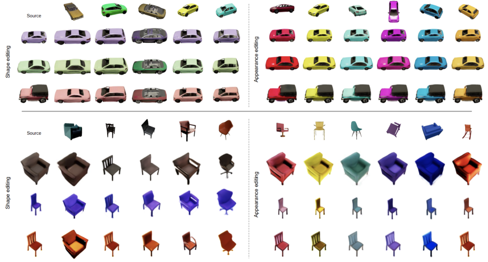

#### Real Image Manipulation
training set에 존재하지 않는 single real image에도 일반화가 되는지 알아보기 위해 실험을 진행했습니다. Inversion method를 이용해 single real image를 shape code와 appearance code로 mapping하고 이를 활용해 이미지를 생성했습니다. inverted image가 real image와 완전히 일치하지는 않았지만 text와 image를 통한 조작 결과물의 성능은 저하되지 않는 것을 확인할 수 있습니다.

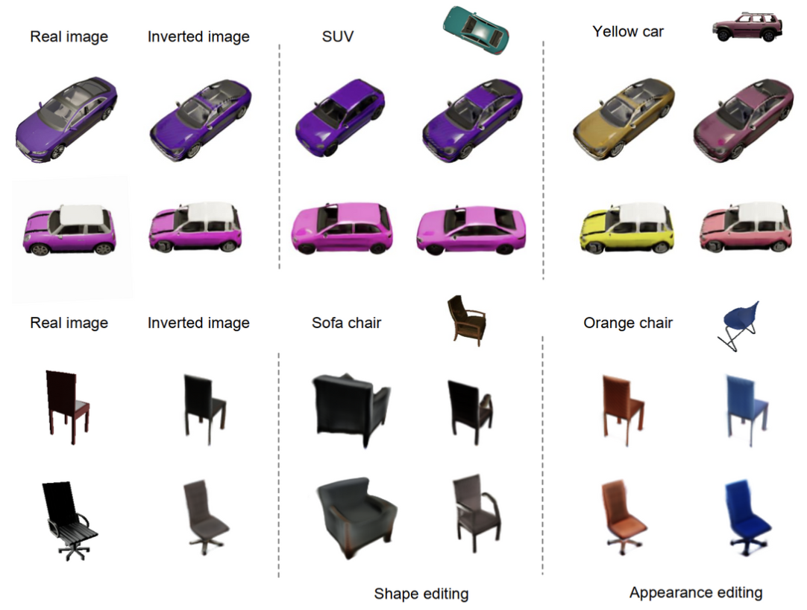

#### EditNeRF와의 비교
먼저 CLIP-NeRF는 EditNeRF보다 적은 수의 view가 필요합니다. EditNeRF의 경우 view point가 필요한 반면 CLIP-NeRF는 adversarial training을 이용하기 때문에 view point 정보가 필요없습니다. EditNeRF의 경우 사용자가 색을 정하고 아래의 그림처럼 coarse scribble을 local region에 그려야 합니다. 하지만 CLIP-NeRF의 경우 text prompt만 제공하면 되기 때문에 사용자 입장에서 훨씬 간편한 것을 느낄 수 있습니다.

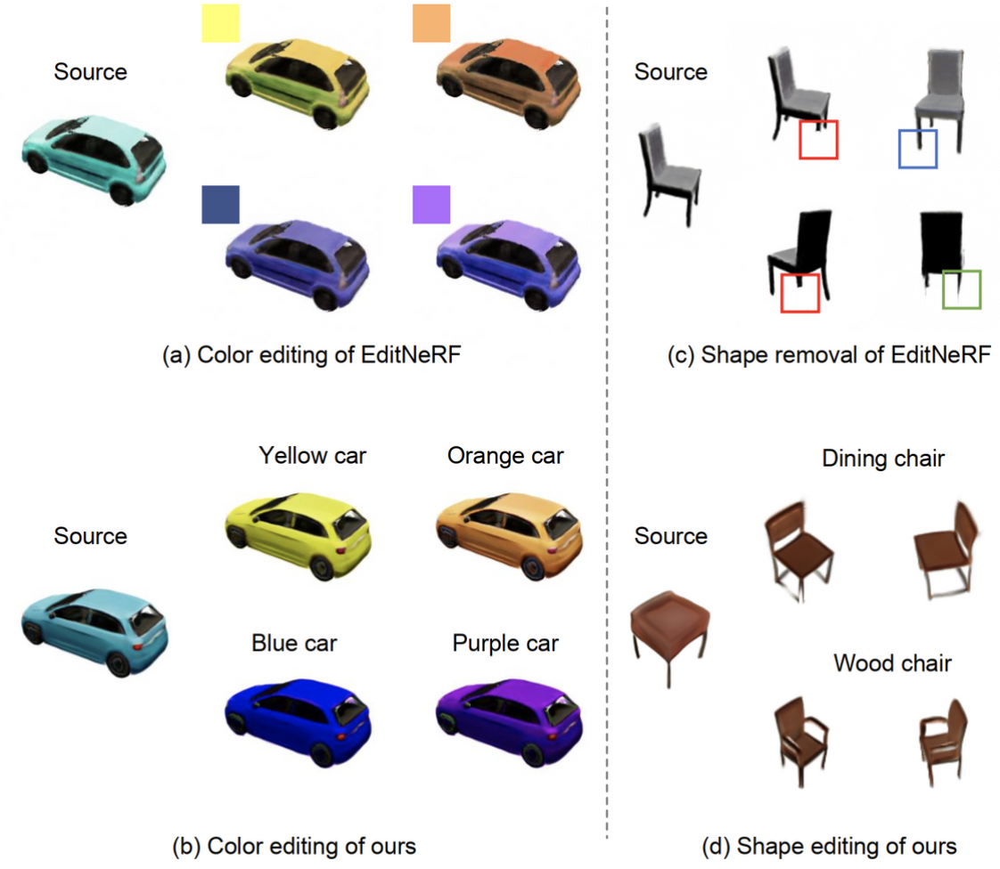

EditNeRF와 FID score도 비교해보았는데, EditNeRF가 chair instance별로 40 view를 보기 때문에 chair dataset을 변형하기 전에는 더 낮은 FID score를 보였지만, 변형 이후에는 FID가 확연하게 커졌습니다. car dataset의 경우 EditNeRF도 car instance별로 one view만을 보기 때문에 FID가 확연히 큰 것을 확인할 수 있었습니다.

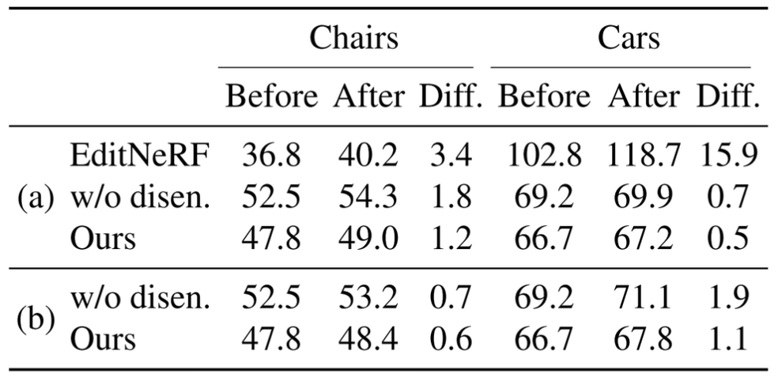

EditNeRF의 경우 모양을 변형할 때 물체의 특정 부분만을 변형할 수 있고 이를 위해 심지어 몇 개의 layer를 최적화해야 합니다. 더군다나 EditNeRF는 unseen view에 대해서 제대로 된 성능을 보이지 못합니다. 반면 CLIP-NeRF의 경우 전체적인 모양에 큰 변화를 줄 수 있고, unseen view에 대해서도 좋은 성능을 냅니다. 아래와 같이 EditNeRF에 비해 inference 속도도 빠릅니다.

#### Ablation Study
disentangled conditional NeRF 구조를 이용하지 않고 conditional shape deformation network 없이 학습했을 때는 모양만 바꾸려 해도 색이 같이 바뀌는 양상을 보였습니다. 이는 모양과 색을 나타내는 벡터가 완전히 분리되지 않았기 때문입니다.

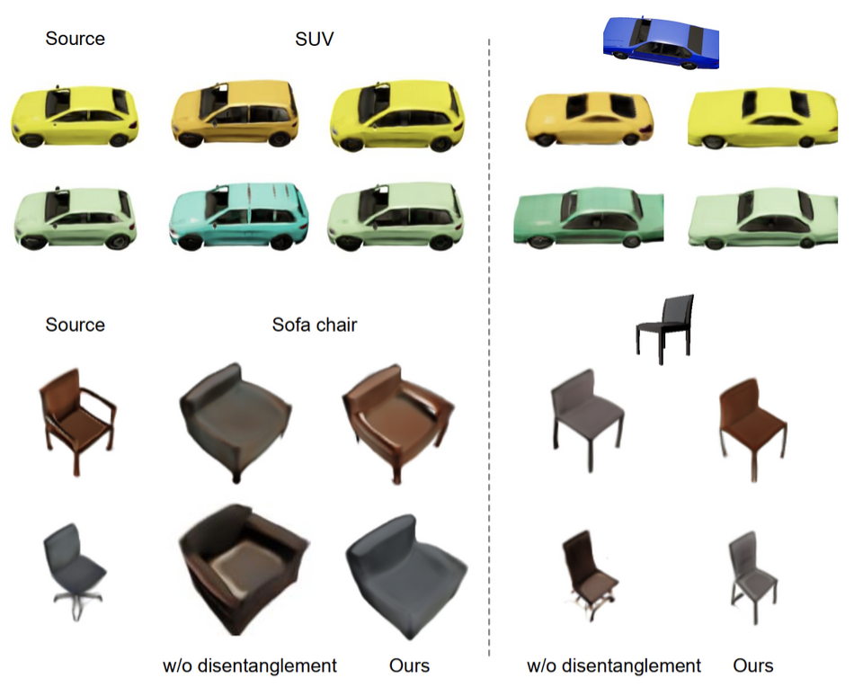

#### User Study
각각의 사용자에게 총 20개의 질문을 주었습니다. 각각의 질문에는 공통의 source image와 랜덤으로 추출된 5개의 prompt text(혹은 exemplar image)와 이들로 인해 변형된 이미지가 있는데, 어느 prompt text(혹은 exemplar image)가 어느 변형된 이미지를 생성했는지 맞추게 하여 정답률을 보고했습니다.

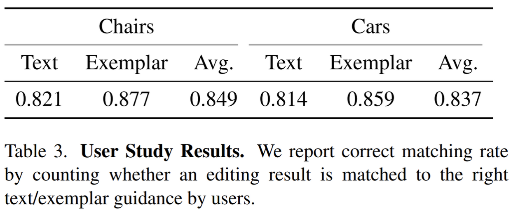

## 5. Conclusion

이 연구에서는 유저가 text prompt나 exemplar image를 제공해 NeRF의 결과물인 3D content를 유연하게 조작할 수 있는 text-and-image driven manipulation method for NeRF를 제안했습니다. 이를 위해 disentangled conditional NeRF를 디자인하고, CLIP 기반의 shape and appearance code mapper를 도입했습니다. 추가적으로 real image에서 shape와 appearance code를 추론하고 이로부터 real image를 변형할 수 있는 inversion method를 제안했습니다.

하지만 이 연구에도 한계가 존재했는데, 아래의 예시처럼 fine-granted, out-of-domain shape를 조정할 수 없다는 문제가 있습니다. 이는 pre-trained CLIP을 학습시킬 때 세부적인 색상에 대한 정보를 충분히 학습하지 못했고, training set 밖에 있는 이미지나 텍스트의 경우 similarity를 제대로 계산할 수 없기 때문입니다. 

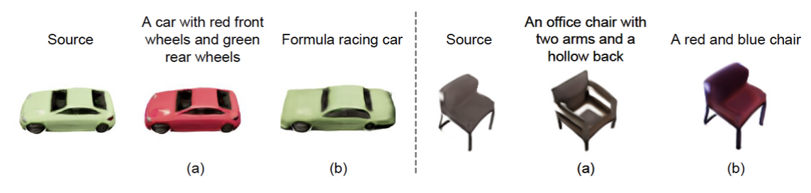

제 생각으로는 conditional shape deformation이 색을 변형시키지 않는다는 보장이 없고, 복잡한 3D image의 경우 manipulation이 어려울 것이며, 복잡한 3D image의 어느 부분에 변형을 가할지 정할 수 없다는 문제점이 있습니다. 또, user study에 참여한 사람이 너무 작다는 것도 문제가 될 수 있습니다.

소감으로는 NeRF와 CLIP의 결과물을 조합해서 새로운 방법을 잘 제안한 논문인 것 같습니다. 독창적이고 뛰어난 방법이 있다기보다는 기존에 존재하던 방법들을 적절히 잘 활용한 것으로 보입니다. 특히 disentangled conditional NeRF, CLIP-Driven Iamge Generation and Manipulation 등이 이 논문의 핵심 방법인데 이러한 방법들을 활용한 기존의 연구들이 있었다는 점에서 그렇게 생각합니다.

개인적인 추측으로는 EditNeRF와 풀고자 하는 문제가 유사해 EditNeRF와 무엇이 다른지에 대한 설명이 부족하다고 리뷰어들에게 지적을 받아 EditNeRF와 FID, Inference time, 각 방법의 범위 등을 철저히 비교한 것이 아닐까 하는 생각이 듭니다. view point에 대한 정보 없이 학습이 어려운 GAN method를 활용해 adversarial training 만으로 높은 성능을 내는 것이 대단히 어려웠을 것 같은데, 이를 성공시켰다는 점도 대단한 것 같습니다. 그리고 광범위한 실험을 통해 CLIP-NeRF의 결과가 좋다는 것을 보인 것이 논문 억셉의 비결이 아니었을까 싶습니다. 혹시 궁금한 점이 있으시다면 아래의 Contact information을 이용해 편하게 연락 주세요 :)

### Take home message \(오늘의 교훈\)
> CLIP-NeRF, NeRF, CLIP 모두 대단한 논문이다. 나도 영향력있는 논문을 쓰고 싶다.
> 
> 기존의 연구들을 착실하게 공부해놓고 적재적소에 잘 활용하자.
>
> 광범위한 실험은 논문의 억셉 확률을 높여준다.

## Author / Reviewer information

### Author

**김창훈 (Changhun Kim)**

* Master's student of [MLILAB](https://mli.kaist.ac.kr) at [KAIST Graduate School of AI](https://gsai.kaist.ac.kr)
* Contact information : <ssohot1@kaist.ac.kr>, [GitHub](https://github.com/drumpt), [Blog](https://drumpt.github.io)
* Research interests : Speech Processing, Generative Models, Graph Neural Networks, Bayesian Deep Learning

### Reviewer

1. Korean name \(English name\): Affiliation / Contact information
1. Korean name \(English name\): Affiliation / Contact information
1. ...

## Reference & Additional materials

1. [CLIP-NeRF](https://arxiv.org/abs/2112.05139)
1. [CLIP-NeRF Implementation Examples](https://cassiepython.github.io/clipnerf/)
1. [CLIP-NeRF GitHub Repository](https://github.com/cassiePython/CLIPNeRF)
1. [NeRF](https://arxiv.org/abs/2003.08934)
1. [CLIP](https://arxiv.org/abs/2103.00020)
1. [PatchGAN](https://arxiv.org/abs/1611.07004v3)
1. [Transformer](https://arxiv.org/abs/1706.03762)