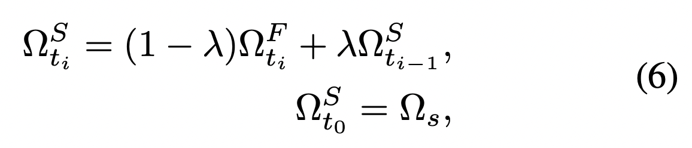
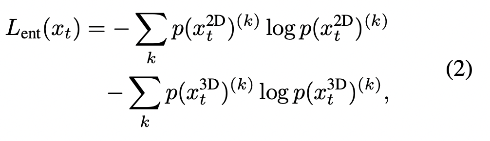

# MM-TTA: Multi-Modal Test-Time Adaptation for 3D Semantic Segmentation \[Eng\]

### Title & Description

_MM-TTA: Multi-Modal Test-Time Adaptation for 3D Semantic Segmentation \[Eng\]_

_&lt;Shin et al.&gt; / &lt;MM-TTA: Multi-Modal Test-Time Adaptation for 3D Semantic Segmentation&gt; / &lt;CVPR 2022&gt;_

한국어로 쓰인 리뷰를 읽으려면 [**여기**](cvpr-2022-mmtta-kor.md)를 누르세요.

##  1. Problem definition

Domain adaptation is the task that adapts the model trained with the source data to be suitable for the target data.

Since the source data is not always available the test-time adaptation approach has recently emerged as a solution.

The previous methods that target unimodal semantic segmentation cannot be directly adapted for the multi-modal task.

This paper proposes a method to take full advantage of multi-modality.

## 2. Motivation

### Related work

Test-time adaptation aims to enable adaptation without a source dataset that is used to train the pre-trained model. 
Test-time training is the approach that updates the model parameters with the proxy task that requires training samples, and the optimal proxy task that is hard to find.
TENT the first test-time adaptation method that updates batch norm parameters without a proxy task is a simple yet effective technique. However, TENT the entropy-minimization-based method tends to encourage the model to increase the confidence with the false prediction.
S4t selective self-training that regularizes pseudo labels is only considered for the specific task that spatial augmentation can be performed.

3D semantic segmentation has been recognized as an important 3D scene understanding task aimed at classifying each LiDAR point into semantic categories.
The unimodal approaches such as range-based methods that project a 3D point onto the 2D image plane, voxelizing the point cloud and utilizing SparseConvNet lack 2D contextual information that is essential to understanding the complex semantics of the scene.

### Idea

To address the weakness, the approaches that use multi-modal inputs for 3D segmentation are explored with the fusion techniques between the two modality features, RGB and point cloud that contains contextual and geometric information respectively. However, since each modality has different dataset biases(style distribution in 2D and the point distribution in 3D), multi-modality models are harder to adapt to new data. This paper tackles multi-modal 3D semantic segmentation in the test-time adaptation setting with the method that helps the two modality models jointly learn.

## 3. Method

Intra-modal pseudo label generation
They proposed Intra-PG to generate reliable online pseudo labels within each modality by having two models updated at a different pace. The fast model directly updates the batch normalization statistics and the slow model is slowly updated with the momentum update scheme from the fast model(equation 6). The models are updated aggressively and gradually provide a stable and complementary supervisory signal. The only slow updated model is used during the inference time.  They take an average of the logits from the two models to fuse their prediction.

Inter-modal pseudo label refinement
They proposed the Inter-PR module to improve pseudo labels via cross-modal fusion. The consistency between the two different pace models is introduced to select the output of which modality to be the pseudo label. There are two variants, hard select and soft select. Hard select use the modality that has the higher consistency between the slow and fast model, and the soft select use the weighted sum of the output of the two modalities. The consistency is measured by the inverse of KL divergence. The pseudo labels of which the maximum consistency measure over the two modalities is below a threshold are ignored. The objective to use the generated pseudo label for updating batch norm statistics is 
as below.

###### *Hard selection in inter-PR takes modality that has higher consistency between the two models. Are the two models here refers to fast model and slow model? Do you get the consistency of fast and slow model for each modality and choose more consistent modality? Then, I wonder why you chose the consistency of the two models. If the two models are not consistent, are you considering them as unstable?*

###### *A. In my opinion the consistency of fast and slow model supplements TTA setting that cannot access source data. In the case of UDA, you can also train the model with the source data to prevent the model from falling into the direction of reducing only the loss for test sets rather than the overall structure of the task. However, since it is not possible in TTA, it seems that they train the model by adapting to test data without harming the prediction of the learned model of source data.*

## 4. Experiment & Result

### Experimental setup

#### Dataset
For the A2D2-to-SemanticKITTI setting, A2D2 consists of a 2.3 MegaPixels camera and 16-channel LiDAR. SemanticKITTI uses a 0.7 MegaPixels camera and 64-channel LiDAR. The nuScenes Day-to-Night is used for the real-world case. The images captured during the day and night are obviously different while the LiDAR is almost invariant to lighting conditions. Synthia-to-SemanticKITTI is conducted to evaluate test-time adaptation between synthetic and real data.

#### Baselines
Self-learning with Entropy is originally proposed by TENT. They optimize the model by minimizing the entropy of model predictions. Only the fast model is used in this setting. This objective only encourages sharp output distributions, which may reinforce wrong predictions, and may not lead to cross-modal consistency. 

###### *Q. It says that the consistency between the two modalities cannot be calculated, but does cross-modal consistency preserve without giving a explicit penalty? Or, is cross-modal consistency not important because this study chooses the more consistent model among the two modalities?*

###### *A. The reason why the consistency between the two modalities cannot be measured properly is because the source data cannot be accessed. It is a good example if the predictions of the two modalities are the same incorrect answer. Despite being consistent, we don't penalize the prediction. Therefore, rather than considering consensus in the prediction of two modalities, the output of a more consistent modality is used as a pseudo-label to self-train the two modalities. As in the answer to question 1.*

###### *Q. Is TENT, xMUDA, and MM-TTA the self-learning model using entropy, consistency, and pseudo-label in the baseline model respectively? I am confused about the baseline model for each category.*.

###### *A. TENT is a method that considers entropy, and it is true that xMUDA considers consistency, but there is a setting using pseudo-label in xMUDA. In addition to cross-modal consistency, self-training with pseudo-labels within each modality. The main idea of MM-TTA, the method proposed in this paper, is pseudo-label generation through interaction between two modalities.*

Self-learning with Consistency aims to achieve multi-modal test-time adaptation via a consistency loss between predictions of 2D and 3D modalities with KL divergence. Different from the scenarios where the source data is accessible as xMUDA, MM-TTA is not regularized by the source data. Therefore, it may fail to capture the correct consistency when one of the branches provides a wrong prediction.

Self-learning with pseudo-labels optimizes the segmentation loss and the pseudo-labels provide supervisory signals. The pseudo-labels are obtained by thresholding the prediction as eq4. Since only the batch norm statistics are updated and the model still lacks information exchange between the modality to refine the pseudo-labels, it is sub-optimal.

#### Training Setup

They follow xMUDA the two-stream multi-modal framework. U-Net with a ResNet34 encoder is adopted for the 2D branch and the U-Net that utilizes sparse convolution on the voxelized point cloud input is used for the 3D branch. They use either SparseConvNet or MinkowskiNet.

They directly borrow the xMUDA official pre-trained model for fair comparison for the SparseConvNet. Mincowskinet was trained from scratch on source data.

TTA only optimizes for batch norm affine parameters during training and then reports performance after 1 epoch of adaptation. 

#### Evaluation metric
They use the metric ‘mIoU’ to evaluate their approach. mIoU is the common evaluation metric for the semantic segmentation task. To calculate the mIoU, the confusion matrix is required. The confusion matrix is obtained by counting how many the category pairs are. Category pair here means the pair of categories of ground truth and the prediction. There are #class*#class combinations of the category pairs. The diagonal elements on the matrix are considered intersections and the numbers on the cross on the diagonal elements are counted as a union. By taking an average of the IoU of every combination, we can get mIoU.

### Result

For UDA, they compare with the xMUDA framework that utilizes consistency loss and self-training using offline pseudo-labels. For TTA baselines, they evaluate TENT, xMUDA, xMUDA_pl.  They extend TENT to multiple modalities with entropy minimization on the ensemble of 2d and 3d logits. They evaluated the combination of them as well.

MM-TTA method performs favorably against all the TTA baselines in the three benchmark settings. Entropy and pseudo-labeling-based methods perform better than the consistency loss, due to the difficulty of capturing the correct consistency across modalities on TTA baselines on A2D2-to-SemantiKITTI and Synthia-to-SemanticKITTI. Even though some TTA baselines improve the performance of individual 2D and 3D predictions, the ensemble results are all worse than the source-only model. This is because the method is not designed to jointly learn between the multimodal outputs.

The domain gap is larger for RGB than LiDAR in the nuScences Day-to-Night there by the challenge mainly lies in how to improve the 2D branch and obtain effective ensemble results. Inter-PR contributes to this point. It demonstrates their effectiveness.

$xMUDA$ : Consistency between the two modalities

$xMUDA_{PL}$ : Consistency between the two modalities + intra pseudo-label

$TENT$ : Self-training with entropy.

$TENT_{ENS}$ : Self-training with entropy. Entropy minimization on the ensemble of the logits from the two modalities.

$MM-TTA$ : The self-training with the pseudo-label generated with the interaction between the two modalities

## 5. Conclusion

In this paper, they proposed a new problem setting of test-time adaptation on the multi-modal 3D semantic segmentation. Instead of adopting the method that has limitations, they suggested a novel method to refine the pseudo label intra, and inter the modality. Since the method didn’t analyze the task-specific characteristics deeply, there is still room to improve and the method can be adapted for other tasks that deal with the multi-modal supervisory signals.

###### *Q. Research on test time adaptation is being conducted as a practical method for unseen data required. Especially, MM-TTA is the method to utilize the inputs from the  various sensors. In the case of fusion of various input sensor data, I wonder how the parts that have different input cycles and not synchronized were handled in detail.*

###### *A. This paper focuses more on interaction between two modalities than on actual synchronization in real time. As it does not fuse representation of two modalities, each of which makes a prediction and takes a prediction of the modality that has higher confidence as a pseudo-label. Research on how to synchronize the inputs of various sensors seems to be a great topic for future research.*

### Take home message \(오늘의 교훈\)

 > Test-time adaptation is the emerging task that is practical for the real-world scenario. 
 
 > Starting from this work, the community can improve the performance by adding the module that is aiming to refine task or modality-specific features.
 
 > Others can bring this framework to their field as well.
 
 > As an early work for the test-time adaptation, this work is suggesting a large insight into all the machine learning communities.
 
## Author / Reviewer information

### Author

** 류형곤 \(Hyeonggon Ryu\)** 

* Affiliation \(KAIST\)
* Contact information \(gonhy.ryu@kaist.ac.kr)

### Reviewer

1. Korean name \(English name\): Affiliation / Contact information
2. Korean name \(English name\): Affiliation / Contact information
3. ...

## Reference & Additional materials

1. Inkyu Shin, Yi-Hsuan Tsai, Bingbing Zhuang, Samuel Schulter, Buyu Liu, Sparsh Garg, In So Kweon, Kuk-Jin Yoon. MM-TTA: Multi-Modal Test-Time Adaptation for 3D Semantic Segmentation. In CVPR, 2022.
2. Dequan Wang, Evan Shelhamer, Shaoteng Liu, Bruno Ol- shausen, and Trevor Darrell. Tent: Fully test-time adaptation by entropy minimization. In ICLR, 2021.
3. MaximilianJaritz,Tuan-HungVu,RaouldeCharette,E ́milie Wirbel, and Patrick Pe ́rez. xmuda: Cross-modal unsupervised domain adaptation for 3d semantic segmentation. In CVPR, 2020.
4. Christopher Choy, JunYoung Gwak, and Silvio Savarese. 4d spatio-temporal convnets: Minkowski convolutional neural networks. In CVPR, 2019.
5. Benjamin Graham, Martin Engelcke, and Laurens Van Der Maaten. 3d semantic segmentation with submanifold sparse convolutional networks. In CVPR, 2018.