# RegNeRF \[Kor\]

##  1. Problem definition
Neural Radiance Fields\(NeRF\) 태스크는 하나의 장면\(scene\)에 대한 다양한 시점\(viewing direction\)의 이미지들을 입력으로 neural network 모델을 학습하고, 이를 활용하여 입력 이미지들에는 없는 새로운 시점\(novel views\)에서 봤을 때의 모습을 담은 2D 이미지를 생성하는 것을 목표로 합니다.

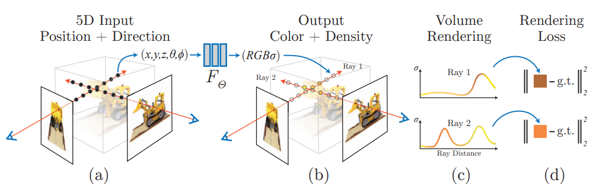

여기서 radiance fields란, 3차원 상에서 위치 좌표인 $\mathbf{x} = (x,y,z)$와 시점 $\mathbf{d} = (\theta, \phi)$ 를 색상 $\mathbb{c} = (R, G, B)$ 과 density인 $\sigma \in [0,\infty)$ 로 매핑하는 함수를 의미합니다.
풀어서 설명하자면, 실제 세상에서의 장면 중 어떠한 위치\(Figure 1.a 불도저의 삽 부분\)를 특정 시점에서 봤을 때, 2D 이미지의 픽셀 상에서 색상은 어떤 색상이며 density\(간단히 이해하면 배경이 아니고 물체일수록 높은 값을 가짐\)는 어떤지 예측하는 함수라고 볼 수 있습니다.
따라서 이와 같은 함수를 neural network로 모델링한 NeRF 모델을 잘 학습한다면 원하는 입력을 넣음으로써 학습 데이터에 없는 시점에서 봤을 때의 2D 이미지를 만들어낼 수 있을 것입니다.

이때, 모델의 출력인 $(\mathbb{c}, \mathbb{\sigma})$를 2D 이미지 픽셀의 색상으로 변환하는 과정을 volume rendering이라고 합니다.
직관적으로 이해하기위해 사과를 보는 것을 예시로 든다면, 사과의 속이 꽉 차 있으니 사과에 해당하는 모든 부분의 density값은 높겠지만 내가 보고있는 색상은 사과의 표면인 빨간색이 결정하는 것이지 속 부분인 하얀색은 관여하지 않을 것입니다.
NeRF 태스크에서 volume rendering은 이와 같은 상황을 모델링한 함수이고, 해당 과정을 통해 픽셀의 색상을 rendering하게 됩니다.
NeRF의 학습은 이와 같은 과정으로 rendering된 픽셀이 같은 위치의 ground truth 픽셀과 같아지도록 함으로써 이뤄지게 됩니다.

## 2. Motivation
당연하게도 하나의 scene에 대한 이미지가 많을 수록 novel view에서의 이미지를 예측하는 것은 쉬워질 것입니다.
하지만 RegNeRF의 저자는 실제 세상의 application\(AR, VR, 자율주행, 로보틱스 등\)을 고려했을 때 다양한 뷰의 이미지를 많이 가지는 것은 쉽지 않은데 반해, 기존 NeRF 모델들은 일정 수준 이상의 성능을 내려면 지나치게 많은 이미지를 필요로 한다고 주장합니다. \(RegNeRF 저자의 영상에서는 30~100장이라고 언급됨\)
따라서 sparse한 입력\(RegNeRF는 최소 3장을 가정함\)에서도 높은 수준의 novel view synthesis를 할 수 있어야한다는 motivation이 생기게 됩니다.

### Related work
앞서 언급했듯이 일부 기존 모델\(NeRF, mip-NeRF\)들은 입력이 sparse할 경우 성능이 급격히 하락하게 됩니다.
이와 같은 상황을 극복하기 위해 수행된 연구들은 크게 두가지 갈래가 있다고 합니다.

1. 다양한 시점을 가지고 있는 많은 scene으로 구성된 큰 데이터셋으로 pre-training
2. depth 정보 같은 supervision을 활용하여 모델에 regularization 적용

1번과 같은 방향의 연구로는 PixelNeRF, Steredo Radiance Fields, MVSNeRF 등이 있습니다.
이와 같은 방향은 pre-training에 활용할 데이터를 수집하는 것과 이를 학습하는 데에 많은 비용을 필요로 한다는 점과, 새로 학습해야할 scene이 pre-training 단계에서 학습한 domain과 다를 경우 일반화가 되지 않는다는 단점이 존재합니다.

DS-NeRF와 DietNeRF와 같은 모델은 2번에 해당하는데, 이들은 pre-training 단계 없이 처음부터 학습해도 sparse한 입력 상황에 대처가 가능합니다.
하지만 이들이 학습되기 위해 필요한 supervision들은 늘 주어지는 것이 아니고, 만일 주어지지 않는다면 이를 위해 별도의 레이블링이 필요하기 때문에 마찬가지로 비용을 초래하게 됩니다.

### Idea
저자는 별도의 supervision 없이, 주어지는 sparse한 입력만을 가지고 있는 상황에서도 좋은 성능을 보이는 NeRF 모델을 학습하기위한 regularization 기법을 제안합니다.
RegNeRF 모델은 rendering된 이미지의 patch에 대해 geometry와 appearance에 대한 regularization과, 학습 초기의 divergent behavior를 대처하기 위한 space annealing strategy가 적용된 NeRF 모델입니다.
새롭게 제안된 기법들은 주어진 입력 외의 외부 정보나 별도의 pre-training 과정이 필요 없기 때문에 RegNeRF는 앞서 언급된 단점을 가지지 않고 sparse한 입력 상황에 대처가 가능합니다.

## 3. Method
### mip-NeRF
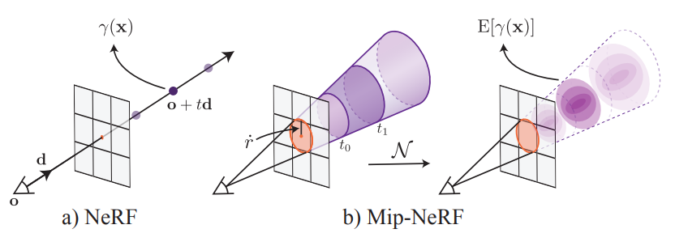

RegNeRF는 기본적으로 mip-NeRF 모델을 기반으로 하고 있습니다.
mip-NeRF는 하나의 픽셀이 rendering됨에 있어서 직선 형태의 ray만을 활용하는 NeRF와 달리, 원뿔 형태의 모델링을 활용해 하나의 점이 아닌 일정한 영역의 영향을 받게 하는 모델입니다.
이를 통해 여러 ray를 활용하는 효과를 효율적으로 얻을 수 있음과 더불어 coarse와 fine으로 나누어져 있는 NeRF의 network 구조를 하나의 network로 통합하여 더 간단한 구조를 가지게 되었습니다.
또한 카메라와 물체가 거리가 멀어질 때 계단 현상을 보이는 NeRF 고유의 artifacts를 없앨 수 있었습니다. 
저자는 이렇듯 NeRF보다 장점이 많은 mip-NeRF 모델 구조를 기반으로 제안하는 regularization 기법을 적용하게 됩니다.

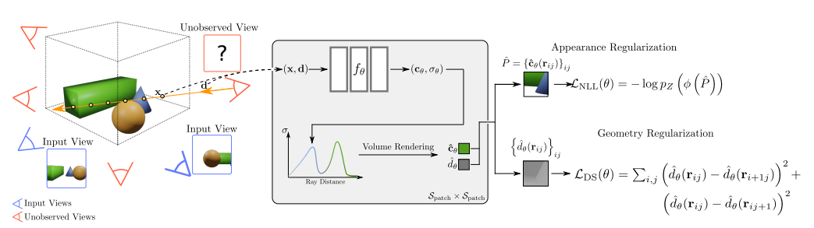

### Patch-based Regularization
위 그림에서 보여지듯 RegNeRF는 입력에 없는 보여지지 않은 시점(unobserved view)에 대해 rendering된 작은 patch에게 두가지 regularization을 적용해 학습하는 과정을 가지고 있습니다.

대부분의 경우 물체가 평평할 가능성이 높은 데에 착안하여, geometry regularization으로서 depth smoothness loss가 적용되게 됩니다.

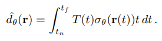

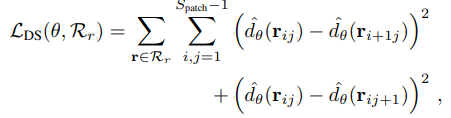

$S_{patch}$는 rendering된 patch의 사이즈, $r_{ij}$는 r이 중심이 되는 patch의 $(i,j)$를 통과하는 ray를 의미하며 위 loss를 통해 모델로 하여금 depth가 일정하도록 만드는 효과를 얻을 수 있습니다.

### Sample Space Annealing
저자는 sparse 입력 세팅에서 학습이 쉽지 않은 원인이 학습 초기에 발산하는 것이라고 지적합니다.

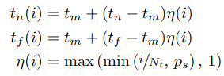

초반에 발산하는 문제를 해결하기 위해 위와 같은 방식으로 sample space를 조절하는 방법을 제시합니다.
$t_n$과 $t_f$는 각각 가까운 평면과 먼 평면을 의미하며, $t_m$은 이 두 사이의 중앙입니다.
$p_s$는 시작 범위에 대한 하이퍼파라미터로서, 이와 같은 방법을 적용하여 학습 초기의 안정성을 확보할 수 있었습니다.

## 4. Experiment & Result

### Experimental setup
Sparse한 입력 상황에 대한 성능 측정을 위해 모든 실험들은 3/6/9 장의 입력을 기준으로 수행되었고, 다른 구체적인 사항은 다음과 같은 세팅으로 이루어졌습니다.

#### - Dataset
* DTU: 테이블 위에 놓여진 물체를 촬영한 scene으로 구성.
* LLFF: DTU 데이터셋보다 조금 더 복잡한 환경의 scene으로 구성.

#### - Evaluation Metrics
* PSNR
* SSIM
* LPIPS
* 위와 같이 2D 이미지 reconstruction 세팅에서 사용되는 지표들이 활용됨.
* 모델 간의 쉬운 비교를 위해 본 논문에선 $10^{-\text{PSNR}/10}$,  $\sqrt{1-\text{SSIM}}$, LPIPS의 평균 또한 표기.

#### - Baselines
* PixelNeRF
* Stereo Radiance Fields \(SRF\)
* MVSNeRF
* mip-NeRF
* DietNeRF
* "ft"는 test time에서의 fine-tuned를 의미

### Result
저자는 우선 제안한 regularization의 효과를 확인하기 위해 mip-NeRF와의 비교 실험을 진행합니다.

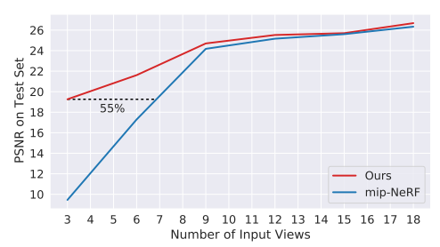

위의 결과와 같이 같은 PSNR을 달성하는 데에 필요한 입력 이미지의 개수가 55% 더 적은 것을 확인 할 수 있습니다.

다음은 baseline들과의 정량평가 결과입니다.

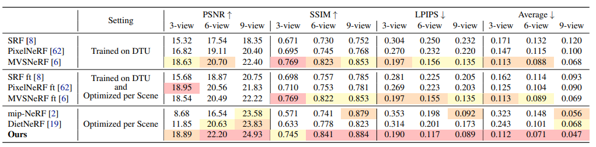
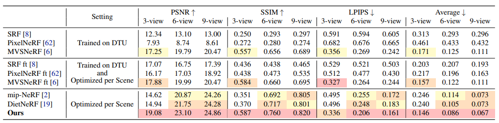

색상별로 순위가 표시되어 있으며, 두 데이터셋에 대해 모두 종합적으로 RegNeRF의 결과가 상위권임을 확인할 수 있습니다.

다음 결과는 논문에서 제안된 Scene Space Annealing, Geometry Regularization, Appearance Regularization에 대한 ableation study 결과입니다.
제안된 모든 기법들이 효과가 있는 것을 확인했으며, 가장 영향이 큰 것은 Scene Space Annealing 인 것으로 확인되었습니다.

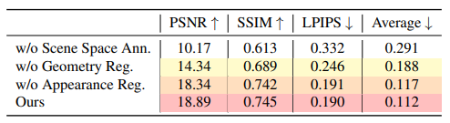

마지막으로 LLFF 데이터를 이용한 생성 결과입니다.
확대되어 있는 부분에서 볼 수 있듯이, RegNeRF가 다른 모델에 비해 디테일하게 생성되었음을 확인할 수 있습니다.

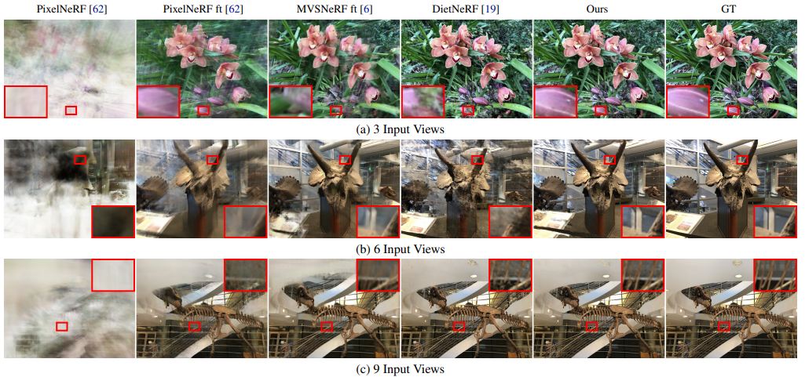

## 5. Conclusion
저자는 sparse한 입력 상황에서의 NeRF 모델이 잘 학습하기 위한 regularization 방법을 제안했습니다. 제안한 방법을 이용해 학습된 모델은 기존 baseline들에 비해 정량, 정성적으로 우수한 성능을 보였습니다.
대량의 데이터와 pre-training 혹은 별도의 supervision 없이 명확한 원인 분석과 더불어 이에 맞는 해결책인 patch-base의 regularization과 학습 방법으로 이와 같은 결과를 낸 것이 인상깊은 논문인 것 같습니다.

### Take home message \(오늘의 교훈\)

> 문제 해결은 명확한 원인 분석부터 시작해야한다.
>
> 문제의 해결책이 반드시 외부의 도움을 받거나 복잡할 필요는 없다.

## Author / Reviewer information

### Author

**구교정 \(Gyojung Gu\)** 

* KAIST AI (M.S)
* E-mail: gyojung.gu@kaist.ac.kr

### Reviewer

1. Korean name \(English name\): Affiliation / Contact information
2. Korean name \(English name\): Affiliation / Contact information
3. ...

## Reference & Additional materials

1. NeRF: Representing Scenes as Neural Radiance Fields for View Synthesis, Mildenhall et al, ECCV 2020\(oral\)
2. Mip-NeRF: A Multiscale Representation for Anti-Aliasing Neural Radiance Fields, Barron et al, ICCV 2021

