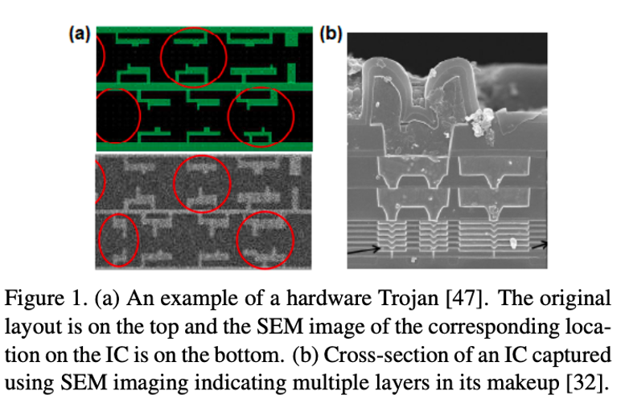
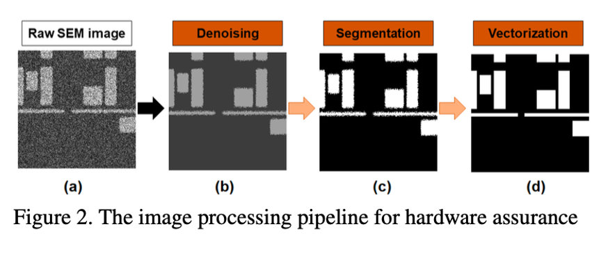
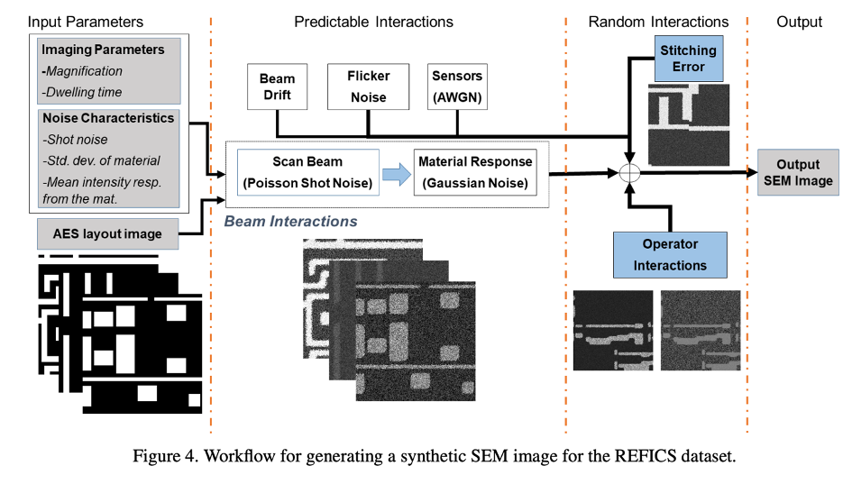
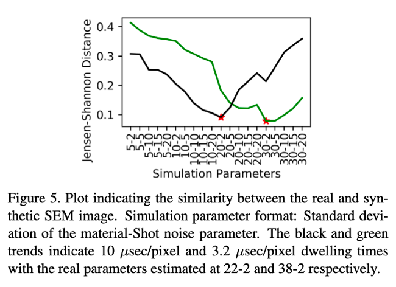
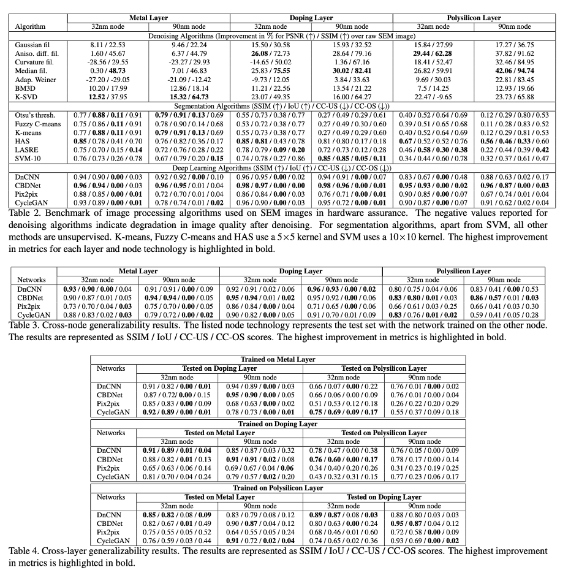

# REFICS: A Step Towards Linking Vision with Hardware Assurance [English]

Ronald Wilson / REFICS: A Step Towards Linking Vision with Hardware Assurance / Florida Institute for Cybersecurity Research (FICS) 

##  1. Problem definition

Integrated Circuits (IC) and Printed Circuits Boards (PCB) can contain small hidden modifications called hardware Trojans (Figure 1), the goal of hardware assurance is to check the presence of these modifications. In this paper the idea is to use computer vision to detect these malicious modifications. To do this it is necessary to artificially increase the existing data set and use denoising, segmentation, vectorization and deep learning to process the images (Figure 2).

## 2. Motivation

Hardware assurance is an essential process to ensure the good working condition of a hardware device. It mostly uses electron scanned microscopy images (SEM) but it is not well known from the computer vision community. Hardware assurance is really important because IC and PCB are becoming more and more used in our increasing digital world and Trojans in IC and PCB can impact the lifetime of devices or make these devices vulnerable to adversarial attacks. The problem is that the current method to locate these Trojans and to obtain data uses a lot of time and money consuming reverse engineering which is not very efficient. The semi-conductor industry is very protecting towards its technologies, it is why it is hard to obtain a good dataset hence the need to generate one.

### Related work

#### Denoising:

There are several existing works on how to process noisy SEM images. It includes spatial filtering approaches such as Gaussian, median, curvature, anisotropic diffusion, wavelet, adaptive wiener filter and hysteresis smoothing. You can also find works using high-frequency filtering and DL-based denoising, ML-based approaches. [1,2,3]

#### Segmentation:

Supervised segmentation approaches based on Support Vector Machines (SVM) and Convolutional Neural Network (CNN) were explored. Unsupervised algorithm like K-means Fuzzy C-means, LARSE and Otsu’s binarization have also been tested. [4,5,6]

#### Vectorization:

Only simple edge following algorithms have been test in this context. [7]

#### Deep Learning:

Pix2pix network was utilized to enhance SEM images and CycleGAN was used to transform such images into corner-deformed GT to have more images for comparison. DnCNN is the most used architecture to denoise real-work image photographs. [8,9,10]

### Idea

The idea of this paper is to start bridging the gap between the hardware assurance community and the computer vision community by building a data set and benchmark well-known algorithms in order to invite further cross-work between these two communities. 

## 3. Method

The first step is to create an artificial data set of SEM images, to do this about 10 000 standard cells from two libraries (32/28nm and 90nm) were used to create the 4 different layers of an integrated circuit which are called the doping, polysilicon, contacts and metal layers. [11,12] Two sets of parameters are important for the synthetization of the images, the first correspond to the imaging settings and the dwelling time per pixel. The other set deals with the noise characteristics (Figure 4).
The second step is to test all the preexisting methods detailed in “related work” on this dataset and see how they perform. 

## 4. Experiment & result

To test the newly generated SEM images a Jensen-Shannon divergence was used to compare the similarity with real images.

According to the papers the results (Figure 5) showed that the synthetic images were very similar to reals ones. Therefore 800,000 images were created to build the REFICS dataset.

To test all the different existing methods metrics such as intersection-over-union (IoU), structural similarity index measure (SSIM), mean squared error (MSE) and peak signal-to-noise (PSNR) were used to benchmark the different methods. Here are the results summarized in the following tables:

We can see in these results that these common metrics used to evaluate the methods are not stable and the creation of a novel metric specialized for hardware assurance should be done. We can also see that most approaches are not stable across node technologies and IC layers. 
Overall, these results show that further studies have to be led.

## 5. Conclusion

This work is just the beginning of a future cross work between hardware assurance and computer vision, due to the lack of data in this field the REFICS dataset was created artificially. Different methods that can be used in hardware assurance were benchmarked and showed the need of deeper studies using computer vision.

I personally thought that the article was quite hard to understand for a person that knows nothing about hardware assurance and that a lot of the conditions of the experiments were not very clear in the paper. 

## Take home message:

Computer vision is probably the future of Hardware Assurance.

## Author / Reviewer information

### Author

**Victor OSSO** 

* Affiliation \(KAIST AI\)

## Reference and additional material

[1] G Masalskis et al. Reverse engineering of cmos integrated circuits. Elektronika ir elektrotechnika, 88(8):25–28, 2008.

[2] A Lazar and Petru S Fodor. Sparsity based noise removal from low dose scanning electron microscopy images. In Computational Imaging XIII, volume 9401, page 940105. International Society for Optics and Photonics, 2015.

[3] KS Sim, ME Nia, and CPT so. Image noise cross-correlation for signal-to-noise ratio estimation in scanning electron microscope images. Scanning, 33(2):82–93, 2011. 

[4] Xuenong Hong, Deruo Cheng, Yiqiong Shi, Tong Lin, and Bah Hwee Gwee. Deep learning for automatic ic image analysis. In 2018 IEEE 23rd International Conference on Digital Signal Processing (DSP), pages 1–5. IEEE, 2018. 

[5] Deruo Cheng, Yiqiong Shi, Tong Lin, Bah-Hwee Gwee, and Kar-Ann Toh. Hybrid k-means clustering and support vector machine method for via and metal line detections in delayered ic images. IEEE Transactions on Circuits and Systems II: Express Briefs, 65(12):1849–1853, 2018.

[6] Ronald Wilson, Domenic Forte, Navid Asadizanjani, and Damon Woodard. Lasre: A novel approach to large area accelerated segmentation for reverse engineering on sem images. In ISTFA 2020: 46th International Symposium for Testing and Failure Analysis, page to be published. ASM Inter- national, 2020. 

[7] Simon Blythe, Beatrice Fraboni, Sanjay Lall, Haroon Ahmed, and Ugo de Riu. Layout reconstruction of complex silicon chips. IEEE journal of solid-state circuits, 28(2):138– 145, 1993. 

[8] Phillip Isola, Jun-Yan Zhu, Tinghui Zhou, and Alexei A Efros. Image-to-image translation with conditional adversarial networks. In Proceedings of the IEEE conference on computer vision and pattern recognition, pages 1125–1134, 2017. 

[9] Yoshihiro Midoh and Koji Nakamae. Image quality enhancement of a cd-sem image using conditional generative adversarial networks. In Metrology, Inspection, and Process Control for Microlithography XXXIII, volume 10959, page 109590B. International Society for Optics and Photonics, 2019. 

[10] Hao-Chiang Shao, Chao-Yi Peng, Jun-Rei Wu, Chia-Wen Lin, Shao-Yun Fang, Pin-Yen Tsai, and Yan-Hsiu Liu. From ic layout to die photo: A cnn-based data-driven approach. arXiv preprint arXiv:2002.04967, 2020.

[11] R Goldman, K Bartleson, T Wood, K Kranen, V Melikyan, and E Babayan. 32/28nm educational design kit: Capabilities, deployment and future. In 2013 IEEE Asia Pacific Conference on Postgraduate Research in Microelectronics and Electronics (PrimeAsia), pages 284–288. IEEE, 2013. 

[12] Richard Goldman, Karen Bartleson, Troy Wood, Kevin Kranen, C Cao, Vazgen Melikyan, and Gayane Markosyan. Synopsys’ open educational design kit: capabilities, deployment and future. In 2009 IEEE International Conference on Microelectronic Systems Education, pages 20–24. IEEE, 2009. 

