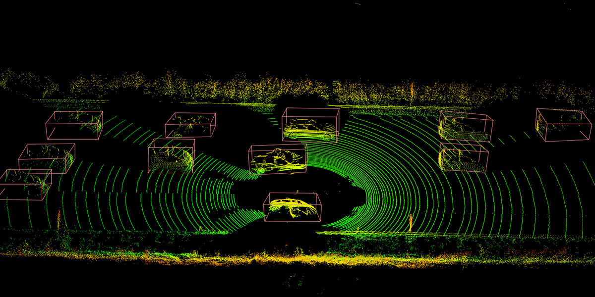
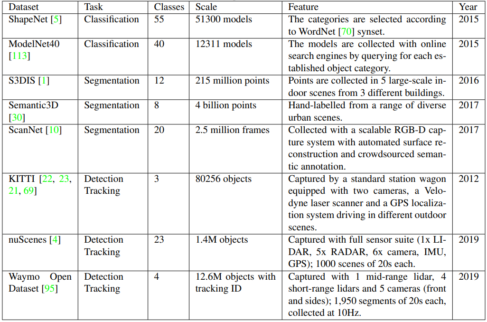
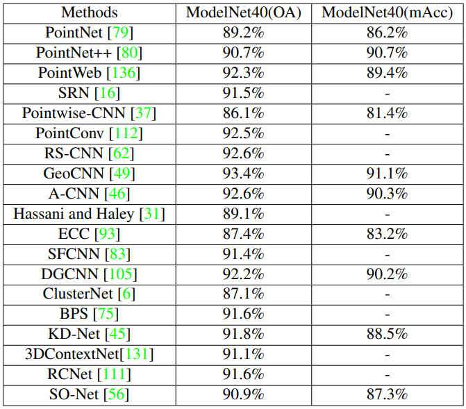
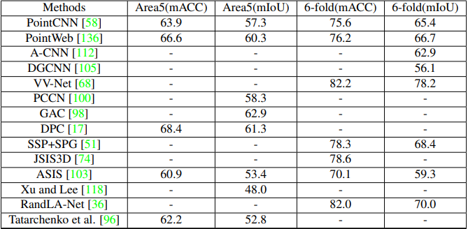
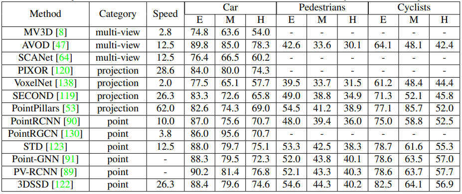

---
Haoming Lu et al./ Deep Learning for 3D Point Cloud Understanding; A Survey 
---

# Deep Learning for 3D Point Cloud Understanding: A Survey \[Eng\]

## 1. Problem definition

While deep learning is considered as a powerful AI technique and has shown outstanding performance while solving 2D vision tasks, some practical areas such as autonomous driving have not only relied on the processing of 2D images but also on the aquisition of 3D data that provides an opportunity to better understand the environment and thus make decisions that are more accurate and reliable. However, the analysis and processing of 3D point clouds is a challenging task due to irregularities, high dimensionality and disordered data structure. 
This paper presents the recent progress of deep learning techniques for understanding 3D points clouds and covers the latest developments and contributions in different major tasks such as 3D shape classification and segmentation, 3D shape object detection and tracking and 3D point cloud matching and registration. It also provides an introduction to well-established datasets in this area, different metrics and state-of-the-art results.

## 2. Motivation

The acquisition and processing of high-resolution 3D data, usually produced by 3D sensors such as laser scanners, LIDARs or RGB-D cameras, has become an important research topic in different fiels such as autonomous driving and mobile robotics. Those devices scan the surfaces of the visible environment in a grid of individual points. The result is a point cloud consisting of many millions of individual coordinates. Many individual scans are then stacked in the correct position to form the overall point cloud which gives a precise 3D representation of the surrounding environment or the scanned objects. 
Due to increasing attention from academia and industry and the rapid development of 3D scanning devices, the processing of point cloud using deep learning has become a popular topic in 3D understanding and despite the complexity of the task, promising results have been obtained on many different point cloud tasks. This motivated the authors to gather all these findings, to provide comprehensive comparisons of different state-of-the-art models and datasets, and to inspire and support future research in 3D understanding.

### 3.Related work

Since it is a survey that discusses several categories in the point cloud processing field, the related works as well as the experiments of each category will be included in the corresponding section. 
On the other hand, another similar survey has been conducted in 2020 by Yulan Guo et al. and according to the authors it was the first survey paper to cover deep learning methods for different point cloud understanding tasks. If we consider the difference between the two surveys, they normally follow the same approach except that the one that I am currently reviewing provides more recent findings and focuses particularly on the widely used models and techniques.

### 4.Idea

To approach the field of point cloud processing with deep learning and cover each of its components and to structure their findings, the authors start by introducing the existing datasets and corresponding metrics. Then, they divided the recent works on point clouds in five diffent categories and provided detailed descriptions on each of them:
1. Classification
2. Segmentation
3. Detection, tracking and flow estimation
4. Registration and matching
5. Augmentation and Completion

As stated below, the authors mention the experiments and results of the different methods in each of these categories and provide in some cases different comparisons to other techniques.

## 5. Method

## Datasets
To allow training models more accurately and provide a convictive comparison among different algorithms, availability of different labeled datasets is very important. 
The following table shows some of the most commonly used 3D point cloud datasets. Most datasets contains not only information from LIDAR but also provide corresponding images which make them suitable for different tasks such as classification, segmentation and detection.

To reduce the gap between research and industrys, several other large-scale datatasets have been developed especially with the emergence of the autonomous driving field. 

## Metrics

To test the different available methods for various point cloud understanding tasks and provide a valid evaluation, different metrics are required depending on the task. In the following the most frequently metrics used for each task: 
- 3D shape classification: overall Accuracy (OA), mean Accuracy (mAcc) 
- Segmentation models: accuracy, mean Intersection over Union (mIoU)
- 3D object detection: mIoU, accuracy, precision, recall
- Object tracking: Multi-Object Tracking Accuracy (MOTA), Multi-Object Tracking Precision (AMOTP)
- Scene flow estimation: End Point Error (EPE)
- 3D match and registration: ROC curves

## Classification
Similar to 2D image classification, lassification of point clouds also known as 3D shape classification models extract a global embedding from the point cloud and feed it into several fully connected layers. According to the point cloud aggregation method, existing 3D shape classification methods can be divided into two categories: projection-based methods and point based methods. 

### Projection-based Methods 
Projection-based methods project unstructured point clouds into specific representation and extract features from the target format while using well-established previous reseach findings to achieve the classification. They could be divided into multi-view representation, volumetric representation and basis point set.

#### Multi-view representation
These methods reduces the 3D point cloud classification task to simple 2D classification task by rendereing 2D images taken from different angles. MVCNN is a pioneering work using this approach where the 2D images are then passed through different CNNs to extract view-based features and build a compact descriptor. As an improvement to MVCNN that doesn't take into account the relationship between different views, GVCNN tackle this issue by providing a framework which contains hierarchical view-group-shape architecture of content descriptions.
 
#### Volumetric representation
These methods generally voxelize a point cloud into 3D grids and apply a 3d CNN on the volume for shape classification. 
VoxNet is a method that maps each point cloud into an occupancy grid (dense 3D volumetric data) that will be passed through 3D convolutional layers to get the final represenatation. However, spatial information could become intractable when the number of points is large.
3D ShapeNet proposed a convolutional deep belief based network to learn the distribution of points from different 3D shapes presented by a probability distribution of binary variables on grids. 
Volumetric methods have achieved encouraging perfomance but they are not scaling well because of the cubically growth of computation complexity and memory footprint with the resolution. To solve this, OctNet introduced a hybrid grid-octree structure to reduce computation and memory use and improve efficiency where each octree is encoded as a bit string. This inspired Wang et al. that prosed OCNN , a method to extract features from octrees. Despite all efforts, it is difficult for volumetric representation methods to reach a good balance between resolution and computation in practice.

#### Basis point set
BPS is a new approach for encoding 3D point clouds into fixed-length representations. Each point is represented by its distance to the nearest neighbor in a point cloud. These norms are then used as features and this representation can be used as input to arbitrary machine learning methods. The model achieves similar performanace to original PointNet design.

### Point-based Methods
Unlike projection-based methods that aggregate points from a spatial neighborhood, point-based methods directly work on raw point clouds and learn features from individual points without any voxelization or projection thus information loss is avoided. Most of recent research mainly focuses on those methods that could be divided into MLP networks, convolutional networks and graph networks. 

#### MLP networks 
Those methods such as PointNet model directly consumes point clouds which respects the permutation invariance of points in the input. It learns each point features independently with several shared Multi-Layer Perceptrons and extract global features with a max-pooling layer. However, since the features are learned independently for each point, the local structural information between different points is not acquired.
Therefore, PointNet++ was proposed, where the local region of a point is defined as the points within a sphere centered at it. Its set abstraction level is composed of the sampling layer, the grouping layer and the PointNet layer which allows to extract features hierarchically. To obtain better performance, other models have been developed and adapted from PointNet++ such as PointWeb and SRN .

#### Convolutional networks

Unlike MLP networks, 2D convolution kernels have been extended to work on 3D point cloud data. A-CNN , for example, has a different approach to apply convolution on point clouds. It proposed a ring-based scheme instead of spheres to capture the local neighborhood of each point where the output feature can be used for both classification and segmentation. 
RS-CNN another network that takes a local subset of points as input and learns the mapping from low-level relations such as Euclidean distance to high level relations between points.
Some methods use also other existing algorithms to perform convolution, such as PointConv and MCCNN where convolution is defined as a Monte Carlo estimation based on the density function of the sample.
Geo-CNN on the other side use six orthogonal bases to model the geometric relationship between the point and its neighbors and features are extracted along each direction of the basis. Those features are then aggregated according to the angles formed by the given points and its neighboring points.

#### Graph networks
Graph-based networks consider each point cloud as a graph, each point as vertex and generates edges based on neighbors and features are then learned in spatial or spectral domains. ECC was the first work who proposed this idea where neighborhood information is aggregated. Then, GGCNN was introduced that allowed the graph to be dynamically updated after each layer of the network.
Unsupervised approaches were also used in some networks such as ClusterNet that uses a rotation-invariant module to generate rotation invariant features from each point and unsupervised agglomerative clustering to construct structures of a point cloud.

### Experiments & results 

## Segmentation 
3D Segmentation requires the collection and understanding for both global context as well as the fine-grained details of each point.
Segmentation methods can be classified into two categories semantic and instance segmentation.

### Semantic Segmentation 
Semantic segmentation aims to separate the point cloud into several subsets according to the semantic meanings of points. Similar to 3D shape classification, the methods can be divided generally into projection-based and point-based methods.

#### Projection-based Methods 
Similar to projection-based classification methods, Huang et al. project the input point into occupancy grid and fed them to a fully-3D CNN to generate voxel-level labels, all points in a voxel are then assigned the same semantic label as the voxel.
ScanComplete can adapt to different input due to the use of fully CNNs and uses a coarse-to-fine strategy to improve the resolution of the predictions. VV-Net introduces a kernel-based interpolated variational autoencoder to encode the local geometry information of each voxel. Other methods, such as 3DMV and MVPNet leverage scans in different formats where it combines features form point cloud and images.

#### Point-based Methods
As mentioned previously point-based methods work on irregular point clouds. PointNet, PointNet++ and PointWeb. used to also perform classification taks, could be also adapted to perform segmentation. In addition to some different other networks such as PVCNN , RandLA-Net that improve memory and computation efficiency. 
Graph networks such as SPG, GAC has been also used in semgentation tasks to get the geometric structures of the input point clouds. Point-based are also known to require more computation than projection-based methods , thus many other additional works have been to improve the performance.

### Instance Segmentation 
Compared to semantic segmentation, instance segmentation aims to distinguish points with different semantic meanings and also separate instances with the same meaning which make it more challenging. 

#### Proposal-based Methods 
Proposal-based methods combines object detection and mask prediction. 3D-SIS for example fuses geometry and color signals. GSPN generates high-objectness 3D proposals instead of regressing bounding boxes. 3D-BoNet is a single-stage, anchor-free network that adapts PointNet++ as a backbone and uses two predictions branches to generate instance-level bounding box and point-level mask respectively. 

#### Proposal-free Methods
Proposal-free methods usually do not have an object detection module. They tend to consider as a subsequent clustering step after semantic segmentation. SGPN apply this by introducing a similarity matrix to represent the similarity between each paired features. Many other methods such as SqueezeSegV2 and PointGroup proposed other different approaches however ScoreNet is still one of the most performing works in instance segmentation nowadays.

### Experiments & results 

## Detection, Tracking and Flow Estimation
### Object Detection
3D Object detection methods produces an oriented 3D bounding box around each detected object in the point cloud. They are divided into three categories: Projection-based, point-based and Multi-view methods. 

#### Projection-based Methods 
Different approaches are applying 3D CNN on projected point cloud data. VoxelNet is an approach that samples a point set within each voxel and then a region proposal network is used to produce detection results. PointPillars on the other side organizes points in vertical columns called Pillars and the features are extracted with PointNet to generate a pseudo image which serves as an input of a 2D object detection model to predict 3D bounding boxes. However, projection-based methods suffer from spatial information loss which make them performs less well than point-based methods. 

#### Point-based Methods
Those methods achieve the best performance up to now due to minimization of information loss. They usually take raw point clouds as their inputs. Among the pioneering works in this direction we can find 3DSSD which is a point-based anchor-free method that attempts to reduce computation by removing feature propagation layers and refinement stages. This method usually outperforms PointRCNN which is graph neural networks. However, other graph-based works were developed with better performance such us HGNet and Point-GNN. 

#### Multi-view methods

MV3D is considered as one of pioneering method in multi-view object detection methods on point clouds. It takes both LIDAR point cloud and RGB images and the network is composed of two subnetworks, the first one for 3D object proposal generation and the second for multi-view feature fusion. However despite the good performace, its running speed is too slow in practice. To improve this, multiple works have been conducted such as SCANet that make use of multi-scale contextual information, RT3D and PointFusion that uses both 2D image region and corresponding frustum points for accurate 3D bounding boxes.

### Object Tracking
The task of tracking is to estimate the location of a certain object in the subsequent frames. An extension of Siamese networks to 3D has been of great success. The candidates are generated by a Kalman filter and encoded into a representation using shape regularization. Other methods also adopt Kalman filter to predict the object in next frame such as the work of Chiu et al.
Finally, P2B has also a point-to-box method for 3D object tracking and divid the task into a target specific feature augmentation and a target proposal and verification. 

### Scene Flow Estimation
Scene slow estimation is the task of estimating 3D flow vectors and obtaining 3D motion of dynamic scenes for consecutive 3D point clouds. FlowNet3D is representative work that was proposed to directly learn scene flows from consecutive point clouds. FlowNet3D++ was then proposed to improve the performance in non-static scenes by introducing a cosine distance loss to minimize the angle between the predictions and the ground truth. After that a series of bilateral convolutional layers that fuse information from two consecutive frames a restore structural information from raw point clouds. Other networks proposed also some models as PointRNN, PointGRU and PointLSTM by capturing both spatial and temporary information.

### Experiments & results 

## Registration
3D point cloud registration also known as matching aims to align different point clouds. This could be of great value to find the relationship between data collected from different angles or at different times.
There are some traditional methods trying to solve this task, such as the Iterative Closet Point (ICP), Coherant Point Drift (CPD) algorithm and Robust Point Matching (RPM). However, there aren also some learning based methods trying to tackle the same problem. DeepVCP was the first learning-based framework that uses PointNet++ to extract local features and generates the final result from a point generation layer. 3DSmoothNet performs matching with a compact learned local feature descriptor. RPN-Net inherits the idea of RPM algrithm and uses deep learning to enhance robustness against noise and outperforms previous methods independently on how the input is noisy.

## Augmentation and Completion
Point cloud usually suffer from some quality problems such as missing points, noise and outliers. Therefore, many methods have been developed to improve the quality and provide better and clean training samples. For this purpose, two different categories have been explored: discriminative and generative methods. 
Discriminative methods try to prevent noise from influencing the points and apply some denoising techniques in pre-processing. PointCleanNet and Total Denoising unsupervised techniques of Hermosille et al., for example, try to remove outliers and reduce noise. Some other techniques try reduce the number of points to avoid low efficiency problems because of large amounts of point such as CPL and SampleNet that obtains decent performance compared to other networks.
Generative methods on the other side help to locate network defects by generating false samples. This is relevant especially for safety critical application such as autonomous driving to see how the network is affected by false samples. Some models such as tree-GAN and DUP-Net are trying to solve those issue. Other researches have been also conducted to complete the missing points and reduce the irregularity of data such as PCN and PF-Net that preserves the spatial structure of the original point cloud. PU-GAN learns also the point distribution from the data and upsample points.

## 5. Conclusion

Despite the complexity of the task, we can conclude from the paper that several researches and a significant progress have been made on various problems in 3D point clouds. The authors also used several comparisons between models using different approches which gives a list of potential reseach directions and state-of-the-art models.

### Take home message \(오늘의 교훈\)

> Adapted deep learning methods have been proven to significantly help solve and overcome the challenges in point cloud data.

> In each point cloud task, many well performing models are available.

> This is only the beginning of research in this area :)

## Author / Reviewer information


You don't need to provide the reviewer information at the draft submission stage.


### Author

**Mohammed Anas Ejjalili** 

* KAIST EE
* Research Area: Robotics
* ejjalili.anas@kaist.ac.kr

### Reviewer

1. Korean name \(English name\): Affiliation / Contact information
2. Korean name \(English name\): Affiliation / Contact information
3. ...

## Reference & Additional materials

1. [Deep Learning for 3D Point Cloud Understanding: A Survey](https://arxiv.org/pdf/2009.08920.pdf) 
2. [Official GitHub repository](https://github.com/SHI-Labs/3D-Point-Cloud-Learning)
3. [Related work](https://arxiv.org/pdf/1912.12033.pdf) 

------
