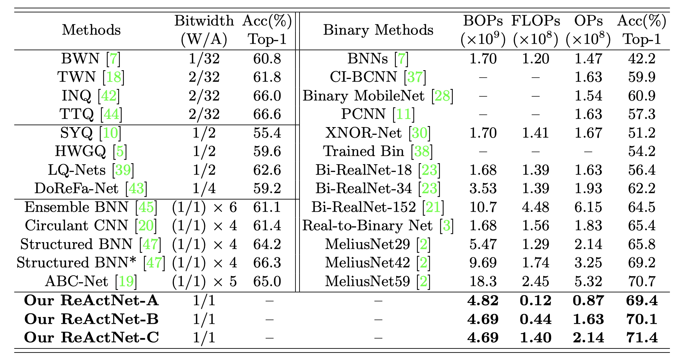

---

description: Zechun Liu et al. / ReActNet: Towards Precise Binary Neural Network with Generalized Activation Functions / ECCV 2020

---

# ReActNet [Eng]

##  1. Problem definition

The commonly considered binary neural networks, which refer to models in which the model weights as well as the activation values are binary values, are considered as one of the most promising methods for neural network compression. It is suitable for deploying models onto the resource-limited devices with high memory compression ratio and computational reduction. However, it is clear that there is a gap between the binary representation and the floating point representation, where severe accuracy degradation happens. 

## 2. Motivation

### Related work

There have been extensive studies on neural network compression and acceleration, including quantization, pruning, knowledge distillation  and compact network design.

BNN [1] demonstrated its success on small classification datasets including CIFAR10 and MNIST, but encountered severe accuracy drop on a larger dataset such as ImageNet.

XNOR-Net [2], which proposed real-valued scaling factors to multiply with each of binary weight kernels, has become a representative binarization method and enhanced the top1 accuracy to 51.2%, narrowing the gap to the real-valued ResNet-18 to ∼18%.

Bi-Real Net [3] proposed to add shortcuts to propagate real-values along the feature maps, which further boost the top-1 accuracy to 56.4%.

### Idea

ReActNet aims to bridge this gap between binary neural networks and real-valued networks on the challenging large-scale datasets without introducing additional computational overhead. The paper first constructs a baseline network from MobileNet V1, specifically by modifying a certain floating-point network using shortcut without introducing parameters, and binarizing it. This baseline network has better trade-off in terms of accuracy and efficiency than most existing binary networks.

Through extensive experiments, the article finds that the performance of the binary network is very sensitive to the distribution of the activation value distribution. Based on this finding, the paper proposes a new generalization of the traditional Sign and PReLU functions, and names these functions as RSign and RPReLU, respectively, which enhance the accuracy of the baseline network.

Furthermore, the paper proposes the distributional loss between binary and real-valued network outputs, which further reinforce the binary network's accuracy by mincing the distribution of a real-valued network.

Finally, the resultant proposed network was named ReActNet, and its performance far exceeded that of the existing binary networks with state-of-art accuracy and less computational complexity.

## 3. Method

### 1-bit Convolution

For convolutional layers whose weights have been binarized, their multiplication operations can be replaced by the per-bit operations XNOR and the popcount operations, as:
$$
X_{b} ∗ W_{b} = popcount(XNOR(X_{b},W_{b}))
$$
where $W_{b}$ and $X_{b}$ indicate the matrices of binary weights and binary activations. Specifically, weights and activations are binarized through a sign function: 
$$
x_{b}=\operatorname{Sign}\left(x_{r}\right)=\left\{\begin{array}{l}
+1, \text { if } x_{r}>0 \\
-1, \text { if } x_{r} \leq 0
\end{array}, \quad w_{b}=\frac{\left\|\mathcal{W}_{r}\right\|_{l 1}}{n} \operatorname{Sign}\left(w_{r}\right)=\left\{\begin{array}{l}
+\frac{\left\|\mathcal{W}_{r}\right\|_{l 1}}{n}, \text { if } w_{r}>0 \\
-\frac{\left\|\mathcal{W}_{r}\right\|_{l 1}}{n}, \text { if } w_{r} \leq 0
\end{array}\right.\right.
$$

The subscripts $b$ and $r$ denote binary and real-valued, respectively, and  $\frac{\left\|\mathcal{W}_{r}\right\|_{l 1}}{n}$ is the average of absolute weight values, used as a scaling factor to minimize the difference between binary and real-valued weights.

### Baseline Network

The authors chose MobileNetV1 structure for constructing our baseline binary network. They add some shortcut and modify some 3$\times$3 convolutions to 1$\times$1 ones. Besides, they make all convolutional layers have the same input and output dimensions and use a simple identity shortcut for activation propagation without additional real-valued matrix multiplications. 

As shown in the left part of the below picture, they duplicate input channels and concatenate two blocks with the same inputs to address the channel number difference and also use average pooling in the shortcut to match spatial downsampling. All layers in their baseline network are binarized, except the first input convolutional layer and the output fully-connect layer.

### Distribution Matters in 1-bit CNNs

In floating-point networks, there seems to be less concern about the distribution, mainly because the activations are all continuous floating-point numbers, for which reshape or shift distributions do not take much effort. However, for a binarized CNN, the activation can only choose two values, 1 or -1.So if there is a slight shift in the input feature distribution, it is likely that the feature map will be affected dramatically, as shown in the following figure.

The binarized CNN is obviously not as robust to feature information as the floating-point CNN, and small change in the input features is possible to introduce too much unnecessary background information or too little feature information, which in turn makes it harder for recognition of BNN.

### Generalized Activation Functions

They propose a ReAct operation that aims to explicitly reshape or shift the distribution of activations. They generalize the traditional Sign as well as PReLU, respectively named ReAct-Sign (abbreviated as RSign) and ReAct-PReLU (abbreviated as RPReLU).

RSign is defined as a sign function with channel-wisely learnable thresholds:
$$
x_{i}^{b}=h\left(x_{i}^{r}\right)=\left\{\begin{array}{ll}
+1, & \text { if } x_{i}^{r}>\alpha_{i} \\
-1, & \text { if } x_{i}^{r} \leq \alpha_{i}
\end{array}\right.
$$
Here, $x_{i}^{b}$ is real-valued input of the RSign function $h$ on the ith channel, $x_{i}^{r}$ is the binary output and $\alpha_{i}$ is a learnable coefficient controlling the threshold.

Similarly, RPReLU is defined as:
$$
f\left(x_{i}\right)=\left\{\begin{array}{ll}
x_{i}-\gamma_{i}+\zeta_{i}, & \text { if } x_{i}>\gamma_{i} \\
\beta_{i}\left(x_{i}-\gamma_{i}\right)+\zeta_{i}, & \text { if } x_{i} \leq \gamma_{i}
\end{array}\right.
$$
where $x_{i}$ is the input of the RPReLU function $f$ on the $i$th channel, $\gamma_{i}$ and $\zeta_{i}$ are learnable shifts for moving the distribution, and $\beta_{i}$ is a learnable coefficient controlling the slope of the negative part.

The picture of proposed activation functions, RSign and RPReLU, with learnable coefficients and the traditional activation functions, Sign and PReLU are as follows:

With the introduction of RSign and RPReLU, the pressure on the binarized CNN to learn the activation distribution can be significantly reduced, which in turn makes the binarized CNN more focused on learning more meaningful features. What's more, subsequent experimental results also show that such a design will substantially improve the accuracy of Baseline.

## 4. Experiment & Result

### Experimental setup

* **Dataset**: ILSVRC12 ImageNet classification dataset,
* **Training Strategy**: They followed the standard binarization method in [3] and adopted the two-step training strategy as [4]. In the first step, they train a network with binary activations and real-valued weights from scratch. In the second step, they inherit the weights from the first step as the initial value and fine-tune the network with weights and activations both being binary. For both steps, Adam optimizer with a linear learning rate decay scheduler is used, and the initial learning rate is set to 5e-4. They train it for 600k iterations with batch size being 256. The weight decay is set to 1e-5 for the first step and 0 for the second step.
* **Distributional Loss**: In both steps, they use proposed distributional loss as the objective function for optimization, replacing the original cross-entropy loss between the binary network output and the label.
* **OPs Calculation**: They follow the calculation method in [4], they count the binary operations (BOPs) and floating point operations (FLOPs) separately. The total operations (OPs) is calculated by OPs = BOPs/64 + FLOPs, following [2,3]

### Result

Compare results of ReActNet with state-of-the-art quantization and binarization methods are shown in the below table. ReActNet-A already outperforms all the quantizing methods in the left part, and also archives 4.0% higher accuracy than the state-of-the-art Real-to-Binary Network [3] with only approximately half of the OPs. 

They also constructed ReActNet-B and ReActNet-C, which replace the 1-bit 1×1 convolution with real-valued 1×1 convolution in the downsampling layers. ReActNet-B defines the real-valued convolutions to be group convolutions with 4 groups, while ReActNet-C uses full real-valued convolution. They show that ReActNet-B achieves 13.7% higher accuracy than Bi-RealNet-18 with the same number of OPs and ReActNet-C outperforms MeliusNet 59 by 0.7% with less than half of the OPs.

ReActNet-A, with 69.4% top-1 accuracy at 87M OPs, outperforms the real-valued 0.5× MobileNetV1 by 5.7% greater accuracy at 41.6% fewer OPs. These results demonstrate the potential of 1-bit CNNs and the effectiveness of the ReActNet design.

## 5. Conclusion

The article analyzes the influence of activation distribution on the performance of the binarized network. To solve the problem of low accuracy, the activation methods RSign and RPReLU with learning parameters are proposed to better approximate the activation distribution of the floating-point network. The article uses MobileNetV1 as the base floating-point network, with modification of shortcut and convolution kernel size. The experiments shows that proposed model have a large degree of improvement over similar works, achieving state-of-art accuracy on ImageNet between binarized networks.

This article shows an eye-opening approach to training the activation function, instead of fixed activation function based on fixed responding algorithms. This method can be regarded as reducing the fixed factor in BNN to have greater ability for feature training, which release the reduction of fitting and generalization ability induced by binarized parameters to some degree.

### Take home message 

> A novel binarized network with creative design of corresponding activation function

## Author / Reviewer information

### Author

**Wenao Xie** 

* KAIST EE
* xwa15@kaist.ac.kr

### Reviewer

## Reference & Additional materials

[1] Courbariaux, M., Hubara, I., Soudry, D., El-Yaniv, R., Bengio, Y.: Binarized neural networks: Training deep neural networks with weights and activations constrained to+ 1 or-1. arXiv preprint arXiv:1602.02830 (2016)

[2] Rastegari, M., Ordonez, V., Redmon, J., Farhadi, A.: Xnor-net: Imagenet classification using binary convolutional neural networks. In: European conference on computer vision. pp. 525–542. Springer (2016)

[3] Liu, Z., Wu, B., Luo, W., Yang, X., Liu, W., Cheng, K.T.: Bi-real net: Enhancing the performance of 1-bit cnns with improved representational capability and advanced training algorithm. In: Proceedings of the European conference on computer vision (ECCV). pp. 722–737 (2018)

[4] Brais Martinez, Jing Yang, A.B.G.T.: Training binary neural networks with real-tobinary convolutions. International Conference on Learning Representations (2020)
