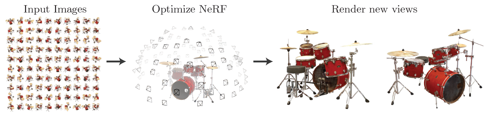
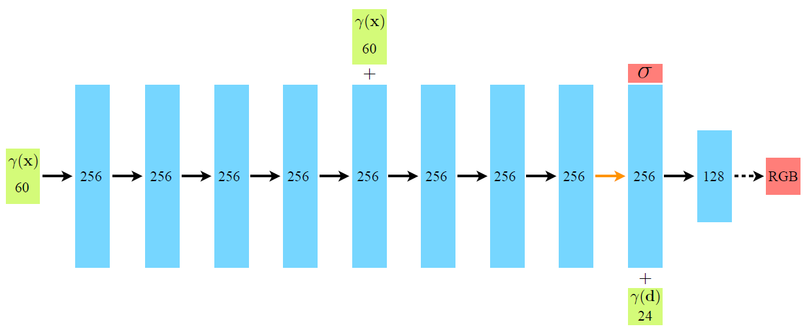
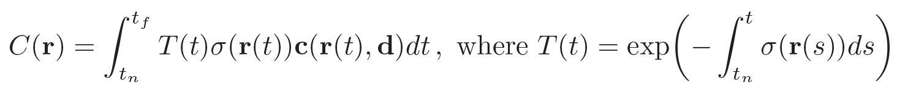
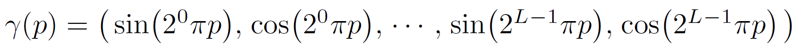
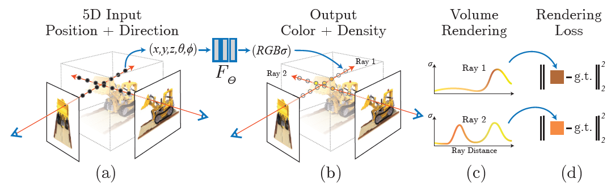
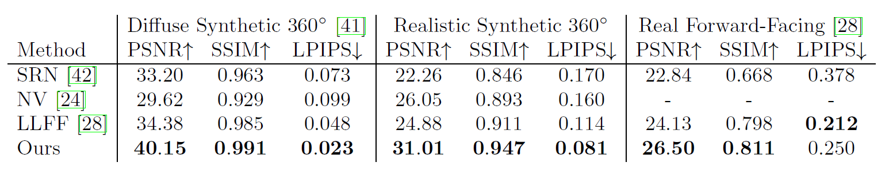
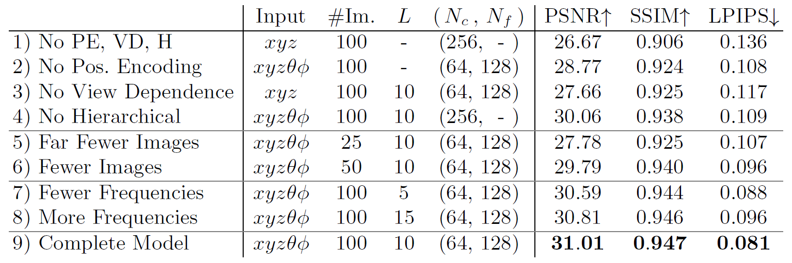

---
Ben et al. / NeRF; Representing Scenes as Neural Radiance Fields for View Synthesis / ECCV 2020
---

# NeRF [Kor]
##  1. Problem definition

NeRF가 수행하고자 하는 View Synthesis 라는 문제는, 다양한 카메라 각도에서 찍은 물체의 이미지들을 input으로 받아, 새로운 각도에서 바라보는 물체의 이미지를 만들어내는(예측하는) 것입니다.

공간 좌표 $x = (x,y,z)$와 보는 각도 $d = (\theta, \phi)$를 input으로 받아(총 5D 좌표가 된다), 해당 물체의 volume density와 emitter color을 산출한다.

공간 좌표

## 2. Motivation

### 2.1. Related work

##### - Neural 3D shape representations

최근에 3D 물체에 대한 표현(3D shape representation)을 얻기 위한 많은 연구들이 제안되고 있습니다. 대표적으로 3차원의 위치 정보 $(x, y, z)$ 을 input으로 받아, signed distance 함수 혹은 occupancy field로 mapping하는 neural network을 학습하는 방법들이 있습니다. 하지만 이러한 방법들은 굉장히 비용이 큰 ground truth 3D 이미지를 필요로 하는 한계점이 있습니다. 이를 극복하기 위해, 오직 2D 이미지만을 사용하여 학습을 진행하는 연구들이 주목을 받고 있습니다. Niemeyer et al. , Sitzmann et al. 의 연구들이 대표적입니다.

이 방법들은 2D 이미지 만을 사용하여 매우 효율적이고 꽤나 정확한 랜더링 성능을 보였습니다. 하지만, 이들 모두 구조가 그리 복잡하지 않은 물체들에 대해서만 사용되었고, 표면 구조가 복잡한 것들에 대해서는 oversmoothing되는 한계점이 있었습니다. NeRF는 5D의 radiance field을 인코딩하는 neural network을 디자인하여 고해상도와 복잡한 구조의 물체들도 photorealistic한 뷰를 얻을 수 있습니다.   

##### - View synthesis and image-based rendering

기존에 빽빽하게 여러 각도에서 촬영된 이미지들을 사용하여 랜더링하는 방법들이 제안되었다면, 최근에는 훨씬 적은 양의 (몇 개의 각도에서만 촬영된) 이미지들을 사용하여 랜더링하는 방법들이 주로 연구되고 있습니다. 가장 유명한 방법이 mesh 기반의 표현을 사용하는 것입니다. 미분 가능한 rasterizer 혹은 pathtracer은 gradient descent을 사용하여 mesh representation을 직접적으로 최적화할 수 있게 합니다. 하지만 이와 같이 그래디언트 기반의 mesh 최적화 방법을 사용하여 이미지를 reprojection하는 것은 매우 어렵운데, 보통 local minima에 빠지기 쉽고, 최적화를 시작하기 전 초기화 단계에서 현실에서 보통 얻을 수 없는 템플핏 mesh를 필요로 하기 때문입니다.

또 다른 유형의 방법으로는 체적 측정식의(volumetric) 방법들이 있습니다. 이러한 접근은 그래디언트 기반의 최적화에 굉장히 잘 동작하고, 따라서 mesh 기반의 방법들보다 훨씬 우수한 성능을 보였습니다. 대표적으로 CNN을 사용하는 방법들이 제안되었는데, 

RGB 이미지들을 

### 2.2. Main Idea

기존의 방법들이 3차원의 위치 정보 $(x,y,z)$ 로부터 3D 물체에 대한 표현을 얻으려고 했다면, NeRF는 3차원의 위치 정보에 2D의 보는 각도(viewing direction)을 더하여 5D 벡터를 input으로 사용합니다. 이로부터 더 복잡한 구조의 

또한 NeRF는 CNN 대신 오직 MLP만을 사용하여 훨씬 적은 수의 파라미터만 사용한다는 장점이 있습니다.

구체적인 방법은 아래에서 자세히 소개하겠습니다.

## 3. Method

### 3.1. Neural Radiance Field Scene Representation

먼저, NeRF는 3차원의 위치 정보 $X = (x, y, z)$와 2차원의 보는 방향 $d = (\theta, \phi)$ 을 input으로 받아 색상 $c = (r, g, b)$와 체적 밀도(volume density) $\sigma$을 output으로 내는 MLP를 $F_{\Theta} : (X,d) \rightarrow (c,\sigma)$ 를 학습합니다.

구체적인 $F_{\Theta}$의 구조는 아래의 Figure와 같습니다. 초록색이 Input 벡터이고, 중간의 hidden layer가 파란색, output 벡터가 빨간색으로 표시되어 있습니다. 모든 layer는 fully-connected이고, 검은색 화살표는 ReLU activation, 주황색 화살표는 without activation function, 검은색 점선 화살표는 sigmoid activation이 더해진 것을 의미합니다. 

NeRF는 특정 시각에서 보이는 뷰만 잘 표현하지 않고 모든 각도에서 물체가 잘 표현되기(multiview consistent) 위해 다음과 같이 설계합니다. 먼저, 체적 밀도 $\sigma$ 는 오직 위치 정보 $X$만 가지고 예측합니다. 이를 위해 먼저 $X$만 초기 8개 layer에 통과시켜 체적 밀도를 예측합니다. 다음으로, 색상을 예측할 때는 위치 정보와 보는 방향을 모두 사용합니다. 체적 밀도를 얻은 step의 feature 벡터에서 보는 방향인 $d$를 concatenate하여 feature을 만들고, 하나의 layer에 통과시켜 view-dependent한 RGB 색상을 얻습니다.

### 3.2. Volume Rendering with Radiance Field

NeRF는 전통적인 volume rendering 기법들을 사용하여 렌더링을 진행합니다. 카메라 위치에서 나아가는 광선 $r(t) = o + td$이 물체를 $t_n$부터 $t_f$까지 통과한다고 할 때, 해당 물체의 예상 색상 $C(r)$은 다음과 같이 계산됩니다.

 

이러한 $C(r)$을 계산하기 위해 사용되는 방법으로, 보통 discretized voxel grid을 렌더링할 때 많이 사용되는 Deterministic quadrature이 있습니다. 하지만, 이는 결국 discrete한 적분을 하는 것이기 때문에 성능이 좋지 않아지게 됩니다. NeRF는 이를 해결하기 위해 stratified sampling approach을 사용합니다.

### 3.3. Positional Encoding

We strongly recommend you to provide us a working example that describes how the proposed method works.  

비록 Neural network가 모든 function을 approximate 할 수 있다 해도, $$F_{\Theta}$$ 를  

 

### 3.4. Hierarchical volume sampling

We strongly recommend you to provide us a working example that describes how the proposed method works.  

## 4. Experiment & Result

This section should cover experimental setup and results.  
Please focus on how the authors of paper demonstrated the superiority / effectiveness of the proposed method.

Note that you can attach tables and images, but you don't need to deliver all materials included in the original paper.

### 4.1. Experimental setup

##### - Dataset

Synthetic rendering of objects 데이터셋을 사용한다. Diffuse Synthetic 360º와 Realistic Synthetic 360º

##### - Baselines

* Neural Volumes (NV)
* Scene Representation Networks (SRN)
* Local Light Field Fusion (LLFF) 

##### - Training setup

* batch size = 4096, Adam optimizer with lr = 5e-4 and exponentially-decaying to 5e-5, 하나의 scene에 대해 100-300k 정도의 iteration이 걸렸고, single NVIDIA V100 GPU를 사용했습니다. (하루에서 이틀 정도 걸림)

##### - Evaluation metric

### 4.2. Result

Please summarize and interpret the experimental result in this subsection.

asdasdasd

### 4.3. Ablation Study

Please summarize and

asdsad

## 5. Conclusion

In conclusion, please sum up this article.  

You can summarize the contribution of the paper, list-up strength and limitation, or freely tell your opinion about the paper.

NeRF는 

### Take home message \(오늘의 교훈\)

Please provide one-line \(or 2~3 lines\) message, which we can learn from this paper.

> All men are mortal.
>
> 

## Author / Reviewer information

### Author

**유태형 \(Taehyung Yu\)** 

* KAIST AI
* KAIST Data Mining Lab.
* taehyung.yu@kaist.ac.kr

### Reviewer

1. Korean name \(English name\): Affiliation / Contact information
2. Korean name \(English name\): Affiliation / Contact information
3. ...

## Reference & Additional materials

1. Mildenhall, Ben, et al. "Nerf: Representing scenes as neural radiance fields for view synthesis." *European conference on computer vision*. Springer, Cham, 2020.
2. Official \(unofficial\) GitHub repository
3. Citation of related work
4. Other useful materials
5. ...

