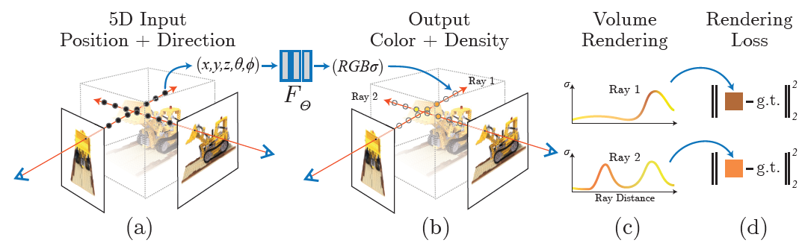

# NeRF: Representing Scenes as
Neural Radiance Fields for View Synthesis \[Kor\]

##  1. Problem definition

NeRF는 공간 좌표 $(x,y,z)$와 보는 각도 $(\theta, \phi)$를 input으로 받아(총 5D 좌표가 된다), 해당 물체의 volume density와 emitter color을 산출한다.
$$
F_{\theta} : (x,d) \rightarrow (c,\sigma)
$$

## 2. Motivation

In this section, you need to cover the motivation of the paper including _related work_ and _main idea_ of the paper.

### Related work

Please introduce related work of this paper. Here, you need to list up or summarize strength and weakness of each work.

### Idea

After you introduce related work, please illustrate the main idea of the paper. It would be great if you describe the idea by comparing or analyzing the drawbacks of the previous work.

## 3. Method

### 3.1. Neural Radiance Field Scene Representation


If you are writing **Author's note**, please share your know-how \(e.g., implementation details\)


The proposed method of the paper will be depicted in this section.

Please note that you can attach image files \(see Figure 1\).  

We strongly recommend you to provide us a working example that describes how the proposed method works.  

## 4. Experiment & Result


If you are writing **Author's note**, please share your know-how \(e.g., implementation details\)


This section should cover experimental setup and results.  
Please focus on how the authors of paper demonstrated the superiority / effectiveness of the proposed method.

Note that you can attach tables and images, but you don't need to deliver all materials included in the original paper.

### Experimental setup

This section should contain:

* Dataset
* Baselines
* Training setup
* Evaluation metric
* ...

### Result

Please summarize and interpret the experimental result in this subsection.

## 5. Conclusion

In conclusion, please sum up this article.  
You can summarize the contribution of the paper, list-up strength and limitation, or freely tell your opinion about the paper.

### Take home message \(오늘의 교훈\)

Please provide one-line \(or 2~3 lines\) message, which we can learn from this paper.

> All men are mortal.
>
> Socrates is a man.
>
> Therefore, Socrates is mortal.

## Author / Reviewer information


You don't need to provide the reviewer information at the draft submission stage.


### Author

**유태형 \(Taehyung Yu\)** 

* KAIST AI
* KAIST Data Mining Lab.
* taehyung.yu@kaist.ac.kr
* **...**

### Reviewer

1. Korean name \(English name\): Affiliation / Contact information
2. Korean name \(English name\): Affiliation / Contact information
3. ...

## Reference & Additional materials

1. Citation of this paper
2. Official \(unofficial\) GitHub repository
3. Citation of related work
4. Other useful materials
5. ...

