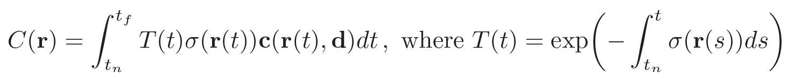
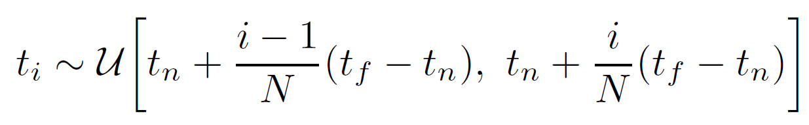

---
Ben et al. / NeRF; Representing Scenes as Neural Radiance Fields for View Synthesis / ECCV 2020
---

# NeRF [Kor]
##  1. Problem definition

NeRF가 수행하고자 하는 View Synthesis 라는 문제는, 다양한 카메라 각도에서 찍은 물체의 이미지들을 input으로 받아, 새로운 각도에서 바라보는 물체의 이미지를 만들어내는(예측하는) 것입니다. 아래의 figure가 그 예시입니다.

NeRF는 해당 문제를 다음과 같이 formulate합니다. 공간 좌표 $x = (x,y,z)$와 보는 각도 $d = (\theta, \phi)$를 input으로 받아(총 5D 좌표), 해당 물체의 volume density와 emitter color을 산출하고, 이로부터 전통적인 랜더링 기법을 사용하여 2D 이미지를 만들어냅니다. 해당 이미지를 ground truth와 비교하여 loss를 계산하고, 모든 과정이 미분 가능하기 때문에 전체 모델을 한 번에 학습합니다.

## 2. Motivation

### 2.1. Related work

#### - Neural 3D shape representations

최근에 3D 물체에 대한 표현(3D shape representation)을 얻기 위한 많은 연구들이 제안되고 있습니다. 대표적으로 3차원의 위치 정보 $(x, y, z)$ 을 input으로 받아, signed distance 함수 혹은 occupancy field로 mapping하는 neural network을 학습하는 방법들이 있습니다. 하지만 이러한 방법들은 굉장히 비용이 큰 ground truth 3D 이미지를 필요로 하는 한계점이 있습니다. 이를 극복하기 위해, 오직 2D 이미지만을 사용하여 학습을 진행하는 연구들이 주목을 받고 있습니다. Niemeyer et al. , Sitzmann et al. 의 연구들이 대표적입니다.

이 방법들은 2D 이미지 만을 사용하여 매우 효율적이고 꽤나 정확한 랜더링 성능을 보였습니다. 하지만, 이들 모두 구조가 그리 복잡하지 않은 물체들에 대해서만 사용되었고, 표면 구조가 복잡한 것들에 대해서는 oversmoothing되는 한계점이 있었습니다. NeRF는 5D의 radiance field을 인코딩하는 neural network을 디자인하여 고해상도와 복잡한 구조의 물체들도 photorealistic한 뷰를 얻을 수 있습니다.   

#### - View synthesis and image-based rendering

기존에 빽빽하게 여러 각도에서 촬영된 이미지들을 사용하여 랜더링하는 방법들이 제안되었다면, 최근에는 훨씬 적은 양의 (몇 개의 각도에서만 촬영된) 이미지들을 사용하여 랜더링하는 방법들이 주로 연구되고 있습니다. 가장 유명한 방법이 mesh 기반의 표현을 사용하는 것입니다. 미분 가능한 rasterizer 혹은 pathtracer은 gradient descent을 사용하여 mesh representation을 직접적으로 최적화할 수 있게 합니다. 하지만 이와 같이 그래디언트 기반의 mesh 최적화 방법을 사용하여 이미지를 reprojection하는 것은 매우 어렵운데, 보통 local minima에 빠지기 쉽고, 최적화를 시작하기 전 초기화 단계에서 현실에서 보통 얻을 수 없는 템플핏 mesh를 필요로 하기 때문입니다.

또 다른 유형의 방법으로는 체적 측정식의(volumetric) 방법들이 있습니다. 이러한 접근은 그래디언트 기반의 최적화에 굉장히 잘 동작하고, 따라서 mesh 기반의 방법들보다 훨씬 우수한 성능을 보였습니다. 대표적으로 CNN을 사용하는 방법들이 제안되었는데, 이는 파라미터 수가 굉장히 많고, 복잡한 구조나 고화질의 물체에 대해 다룰 때 scalable하지 않거나 성능이 좋지 않았습니다. NeRF는 잘 학습된 MLP로부터 연속적인 volume representation을 만들어 낼 수 있고, 동시에 모델 파라미터 숫자도 크게 줄였습니다.

### 2.2. Main Idea

* 기존의 방법들이 3차원의 위치 정보 $(x,y,z)$ 로부터 3D 물체에 대한 표현을 얻으려고 했다면, NeRF는 3차원의 위치 정보에 2D의 보는 각도(viewing direction)을 더하여 5D 벡터를 input으로 사용합니다.
* 또한, NeRF는 랜더링 과정에서 discrete한 적분을 하지 않고, stratified sampling approach와 이를 더 강화한 Hierarchical volume sampling을 사용하여 랜더링의 성능을 높입니다.
* 추가적으로, 기존의 모델들은 저화질 혹은 구조가 간단한 물체에 더 편향되어 학습하여 고화질, 구조가 복잡한 물체에서 성능이 매우 떨어졌습니다. NeRF는 Positional Encoding을 사용하여 input을 고차원의 space로 변환하여 사용하여 고화질, 구조가 복잡한 물체에서도 우수한 성능을 유지합니다.
* 마지막으로, NeRF는 CNN 대신 오직 MLP만을 사용하여 훨씬 적은 수의 파라미터만 사용한다는 장점이 있습니다.

각각에 대한 구체적인 방법은 아래에서 자세히 소개하겠습니다.

## 3. Method

### 3.1. Neural Radiance Field Scene Representation

먼저, NeRF는 3차원의 위치 정보 $X = (x, y, z)$와 2차원의 보는 방향 $d = (\theta, \phi)$ 을 input으로 받아 색상 $c = (r, g, b)$와 체적 밀도(volume density) $\sigma$을 output으로 내는 MLP를 $F_{\Theta} : (X,d) \rightarrow (c,\sigma)$ 를 학습합니다.

구체적인 $F_{\Theta}$의 구조는 아래의 Figure와 같습니다. 초록색이 Input 벡터이고, 중간의 hidden layer가 파란색, output 벡터가 빨간색으로 표시되어 있습니다. 모든 layer는 fully-connected이고, 검은색 화살표는 ReLU activation, 주황색 화살표는 without activation function, 검은색 점선 화살표는 sigmoid activation이 더해진 것을 의미합니다. 

NeRF는 특정 시각에서 보이는 뷰만 잘 표현하지 않고 모든 각도에서 물체가 잘 표현되기(multiview consistent) 위해 다음과 같이 설계합니다. 먼저, 체적 밀도 $\sigma$ 는 오직 위치 정보 $X$만 가지고 예측합니다. 이를 위해 먼저 $X$만 초기 8개 layer에 통과시켜 체적 밀도를 예측합니다. 다음으로, 색상을 예측할 때는 위치 정보와 보는 방향을 모두 사용합니다. 체적 밀도를 얻은 step의 feature 벡터에서 보는 방향인 $d$를 concatenate하여 feature을 만들고, 하나의 layer에 통과시켜 view-dependent한 RGB 색상을 얻습니다.

### 3.2. Volume Rendering with Radiance Field

NeRF는 전통적인 volume rendering 기법들을 사용하여 렌더링을 진행합니다. 카메라 위치에서 나아가는 광선 $r(t) = o + td$이 물체를 $t_n$부터 $t_f$까지 통과한다고 할 때, 해당 물체의 예상 색상 $C(r)$은 다음과 같은 적분식으로 계산됩니다.

 

이러한 $C(r)$의 적분식을 계산하기 위해 사용되는 방법으로, 보통 discretized voxel grid을 렌더링할 때 많이 사용되는 Deterministic quadrature이 있습니다. 하지만, 이는 결국 discrete한 적분을 하는 것이기 때문에, 이를 사용할 경우 성능이 좋지 않아지게 됩니다. NeRF는 이를 해결하기 위해 아래의 stratified sampling approach을 사용합니다.

 

stratified sampling approach은 $t_n$부터 $t_f$ 까지의 적분 구간을 N개의 bin으로 쪼갠 후, 각 bin에서 하나의 샘플을 uniform하게 뽑아서, 이들을 적분 구간으로 사용하는 것입니다. 이렇게 하면 비록 적분식을 근사하기 위해 discrete한 샘플을 사용하기는 하지만, MLP가 최적화 과정에서 연속적인 포지션에서 계속 평가되며 학습될 수 있기 때문에, 해당 물체에 대한 연속적인 scene representation을 얻을 수 있습니다.

### 3.3. Optimizing a Neural Radiance Field

3.1과 3.2에서 NeRF의 핵심적인 부분을 다뤘습니다. 하지만, 저자는 이 두가지만 사용하여 성능을 평가했을 때는 만족스럽지 않은 결과가 나온다고 말합니다. (이는 뒤에 Ablation Study에서 확인할 수 있습니다.) 따라서, 고화질의 복잡한 물체에 대해서 NeRF가 잘 수행할 수 있도록 추가적인 두 가지 방법을 제안합니다.

#### - Positional Encoding

첫번째는 바로 Positional Encoding을 사용하는 것입니다. 아무리 Neural network가 이론적으로는 모든 함수를 근사할 수 있더라도, 막상 $F_{\Theta}$를 학습하면 높은 해상도와 복잡도 영역에서 성능이 떨어집니다. 이는 MLP가 낮은 해상도와 복잡도 영역에 편향되기 때문입니다. (여기서, 높은 해상도와 복잡도를 high-frequency, 낮은 해상도와 복잡도를 low-frequency라고 표현합니다.)

따라서, NeRF는 높은 frequency 함수를 통해 5D input을 더 높은 차원의 공간으로 보낸 후에 이를 input으로 사용합니다. 따라서, 우리의 $F_{\Theta}$를 아래의 높은 차원으로 매핑하는 함수인 $\gamma$와 합성하여 사용하였을 때, 성능이 매우 향상되었습니다.

 

#### - Hierarchical volume sampling

다음은 stratified sampling을 더 효율적으로 사용하는 Hierarchical volume sampling 방법입니다. 실제로 N개의 bin을 만들어서, 각 bin에서 uniform하게 샘플링하여 적분을 하는 것은 비효율적이고 성능도 좋지 않았습니다. 따라서, 이를 보완하고자 coarse network와 fine network의 두 가지 neural network을 학습하는 방법을 사용합니다. 먼저, coarse network은 앞서 설명한 stratified sampling과 동일하게 진행합니다.(bin = $N_c$) 학습된 coarse network로부터 우리는 더 존재할 만한 포인트들을 뽑을 수 있습니다. fine network는 inverse transform sampling을 사용하여 마찬가지로 $N_f$ 개의 bin으로부터 샘플링을 하고, coarse network에서 얻은 포인트들을 더하여 총 $N_c+N_f$ 개의 샘플로부터 $C_f(r)$을 계산할 수 있게 합니다. 요약하면, 물체가 존재할 만한 구간에 대해 더 가중치를 주는 방식으로 학습을 하여 랜더링의 성능을 높입니다.

NeRF를 overall로 아래의 figure와 같이 요약할 수 있습니다. 

## 4. Experiment & Result

### 4.1. Experimental setup

#### - Dataset

* Synthetic 렌더링 데이터셋 : Diffuse Synthetic 360º, Realistic Synthetic 360º
* DeepVoxels 데이터셋

#### - Baselines

* Neural Volumes (NV)
* Scene Representation Networks (SRN)
* Local Light Field Fusion (LLFF) 

#### - Training setup

* batch size = 4096
* Adam optimizer (lr = 5e-4, exponentially-decaying to 5e-5)
* 하나의 scene에 대해 100-300k 정도의 iteration
* single NVIDIA V100 GPU (하루에서 이틀 정도 걸림)

#### - Evaluation metric

* PSNR 

* SSIM

* LPIPS

  

### 4.2. Result

NeRF는 3개의 데이터셋에서 한 가지 값을 제외하고 기존의 baseline들을 모두 outperform했습니다. 또한, 랜더링한 이미지를 봤을 때 또한, 다른 baseline들은 over-smoothing된 경우가 많았는데, ground truth에 가깝게 랜더링 되었음을 확인할 수 있었습니다.

### 4.3. Ablation Study

Ablation Study은 Realistic Synthetic 360º에서 진행하였습니다. 이를 통해, Positional Encoding, View Dependence, Hierarchical sampling가 효과가 있다는 것을 확인 할 수 있습니다.

## 5. Conclusion

NeRF는 3차원의 위치 정보에 2D의 보는 각도(viewing direction)을 더한 5D 벡터로부터 색상과 체적 밀도(volume density)를 계산하는 MLP를 학습하고, 이의 output을 기존의 랜더링 방법을 사용하여 원하는 위치에서 바라본 물체의 2D 이미지를 만듭니다. 여기에 랜더링 과정에서 discrete한 적분을 하지 않고, stratified sampling approach와 이를 더 강화한 Hierarchical volume sampling을 사용하여 랜더링의 성능을 높이고, 높은 차원의 space로 mapping하는 Positional Encoding을 사용하였습니다. 해당 방법들을 통해 기존의 baseline을 outperform하는 성능을 보였고, 고화질, 구조가 복잡한 물체에서도 우수한 성능을 유지하였습니다. 이를 오직 MLP만을 사용하여 적은 수의 파라미터만으로 달성하였습니다. 최근에 NeRF를 기반으로 하여 더 발전된 논문들이 많이 나오고 있는데, 이들이 어떠한 방법들을 추가하고 있는지 보는 것 또한 흥미로울 것 같습니다.

### Take home message \(오늘의 교훈\)

Please provide one-line \(or 2~3 lines\) message, which we can learn from this paper.

> AI를 잘하려면 수학이 매우 중요하다.
>
> 문제를 집요하게 파면 좋은 결과를 얻을 수 있다.

## Author / Reviewer information

### Author

**유태형 \(Taehyung Yu\)** 

* KAIST AI
* KAIST Data Mining Lab.
* taehyung.yu@kaist.ac.kr

### Reviewer

1. Korean name \(English name\): Affiliation / Contact information
2. Korean name \(English name\): Affiliation / Contact information
3. ...

## Reference & Additional materials

1. Mildenhall, Ben, et al. "Nerf: Representing scenes as neural radiance fields for view synthesis." *European conference on computer vision*. Springer, Cham, 2020.
2. Official \(unofficial\) GitHub repository
3. Citation of related work
4. Other useful materials
5. ...
