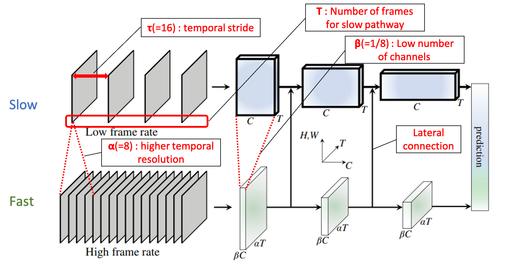
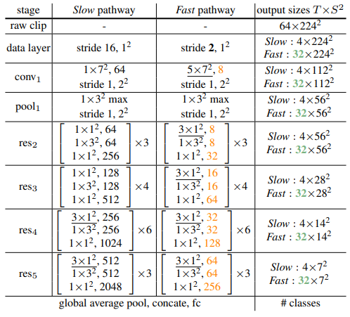
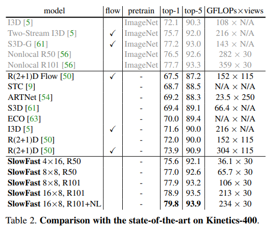
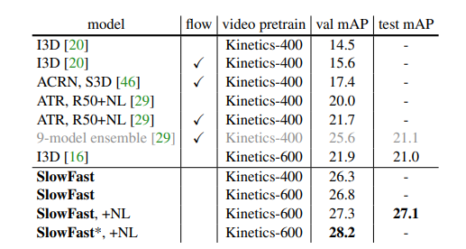
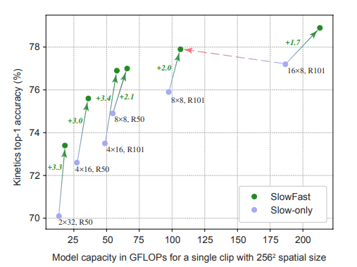

# SlowFast Networks for Video Recognition \[Kor\]

##  1. Problem definition

본 논문에서 다루는 문제는 video recoginion입니다. Image Recognition과 마찬가지로 visual data를 받아서, 이 video가 무엇을 나타내고자 하는지 인식을 하는 문제입니다. Video Recognition task는 Image Recognition과 마찬가지로 여러 세부분야로 나뉘어질 수 있는데, 그 중 이 논문에서는 2가지 방법을 사용하여 성능을 보여주고 있습니다. 

- **Video Action Recogniton (비디오 동작 인식)**

인간의 동작 인식은 영상 이해에 중요한 역할을 하고 있습니다. 인간의 행동을 인식하는 기준은 외부 모습, 깊이, 광학 흐름, 그리고 신체 골격과 같은 여러 가지 양식으로 인식될 수 있습니다. 그렇기에 만약 학습된 network가 Action Recognition을 잘 수행한다면, 비디오를 잘 이해한다고 해석할 수 있습니다.

- **Video Action Detection (비디오 동작 검출)**

일반적으로 동작 검출은 동작 인식이나 분류보다 어려운 task로 알려져 있습니다. 비디오 내에서 동작을 인식할 뿐만 아니라, 그에 따른 Bounding box(경계 상자)를 그려야 하기 때문에 더 어려운 task입니다. Action Recognition보다 어려운 task이므로 이 task를 잘 해내면 더 비디오를 잘 이해한다고 해석할 수 있습니다.

## 2. Motivation

Video 데이터는 Image보다 더 다루기 어려운데 그 이유는 (H,W,C)에 더해서 (H,W,C,T)처럼 Channel dimension 뒤에 추가된 Temporal(시간축) 도메인을 가지고 있고, 데이터셋 크기 자체도 더 크기 때문입니다. 

하지만 이전 연구들에서는 비디오 데이터셋에 대한 특성을 고려하지않고 공간축(Spatial) 도메인과 시간축(Temporal) 도메인을 똑같이 처리를 했었습니다. 이에 본 논문에서는 두개의 특성을 고려하여 두개의 다른 네트워크를 사용해서 다른 정보를 배워야 한다고 주장합니다.

이렇게 두개의 특성을 고려하는 방법은 영장류의 시각 시스템 연구에서 motivation을 받았다고 말하고 있습니다. 영장류 망막 신경절 시스템에는 두가지 종류의 셀로 구성되어있는데 하나는 P-cell 이고 다른 하나는 M-cell 입니다. 여기서 P-cell은 시스템에서 80퍼센트 정도를 차지하고 이 셀이 하는 역할은 공간적인 세부사항(Spatial details)들을 배우는데 기여를 한다고 합니다. 그리고 M-cell은 시스템에서 20퍼센트 정도 차지를 하는데 빠른 시각적 변화, 즉 시각적인 것들(Temoral details)를 배운다고 이 실험에서는 밝히고 있었습니다. 

### Related work

- **3D Convolution**

2D ConvNets이 (H,W,C)의 kernel size로 움직인다면, 3D ConvNets은 (H,W,C,T)의 Kernel로 움직여서 data를 처리한다는 점이 다릅니다. 2D Convolution에서 T dimension을 추가하여 Spatiotemporal domain까지 처리가 가능하도록 바꾼 모델입니다. 하지만, 본 논문에서 지적한바와 같이 공간축(Spatial) 도메인과 시간축(Temporal) 도메인을 똑같이 처리를 한다는 단점이 있습니다. 

- **Optical Flow Video Recognition**

광학 흐름은 픽셀당 예측이며 주요 아이디어는 밝기가 일정하다고 가정한다는 것입니다. 즉, 시간이 지남에 따라 화면에서 픽셀 밝기가 어떻게 이동하는지 추정하려고 합니다. 하지만 광학흐름은 일일이 수작업이 들어간 데이터이여서 representation을 배울 때, deep learning network가 human error나 biased된 인풋을 받는다는 단점이 있습니다. 

### Idea

이러한 공간축(Spatial) 도메인과 시간축(Temporal) 도메인이 다르다는 점을 본 논문에서는 인지하여서, 두개의 정보를 따로 배울 수 있도록 two-stream 즉 두개의 network를 이용하고 있습니다. 하나는 Slow Pathway로 말 그대로 천천히 배우지만 공간적(Spatial)인 정보를 배우고 다른 하나는 Fast Pathway로 빠르게 배우지만 시각적(Temporal)인 정보를 배운다고 소개하고 있습니다. 

## 3. Method

앞서 Idea에서 설명드렸던 것과 같이, 두개의 network를 활용하여 학습을 하고 있습니다. 그 두개의 network는 여러 면에서 좀 다른 것들이 있는데 밑에서 좀 더 자세히 설명드리도록 하겠습니다. 그리고 그 두개의 networks를 학습시키는 동안 그 둘의 정보를 잘 활용하기 위해서 Lateral Connection으로 연결하여서 정보를 주고 있습니다. 두개의 backbone architecture로는 CNN-based면 전부 적용이 가능하다고 본 논문은 말하고 있습니다. 

- **Slow Pathway**

Slow Pathway는 3D Convolution과 같이, (H,W,C,T)의 input data를 처리할 수 있는 network를 사용하고 여기서 제일 크게 다른점은 모든 input frames를 쓰지 않고 $$\tau$$의 stride를 가지는 data를 활용했다는 점입니다. 예를들어, $$\tau = 16$$이면, 32fps을 가지는 input viedo에서는 2개의 frame을 활용하였다고 볼 수 있습니다. 

- **Fast Pathway**

Fast Pathway의 전체적인 구조는 Slow Pathway와 크게 다르지 않습니다. 하지만, 시간적(Temporal)적인 정보를 배우기 위해서 중점적으로 2개 정도의 변형을 하였습니다.

    - 높은 프레임 비율

    Slow Pathway보다 $$\alpha$$의 배만큼 더 많이 프레임을 샘플합니다. 즉, $$\tau/\alpha$$만큼의 stride를 가진다는 것입니다. 예를들어, $$\tau/\alpha = 16 / 8 = 2$$이면, 32fps를 가지는 input video에서는 16개의 frame을 활용하였다고 볼 수 있습니다.

    - 낮은 채널 갯수

    두개의 networks를 two-stream방식으로 운용을 하게 된다면, 전체적인 architecture가 굉장히 무거워진다는 단점이 있습니다. 영장류 시신경 시스템에서 M-cells가 20\% 정도를 차지하고 있었던 만큼, network를 가볍게 만들기 위해서 Fast pathway의 Channel 갯수를 $$\beta$$만큼 줄여 줍니다. 본 논문에서는 $$\beta$$ 값에 대한 Ablation study를 진행하여 $$\beta = 1/8$$값으로 지정하였다고 말하고 있습니다. 이에 따라 전체 연상량의 ~20\%정도를 차지한다고 말합니다. 또한 이러한 낮은 채널 갯수를 유지함으로써, Fast pathway가 채널 갯수가 적기 때문에 공간적(Spatial) 정보를 덜 배운다고 주장하고 있습니다. 

- **Lateral Connections**

두개의 netowrk를 독립적으로 운영하면서도, 그 둘의 합친 정보를 나중에 활용할 수 있도록 합쳐줘야 합니다. 하지만, 두개의 feature shape은 network의 형태가 달라서 다른 형태로 나오게 됩니다. Slow Pathway는 {$$T$$, $$S^2$$, $$C$$}의 shape을 가지지만, Fast Pathway는 {$$\alpha T$$, $$S^2$$, $$\beta C$$}의 shape을 가지므로 그 둘을 유기적으로 잘 연결할 수 있도록 3D convolution을 활용하여 연결하고 있습니다. 결국에는 Fast Pathway의 정보가 Slow Pathway가 잘 동작할 수 있도록 도움을 주는 형태로 되는데, 둘의 정보는 매 "stage"마다 합쳐지게 됩니다. 여기서 말하는 매 "stage"는 ResNet architecture기준으로 Block이나 Pool을 하고 난 다음이라고 생각하시면 됩니다.

- **Instantiations**

논문에서 사용된 ResNet-50기반 Instantiations입니다. Slow Pathway가 stride를 16을 가지는 반면, Fast Pathway는 2를 가지고 있고, 이에 따라 channels의 갯수도 1/8이 된 모습을 보여주고 있습니다. 그리고 output size에서도 Fast Pathway는 더 높은 temporal resolution인 32를 가지고 있고 Slow Pathway는 4를 가지고 있습니다.

## 4. Experiment & Result

### Experimental Setup

- **Dataset**

본 논문에서는 Kinetics-400, Kinetics-600 그리고 Charades를 Video Action Classification (비디오 동작 분류)에 사용하고 있습니다. Video Action Detection(비디오 동작 검출)을 위해서는 AVA dataset을 이용하고 있습니다.

- **Training Setup**

전에 있던 방법들과 달리, ImageNet으로 pretraining을 하지 않았습니다. Optimizer로는 SGD를 사용하여 학습 하였습니다. Training에서는 총 $$\alpha T x t$$개의 프레임에서 Slow Pathway는 T만큼 Fast Pathway는 $$\alpha T$$만큼 sample해서 트레이닝을 시키고 있습니다. Inference에서는 총 10 클립을 뽑아서, 그것을 3번 crop을하여 총 1개의 비디오에서 30개를 샘플하여 inference하고 있었습니다.

### Result

Kinetics-400에서 위와 같이 SlowFast networks가 SOTA의 결과를 보여주고 있습니다. Baseline으로 삼은 R(2+1)D보다도 약 $$6\%$$정도의 상승폭을 보여주고 있고, 또 눈에 띄는것은 GFLOPs x views인데, SlowFast는 30개의 sample갯수만 이용한 반면, Baseline은 115개의 sample을 이용하고 있습니다. 

AVA-Detection task에서도 SOTA의 결과를 보여주고 있습니다. 여기서 한가지 주의할 점은, SlowFast Networks그 자체로만은 Detection tasks를 수행할 수 없어서, Faster R-CNN에서 ROI(Region of Interest)를 받아서 그 위에 Classification하는 network만 SlowFast를 써서 accuracy를 구했다는 점이 있습니다. 

위 그림에서는 얼마나 Fast Pathway가 helpful한지 나타내는 그림입니다. 파란색 점에서 초록색 점으로 올라간 상승폭이, Slow Pathway 한개만 썼을 때보다 Fast Pathway를 추가하였을 떄 상승폭을 나타내는 점입니다. 또 빨간색 화살표는, network 크기가 두배가 되었는데도 더 조그마한 network인 Fast Pathway를 추가한 것이 훨씬 Accuracy도 높고 연산량도 적은 것을 볼 수 있습니다.

## 5. Conclusion

본 논문에서는 시간적(Temporal) 정보는 특별하기 때문에 다르게 다뤄야 한다고 말하고 있습니다. 이에따라 시간적(Temporal) 도메인과 공간적(Spatial) 도메인의 정보를 다르게 학습하는 Two-Streams로 두개의 network를 만들어 학습을 시키었고, 그에 따라 놀라운 결과를 보여주고 있습니다.

하지만, Fast Pathway에서 Channel 갯수를 줄이고, temporal resolution을 높인것이 필연적으로 Fast Pathway가 시간적(Temporal) 도메인의 정보를 학습하는지는 의문이 듭니다. 물론 결과적으로 Fast Pathway를 추가한 것이 도움이 되었지만, 이 Fast Pathway에 대한 Ablation Studies만 있고 무엇을 배우고 있는지 Quatlitative적인 분석이 전혀 없는 점이 아쉬운 점인 것 같습니다.

### Take home message \(오늘의 교훈\)
> 시간축(Temporal)과 공간축(Spatial)한 정보는 다른 특성을 가지기 때문에 다르게 다뤄야 한다.
> 두개의 networks를 따로 사용하는 것이 한개의 network를 두배크기로 만드는 것보다 더 큰 성능을 낼 수도 있다.
> 다른 분야에서 motivation을 얻어서 AI/ML분야에 접목을 시키는 것이 평소에는 보지 못하였던 새로운 방법으로 문제를 접근할 수도 있다.

## Author / Reviewer information


You don't need to provide the reviewer information at the draft submission stage.


### Author

**김예찬 \(Yechan Kim\)** 

* M.S student, Graduate School of AI, KAIST
* yechankim@kaist.ac.kr
* 

### Reviewer

1. Korean name \(English name\): Affiliation / Contact information
2. Korean name \(English name\): Affiliation / Contact information
3. ...

## Reference & Additional materials

1. Feichtenhofer, Christoph, et al. "Slowfast networks for video recognition." Proceedings of the IEEE/CVF international conference on computer vision. 2019.
2. [Official GitHub repository](https://github.com/facebookresearch/SlowFast)
