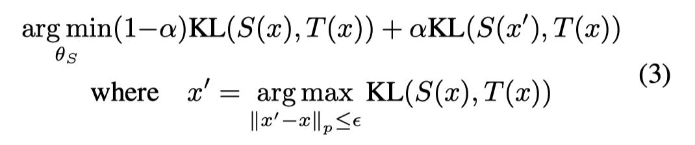
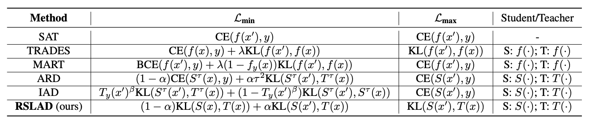
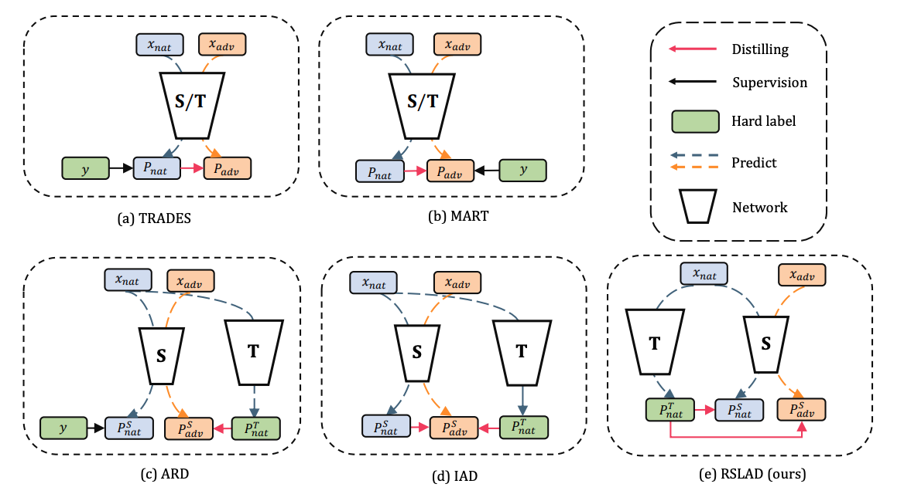
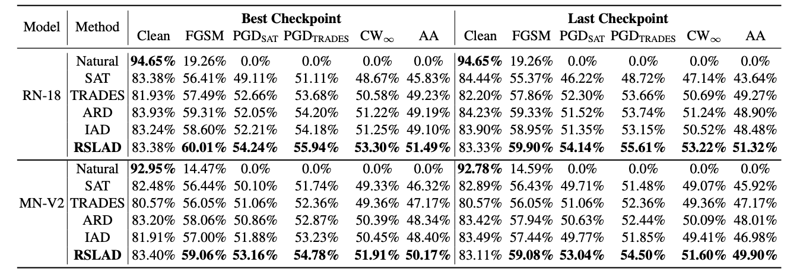
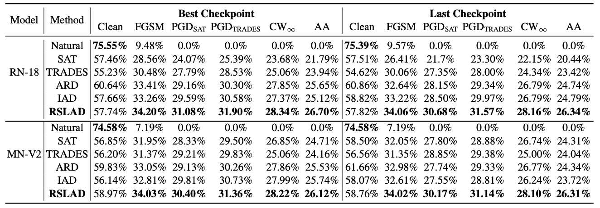
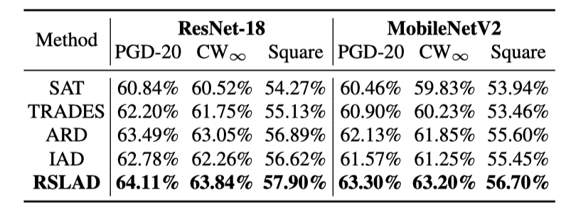

# Revisiting Adversarial Robustness Distillation: Robust Soft Labels Make Student Better \[Eng\]

##  1. Problem definition

Deep neural networks (DNN) have been applied widely in multiple fields, including computer vision and natual language processing. However, it has been found that DNN can be fooled by a specific kind of images called adversarial examples, which is generated by adding a human-invisible perturbation on the clean images. 

Multiple works have attempted to solve the robustness  problem of DNN[1,2]. It is acknowledged that Adversarial training (AT)[3] is the most  popular method to train a robust model. During training,  AT first generates the adversarial samples by maximizing the loss function in the inner loop, and then updates the model with the new loss calculated on generated adversarial samples. This two-step method significantly improves the model robustness in multiple datasets and models. 

However,  the  strategy of AT  requires bigger model capacity than standard training to achieve high robustness. Therefore, it is challenging for AT to train a small robust model. To solve the problem of training a small robust model, this paper proposes to apply knowledge distillation in AT, and explores the key component which  can improve the robustness of small model with knowledge distillation. 

The main contributions of this paper are as follows. (1) This paper proves that robust soft labels can improve the robustness of models. (2) This paper proposes a new kind of training method, called Robust Soft Label Adversarial Distillation (RSLAD). (3) This paper proves that the proposed RSLAD achieves robustness improvement of small models with a visible margin.  

## 2. Motivation

### Related work

In order to improve the robustness against adversarial sample, AT has been the most popular method due to its performance and easy implementation.  After that, numerous works have attempted to improve AT from various perspectives.  From model perspective,  wider and larger models [4] are used. What's more, unlabeled data[5] are also used for robustness improvement. Among all the works, the biggest drawback  is that the robustness of small models are very hard to improve with all existing techniques, e.g., Resnet18. This limits the effectiveness of robust models when used in specific applications, e.g., mobile devices. 

Knowledge distillation(KD)[6] has been widely used to improve performance of small models on clean samples. Given a trained teacher model, the much smaller student model learns towards the soft labels generated by teacher model, instead of the original hard ground-truth labels. It is believed that soft labels includes more information than hard labels, thus the small model can learns faster and achieve higher performance[6].  

There are also works combining adversarial training and knowledge distillation together, named as adversarial knowledge distillation(ARD)[14]. The teacher model in ARD achieves a high robustness, and then guides the learning of student model. This paper  works on the base of ARD, and provides new training strategy to train smaller student models.

### Idea

This paper analyzes the significance of soft labels when improving the robustness of student models, and proves the benefit of soft labels than hard labels in adversarial training. This paper also proposes a new method named RSLAD. The main difference between RSLAD and past ARD methods are that RSLAD replaces all hard labels in the loss with soft labels. In other words, the learning of both clean and adversarial samples are guided by soft labels instead of hard labels. 

## 3. Method

In the past researches about ARD, the authors applied a combination of soft and hard labels during training. The main difference between existing work and this paper is that this paper applies soft label in all terms in loss function.  Speficically, the soft labels calculated on clean samples are used. The total loss function is shown as follows.

where S(x) and T(x) indicates student model and teacher model respectively. 

​                                                              Table 1. Loss comparisons with existing methods

​																Figure 1. Model comparisons with existing methods

​											

The comparasions with existing methods are shown in Table 1 and Figure 1.  The optimization goal of RSLAD is to train a small student model under the supervision of adversarially trained teacher model. Therefore, in order  to better maintain the robustness of teacher model, soft labels of teacher model should be used to avoid the information loss. 

## 4. Experiment & Result

### Experimental setup

The experiments are conducted on two datasets, CIFAR-10 and CIFAR-100, and five recent  methods are chosen for performance comparisons, including  SAT [3], TRADES [8], ARD [9], IAD [10]  and natural training. There are two student networks including ResNet-18 [19] and MobileNetV2 [37], and two teacher networks including WideResNet34-10 [56] for CIFAR-10 and WideResNet-70-16 [16] for CIFAR-100.

During training,  the optimizer is SGD with initial learning rate 0.1, momentum 0.9,  weight decay 2e-4, and the total epoch is 300. The learning rate is divided by 10 at the 215th, 260th and 285th epoch. The batch size is set to 128.  PGD10 with L ∞ norm of  8/255 is applied to generate the adversarial samples during training, the step size is set to 2/255.  For  SAT [3], TRADES [8], ARD [9], IAD [10], the training setting is consistent to the that in their papers.

During evaluation, accuracy against five adversarial attacks are reported, including FGSM, PGD SAT , PGD TRADES , CW ∞ (optimized by PGD) and AutoAttack(AA). The perturbation radius is set to 8/255 for both datasets, and the  perturbation steps of PGD SAT , PGD TRADES and CW ∞ are set to 20.

### White-box robustness 

The comparisons of white-box robustness is shown in Table 2 for  CIFAR-10 and Table 4 for CIFAR-100. Both results of best checkpoint and last checkpoint are reported.

​										           Table 2. White-box robustness results in CIFAR-10										

​												 Table 3. White-box robustness results in CIFAR-100

As shown in Table 2 and Table 3, the proposed RSLAD achieves the state-of-the-art robustness on all models and datasets. Specifically, the best checkpoint of RSLAD achieves 2.26% improvement on AA accuracy in CIFAR-10.  These results shows the effectiveness of proposed method.

### Black-box robustness 

Black-box robustness are  reported in Table 4. Both transfer attack and query-based attack are conducted on CIFAR-10 datasets. For  transfer attack, 20 step PGD and CW ∞ with the attack radius of 8/255 are used to generate adversarial samples on an  robust ResNet-50 model. Square attack is selected for query-based attack.

​													Table 4. Black-box robustness results in CIFAR-10

As shown in Table 4, RSLAD outperforms all methods in all models and attacks, and the performance is consistent with the white-box attack settings.  

## 5. Conclusion

This paper concludes the existing works applying knowledge distillation in adversarial training, and identifies that robust soft labels can leads to improved robustness. This paper also propose a new method named RSLAD, which applies soft label in all terms in the loss function. RSLAD achieves performance improvement in small models. 

### Take home message \(오늘의 교훈\)

In adversarial training, soft label can help improve robustness.

## Author / Reviewer information

### Author

**Chenshuang Zhang**  

* KAIST EE
* zcs15@kaist.ac.kr

### Reviewer

## Reference & Additional materials

[1] Xiaojun Jia, Xingxing Wei, Xiaochun Cao, and Hassan Foroosh. Comdefend: An efficient image compression model to defend adversarial examples. In CVPR, 2019.

[2] Xingjun Ma, Bo Li, Yisen Wang, Sarah M Erfani, Sudanthi Wijewickrema, Grant Schoenebeck, Dawn Song, Michael E Houle, and James Bailey. Characterizing adversarial subspaces using local intrinsic dimensionality. In ICLR, 2018.

[3] Aleksander Madry, Aleksandar Makelov, Ludwig Schmidt, Dimitris Tsipras, and Adrian Vladu. Towards deep learning models resistant to adversarial attacks. In ICLR, 2018.

[4] Boxi Wu, Jinghui Chen, Deng Cai, Xiaofei He, and Quanquan Gu. Do wider neural networks really help adversarial robustness? arXiv preprint arXiv:2010.01279, 2020.

[5] Yair Carmon, Aditi Raghunathan, Ludwig Schmidt, John C Duchi, and Percy S Liang. Unlabeled data improves adversarial robustness. In NeurIPS, 2019.

[6] Geoffrey Hinton, Oriol Vinyals, and Jeff Dean. Distilling the knowledge in a neural network. arXiv preprint arXiv:1503.02531, 2015.

[7] Micah Goldblum, Liam Fowl, Soheil Feizi, and Tom Goldstein. Adversarially robust distillation. In AAAI, 2020.

[8] Hongyang Zhang, Yaodong Yu, J. Jiao, E. Xing, L. Ghaoui, and Michael I. Jordan. Theoretically principled trade-off between robustness and accuracy. In ICML, 2019.

[9] Micah Goldblum, Liam Fowl, Soheil Feizi, and Tom Goldstein. Adversarially robust distillation. In AAAI, 2020.

[10] Jianing Zhu, Jiangchao Yao, Bo Han, Jingfeng Zhang, Tongliang Liu, Gang Niu, Jingren Zhou, Jianliang Xu, and Hongxia Yang. Reliable adversarial distillation with unreliable teachers. arXiv preprint arXiv:2106.04928, 2021.
