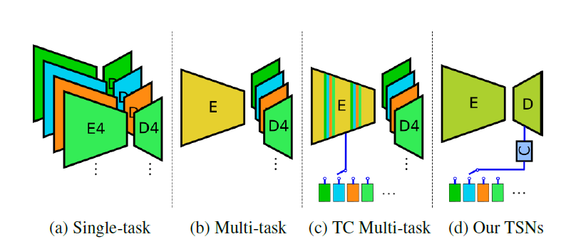

# TSNs [Eng]

한국어로 쓰인 리뷰를 읽으려면 [**여기**](./iccv-2021-TSNs-kor.md)를 누르세요.

Sun, Guolei, et al. "Task Switching Network for Multi-Task Learning." *Proceedings of the IEEE/CVF International Conference on Computer Vision*. 2021. ([paper](https://openaccess.thecvf.com/content/ICCV2021/papers/Sun_Task_Switching_Network_for_Multi-Task_Learning_ICCV_2021_paper.pdf))

 

Before we go on exploring the paper "Task Switching Network for Multi-Task Learning", I'll briefly introduce what is multi-task learning and some approaches taken by previous works.  
 

## 1. Problem definition

Multi-task learning is subfield of machine learning in which multiple tasks are simultaneously learned by a shared model. Traditionally, MTL (Multi-Task Learning) contains learning settings in which a fixed set of tasks is learned simultaneously, and each task is treated equally.  We don't consider training settings that have only a single "main task" with one or more auxiliary tasks, as well as settings in which the set of tasks to learn changes over time). This point is a distinct characteristic of MTL when we distinguish it from transfer learning.

The advantages of multi-task learning are followed.

* Data efficiency (memory usage, computation)
* Reduced over-fitting through shared representations
* Fast learning by leveraging auxiliary information

Relatively smaller size of network is needed for multi-task learning compared to situation when we train each task on separate single task networks thanks to information sharing between tasks. More than that, by using effective information exchange between tasks in a shared architecture, we can exploit shared representations of multiple tasks that would lead to reduced over-fitting. Also, these kinds of information exchange can be used as auxiliary information that is helpful to fast convergence of network.

Problems that should be solved in multi-task learning

* Different tasks have conflicting needs. Increasing the performance of a model on one task will hurt performance on a task with different needs (negative transfer or destructive interference)
* Thus, minimizing negative transfer is a key goal for MTL methods.

Multi-task learning is a paradigm to learn different task simultaneously, which each task has its own needs. If different tasks proceed to same direction for optimization (positive transfer) it is good for learning. But in the opposite situation, task-specific feature spaces and attention mechanisms are often used to minimize negative transfer between task. But division of information between tasks is still challenging.

Requirement for solving problem in multi-task learning are followed.

* New design of architecture and optimization method
* Choose which tasks should be learned jointly

To promote information exchange between different tasks in shared architecture, proper design of architecture and optimization methods is needed. Also, finding out related tasks would show high performance when they are trained together.

 

## 3. Motivation

### Related work

Different approaches have been proposed for multi-task learning.

* Encoder-based methods - Focus on enhancing the capability of architectures to encode shared and task-specific information. [1, 2, 3]
* Decoder-based methods - Focus on refining the encoder features for specific tasks [4, 5]
* Optimization-based methods - Focus on task interference or negative transfer by re-weighting the loss or re-ordering the task learning [6, 7]

Different architecture have been proposed for multi-task learning.

* Shared trunk - A global feature extractor made of convolutional layers shared by all tasks followed by an individual output branch for each task. [1, 8, 9]
* Cross talk - Separate network for each task, with information flow between parallel layers in the task networks [2]
* Prediction distillation - Make preliminary predictions for each task, then combining these predictions to produce final, refined outputs [4, 10]
* Conditional architecture - Parts of a architecture are selected for execution depending on the input to the network and task. [11. 12]

 

 For detailed information, please see reference at the end of this article.

 

### Idea

Previous work on multi-task learning should have task-specific module for each task any way. This paper purse a challenging goal: sharing as many parts of the network as possible across all tasks, up to the point that all parameters are shared, and the network becomes independent of the number of tasks T.

 

## 4. Method

### Task Switching networks

Above figure shows the overview of task switching network. Proposed network performs multi-tasking by switching between tasks using a conditional decoder. Following U-Net, encoder takes the image $I_n$ and extracts feature $F_i$ at different layers. As second input, proposed network takes a task encoding vector $v_\tau$, selecting task $\tau$ to be performed. A small task embedding network $C$ maps each task to a latent embedding $l_\tau$, that conditions the decoder layers along the blue paths, using module $A$. The output is computed by conditioning and assembling encoder features $F_i$ and decoder features $O_i$ in a bottom up fashion. 

Key Points

- Sharing of the complete decoder for every tasks.
- Avoiding additional parameters for each task caused by task-specific modules.
- A Small task embedding network with fully connected layers
- Conditioning of the decoder layers using a module similar to StyleGAN.

 

Module $A$ transforms input features to new features based on the embedding vector $l_\tau$, representing the specific task. Let $O_j$ be the output of the decoder from layer j, which is given by

$$O_j = \begin{cases} A([u(O_{j+1}),A(F_j,l_\tau)],l_\tau),\;\;\;\;\;for\;\;j\leq4, \\ A(F_j,l_\tau),\;\;\;\;\;\;\;\;\;\;\;\;\;\;\;\;\;\;\;\;\;\;\;\;\;\;\;\;\;\;\;for\;\;j=5\end{cases}$$

where $[\cdot,\cdot]$ denotes the concatenation of two features tensors along the channel dimension and $u(\cdot)$ is a upsampling operation.

 

### Conditional Convolution Module

The goal of module (block $A$) is to adjust feature representations from the encoder - that are shared by all tasks - to new features that serve the desired task. Module $A$ works as follows.

1. Input feature to module $x\in R^{1\times c_1\times h\times w}$ is processed by a convolution layer $\hat{x}=x*W$ with filter weights $W$, generating $\hat{x}\in R^{1\times c_2\times h\times w}$.

2. At the same time, $l_\tau$ is transformed by two fully connected layers with weight matrices $W_\gamma \in R^{d \times c_2}$ and $W_\beta \in R^{d \times c_2}$, to form the normalization coefficients $\gamma \in R^{1 \times c_2}$ and $\beta \in R^{1 \times c_2}$, for the subsequent AdaIN.

3. For feature $\hat{x}$, AdaIN performs the normalization following. $AdaIN(\hat{x},\beta,\gamma) = \gamma\frac{(\hat{x}-\mu)}{\sqrt{\sigma^2}} + \beta$  

   where $\beta$ and $\sigma^2$ are the mean and variance of $\hat{x}$.

   In summary, module $A$ performs the operation $A(x,l_\tau) = l_\tau W_\gamma\frac{(x*W-\mu)}{\sqrt{\sigma^2}} + l_\tau W_\beta$ 

 

### Task embedding network

Each task is associated with a unique task-condition vector $v_\tau$, and the TSNs switch between tasks by feeding different $v_\tau$ to the task embedding network $C$. The embedding network $C:R^d\rarr R^d$ learns to embed the task $\tau$ in a latent space $l_\tau=C(v_\tau)$, from which the AdaIN coefficients are generated for each module $A$.

For the initialization of task-condition vectors, orthogonal $v_\tau$ (binary vector) and Gaussian random vectors are investigated.

 

## 5. Experiment

In experiments,

PASCAL-context dataset(Edge detection, semantic segmentation, human parts segmentation, surface normals, and saliency detection) and NYUD dataset (Edge detection, semantic segmentation, surface normals, and depth estimation) are used.

As shown in above table, TSNs perform competitively with single tasking and multi-tasking base-lines, with substantially smaller model sizes. Result shows that the learning the normalization coefficients jointly through the task embedding is better than learning them separately for each task. And proposed method converges much faster than task-specific INs and BNs.

 

Above table shows the impact of two different choices for the task-condition vector $v_\tau$. For orthogonal encodings, the performance is robust towards the embedding dimensionality d, while performing best at $d=100$. Gaussian encodings perform equally well as the orthogonal counterpart for dimensionality below 100.

 

Above figure shows how the number of parameters of each method scales with the number of tasks $T$. Proposed method (TSNs) have constant parameters irrespective of $T$. On the other hand, other methods (RCM, Multi-decoder, etc.) scale linearly with $T$. 

 

Above result shows proposed model with baseline (Task-specific INs) visually. Proposed method outperforms the baseline in high-level tasks such as semantic segmentation, parts, and saliency detection.

 

## 6. Conclusion

* First approach for multi-task learning that uses only a single encoder and decoder architecture.
* Task Switching Networks with a substantial advantage in terms of simplicity and parameter efficiency,
* Outperform state-of-the-art multi-decoder methods with much less parameters.

 

## 7. Author / Reviewer information

##### 정우성 (WooSeong Jeong)

* KAIST ME M.S.

* Research Area: Computer Vision

* stk14570@kaist.ac.kr

   

## 8. Reference

* Sun, Guolei, et al. "Task Switching Network for Multi-Task Learning." *Proceedings of the IEEE/CVF International Conference on Computer Vision*. 2021. ([paper](https://openaccess.thecvf.com/content/ICCV2021/papers/Sun_Task_Switching_Network_for_Multi-Task_Learning_ICCV_2021_paper.pdf))

* Ruder, Sebastian. "An overview of multi-task learning in deep neural networks." *arXiv preprint arXiv:1706.05098* (2017). ([paper](https://arxiv.org/abs/2009.09796))
* Karras, Tero, Samuli Laine, and Timo Aila. "A style-based generator architecture for generative adversarial networks." *Proceedings of the IEEE/CVF conference on computer vision and pattern recognition*. 2019. ([paper](https://arxiv.org/abs/1812.04948))

1.  Iasonas Kokkinos. Ubernet: Training a universal convolutional neural network for low-, mid-, and high-level vision using diverse datasets and limited memory. In CVPR, 2017.
2.  I. Misra, Abhinav Shrivastava, A. Gupta, and M. Hebert. Cross-stitch networks for multi-task learning. CVPR, 2016.
3.  Y. Lu, Abhishek Kumar, Shuangfei Zhai, Yu Cheng, T. Javidi, and R. Feris. Fully-adaptive feature sharing in multitask networks with applications in person attribute classification. CVPR, 2017.
4.  D. Xu, Wanli Ouyang, X. Wang, and N. Sebe. Pad-net: Multi-tasks guided prediction-and-distillation network for simultaneous depth estimation and scene parsing. CVPR, 2018.
5.  Simon Vandenhende, S. Georgoulis, and L. Gool. Mti-net: Multi-scale task interaction networks for multi-task learning. In ECCV, 2020.
6.  Z. Chen, Vijay Badrinarayanan, Chen-Yu Lee, and Andrew Rabinovich. Gradnorm: Gradient ormalization for adaptive loss balancing in deep multitask networks. arXiv, 2018.
7.  Alex Kendall, Yarin Gal, and R. Cipolla. Multi-task learning using uncertainty to weigh losses for scene geometry and semantics. CVPR, 2018.
8.  Felix J. S. Bragman, Ryutaro Tanno, S´ebastien Ourselin, D. Alexander, and M. Cardoso. Stochastic filter groups for multi-task cnns: Learning specialist and generalist convolution kernels. ICCV, 2019.
9.  Y. Lu, Abhishek Kumar, Shuangfei Zhai, Yu Cheng, T. Javidi, and R. Feris. Fully-adaptive feature sharing in multitask networks with applications in person attribute classification. CVPR, 2017.
10.  Z. Zhang, Zhen Cui, Chunyan Xu, Zequn Jie, Xiang Li, and Jian Yang. Joint task-recursive learning for semantic segmentation and depth estimation. In ECCV, 2018.
11.  Menelaos Kanakis, David Bruggemann, Suman Saha, Stamatios Georgoulis, Anton Obukhov, and Luc Van Gool. Reparameterizing convolutions for incremental multi-task learning without task interference. ECCV, 2020.
12.  Kevis-Kokitsi Maninis, Ilija Radosavovic, and Iasonas Kokkinos. Attentive single-tasking of multiple tasks. In CVPR, 2019
