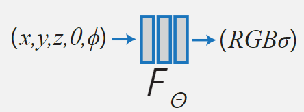
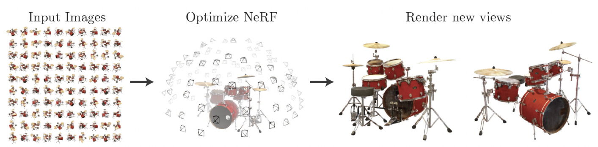
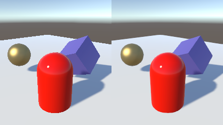
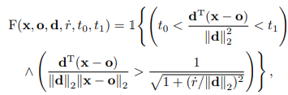
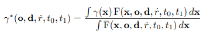
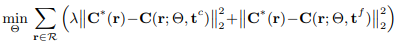
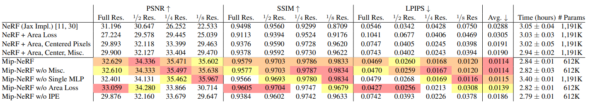

Mip-Nerf: A Multiscale Representation for Anti-Aliasing Neural Radiance Fields \[Kor\]

##  1. Problem definition

NeRF는 한 장면을 나타낸 여러 개의 사진들을 기반으로 해당 장면의 3차원 이미지를 복원하는 모델이다.
아래의 수식을 통해서 해당 문제를 수학적으로 정의할 수 있다.

여기서 x, y, z는 공간 상에서의 위치를 뜻하며, theta와 phi는 해당 위치를 바라보는 각도를 나타낸다. 
(r, g, b)는 모델에 의해서 산출되는 복원된 이미지에서의 색상을 뜻하며, sigma는 복원된 이미지에서의 밀도를 뜻한다.

아래의 그림을 통해서 어떻게 NeRF가 여러 개의 각도에서 찍은 사진을 기반으로 3차원 이미지를 복원하는지를 확인할 수 있다.

## 2. Motivation

위의 그림처럼 학습과 시에 사용한 이미지가 객체로부터 같은 거리에서 찍혀 해상도가 같은 상황인 경우면 기존의 NeRF 방법론이 효과적이지만, 그렇지 않은 경우 3차원 이미지 복원 시 아래의 그림처럼 이미지가 깨지는 현상이 관찰된다.
일반적으로 가까운 곳에서 찍힌 이미지의 경우 흐릿하게 복원되며, 먼 곳에서 찍힌 이미지의 경우 복원된 이미지가 끊기는 현상(aliasing)이 발생한다.

이를 해결하기 위해서 다양한 방법론이 제안되었으며, 본 연구에서는 원뿔형태의 광선을 하나의 픽셀을 대응하였고, 확률분포 함수 형태의 연속함수로 특성(feature)을 표현함으로써 이를 해결하였다.

### Related work

Mipmapping 기법은 이미지가 끊기는 현상을 방지하기 위한 pre-filtered 기반 전처리 방식이다. 이 기법은 연속적인 공간에 대해서 특성을 산출함으로써 이미지 렌더링 시에 이미지가 끊기는 현상을 방지할 수 있다. Mipmapping에서는 픽셀을 통과하는 단일 광선이 아닌 원뿔형태의 구조를 하나의 픽셀에 대응시켜서 공간 영역의 특성(feature)을 3차원 Gaussian 분포로 근사하는 방식을 사용한다. 이 외에도 supersampling 기반으로 렌더링 시에 여러 개의 광선을 하나의 픽셀에 대응시킴으로써 해상도를 높이는 방식을 이용하여 이미지 끊김 현상을 방지하기도 한다.

Pumarola et al.(2020)의 D-NeRF는 5차원의 인풋 데이터에 시간 차원을 더해 6차원 인풋 데이터를 이용하여 3차원 이미지를 복원하므로써 정적인 객체 뿐만 아니라 동적인 객체의 3차원 이미지를 복원하는 데 성공하였다. 
Martin-Brualla et al.(2020)이 제안한 NeRF-W는 모델을 세 개의 모듈로 구성함으로써 인풋 데이터의 해상도가 다른 상황에서도 3차원 이미지를 복원하는데 좋은 성능을 보이도록 하였다. 그들이 제안한 세가지 모듈은 첫번째는 일시적으로 이미지를 복원하는 모듈, 두번째는 영구적으로 남아있는 모듈, 그리고 복원의 불확실성을 다루는 모듈이다. 이를 통해서 다양한 형태의 인풋 이미지를 이용하더라도 3차원 이미지의 복원 성능이 높아지는 것을 확인할 수 있었다.

### Idea

기존의 NeRF 모델은 하나의 광선이 하나의 이미지 픽셀에 대응된다는 가정하에 모델을 구축하였다. 하지만 이를 통해서는 객체로부터 다양한 거리에서 수집되는 이미지들이 모델에 입력되었을 때 복원된 3차원 이미지가 깨지게 되는 한계가 존재한다. 이를 해결하기 위해서 여러 개의 광선을 하나의 픽셀에 대응시키면 이미지 복원 시에 계산량이 너무 커서 실용적이지 않은 실정이다. 

이에 저자들은 원뿔형태의 광선을 하나의 픽셀에 대응시켰으며, 광원으로부터 거리가 멀어짐에 따라서 대응되는 면적이 넓어지는 것을 반영하기 위해서 특성(feature)을 연속함수로 구성하였다. 또한, 단일 점이 아닌 공간 영역을 특성화 하기 위해서 단순한 위치 인코딩이 아닌 적분 형태의 위치 인코딩(integrated positional encoding)방식을 제안하였다. 이를 통해서 공간 영역에 해당하는 연속적인 특성을 이용함으로써 3차원 이미지 복원 시 이미지가 끊기는 현상(aliasing)을 해결하였다.

## 3. Method

먼저 본 연구에서 사용한 원뿔 형태의 구조 내에서의 위치 집합을 아래와 같이 수학적으로 나타낼 수 있다.

이 구조의 특성을 적분을 통해서 계산하였으며, 적분식을 사용 시에 3차원 Gaussian 분포를 이용하여 해당 적분을 공간에 대해서 닫혀있도록 하였다. 여기서 원뿔 형태의 공간 영역 내에서 $$F(x,)$$의 평균과 분산을 계산하여 Gaussian 분포를 추정하였다.

최적화 과정에서 사용한 loss 함수는 아래의 수식으로 표현된다. 아래의 수식에서 사용한 coarse sample은 stratified sampling 과정을 통해서 추출한 128개의 샘플을 이용하며, fine sample은 alpha composite weight 기반의 128개의 샘플을 이용한다.

## 4. Experiment & Result

### Experimental setup

실험 과정에서는 두 개의 데이터 셋이 사용되었다. 하나는 NeRF 연구에서 사용되던 Blender Dataset과 하나는 임의로 해상도를 조절한 Multiscale Blender Dataset이다. 기존의 연구에서 사용하던 Blender Dataset은 같은 거리에서 객체를 찍은 이미지만을 이용하여 3차원 이미지 복원 성능을 비교하였다. 이를 통해서 NeRF의 약점을 감출 수는 있었지만 현실 세계에서 사용되는 이미지 데이터의 경우 다양한 해상도를 띄게 된다. 이 상황에 대해서 평가하기 위해서 Blender Dataset의 해상도를 1/2, 1/4, 1/8로 낮춘 이미지를 포함시킨 Multiscale Blender Dataset을 실험에 사용하였다.

실험에서 사용한 비교군은 원래의 NeRF 모델과 Mip-NeRF의 주요 component를 하나씩 제거한 모델과 비교하였다. 이를 통해서 제안한 모델 구조가 효과적인지, 또한 사용한 각각의 component가 모델 성능 향상에 도움이 되는지 확인할 수 있다. 학습 과정은 방법론 파트에서 설명한 것과 같이 coarse와 fine sample 각각 128개를 이용하였으며, 해상도를 떨어뜨린 이미지를 이용하여 학습시킬 경우 Loss에 가중치를 곱하여서 공정한 학습을 가능케하였다 (예시: 1/2 해상도: 4배, 1/4 해상도: 16배).

평가에 사용한 지표는 이미지 복원 평가에서 흔히 사용되는 PSNR, SSIM, LPIPS를 사용하였다. 여기서 PSNR와 SSIM은 높을 수록, LPIPS는 낮을 수록 복원 성능이 좋은 것이다.

### Result

위의 에서 알 수 있듯이 제안한 Mip NerF가 이미지 복원에 있어서 우수한 성능을 보이는 것을 확인할 수 있다. 특히 원래의 NerF 모델은 입력되는 이미지의 해상도가 낮아짐에 따라서 복원성능이 급격히 감소하는 것을 확인할 수 있지만 제안한 Mip-NerF의 경우 복원 성능이 감소하지 않는 것을 확인할 수 있다. 이를 통해서 본 연구에서 제안한 모델이 보다 현실적인 이미지 복원에 있어서 유용하게 사용될 것임을 알 수 있다.

## 5. Conclusion

본 연구에서 제안한 Mip-NerF 모델은 원뿔 형태의 구조를 하나의 픽셀에 대응시켜서 공간 영역의 특성(feature)을 3차원 Gaussian 분포로 근사하는 방식을 사용하여서 단일 해상도의 인풋 데이터에서만 좋은 성능을 보이던 NeRF 모델을 다양한 해상도에서의 이미지들에서도 잘 작동할 수 있도록 하였다. 실험 결과 우리가 제작한 Multiscale 데이터셋에서는 기존의 NeRF 모델에 비해서 성능이 60% 좋았으며, 기존에 사용하던 단일 해상도 Blender Dataset에서도 17% 성능 개선을 하였다. 또한 학습 시간도 NeRF 모델에 비해서 7% 정도 빨라지는 것을 확인할 수 있었다.

### Take home message \(오늘의 교훈\)

> 저자들은 기존의 Anti-aliasing mipmapping 필터링 방법을 NeRF 모델에 적용함으로써 NeRF 모델의 근본적인 문제를 해결할 수 있었다.
>
> 딥러닝 모델을 구축 시 문제점을 명확하게 정의하는 것이 중요하다.
>
> 딥러닝 모델을 구축 시 문제점의 해결방안을 도출할 때 기존의 전통적인 방법론을 참고하는 것이 상당한 도움이 될 수 있다.

## Author information

### Author

**조해찬 \(Haechan Cho\)** 

* Affiliation \(KAIST AI\)
* I am eager to learn new things.
* Contact information \(gkqkemwh@kaist.ac.kr\)

