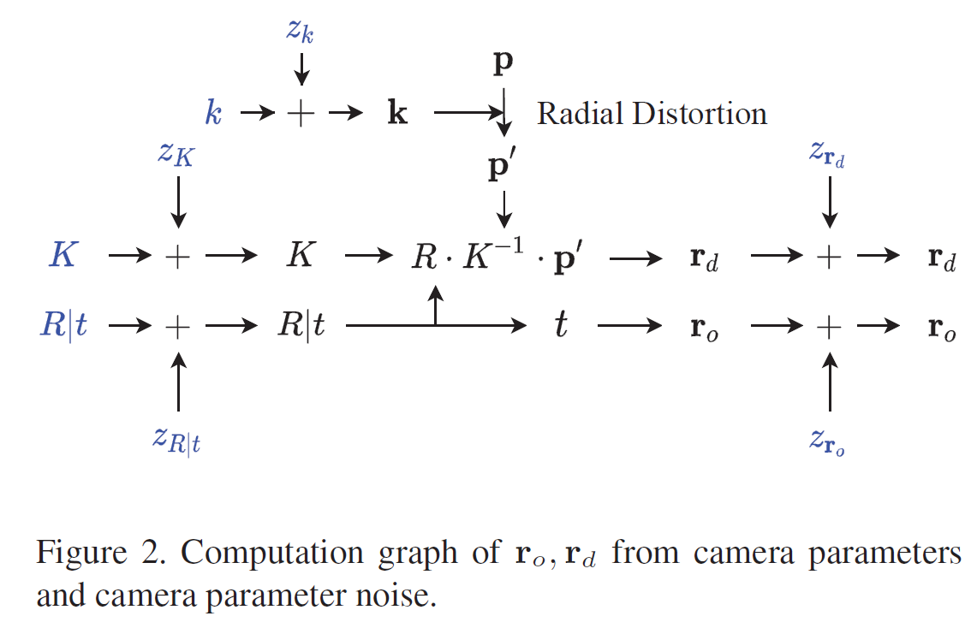

# Self-Calibrating Neural Radiance Fields \[Eng]

## Self-Calibrating Neural Radiance Fields \[Eng]

한국어로 쓰인 리뷰를 읽으려면 [**여기**](broken-reference/)를 누르세요.

## 1. Problem definition

Given a set of images of a scene, the proposed method, dubbed SCNeRF, jointly learns the geometry of the scene and the accurate camera parameters without any calibration objects. This task can be expressed as the following equation.

> Find $$K, R, t, k, r_{o}, r_{d}, \theta$$, when
>
> $$\mathbf{r}=(\mathbf{r_o}, \mathbf{r_d})=f_{cam}(K, R, t, k, r_o, r_d)$$
>
> $$\hat{\mathbf{C}}(\mathbf{r})=f_{nerf}(\mathbf{r};\theta)$$

where $$\mathbf{r}$$ is a ray, $$\mathbf{r_o}$$ and $$\mathbf{r_d}$$ is ray origin and ray direction, $$f_{cam}$$ is a function that generates ray from camera parameters, $$(K,R,t,k,r_o,r_d)$$ are camera parameters, $$\hat{\mathbf{C}}(\mathbf{r})$$ is an estimated color of ray $$\mathbf{r}$$, $$\theta$$ is a parameter set of NeRF model, $$f_{nerf}$$ is a function that estimate color of a ray given using NeRF parameters.

Generally, scene geometry is learned given known camera parameters, or camera parameters are estimated without improving or learning scene geometry.

Unlike the previous approach, the purpose of this paper is to learn camera parameters $$(K,R,t,k,r_o,r_d)$$ and NeRF model parameters $$\theta$$ jointly.

## 2. Motivation

### Related work

#### Camera Model

Because of its simplicity and generality, traditional 3D vision tasks often assume that the camera model is a simple pinhole model. However, with the development of camera models, various camera models have been introduced, including fish eye models, and per-pixel generic models. A basic pinhole camera model is not enough to represent these kinds of complex camera models.

#### Camera Self-Calibration

Self-Calibration is a research topic that calibrates camera parameters without an external calibration object (e.g., a checkerboard pattern) in the scene.

In many cases, calibration objects are not readily available. Thus, calibrating camera parameters without any external objects has been an important research topic.

However, conventional self-calibration methods solely rely on the geometric loss or constraints based on the epipolar geometry that only uses a set of sparse correspondences extracted from a non-differentiable process. This could lead to diverging results with extreme sensitivity to noise when a scene does not have enough interest points. Lastly, conventional self-calibration methods use an off-the-shelf non-differentiable feature matching algorithm and do not improve or learn the geometry. It is well known that the better we know the geometry of the scene, the more accurate the camera model gets.

#### Neural Radiance Fields(NeRF) for Novel View Synthesis

NeRF is a work that synthesizes a novel view of the scene by optimizing a separate neural continuous volume representation network for each scene.

At the time when the NeRF was published, this work achieves state-of-the-art results for synthesizing novel views of complex scenes by optimizing an underlying continuous volumetric scene function using a sparse set of input views.

However, this requires not only a dataset of captured RGB images of the scene but also the corresponding camera poses and intrinsic parameters, which are not always available.

### Idea

* Pinhole camera model parameters, fourth-order radial distortion parameters, and generic noise model parameters that can learn arbitrary non-linear camera distortions are included to overcome the limitation of the pinhole camera model.
* To overcome the limitation of geometric loss used in the previous self-calibration methods, additional photometric consistency is used.
* To get a more accurate camera model using improved geometry of the scene, the geometry represented using Neural Radiance Fields is learned jointly.

## 3. Method

### Differentiable Camera Model

#### Pinhole Camera Model

The first component of differentiable camera unprojection is based on the pinhole camera model, which maps a 4-vector homogeneous coordinate in 3D space $$P_{4 \times 1}$$ to a 3-vector in the image plane $$P'_{3 \times 1}$$.

$$
P'_{3\times1} = M_{3\times4}P=K_{3\times3}\left[R\; T\right]_{3\times 4} P_{4\times 1}
$$

Where $$K$$ is the intrinsics matrix, $$R$$ is the rotation matrix, $$T$$ is the translation matrix

First, the camera intrinsic parameters are decomposed into the initialization $$K_0$$ and the residual parameter matrix $$\Delta K$$(=$$z_K$$). This is due to the highly non-convex nature of the intrinsics matrix that has a lot of local minima.

$$
K=\begin{bmatrix} f_x+\Delta f_x & 0 & c_x + \Delta c_x \\ 0 & f_y + \Delta f_y & c_y + \Delta c_y \\ 0 & 0 & 1 \end{bmatrix} = K_0 + \Delta K \in \mathbb{R}^{3\times 3}
$$

Similarly, the extrinsics initial values $$R_0$$ and $$t_0$$ and residual parameters to represent the camera rotation R and translation t. However, directly learning the rotation offset for each element of a rotation matrix would break the orthogonality of the rotation matrix. Thus, the 6-vector representation which uses unnormalized first two columns of a rotation matrix is utilized to represent a 3D rotation:

$$
\mathbf{t} = \mathbf{t_0} + \Delta \mathbf{t}\\R=f(\mathbf{a_0}+\Delta \mathbf{a})\\f\begin{pmatrix}\begin{bmatrix} | & | \\ a_1& a_2\\ | & | \end{bmatrix}\end{pmatrix} = \begin{bmatrix}|&|&|\\\mathbf{b_1} & \mathbf{b_2} & \mathbf{b_3}\\| & | & |\end{bmatrix}_{3 \times 3}
$$

What $$f$$ does is quite similar to Gram-Schmidt process. To make it clear, I draw conceptual image as follows. Here, $$N(\cdot)$$ is $$L2$$ normalization.

As we can see in the figure, from unnormalized two vectors $$\mathbf{a_1}$$ and $$\mathbf{a_2}$$, orthonormal vectors $$\mathbf{b_1}, \mathbf{b_2}, \mathbf{b_3}$$ can be obtained.

####

#### Fourth Order Radial Distortion

Since commercial lenses deviates from ideal lens with single lens focal length, this creates a number of aberrations. The most common one is referred to as “radial distortion”.

Camera model of SCNeRF is extended to incorporate such radial distortions.

Undistorted normalized pixel coordinate $$(n'_x, n'_y)$$ converted from pixel coordinate $$(p_x, p_y)$$ can be expresses as the following.

$$
(n_x, n_y) = (\frac{p_x-c_x}{f_x},\frac{p_y-c_y}{f_y}),r=\sqrt{n^2_x+n^2_y}\\\left[n'_x, n'_y, 1 \right]^T = K^{-1} \left[p_x(1+(k_1+z_{k_1}) r^2 + (k_2+z_{k_2}) r^4), p_y(1+(k_1+z_{k_1}) r^2 + (k_2+z_{k_2}) r^4),1 \right]
$$

where $$(k_1, k_2)$$ is initial radial distortion parameter denoted as $$k_0$$ and $$(z_{k_1}, z_{k_2})$$ are residuals denoted as $$z_k$$.

#### Ray Direction & Origin

Using[#pinhole-camera-model](iccv-2021-scnerf-eng.md#pinhole-camera-model "mention") and [#fourth-order-radial-distortion](iccv-2021-scnerf-eng.md#fourth-order-radial-distortion "mention"), ray direction $$\mathbf{r_d}$$ and ray origin $$\mathbf{r_o}$$ in the world coordinate can be expressed as the following.

$$
\mathbf{r_d} = N(R \cdot \left[n'_x, n'_y, 1 \right]^T)\\\mathbf{r_o}=\mathbf{t}
$$

where $$N(\cdot)$$ is vector normalization. For those who may confuse why $$\mathbf{t}$$ equals the ray origin $$\mathbf{r_o}$$ in the world coordinate, I draw conceptual image that shows the geometric meaning of vector $$\mathbf{t}$$.

Since these ray parameters $$\mathbf{r_d}$$ and $$\mathbf{r_o}$$ are functions of intrinsics, extrinsics, and dirtortion paramameter residuals ($$\Delta f, \Delta c, \Delta a, \Delta t, \Delta k$$), we can pass gradients from the rays to the residuals to optimize the parameters. Note that $$K_0,R_0, t_0, k_0$$are initial values of each parameters and not optimized.

#### Generic Non-Linear Camera Distortion

Complex optical abberations in real lenses cannot be modeled using a parametric camera. For such noise, generic non-linear aberration model is used. Specifically, local ray parameter residuals $$\mathbf{z_d} = \Delta \mathbf{r}_d(\mathbf{p})$$, $$\mathbf{z}_o = \Delta \mathbf{r}_o(\mathbf{p})$$ is used, where $$\mathbf{p}$$ is the image coordinate.

$$
\mathbf{r}'_d = \mathbf{r}_d + \mathbf{z}_d \\\mathbf{r}'_o=\mathbf{r}_o+\mathbf{z}_o
$$

Bilinear interpolation is used to extract continuous ray distortion parameters.

$$
\mathbf{z}_d(\mathbf{p}) = \sum_{x=\lfloor\mathbf{p}_x\rfloor}^{\lfloor\mathbf{p}_x\rfloor+1}\sum_{x=\lfloor\mathbf{p}_y\rfloor}^{\lfloor\mathbf{p}_y\rfloor+1} \left(1-|x-\mathbf{p}_x|\right)\left(1-|y-\mathbf{p}_y|\right)\mathbf{z}_d\left[x,y\right]
$$

where $$\mathbf{z}_d[x, y]$$ indicates the ray direction offset at a control point in discrete 2D coordinate $$(x, y)$$.  $$\mathbf{z}_d[x, y]$$ is learned at discrete locations only. Dual comes for free.

$$
\mathbf{z}_o(\mathbf{p}) = \sum_{x=\lfloor\mathbf{p}_x\rfloor}^{\lfloor\mathbf{p}_x\rfloor+1}\sum_{x=\lfloor\mathbf{p}_y\rfloor}^{\lfloor\mathbf{p}_y\rfloor+1} \left(1-|x-\mathbf{p}_x|\right)\left(1-|y-\mathbf{p}_y|\right)\mathbf{z}_o\left[x,y\right]
$$

To help your understanding, the conceptual image of a generic non-linear aberration model is attached below.

 

#### Computational Graph of Ray Direction & origin

From [#pinhole-camera-model](iccv-2021-scnerf-eng.md#pinhole-camera-model "mention"), [#fourth-order-radial-distortion](iccv-2021-scnerf-eng.md#fourth-order-radial-distortion "mention"), [#generic-non-linear-camera-distortion](iccv-2021-scnerf-eng.md#generic-non-linear-camera-distortion "mention"), the final ray direction and ray origin can be expressed using the following graph.

### Loss

To optimize calibration parameters, both geometric consistency loss and photometric consistency loss is exploited.

#### Geometric Consistency Loss

we pro pose the projected ray distance loss that directly measures the discrepancy between rays. Let (pA ↔ pB) be a correspondence on camera 1 and 2 respectively. When all the camera parameters are calibrated, the ray rA and rB should intersect at the 3D point that generated point pA and pB. However, when there’s a misalignment due to an error in camera parameters, we can measure the deviation by computing the shortest distance between corresponding rays. Let a point on line A be xA(tA) = ro,A + tArd,A and a point on line B be xB(tB) = ro,B + tBrd,B. A distance between the line A and a point on the line B is d. If we solve for dd2 dtB |ˆtB = 0, we get ˆtB. We substitute ˆtB to the line 2 and can get the ˆxB = xB(ˆtB). Similarly, we can get ˆxA. we project the points to image planes and compute dis xA, xB IA, IB tance on the image planes, rather than directly using the distance in the 3D space. d\_pi For simplicity, we will denote x as . x where π(·) is a projection function and equalizes the contribution from each correspondence irrespective of their distance from the cameras.Our projected ray distance does not require the intermediate 3D reconstruction and can model the non-linear camera distortions.

#### Photometric Consistency Loss

photometric consistency requires reconstructing the 3D geometry because the color of a 3D point is valid only if it is visible from the current perspective. In our work, we use a neural radiance field \[13] to reconstruct the 3D occupancy and color. This implicit representation is differentiable through both position and color value and allows us to capture the visible surface through volumetric rendering. Specifically, during the rendering process, a ray is parametrized using K0,R0, t0 as well as ΔK,Δa,Δt as well as zo\[·], zd\[·] as visualized in Fig. 2. We differentiate the following energy function with respect to the learnable camera parameters to optimize our self-calibration model. L =  p∈I ||C(p) − ˆ C(r(p)||22 (15) Here, p is a pixel coordinate, and I is a set of pixel coordinates in an image. ˆ C(r) is the output of the volumetric rendering using the ray r, which corresponds to the pixel p. C(p) is the ground truth color.

### Curriculum Learning

To optimize geometry and camera parameters, we learn the neural radiance field and the camera model jointly. However, it is impossible to learn accurate camera parameters when the geometry is unknown or too coarse for selfcalibration. Thus, we sequentially learn parameters: geometry and a linear camera model first and complex camera model parameters.The camera parameters determine the positions and directions of the rays for NeRF learning, and unstable values often result in divergence or sub-optimal results. Thus, we add a subset of learning parameters to the optimization process to jointly reduce the complexity of learning cameras and geometry. First, we learn the NeRF networks while initializing the camera focal lengths and focal centers to half the image width and height. Learning coarse geometry first is crucial since it initializes the networks to a more favorable local optimum for learning better camera parameters. Next, we sequentially add camera parameters for the linear camera model, radial distortion, and nonlinear noise of ray direction, ray origin to the learning. We learn simpler camera models first to reduce overfitting and faster training.

Following is the final learning algorithm. $$get\_params$$ function returns a set of parameters of the curriculum learning which returns a set of parameters for the curriculum learning which progressively adds complexity to the camera model. Next, we train the model with the projected ray distance by selecting a target image at random with sufficient correspondences. Heuristically, we found selecting images within maximum 30°from the source view gives an optimal result.

## 4. Experiment & Result

Here, not all but some representative experimental results are shown.

### Experimental Setup

* **Dataset**
  * LLFF
    * 8 scenes
  * Tanks and Temples
    * 4 scenes
  * Custom data collected by the author
    * 6 scenes
    * fish-eye camera
* Experiments
  *

### Improvement over NeRF

We train our model from scratch to demonstrate that our model can self-calibrate the camera information. We initialize all the rotation matrices, the translation vectors, and focal lengths to an identity matrix, zero vector, and height and width of the captured images. Table 1 reports the qualities of the rendered images in the training set. Although our model does not adopt calibrated camera information, our model shows a reliable rendering performance. Moreover, for some scenes, our model outperforms NeRF, trained with COLMAP \[16] camera information. We have visualized the rendered images in Figure 7.

&#x20;&#x20;

### Ablation Study

To check the effects of the proposed models, we conduct an ablation study. We check the performance for each phase in curriculum learning. We train 200K iterations for each phase. From this experiment, we have observed that extending our model is more potential in rendering clearer images. However, for some scenes, adopting projected ray distance increases the overall projected ray distance.\

## 5. Conclusion

### Summary

SCNeRF proposes a self-calibration algorithm that learns geometry and camera parameters jointly end-to-end. The camera model consists of a pinhole model, radial distortion, and non-linear distortion, which capture real noises in lenses. We also propose projected ray distance to improve accuracy, which allows our model to learn fine-grained correspondences. We show that our model learns geometry and camera parameters from scratch when the poses are not given, and our model improves both NeRF to be more robust when camera poses are given.

### Personal Opinion

* In my perspective, this paper is worthy because it shows a way to calibrate camera parameters and neural radiance fields jointly.&#x20;
* I wonder why the result in the paper reports training set accuracy instead of val/test set accuracy.
* Some errors are noticed in equations and corrected as I think they should be. Please feel free to comment if you find any errors in the equations used in this article.

### Take home message

> SCNeRF learns geometry and camera parameters from scratch w/o poses&#x20;
>
> SCNeRF uses the camera model consists of a pinhole model, radial distortion, and non-linear distortion&#x20;
>
> SCNeRF proposed projected ray distance to improve accuracy

## Reviewer information

None

## Reference & Additional materials

1. Citation of this paper
2. Official (unofficial) GitHub repository
3. Citation of related work
4. Other useful materials
5. ...
