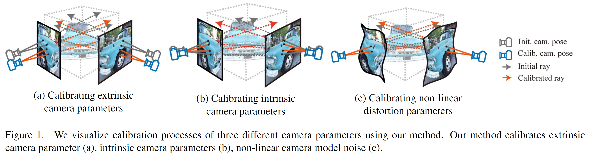
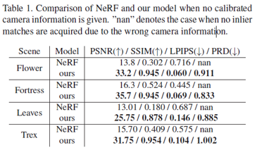
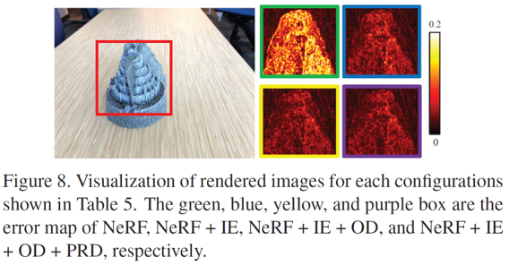

# Self-Calibrating Neural Radiance Fields \[Eng]

## Self-Calibrating Neural Radiance Fields \[Eng]

한국어로 쓰인 리뷰를 읽으려면 [**여기**](broken-reference/)를 누르세요.

## 1. Problem definition

Given a set of images of a scene, the proposed method, dubbed SCNeRF, jointly learns the geometry of the scene and the accurate camera parameters without any calibration objects. This task can be expressed as the following equation.

> Find $$K, R, t, k, r_{o}, r_{d}, \theta$$, when
>
> $$\mathbf{r}=(\mathbf{r_o}, \mathbf{r_d})=f_{cam}(K, R, t, k, r_o, r_d)$$
>
> $$\hat{\mathbf{C}}(\mathbf{r})=f_{nerf}(\mathbf{r};\theta)$$

where $$\mathbf{r}$$ is a ray, $$\mathbf{r_o}$$ and $$\mathbf{r_d}$$ is ray origin and ray direction, $$f_{cam}$$ is a function that generates ray from camera parameters, $$(K,R,t,k,r_o,r_d)$$ are camera parameters, $$\hat{\mathbf{C}}(\mathbf{r})$$ is an estimated color of ray $$\mathbf{r}$$, $$\theta$$ is a parameter set of NeRF model, $$f_{nerf}$$ is a function that estimate color of a ray given using NeRF parameters.

Generally, scene geometry is learned given known camera parameters, or camera parameters are estimated without improving or learning scene geometry.

Unlike the previous approach, the purpose of this paper is to learn camera parameters $$(K,R,t,k,r_o,r_d)$$ and NeRF model parameters $$\theta$$ jointly.

## 2. Motivation

### Related work

#### Camera Model

Because of its simplicity and generality, traditional 3D vision tasks often assume that the camera model is a simple pinhole model. However, with the development of camera models, various camera models have been introduced, including fish eye models, and per-pixel generic models. A basic pinhole camera model is not enough to represent these kinds of complex camera models.

#### Camera Self-Calibration

Self-Calibration is a research topic that calibrates camera parameters without an external calibration object (e.g., a checkerboard pattern) in the scene.

In many cases, calibration objects are not readily available. Thus, calibrating camera parameters without any external objects has been an important research topic.

However, conventional self-calibration methods solely rely on the geometric loss or constraints based on the epipolar geometry that only uses a set of sparse correspondences extracted from a non-differentiable process. This could lead to diverging results with extreme sensitivity to noise when a scene does not have enough interest points. Lastly, conventional self-calibration methods use an off-the-shelf non-differentiable feature matching algorithm and do not improve or learn the geometry. It is well known that the better we know the geometry of the scene, the more accurate the camera model gets.

#### Neural Radiance Fields(NeRF) for Novel View Synthesis

NeRF is a work that synthesizes a novel view of the scene by optimizing a separate neural continuous volume representation network for each scene.

At the time when the NeRF was published, this work achieves state-of-the-art results for synthesizing novel views of complex scenes by optimizing an underlying continuous volumetric scene function using a sparse set of input views.

However, this requires not only a dataset of captured RGB images of the scene but also the corresponding camera poses and intrinsic parameters, which are not always available.

### Idea

* Pinhole camera model parameters, fourth-order radial distortion parameters, and generic noise model parameters that can learn arbitrary non-linear camera distortions are included to overcome the limitation of the pinhole camera model.
* To overcome the limitation of geometric loss used in the previous self-calibration methods, additional photometric consistency is used.
* To get a more accurate camera model using improved geometry of the scene, the geometry represented using Neural Radiance Fields is learned jointly.

## 3. Method

### Differentiable Camera Model

#### Pinhole Camera Model

The first component of differentiable camera unprojection is based on the pinhole camera model, which maps a 4-vector homogeneous coordinate in 3D space $$P_{4 \times 1}$$ to a 3-vector in the image plane $$P'_{3 \times 1}$$.

$$
P'_{3\times1} = M_{3\times4}P=K_{3\times3}\left[R\; T\right]_{3\times 4} P_{4\times 1}
$$

Where $$K$$ is the intrinsics matrix, $$R$$ is the rotation matrix, $$T$$ is the translation matrix

First, the camera intrinsic parameters are decomposed into the initialization $$K_0$$ and the residual parameter matrix $$\Delta K$$(=$$z_K$$). This is due to the highly non-convex nature of the intrinsics matrix that has a lot of local minima.

$$
K=\begin{bmatrix} f_x+\Delta f_x & 0 & c_x + \Delta c_x \\ 0 & f_y + \Delta f_y & c_y + \Delta c_y \\ 0 & 0 & 1 \end{bmatrix} = K_0 + \Delta K \in \mathbb{R}^{3\times 3}
$$

Similarly, the extrinsics initial values $$R_0$$ and $$t_0$$ and residual parameters to represent the camera rotation R and translation t. However, directly learning the rotation offset for each element of a rotation matrix would break the orthogonality of the rotation matrix. Thus, the 6-vector representation which uses unnormalized first two columns of a rotation matrix is utilized to represent a 3D rotation:

$$
\mathbf{t} = \mathbf{t_0} + \Delta \mathbf{t}\\R=f(\mathbf{a_0}+\Delta \mathbf{a})\\f\begin{pmatrix}\begin{bmatrix} | & | \\ a_1& a_2\\ | & | \end{bmatrix}\end{pmatrix} = \begin{bmatrix}|&|&|\\\mathbf{b_1} & \mathbf{b_2} & \mathbf{b_3}\\| & | & |\end{bmatrix}_{3 \times 3}
$$

What $$f$$ does is quite similar to Gram-Schmidt process. To make it clear, I draw conceptual image as follows. Here, $$N(\cdot)$$ is $$L2$$ normalization.

As we can see in the figure, from unnormalized two vectors $$\mathbf{a_1}$$ and $$\mathbf{a_2}$$, orthonormal vectors $$\mathbf{b_1}, \mathbf{b_2}, \mathbf{b_3}$$ can be obtained.

####

#### Fourth Order Radial Distortion

Since commercial lenses deviates from ideal lens with single lens focal length, this creates a number of aberrations. The most common one is referred to as “radial distortion”.

Camera model of SCNeRF is extended to incorporate such radial distortions.

Undistorted normalized pixel coordinate $$(n'_x, n'_y)$$ converted from pixel coordinate $$(p_x, p_y)$$ can be expresses as the following.

$$
(n_x, n_y) = (\frac{p_x-c_x}{f_x},\frac{p_y-c_y}{f_y}),r=\sqrt{n^2_x+n^2_y}\\\left[n'_x, n'_y, 1 \right]^T = K^{-1} \left[p_x(1+(k_1+z_{k_1}) r^2 + (k_2+z_{k_2}) r^4), p_y(1+(k_1+z_{k_1}) r^2 + (k_2+z_{k_2}) r^4),1 \right]
$$

where $$(k_1, k_2)$$ is initial radial distortion parameter denoted as $$k_0$$ and $$(z_{k_1}, z_{k_2})$$ are residuals denoted as $$z_k$$.

#### Ray Direction & Origin

Using[#pinhole-camera-model](iccv-2021-scnerf-eng.md#pinhole-camera-model "mention") and [#fourth-order-radial-distortion](iccv-2021-scnerf-eng.md#fourth-order-radial-distortion "mention"), ray direction $$\mathbf{r_d}$$ and ray origin $$\mathbf{r_o}$$ in the world coordinate can be expressed as the following.

$$
\mathbf{r_d} = N(R \cdot \left[n'_x, n'_y, 1 \right]^T)\\\mathbf{r_o}=\mathbf{t}
$$

where $$N(\cdot)$$ is vector normalization. For those who may confuse why $$\mathbf{t}$$ equals the ray origin $$\mathbf{r_o}$$ in the world coordinate, I draw conceptual image that shows the geometric meaning of vector $$\mathbf{t}$$.

Since these ray parameters $$\mathbf{r_d}$$ and $$\mathbf{r_o}$$ are functions of intrinsics, extrinsics, and dirtortion paramameter residuals ($$\Delta f, \Delta c, \Delta a, \Delta t, \Delta k$$), we can pass gradients from the rays to the residuals to optimize the parameters. Note that we do not optimize $$K_0,R_0, t_0, k_0$$

#### Generic Non-Linear Camera Distortion

 

#### Computational Graph of Ray Direction & origin

### Loss

### Curriculum Learning

 

## 4. Experiment & Result

improvement over NeRF  

ablation  
