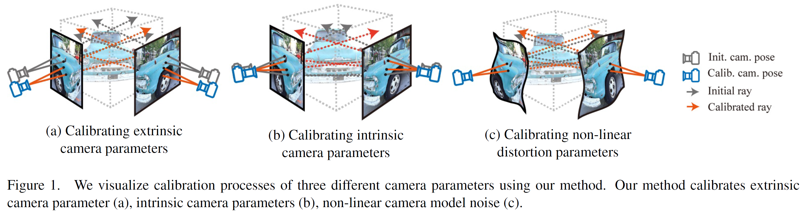
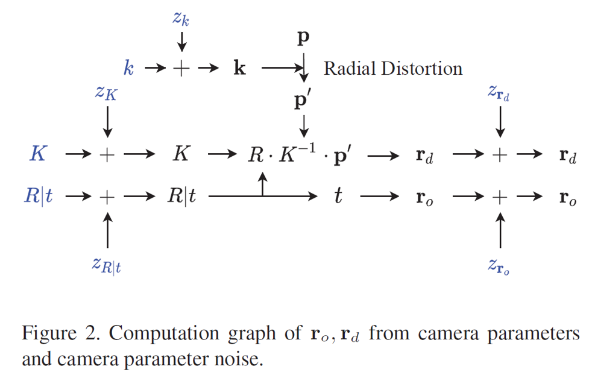
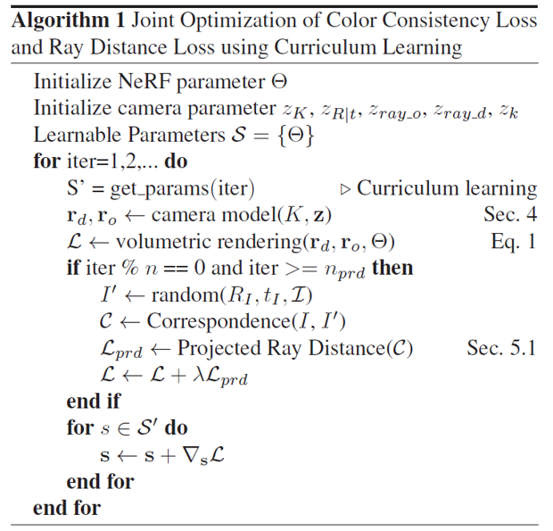
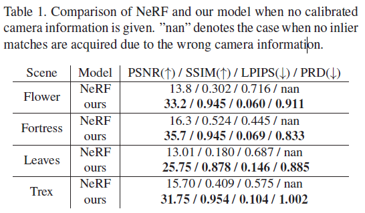
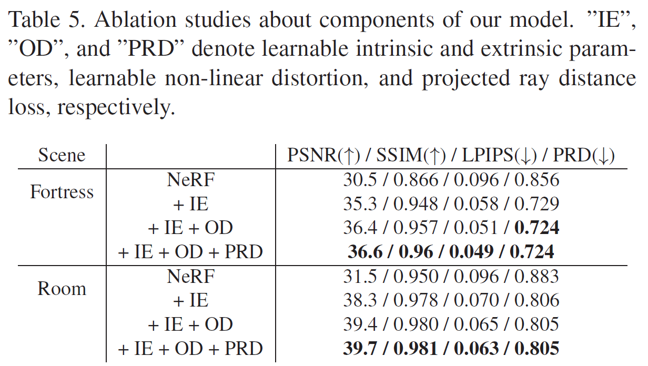
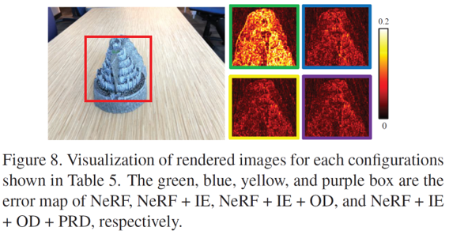

# Self-Calibrating Neural Radiance Fields \[Kor]

## Self-Calibrating Neural Radiance Fields \[Kor]

\*\*\*\*[**English version**](iccv-2021-scnerf-eng.md) of this article is available.

## 1. Problem definition

해당 논문(약칭 SCNeRF) 에서는 하나의 scene을 촬영한 여러장의 이미지가 입력으로주어졌을 때, 이미지를 촬영할 때 사용된 카메라의 intrinsic/extrinsic parameter와 해당 scene의 geometry를 표현하는 Neural Radiance Field 파라미터를 동시에 학습합니다. 일반적으로 카메라의 intrinsic/extrinsic을 추정할 때는 checker board와 같은 calibration pattern을 촬영한 이미지가 필요하지만 해당 논문에서는 calibration pattern을 촬영한 이미지 없이 calibration을 수행이 가능합니다.

수식으로는 아래와 같이 표현할 수 있습니다.

> Find $$K, R, t, k, r_{o}, r_{d}, \theta$$, when
>
> $$\mathbf{r}=(\mathbf{r_o}, \mathbf{r_d})=f_{cam}(K, R, t, k, r_o, r_d)$$
>
> $$\hat{\mathbf{C}}(\mathbf{r})=f_{nerf}(\mathbf{r};\theta)$$

여기서 $$\mathbf{r}$$은ray, $$\mathbf{r_o}$$와 $$\mathbf{r_d}$$는 ray의 origin과 direction, $$f_{cam}$$은 카메라 파라미터로부터 ray를 생성해내는 함수, $$(K,R,t,k,r_o,r_d)$$는 카메라 calibration 파라미터, $$\hat{\mathbf{C}}(\mathbf{r})$$는 ray $$\mathbf{r}$$에 대한 color 추정값, $$\theta$$는 Neural Radiance Field 모델 파라미터, $$f_{nerf}$$는 ray가 주어졌을 때 $$\theta$$를 이용하여 이미지를 rendering하는 함수를 의미합니다.

기존의 방법들은 카메라 파라미터를 알고있다는 가정 하에 scene의 geometry만 학습하거나, scene geometry에 대한 학습 없이 카메라 파라미터만을 학습했다면, 본 논문의 목적은 $$(K,R,t,k,r_o,r_d)$$와 $$\theta$$를 동시에 학습하는 것입니다.

## 2. Motivation

### Related work

#### Camera Model

간결성과 보편성 때문에 기존의 3D vision task 는 핀홀 카메라 모델 가정을 많이 사용해왔습니다. 그러나, 카메라 모델의 발전과 함께 어안렌즈 카메라, 일반화모델 등 다양한 종류의 카메라 모델이 등장했고, 기본적인 핀홀 카메라 모델은 이런 복잡한 형태의 카메라 모델을 표현하는 것에 한계가 존재합니다.

#### Camera Self-Calibration

self-calibration은 카메라 파라미터를 별도의 calibration용 물체(ex 체커보드패턴) 없이도 탐색하고자 하는 연구분야입니다. 많은 경우, calibration 물체를 촬영한 이미지를 구하는 것은 불가능하기 때문에 (예를들어 인터넷에서 크롤링한 이미지 사용하는 경우) calibration 물체가 없이도 camera calibration을 수행하는 self-calibration은 중요한 연구 분야입니다. 하지만, 기존의 self-calibration 방법들은 온전히 geometric loss 에 의존하거나, sparse한 대응점간의 정보만을 이용하는 epipolar geometry에 의존하고 있습니다. 이러한 방법든은 촬영된 scene에 충분한 feature가 존재하지 않을 때 noise에 극도로 민감해져 결과가 발산하고만다는 단점이 존재합니다. 또한 더 정확한 scene의 geometry를 알 수록 더 정확한 카메라 모델을 얻을 수 있음에도 불구하고, 기존의 self-calibration 방법들은 geometry를 개선하거나 학습하는 과정을 포함하지 않습니다.

#### Neural Radiance Fields(NeRF) for Novel View Synthesis

NeRF는 학습시 사용되었던 이미지와는 다른 각도에서 scene을 바라보는 novel view image를 생성해내는 연구이며, 이를 위해 scene마다 별도로 정의되는 network를 학습합니다. scene에 내재된 연속적인 volumetric scene function을 sparse한 입력 이미지들만을 이용하여 학습했다는 데 의의가 있으며, 논문이 공개되었을 당시 NeRF는 novel view systhesis 분야에서 최고의 성능을 보였습니다. 하지만 NeRF를 학습하기 위해서는, 학습하고자 하는 scene의 RGB 이미지 뿐 아니라 각 이미지에 대응되는 카메라 포즈와 카메라 파라미터가 추가적으로 필요합니다.

### Idea

해당 논문에서는

* 핀홀 카메라 모델의 한계를 극복하기 위하여 핀홀 카메라 모델 파라미터 뿐 아니라, 비선형 카메라 왜곡을 표현할 수 있는 파라미터들(4차 방사 왜곡 파라미터, 일반 오차 파라미터)을 학습에 포함하였습니다.
* 기존 self-calibration 방법들이 사용해왔던 geometric loss의 한계를 극복하기 위하여 photometric consistency loss 를 추가적으로 사용하였습니다.
* 개선된 geometry정보를 이용하여 더 정확한 카메라 모델을 얻기 위해, NeRF를 이용해 표현된 geometry가 카메라 파라미터와 함께 학습되었습니다.

## 3. Method

### Differentiable Camera Model

#### Pinhole Camera Model

핀홀 카메라 모델은 동차 좌표계(homogeneous coordinate)로 표현된 3차원 공간상의 4-vector $$P_{4 \times 1}$$를 동차 좌표계로 표현된 이미지 평면상의 3-vector $$P'_{3 \times 1}$$로 변환합니다.  .

$$
P'_{3\times1} = M_{3\times4}P=K_{3\times3}\left[R\; T\right]_{3\times 4} P_{4\times 1}
$$

여기에서 $$K$$는 intrinsics matrix, $$R$$은 회전 행렬(rotation matrix), $$T$$는 이동 행렬(translation matrix)를 의미합니다.

$$K$$를 먼저 살펴보면, $$K$$는 $$K$$의 초기값을 의미하는 매트릭스 $$K_0$$와 $$K$$의 잔차값(residual)을 의미하는 매트릭스 $$\Delta K$$(=$$z_K$$)로 구성됩니다. 이렇게 나누어 구성하는 이유는 국소 최저값(local minima)이 많이 존재하는 intrinsic matrix의 비볼록(non-convex) 특성 때문에, $$K$$가 올바른 값에 수렴할 수 있도록 초기값을 부여하기 위함입니다.

$$
K=\begin{bmatrix} f_x+\Delta f_x & 0 & c_x + \Delta c_x \\ 0 & f_y + \Delta f_y & c_y + \Delta c_y \\ 0 & 0 & 1 \end{bmatrix} = K_0 + \Delta K \in \mathbb{R}^{3\times 3}
$$

$$K$$와 유사하게, 회전 행렬 $$R$$ 이동 행렬 $$T$$ 또한 extrinsic 의 초기값과 각각의 잔차(residual)를 의미하는 매트릭스로 나누어 표현할 수 있습니다. 그러나, 회전 행렬의 경우 구성요소 각각에 대해 잔차(residual)를 계산하는 것은 회전 행렬의 정규직교(orthonormal)한 특성을 파괴합니다. 이를 해결하기 위하여 해당 논문에서는 회전 행렬을 표현하기위해 6-vector 표현방식을 활용합니다. 회전 행렬에 존재하는 2개 열의 값만을 학습하고 마지막 열은 정규직교(orthonormal) 특성을 이용하여 계산하는 방식입니다:

$$
\mathbf{t} = \mathbf{t_0} + \Delta \mathbf{t}\\R=f(\mathbf{a_0}+\Delta \mathbf{a})\\f\begin{pmatrix}\begin{bmatrix} | & | \\ a_1& a_2\\ | & | \end{bmatrix}\end{pmatrix} = \begin{bmatrix}|&|&|\\\mathbf{b_1} & \mathbf{b_2} & \mathbf{b_3}\\| & | & |\end{bmatrix}_{3 \times 3}
$$

여기에서 $$f$$가 하는 역할은 Gram-Schmidt Process와 매우 유사합니다. 이해를 돕기 위하여 $$f$$가 하는 역할을 그림으로 표현해보았으니 아래의 그림을 참고해주세요. 여기에서 $$N(\cdot)$$은 $$L2$$ normalization 을 의미합니다.

그림에서 볼 수 있듯이, 비정규화(unnormalized)상태의 두 벡터 $$\mathbf{a_1}$$,$$\mathbf{a_2}$$로부터 정규직교(orthonormal)한 벡터 $$\mathbf{b_1}, \mathbf{b_2}, \mathbf{b_3}$$를 얻을 수 있다는 것을 확인할 수 있습니다.&#x20;

#### Fourth Order Radial Distortion

상용 렌즈는 우리가 이상적으로 생각하는 렌즈(lens focal length가 하나의 값으로 고정됨)와 다른 특성을 가지기 때문에 다양한 종류의 수차(aberration)를 만들어냅니다. 그 중 가장 흔하게 관찰되는 것은 방사 왜곡(radial distortion)으로 알려져 있습니다. 아래 그림은 흔히 관찰되는 방사 왜곡의 종류를 직관적으로 보여주고 있습니다.

SCNeRF는 이러한 방사 왜곡(radial distortion)에 대처할 수 있도록 흔히 사용되는 4차 방사왜곡 모델을 카메라 모델에 추가하였습니다.

픽셀 좌표 $$(p_x, p_y)$$를 왜곡되기 이전의 정규화(normalized)된 상태의 픽셀 좌표$$(n'_x, n'_y)$$ 로 변환하는 과정은 4차 방사왜곡 모델(4th order radial distortion model)에 의해 아래와 같이 표현할 수 있습니다.

$$
(n_x, n_y) = (\frac{p_x-c_x}{f_x},\frac{p_y-c_y}{f_y})\\r=\sqrt{n^2_x+n^2_y}\\\left[n'_x, n'_y, 1 \right]^T = K^{-1} \left[p_x(1+(k_1+z_{k_1}) r^2 + (k_2+z_{k_2}) r^4), p_y(1+(k_1+z_{k_1}) r^2 + (k_2+z_{k_2}) r^4),1 \right]
$$

여기에서 $$(k_1, k_2)$$는 $$k_0$$로 표기되는 방사 왜곡(radial distortion) 파라미터 초기값을 의미하며, $$(z_{k_1}, z_{k_2})$$는 $$z_k$$로 표기되는 방사 왜곡 파라미터의 잔차값(residual)을 의미합니다.

#### Ray Direction & Origin

Using[#pinhole-camera-model](iccv-2021-scnerf-eng.md#pinhole-camera-model "mention") and [#fourth-order-radial-distortion](iccv-2021-scnerf-eng.md#fourth-order-radial-distortion "mention"), ray direction $$\mathbf{r_d}$$ and ray origin $$\mathbf{r_o}$$ in the world coordinate can be expressed as the following.

$$
\mathbf{r_d} = N(R \cdot \left[n'_x, n'_y, 1 \right]^T)\\\mathbf{r_o}=\mathbf{t}
$$

where $$N(\cdot)$$ is vector normalization. For those who may confuse why $$\mathbf{t}$$ equals the ray origin $$\mathbf{r_o}$$ in the world coordinate, I draw conceptual image that shows the geometric meaning of vector $$\mathbf{t}$$.

Since these ray parameters $$\mathbf{r_d}$$ and $$\mathbf{r_o}$$ are functions of intrinsics, extrinsics, and dirtortion paramameter residuals ($$\Delta f, \Delta c, \Delta a, \Delta t, \Delta k$$), we can pass gradients from the rays to the residuals to optimize the parameters. Note that $$K_0,R_0, t_0, k_0$$are initial values of each parameters and not optimized.

#### Generic Non-Linear Camera Distortion

Complex optical abberations in real lenses cannot be modeled using a parametric camera. For such noise, generic non-linear aberration model is used. Specifically, local ray parameter residuals $$\mathbf{z_d} = \Delta \mathbf{r}_d(\mathbf{p})$$, $$\mathbf{z}_o = \Delta \mathbf{r}_o(\mathbf{p})$$ is used, where $$\mathbf{p}$$ is the image coordinate.

$$
\mathbf{r}'_d = \mathbf{r}_d + \mathbf{z}_d \\\mathbf{r}'_o=\mathbf{r}_o+\mathbf{z}_o
$$

Bilinear interpolation is used to extract continuous ray distortion parameters.

$$
\mathbf{z}_d(\mathbf{p}) = \sum_{x=\lfloor\mathbf{p}_x\rfloor}^{\lfloor\mathbf{p}_x\rfloor+1}\sum_{x=\lfloor\mathbf{p}_y\rfloor}^{\lfloor\mathbf{p}_y\rfloor+1} \left(1-|x-\mathbf{p}_x|\right)\left(1-|y-\mathbf{p}_y|\right)\mathbf{z}_d\left[x,y\right]
$$

where $$\mathbf{z}_d[x, y]$$ indicates the ray direction offset at a control point in discrete 2D coordinate $$(x, y)$$. $$\mathbf{z}_d[x, y]$$ is learned at discrete locations only. Dual comes for free.

$$
\mathbf{z}_o(\mathbf{p}) = \sum_{x=\lfloor\mathbf{p}_x\rfloor}^{\lfloor\mathbf{p}_x\rfloor+1}\sum_{x=\lfloor\mathbf{p}_y\rfloor}^{\lfloor\mathbf{p}_y\rfloor+1} \left(1-|x-\mathbf{p}_x|\right)\left(1-|y-\mathbf{p}_y|\right)\mathbf{z}_o\left[x,y\right]
$$

To help your understanding, the conceptual image of a generic non-linear aberration model is attached below.

 

#### Computational Graph of Ray Direction & origin

From [#pinhole-camera-model](iccv-2021-scnerf-eng.md#pinhole-camera-model "mention"), [#fourth-order-radial-distortion](iccv-2021-scnerf-eng.md#fourth-order-radial-distortion "mention"), [#generic-non-linear-camera-distortion](iccv-2021-scnerf-eng.md#generic-non-linear-camera-distortion "mention"), the final ray direction and ray origin can be expressed using the following graph.

### Loss

To optimize calibration parameters, both geometric consistency loss and photometric consistency loss is exploited.

#### Geometric Consistency Loss

Geometric Consistency Loss is $$d_\pi$$ in the above figure. Let's break this down into pieces.

First, let $$\left(\mathbf{p_A} \leftrightarrow \mathbf{p_B}\right)$$ be a correspondence on camera 1 and 2 respectively. The projected ray distance loss directly measures the discrepancy between rays. When all the camera parameters are calibrated, the ray $$\mathbf{r}_A$$ and $$\mathbf{r}_B$$ should intersect at the 3D point that generated point $$\mathbf{p}_A$$ and $$\mathbf{p}_B$$. However, when there’s a misalignment due to an error in camera parameters, we can measure the deviation by computing the shortest distance between corresponding rays.

Let a point on $$\mathbf{r}_A$$ be $$\mathbf{x}_A(t_A) = \mathbf{r}_{o,A} + t_A\mathbf{r}_{d,A}$$, and a point on $$\mathbf{r}_B$$ be $$\mathbf{x}_B(t_B) = \mathbf{r}_{o,B} + t_A\mathbf{r}_{d,B}$$. A distance between the $$\mathbf{r}_A$$ and a point on the $$\mathbf{r}_B$$ is $$d$$ as we can see in the above figure.

Solving $$\frac{\mathbf{d}d^2}{\mathbf{d}t_B}|_{\hat{t}_B}=0$$ gives us $$\hat{t}_B$$ that makes the distance between $$\mathbf{x}_B$$ and $$\mathbf{r}_A$$ minimum.

$$
\hat{t}_B = \frac{\left(\mathbf{r}_{A,o}-\mathbf{r}_{B,o}\right) \times \mathbf{r}_{A,d}\cdot \left( \mathbf{r}_{A,d} \times \mathbf{r}_{B,d}\right)}{\left(\mathbf{r}_{A,d}\times\mathbf{r}_{B,d}\right)^2}
$$

From this, we can find a point on ray B that has the shortest distance to ray A.

$$
\mathbf{x_B} = \mathbf{x_B}(\hat{t}_B)
$$

Dual comes for free.

$$
\mathbf{x_A} = \mathbf{x_A}(\hat{t}_A)
$$

After projecting the points to image planes and computing distance on the image planes, geometric consistency loss $$d_\pi$$ in the above figure can be obtained, where $$\pi(\cdot)$$ is a projection function.

Note that correspondences for a point far from the cameras would have a large deviation, while correspondences for a point close to the cameras would have a small deviation. Thus, to remove this depth sensitivity, the distance between the two points is computed on the image plane, not 3D space.

#### Photometric Consistency Loss

Photometric consistency loss is defined as the following.

$$
\mathcal{L} = \sum_{\mathbf{p}\in\mathcal{I}}||C(\mathbf{p})-\hat{C}(\mathbf{r(p)})||^2_2
$$

where $$\mathbf{p}$$ is a pixel coordinate, and $$\mathcal{I}$$ is a set of pixel coordinates in an image, $$\hat{C}(\mathbf{r})$$ is the output of the volumetric rendering using the ray $$\mathbf{r}$$ of corresponding pixel $$\mathbf{p}$$, $$C(\mathbf{p})$$ is the ground truth color.

> **HOW TO ESTIMATE** $$\hat{C}(\mathbf{r})$$**?**
>
> The color value $$\mathbf{C}$$ of a ray can be represented as an integral of all colors weighted by the opaqueness along a ray, or can be approximated as the weighted sum of colors at N points along a ray as following.
>
> $$\mathbf{\hat{C}} \approx \sum_i^N\left( \prod_{j=1}^{i-1}\alpha (\mathbf{r}(t_j), \Delta_j) \right)\left( 1-\alpha(t_i, \Delta_i) \right) \mathbf{c}\left( \mathbf{r}(t_i), \mathbf{v} \right)$$
>
> where $$\alpha(\cdot)$$ is transparency, $$\mathbf{c(\cdot)}$$is color, $$\Delta_i = t_{i+1}-t_{i}$$
>
> For those who want to learn more about this equation, please refer the "NeRF" paper in[#reference-and-additional-materials](iccv-2021-scnerf-eng.md#reference-and-additional-materials "mention")

Note that photometric consistency loss is differentiable with respect to the learnable camera parameters. From this, we can define gradients for the camera parameters and ablel to calibrate cameras.

### Curriculum Learning

It is impossible to learn accurate camera parameters when the geometry is unknown or too coarse for self-calibration. Thus, curriculum learning is adopted: geometry and a linear camera model first and complex camera model parameters.

First, NeRF network is trained while initializing the camera focal lengths and focal centers to half the image width and height. Learning coarse geometry first is crucial since it initializes the networks to a more favorable local optimum for learning better camera parameters.

Next, camera parameters for the linear camera model, radial distortion, nonlinear noise of ray direction, and ray origin are sequentially added to the learning.

Following is the final learning algorithm. $$get\_params$$ function returns a set of parameters of the curriculum learning which returns a set of parameters for the curriculum learning which progressively adds complexity to the camera model.

Next, the model is trained with the projected ray distance by selecting a target image at random with sufficient correspondences.

## 4. Experiment & Result

Here, not all but some representative experimental results will be covered.

### Experimental Setup

* **Dataset**
  * <mark style="color:red;">LLFF</mark>
    * 8 scenes
  * Tanks and Temples
    * 4 scenes
  * Custom data collected by the author
    * 6 scenes
    * fish-eye camera
* **Experiments**
  * <mark style="color:red;">Improve over NeRF</mark>
  * Improve over NeRF++
  * Fish-eye Lens Reconstruction
  * <mark style="color:red;">Ablation Study</mark>

In this article, only the dataset and experiment highlighted in red will be covered.

### Improvement over NeRF

 

Table 1 reports the qualities of the rendered images in the training set. Although SCNeRF model does not adopt calibrated camera information, it shows a reliable rendering performance.

SCNeRF model shows better rendering qualities than NeRF when COLMAP initializes the camera information. Table 2 reports the rendering qualities of NeRF and SCNeRF. SCNeRF consistently shows better rendering qualities than the original NeRF.

Following is the visualization of the rendered images.

### Ablation Study

To check the effects of the proposed models, an ablation study is conducted. Each phase is trained for 200K iterations. From this experiment, extending the SCNeRF model with learnable intrinsic and extrinsic parameters(IE), non-linear distortion(OD), and projected ray distance loss(PRD) is more potential for rendering clearer images. However, for some scenes, adopting projected ray distance increases the overall projected ray distance, even though it is not stated in the table.

Following is the visualization of the ablation study.

## 5. Conclusion

### Summary

SCNeRF proposes a self-calibration algorithm that learns geometry and camera parameters jointly end-to-end. The camera model consists of a pinhole model, radial distortion, and non-linear distortion, which capture real noises in lenses. We also propose projected ray distance to improve accuracy, which allows our model to learn fine-grained correspondences. We show that our model learns geometry and camera parameters from scratch when the poses are not given, and our model improves both NeRF to be more robust when camera poses are given.

### Personal Opinion

* In my perspective, this paper is worthy because it shows a way to calibrate camera parameters and neural radiance fields jointly.
* I wonder why the result in the paper reports training set accuracy instead of val/test set accuracy.
* Some errors are noticed in equations and corrected as I think they should be. Please feel free to comment if you find any errors in the equations used in this article.

### Take home message

> SCNeRF learns geometry and camera parameters from scratch w/o poses
>
> SCNeRF uses the camera model consists of a pinhole model, radial distortion, and non-linear distortion
>
> SCNeRF proposed projected ray distance to improve accuracy

## Reviewer information

None

## Reference & Additional materials

1. Citation of this paper
   1. Jeong, Yoonwoo, et al. "Self-calibrating neural radiance fields." _Proceedings of the IEEE/CVF International Conference on Computer Vision_. 2021.
   2. [https://arxiv.org/abs/2108.13826](https://arxiv.org/abs/2108.13826)
2. Official Project Page : [https://postech-cvlab.github.io/SCNeRF/](https://postech-cvlab.github.io/SCNeRF/)
3. Official GitHub repository : [https://github.com/POSTECH-CVLab/SCNeRF](https://github.com/POSTECH-CVLab/SCNeRF)
4. Citation of related work
   1. Mildenhall, Ben, et al. "Nerf: Representing scenes as neural radiance fields for view synthesis." _European conference on computer vision_. Springer, Cham, 2020.
   2. Schops, Thomas, et al. "Why having 10,000 parameters in your camera model is better than twelve." _Proceedings of the IEEE/CVF Conference on Computer Vision and Pattern Recognition_. 2020.
   3. Zhou, Yi, et al. "On the continuity of rotation representations in neural networks." _Proceedings of the IEEE/CVF Conference on Computer Vision and Pattern Recognition_. 2019.
5. Other useful materials
   1. Lens Aberrations : chrome-extension://efaidnbmnnnibpcajpcglclefindmkaj/viewer.html?pdfurl=https%3A%2F%2Fwww.nao.org%2Fwp-content%2Fuploads%2F2020%2F04%2FLens-Aberrations.pdf\&chunk=true
   2. camera models : chrome-extension://efaidnbmnnnibpcajpcglclefindmkaj/viewer.html?pdfurl=https%3A%2F%2Fcvgl.stanford.edu%2Fteaching%2Fcs231a\_winter1415%2Flecture%2Flecture2\_camera\_models\_note.pdf\&clen=4519068\&chunk=true
