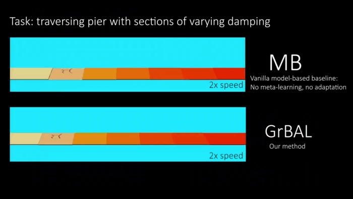

# Learning to Adapt in Dynamic, Real-World Environments Through Meta-Reinforcement Learning \[Kor\]

## 1. Problem definition

본 연구는 강화 학습 방법을 실제 문제에 적용할 때 발생하는 주요 두가지 문제, 즉 샘플을 형성할 때 비용이 매우 많이 든다는 점과, 특정 상황에는 능숙한 대신 예기치 않은 상황에서 실패하는 문제점들을 다룹니다.

대부분의 강화 학습 방법은 Model-free로 많이 처리되는데, 해당 방법으로 예기치 않은 상황을 다루기 위해서는 그만큼의 시뮬레이션 혹은 샘플링 작업이 요구되고 이는 해당 작업의 난이도에 따라 다루지 못할 정도로 증가합니다. 실제 대부분의  real-world 문제들은 Model-free 방법으로 다루기에는 힘들고, 주어진 샘플을 효율적으로 학습할 수 있는 Model-based 방법을 통해 이와 같은 문제를 접근합니다.

## 2. Motivation

### Related work

#### a. Model-based reinforcement learning

기본적으로 강화학습 모델은 주어진 환경에서 보상을 최대한 많이 받게 작업을 수행하도록 설계됩니다.  

_Markov decision process(MDP)_ : $$(S,A,\rho,r,\gamma,\rho_0,H)$$

구체적으로, 해당 식처럼 정의된 마르코프 의사 결정 과정을 고려하여 에이전트가 설계되는데, $S$ 는 가능한 상태들을 모두 모아놓은 집합이고,  $A$ 는 가능한 액션들의 집합, $p(s'|s,a)$ 는 상태 변환 분포, $r: S\times A\rightarrow \mathbb{R}$ 는 가능한 보상의 함수, $\rho_0 : S \rightarrow \mathbb{R}_+$ 는 초기 상태 분포 등을 의미합니다. 강화 학습에 주로 사용되는 trajectory는 $\tau(i,j) := (s_i,a_i,...,s_j,a_j,s_{j+1})$ 으로 표기되며, 최종적으로 해당 trajectory에서 계산된 총 보상값이 리턴값 입니다. 여기까지가 기본적인 강화학습 모델의 구성이며, 각각의 상태에서 총 보상값을 최대화 하기위해 최적의 액션을 고르는 $\pi : S \rightarrow A$ 정책을 찾도록 학습합니다. 

Model-based 강화 학습은 해당 문제를 풀 때, $\pi$ 정책 값이 아닌 강화 학습 환경 그 자체인 $p(s'|s,a)$ 상태 변환 분포를 학습하여 총 보상값을 극대화 합니다. 동적 강화 학습 모델로도 불리는 해당 모델은 근사 함수 $\hat{p}_\theta(s'|s,a)$ 를 통해 관측된 데이터 $D$ 의 log-likelihood 를 최대화 하는 패러미터 $\theta$ 를 찾도록 학습합니다.

#### b. Meta learning

새로운 환경에서 모델을 다룰 때, 매번 새로운 데이터를 학습하여 테스트 하는 것이 아닌 자동적으로 새로운 환경을 학습하여 적응하는 방법이 메타러닝이다.  해당 방법은 이전 작업의 데이터를 활용하여 새로운 작업에 빠르게 적응할 수 있는 학습 절차를 습득합니다. 이러한 방법은 이전의 작업과 새로운 작업이 동일한 작업 분포 $\rho(\mathcal{T})$ 를 가지고, 빠른 학습을 위해 필요한 공통 구조가 있다는 전제 하에 작동합니다. 

기본적인 지도 학습 세팅에서, 목표로 하는 작업에 대한 손실 함수 $L_{\mathcal{T}}$ 를 최소화 하기 위한 함수 $f_\theta$ 의 패러미터 $\theta$ 를 학습합니다. 해당 세팅에서 메타러닝의 목표를 달성하기 위해서는, 다음과 같이 정의된 새로운 작업에서 적용가능한 방법을 찾아야 합니다. 여러 샘플 작업의 손실을 줄이는 방향으로 meta learner $f$의 패러미터 $\theta' = u_\psi (D^{tr}_{\mathcal{T}}, \theta)$ 를 학습해야 하며, 해당 패러미터를 위한 $\theta , \psi$ 의 학습 과정을 다음과 같이 정리할 수 있습니다. 

$$\underset{\theta, \psi}{min} \mathbb{E}_{\mathcal{T} \sim \rho(\mathcal{T})} [\mathcal{L}(\mathcal{D}^{test}_{\mathcal{T}}, \theta')] \ \  s.t. \theta' = u_\psi (\mathcal{D}^{tr}_{\mathcal{T}}, \theta)$$ 

여기서 $\mathcal{D}^{tr}_{\mathcal{T}} , \mathcal{D}^{test}_{\mathcal{T}}$ 는 메타 학습 데이터 $\mathcal{D}_{\mathcal{T}}$ 으로부터 학습, 테스트 용도로 중복 없이 샘플링 된것을 의미합니다. 그리고 메타 학습 과정이 최적화된 $\theta_* , \psi_*$ 패러미터들을 찾은 경우, 습득된 업데이트 함수 $u_\psi (\cdot , \theta)$ 을 통해 적은 양의 데이터로 새로운 작업을 학습할 수 있습니다. 

### Idea

적은 양의 샘플로 효율적으로 학습 가능한 Model-based 강화 학습과 업데이트 함수를 통해 적은 양의 데이터로 새로운 작업을 학습할 수 있는 메타러닝 방법을 함께 사용하여 적은 양의 샘플로 새로운 작업을 학습할 수 있는 메타 Model-based 강화 학습 방법을 제시합니다.

## 3. Method

### Gradient-based meta-learning

Model-based 강화 학습에 메타러닝을 적용하기 위해 사용된 메타러닝 방법에 대해 자세히 알아보자면, 해당 연구는 Gradient Decent 과정이 들어가는 모델에 모두 적용가능한 Model-agnostic meta-learning(MAML) 방법을 사용했습니다. MAML 방법을 통해 여러 작업에 범용적으로 적용되는 internal representation을 설정하고, 최적의 포지션에 모델을 위치시켜 적은 데이터와 업데이트만으로 여러 작업에 좋은 결과를 얻을 수 있습니다. 모든 작업을 관통하는 $\rho(\mathcal{T})$ 의 internal feature를 찾기 위해, 하나의 작업에 과적합(over fitting)하지 않고, 각 gradient step마다 여러 샘플 작업의 손실을 줄이는 방향으로 학습을 진행합니다. 이전에 사용한 공식을 참고하여 MAML 방법을 수식으로 표현하면 다음과 같습니다.

$$u_\psi (\mathcal{D}^{tr}_\mathcal{T}, \theta) = \theta -  \alpha \nabla_\theta \mathcal{L}(\mathcal{D}^{tr}_\mathcal{T}, \theta)$$ 

$\alpha$ 는 학습 비율을 결정하는 hyperparameter이고 해당 업데이트 규칙이 고정되었음에도 불구하고, gradient descent를 통해 과도하게 매개 변수화된 해당 학습 과정을  recurrent network로도 표현 가능합니다.

### Recurrence-based meta-learning

Recurrent network를 통해 메타 러닝을 할 경우, $\psi$ 는 recurrent network의 hidden state를 업데이트 하는 모델의 weights이며, $u_\psi$ 업데이트 함수는 매 스텝마다 학습됩니다. 예측 모델의 패러미터 $\theta$ 는 recurrent network의 나머지 부분과 hidden state를 의미합니다. 다른 논문에서 gradient-based meta-learning과 recurrence-based meta-learning 두가지 모두 model-free 강화학습에 사용되었으나, 본 연구는 Model-based 강화 학습으로 실시간으로 메타 학습하는 방법을 제시합니다.

### Meta-learning for online model adaptation

기존의 메타 러닝 과정은 학습된 습득 모델 $\theta_*, \psi_*$ 과 새로운 작업의 M개의 data points가 필요했다면, gradient-based 기반의 model-based 메타 강화 학습 기법은 에피소드 관점에서 적응에 필요한 M개의 trajectories가 필요합니다. 에피소드 관점에서 생각해보면, 시간에 따라 시스템에 바뀐다든지, 지형 혹은 환경이 바뀐다는거에 따라 같은 에피소드안에서도 서로 다른 태스크가 존재할 수 잇습니다. 따라서 에피소드 관점에서 메타 러닝을 적용할 때는 현재까지 관측한 M 스텝과 미래의 K 스텝을 별도로 취급하여 학습을 진행합니다.

좀 더 세팅을 구체화하기 위해서, 해당 모델은 다른 세팅 혹은 설정을 나타내는 환경을 $\mathcal{E}$ 로 표기합니다. 해당 환경은 오작동 혹은 외부에 의한 노이즈 또한 고려하며, 해당 환경 분포 $\rho(\mathcal{E})$ 는 메타 러닝을 적용하기 위하여 환경에 따른 $p_{\mathcal{E}}(s'|s,a)$ 상태 분포는 다르지만, 가능한 상태 및 액션 셋을 나타내는 $S$ 와 $A$ 는 동일하다고 가정합니다. 환경에 따라 다르게 발생하는 trajectory는 $\tau_{\mathcal{E}}(i,j) = (s_i,a_i,...,s_j,a_j,s_{j+1})$ 로 나타내며, 해당 $j-i$ 길이의 trajectory는 선택된 하나의 환경에서만 발생하였다고 가정합니다. 해당 환경 설정에서, 메타 러닝의 골을 다시 정리하면 predictive model $\hat{p}_{\theta'}(s'|s,a)$ 의 데이터 likelihood가 되고, 패러미터 $\theta'$ 는 현재까지인 환경인 M개의 data points로 업데이트 된 결과 $u_\psi (\tau_{\mathcal{E}} (t-M, t-1), \theta)$ 를 의미한다. 구체적으로 학습되는 과정을 표현하는 수식은 다음과 같습니다.

$$ \underset{\theta,\psi}{min} \ \ \mathbb{E}_{\tau_\mathcal{E} (t-M, t+K) \sim \mathcal{D}}[\mathcal{L}(\tau_\mathcal{E}(t,t+K), \theta'_\mathcal{E})] \ \ s.t.: \theta'_\mathcal{E} = u_\psi(\tau_\mathcal{E}(t-M,t-1), \theta)$$

여기서 $\tau_\mathcal{E} (t-M, t+K) \sim \mathcal{D}$ 는 현재까지 replay에서  샘플링한 trajectory를 의미하고, $\mathcal{L}$ 은 모델에서 발생한 데이터의 negative log likelihood를 의미하고 수식은 다음과 같습니다.

  $$\mathcal{L}(\tau_\mathcal{E}(t,t+K), \theta'_\mathcal{E}) \triangleq -\frac{1}{K} \sum^{t+K}_{k=t} log \hat{p}_{\theta'_{\mathcal{E}}}(s_{k+1}|s_k,a_k)$$

위의 수식에서 메타 러닝의 골 $\theta'$ 를 정의할 때, 현재까지의 M개의 data points는 기존 패러미터 $\theta$ 를 $\theta'$ 로 학습시키는데 사용되었으며, $\theta'$ 에 대한 손실은 다음에 나올 K 개의 data points으로 계산됩니다. 

### Gradient-based adaptive learner(GrBAL) & Recurrence-based adaptive learner (ReBAL) 

앞서 세팅한 모델을 실시간으로 다른 환경에서 학습하기 위해서 gradient-based 학습 기법, 즉 MAML 방법을 학습에 적용하였습니다. MAML 방법을 적용하여 M개의 data points가 아닌 trajectory 관점에서 처리하였을 때, 메타 러닝의 골은 다음과 같습니다.

$$\theta'_\mathcal{E} = u_\psi(\tau_\mathcal{E} (t-M, t-1), \theta) = \theta_\mathcal{E} + \psi \nabla_\theta \ \frac{1}{M} \sum_{m=t-M}^{t-1} \hat{p}_{\theta'_{\mathcal{E}}}(s_{m+1}|s_m,a_m)$$ 

그리고 recurrent network를 이용한 ReBAL의 경우, hidden state를 업데이트하는 recurrent model의 weights가 $\psi$ 가 되고 해당 업데이트 함수가 $u_\psi$ 가 됩니다.

## 4. Experiment & Result

새로운 환경에 제대로 모델이 적응했는지 판단하기 위해서, 다음과 같은 질문들을 통해 실험을 진행하였습니다. $(1)$ 적응을 통해 모델이 변화했는가? $(2)$ 모델의 접근 방식이 학습된 환경 분포 내부와 외부에서 모두 빠르게 적응이 가능한가? $(3)$ 해당 모델의 성능은 다른 모델과 비교해서 어떤가? $(4)$ GrBAL 방법과 ReBAL 방법을 어떻게 비교하는가? $(5)$ 메타 Model-based 강화 학습은 Model-free 강화 학습과 비교하여 효율적인 샘플 사용 여부 및 성능이 어떻게 되는가? $(6)$ 해당 모델은 실제 로봇의 실시간 적응을 염두하여 개발하였는데, 실제로 작동이 가능한가? 총 6가지 항목의 질문을 통하여 모델 평가를 진행하였습니다.

  
  

### Experimental setup

다음과 같은 작업들을 선정하여 메타 모델의 성능을 측정하였습니다.

* **Half-cheetah (HC): disabled joint** $\rightarrow$ x 축 y축의 physical engine 만 사용하는 2d 환경에서 이족 보행하는 half-cheetah 실험 환경에서 랜덤하게 하나의 관절을 회전할 수 없게 고정시키고 학습을 진행합니다. 테스트의 경우, 학습 중에 관측되지 않은 관절을 비활성화하고, 이후 다른 관절을 테스트 중간에 멈추어 보행 성능을 측정합니다. 전자는 학습 환경에서 겪지 못한 새로운 환경에 적응할 수 있는가를 고려하였고, 후자는 변화하는 상태에 빠르게 적응되는가를 고려합니다.
* **HC: sloped terrain** $\rightarrow$ 학습을 진행하면서 랜덤하게 완만한 오르막, 완만한 내리막을 만들어 학습을 진행합니다. 테스트의 경우, 학습과정에서 나오지 않은 급격한 오르막, 급격한 내리막을 만들어 보행 성능을 측정합니다.
* **HC: pier** $\rightarrow$ 서로 다른 랜덤한 밀도를 가진 블록들을 물에 띄웠다는 가정하에 학습을 진행합니다. 테스트의 경우, 특정 밀도를 가진 블록들을 띄워 보행 성능을 측정합니다.
* **Ant: crippled leg** $\rightarrow$ 평범한 3d 환경에서 사족보행을 사용하는 실험 세팅입니다. 랜덤하게 하나의 다리를 못 쓰게 만들면서 학습을 진행하고, 테스트의 경우, 학습 과정에서 일정하게 사용했던 다리를 못 쓰게 만들어 보행 성능을 측정합니다.

다음은 Model-based 메타 강화학습의 성능을 비교하기 위해 사용된 베이스라인 모델들입니다.

* **Model-free RL (TRPO)**: 적응이 잘 되고 있는지 비교하기 위해 model-free 강화 학습 모델 TRPO를 사용하여 $\mathcal{E} \sim \rho(\mathcal{E})$ 에 해당하는 여러 환경에서 학습을 진행했습니다.
* **Model-free meta-RL (MAML-RL)**:  SOTA Model-free 메타 강화학습 기법, MAML-RL 모델로 여러 환경에서 학습을 진행했습니다.
* **Model-based RL (MB)**: Model-free 모델과 유사하게 $\mathcal{E}$ 환경 요소를 신경쓰지 않는 Vanilla 지도 학습 모델을 사용하였습니다. 
* **Model-based RL with dynamic evaluation (MB+DE)**: 위의 모델과 똑같지만, 테스트 할 때 M개의 타임스탬프에 해당하는 gradient값으로 fine tuning하여 모델 성능을 평가하였습니다.

모든 Model-based 강화 학습 기반의 모델들은(MB, MB+DE, GrBAL, and ReBAL) model bootstrapping을 사용하였고, 같은 네트워크 구조 및 같은 Model Prediction 기능을 사용하였습니다.

### Performance and meta-training sample efficiency

해당 실험 모델들이 새로운 환경에서 적은 양의 샘플로도 학습이 가능한지 실험하기 위해, 각 테스트 환경별로 모델별 시간에 따른 평균 리턴 값을 측정하였습니다. 실험 결과, 위에 그림에 보이는 바와 같이 대략 1000배 적은 양의 샘플로 충분한 성능을 확보한 것을 보실 수 있습니다.

### Test-time performance: Online adaptation & Generalization

이번에는 학습을 모두 마친 뒤, 작업별로 실시간 적응 성능을 비교하였습니다. 모든 작업은 동일한 양의 데이터를 사용하여 학습을 진행하였으며, 다양한 환경분포에서 메타 학습을 진행하였습니다. 물론 테스트의 경우, 학습할 때 보지 못한 경우들을 사용하여 성능을 측정하였습니다. 실험 결과, Model-free 방법은 충분한 성능을 확보하기에는 데이터 양이 턱 없이 부족하여 성능이 제일 낮았고, MB+DE는 기존의 MB보다 일반화를 잘했지만 적응이 많이 필요한 작업은 오히려 기존의 MB가 성능이 나았습니다. 그리고 본 연구 내용인 GrBAL, ReBAL은 위에 그림과 같이 기존 베이스라인보다 모두 높은 성능을 달성하여 실시간 적응이 가능함을 보였습니다. 

### Real-world results

본 연구의 결과가 적은 양의 샘플을 효율적으로 학습 가능하고 실시간 적응이 가능하다는 것을 보였기 때문에, 실제 다리가 달린 로봇에도 해당 모델들을 테스트 하였습니다. 비교 베이스라인으로는 Model-free를 제외하고 MB와  MB+DE를 사용하였으며 기존 실험 작업과 유사하게 다리 하나가 작동이 안되는 경우와 지형이 급격히 바뀔 경우 미리 그려놓은 직선을 따라갈 수 있는지 테스트를 진행하였습니다. 시뮬레이션 환경에서 학습한 모델을 사용하는 것이 아닌, 실제 학습 환경을 만들어 새로 학습을 진행하였으며 이에 따른 실제 로봇의 $S$ 와 $A$ 를 모델에 반영하였습니다. 실험 결과, 본 연구의 GrBAL 모델만이 성공적으로 선을  따라가는 것을 보였습니다.

  
  

## 5. Conclusion

* 기존의 Few-shot으로 많이 다루는 메타 러닝 방법과 적은 양의 샘플로 학습을 진행하는 Model-based 강화 학습 두가지 방법의 공통점을 잘 다루어 결과를 정리하였다.
* SOTA Model-free 메타 러닝 기법과 비교해서, 여러 작업에서의 적응 결과 큰 성능 차이를 보였다. 이를 통해 더 많은 real-world 문제를 다룰 수 있는 가능성을 보여주었다.
  

### Take home message \(오늘의 교훈\)

> 단순히 시뮬레이션 환경에서의 실험만으로 연구 결과를 입증한 것이 아닌, 실제 환경에서도 그 성능을 입증하여 매우 흥미로운 논문이었습니다. 

> 이후에 논문에 서술된 시뮬레이션 작업 외에도 더 많은 시뮬레이션 및 실제 로봇에 적용하여 결과를 확인하고 싶습니다.
>

## Author / Reviewer information

### Author

**박준현 \(Junhyeon Park\)**

* KAIST Graduate School of AI
* pjh2941@kaist.ac.kr

### Reviewer

1. Korean name \(English name\): Affiliation / Contact information
2. Korean name \(English name\): Affiliation / Contact information
3. ...

## Reference & Additional materials

1. Nagabandi, Anusha, et al. "Learning to adapt in dynamic, real-world environments through meta-reinforcement learning." *arXiv preprint arXiv:1803.11347* (2018).

2. https://github.com/iclavera/learning_to_adapt
3. Finn, Chelsea, Pieter Abbeel, and Sergey Levine. "Model-agnostic meta-learning for fast adaptation of deep networks." *International conference on machine learning*. PMLR, 2017.

