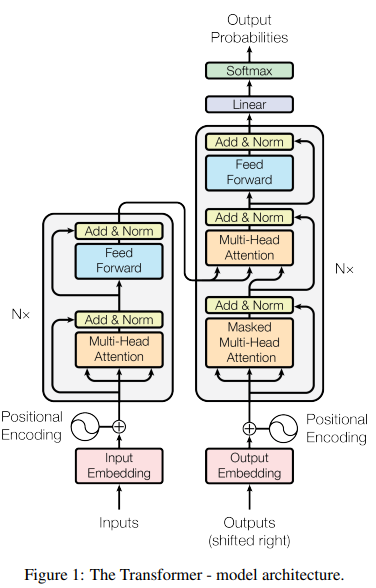
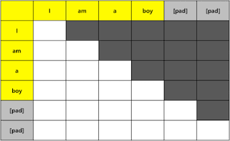
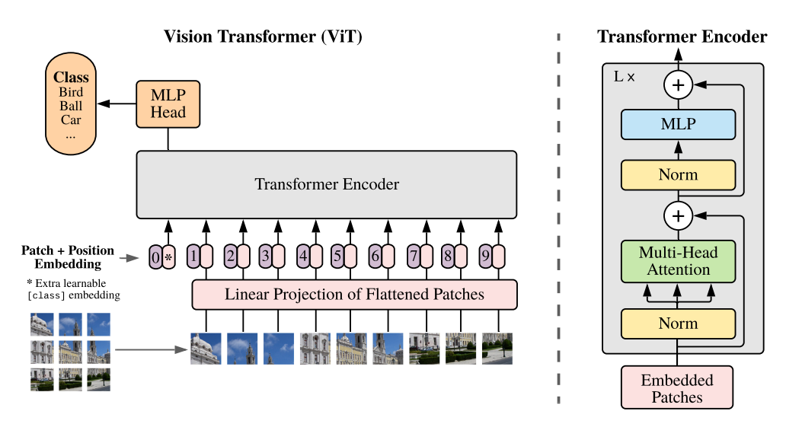
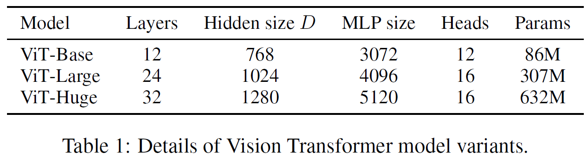
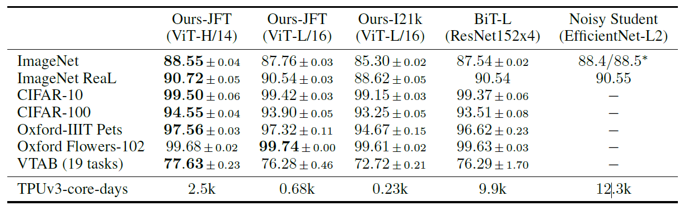
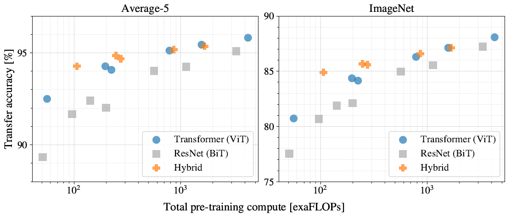
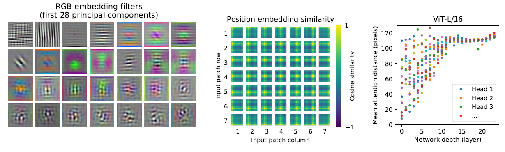
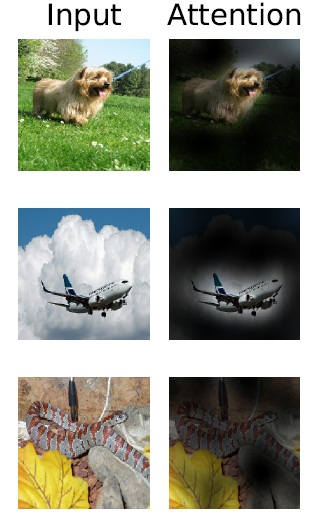

---
Dosovitskiy et al. / An Image is Worth 16*16 Words: Transformers for Image Recognition at Scale / ICLR 2021
---

# An Image is Worth 16*16 Words: Transformers for Image Recognition at Scale \[English]

##  1. Problem definition

Transformers, which are based on self-attention architecture, are widely used in NLP due to its efficiency and scalability. However, in computer vision convolutional models are widely used, since the number of parameters are too big to directly apply the Transformer model to individual pixels. 
This paper is consisted of two parts: a way to apply the self-attention structure in computer vision and performance comparison with CNN-based models on specific datasets and environments. Thus the problem definition would be as follows: can we build a self-attention based model adequate for vision tasks (ex. image classification) that can show significant performance compared to SotA CNN models?

## 2. Motivation

### Related work

* Transformers (_Vaswani et al. / Attention Is All You Need / NIPS 2017_)

	* The Transformer architecture is formulated with an encoder-decoder structure similar to variational autoencoders.
	* Encoder
		* There are N number of identical layers, the initial input passing the first layer and the output passing the next layer, and so on. 
		* Each layer is consisted of two sub-layers, the multi-head self-attention layer and position-wise fully connected feed-forward network.
		* Residual connection and layer normalization are used in each sub-layer such that the output of each layer is _LayerNorm(x + Sublayer(x))_. (_Sublayer(x)_ is the function corresponding to each sublayer).  In order to perform residual connection, all sublayers and embedding layers have the same dimension. 
	* Decoder
		* Like the encoder, the decoder is consisted of N number of identical layers.
		* A third sublayer is added which performs multi-head attention to the output of the encoder. Residual connection and layer normalization is identically used in the decoder.

		* Unlike the encoder, the decoder alters the self-attention layer to prevent each position from using information of subsequent positions, in other words, making sure the prediction for the _i_-th position can only depend on previous outputs of positions less than _i_. This technique is commonly referred to as _masking_. 
	* For more detailed explanations on recurrent neural networks and the self-attention architecture itself, please refer to  

		_Sherstinsky, Alex / Fundamentals of Recurrent Neural Network (RNN) and Long Short-Term Memory (LSTM) Network / Elseviser 2021_  

		as well as the original paper above.

### Idea

In order to reduce the number of parameters, the authors propose to split images into fixed-size patches, and by linearly embedding each of them with positional informations, we can feed the resulting vectors to a standard transformer encoder. 

## 3. Method

### Vision Transformer (ViT) 
* Embedding
	* In order to process 2D images into 1D token embeddings, the original input image $x∈ \mathbb{R}^{H×W×C}$ is split into a sequence of flattened 2D patches  $x_p∈ \mathbb{R}^{N×(P^2·C)}$.
		* $(P, P)$: Resolution of Image Patch
		* $N$:  Number of Patches ($=HW/P^2$)
		* $D$: Fixed dimension size for all sub-layers
	* The flattened patches are then mapped to D dimensions with a trainable linear projection (_E_). The output of the projection will be referred as the patch embeddings. $$z_0 = [x_{class}; x ^1_{p}E; x ^2_{p}E; · · · ; x ^N_{p}E] + E_{pos}, E ∈ \mathbb{R}^{(P^2·C)×D}, E_{pos} ∈ \mathbb{R}^{(N+1)×D}$$

* Class Token
	* Like the class token similar to BERT, a learnable embedding is appended to the sequence of patch embeddings. ($z^0_0 = x_{class}$)
	* $z^0_L$, the state of the token at the output of the encoder, serves as the predicted image class $y$.
$$y = LN(z^0_L)$$
	* A classification head is attached to z^0_L for pre-training and fine-tuning. 
		* Pre-training: 2-layered MLP
		* Fine-tuning: 1 linear layer

* Positional Embedding
	* To give positional information for each patch, positional embeddings are attached to the patch embeddings.
	* 1D position embeddings are used instead of 2D as no significant performance gain was witnessed.

* Transformer Encoder
	* The original transformer encoder consists of N number of identical blocks of multiheaded self-attention layers and feed-forward neural networks as discussed in **Related Works**.  $$z'_l = MSA(LN(z_{l−1})) + z_{l−1}, l = 1 . . . L $$ $$z_l = MLP(LN(z'_l)) + z'_l, l = 1 . . . L $$
	* In ViT, layer normalization (LN) is applied before every block and residual connections after every block.

* Inductive bias
	* Unlike CNN which assumes locality, 2D neighborhood structure, and translation equivariance, ViT has much less image-specific induction bias.
		* MLP Layer: Locality & Equivariance assumed.
		* Self-attention Layer: Global 
	* The 2D neighborhood structure is only used when cutting the patches and at fine-tuning time. The position embeddings at initialization hold no information of the 2D positions of the patches nor the spatial relations.

* Hybrid Architecture
	* Instead of using image patches, we can use the feature maps of a CNN architecture.
	* In this case, the patches are replaced with a pretrained CNN feature map, flattened, and projected to D dimension similar to the original architecture.

## 4. Experiment & Result

* Dataset
	* ImageNet-1k (1k classes and 1.3M images) 
	* ImageNet-21k (21k classes and 14M images)
	* JFT (18k classes and 303M high-resolution images)
* Model Structure
	* ViT

		* ViT-Base, ViT-Large, ViT-Huge
		ex) ViT-Large/16 : "Large" number of parameters and 16 × 16 input patch
	* Baseline (CNNs)
		* ResNet, replacing the Batch Normalization layers with Group Normalization, and use standardized convolutions (BiT)
* Training setup
	* Hyper-parameter
		* Optimizer: Adam ($\beta_1=0.9, \beta_2=0.999$)
		* Batch size: 4096
		* Weight Decay: 0.1
* Fine-tuning
	* Hyper-parameter
		* Optimizer: SGD
		* Batch size: 512
		* 
* Evaluation metric
	* Fine-tuning accuracy
		* Capture the performance of each model after fine-tuning
	* Few-shot accuracy
		* Obtained by solving a regularized LS regression problem (used only when fine-tuning is too costly)
		* Map the representation $y$ for each image in the batch to $\{-1,1\}^K$ target vectors then calculate the accuracy in closed form.  

### Result
* Comparison to SotA Baseline model
	* Vit-H/14 & Vit-L/16 vs. BiT-L & Noisy Student

		* Noisy Student is SoTA on ImageNet-1k and BiT-L on all other datasets (CIFAR-10, CIFAR-100, VTABetc.)
		* The models are pre-trained on either JFT or ImageNet-21k and tested on benchmark datasets for classification accuracy. 
 
		* This can be also checked by the figure on performance versus pre-training compute for each model. The x-axis denotes the pre-training cost (computation time) while the y-axis denotes classification accuracy. ViTs generally outperform ResNets with the same computational budget. For smaller model sizes, Hybrids show better performance upon pure Transformers but the gap close when the model size grows.

* Inspection on Vision Transformers

	* Left Figure: Filters of the initial linear embedding of RGB values of ViT-L/32
		* Recall the first layer of ViT linearly projects the flattened patches to a fixed low-dimensional space.
		* The principal components of the learned embedded filters perform similar tasks to the CNN filters.
	* Mid Figure: Similarity between position embeddings
		* Recall ViT adds position embedding to the projected embedded vector sequence.
		* Patches with  closer distance show higher similarity, implying the spatial information is properly trained
	* Right Figure: Size of attended area by head and network depth
		* Self-attention allows ViT to integrate information across the entire image.
		* Attention distance is calculated by the average distance in image space across which information is integrated, based on the attention weights.
		* We can check that some heads attend to most of the image (the whole image globally) in the lowest layers, showing that it incorporates information globally rather than locally compared to CNN.  

	* The model attends to regions that are semantically relevant for classification.

## 5. Conclusion

The somewhat simple idea of applying the Transformer architecture to computer vision tasks created a massive repercussion to the Academia due to its massive performance on big datasets such as ImageNet/CIFAR-100/etc. The key difference of ViT to CNN is that it does not employ inital induction biases in training. In small-sized datasets CNN usually outperforms ViT but in large-sized datasets with high number of classes, the bias-free architecture and generalization power of the self-attention model shines. After its publication, majority of generative models utilizing an encoder-decoder structure utilize ViT, displaying how much influence ViT had in multiple fields.

### Take home message \(오늘의 교훈\)

> An image is truly worth 16 × 16 words, which was striking for most of us. How about videos? :)

## Author / Reviewer information


You don't need to provide the reviewer information at the draft submission stage.


### Author

**윤여동 \(Yeo Dong Youn\)** 

* KAIST AI
* Mainly working on generative models, specifically representation learning
* E-mail: yeodong@kaist.ac.kr

### Reviewer

1. Korean name \(English name\): Affiliation / Contact information
2. Korean name \(English name\): Affiliation / Contact information
3. ...

## Reference & Additional materials

1. Citation of this paper

     	article{DBLP:journals/corr/abs-2010-11929, 
     	author = {Alexey Dosovitskiy et al.},
        title = {An Image is Worth 16x16 Words: Transformers for Image Recognition at Scale},
		journal   = {CoRR},
	    volume    = {abs/2010.11929},
	    year      = {2020}}

2. Official GitHub repository [(Link)](https://github.com/google-research/vision_transformer)

3. Citation of related work
	**BERT**

		article{DBLP:journals/corr/abs-1810-04805,
		author    = {Jacob Devlin et al.},
        title     = {{BERT:} Pre-training of Deep Bidirectional Transformers for Language
               Understanding},
        journal   = {CoRR},
        volume    = {abs/1810.04805},
        year      = {2018}
        }
 
	**Attention is all you need**

		article{DBLP:journals/corr/VaswaniSPUJGKP17,
		author    = {Ashish Vaswani et al.},
		title     = {Attention Is All You Need},
        journal   = {CoRR},
		volume    = {abs/1706.03762},
		year      = {2017}
		}
